## A1. 两数之和

难度 `简单`

#### 题目描述

给定一个整数数组 `nums` 和一个目标值 `target`，请你在该数组中找出和为目标值的那 **两个** 整数，并返回他们的数组下标。

你可以假设每种输入只会对应一个答案。但是，你不能重复利用这个数组中同样的元素。

> **示例:**

```
给定 nums = [2, 7, 11, 15], target = 9

因为 nums[0] + nums[1] = 2 + 7 = 9
所以返回 [0, 1]
```

#### 题目链接

<https://leetcode-cn.com/problems/two-sum/>

#### 思路  

　　用一个字典记录数值与下标的映射。遍历`nums`，如果字典中存在`target - num`这个数（且下标与`num`下标不同），则返回这两个数的下标。  

#### 代码  
```python
class Solution:
    def twoSum(self, nums: List[int], target: int) -> List[int]:
        s = {}
        for i, num in enumerate(nums):
            if target - num in s:
                return [i, s[target - num]]

            s[num] = i
         
```

## A3. 无重复字符的最长子串

难度 `中等`  

#### 题目描述

给定一个字符串，请你找出其中不含有重复字符的 **最长子串** 的长度。

> **示例 1:**

```
输入: "abcabcbb"
输出: 3 
解释: 因为无重复字符的最长子串是 "abc"，所以其长度为 3。
```

> **示例 2:**

```
输入: "bbbbb"
输出: 1
解释: 因为无重复字符的最长子串是 "b"，所以其长度为 1。
```

> **示例 3:**

```
输入: "pwwkew"
输出: 3
解释: 因为无重复字符的最长子串是 "wke"，所以其长度为 3。
     请注意，你的答案必须是 子串 的长度，"pwke" 是一个子序列，不是子串。
```

#### 题目链接

<https://leetcode-cn.com/problems/longest-substring-without-repeating-characters/>

#### 思路  

　　使用双指针滑动窗口的方法。`j`向前遍历，`i`指向重复的位置（`i`只会向右移动），在`j`遍历的同时用一个字典记下`每个字母最后出现的下标`，`j - i + 1`的最大值即为结果。  

#### 代码  

```python
class Solution:
    def lengthOfLongestSubstring(self, s: str) -> int:
        count = defaultdict(int)
        ans = 0
        left = 0
        for right, char in enumerate(s):
            count[char] += 1
            while count[char] > 1:
                count[s[left]] -= 1
                left += 1 

            ans = max(ans, right-left+1)

        return ans
         
```


## A4. 寻找两个有序数组的中位数

难度 `困难`

#### 题目描述

给定两个大小为 m 和 n 的有序数组 `nums1` 和 `nums2`。

请你找出这两个有序数组的中位数，并且要求算法的时间复杂度为 O(log(m + n))。

你可以假设 `nums1` 和 `nums2` 不会同时为空。

> **示例 1:**

```
nums1 = [1, 3]
nums2 = [2]

则中位数是 2.0
```

> **示例 2:**

```
nums1 = [1, 2]
nums2 = [3, 4]

则中位数是 (2 + 3)/2 = 2.5
```

#### 题目链接

<https://leetcode-cn.com/problems/median-of-two-sorted-arrays/>

#### **思路**

　　① 构建一个新函数`findk`，用于查找`nums1`和`nums2`中第`k`小的数。    

　　② 无论数组长度为奇数还是偶数，中位数都可以用第`(n + 1) // 2`小的数和第`(n + 2) // 2`小的数的均值来表示。  

　　③ findk使用二分法查询，来达到`O(log(m + n))`的时间复杂度。  

#### **代码**

```python
class Solution:
    def findMedianSortedArrays(self, nums1: List[int], nums2: List[int]) -> float:
        def findk(nums1, nums2, k):
            if not nums1: return nums2[k-1]
            if not nums2: return nums1[k-1]
            if k == 1: return min(nums1[0], nums2[0])

            mid1 = nums1[k // 2 - 1] if k // 2 - 1 < len(nums1) else float('inf')
            mid2 = nums2[k // 2 - 1] if k // 2 - 1 < len(nums2) else float('inf')

            if mid1 < mid2:
                return findk(nums1[k // 2:], nums2, k - k // 2)
            else:
                return findk(nums1, nums2[k // 2:], k - k // 2) 

        n = len(nums1) + len(nums2)
        c1 = (n + 1) // 2
        c2 = (n + 2) // 2
        # print(c1, c2)
        return (findk(nums1, nums2, c1) + findk(nums1, nums2, c2)) / 2

        
```


## A5. 最长回文子串

难度 `中等`  

#### 题目描述

给定一个字符串 `s`，找到 `s` 中最长的回文子串。你可以假设 `s` 的最大长度为 1000。

**示例 1：**

```
输入: "babad"
输出: "bab"
注意: "aba" 也是一个有效答案。
```

**示例 2：**

```
输入: "cbbd"
输出: "bb"
```

#### 题目链接

<https://leetcode-cn.com/problems/longest-palindromic-substring/>

#### 思路  

　　**方法一：**中心扩展法。

　　遍历一遍字符串`s`，以字符`s[i]`分别作为奇数和偶数中心向两边扩展。

　　如果扩展的回文串大于之前最长的长度`maximum`，则更新`maximum`和结果字符串`ans`。　

　　时间复杂度`O(n^2)`。

　　**方法二：**马拉车算法。时间复杂度`O(n)`。

#### 代码  

　　**方法一：**(中心扩展法)

```python
class Solution:
    def longestPalindrome(self, s: str) -> str:
        ans = ''
        n = len(s)
        for c in range(n):  # 奇中心
            i = 0
            # [c-i: c+i] 不能超过整个字符串的范围
            while c - i >= 0 and c + i < n:
                if s[c - i] == s[c + i]:
                    if 2 * i + 1 > len(ans):
                        ans = s[c-i: c+i+1]
                    i += 1
                else:
                    break

        for c in range(n-1):  # 偶中心
            i = 0
            while c - i >= 0 and c + i < n - 1:
                if s[c - i] == s[c + i + 1]:
                    if 2 * i + 2 > len(ans):
                        ans = s[c-i: c+i+2]
                    i += 1
                else:
                    break

        return ans
```

　　**方法二：**(马拉车算法)

```python
class Solution:
    def longestPalindrome(self, s: str) -> str:
        s = '#' + '#'.join(s) + '#' # 字符串处理，用特殊字符隔离字符串，方便处理偶数子串
        lens = len(s)
        p = [0] * lens            # p[i]表示i作中心的最长回文子串的半径，初始化p[i]
        mx = 0                    # 之前最长回文子串的右边界
        id = 0                    # 之前最长回文子串的中心位置
        for i in range(lens):     # 遍历字符串
            if mx > i:
                p[i] = min(mx-i, p[int(2*id-i)]) #由理论分析得到
            else :                # mx <= i
                p[i] = 1
            while i-p[i] >= 0 and i+p[i] < lens and s[i-p[i]] == s[i+p[i]]:  # 满足回文条件的情况下
                p[i] += 1  # 两边扩展
            if(i+p[i]) > mx:  # 新子串右边界超过了之前最长子串右边界
                mx, id = i+p[i], i # 移动之前最长回文子串的中心位置和边界，继续向右匹配
        i_res = p.index(max(p)) # 获取最终最长子串中心位置
        s_res = s[i_res-(p[i_res]-1):i_res+p[i_res]] #获取最终最长子串，带"#"
        return s_res.replace('#', '')  # 长度为：max(p)-1
```

## A6. Z 字形变换

#### 题目描述

将一个给定字符串根据给定的行数，以从上往下、从左到右进行 Z 字形排列。

比如输入字符串为 `"LEETCODEISHIRING"` 行数为 3 时，排列如下：

```
L   C   I   R
E T O E S I I G
E   D   H   N
```

之后，你的输出需要从左往右逐行读取，产生出一个新的字符串，比如：`"LCIRETOESIIGEDHN"`。

请你实现这个将字符串进行指定行数变换的函数：

```
string convert(string s, int numRows);
```

> **示例 1:**

```
输入: s = "LEETCODEISHIRING", numRows = 3
输出: "LCIRETOESIIGEDHN"
```

> **示例 2:**

```
输入: s = "LEETCODEISHIRING", numRows = 4
输出: "LDREOEIIECIHNTSG"
解释:

L     D     R
E   O E   I I
E C   I H   N
T     S     G
```

#### 题目链接

<https://leetcode-cn.com/problems/zigzag-conversion/>

#### **思路:**

　　找规律法，经观察发现，除了第一行和最后一行外，每一行的下一个数，要么就是从底下拐(经过`2*(numRows-1-i)`个字母)，要么就是从上面拐(经过`2*i`个字母), 用flag作为标记，是否从底下拐。

#### **代码:**

```c
/*
    执行用时 : 0 ms, 在所有 cpp 提交中击败了 100% 的用户
    内存消耗 : 10.2 MB, 在所有 cpp 提交中击败了 91.73% 的用户
*/

string convert(string s, int numRows) {
    if (numRows==1) return s;
    string ans = "";
    for(int i =0;i<numRows;i++){
        int j=i;
        bool flag=true;  // flag为true表示从底下拐，否则从上面拐
        if (i==numRows-1)flag = false;  // 第一行总是true 最后一行总是false 
        while(j<s.size()){
            ans += s[j];
            if (flag){
                j += 2*(numRows-1-i);
                if (i!=0) flag=false; // 第一行总是true
            }else{
                j+= 2 * i;
                if (i!=numRows-1) flag = true; // 最后一行总是false 
            }
        }
    }

    return ans;
}
```

## A8. 字符串转换整数 (atoi)

难度 `中等`  

#### 题目描述

请你来实现一个 `atoi` 函数，使其能将字符串转换成整数。

首先，该函数会根据需要丢弃无用的开头空格字符，直到寻找到第一个非空格的字符为止。

当我们寻找到的第一个非空字符为正或者负号时，则将该符号与之后面尽可能多的连续数字组合起来，作为该整数的正负号；假如第一个非空字符是数字，则直接将其与之后连续的数字字符组合起来，形成整数。

该字符串除了有效的整数部分之后也可能会存在多余的字符，这些字符可以被忽略，它们对于函数不应该造成影响。

注意：假如该字符串中的第一个非空格字符不是一个有效整数字符、字符串为空或字符串仅包含空白字符时，则你的函数不需要进行转换。

在任何情况下，若函数不能进行有效的转换时，请返回 0。

**说明：**

假设我们的环境只能存储 32 位大小的有符号整数，那么其数值范围为 [−231,  231 − 1]。如果数值超过这个范围，请返回  INT_MAX (231 − 1) 或 INT_MIN (−231) 。

> **示例 1:**

```
输入: "42"
输出: 42
```

> **示例 2:**

```
输入: "   -42"
输出: -42
解释: 第一个非空白字符为 '-', 它是一个负号。
     我们尽可能将负号与后面所有连续出现的数字组合起来，最后得到 -42 。
```

> **示例 3:**

```
输入: "4193 with words"
输出: 4193
解释: 转换截止于数字 '3' ，因为它的下一个字符不为数字。
```

> **示例 4:**

```
输入: "words and 987"
输出: 0
解释: 第一个非空字符是 'w', 但它不是数字或正、负号。
     因此无法执行有效的转换。
```

> **示例 5:**

```
输入: "-91283472332"
输出: -2147483648
解释: 数字 "-91283472332" 超过 32 位有符号整数范围。 
     因此返回 INT_MIN (−231) 。
```

#### 题目链接

<https://leetcode-cn.com/problems/string-to-integer-atoi/>

#### 思路  

　　这题建议用C++做，Python由于没有整数范围只能面向测试用例编程。  

#### 代码  

```python
class Solution:
    def myAtoi(self, str: str) -> int:
        str = str.lstrip(' ')  # 去掉开头空格
        factor = 1  # 正数
        if str.startswith('-'):
            str = str[1:]
            factor = -1
        elif str.startswith('+'):
            str = str[1:]

        for i, s in enumerate(str):
            if not s.isdigit():  # 不是数字就退出
                str = str[:i]
                break
        
        try:
            num = factor * int(str)

            if num < -2147483648:
                return -2147483648
            elif num > 2147483647:
                return 2147483647
            return num
        except:
            return 0
```

## A10. 正则表达式匹配

难度 `困难`  

#### 题目描述

给你一个字符串 `s` 和一个字符规律 `p`，请你来实现一个支持 `'.'` 和 `'*'` 的正则表达式匹配。

```
'.' 匹配任意单个字符
'*' 匹配零个或多个前面的那一个元素
```

所谓匹配，是要涵盖 **整个** 字符串 `s`的，而不是部分字符串。

**说明:**

- `s` 可能为空，且只包含从 `a-z` 的小写字母。
- `p` 可能为空，且只包含从 `a-z` 的小写字母，以及字符 `.` 和 `*`。

> **示例 1:**

```
输入:
s = "aa"
p = "a"
输出: false
解释: "a" 无法匹配 "aa" 整个字符串。
```

> **示例 2:**

```
输入:
s = "aa"
p = "a*"
输出: true
解释: 因为 '*' 代表可以匹配零个或多个前面的那一个元素, 在这里前面的元素就是 'a'。因此，字符串 "aa" 可被视为 'a' 重复了一次。
```

> **示例 3:**

```
输入:
s = "ab"
p = ".*"
输出: true
解释: ".*" 表示可匹配零个或多个（'*'）任意字符（'.'）。
```

> **示例 4:**

```
输入:
s = "aab"
p = "c*a*b"
输出: true
解释: 因为 '*' 表示零个或多个，这里 'c' 为 0 个, 'a' 被重复一次。因此可以匹配字符串 "aab"。
```

> **示例 5:**

```
输入:
s = "mississippi"
p = "mis*is*p*."
输出: false
```

#### 题目链接

<https://leetcode-cn.com/problems/regular-expression-matching/>

#### 思路  

　　动态规划。用，`dp[i][j]`记录`s[:i]`能否匹配`p[:j]`。  

　　先处理`s`为空的情况。空字符串能匹配空字符串，另外只有当`p[:j]`为`"a*b*c*.*d*"`这样全是`"?*"`的时候才能匹配空字符串。  

　　`".*"`匹配`0~n`个任意字符，转移方程`dp[i][j] = dp[i-1][j] or dp[i][j-1]`；   

　　类似地，`"a*"`匹配`0~n`个`a`，转移方程`dp[i][j] = (dp[i-1][j] and s[i-1] == p[j-1]) or dp[i][j-1]`；  

　　普通`"."`的转移方程`dp[i][j] = dp[i-1][j-1]`；

　　普通字母的转移方程`dp[i][j] = dp[i-1][j-1] and s[i-1] == p[j-1]`。  

　　注意`".*"`和`"a*"`占了两个字符的位置，所以代码中用`dp[i][j+1]`。  

#### 代码  

```python
class Solution:
    def isMatch(self, s: str, p: str) -> bool:
        np = len(p)
        ns = len(s)
        dp = [[False for _ in range(np+1)] for _ in range(ns+1)]
        # dp[i][j] 表示s[:i]匹配p[:j]
        dp[0][0] = True

        for j in range(1, np+1):
            if p[j-1] == '*':  # s='' 匹配 p='a*b*c*'
                dp[0][j] = dp[0][j-2]
            
        for i in range(1, ns+1):
            for j in range(1, np+1):
                if p[j-1] == '.':  # ab a.
                    dp[i][j] = dp[i-1][j-1] 
                elif p[j-1] == '*':
                    if p[j-2] == '.':  # .*     abcasdad a.*
                        dp[i][j] = dp[i-1][j] or dp[i][j-2]
                    else:  # a*  baaaaaaa ba*
                        dp[i][j] = (s[i-1]==p[j-2] and dp[i-1][j]) or dp[i][j-2]
                else:  # 字母
                    dp[i][j] = dp[i-1][j-1] and  s[i-1] == p[j-1]
        # print(dp)
        return dp[-1][-1]
```

## A11. 盛最多水的容器

难度 `中等`

#### 题目描述

给你 *n* 个非负整数 *a*1，*a*2，...，*a*n，每个数代表坐标中的一个点 (*i*, *ai*) 。在坐标内画 *n* 条垂直线，垂直线 *i* 的两个端点分别为 (*i*, *ai*) 和 (*i*, 0)。找出其中的两条线，使得它们与 *x* 轴共同构成的容器可以容纳最多的水。

**说明：**你不能倾斜容器，且 *n* 的值至少为 2。

 


图中垂直线代表输入数组 [1,8,6,2,5,4,8,3,7]。在此情况下，容器能够容纳水（表示为蓝色部分）的最大值为 49。

 

**示例：**

```
输入：[1,8,6,2,5,4,8,3,7]
输出：49
```

#### 题目链接

<https://leetcode-cn.com/problems/container-with-most-water/>

#### 思路  

　　双指针，初始时设头指针和尾指针分别为`a`和`b`。我们能够发现不管是左指针向右移动一位，还是右指针向左移动一位，容器的底都是一样的，都比原来减少了 1。这种情况下我们想要让指针移动后的容器面积增大，就要使移动后的容器的高尽量大，所以我们选择指针所指的高较小的那个指针进行移动，这样我们就保留了容器较高的那条边，放弃了较小的那条边，以获得有更高的边的机会。

#### 代码  

```python
class Solution:
    def maxArea(self, height: List[int]) -> int:
        n = len(height)
        a, b = 0, n-1
        ans = 0
        while a != b:
            new = min(height[a], height[b]) * (b-a)
            ans = max(ans, new)

            if height[a] < height[b]:
                a += 1
            else:
                b -= 1
        return ans

```

## A12. 整数转罗马数字

难度 `中等`  

#### 题目描述

罗马数字包含以下七种字符： `I`， `V`， `X`， `L`，`C`，`D` 和 `M`。

```
字符          数值
I             1
V             5
X             10
L             50
C             100
D             500
M             1000
```

例如， 罗马数字 2 写做 `II` ，即为两个并列的 1。12 写做 `XII` ，即为 `X` + `II` 。 27 写做  `XXVII`, 即为 `XX` + `V` + `II` 。

通常情况下，罗马数字中小的数字在大的数字的右边。但也存在特例，例如 4 不写做 `IIII`，而是 `IV`。数字 1 在数字 5 的左边，所表示的数等于大数 5 减小数 1 得到的数值 4 。同样地，数字 9 表示为 `IX`。这个特殊的规则只适用于以下六种情况：

- `I` 可以放在 `V` (5) 和 `X` (10) 的左边，来表示 4 和 9。
- `X` 可以放在 `L` (50) 和 `C` (100) 的左边，来表示 40 和 90。 
- `C` 可以放在 `D` (500) 和 `M` (1000) 的左边，来表示 400 和 900。

给定一个整数，将其转为罗马数字。输入确保在 1 到 3999 的范围内。

> **示例 1:**

```
输入: 3
输出: "III"
```

> **示例 2:**

```
输入: 4
输出: "IV"
```

> **示例 3:**

```
输入: 9
输出: "IX"
```

> **示例 4:**

```
输入: 58
输出: "LVIII"
解释: L = 50, V = 5, III = 3.
```

> **示例 5:**

```
输入: 1994
输出: "MCMXCIV"
解释: M = 1000, CM = 900, XC = 90, IV = 4.
```

#### 题目链接

<https://leetcode-cn.com/problems/integer-to-roman/>

#### 思路  

　　千位、百位十位和个位的规则具有一致性，可以写成一个函数。  

#### 代码  

```python
class Solution:
    def intToRoman(self, num: int) -> str:
        ans = ''
        def helper(digit, five, one, ten):
            nonlocal ans
            if digit <= 3:
                ans += one * digit
            elif digit == 4:
                ans += one + five
            elif digit <= 8:
                ans += five + one * (digit - 5)
            elif digit == 9:
                ans += one + ten
            
        helper(num // 1000, '', 'M', '')
        helper(num % 1000 // 100, 'D', 'C', 'M')
        helper(num % 100 // 10, 'L', 'X', 'C')
        helper(num % 10, 'V', 'I', 'X')

        return ans

```

## A13. 罗马数字转整数

难度 `简单`  

#### 题目描述

罗马数字包含以下七种字符: `I`， `V`， `X`， `L`，`C`，`D` 和 `M`。

```
字符          数值
I             1
V             5
X             10
L             50
C             100
D             500
M             1000
```

例如， 罗马数字 2 写做 `II` ，即为两个并列的 1。12 写做 `XII` ，即为 `X` + `II` 。 27 写做  `XXVII`, 即为 `XX` + `V` + `II` 。

通常情况下，罗马数字中小的数字在大的数字的右边。但也存在特例，例如 4 不写做 `IIII`，而是 `IV`。数字 1 在数字 5 的左边，所表示的数等于大数 5 减小数 1 得到的数值 4 。同样地，数字 9 表示为 `IX`。这个特殊的规则只适用于以下六种情况：

- `I` 可以放在 `V` (5) 和 `X` (10) 的左边，来表示 4 和 9。
- `X` 可以放在 `L` (50) 和 `C` (100) 的左边，来表示 40 和 90。 
- `C` 可以放在 `D` (500) 和 `M` (1000) 的左边，来表示 400 和 900。

给定一个罗马数字，将其转换成整数。输入确保在 1 到 3999 的范围内。

> **示例 1:**

```
输入: "III"
输出: 3
```

> **示例 2:**

```
输入: "IV"
输出: 4
```

> **示例 3:**

```
输入: "IX"
输出: 9
```

> **示例 4:**

```
输入: "LVIII"
输出: 58
解释: L = 50, V= 5, III = 3.
```

> **示例 5:**

```
输入: "MCMXCIV"
输出: 1994
解释: M = 1000, CM = 900, XC = 90, IV = 4.
```

#### 题目链接

<https://leetcode-cn.com/problems/roman-to-integer/>

#### 思路  


　　这题懂了就非常简单。首先建立一个字典来映射符号和值，然后对字符串从左到右来，如果`当前字符代表的值不小于其右边`，就加上该值；否则就减去该值。以此类推到最左边的数，最终得到的结果即是答案。  

#### 代码  

```python
class Solution:
    def romanToInt(self, s: str) -> int:
        f = {'I': 1,
             'V': 5,
             'X': 10,
             'L': 50,
             'C': 100,
             'D': 500,
             'M': 1000
        }
        ans = 0
        for i, char in enumerate(s):
            if i == len(s) - 1 or f[char] >= f[s[i+1]]:
                ans += f[char]
            else:
                ans -= f[char]
                
        return ans
```

## A14. 最长公共前缀

难度 `简单`  

#### 题目描述

编写一个函数来查找字符串数组中的最长公共前缀。

如果不存在公共前缀，返回空字符串 `""`。

> **示例 1:**

```
输入: ["flower","flow","flight"]
输出: "fl"
```

> **示例 2:**

```
输入: ["dog","racecar","car"]
输出: ""
解释: 输入不存在公共前缀。
```

**说明:**

所有输入只包含小写字母 `a-z` 。

#### 题目链接

<https://leetcode-cn.com/problems/longest-common-prefix/>

#### 思路  

　　先找最短字符的长度`n`，然后从`0 ~ n`逐列扫描，如果有不同的就退出循环。如下图所示：  

　　

#### 代码  

```python
class Solution:
    def longestCommonPrefix(self, strs: List[str]) -> str:
        if not strs: return ''
        n = min([len(s) for s in strs])
        ans = 0

        for i in range(n):
            char = strs[0][i]
            for s in strs:
                if s[i] != char:
                    return strs[0][:i]
         
        return strs[0][:n]
      
```

## A15. 三数之和

难度 `中等`

#### 题目描述

给你一个包含 *n* 个整数的数组 `nums`，判断 `nums` 中是否存在三个元素 *a，b，c ，*使得 *a + b + c =* 0 ？请你找出所有满足条件且不重复的三元组。

**注意：**答案中不可以包含重复的三元组。

 

> **示例：**

```
给定数组 nums = [-1, 0, 1, 2, -1, -4]，

满足要求的三元组集合为：
[
  [-1, 0, 1],
  [-1, -1, 2]
]
```

#### 题目链接

<https://leetcode-cn.com/problems/3sum/>


#### 思路  

　　记录每个数字出现的次数，多于2个的数只保留2个(可以优化运行速度)。  
　　将三个数记为`a, b, 0-a-b`，枚举`a`和`b`，然后在counter中检查是否还有`0-a-b`。

#### 代码  
```python
class Solution:
    def threeSum(self, nums: List[int]) -> List[List[int]]:
        ans = set()
        count = Counter(nums)
        temp = []  # 优化，多于2个的数只保留2个
        for k, v in count.items():
            temp.append(k)
            if v >= 2:
                temp.append(k)

        n = len(temp)
        for i in range(n):
             for j in range(n):
                if i == j:
                    continue
                a = temp[i]
                b = temp[j]
                c = 0 - a - b

                count_c = count[c]
                if a == c: count_c -= 1
                if b == c: count_c -= 1
                if count_c:
                    ans.add(tuple(sorted([a, b, c])))

        return [list(tp) for tp in ans]

```

## A16. 最接近的三数之和

难度 `中等`

#### 题目描述

给定一个包括 *n* 个整数的数组 `nums` 和 一个目标值 `target`。找出 `nums` 中的三个整数，使得它们的和与 `target` 最接近。返回这三个数的和。假定每组输入只存在唯一答案。

```
例如，给定数组 nums = [-1，2，1，-4], 和 target = 1.

与 target 最接近的三个数的和为 2. (-1 + 2 + 1 = 2).
```

#### 题目链接

<https://leetcode-cn.com/problems/3sum-closest/>


#### 思路  

　　维护两个集合`ones`和`twos`，前者记录不重复的数，后者通过遍历`ones`来记录任意两个数相加的和。  

　　令`delta`表示任意三个数和target之差的最小值。对于`nums`中的新的一个数字`num`，如果和`twos`中的某个数和与`target`之差小于`delta`，则更新`delta`和`ans`。`num`和`one`中所有数字的和会被加入到`twos`中。

#### 代码  
```python
class Solution:
    def threeSumClosest(self, nums: List[int], target: int) -> int:
        delta = 9999999
        ans = -1
        ones = set()
        twos = set()
        for num in nums:
            for two in twos:  # 任意两数之和的集合
                if abs(two + num - target) < delta:
                    delta = abs(two + num - target)
                    ans = two + num
            for one in ones:  # 新数num和ones中的每个数字相加，并放入twos中
                twos.add(one+num)
            ones.add(num)  # 新数放入ones中

        return ans
```

## A17. 电话号码的字母组合

难度 `中等`  

#### 题目描述

给定一个仅包含数字 `2-9` 的字符串，返回所有它能表示的字母组合。

给出数字到字母的映射如下（与电话按键相同）。注意 1 不对应任何字母。

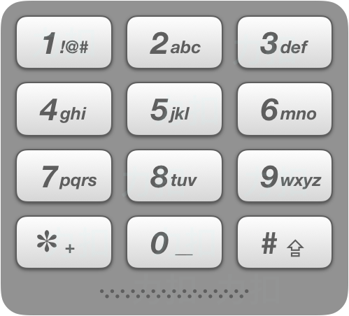

> **示例:**

```
输入："23"
输出：["ad", "ae", "af", "bd", "be", "bf", "cd", "ce", "cf"].
```

**说明:**
尽管上面的答案是按字典序排列的，但是你可以任意选择答案输出的顺序。

#### 题目链接

<https://leetcode-cn.com/problems/letter-combinations-of-a-phone-number/>

#### 思路  


　　用一个**滚动数组**记录之前的结果。下一个数字的所有字母，添加到之前的所有结果上。  

#### 代码  

```python
class Solution:
    def letterCombinations(self, digits: str) -> List[str]:
        f = ['', '', 'abc', 'def', 'ghi', 'jkl', 'mno', 'pqrs', 'tuv', 'wxyz']
        if not digits: return []
        
        ans = ['']
        for digit in digits:
            temp = []
            for a in ans:
                for alpha in f[int(digit)]:  # 下一个数字的所有字母 添加到之前的所有结果上
                    temp.append(a + alpha)

            ans = temp

        return ans

```

## A19. 删除链表的倒数第N个节点

难度`中等`

#### 题目描述

给定一个链表，删除链表的倒数第 *n* 个节点，并且返回链表的头结点。

> **示例：**

```
给定一个链表: 1->2->3->4->5, 和 n = 2.

当删除了倒数第二个节点后，链表变为 1->2->3->5.
```

**说明：**

给定的 *n* 保证是有效的。

**进阶：**

你能尝试使用一趟扫描实现吗？


#### 题目链接

<https://leetcode-cn.com/problems/remove-nth-node-from-end-of-list/>

#### **思路:**


　　快慢指针，快指针先走n步，然后快慢一起走，直到快指针走到最后，慢指针的位置就是要删除的位置。要注意的是可能是要删除第一个结点，这个时候可以直接返回`head -> next`。  

#### **代码:**

```python
class Solution:
    def removeNthFromEnd(self, head: ListNode, n: int) -> ListNode:
        if not head or not n:
            return head

        fast = slow = head
        for _ in range(n):
            fast = fast.next
        if not fast:  # 删除头结点
            return head.next

        while fast.next:
            fast = fast.next
            slow = slow.next
        #  此时的slow是要删除结点的前一个结点
        slow.next = slow.next.next

        return head


```

## A20. 有效的括号

难度 `简单`  

#### 题目描述

给定一个只包括 `'('`，`')'`，`'{'`，`'}'`，`'['`，`']'` 的字符串，判断字符串是否有效。

有效字符串需满足：

1. 左括号必须用相同类型的右括号闭合。
2. 左括号必须以正确的顺序闭合。

注意空字符串可被认为是有效字符串。

> **示例 1:**

```
输入: "()"
输出: true
```

> **示例 2:**

```
输入: "()[]{}"
输出: true
```

> **示例 3:**

```
输入: "(]"
输出: false
```

> **示例 4:**

```
输入: "([)]"
输出: false
```

> **示例 5:**

```
输入: "{[]}"
输出: true
```

#### 题目链接

<https://leetcode-cn.com/problems/valid-parentheses/>

#### 思路  

　　堆栈，如果为左括号(`{ [ (`)就入栈，如果为右括号则判断能否和`栈顶元素`闭合。  

　　注意`”([])"`也可以，并不是必须大括号套中括号套小括号。 

　　**注意：**字符用完时栈必须为空，否则无效。

#### 代码  

```python
class Solution:
    def isValid(self, s: str) -> bool:
        stack = []
        f = {'(': 1, '[': 2, '{': 3, ')': -1, ']': -2, '}': -3}
        for char in s:
            if f[char] > 0:
                stack.append(f[char])
            else:
                if not stack or stack[-1] + f[char] != 0: 
                    return False
                stack.pop()

        return len(stack) == 0
            
```

## A21. 合并两个有序链表

难度`简单`

#### 题目描述

将两个升序链表合并为一个新的 **升序** 链表并返回。新链表是通过拼接给定的两个链表的所有节点组成的。 

> **示例 1：**

```
输入：l1 = [1,2,4], l2 = [1,3,4]
输出：[1,1,2,3,4,4]
```

> **示例 2：**

```
输入：l1 = [], l2 = []
输出：[]
```

> **示例 3：**

```
输入：l1 = [], l2 = [0]
输出：[0]
```

**提示：**

- 两个链表的节点数目范围是 `[0, 50]`
- `-100 <= Node.val <= 100`
- `l1` 和 `l2` 均按 **非递减顺序** 排列

#### 题目链接

<https://leetcode-cn.com/problems/merge-two-sorted-lists/>

#### **思路:**

　　递归。
　　

#### **代码:**

```python
class Solution:
    def mergeTwoLists(self, l1: ListNode, l2: ListNode) -> ListNode:
        if not l1: return l2
        if not l2: return l1
        if l1.val <= l2.val:
            l1.next = self.mergeTwoLists(l1.next, l2)
            return l1
        else:
            l2.next = self.mergeTwoLists(l2.next, l1)
            return l2
          
```

## A22. 括号生成

难度 `中等`  
#### 题目描述

给出 *n* 代表生成括号的对数，请你写出一个函数，使其能够生成所有可能的并且**有效的**括号组合。

例如，给出 *n* = 3，生成结果为：

```
[
  "((()))",
  "(()())",
  "(())()",
  "()(())",
  "()()()"
]
```

#### 题目链接

<https://leetcode-cn.com/problems/generate-parentheses/>


#### 思路  


　　dfs。在搜索的过程中注意满足以下两个条件：  

　　① 当前右括号的数量不能大于左括号的数量；  

　　② 左括号的数量不能大于`n`。  

#### 代码  
```python
class Solution:
    def generateParenthesis(self, n: int) -> List[str]:
        stack = []
        temp = []
        ans = []
        def dfs(i):  # 0, n*2-1            
            if i >= n * 2:
                if len(stack) == 0:
                    ans.append(''.join(temp))
                return

            if i <= 2 * n-1:
                stack.append('(')
                temp.append('(')
                dfs(i+1)
                stack.pop()
                temp.pop()

            if stack:
                temp.append(')')
                stack.pop()
                dfs(i+1)
                stack.append('(')
                temp.pop()

        dfs(0)
        return ans    
```

## A23. 合并K个排序链表

难度`困难`

#### 题目描述

合并 *k* 个排序链表，返回合并后的排序链表。请分析和描述算法的复杂度。

> **示例:**

```
输入:
[
  1->4->5,
  1->3->4,
  2->6
]
输出: 1->1->2->3->4->4->5->6
```


#### 题目链接

<https://leetcode-cn.com/problems/merge-k-sorted-lists/>

#### **思路:**

　　分治法，当只有一个链表时直接返回。否则：  

　　① 合并左半边的链表，记为`left`；  

　　② 合并右半边的链表，记为`right`；  

　　③ 合并`left`和`right`(参考[合并两个有序链表](/实用模板?id=合并两个有序链表递归))。  

　　时间复杂度`O(nlog(k))`，`n`是所有链表中元素的总和，`k`是链表个数。  

#### **代码:**

```python
class Solution:
    def merge(self, l1: ListNode, l2: ListNode) -> ListNode:  # 合并两个链表
        if not l1: return l2
        if not l2: return l1
        if l1.val <= l2.val:
            l1.next = self.merge(l1.next, l2)
            return l1
        else:
            l2.next = self.merge(l2.next, l1)
            return l2

    def mergeKLists(self, lists: List[ListNode]) -> ListNode:
        n = len(lists)
        if not n:
            return

        if n == 1:  # 只有一个，不用合并
            return lists[0]

        mid = n // 2  # 至少为1
        left = self.mergeKLists(lists[:mid])
        right = self.mergeKLists(lists[mid:])
        return self.merge(left, right)

```

## A24. 两两交换链表中的节点

难度`中等`

#### 题目描述

给定一个链表，两两交换其中相邻的节点，并返回交换后的链表。

**你不能只是单纯的改变节点内部的值**，而是需要实际的进行节点交换。

> **示例:**

```
给定 1->2->3->4, 你应该返回 2->1->4->3.
```

#### 题目链接

<https://leetcode-cn.com/problems/swap-nodes-in-pairs/>

#### **思路:**

　　可以用递归来做，先交换前两个结点，然后递归地处理后面的链表。  

#### **代码:**

```python
class Solution:
    def swapPairs(self, head: ListNode) -> ListNode:
        if not head or not head.next:
            return head

        p, q = head, head.next
        p.next, q.next = q.next, p  # 将 p->q 交换为 q->p

        p.next = self.swapPairs(p.next)

        return q

```

## A25. K 个一组翻转链表

难度`困难`

#### 题目描述

给你一个链表，每 *k* 个节点一组进行翻转，请你返回翻转后的链表。

*k* 是一个正整数，它的值小于或等于链表的长度。

如果节点总数不是 *k* 的整数倍，那么请将最后剩余的节点保持原有顺序。

> **示例：**

给你这个链表：`1->2->3->4->5`

当 *k* = 2 时，应当返回: `2->1->4->3->5`

当 *k* = 3 时，应当返回: `3->2->1->4->5`
**说明：**

- 你的算法只能使用常数的额外空间。
- **你不能只是单纯的改变节点内部的值**，而是需要实际进行节点交换。

#### 题目链接

<https://leetcode-cn.com/problems/reverse-nodes-in-k-group/>

#### **思路:**

　　先将前`k`个结点翻转，然后递归地对后面的链表进行处理。  

#### **代码:**

```python
class Solution:
    def reverseKGroup(self, head: ListNode, k: int) -> ListNode:
        if k <= 1:
            return head
        node = head
        for _ in range(k):
            if not node:
                return head
            node = node.next

        rever = None
        node = head
        for _ in range(k):
            node.next, rever, node = rever, node, node.next

        temp = rever
        for _ in range(k-1):
            temp = temp.next

        temp.next = self.reverseKGroup(node, k)

        return rever

```

## A26. 删除排序数组中的重复项

难度 `简单`

#### 题目描述

给定一个排序数组，你需要在 **原地** 删除重复出现的元素，使得每个元素只出现一次，返回移除后数组的新长度。

不要使用额外的数组空间，你必须在 **原地 修改输入数组** 并在使用 O(1) 额外空间的条件下完成。

 

> **示例 1:**

```
给定数组 nums = [1,1,2], 

函数应该返回新的长度 2, 并且原数组 nums 的前两个元素被修改为 1, 2。 

你不需要考虑数组中超出新长度后面的元素。
```

> **示例 2:**

```
给定 nums = [0,0,1,1,1,2,2,3,3,4],

函数应该返回新的长度 5, 并且原数组 nums 的前五个元素被修改为 0, 1, 2, 3, 4。

你不需要考虑数组中超出新长度后面的元素。
```

#### 题目链接

<https://leetcode-cn.com/problems/remove-duplicates-from-sorted-array/>


#### 思路  


　　用`None`标记重复的数。然后将不是`None`的元素放在最前面。

#### 代码  
```python
class Solution:
    def removeDuplicates(self, nums: List[int]) -> int:
        n = len(nums)
        for i in range(n-1):
            if nums[i] == nums[i+1]:
                nums[i] = None

        cur = 0
        for i in range(n):
            if nums[i] is not None:
                nums[cur] = nums[i]
                cur += 1

        return cur
```

## A27. 移除元素

难度 `简单`

#### 题目描述

给你一个数组 *nums* 和一个值 *val* ，你需要 **原地** 移除所有数值等于 *val* 的元素，并返回移除后数组的新长度。

不要使用额外的数组空间，你必须仅使用 O(1) 额外空间并 **原地 修改输入数组**。

元素的顺序可以改变。你不需要考虑数组中超出新长度后面的元素。

 

> **示例 1:**

```
给定 nums = [3,2,2,3], val = 3,

函数应该返回新的长度 2, 并且 nums 中的前两个元素均为 2。

你不需要考虑数组中超出新长度后面的元素。
```

> **示例 2:**

```
给定 nums = [0,1,2,2,3,0,4,2], val = 2,

函数应该返回新的长度 5, 并且 nums 中的前五个元素为 0, 1, 3, 0, 4。

注意这五个元素可为任意顺序。

你不需要考虑数组中超出新长度后面的元素。
```

#### 题目链接

<https://leetcode-cn.com/problems/remove-element/>


#### 思路  


　　见代码。

#### 代码  
```python
class Solution:
    def removeElement(self, nums: List[int], val: int) -> int:
        cur = 0
        n = len(nums)
        for i in range(n):
            if nums[i] == val:
                pass
            else:
                nums[cur] = nums[i]
                cur += 1

        return cur
```

## A29. 两数相除

难度`中等`

#### 题目描述

给定两个整数，被除数 `dividend` 和除数 `divisor`。将两数相除，要求不使用乘法、除法和 mod 运算符。

返回被除数 `dividend` 除以除数 `divisor` 得到的商。

整数除法的结果应当截去（`truncate`）其小数部分，例如：`truncate(8.345) = 8` 以及 `truncate(-2.7335) = -2`

> **示例 1:**

```
输入: dividend = 10, divisor = 3
输出: 3
解释: 10/3 = truncate(3.33333..) = truncate(3) = 3
```

> **示例 2:**

```
输入: dividend = 7, divisor = -3
输出: -2
解释: 7/-3 = truncate(-2.33333..) = -2
```

**提示：**

- 被除数和除数均为 32 位有符号整数。
- 除数不为 0。
- 假设我们的环境只能存储 32 位有符号整数，其数值范围是 [−231,  231 − 1]。本题中，如果除法结果溢出，则返回 231 − 1。

#### 题目链接

<https://leetcode-cn.com/problems/divide-two-integers/>

#### **思路:**

　　模拟除法的过程。  

#### **代码:**

```python
class Solution:
    def divide(self, dividend: int, divisor: int) -> int:
        if dividend * divisor < 0:
            factor = -1
        else: 
            factor = 1

        dividend = abs(dividend)
        divisor = abs(divisor)

        ans = ''
        mod = '0'
        for i, d in enumerate(str(dividend)):
            nxt = int(mod + d)  # 将被除数的一位拿下来 加到余数上
            div, mod = divmod(nxt, divisor)
            ans += str(div)
            mod = str(mod)        

        if not ans: ans = '0'
        ans = factor * int(ans)
        ans = min(ans, 2**31 - 1)
        ans = max(ans, -2**31 )

        return ans
```

## A30. 串联所有单词的子串

难度 `困难`  

#### 题目描述

给定一个字符串 **s** 和一些长度相同的单词 **words。**找出 **s** 中恰好可以由 **words** 中所有单词串联形成的子串的起始位置。

注意子串要与 **words** 中的单词完全匹配，中间不能有其他字符，但不需要考虑 **words** 中单词串联的顺序。

> **示例 1：**

```
输入：
  s = "barfoothefoobarman",
  words = ["foo","bar"]
输出：[0,9]
解释：
从索引 0 和 9 开始的子串分别是 "barfoo" 和 "foobar" 。
输出的顺序不重要, [9,0] 也是有效答案。
```

> **示例 2：**

```
输入：
  s = "wordgoodgoodgoodbestword",
  words = ["word","good","best","word"]
输出：[]
```

#### 题目链接

<https://leetcode-cn.com/problems/substring-with-concatenation-of-all-words/>

#### 思路  

　　注意题目中单词的长度是`相同的` 。  
　　因为`words`中的单词是可以重复的，用一个字典记录`words`中每个单词出现的次数，然后再用递归来匹配。

#### 代码  

```python
class Solution:
    def findSubstring(self, s: str, words: List[str]) -> List[int]:
        ans = []
        count = Counter(words)

        word_len = len(words[0])
        n = word_len * len(words)
        
        for i in range(len(s) - n + 1):
            temp = count.copy()
            sub = s[i: i+n]  # 子串
            for j in range(0, n, word_len):
                word = sub[j: j+word_len]  # 把子串拆分成单词
                if word not in temp or temp[word] == 0:
                    break
                temp[word] -= 1
            else:
                ans.append(i)

        return ans
```

## A31. 下一个排列

难度 `中等`

#### 题目描述

实现获取下一个排列的函数，算法需要将给定数字序列重新排列成字典序中下一个更大的排列。

如果不存在下一个更大的排列，则将数字重新排列成最小的排列（即升序排列）。

必须**原地**修改，只允许使用额外常数空间。

以下是一些例子，输入位于左侧列，其相应输出位于右侧列。
`1,2,3` → `1,3,2`
`3,2,1` → `1,2,3`
`1,1,5` → `1,5,1`

#### 题目链接

<https://leetcode-cn.com/problems/next-permutation/>


#### 思路  


　　其实就是从数组倒着查找，找到`nums[i]`比`nums[i+1]`小的时候，就将`nums[i]`和`nums[i+1:]`中比`nums[i]`大的**最小的数**和`nums[i]`交换，然后再把`nums[i+1:]`排序就ok了🙆‍♂️。

#### 代码  
```python
class Solution:
    def nextPermutation(self, nums: List[int]) -> None:
        """
        Do not return anything, modify nums in-place instead.
        """
        if len(nums) <= 1:
            return nums
        
        l = len(nums)
        i, j = 0, 0  # 下标为i和下标为j的数交换

        for i in range(l-2, -1, -1):
            if nums[i+1] > nums[i]:
                break
            elif i == 0:
                i = -1

        if i == -1:
            nums[:] = sorted(nums)[:]  # 这里直接用sorted了，因为排序是可以实现额外空间O(1)的，(如冒泡排序等)
        else:
            exchange = float('inf')
            for k, num in enumerate(nums[i+1:]):
                if num > nums[i] and num < exchange:  # 找到比nums[i]大的最小的数
                    exchange = num
                    j = k + i + 1
            nums[i], nums[j] = nums[j], nums[i]  # 下标为i和下标为j的数交换
            nums[i+1:] = sorted(nums[i+1:])
```

## A32. 最长有效括号

难度 `困难`  
#### 题目描述

给定一个只包含 `'('` 和 `')'` 的字符串，找出最长的包含有效括号的子串的长度。

> **示例 1:**

```
输入: "(()"
输出: 2
解释: 最长有效括号子串为 "()"
```

> **示例 2:**

```
输入: ")()())"
输出: 4
解释: 最长有效括号子串为 "()()"
```

#### 题目链接

<https://leetcode-cn.com/problems/longest-valid-parentheses/>


#### 思路  

　　方法一：对字符串遍历，进行括弧有效性验证，出现`(`时候`symbol_count`+`1`，出现`')'`时`symbol_count`-`1`，记录`symbol_count`为`0`时的最大长度。同样的方式，倒序再来一次，取最大值。  

　　方法二：动态规划。`dp[i]`表示以`i`结尾的最长有效括号长度。


　　如上图所示，假设`dp[i]`=`6`。那么计算`dp[i+1]`时，如果遇到`')'`，会到`pre`(即`i-dp[i]`)的位置寻找`'('`，如果找到了，则`dp[i+1]`=`dp[i]`+`2`=`8`。并且还要把`pre`之前的也考虑上，即`dp[i+1]`+=`dp[pre - 1]`=`8 + 2`=`10`。  

　　方法三：① 用一个栈记录下标，栈的第一个元素记录的是起始位置的**前一个**，初始为`[-1]`。② 元素为`'('`时入栈，为`')'`时出栈。③ 如果出栈后栈空了(右括号数多于左括号)则将当前元素下标放在栈的第一个。  

#### 代码  

　　方法一：

```python
class Solution:
    def longestValidParentheses(self, s: str) -> int:
        def helper(s, symbol):  # '(' or ')'
            ans = 0
            symbol_count = 0
            cur_length = 0
            for char in s:
                cur_length += 1
                if char == symbol:
                    symbol_count += 1
                else:
                    symbol_count -= 1
                    if symbol_count < 0:
                        symbol_count = 0
                        cur_length = 0
                    elif symbol_count == 0: 
                        ans = max(ans, cur_length)
            return ans

        return max(helper(s, '('), helper(s[::-1], ')'))
```

　　方法二：

```python
class Solution:
    def longestValidParentheses(self, s: str) -> int:
        n = len(s)
        if n == 0:
            return 0
        dp = [0 for i in range(n)]
        for i in range(1, n):
            char = s[i]
            if char == ')':
                pre = i - dp[i-1] -1
                if pre >= 0 and s[pre] == '(':
                    dp[i] = dp[i-1] + 2
                    if pre > 0:
                        dp[i] += dp[pre - 1]

        return max(dp)
```

　　方法三：

```python
class Solution:
    def longestValidParentheses(self, s: str) -> int:
        stack = [-1]
        ans = 0
        for i, char in enumerate(s):
            if char == '(':
                stack.append(i)
            elif char == ')':
                stack.pop()
                if not stack:
                    stack.append(i)
                else:
                    ans = max(ans, i-stack[-1])

        return ans
```

## A33. 搜索旋转排序数组

难度 `中等`

#### 题目描述

假设按照升序排序的数组在预先未知的某个点上进行了旋转。

( 例如，数组 `[0,1,2,4,5,6,7]` 可能变为 `[4,5,6,7,0,1,2]` )。

搜索一个给定的目标值，如果数组中存在这个目标值，则返回它的索引，否则返回 `-1` 。

你可以假设数组中不存在重复的元素。

你的算法时间复杂度必须是 *O*(log *n*) 级别。

> **示例 1:**

```
输入: nums = [4,5,6,7,0,1,2], target = 0
输出: 4
```

> **示例 2:**

```
输入: nums = [4,5,6,7,0,1,2], target = 3
输出: -1
```

#### 题目链接

<https://leetcode-cn.com/problems/search-in-rotated-sorted-array/>


#### 思路  

　　`nums`从中间切一半，必然有一半是有序的，另一半是无序的，对有序的一半二分查找，对无序的一半递归调用该算法。  
　　如果第一个数`nums[i]` 小于中间的数`nums[mid]`，则左半边有序，否则右半边有序。  

#### 代码  
```python
class Solution:
    def search(self, nums: List[int], target: int) -> int:
        def dfs(i, j): 
            if j - i <= 1:
                if nums[i] == target: return i
                if nums[j] == target: return j
                return -1 

            mid = (i + j) // 2  # 4 7 2
            if nums[i] < nums[mid]:  # 左边有序
                idx = bisearch(i, mid)  # 二分左边
                if idx != -1:
                    return idx
                return dfs(mid, j)  # 递归右边

            else:  # 右边有序
                idx = bisearch(mid, j)  # 二分右边
                if idx != -1:
                    return idx
                return dfs(i, mid)  # # 递归左边
            # i:mid  , mid:j
            return -1

        def bisearch(i, j):
            idx = i + bisect.bisect_left(nums[i: j+1], target)
            if idx < len(nums) and nums[idx] == target:
                return idx
            else:
                return -1

        return dfs(0, len(nums)-1)
```

## A34. 在排序数组中查找元素的第一个和最后一个位置

难度 `中等`

#### 题目描述

给定一个按照升序排列的整数数组 `nums`，和一个目标值 `target`。找出给定目标值在数组中的开始位置和结束位置。

你的算法时间复杂度必须是 *O*(log *n*) 级别。

如果数组中不存在目标值，返回 `[-1, -1]`。

> **示例 1:**

```
输入: nums = [5,7,7,8,8,10], target = 8
输出: [3,4]
```

> **示例 2:**

```
输入: nums = [5,7,7,8,8,10], target = 6
输出: [-1,-1]
```

#### 题目链接

<https://leetcode-cn.com/problems/find-first-and-last-position-of-element-in-sorted-array/>


#### 思路  


　　用二分法查找，如果找到了一个`target`但是不是第一个`target`，继续使用二分法在它之前查找。  

#### 代码  
```python
class Solution:
    def find_first(self, nums: List[int], target: int):
        i, j = 0, len(nums)
        while i <= j and i < len(nums):
            mid = (i + j) // 2
            if nums[mid] > target:
                j = mid - 1
            elif nums[mid] < target:
                i = mid + 1
            else:
                if nums[mid] == target:
                    if mid == 0 or nums[mid-1] != target:
                        return mid
                    else:
                        j = mid - 1
                else:
                    return -1
        return -1

    def find_last(self, nums: List[int], target: int):
        i, j = 0, len(nums)
        while i <= j and i < len(nums):
            mid = (i + j) // 2
            if nums[mid] > target:
                j = mid - 1
            elif nums[mid] < target:
                i = mid + 1
            else:
                if nums[mid] == target:
                    if mid == len(nums) - 1 or nums[mid+1] != target:
                        return mid
                    else:
                        i = mid + 1
                else:
                    return -1
        return -1

    def searchRange(self, nums: List[int], target: int) -> List[int]:
        first = self.find_first(nums, target)
        last = self.find_last(nums, target)

        return [first, last]
```

## A35. 搜索插入位置

难度 `简单`

#### 题目描述

给定一个排序数组和一个目标值，在数组中找到目标值，并返回其索引。如果目标值不存在于数组中，返回它将会被按顺序插入的位置。

你可以假设数组中无重复元素。

> **示例 1:**

```
输入: [1,3,5,6], 5
输出: 2
```

> **示例 2:**

```
输入: [1,3,5,6], 2
输出: 1
```

> **示例 3:**

```
输入: [1,3,5,6], 7
输出: 4
```

> **示例 4:**

```
输入: [1,3,5,6], 0
输出: 0
```

#### 题目链接

<https://leetcode-cn.com/problems/search-insert-position/>


#### 思路  

　　这题考察实现`bisect.bisect_left(nums, target)`。  

　　二分查找，如果第`mid`个元素大于`target`，但它前一个元素小于`target`，则返回`i`。  

#### 代码  
```python
class Solution:
    def searchInsert(self, nums: List[int], target: int) -> int:
        i, j = 0, len(nums) - 1
        while i <= j:
            mid = (i+j) // 2
            if nums[mid] < target:
                i += 1
            elif nums[mid] > target:
                j -= 1
            else:
                break

        if nums[mid] >= target:
            return mid
        else:
            return mid + 1
```

## A36. 有效的数独

难度`中等`

#### 题目描述

判断一个 9x9 的数独是否有效。只需要**根据以下规则**，验证已经填入的数字是否有效即可。

1. 数字 `1-9` 在每一行只能出现一次。
2. 数字 `1-9` 在每一列只能出现一次。
3. 数字 `1-9` 在每一个以粗实线分隔的 `3x3` 宫内只能出现一次。


上图是一个部分填充的有效的数独。

数独部分空格内已填入了数字，空白格用 `'.'` 表示。

> **示例 1:**

```
输入:
[
  ["5","3",".",".","7",".",".",".","."],
  ["6",".",".","1","9","5",".",".","."],
  [".","9","8",".",".",".",".","6","."],
  ["8",".",".",".","6",".",".",".","3"],
  ["4",".",".","8",".","3",".",".","1"],
  ["7",".",".",".","2",".",".",".","6"],
  [".","6",".",".",".",".","2","8","."],
  [".",".",".","4","1","9",".",".","5"],
  [".",".",".",".","8",".",".","7","9"]
]
输出: true
```

> **示例 2:**

```
输入:
[
  ["8","3",".",".","7",".",".",".","."],
  ["6",".",".","1","9","5",".",".","."],
  [".","9","8",".",".",".",".","6","."],
  ["8",".",".",".","6",".",".",".","3"],
  ["4",".",".","8",".","3",".",".","1"],
  ["7",".",".",".","2",".",".",".","6"],
  [".","6",".",".",".",".","2","8","."],
  [".",".",".","4","1","9",".",".","5"],
  [".",".",".",".","8",".",".","7","9"]
]
输出: false
解释: 除了第一行的第一个数字从 5 改为 8 以外，空格内其他数字均与 示例1 相同。
     但由于位于左上角的 3x3 宫内有两个 8 存在, 因此这个数独是无效的。
```

**说明:**

- 一个有效的数独（部分已被填充）不一定是可解的。
- 只需要根据以上规则，验证已经填入的数字是否有效即可。
- 给定数独序列只包含数字 `1-9` 和字符 `'.'` 。
- 给定数独永远是 `9x9` 形式的。


#### 题目链接

<https://leetcode-cn.com/problems/valid-sudoku/>

#### **思路:**


　　用集合判断数字是否出现过。  

#### **代码:**

```python
class Solution:
    def isValidSudoku(self, board: List[List[str]]) -> bool:
        line = [set() for _ in range(9)]
        col = [set() for _ in range(9)]
        room = [set() for _ in range(9)]  # 九宫格

        for i in range(9):
            for j in range(9):
                x = (i // 3) * 3 + j // 3   # room_id
                num = board[i][j]
                if num == '.':  # 忽略 .
                    continue

                if num in line[i] or num in col[j] or num in room[x]:
                    return False

                line[i].add(num)
                col[j].add(num)
                room[x].add(num)

        return True

```

## A37. 解数独

难度`困难`

#### 题目描述

编写一个程序，通过已填充的空格来解决数独问题。

一个数独的解法需**遵循如下规则**：

1. 数字 `1-9` 在每一行只能出现一次。
2. 数字 `1-9` 在每一列只能出现一次。
3. 数字 `1-9` 在每一个以粗实线分隔的 `3x3` 宫内只能出现一次。

空白格用 `'.'` 表示。


一个数独。


答案被标成红色。

**Note:**

- 给定的数独序列只包含数字 `1-9` 和字符 `'.'` 。
- 你可以假设给定的数独只有唯一解。
- 给定数独永远是 `9x9` 形式的。

#### 题目链接

<https://leetcode-cn.com/problems/sudoku-solver/>

#### **思路:**

　　标准的dfs。  

#### **代码:**

```python
sys.setrecursionlimit(100000)

class Solution:
    def solveSudoku(self, board: List[List[str]]) -> None:
        """
        Do not return anything, modify board in-place instead.
        """
        fixed = [[False for _ in range(9)] for _ in range(9)]  # 记录原来就有的不能更改的
        row, col, room = [set() for _ in range(9)], [set() for _ in range(9)], [set() for _ in range(9)]  # 用三个集合分别记录每行、每列、每个九宫格用过了哪些数字

        def get_room(i, j):
            return i // 3 * 3 + j // 3

        for i in range(9):
            for j in range(9):
                if board[i][j] != '.':
                    fixed[i][j] = True
                    row[i].add(board[i][j])  # 行
                    col[j].add(board[i][j])  # 列
                    room[get_room(i, j)].add(board[i][j])  # 九宫格

        def dfs(n):  # n取值0 ~ 80，坐标 [n // 9][n % 9]
            while n < 81 and fixed[n // 9][n % 9]:
                n += 1  # 固定的不能修改的

            if n >= 81:
                return True

            x, y = n // 9, n % 9
            for i in range(1, 10):
                element = str(i)
                if element in row[x] or element in col[y] or element in room[get_room(x, y)]:
                    continue  # 这个数字不能用

                row[x].add(element)
                col[y].add(element)
                room[get_room(x, y)].add(element)  
                board[x][y] = str(i)  # (x,y)填上i，然后继续后面的尝试
                if dfs(n + 1):
                    return True
                row[x].remove(element)
                col[y].remove(element)
                room[get_room(x, y)].remove(element)
                board[x][y] = '.'  # 还原现场

            return False

        dfs(0)
```

## A38. 外观数列

难度 `简单`  

#### 题目描述

「外观数列」是一个整数序列，从数字 1 开始，序列中的每一项都是对前一项的描述。前五项如下：

```
1.     1
2.     11
3.     21
4.     1211
5.     111221
```

`1` 被读作  `"one 1"`  (`"一个一"`) , 即 `11`。
`11` 被读作 `"two 1s"` (`"两个一"`）, 即 `21`。
`21` 被读作 `"one 2"`,  "`one 1"` （`"一个二"` ,  `"一个一"`) , 即 `1211`。

给定一个正整数 *n*（1 ≤ *n* ≤ 30），输出外观数列的第 *n* 项。

注意：整数序列中的每一项将表示为一个字符串。 

> **示例 1:**

```
输入: 1
输出: "1"
解释：这是一个基本样例。
```

> **示例 2:**

```
输入: 4
输出: "1211"
解释：当 n = 3 时，序列是 "21"，其中我们有 "2" 和 "1" 两组，"2" 可以读作 "12"，也就是出现频次 = 1 而 值 = 2；类似 "1" 可以读作 "11"。所以答案是 "12" 和 "11" 组合在一起，也就是 "1211"。
```

#### 题目链接

<https://leetcode-cn.com/problems/count-and-say/>

#### 思路  

　　`111221`其实是`11-12-21`，也就是1个1、1个2、2个1。  
　　从前一项向后推后一项。  

#### 代码  

```python
class Solution:
    def countAndSay(self, n: int) -> str:
        l = ['', '1']
        for i in range(n-1):
            s = l[-1] 
            count = 1
            nxt = ''
            for i, char in enumerate(s):
                if i == len(s) - 1 or s[i+1] != char:  # 下一个和当前的不一样
                    nxt += str(count)
                    nxt += char
                    count = 1
                else:
                    count += 1
            l.append(nxt)

        return l[n]
```

## A39. 组合总和

难度 `中等`

#### 题目描述

给定一个**无重复元素**的数组 `candidates` 和一个目标数 `target` ，找出 `candidates` 中所有可以使数字和为 `target` 的组合。

`candidates` 中的数字可以无限制重复被选取。

**说明：**

- 所有数字（包括 `target`）都是正整数。
- 解集不能包含重复的组合。 

> **示例 1:**

```
输入: candidates = [2,3,6,7], target = 7,
所求解集为:
[
  [7],
  [2,2,3]
]
```

> **示例 2:**

```
输入: candidates = [2,3,5], target = 8,
所求解集为:
[
  [2,2,2,2],
  [2,3,3],
  [3,5]
]
```

#### 题目链接

<https://leetcode-cn.com/problems/combination-sum/>

#### 思路  

　　动态规划。`dp[i]`记录数字`i`的所有组成情况。如示例1对应`dp[2] = [[2]]`，`dp[4] = [[2, 2]]`。从`1`到`target`迭代。  

#### 代码  

```python
class Solution:
    def combinationSum(self, candidates: List[int], target: int) -> List[List[int]]:
        candidates.sort()  # 123456
        dp = []
        for num in range(target+1):
            temp = [[num]] if num in candidates else []  # 一个数就组成
            for c in candidates:
                # 由于候选数是排过序的，如果当前候选数已经大于target，就可以不用算更大的候选数了
                if num - c <= 0:  
                    break
                for prior in dp[num - c]:  # 减去候选的数的组合情况
                    if c >= prior[-1]:
                        temp.append(prior + [c])

            dp.append(temp)

        return dp[target]


```

## A40. 组合总和 II

难度 `中等`

#### 题目描述

给定一个数组 `candidates` 和一个目标数 `target` ，找出 `candidates` 中所有可以使数字和为 `target` 的组合。

`candidates` 中的每个数字在每个组合中只能使用一次。

**说明：**

- 所有数字（包括目标数）都是正整数。
- 解集不能包含重复的组合。 

> **示例 1:**

```
输入: candidates = [10,1,2,7,6,1,5], target = 8,
所求解集为:
[
  [1, 7],
  [1, 2, 5],
  [2, 6],
  [1, 1, 6]
]
```

> **示例 2:**

```
输入: candidates = [2,5,2,1,2], target = 5,
所求解集为:
[
  [1,2,2],
  [5]
]
```

#### 题目链接

<https://leetcode-cn.com/problems/combination-sum-ii/>

#### 思路  

　　dfs，需要注意去重。  

　　先排序，在每轮的`for`循环中，除了第一个元素外，不会使用和上一个重复的元素。  

#### 代码  

```python
class Solution:
    def combinationSum2(self, candidates: List[int], target: int) -> List[List[int]]:
        candidates.sort()
        temp = []
        ans = []

        def dfs(cur, target):
            if target < 0: return
            if target == 0:
                ans.append(temp.copy())
                return 
            for i in range(cur, len(candidates)):
                if i != cur and candidates[i] == candidates[i-1]:
                    continue
                temp.append(candidates[i])
                dfs(i+1, target - candidates[i])
                temp.pop()

        dfs(0, target)
        return ans

```

## A41. 缺失的第一个正数

难度 `困难`

#### 题目描述

给定一个未排序的整数数组，找出其中没有出现的最小的正整数。

> **示例 1:**

```
输入: [1,2,0]
输出: 3
```

> **示例 2:**

```
输入: [3,4,-1,1]
输出: 2
```

> **示例 3:**

```
输入: [7,8,9,11,12]
输出: 1
```

#### 题目链接

<https://leetcode-cn.com/problems/first-missing-positive/>


#### 思路  

　　1、由于只能使用`O(1)`的额外空间，所以**在原数组空间上**进行操作。  
　　2、尝试从原数组构造一个`[1,2,3,4,5,6,...,n]`的数组。  
　　3、遍历数组，找到 `1<=元素<=数组长度`的元素，如`5`，将他放到应该放置的位置，即下标 4。  
　　4、遇到范围之外的数值，如`-1`或者超过数组长度的值，不交换，继续下一个。  
　　5、处理之后的数据为`[1, 2, 4, 5]`，再遍历一遍数组，`下标+1`应该是正确值，找出第一个不符合的即可。  

**想一想**：为什么在`for`循环里嵌套了`while`，时间复杂度还是`O(n)`？

#### 代码  
```python
class Solution:
    def firstMissingPositive(self, nums: List[int]) -> int:
        n = len(nums)
        for i, num in enumerate(nums):
            while 1 <= num <= n and nums[i] != nums[num-1]:  # 如果不相同就不断交换
                nums[i], nums[num-1] = nums[num-1], nums[i]
                num = nums[i]
            
        for i in range(1, n+1):
            if nums[i-1] != i:
                return i

        return n+1

      
```

## A42. 接雨水 

难度 `困难`

#### 题目描述

给定 *n* 个非负整数表示每个宽度为 1 的柱子的高度图，计算按此排列的柱子，下雨之后能接多少雨水。


上面是由数组 [0,1,0,2,1,0,1,3,2,1,2,1] 表示的高度图，在这种情况下，可以接 6 个单位的雨水（蓝色部分表示雨水）。 **感谢 Marcos** 贡献此图。

> **示例:**

```
输入: [0,1,0,2,1,0,1,3,2,1,2,1]
输出: 6
```

#### 题目链接

<https://leetcode-cn.com/problems/trapping-rain-water/>


#### 思路  


　　先遍历一遍数组下标，分别找到每个下标对应的**左侧最高点**和**右侧最高点**。如果地势较为低洼，也就是`height[i]` < `min(左侧最高点，右侧最高点)`，则可以接雨水。将每个下标接的雨水数累加。  　　

#### 代码  
```python
class Solution:
    def trap(self, height: List[int]) -> int:
        n = len(height)
        if n <= 2:
            return 0

        left_top = [0 for _ in range(n)]  # left_top[i]表示下标i向左看的最高点
        right_top = [0 for _ in range(n)]  # right_top[i]表示下标i向右看的最高点

        top = height[0] 
        for i in range(1, n):  # 从左向右遍历
            left_top[i] = top
            top = max(top, height[i])

        top = height[-1]
        for i in range(n-2, -1, -1):  # 从右向左遍历
            right_top[i] = top
            top = max(top, height[i])

        ans = 0
        for i in range(1, n-1):
            if height[i] < min(left_top[i], right_top[i]):
                ans += min(left_top[i], right_top[i]) - height[i]

        return ans


```

## A44. 通配符匹配

难度 `困难`  
#### 题目描述

给定一个字符串 (`s`) 和一个字符模式 (`p`) ，实现一个支持 `'?'` 和 `'*'` 的通配符匹配。

```
'?' 可以匹配任何单个字符。
'*' 可以匹配任意字符串（包括空字符串）。
```

两个字符串**完全匹配**才算匹配成功。

**说明:**

- `s` 可能为空，且只包含从 `a-z` 的小写字母。
- `p` 可能为空，且只包含从 `a-z` 的小写字母，以及字符 `?` 和 `*`。

> **示例 1:**

```
输入:
s = "aa"
p = "a"
输出: false
解释: "a" 无法匹配 "aa" 整个字符串。
```

> **示例 2:**

```
输入:
s = "aa"
p = "*"
输出: true
解释: '*' 可以匹配任意字符串。
```

> **示例 3:**

```
输入:
s = "cb"
p = "?a"
输出: false
解释: '?' 可以匹配 'c', 但第二个 'a' 无法匹配 'b'。
```

> **示例 4:**

```
输入:
s = "adceb"
p = "*a*b"
输出: true
解释: 第一个 '*' 可以匹配空字符串, 第二个 '*' 可以匹配字符串 "dce".
```

> **示例 5:**

```
输入:
s = "acdcb"
p = "a*c?b"
输入: false
```

#### 题目链接

<https://leetcode-cn.com/problems/wildcard-matching/>


#### 思路  

　　动态规划，用`dp[j][i]`表示`p[0~j]`能否匹配`s[0~i]`。  

　　空字符串只能被`空字符串`或`全是*的字符串`匹配。  

　　如果匹配串当前为`?`，或者当前`p[j]`=`s[i]`，则`dp[j][i]` =`dp[j-1][i-1]`。  

　　如果匹配串当前为`*`，则`dp[j][i]`=`dp[j][i-1]`or`dp[j-1][i]`。  

#### 代码  

　　版本一(空字符串做特例处理)：

```python
class Solution:
    def isMatch(self, s: str, p: str) -> bool:
        # p[:j] 如果能匹配 s[:i]
        if len(s) == 0:
            return len(p.strip('*')) == 0
        elif len(p) == 0:
            return False

        dp = [[False for i in range(len(s))] for j in range(len(p))]
        for j in range(len(p)):
            for i in range(len(s)):
                if j == 0:  # 长度为1的pattern
                    dp[j][i] = p[0] == '*' or (i==0 and (p[0] == '?' or p[0] == s[0])) 
                    continue
                if i == 0:  # 长度大于1的pattern匹配长度为1的s
                    t = p[:j+1].strip('*') 
                    dp[j][i] = t == '' or t == '?' or t == s[0]
                    continue

                if p[j] == '?':
                    dp[j][i] = dp[j-1][i-1]
                elif p[j] == '*':
                    dp[j][i] = any(dp[j-1][:i+1])
                else:
                    dp[j][i] = p[j]==s[i] and dp[j-1][i-1]
            
        return dp[-1][-1]
```

　　简化版(dp数组中考虑空字符串)：

```python
class Solution:
    def isMatch(self, s: str, p: str) -> bool:
        # p[:j] 如果能匹配 s[:i]
        ls = len(s)
        lp = len(p)

        dp = [[False for i in range(ls+1)] for j in range(lp+1)]
        dp[0][0] = True # 空匹配空
        for j in range(1, lp+1):  # 多个*匹配空字符串
            if p[j-1] == '*': dp[j][0] = True
            else: break

        for i in range(1, ls+1):
            for j in range(1, lp+1):
                if p[j-1] == '?' or p[j-1] == s[i-1]:
                    dp[j][i] = dp[j-1][i-1]
                elif p[j-1] == '*':
                    dp[j][i] = dp[j][i-1] or dp[j-1][i]
            
        return dp[-1][-1]
```

## A45. 跳跃游戏 II 

难度 `困难`

#### 题目描述

给定一个非负整数数组，你最初位于数组的第一个位置。

数组中的每个元素代表你在该位置可以跳跃的最大长度。

你的目标是使用最少的跳跃次数到达数组的最后一个位置。

> **示例:**

```
输入: [2,3,1,1,4]
输出: 2
解释: 跳到最后一个位置的最小跳跃数是 2。
     从下标为 0 跳到下标为 1 的位置，跳 1 步，然后跳 3 步到达数组的最后一个位置。
```

> **说明:**

假设你总是可以到达数组的最后一个位置。

#### 题目链接

<https://leetcode-cn.com/problems/jump-game-ii/>

#### 思路  

　　贪心算法，在任意一个位置时，下一次跳跃的落点只有**唯一的最优选择**。  

　　例如`[2, 3, 1]`，初始位置在`nums[0]`，最远可跳2个单位，有如下的计算法则：  

```python
cur:    ↓
num:    2 3 1 
offset: 0 1 2 
weight: 2 4 3
```

　　offset是与当前位置的偏移(因为跳的远一些可以为下一次跳跃节省距离)，`weight`是`num`与`offset`之和，最终落点为`weight`最大的位置。  

#### 代码  

```python
class Solution:
    def jump(self, nums: List[int]) -> int:
        cur = 0
        times = 0
        while cur < len(nums) - 1:
            max_weight = 0
            nxt = None
            for i in range(cur + 1, cur + nums[cur] + 1):
                if i >= len(nums) - 1:
                    return times + 1

                offset = i - cur
                weight = nums[i] + offset
                if weight > max_weight:
                    max_weight = weight
                    nxt = i

            times += 1
            cur = nxt

        return times
```

## A46. 全排列

难度`中等`

#### 题目描述

给定一个 **没有重复** 数字的序列，返回其所有可能的全排列。

> **示例:**

```
输入: [1,2,3]
输出:
[
  [1,2,3],
  [1,3,2],
  [2,1,3],
  [2,3,1],
  [3,1,2],
  [3,2,1]
]
```

#### 题目链接

<https://leetcode-cn.com/problems/permutations/>

#### **思路:**

　　dfs。  

#### **代码:**

```python
class Solution:
    def permute(self, nums: List[int]) -> List[List[int]]:
        temp = []
        ans = []
        l = len(nums)
        def dfs(n):  # 0~2
            if n > l - 1:
                ans.append(temp.copy())
                return 

            for num in nums:
                if num in temp:
                    continue

                temp.append(num)
                dfs(n+1)
                temp.pop()  # 还原现场
                
        dfs(0)
        return ans
      
```

## A47. 全排列 II

难度`中等`

#### 题目描述

给定一个可包含重复数字的序列，返回所有不重复的全排列。

> **示例:**

```
输入: [1,1,2]
输出:
[
  [1,1,2],
  [1,2,1],
  [2,1,1]
]
```

#### 题目链接

<https://leetcode-cn.com/problems/permutations-ii/>

#### **思路:**

　　dfs + 集合去重。  

#### **代码:**

```python
class Solution:
    def permuteUnique(self, nums: List[int]) -> List[List[int]]:
        temp = []
        used = set()  # 使用过的下标
        ans = set()
        l = len(nums)
        def dfs(n):  # 
            if n > l - 1:
                ans.add(tuple(temp))
                return 

            for i in range(l):
                if i in used:
                    continue
                used.add(i)
                temp.append(nums[i])

                dfs(n+1)

                used.remove(i)  # 还原现场
                temp.pop()

        dfs(0)
        return [_ for _ in ans]
      
```

## A48. 旋转图像

难度 `中等`

#### 题目描述

给定一个 *n* × *n* 的二维矩阵表示一个图像。

将图像顺时针旋转 90 度。

**说明：**

你必须在**原地**旋转图像，这意味着你需要直接修改输入的二维矩阵。**请不要**使用另一个矩阵来旋转图像。

> **示例 1:**

```
给定 matrix = 
[
  [1,2,3],
  [4,5,6],
  [7,8,9]
],

原地旋转输入矩阵，使其变为:
[
  [7,4,1],
  [8,5,2],
  [9,6,3]
]
```

> **示例 2:**

```
给定 matrix =
[
  [ 5, 1, 9,11],
  [ 2, 4, 8,10],
  [13, 3, 6, 7],
  [15,14,12,16]
], 

原地旋转输入矩阵，使其变为:
[
  [15,13, 2, 5],
  [14, 3, 4, 1],
  [12, 6, 8, 9],
  [16, 7,10,11]
]
```

#### 题目链接

 <https://leetcode-cn.com/problems/rotate-image/>


#### 思路  

　　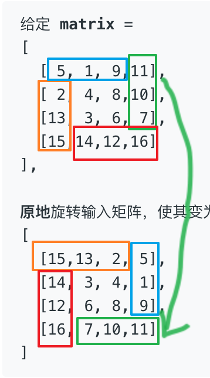  
　　扣四个边界出来。四个边界对应的点交换。每遍历一层，就往里缩一个矩阵。  

#### 代码  
```python
class Solution:
    def rotate(self, matrix: List[List[int]]) -> None:
        """
        Do not return anything, modify matrix in-place instead.
        """
        m = matrix
        n = len(m) - 1
        for l in range((n+1) // 2):  # 从外往里第几层
            for i in range(n - l * 2):
                m[l][l+i], m[i+l][n-l], m[n-l][n-l-i], m[n-l-i][l] =  m[n-l-i][l], m[l][l+i], m[l+i][n-l], m[n-l][n-l-i] 

```


## A49. 字母异位词分组

难度 `中等`  

#### 题目描述

给定一个字符串数组，将字母异位词组合在一起。字母异位词指字母相同，但排列不同的字符串。

> **示例:**

```
输入: ["eat", "tea", "tan", "ate", "nat", "bat"],
输出:
[
  ["ate","eat","tea"],
  ["nat","tan"],
  ["bat"]
]
```

**说明：**

- 所有输入均为小写字母。
- 不考虑答案输出的顺序。

#### 题目链接

<https://leetcode-cn.com/problems/group-anagrams/>

#### 思路  

　　将每个字符串排序后的顺序作为`key`插入到字典中。  

　　`"ate"`和`"eat"`排序后的顺序都为`"aet"`。  

#### 代码  

```python
class Solution:
    def groupAnagrams(self, strs: List[str]) -> List[List[str]]:
        dict_t = {}
        for s in strs:
            key = ''.join(sorted(s))
            if key not in dict_t:
                dict_t[key] = [s]
            else:
                dict_t[key].append(s)

        return list(dict_t.values())

```

## A50. Pow(x, n)

难度`中等`

#### 题目描述

实现 [pow(*x*, *n*)](https://www.cplusplus.com/reference/valarray/pow/) ，即计算 x 的 n 次幂函数。

> **示例 1:**

```
输入: 2.00000, 10
输出: 1024.00000
```

> **示例 2:**

```
输入: 2.10000, 3
输出: 9.26100
```

> **示例 3:**

```
输入: 2.00000, -2
输出: 0.25000
解释: 2-2 = 1/22 = 1/4 = 0.25
```

**说明:**

- -100.0 < *x* < 100.0
- *n* 是 32 位有符号整数，其数值范围是 [−231, 231 − 1] 。

#### 题目链接

<https://leetcode-cn.com/problems/powx-n/>

#### **思路:**

　　二分法，如果`n`是偶数。则`pow(x, n) = pow(x, n//2) ^ 2`，如果`n`是奇数，则`pow(x, n) = pow(x, n//2) ^ 2 * x`。

　　如果`n`是负数，按`n`的绝对值计算再取倒数即可。  　　

#### **代码:**

```python
class Solution:
    def myPow(self, x: float, n: int) -> float:
        if n == 0:
            return 1

        def helper(x, n):
            if n == 1:
                return x
            squre = helper(x, n//2) 
            squre = squre * squre

            if n % 2 == 0:
                return squre
            else:
                return squre * x

        if n < 0:
            return 1 / helper(x, -n)
        else:
            return helper(x, n)

```

## A51. N皇后

难度`困难`

#### 题目描述

*n* 皇后问题研究的是如何将 *n* 个皇后放置在 *n*×*n* 的棋盘上，并且使皇后彼此之间不能相互攻击。


上图为 8 皇后问题的一种解法。

给定一个整数 *n*，返回所有不同的 *n* 皇后问题的解决方案。

每一种解法包含一个明确的 *n* 皇后问题的棋子放置方案，该方案中 `'Q'` 和 `'.'` 分别代表了皇后和空位。

> **示例:**

```
输入: 4
输出: [
 [".Q..",  // 解法 1
  "...Q",
  "Q...",
  "..Q."],

 ["..Q.",  // 解法 2
  "Q...",
  "...Q",
  ".Q.."]
]
解释: 4 皇后问题存在两个不同的解法。
```

#### 题目链接

<https://leetcode-cn.com/problems/n-queens/>

#### **思路:**

　　递归。每次考虑一行中的放置位置即可。  

　　放置过程中注意避开其他皇后，即不能在同一列，并且坐标`i+j`和`i-j`都未出现过(斜着互相攻击)。  

#### **代码:**

```python
class Solution:
    def solveNQueens(self, n: int) -> List[List[str]]:
        ans = []
        def recur(queens, sum, differ):  # 递归
            row = len(queens)
            if row == n:
                # print(queens)
                ans.append(['.' * q  + 'Q' + '.' * (n-q-1) for q in queens])
                return 

            for i in range(n):  # 处理一行
                if i not in queens and row + i not in sum and row - i not in differ:
                    recur(queens + [i], sum + [row + i], differ + [row - i])
        
        recur([], [], [])
        return ans
      
```

## A52. N皇后 II

难度`困难`

#### 题目描述

*n* 皇后问题研究的是如何将 *n* 个皇后放置在 *n*×*n* 的棋盘上，并且使皇后彼此之间不能相互攻击。


上图为 8 皇后问题的一种解法。

给定一个整数 *n*，返回 *n* 皇后不同的解决方案的数量。

> **示例:**

```
输入: 4
输出: 2
解释: 4 皇后问题存在如下两个不同的解法。
[
 [".Q..",  // 解法 1
  "...Q",
  "Q...",
  "..Q."],

 ["..Q.",  // 解法 2
  "Q...",
  "...Q",
  ".Q.."]
]
```

#### 题目链接

<https://leetcode-cn.com/problems/n-queens-ii/>

#### **思路:**

　　和上一题一样。  

#### **代码:**

```python
class Solution:
    def totalNQueens(self, n: int) -> int:
        ans = 0
        def recur(queens, sum, differ):  # 递归
            nonlocal ans
            row = len(queens)
            if row == n:
                ans += 1
                return 

            for i in range(n):  # 处理一行
                if i not in queens and row + i not in sum and row - i not in differ:
                    recur(queens + [i], sum + [row + i], differ + [row - i])
        
        recur([], [], [])
        return ans
      
```

## A53. 最大子序和

难度 `简单`

#### 题目描述

给定一个整数数组 `nums` ，找到一个具有最大和的连续子数组（子数组最少包含一个元素），返回其最大和。

> **示例:**

```
输入: [-2,1,-3,4,-1,2,1,-5,4],
输出: 6
解释: 连续子数组 [4,-1,2,1] 的和最大，为 6。
```

> **进阶:**

如果你已经实现复杂度为 O(*n*) 的解法，尝试使用更为精妙的分治法求解。 

#### 题目链接

<https://leetcode-cn.com/problems/maximum-subarray/>


#### 思路  

　　方法一：分治法。将列表`nums`从中间切成两半，最大子序和要么在左半边，要么在右半边，要么横跨左右两边。即`maxSubArray(i, j)` = max(`maxSubArray(i, mid)`，`maxSubArray(mid, j)`，`crossOver(mid)`)。  
　　左右两边的最大子序和均使用递归来计算，横跨的最大子序和使用循环来计算。分治法的时间复杂度为`O(nlogn)`。**提交方法一的代码会超时**。  

　　方法二：动态规划。用`m[i]`记录以某个元素为最后一个元素时的最大子序和。如果以前一个数结尾的最大子序和为负数，那么当前的数不使用之前的数反而更大。  

　　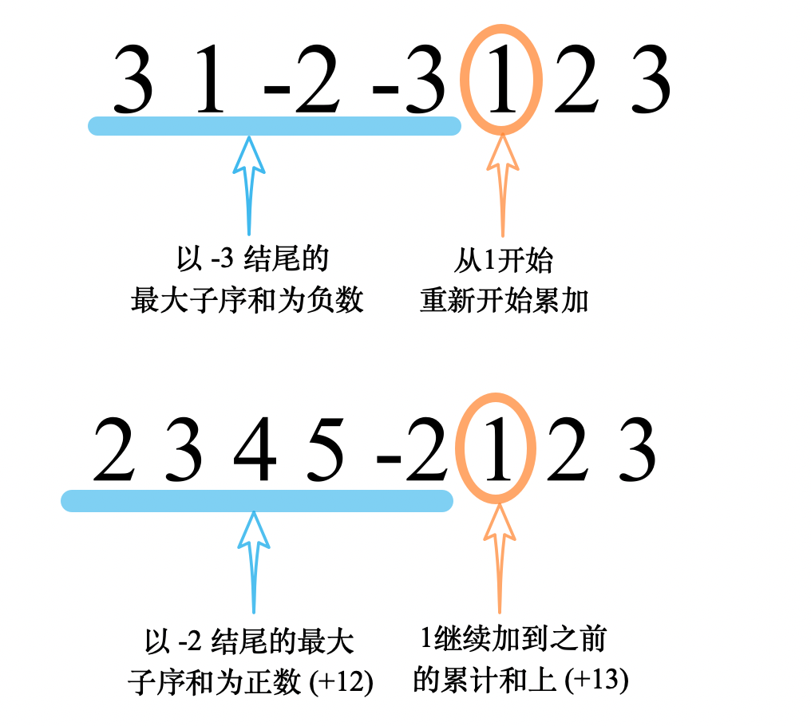

　　一次遍历后。`m[i]`的`全局最大值`即为整个数组的最大子序和。  这种方法的时间复杂度为`O(n)`；若用固定空间来存放`m[i]`，空间复杂度为`O(1)`。  


#### 代码  

　　方法一(分治法)：

```python
class Solution:
    
    def maxSubArray(self, nums: List[int]) -> int:
        def helper(nums, i, j):
            if j <= i:
                return -99999
            if (j-i) == 1:
                return nums[i]

            mid = (i + j) // 2
            left = helper(nums, i, mid)  # 计算左半边的最大子序和
            right = helper(nums, mid, j)  # 计算右半边的最大子序和
            ans = now_sum = nums[mid-1] + nums[mid]
            # 计算中间的最大子序和
            for i in range(mid-2, -1, -1):
                now_sum += nums[i]
                ans = max(ans, now_sum)
            now_sum = ans
            for i in range(mid+1, len(nums)):
                now_sum += nums[i]
                ans = max(ans, now_sum)

            return max(left, right, ans)

        return helper(nums, 0, len(nums))

```

　　方法二：

```python
class Solution:
    
    def maxSubArray(self, nums: List[int]) -> int:
        n = len(nums)
        if n == 1:
            return nums[0]
        ans = m_i = nums[0]  # 以某个结点为最后一个元素的最大子序和
        for i in range(1, n):
            num = nums[i]
            # 更新下一个i的m_i
            if m_i <= 0:
                m_i = num
            else:
                m_i += num
            ans = max(ans, m_i)
        return ans

```

## A54. 螺旋矩阵

难度 `中等`

#### 题目描述

给定一个包含 *m* x *n* 个元素的矩阵（*m* 行, *n* 列），请按照顺时针螺旋顺序，返回矩阵中的所有元素。

> **示例 1:**

```
输入:
[
 [ 1, 2, 3 ],
 [ 4, 5, 6 ],
 [ 7, 8, 9 ]
]
输出: [1,2,3,6,9,8,7,4,5]
```

> **示例 2:**

```
输入:
[
  [1, 2, 3, 4],
  [5, 6, 7, 8],
  [9,10,11,12]
]
输出: [1,2,3,4,8,12,11,10,9,5,6,7]
```

#### 题目链接

<https://leetcode-cn.com/problems/spiral-matrix/>

#### 思路  

　　方法一：从外向里，每层用4个`for`循环，边界判断有点烦。  
　　方法二：只用一层线性循环。将已走过的标记为`None`。当遇到边界或者已走过的位置时改变方向。  

#### 代码  

　　方法一：

```python
class Solution:
    def spiralOrder(self, matrix: List[List[int]]) -> List[int]:
        if len(matrix) == 0:
            return []
        m, n = len(matrix), len(matrix[0])  # m行n列
        ans = []
        for l in range(min(m,n)//2):
            for i in range(n-l*2-1):
                ans.append(matrix[l][l+i])
            for i in range(m-l*2-1):
                ans.append(matrix[l+i][n-l-1])
            for i in range(n-l*2-1, 0, - 1):
                ans.append(matrix[m-l-1][l+i])
            for i in range(m-l*2-1, 0, -1):
                ans.append(matrix[l+i][l])
        
        # 如果小边是奇数需要单独搜索最中心的一行(或一列)
        if m >= n and n % 2 == 1:
            for i in range(m-n//2*2):
                ans.append(matrix[n//2+i][n//2])

        if n > m and m % 2 == 1:
            for i in range(n-m//2*2):
                ans.append(matrix[m//2][m//2+i])

        return ans
```

　　方法二：

```python
class Solution:
    def spiralOrder(self, matrix: List[List[int]]) -> List[int]:
        r, i, j, di, dj = [], 0, 0, 0, 1
        if matrix != []:
            for _ in range(len(matrix) * len(matrix[0])):
                r.append(matrix[i][j])
                matrix[i][j] = None
                if matrix[(i + di) % len(matrix)][(j + dj) % len(matrix[0])] is None:
                    di, dj = dj, -di  # 如果到达边界或者已经走过，则改变方向
                i += di
                j += dj
        return r
```

## A55. 跳跃游戏 

难度 `中等`

#### 题目描述

给定一个非负整数数组，你最初位于数组的第一个位置。

数组中的每个元素代表你在该位置可以跳跃的最大长度。

判断你是否能够到达最后一个位置。

> **示例 1:**

```
输入: [2,3,1,1,4]
输出: true
解释: 我们可以先跳 1 步，从位置 0 到达 位置 1, 然后再从位置 1 跳 3 步到达最后一个位置。
```

> **示例 2:**

```
输入: [3,2,1,0,4]
输出: false
解释: 无论怎样，你总会到达索引为 3 的位置。但该位置的最大跳跃长度是 0 ， 所以你永远不可能到达最后一个位置。
```

#### 题目链接

<https://leetcode-cn.com/problems/jump-game/>

#### 思路  

　　方法一：用变量`most_far`记录能跳到的最远位置，每次都更新能跳到的最远位置。如果能跳到的最远位置小于当前查找的位置，则跳不到最后。  
　　方法二：从右往左遍历，如果某个位置能走到最后则截断后面的元素。如果某个元素为`0`则从前面找能走到它后面的。

#### 代码  

　　方法一：

```python
class Solution:
    def canJump(self, nums: List[int]) -> bool:
        n = len(nums)
        most_far = 0
        for i in range(n):
            if most_far < i:
                return False
            if i + nums[i] > most_far:
                most_far = i + nums[i]
            
        return True
```

　　方法二：

```python
class Solution:
    def canJump(self, nums: List[int]) -> bool:
        n = len(nums)
        if n == 1:
            return True

        j = 0
        for i in range(n-2,-1,-1):
            if nums[i] == 0 or j > 0:  # 出现了或之前出现过0，则每次都加一
                j += 1
            if nums[i] >= j:  # 如果当前位置能跳过最后一个0，则归0
                j = 0

        return j == 0
```

## A56. 合并区间

难度 `中等`

#### 题目描述

给出一个区间的集合，请合并所有重叠的区间。

> **示例 1:**

```
输入: [[1,3],[2,6],[8,10],[15,18]]
输出: [[1,6],[8,10],[15,18]]
解释: 区间 [1,3] 和 [2,6] 重叠, 将它们合并为 [1,6].
```

> **示例 2:**

```
输入: [[1,4],[4,5]]
输出: [[1,5]]
解释: 区间 [1,4] 和 [4,5] 可被视为重叠区间。
```

#### 题目链接

<https://leetcode-cn.com/problems/merge-intervals/>


#### 思路  


　　先将`intervals`排序，令`ans`=`[intervals[0]]`，取`intervals`中的每一个元素尝试与`ans`的最后一个元素合并。如果重合，则合并后放回`ans[-1]`；如果不重合，则`append`到`ans`的最后。  

#### 代码  
```python
class Solution:
    def merge(self, intervals: List[List[int]]) -> List[List[int]]:
        if len(intervals) == 0:
            return []
        s = sorted(intervals)
        ans = [s[0]]
        for i in s[1:]:
            if i[0] <= ans[-1][1]:
                ans[-1] = [ans[-1][0], max(i[1], ans[-1][1])] 
            else:
                ans.append(i)

        return ans

```

## A57. 插入区间

难度 `困难`

#### 题目描述

给出一个*无重叠的 ，*按照区间起始端点排序的区间列表。

在列表中插入一个新的区间，你需要确保列表中的区间仍然有序且不重叠（如果有必要的话，可以合并区间）。

> **示例 1:**

```
输入: intervals = [[1,3],[6,9]], newInterval = [2,5]
输出: [[1,5],[6,9]]
```

> **示例 2:**

```
输入: intervals = [[1,2],[3,5],[6,7],[8,10],[12,16]], newInterval = [4,8]
输出: [[1,2],[3,10],[12,16]]
解释: 这是因为新的区间 [4,8] 与 [3,5],[6,7],[8,10] 重叠。
```

#### 题目链接

<https://leetcode-cn.com/problems/insert-interval/>


#### 思路  

　　方法一：把`newInterval`插入到`intervals`的最后。然后用上一题[A56. 合并区间](/array?id=a56-合并区间)的算法。  
　　方法二：分别用`no_over_first`、 `no_over_last` 和`over_first`记录`newInterval`前未重叠的第一个位置、`newInterval`后未重叠的第一个位置和重叠的第一个位置。

　　如果没有任何重叠，直接插入到相应位置即可。  

　　如果有重叠，答案是将`重叠位置之间的列表`、`重叠位置的重叠计算结果`和`no_over_last`及之后的列表组合起来。  

#### 代码  

　　方法二：

```python
class Solution:
    def insert(self, intervals: List[List[int]], newInterval: List[int]) -> List[List[int]]:
        if len(intervals) == 0:
            return [newInterval]
        
        no_over_first, no_over_last = -1, len(intervals)
        over_first = -1

        for i, t in enumerate(intervals):
            if t[1] < newInterval[0]:
                no_over_first = i
            if over_first == -1 and newInterval[0] <= t[1] and newInterval[1] >= t[0]:
                over_first = i
            if no_over_last == len(intervals) and newInterval[1] < t[0]:
                no_over_last = i

        if over_first == -1:  # 没有任何重叠
            return intervals[:no_over_first+1] + [newInterval] + intervals[no_over_last:]
        
        m_0 = min(intervals[over_first][0], newInterval[0])
        m_1 = max(intervals[no_over_last-1][1], newInterval[1])
        middle = [[m_0, m_1]]

        ans = intervals[:over_first] + middle + intervals[no_over_last:]
        return ans

```

## A58. 最后一个单词的长度

难度 `简单`  

#### 题目描述

给定一个仅包含大小写字母和空格 `' '` 的字符串 `s`，返回其最后一个单词的长度。如果字符串从左向右滚动显示，那么最后一个单词就是最后出现的单词。

如果不存在最后一个单词，请返回 0 。

**说明：**一个单词是指仅由字母组成、不包含任何空格字符的 **最大子字符串**。

> **示例:**

```
输入: "Hello World"
输出: 5
```

#### 题目链接

<https://leetcode-cn.com/problems/length-of-last-word/>

#### 思路  

　　先去掉最右边的空格，然后再从右往左找空格。 

#### 代码  

```python
class Solution:
    def lengthOfLastWord(self, s: str) -> int:
        s = s.rstrip(' ')
        x = s.rfind(' ')
        if x != -1:  # 没有空格
            return len(s) - x - 1
        else:
            return len(s)
          
```

## A59. 螺旋矩阵 II

难度 `中等`

#### 题目描述

给定一个正整数 *n*，生成一个包含 1 到 *n*2 所有元素，且元素按顺时针顺序螺旋排列的正方形矩阵。

> **示例:**

```
输入: 3
输出:
[
 [ 1, 2, 3 ],
 [ 8, 9, 4 ],
 [ 7, 6, 5 ]
]
```

#### 题目链接

<https://leetcode-cn.com/problems/spiral-matrix-ii/>


#### 思路  


　　使用和[A54. 螺旋矩阵](/array?id=a54-螺旋矩阵)一样的解法。只用一层线性循环。开始时将所有的都以`0`初始化。当遇到边界或者非`0`的位置时改变方向。  

#### 代码  
```python
class Solution:
    def generateMatrix(self, n: int) -> List[List[int]]:
        ans = [[0 for i in range(n)] for j in range(n)]
        x = y = 0
        dx, dy = 0, 1
        for i in range(n**2): # 0-8
            ans[x][y] = i + 1
            if x + dx < 0 or x + dx >= n or y + dy < 0 or y + dy >= n or ans[x + dx][y + dy] != 0:
                dx, dy = dy, -dx
            x += dx
            y += dy

        return ans
```

## A60. 第k个排列

难度`中等`

#### 题目描述

给出集合 `[1,2,3,…,*n*]`，其所有元素共有 *n*! 种排列。

按大小顺序列出所有排列情况，并一一标记，当 *n* = 3 时, 所有排列如下：

1. `"123"`
2. `"132"`
3. `"213"`
4. `"231"`
5. `"312"`
6. `"321"`

给定 *n* 和 *k*，返回第 *k* 个排列。

**说明：**

- 给定 *n* 的范围是 [1, 9]。
- 给定 *k* 的范围是[1,  *n*!]。

> **示例 1:**

```
输入: n = 3, k = 3
输出: "213"
```

> **示例 2:**

```
输入: n = 4, k = 9
输出: "2314"
```

#### 题目链接

<https://leetcode-cn.com/problems/permutation-sequence/>

#### **思路:**

　　相同的第一位有`(n-1)!`种可能，相同的前二位有`(n-2)!`种可能……用整除找出是第几种可能，再到数组中取即可，注意用过的数字要去掉出来。  　　　　

#### **代码:**

```python
class Solution:
    def getPermutation(self, n: int, k: int) -> str:
        factorial = [1 for _ in range(n+1)]  # 阶乘
        for i in range(2, n+1):
            factorial[i] = factorial[i-1] * i

        # n * (n-1) * (n-2).....
        ans = ''

        t = n - 1
        k = k - 1
        set_nums = list(range(1, n+1))

        while t >= 0:
            cur = k // factorial[t]  # 这一位是第几个数字
            ans += str(set_nums[cur])
            set_nums.pop(cur)
            k -= cur * factorial[t]
            t -= 1
        return ans

```

## A61. 旋转链表

难度`中等`

#### 题目描述

给定一个链表，旋转链表，将链表每个节点向右移动 *k* 个位置，其中 *k* 是非负数。

> **示例 1:**

```
输入: 1->2->3->4->5->NULL, k = 2
输出: 4->5->1->2->3->NULL
解释:
向右旋转 1 步: 5->1->2->3->4->NULL
向右旋转 2 步: 4->5->1->2->3->NULL
```

> **示例 2:**

```
输入: 0->1->2->NULL, k = 4
输出: 2->0->1->NULL
解释:
向右旋转 1 步: 2->0->1->NULL
向右旋转 2 步: 1->2->0->NULL
向右旋转 3 步: 0->1->2->NULL
向右旋转 4 步: 2->0->1->NULL
```


#### 题目链接

<https://leetcode-cn.com/problems/rotate-list/>

#### **思路:**

　　其实就是将倒数第k个元素作为头，原来的头接到原来的尾上。  

　　找到倒数第k个元素可以用上一题[A19. 删除链表的倒数第n个结点](/dual_pointer?id=a19-删除链表的倒数第n个节点)的方法。  

#### **代码:**

```python
class Solution:
    def rotateRight(self, head: ListNode, k: int) -> ListNode:
        if not head or not head.next:
            return head

        fast = slow = head
        i = 0
        while i < k:
            if fast.next:
                fast = fast.next
                i += 1
            else:
                fast = head
                k = k % (i+1)
                i = 0

        while fast.next:
            fast = fast.next
            slow = slow.next
        
        if not slow.next:  # 循环了若干圈
            return head
        
        new_head = slow.next  # 新的头结点
        slow.next = None
        temp = new_head
        while temp.next:
            temp = temp.next
        
        temp.next = head
        return new_head

```

## A62. 不同路径

难度 `中等`

#### 题目描述

一个机器人位于一个 *m x n* 网格的左上角 （起始点在下图中标记为“Start” ）。

机器人每次只能向下或者向右移动一步。机器人试图达到网格的右下角（在下图中标记为“Finish”）。

问总共有多少条不同的路径？


例如，上图是一个7 x 3 的网格。有多少可能的路径？

 

> **示例 1:**

```
输入: m = 3, n = 2
输出: 3
解释:
从左上角开始，总共有 3 条路径可以到达右下角。
1. 向右 -> 向右 -> 向下
2. 向右 -> 向下 -> 向右
3. 向下 -> 向右 -> 向右
```

> **示例 2:**

```
输入: m = 7, n = 3
输出: 28
```

#### 题目链接

<https://leetcode-cn.com/problems/unique-paths/>


#### 思路  


　　\# 没入门动态规划之前，大佬：用动态规划可解 稍微入门动态规划后，大佬：一个方程就可解。  

　　\# 我：？？？  

　　方法一：动态规划。上边界和左边界的路径数为1。其他位置的路径数等于`上边格子的路径数`+`左边格子的路径数`。  

　　方法二：机器人一定会走`m + n - 2`步，即从`m + n - 2`中挑出`m - 1`步向下走不就行了吗？即`C((m + n - 2), (m - 1))`。  

#### 代码  

　　方法一：  

```python
class Solution:
    def uniquePaths(self, m: int, n: int) -> int:
        if not m or not n:
            return 0
        # m * n
        ans = [[1 for i in range(m)] for j in range(n)]

        for i in range(1, n):
            for j in range(1, m):
                ans[i][j] = ans[i-1][j] + ans[i][j-1]

        return ans[n-1][m-1]
```

　　方法二：  

```python
class Solution:
    def uniquePaths(self, m: int, n: int) -> int:
        def factor(num):
            if num < 2:
                return 1
            res = 1
            for i in range(1, num+1):
                res *= i
            return res

        def A(m, n):
            return factor(m) // factor(m-n)

        def C(m, n):
            return A(m, n) // factor(n)

        return C(m+n-2,m-1)
         
```

## A63. 不同路径 II

难度 `中等`

#### 题目描述

一个机器人位于一个 *m x n* 网格的左上角 （起始点在下图中标记为“Start” ）。

机器人每次只能向下或者向右移动一步。机器人试图达到网格的右下角（在下图中标记为“Finish”）。

现在考虑网格中有障碍物。那么从左上角到右下角将会有多少条不同的路径？


网格中的障碍物和空位置分别用 `1` 和 `0` 来表示。

**说明：***m* 和 *n* 的值均不超过 100。

> **示例 1:**

```
输入:
[
  [0,0,0],
  [0,1,0],
  [0,0,0]
]
输出: 2
解释:
3x3 网格的正中间有一个障碍物。
从左上角到右下角一共有 2 条不同的路径：
1. 向右 -> 向右 -> 向下 -> 向下
2. 向下 -> 向下 -> 向右 -> 向右
```

#### 题目链接

<https://leetcode-cn.com/problems/unique-paths-ii/>

#### 思路  

　　\# 解法倒是简单，但是数据卡人。会有傻x把障碍放在入口？？？？？？？？？？？？？  

　　\# 网友：是的，防止疫情扩散，所以做隔离  

　　动态规划。所有有障碍物的位置路径数为`0`。先把第一行和第一列算好。其他位置的路径数等于`上边格子的路径数`+`左边格子的路径数`。  

#### 代码  
```python
class Solution:
    def uniquePathsWithObstacles(self, obstacleGrid: List[List[int]]) -> int:
        # m * n
        m = len(obstacleGrid)
        n = len(obstacleGrid[0])
        if obstacleGrid[0][0] == 1:  # 开始就是障碍物
            return 0

        ans = [[1 if not obstacleGrid[i][j] else 0 for j in range(n)] for i in range(m)]
        print(ans)
        for i in range(m):
            for j in range(n):
                if obstacleGrid[i][j] == 0:
                    if i == 0 and j == 0:
                        pass
                    elif i == 0:
                        ans[i][j] = ans[i][j-1]
                    elif j == 0:
                        ans[i][j] = ans[i-1][j]
                    else:
                        ans[i][j] = ans[i-1][j] + ans[i][j-1]

        return ans[m-1][n-1]
      
```

## A64. 最小路径和 

难度 `中等`

#### 题目描述

给定一个包含非负整数的 *m* x *n* 网格，请找出一条从左上角到右下角的路径，使得路径上的数字总和为最小。

**说明：**每次只能向下或者向右移动一步。

> **示例:**

```
输入:
[
  [1,3,1],
  [1,5,1],
  [4,2,1]
]
输出: 7
解释: 因为路径 1→3→1→1→1 的总和最小。
```

#### 题目链接

<https://leetcode-cn.com/problems/minimum-path-sum/>


#### 思路  


　　动态规划。先将第一行和第一列算好，再选较小的与自身相加。  

#### 代码  
```python
class Solution:
    def minPathSum(self, grid: List[List[int]]) -> int:
        m = len(grid)
        if m == 0:
            return 0

        n = len(grid[0])
        ans = [[0 for i in range(n)] for j in range(m)]
        for i in range(m):
            for j in range(n):
                if i == 0 and j == 0:
                    ans[i][j] = grid[i][j]
                elif i == 0:
                    ans[i][j] = grid[i][j] +  ans[i][j-1]
                elif j == 0:
                    ans[i][j] = grid[i][j] +  ans[i-1][j]
                else:
                    ans[i][j] = grid[i][j] +  min(ans[i-1][j], ans[i][j-1])

        return ans[m-1][n-1]
```

## A65. 有效数字

难度 `困难`  

#### 题目描述

验证给定的字符串是否可以解释为十进制数字。

例如:

```
"0"` => `true`
`" 0.1 "` => `true`
`"abc"` => `false`
`"1 a"` => `false`
`"2e10"` => `true`
`" -90e3   "` => `true`
`" 1e"` => `false`
`"e3"` => `false`
`" 6e-1"` => `true`
`" 99e2.5 "` => `false`
`"53.5e93"` => `true`
`" --6 "` => `false`
`"-+3"` => `false`
`"95a54e53"` => `false
```

**说明:** 我们有意将问题陈述地比较模糊。在实现代码之前，你应当事先思考所有可能的情况。这里给出一份可能存在于有效十进制数字中的字符列表：

- 数字 0-9
- 指数 - "e"
- 正/负号 - "+"/"-"
- 小数点 - "."

当然，在输入中，这些字符的上下文也很重要。

#### 题目链接

<https://leetcode-cn.com/problems/valid-number/>

#### 思路  

　　我的正则一级棒✌️。  

　　一些会踩坑的**正确**样例：  

```
"+3."  
".3"
"1.e0"
"-.1e+5"
```

　　感兴趣也可以参考[有限状态机](https://leetcode-cn.com/problems/valid-number/solution/biao-qu-dong-fa-by-user8973/)解法。  

#### 代码  

```python
import re
class Solution:
    def isNumber(self, s: str) -> bool:
        s = s.strip(' ')
        # [正负号开头](N点M or 点M or N点 or N)[e [正负号] 几]
        pattern = '([+-]?)(([0-9]+[\.][0-9]+)|([\.][0-9]+)|([0-9]+[\.])|([0-9]+))([e][+-]?[0-9]+)?'
        a = re.search(pattern, s)
 
        if a:
            a = a.group() 
            return len(a)>0 and a == s
        return False
            
```

## A66. 加一

难度 `简单`

#### 题目描述

给定一个由**整数**组成的**非空**数组所表示的非负整数，在该数的基础上加一。

最高位数字存放在数组的首位， 数组中每个元素只存储**单个**数字。

你可以假设除了整数 0 之外，这个整数不会以零开头。

> **示例 1:**

```
输入: [1,2,3]
输出: [1,2,4]
解释: 输入数组表示数字 123。
```

> **示例 2:**

```
输入: [4,3,2,1]
输出: [4,3,2,2]
解释: 输入数组表示数字 4321。
```

#### 题目链接

<https://leetcode-cn.com/problems/plus-one/>


#### 思路  

　　方法一：最后一位加`1`，如果满`10`了依次向前进位即可。  
　　方法二：用`map`映射一行代码即可。  

#### 代码  

　　方法一：

```python
class Solution:
    def plusOne(self, digits: List[int]) -> List[int]:
        n = len(digits)
        digits[-1] += 1
        for i in range(n-1, 0, -1):
            if digits[i] == 10:
                digits[i] = 0
                digits[i-1] += 1
            else:
                break

        if digits[0] == 10:
            digits[0] = 0
            return [1] + digits

        return digits
```

　　方法二：

```python
class Solution:
    def plusOne(self, digits: List[int]) -> List[int]:
        return list(map(int, list(str(int(''.join(map(str, digits))) + 1))))
```

## A67. 二进制求和

难度 `简单`  

#### 题目描述

给定两个二进制字符串，返回他们的和（用二进制表示）。

输入为**非空**字符串且只包含数字 `1` 和 `0`。

> **示例 1:**

```
输入: a = "11", b = "1"
输出: "100"
```

> **示例 2:**

```
输入: a = "1010", b = "1011"
输出: "10101"
```

#### 题目链接

<https://leetcode-cn.com/problems/add-binary/>

#### 思路  

　　活用`int`和`bin`。  

#### 代码  

```python
class Solution:
    def addBinary(self, a: str, b: str) -> str:
        ans = int(a, base=2) + int(b, base=2)
        return bin(ans)[2:]
      
```

## A68. 文本左右对齐

难度 `困难`  

#### 题目描述

给定一个单词数组和一个长度 *maxWidth*，重新排版单词，使其成为每行恰好有 *maxWidth* 个字符，且左右两端对齐的文本。

你应该使用“贪心算法”来放置给定的单词；也就是说，尽可能多地往每行中放置单词。必要时可用空格 `' '` 填充，使得每行恰好有 *maxWidth* 个字符。

要求尽可能均匀分配单词间的空格数量。如果某一行单词间的空格不能均匀分配，则左侧放置的空格数要多于右侧的空格数。

文本的最后一行应为左对齐，且单词之间不插入**额外的**空格。

**说明:**

- 单词是指由非空格字符组成的字符序列。
- 每个单词的长度大于 0，小于等于 *maxWidth*。
- 输入单词数组 `words` 至少包含一个单词。

> **示例:**

```
输入:
words = ["This", "is", "an", "example", "of", "text", "justification."]
maxWidth = 16
输出:
[
   "This    is    an",
   "example  of text",
   "justification.  "
]
```

> **示例 2:**

```
输入:
words = ["What","must","be","acknowledgment","shall","be"]
maxWidth = 16
输出:
[
  "What   must   be",
  "acknowledgment  ",
  "shall be        "
]
解释: 注意最后一行的格式应为 "shall be    " 而不是 "shall     be",
     因为最后一行应为左对齐，而不是左右两端对齐。       
     第二行同样为左对齐，这是因为这行只包含一个单词。
```

> **示例 3:**

```
输入:
words = ["Science","is","what","we","understand","well","enough","to","explain",
         "to","a","computer.","Art","is","everything","else","we","do"]
maxWidth = 20
输出:
[
  "Science  is  what we",
  "understand      well",
  "enough to explain to",
  "a  computer.  Art is",
  "everything  else  we",
  "do                  "
]
```

#### 题目链接

<https://leetcode-cn.com/problems/text-justification/>

#### 思路  

　　不算是困难题，但是很麻烦。  

-  要区分是不是最后一行，如果是最后一行则`左对齐`，否则`两边对齐`。
-  先找出每一行有哪些单词，然后对每行分别操作。  
-  处理空格时：如果`总空格数`是`总间隙数`的倍数，均匀地填充即可。否则填充`总空格数 // 总间隙数 + 1`个空格。(因为左边的空格要比右边的多)。 

#### 代码  

```python
class Solution:
    def fullJustify(self, words: List[str], maxWidth: int) -> List[str]:
        if not len(words): return []
        ans = []
        lines = []
        temp = [words[0]]
        count = len(words[0])
        for word in words[1:]:
            if count + len(word) + 1 <= maxWidth:
                temp.append(word)
                count += len(word) + 1
            else:
                lines.append(temp)
                temp = [word]
                count = len(word)

        def form_line(words):  # 调整一行
            blanks = maxWidth - sum([len(word) for word in words]) - (len(words) - 1)
            intervals = max(1, len(words)-1)  # 有几个间隙
            blank_list = []
            if blanks == 0: return ' '.join(words)
            for i in range(intervals, 0, -1):
                if blanks % i == 0:
                    cur_blank = (blanks // i)      
                else:
                    cur_blank = blanks // i + 1   # 左边的要比右边的多

                blank_list.append(' ' * cur_blank) 
                blanks -= cur_blank

            line = ''
            for i in range(len(words)):
                line += words[i]
                if i == len(words) - 1:
                    break
                line += ' ' + blank_list[i]
            if len(line) < maxWidth:
                line += ' ' * (maxWidth - len(line))
            return line

        for line in lines:
            ans.append(form_line(line))

        last_line = ' '.join(temp)
        if len(last_line) < maxWidth:
            last_line += ' ' * (maxWidth - len(last_line))

        ans.append(last_line)
        return ans
      
```

## A69. x 的平方根

难度`简单`

#### 题目描述

实现 `int sqrt(int x)` 函数。

计算并返回 *x* 的平方根，其中 *x* 是非负整数。

由于返回类型是整数，结果只保留整数的部分，小数部分将被舍去。

> **示例 1:**

```
输入: 4
输出: 2
```

> **示例 2:**

```
输入: 8
输出: 2
说明: 8 的平方根是 2.82842..., 
     由于返回类型是整数，小数部分将被舍去。
```

#### 题目链接

<https://leetcode-cn.com/problems/sqrtx/>

#### **思路:**

　　从`1`到`x-1`二分查找。  　　　　

#### **代码:**

```python
class Solution:
    def mySqrt(self, x: int) -> int:
        if x == 0: return 0
        if x < 4: return 1

        i, j = 2, x - 1
        while i <= i and i < x-1:
            mid = (i+j) // 2
            if mid * mid > x:
                j = mid - 1
            elif mid * mid <= x and (mid + 1) ** 2 > x:
                return mid
            else:
                i = mid + 1
```

## A70. 爬楼梯

难度 `简单`  
#### 题目描述

假设你正在爬楼梯。需要 *n* 阶你才能到达楼顶。

每次你可以爬 1 或 2 个台阶。你有多少种不同的方法可以爬到楼顶呢？

**注意：**给定 *n* 是一个正整数。

> **示例 1：**

```
输入： 2
输出： 2
解释： 有两种方法可以爬到楼顶。
1.  1 阶 + 1 阶
2.  2 阶
```

> **示例 2：**

```
输入： 3
输出： 3
解释： 有三种方法可以爬到楼顶。
1.  1 阶 + 1 阶 + 1 阶
2.  1 阶 + 2 阶
3.  2 阶 + 1 阶
```

#### 题目链接

<https://leetcode-cn.com/problems/climbing-stairs/>


#### 思路  


　　动态规划。最后一步必定为走`1`个台阶或`2`个台阶。因此有递推公式`dp[i]`=`dp[i-1]`+`dp[i-2]`。  

#### 代码  
```python
class Solution(object):
    def climbStairs(self, n):
        """
        :type n: int
        :rtype: int
        """
        if n == 0:
            return 1
        dp = [0 for i in range(n+1)]
        dp[0] = dp[1] = 1
        for i in range(2, n+1):
            dp[i] = dp[i-1] + dp[i-2]

        # print(dp)
        return dp[-1]
      
```

## A71. 简化路径

难度 `中等`  

#### 题目描述

以 Unix 风格给出一个文件的**绝对路径**，你需要简化它。或者换句话说，将其转换为规范路径。

在 Unix 风格的文件系统中，一个点（`.`）表示当前目录本身；此外，两个点 （`..`） 表示将目录切换到上一级（指向父目录）；两者都可以是复杂相对路径的组成部分。更多信息请参阅：[Linux / Unix中的绝对路径 vs 相对路径](https://blog.csdn.net/u011327334/article/details/50355600)

请注意，返回的规范路径必须始终以斜杠 `/` 开头，并且两个目录名之间必须只有一个斜杠 `/`。最后一个目录名（如果存在）**不能**以 `/` 结尾。此外，规范路径必须是表示绝对路径的**最短**字符串。 

> **示例 1：**

```
输入："/home/"
输出："/home"
解释：注意，最后一个目录名后面没有斜杠。
```

> **示例 2：**

```
输入："/../"
输出："/"
解释：从根目录向上一级是不可行的，因为根是你可以到达的最高级。
```

> **示例 3：**

```
输入："/home//foo/"
输出："/home/foo"
解释：在规范路径中，多个连续斜杠需要用一个斜杠替换。
```

> **示例 4：**

```
输入："/a/./b/../../c/"
输出："/c"
```

> **示例 5：**

```
输入："/a/../../b/../c//.//"
输出："/c"
```

> **示例 6：**

```
输入："/a//b////c/d//././/.."
输出："/a/b/c"
```

#### 题目链接

<https://leetcode-cn.com/problems/simplify-path/>

#### 思路  

　　栈。Python大法真是好！  

- 按`'/'`先`split`，为`''`或`'.'`时不做任何操作。  
- 为`'..'`时出栈。  
- 其他情况时入栈。  

#### 代码  

```python
class Solution:
    def simplifyPath(self, path: str) -> str:
        stack = []
        splits = path.split('/')
        for s in splits:
            if not s or s == '.':  # 为空或者为"."，不做任何操作
                pass
            elif s == '..' and stack:  # 返回上一级
                stack.pop()  # 出栈
            else:
                stack.append(s)

        return '/' + '/'.join(stack)

```

## A72. 编辑距离

难度 `困难`  
#### 题目描述

给定两个单词 *word1* 和 *word2* ，计算出将 *word1* 转换成 *word2* 所使用的最少操作数 。

你可以对一个单词进行如下三种操作：

1. 插入一个字符
2. 删除一个字符
3. 替换一个字符

> **示例 1:**

```
输入: word1 = "horse", word2 = "ros"
输出: 3
解释: 
horse -> rorse (将 'h' 替换为 'r')
rorse -> rose (删除 'r')
rose -> ros (删除 'e')
```

> **示例 2:**

```
输入: word1 = "intention", word2 = "execution"
输出: 5
解释: 
intention -> inention (删除 't')
inention -> enention (将 'i' 替换为 'e')
enention -> exention (将 'n' 替换为 'x')
exention -> exection (将 'n' 替换为 'c')
exection -> execution (插入 'u')
```

#### 题目链接

<https://leetcode-cn.com/problems/edit-distance/>


#### 思路  

　　动态规划，令`dp[i][j]`表示`word1[:i]`变成`word2[:j]`的最少操作数。  

　　先考虑为空时的情况，`word1`为空时，`''`变成`word2[:j]`需要加上`j`个个字符。同样，`word2`为空时，`word1[:i]`变成`''`需要减去`i`个字符。因此，`dp[0][j]`=`j`，`dp[i][0]`=`i`。  

　　考虑不为空的情况。如果两个字符串当前的末尾相同，即`word1[i-1]`==`word2[j-1]`，那么`dp[i][j]`=`dp[i-1][j-1]`。如下如所示：  

  

　　如果两个字符串当前的末尾不同，那么有三种处理方式。即1. `删除word1末尾的元素`，然后按`dp[i-1][j]`处理；2. `将word1末尾的元素替换成word2末尾的元素`，然后按`dp[i-1][j-1]`处理；3. `在word1末尾添加word2末尾的元素`，然后按`dp[i][j-1]`处理。如下图所示：  

  

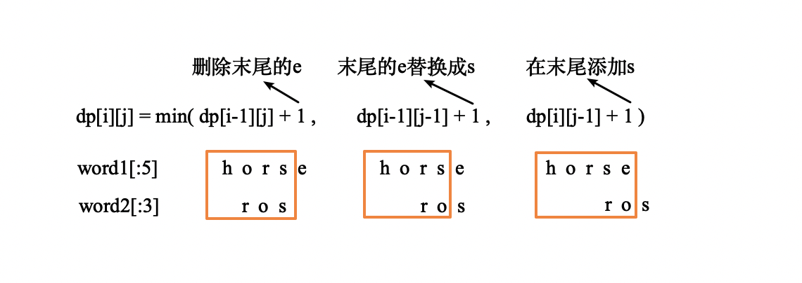

　　最终`dp[i][j]`的值为这三种操作的操作次数中最少的。即`dp[i][j]`=min(`dp[i-1][j-1]`,`dp[i-1][j]`,`dp[i][j-1]`)+`1`。  

#### 代码  

```python
class Solution(object):
    def minDistance(self, word1, word2):
        """
        :type word1: str
        :type word2: str
        :rtype: int
        """
        # word1[i] word2[j]
        # dp[i][j] 表示 word1[i] 变成 word2[j]的最少操作数
        l1, l2 = len(word1), len(word2)
        dp = [[0 for j in range(l2+1)]for i in range(l1+1)]
        for i in range(l1+1):
            for j in range(l2+1):
                if i == 0:
                    dp[i][j] = j
                elif j == 0:
                    dp[i][j] = i
                else:
                    if word1[i-1] == word2[j-1]:
                        dp[i][j] = dp[i-1][j-1]
                    else:
                        dp[i][j] = min(dp[i-1][j-1], dp[i-1][j], dp[i][j-1]) + 1
        # print(dp)
        return dp[-1][-1]
```

## A73. 矩阵置零

难度 `中等`  
#### 题目描述
给定一个 *m* x *n* 的矩阵，如果一个元素为 0，则将其所在行和列的所有元素都设为 0。请使用**原地**算法**。**

> **示例 1:**

```
输入: 
[
  [1,1,1],
  [1,0,1],
  [1,1,1]
]
输出: 
[
  [1,0,1],
  [0,0,0],
  [1,0,1]
]
```

> **示例 2:**

```
输入: 
[
  [0,1,2,0],
  [3,4,5,2],
  [1,3,1,5]
]
输出: 
[
  [0,0,0,0],
  [0,4,5,0],
  [0,3,1,0]
]
```

#### 题目链接

<https://leetcode-cn.com/problems/set-matrix-zeroes/>


#### 思路  

　　方法一：先遍历一遍矩阵，将出现`0`位置的同一行同一列所有`不为0`的元素标记为`None`。然后再遍历一遍矩阵，将所有`None`更改为`0`。这种方法的空间复杂度为`O(1)`；但是时间复杂度较高。  
　　方法二：用矩阵的`第一行`和`第一列`来记录每一行和每一列是否有`0`。这一步操作可能会让首行首列是否有零这个信息损失掉，因为首行首列被用来存储其他信息了，会改变他们的取值，所以再定义两个变量`row0`和`col0`记录首行首列是否有零。  

#### 代码  

　　方法一： 

```python
class Solution:
    def setZeroes(self, matrix: List[List[int]]) -> None:
        """
        Do not return anything, modify matrix in-place instead.
        """
        m = len(matrix)
        n = len(matrix[0])
        for i in range(m):
            for j in range(n):
                if matrix[i][j] == 0:
                    for k in range(m):
                        if matrix[k][j] != 0:
                            matrix[k][j] = None
                    for k in range(n):
                        if matrix[i][k] != 0:
                            matrix[i][k] = None

        for i in range(m):
            for j in range(n):
                if matrix[i][j] is None:
                    matrix[i][j] = 0
                    
```

　　方法二：  

```python
class Solution:
    def setZeroes(self, matrix: List[List[int]]) -> None:
        """
        Do not return anything, modify matrix in-place instead.
        """
        m = len(matrix)
        n = len(matrix[0])
        row_0, col_0 = False, False

        for i in range(m):
            for j in range(n):
                if matrix[i][j] == 0:
                    if i == 0:
                        row_0 = True
                    if j == 0:
                        col_0 = True
                    matrix[i][0] = matrix[0][j] = 0
        
        for i in range(1, m):
            for j in range(1, n):
               if matrix[0][j] == 0 or matrix[i][0] == 0:
                    matrix[i][j] = 0

        if row_0:
            for j in range(n):
                matrix[0][j] = 0

        if col_0:
            for i in range(m):
                matrix[i][0] = 0

```

## A74. 搜索二维矩阵

难度 `中等`  

#### 题目描述

编写一个高效的算法来判断 *m* x *n* 矩阵中，是否存在一个目标值。该矩阵具有如下特性：

- 每行中的整数从左到右按升序排列。
- 每行的第一个整数大于前一行的最后一个整数。

> **示例 1:**

```
输入:
matrix = [
  [1,   3,  5,  7],
  [10, 11, 16, 20],
  [23, 30, 34, 50]
]
target = 3
输出: true
```

> **示例 2:**

```
输入:
matrix = [
  [1,   3,  5,  7],
  [10, 11, 16, 20],
  [23, 30, 34, 50]
]
target = 13
输出: false
```

#### 题目链接

<https://leetcode-cn.com/problems/search-a-2d-matrix/>

#### 思路  

　　整除和取模把一维坐标转为二维，然后套用二分查找模板。时间复杂度`O(log(mn))`。  

#### 代码  

```python
class Solution:
    def searchMatrix(self, matrix: List[List[int]], target: int) -> bool:
        m = len(matrix)
        if m == 0:
            return False

        n = len(matrix[0])

        def _1d_to_2d(i):
            return i // n, i % n
        
        i, j = 0, m * n
        while i <= j and i < m * n:
            mid = (i + j) // 2
            x, y = _1d_to_2d(mid)
            num = matrix[x][y]
            if num > target:
                j = mid - 1
            elif num < target:
                i = mid + 1
            else:
                return num == target
            
        return False
      
```

## A75. 颜色分类

难度 `中等`  

#### 题目描述

给定一个包含红色、白色和蓝色，一共 *n* 个元素的数组，**原地**对它们进行排序，使得相同颜色的元素相邻，并按照红色、白色、蓝色顺序排列。

此题中，我们使用整数 0、 1 和 2 分别表示红色、白色和蓝色。

**注意:**
不能使用代码库中的排序函数来解决这道题。

> **示例:**

```
输入: [2,0,2,1,1,0]
输出: [0,0,1,1,2,2]
```

#### 题目链接

<https://leetcode-cn.com/problems/sort-colors/>

#### 思路  

　　使用三个指针可以实现**一趟扫描**，`low`的前面全都是`0`，而`high`的后面全都是`2`。`i`表示当前位置，如果当前位置为`0`，则与`low`交换。如果为`2`，则与`high`交换。  

#### 代码  

```python
class Solution:
    def sortColors(self, nums: List[int]) -> None:
        """
        Do not return anything, modify nums in-place instead.
        """
        low, high = 0, len(nums) - 1
        i = 0
        while i <= high:
            if nums[i] == 0:
                nums[i], nums[low] = nums[low], nums[i]
                low += 1
                i += 1
            elif nums[i] == 2:
                nums[i], nums[high] = nums[high], nums[i]
                high -= 1
            elif nums[i] == 1:
                i += 1

```

## A76. 最小覆盖子串

难度 `困难`  

#### 题目描述

给你一个字符串 S、一个字符串 T，请在字符串 S 里面找出：包含 T 所有字母的最小子串。

> **示例：**

```
输入: S = "ADOBECODEBANC", T = "ABC"
输出: "BANC"
```

**说明：**

- 如果 S 中不存这样的子串，则返回空字符串 `""`。
- 如果 S 中存在这样的子串，我们保证它是唯一的答案。

#### 题目链接

<https://leetcode-cn.com/problems/minimum-window-substring/>

#### 思路  

　　先用一个字典统计`t`中每个字母出现的次数，注意出现的字母是`减去`次数。  

　　然后用两个指针`left`和`right`维护一个滑动窗口，遍历`s`，`右指针`移动时在字典中加上次数，`左指针`移动时在字典中减去次数。字典中每个字母对应次数的意义为：  

- 出现次数`> 0` 的字母是多余的；
- 出现次数`== 0`表示正好匹配；
- 出现次数`< 0` 的字母是缺少的。

　　滑动窗口的移动：分三种情况来移动窗口：（这里令当前窗口的左右边界分别为l，r，窗口的大小为winSize=r-l+1）

```
1) 当winSize < len(t) r++;  也就是窗口右边界向右移动
2) 当winSize == len(t) :
   2.1) 当窗口中的字符已经符合要求了，直接返回return，已经找到了
   2.2) 否则r++，窗口右边界向右移动
3) 当winSize > len(t)
   3.1) 当窗口中的字符已经符合要求了，l++，窗口左边界向右移动
   3.2) 否则r++，窗口右边界向右移动
```

　　当滑动窗口中的字母正好匹配时，将`right-left`和之前的最小值比较。  

#### 代码  

```python
from collections import defaultdict

class Solution(object):
    def minWindow(self, s, t):
        mem = defaultdict(int)
        for char in t:  #  统计t每个字母的出现次数
            mem[char] -= 1  # 负的表示缺的，正的表示多余的

        count = len(t)

        left = 0
        min_i, min_j = 0, len(s)
        for right, char in enumerate(s):
            if mem[char] < 0:
                count -= 1
            mem[char] += 1

            if count == 0:  # 成功匹配
                while mem[s[left]] > 0:  # 把左边多余的去掉 然后再计算 min max
                    mem[s[left]] -= 1
                    left += 1

                if right - left < min_j - min_i:
                    min_i, min_j = left, right

                mem[s[left]] -= 1
                left += 1
                count += 1

        return '' if min_j == len(s) else s[min_i:min_j + 1]

```

## A77. 组合

难度`中等`

#### 题目描述

给定两个整数 *n* 和 *k*，返回 1 ... *n* 中所有可能的 *k* 个数的组合。

> **示例:**

```
输入: n = 4, k = 2
输出:
[
  [2,4],
  [3,4],
  [2,3],
  [1,2],
  [1,3],
  [1,4],
]
```

#### 题目链接

<https://leetcode-cn.com/problems/combinations/>

#### **思路:**

　　递归，每次的取值都可以在`上一个数+1`到`n`之间，当取满`k`个时返回。  

#### **代码:**

```python
class Solution:
    def combine(self, n: int, k: int) -> List[List[int]]:
        ans = []
        def dfs(i, minimal, nums):  # 第几个数
            if i >= k:
                ans.append(nums.copy())
                return

            for num in range(minimal+1, n+1):  # 保证升序
                dfs(i+1, num, nums + [num])

        dfs(0, 0, [])
        return ans

```

## A78. 子集

难度 `中等`  

#### 题目描述

给定一组**不含重复元素**的整数数组 *nums*，返回该数组所有可能的子集（幂集）。

**说明：**解集不能包含重复的子集。

> **示例:**

```
输入: nums = [1,2,3]
输出:
[
  [3],
  [1],
  [2],
  [1,2,3],
  [1,3],
  [2,3],
  [1,2],
  []
]
```

#### 题目链接

<https://leetcode-cn.com/problems/subsets/>

#### 思路  

　　位运算解法。用`0`到`2^n-1`二进制的`0`和`1`来表示每一位的取或不取。  
　　例如`nums = [1, 2, 3]`。  

| 十进制 | 二进制 | 对应的子集 |
| ------ | ------ | ---------- |
| 0      | 000    | []         |
| 1      | 001    | [3]        |
| 2      | 010    | [2]        |
| 3      | 011    | [2, 3]     |
| 4      | 100    | [1]        |
| 5      | 101    | [1, 3]     |
| 6      | 110    | [1, 2]     |
| 7      | 111    | [1, 2, 3]  |

#### 代码  

```python
class Solution:
    def subsets(self, nums: List[int]) -> List[List[int]]:
        n = len(nums)
        ans = []
        for i in range(2**n):
            temp = []
            j = 0
            while i != 0:
                if i % 2:
                   temp.append(nums[j]) 
                i = i // 2
                j += 1
            ans.append(temp)

        return ans
```

## A79. 单词搜索

难度 `中等`  

#### 题目描述

给定一个二维网格和一个单词，找出该单词是否存在于网格中。

单词必须按照字母顺序，通过相邻的单元格内的字母构成，其中“相邻”单元格是那些水平相邻或垂直相邻的单元格。同一个单元格内的字母不允许被重复使用。

> **示例:**

```
board =
[
  ['A','B','C','E'],
  ['S','F','C','S'],
  ['A','D','E','E']
]

给定 word = "ABCCED", 返回 true
给定 word = "SEE", 返回 true
给定 word = "ABCB", 返回 false
```

#### 题目链接

<https://leetcode-cn.com/problems/word-search/>

#### 思路  

　　从每个字母开始dfs搜索。需要注意的是不要每次都新建`visited`数组，不然会超时。　　

#### 代码  

```python
class Solution:
    def exist(self, board: List[List[str]], word: str) -> bool:
        m = len(board)
        if not m:
            return False
        n = len(board[0])

        visited = [[False for j in range(n)] for i in range(m)]
        def dfs(i, j, word):
            if len(word) == 0:
                return True
            if i < 0 or j < 0 or i >= m or j >= n:  # 超出边界
                return False
            if board[i][j] != word[0] or visited[i][j]:  # 已经走过了或者字母不对
                return False
                
            visited[i][j] = True 

            if dfs(i-1, j, word[1:]) or dfs(i+1, j, word[1:]) \
            or dfs(i, j-1, word[1:]) or dfs(i, j+1, word[1:]):
                return True

            visited[i][j] = False

        for i in range(m):
            for j in range(n):
                if dfs(i, j, word):
                    return True

        return False

```

## A80. 删除排序数组中的重复项 II

难度 `中等`  
#### 题目描述
给定一个排序数组，你需要在**原地**删除重复出现的元素，使得每个元素最多出现两次，返回移除后数组的新长度。

不要使用额外的数组空间，你必须在**原地修改输入数组**并在使用 O(1) 额外空间的条件下完成。

> **示例 1:**

```
给定 nums = [1,1,1,2,2,3],

函数应返回新长度 length = 5, 并且原数组的前五个元素被修改为 1, 1, 2, 2, 3 。

你不需要考虑数组中超出新长度后面的元素。
```

> **示例 2:**

```
给定 nums = [0,0,1,1,1,1,2,3,3],

函数应返回新长度 length = 7, 并且原数组的前五个元素被修改为 0, 0, 1, 1, 2, 3, 3 。

你不需要考虑数组中超出新长度后面的元素。
```

#### 题目链接

<https://leetcode-cn.com/problems/remove-duplicates-from-sorted-array-ii/>


#### 思路  

　　方法一：用`i`记录当前要被替换的位置，每次右移一位。`j`记录用什么数字替换的位置，每次右移若干位，保证每个数字出现的次数不大于`2`。  

　　方法二：与方法一类似，用`i`记录当前要被替换的位置，`j`不断后移，如果`nums[j]`不等于`nums[i-2]`则替换掉`nums[i]`。  

#### 代码  

　　方法一：

```python
class Solution:
    def removeDuplicates(self, nums: List[int]) -> int:
        i, j = 0, 0  # i每次后移1位，j每次后移若干位
        num = -999999
        count = 0
        n = len(nums)
        while i < n and j < n:
            i += 1

            if nums[j] != num:
                count = 1
                num = nums[j]
            else:
                count += 1  # 计算count

            if count < 2:
                j += 1
            else:
                while j < n and nums[j] == num:
                    j += 1

            if j < n:
                nums[i] = nums[j]
            else:
                return i

```

　　方法二：

```python
class Solution:
    def removeDuplicates2(self, nums: List[int]) -> int:
    """
    :type nums: List[int]
    :rtype: int
    """
    i = 0
    for next_num in nums:
        if i < 2 or next_num != nums[i - 2]:
            nums[i] = next_num
            i += 1

    return i
```

## A81. 搜索旋转排序数组 II

难度 `中等`  

#### 题目描述

假设按照升序排序的数组在预先未知的某个点上进行了旋转。

( 例如，数组 `[0,0,1,2,2,5,6]` 可能变为 `[2,5,6,0,0,1,2]` )。

编写一个函数来判断给定的目标值是否存在于数组中。若存在返回 `true`，否则返回 `false`。

> **示例 1:**

```
输入: nums = [2,5,6,0,0,1,2], target = 0
输出: true
```

> **示例 2:**

```
输入: nums = [2,5,6,0,0,1,2], target = 3
输出: false
```

#### 题目链接

<https://leetcode-cn.com/problems/search-in-rotated-sorted-array-ii/>


#### 思路  


　　与[A33. 搜索旋转排序数组](/array?id=a33-搜索旋转排序数组)是类似的，如果不重复，则可以对有序的一半二分查找，另一半递归。如果有重复，最坏的时间复杂度为`O(n)`，与直接遍历相同。  

#### 代码  
```python
class Solution:
    def search(self, nums: List[int], target: int) -> bool:
        def helper(nums, i, j, target):
            if j <= i:
                return False
            if j == i + 1:
                return nums[i] == target
            
            middle = (i + j)//2
            if nums[i] < nums[middle]:
                # 对左边进行二分查找，对右边递归
                start, end = middle, j
                j = middle
            elif nums[middle] < nums[j-1]:
                # 对右边进行二分查找，对左边递归
                start, end = i, middle
                i = middle
            else:
                return helper(nums, i, middle, target) or helper(nums, middle, j, target)

            while i <= j and i < len(nums):
                mid = (i + j) // 2
                if nums[mid] > target:
                    j = mid - 1
                elif nums[mid] < target:
                    i = mid + 1
                else:
                    return nums[mid] == target

            return helper(nums, start, end, target)

        return helper(nums, 0, len(nums), target)
      
```

## A82. 删除排序链表中的重复元素 II

难度`中等`

#### 题目描述

给定一个排序链表，删除所有含有重复数字的节点，只保留原始链表中 *没有重复出现* 的数字。

> **示例 1:**

```
输入: 1->2->3->3->4->4->5
输出: 1->2->5
```

> **示例 2:**

```
输入: 1->1->1->2->3
输出: 2->3
```

#### 题目链接

<https://leetcode-cn.com/problems/remove-duplicates-from-sorted-list-ii/>

#### **思路:**

　　用一个字典记录每个数字出现的次数，如果出现次数大于`1`就删除。  

#### **代码:**

```python
from collections import defaultdict

class Solution:
    def deleteDuplicates(self, head: ListNode) -> ListNode:
        if not head:
            return

        ans = ListNode(0)
        cur = ans
        mem = defaultdict(int)
        node = head
        while node:
            mem[node.val] += 1
            node = node.next

        node = head
        while node:
            if mem[node.val] == 1:
                cur.next = node
                cur = node
            else:
                cur.next = None
            node = node.next

        return ans.next

```

## A84. 柱状图中最大的矩形

难度 `困难`  

#### 题目描述

给定 *n* 个非负整数，用来表示柱状图中各个柱子的高度。每个柱子彼此相邻，且宽度为 1 。  

求在该柱状图中，能够勾勒出来的矩形的最大面积。  


以上是柱状图的示例，其中每个柱子的宽度为 1，给定的高度为 `[2,1,5,6,2,3]`。

 


图中阴影部分为所能勾勒出的最大矩形面积，其面积为 `10` 个单位。 

> **示例:**

```
输入: [2,1,5,6,2,3]
输出: 10
```

#### 题目链接

<https://leetcode-cn.com/problems/largest-rectangle-in-histogram/>

#### 思路  

　　单调栈，新元素如果小于等于栈顶元素则**不断**弹栈。实际实现时栈内记录的是元素的下标。

　　为了方便理解，假设此时栈内元素为 `A`  `B` 。遇到元素`C <= B`，需要做出栈处理（然后再将`C`入栈），则对于即将要出栈的B来说：`A`是从`B`起向左，第一个小于`B`的元素；`C`是从`B`起向右，第一个小于等于B的元素。`A`和`C`的下标之差即高度为`B`的最大宽度。    

　　例如：`heights= [2,1,5,6,2,3]`。栈操作过程如下：  

```
入栈 2
出栈 2 宽度 1 ans=2
入栈 1
入栈 5
入栈 6
出栈 6 宽度 1 ans=6
出栈 5 宽度 2 ans=10
入栈 2
入栈 3
出栈 3 宽度 1 ans不变
出栈 2 宽度 4 ans不变
出栈 1 宽度 6 ans不变
```

#### 代码  

```python
class Solution:
    def largestRectangleArea(self, heights: List[int]) -> int:
        n = len(heights)
        if n == 0:
            return 0

        s = [-1]
        heights.append(0)
        ans = 0
        for i, h in enumerate(heights):
            while len(s) >= 2 and h <= heights[s[-1]]:  # 出栈
                last = s.pop()  
                before = s[-1]
                w = i - before - 1
                ans = max(ans, heights[last] * w)
                # print('出栈', heights[last], '宽度', w)

            if len(s)==0 or h >= heights[s[-1]]:  # 入栈
                s.append(i)
                # print('入栈', heights[i])

        return ans
```

## A85. 最大矩形

难度 `困难`  

#### 题目描述

给定一个仅包含 0 和 1 的二维二进制矩阵，找出只包含 1 的最大矩形，并返回其面积。

> **示例:**

```
输入:
[
  ["1","0","1","0","0"],
  ["1","0","1","1","1"],
  ["1","1","1","1","1"],
  ["1","0","0","1","0"]
]
输出: 6
```

#### 题目链接

<https://leetcode-cn.com/problems/maximal-rectangle/>

#### 思路  

　　对每一行都求出每一列的高度，然后每行依次调用上一题[A84. 柱状图中最大的矩形](/stack?id=a84-柱状图中最大的矩形)的`largestRectangleArea`函数。  
　　例如示例对应的高度矩阵为：

```
[
  [1, 0, 1, 0, 0],  # 该行调用largestRectangleArea结果为1
  [2, 0, 2, 1, 1],  # 该行调用largestRectangleArea结果为3
  [3, 1, 3, 2, 2],  # 该行调用largestRectangleArea结果为6
  [4, 0, 0, 3, 0]   # 该行调用largestRectangleArea结果为1
]
```

#### 代码  

```python
class Solution:
    def largestRectangleArea(self, heights: List[int]) -> int:
        n = len(heights)
        if n == 0:
            return 0

        s = [-1]
        heights.append(0)
        ans = 0
        for i, h in enumerate(heights):
            while len(s) >= 2 and h <= heights[s[-1]]:  # 出栈
                last = s.pop()  
                before = s[-1]
                w = i - before - 1
                ans = max(ans, heights[last] * w)

            if len(s)==0 or h >= heights[s[-1]]:  # 入栈
                s.append(i)
        return ans

    def maximalRectangle(self, matrix: List[List[str]]) -> int:
        m = len(matrix)
        if m == 0:
            return 0
        n = len(matrix[0])
        helper = [[0 for i in range(n)] for i in range(m)]
        for j in range(n):
            tmp = 0
            for i in range(m):
                if matrix[i][j] == '1':
                    tmp += 1
                    helper[i][j] = tmp
                else:
                    tmp = 0

        ans = 0
        for heights in helper:
            aera_line = self.largestRectangleArea(heights)
            ans = max(ans, aera_line)
        
        return ans

```

## A86. 分隔链表

难度`中等`

#### 题目描述

给定一个链表和一个特定值 *x*，对链表进行分隔，使得所有小于 *x* 的节点都在大于或等于 *x* 的节点之前。

你应当保留两个分区中每个节点的初始相对位置。

> **示例:**

```
输入: head = 1->4->3->2->5->2, x = 3
输出: 1->2->2->4->3->5
```

#### 题目链接

<https://leetcode-cn.com/problems/partition-list/>

#### **思路:**

　　用两个新链表`head1`和`head2`分别记录小于`x`的元素和大于等于`x`的元素，然后再把它们连接起来。  

　　给两个新链表使用虚拟头结点(`dummyhead`)，使代码更简单。  

#### **代码:**

```python
class Solution:
    def partition(self, head: ListNode, x: int) -> ListNode:
        if not head:
            return None

        p1 = dummyhead1 = ListNode(None)
        p2 = dummyhead2 = ListNode(None)

        node = head
        while node:
            cur = node
            node = node.next
            if cur.val < x:
                p1.next = cur
                p1 = p1.next
                p1.next = None
            elif cur.val >= x:
                p2.next = cur
                p2 = p2.next
                p2.next = None 

        p1.next = dummyhead2.next  # 将head2连接再head1最后
        return dummyhead1.next

```

## A87. 扰乱字符串

难度 `困难`  
#### 题目描述

给定一个字符串 *s1*，我们可以把它递归地分割成两个非空子字符串，从而将其表示为二叉树。

下图是字符串 *s1* = `"great"` 的一种可能的表示形式。

```
    great
   /    \
  gr    eat
 / \    /  \
g   r  e   at
           / \
          a   t
```

在扰乱这个字符串的过程中，我们可以挑选任何一个非叶节点，然后交换它的两个子节点。

例如，如果我们挑选非叶节点 `"gr"` ，交换它的两个子节点，将会产生扰乱字符串 `"rgeat"` 。

```
    rgeat
   /    \
  rg    eat
 / \    /  \
r   g  e   at
           / \
          a   t
```

我们将 `"rgeat”` 称作 `"great"` 的一个扰乱字符串。

同样地，如果我们继续交换节点 `"eat"` 和 `"at"` 的子节点，将会产生另一个新的扰乱字符串 `"rgtae"` 。

```
    rgtae
   /    \
  rg    tae
 / \    /  \
r   g  ta  e
       / \
      t   a
```

我们将 `"rgtae”` 称作 `"great"` 的一个扰乱字符串。

给出两个长度相等的字符串 *s1* 和 *s2*，判断 *s2* 是否是 *s1* 的扰乱字符串。

> **示例 1:**

```
输入: s1 = "great", s2 = "rgeat"
输出: true
```

> **示例 2:**

```
输入: s1 = "abcde", s2 = "caebd"
输出: false
```

#### 题目链接

<https://leetcode-cn.com/problems/scramble-string/>

#### 思路  

　　这题的主要难点在于理解题意。根据题意，`s2`是`s1`的**扰乱字符串**的充分必要条件为：把它们分成两部分，这两部分都互为扰乱字符串。划分方式有以下两种：  


　　因此只要递归地判断即可。对于一前一后的划分方式，`s1[:i]`与`s2[n-i:]`互为扰乱字符串，并且`s1[i:]`和`s2[:n-i]`互为扰乱字符串。  

　　下面两个结论可以在递归判断中简化问题：  

　　1、如果两个字符串互为扰乱字符串，那么它们出现的字母一定是相同的。  

　　2、相同的字符串互为扰乱字符串。  

　　至于代码中的使用 *带记忆数组* 存储中间过程，实际运行中并不能有效地减少时间。  

#### 代码  
```python
class Solution(object):
    def isScramble(self, s1, s2):
        if len(s1) != len(s2):
            return False
        n = len(s1)
        # dp[i][j][l]表示s1[i:i+l]能否和s2[j:j+l]匹配
        dp = [[[None for l in range(n+1)] for j in range(n)] for i in range(n)]  # 带记忆数组
        for i in range(n):
            for j in range(n):
                dp[i][j][1] = s1[i] == s2[j]

        def dfs(i, j, lp): # lp表示父字符串的长度
            if dp[i][j][lp] is not None:  # 如果带记忆数组中已经有结果 则直接返回
                return dp[i][j][lp]

            if s1[i:i+lp] == s2[j:j+lp]:  # 相同的字符串互相扰乱
                dp[i][j][lp] = True
                return True

            if sorted(s1[i:i+lp]) != sorted(s2[j:j+lp]):  # 字符不同，不互相扰乱
                dp[i][j][lp] = False
                return False

            for l in range(1, lp):
                if dfs(i, j, l) and dfs(i+l, j+l, lp-l):  # 都在前的划分方式
                    return True
                if dfs(i, j+lp-l, l) and dfs(i+l, j, lp-l):  # 一前一后的划分方式
                    return True
                    
            return False
        
        return dfs(0, 0, n)
```

## A88. 合并两个有序数组

难度 `简单`  
#### 题目描述

给你两个有序整数数组 *nums1* 和 *nums2* 。请你将 *nums2* 合并到 *nums1* 中*，*使 *num1* 成为一个有序数组。

**说明:**

- 初始化 *nums1* 和 *nums2* 的元素数量分别为 *m* 和 *n* 。
- 你可以假设 *nums1* 有足够的空间（空间大小大于或等于 *m + n* ）来保存 *nums2* 中的元素。 

> **示例:**

```
输入:
nums1 = [1,2,3,0,0,0], m = 3
nums2 = [2,5,6],       n = 3

输出: [1,2,2,3,5,6]
```

#### 题目链接

<https://leetcode-cn.com/problems/merge-sorted-array/>


#### 思路  


　　和[面试题 10.01](https://leetcode-cn.com/problems/sorted-merge-lcci/)相同。将`nums2`中的元素用`insert`插入到`nums1`中即可。注意`nums1`为空时可能会越界异常。  

#### 代码  
```python
class Solution:
    def merge(self, nums1: List[int], m: int, nums2: List[int], n: int) -> None:
        A, B = nums1, nums2
        if m == 0:
            A[:] = B[:]
            return
            
        temp = A[:m]
        i = 0 
        j = 0
        for j in range(n):
            while temp[i] < B[j]:
                i += 1
                if i >= len(temp):
                    break
            
            temp.insert(i, B[j])

        A[:] = temp[:]
        
```

## A89. 格雷编码

难度`中等`

#### 题目描述

格雷编码是一个二进制数字系统，在该系统中，两个连续的数值仅有一个位数的差异。

给定一个代表编码总位数的非负整数 *n*，打印其格雷编码序列。格雷编码序列必须以 0 开头。

> **示例 1:**

```
输入: 2
输出: [0,1,3,2]
解释:
00 - 0
01 - 1
11 - 3
10 - 2

对于给定的 n，其格雷编码序列并不唯一。
例如，[0,2,3,1] 也是一个有效的格雷编码序列。

00 - 0
10 - 2
11 - 3
01 - 1
```

> **示例 2:**

```
输入: 0
输出: [0]
解释: 我们定义格雷编码序列必须以 0 开头。
     给定编码总位数为 n 的格雷编码序列，其长度为 2n。当 n = 0 时，长度为 20 = 1。
     因此，当 n = 0 时，其格雷编码序列为 [0]。
```

#### 题目链接

<https://leetcode-cn.com/problems/gray-code/>

#### **思路:**

　　用一个`集合`记录有哪些数字是没有用过的。① 尝试翻转每一位，如果新的数字没有用过就记录下来，然后继续重复 ①。  

　　翻转某一位可以用` ^ (1 << i)`实现，(异或`0`的位不变，异或`1`的位翻转)。　 

#### **代码:**

```python
class Solution:
    def grayCode(self, n: int) -> List[int]:
        not_used = set(range(1, 2**n))
        ans = [0]
        cur = 0
        for _ in range(2**n-1):
            for i in range(n):
                flip = cur ^ (1 << i)  # 翻转某一位
                if flip in not_used:  # 没有使用过
                    cur = flip
                    ans.append(cur)
                    can_use.remove(cur)
                    break  # 跳出里面的for循环，继续下一次①

        return ans
      
```

## A90. 子集 II

难度 `中等`  

#### 题目描述

给定一个可能包含重复元素的整数数组 ***nums*** ，返回该数组所有可能的子集（幂集）。

**说明：**解集不能包含重复的子集。

> **示例:**

```
输入: [1,2,2]
输出:
[
  [2],
  [1],
  [1,2,2],
  [2,2],
  [1,2],
  []
]
```

#### 题目链接

<https://leetcode-cn.com/problems/subsets-ii/>

#### 思路  

　　这题和[A78. 子集](/bit?id=a78-子集)类似，只不过多了重复的情况，需要在搜索时减枝，排除重复的方法与[A40. 组合总数 II](/dfs?id=a40-组合总和-ii)类似。  

　　先排序，在每轮的`for`循环中，除了第一个元素外，**不使用**和上一个重复的元素。

#### 代码  

```python
class Solution:
    def subsetsWithDup(self, nums: List[int]) -> List[List[int]]:
        nums.sort()
        ans = []
        l = len(nums)
        def dfs(n, temp):
            ans.append(temp.copy())
            nonlocal l
            for i in range(n, l):
                if i == n or nums[i] != nums[i-1]:  # 用不同递归次数来减枝
                    temp.append(nums[i])
                    dfs(i+1, temp)
                    temp.remove(nums[i])

        dfs(0, [])
        return ans
```

## A91. 解码方法

难度 `中等`  
#### 题目描述

一条包含字母 `A-Z` 的消息通过以下方式进行了编码：

```
'A' -> 1
'B' -> 2
...
'Z' -> 26
```

给定一个只包含数字的**非空**字符串，请计算解码方法的总数。

> **示例 1:**

```
输入: "12"
输出: 2
解释: 它可以解码为 "AB"（1 2）或者 "L"（12）。
```

> **示例 2:**

```
输入: "226"
输出: 3
解释: 它可以解码为 "BZ" (2 26), "VF" (22 6), 或者 "BBF" (2 2 6) 。
```

#### 题目链接

<https://leetcode-cn.com/problems/decode-ways/>


#### 思路  

　　动态规划，这道题的解法不难，但是要注意考虑`0`的情况。  
　　`dp[i]`表示`s`的前`i`位能解码的方法总数。计算`dp[i]`时须考虑`最后一位能解码`和`最后两位能解码`的情况。如果最后一位能解码(即最后一位不为`'0'`)，则`dp[i]`加上`dp[i-1]`。如果最后两位能解码(即最后两位在`10`和`26`之间)，则`dp[i]`加上`dp[i-2]`。  

　　即有递推公式：

　　`dp[i]`=`dp[i-1]`(最后一位能解码) +`dp[i-2]`(最后两位能解码) else `0`

#### 代码  
```python
class Solution(object):
    def numDecodings(self, s: str) -> int:
        # dp[i] = dp[i-1] + dp[i-2](if 10 <= int(s[i-2: i]) <= 26)
        n = len(s)
        if n == 0:
            return n
        dp = [0 for i in range(n+1)]
        dp[0] = 1
        dp[1] = 1 if s[0] != '0' else 0
        for i in range(2, n+1):
            last_1 = dp[i-1] if s[i-1] != '0' else 0  # 最后一位能够解码
            last_2 = dp[i-2] if 10 <= int(s[i-2: i]) <= 26 else 0 # 最后两位能够解码，范围在10-26之间
            dp[i] = last_1 + last_2

        # print(dp)
        return dp[-1]
```

## A92. 反转链表 II

难度`中等`

#### 题目描述

反转从位置 *m* 到 *n* 的链表。请使用一趟扫描完成反转。

**说明:**
1 ≤ *m* ≤ *n* ≤ 链表长度。

> **示例:**

```
输入: 1->2->3->4->5->NULL, m = 2, n = 4
输出: 1->4->3->2->5->NULL
```

#### 题目链接

<https://leetcode-cn.com/problems/reverse-linked-list-ii/>

#### **思路:**

　　第一个指针先从头指针向后移`m-1`次，然后反转`n-m+1`个结点，最后把结尾的结点连在最后即可。  

#### **代码:**

```python

class Solution:
    def reverseBetween(self, head: ListNode, m: int, n: int) -> ListNode:
        node = head
        dummy = ListNode(0)

        mid = dummy
        for _ in range(m-1):
            mid = node
            node = node.next

        mid2 = node
        rever = None

        for _ in range(n-m+1):
            node.next, rever, node = rever, node, node.next

        mid.next = rever  # mid是前面的部分，rever是反转的部分
        mid2.next = node  # mid2是反转部分的最后一个结点，node是后面的部分
        return rever if m == 1 else head
      
```

## A93. 复原IP地址

难度 `中等`  
#### 题目描述

给定一个只包含数字的字符串，复原它并返回所有可能的 IP 地址格式。

> **示例:**

```
输入: "25525511135"
输出: ["255.255.11.135", "255.255.111.35"]
```

#### 题目链接

<https://leetcode-cn.com/problems/restore-ip-addresses/>


#### 思路  

　　深度优先搜索。  

　　**注意：**ip地址每一段都不能有`前导0`，如`0.010.0.1`是不合法的。  

#### 代码  
```python
class Solution:
    def restoreIpAddresses(self, s: str) -> List[str]:
        ls = len(s)
        if ls > 12: return []
        temp = [''] * 4
        valid = lambda x: len(x) > 0 and int(x) < 256 and (x == '0' or not x.startswith('0'))

        ans = []
        def dfs(n, s): # n是第几段，取值0123
            if not s: return
            if n == 3:
                if valid(s):
                    temp[3] = s
                    ans.append('.'.join(temp))
                return
            
            for i in range(1, 4):
                if valid(s[:i]):
                    temp[n] = s[:i]
                    dfs(n+1, s[i:])
            
        dfs(0, s)
        return ans
      
```

## A94. 二叉树的中序遍历

难度`中等`

#### 题目描述

给定一个二叉树，返回它的*中序* 遍历。

> **示例:**

```
输入: [1,null,2,3]
   1
    \
     2
    /
   3

输出: [1,3,2]
```


#### 题目链接

<https://leetcode-cn.com/problems/binary-tree-inorder-traversal/>

#### **思路:**


　　中序遍历是`先左中根后右`的遍历方法，这里给出一个非递归的写法。  

#### **代码:**

```python
class Solution:
    def inorderTraversal(self, root: TreeNode) -> List[int]:
        # 左根右
        if not root:
            return []

        stack = []
        ans = []
        while stack or root:
            while root:
                stack.append(root)
                root = root.left
            
            root = stack.pop()
            ans.append(root.val)
            root = root.right

        return ans

```

## A95. 不同的二叉搜索树 II

难度 `中等`  
#### 题目描述

给定一个整数 *n*，生成所有由 1 ... *n* 为节点所组成的**二叉搜索树**。

> **示例:**

```
输入: 3
输出:
[
  [1,null,3,2],
  [3,2,null,1],
  [3,1,null,null,2],
  [2,1,3],
  [1,null,2,null,3]
]
解释:
以上的输出对应以下 5 种不同结构的二叉搜索树：

   1         3     3      2      1
    \       /     /      / \      \
     3     2     1      1   3      2
    /     /       \                 \
   2     1         2                 3
```

#### 题目链接

<https://leetcode-cn.com/problems/unique-binary-search-trees-ii/>


#### 思路  

　　其实不用动态规划，由于二叉搜索树是 *递归定义* 的，递归即可。  
　　`generate(i, j)`用于生成数字`[i, j)`之间的**所有**二叉搜索树。  

　　将每个`k`∈`[i, j)`作为根结点，先生成所有左子树，再生成所有右子树。遍历左子树和右子树的列表，作为`k`的左右子结点。最后将所有不同的树作为一个列表返回。  

#### 代码  
```python
class Solution:
    def generateTrees(self, n: int) -> List[TreeNode]:
        # generate[i][j]  [i: j)
        def generate(i, j):
            if j <= i:
                return [None]

            for k in range(i, j):
                left = generate(i, k)  # 左子树的列表
                right = generate(k+1, j)  # 右子树的列表
                for l in left:
                    for r in right:
                        root = TreeNode(k)
                        root.left = l
                        root.right = r
                        ans.append(root)
            return ans
        
        return generate(1, n+1) if n else []
```

## A96. 不同的二叉搜索树

难度 `中等`  
#### 题目描述

给定一个整数 *n*，求以 1 ... *n* 为节点组成的二叉搜索树有多少种？

> **示例:**

```
输入: 3
输出: 5
解释:
给定 n = 3, 一共有 5 种不同结构的二叉搜索树:

   1         3     3      2      1
    \       /     /      / \      \
     3     2     1      1   3      2
    /     /       \                 \
   2     1         2                 3
```

#### 题目链接

<https://leetcode-cn.com/problems/unique-binary-search-trees/>


#### 思路  

　　和上一题[A95. 不同的二叉搜索树 II](/dp?id=a95-不同的二叉搜索树-ii)思路类似，递归求解。  

　　以每个元素作为根结点时，左右子树情况的**乘积**即为这个根结点的种数。用一个 *记忆数组* 保存计算过结果的`n`，避免重复计算。  

#### 代码  
```python
class Solution:
    def numTrees(self, n: int) -> int:
        # 0、1、2 个结点分别有 1、1、2种
        dp = [1, 1, 2] + [0 for i in range(n)] 
        def helper(n):  # 和 numTrees(n) 作用相同
            if dp[n]: return dp[n]  # 如果在记忆数组中，则直接返回，不需要重复计算

            ans = 0
            for root in range(1, n+1):  # 根结点
                left = helper(root-1)
                right = helper(n-root)
                ans += left * right
                
            dp[n] = ans
            return ans

        return helper(n)
```

## A97. 交错字符串

难度 `困难`  
#### 题目描述

给定三个字符串 *s1*, *s2*, *s3*, 验证 *s3* 是否是由 *s1* 和 *s2* 交错组成的。

> **示例 1:**

```
输入: s1 = "aabcc", s2 = "dbbca", s3 = "aadbbcbcac"
输出: true
```

> **示例 2:**

```
输入: s1 = "aabcc", s2 = "dbbca", s3 = "aadbbbaccc"
输出: false
```

#### 题目链接

<https://leetcode-cn.com/problems/interleaving-string/>


#### 思路  

　　动态规划。`dp[i][j]`表示`s1[:i]`和`s2[:j]`能否交错组成`s3[:i+j]`。  

　　先考虑有一个为空的情况。`j=0`时，`dp[i][0]`=`s1[:i] == s3[:i]`；同样，`i=0`时，`dp[0][j]` = `s2[:j] == s3[:j]`。  


　　`dp[i][j]`只在满足以下两种情况之一时为真：  

　　1. `s3`的末尾元素和`s1`的末尾元素相同，且`dp[i-1][j] = True`；  

　　2. `s3` 的末尾元素和`s2`的末尾元素相同，且`dp[i][j-1] = True`。上图所示的是第二种情况。    

#### 代码  
```python
class Solution:
    def isInterleave(self, s1: str, s2: str, s3: str) -> bool:
        # s1[i] s2[j] s3[i+j]
        l1, l2, l3 = len(s1), len(s2), len(s3)
        if l3 != l1 + l2:
            return False
        if not l1: return s2 == s3
        elif not l2: return s1 == s3

        dp = [[False for j in range(l2+1)] for i in range(l1+1)]
        for i in range(l1+1):
            dp[i][0] = s1[:i] == s3[:i]

        for j in range(l2+1):
            dp[0][j] = s2[:j] == s3[:j]

        for i in range(1, l1+1):
            for j in range(1, l2+1):
                dp[i][j] = (s3[i+j-1] == s1[i-1] and dp[i-1][j]) or (s3[i+j-1] == s2[j-1] and dp[i][j-1])

        # print(dp)
        return dp[-1][-1]
```
## A98. 验证二叉搜索树

难度`中等`

#### 题目描述

给定一个二叉树，判断其是否是一个有效的二叉搜索树。

假设一个二叉搜索树具有如下特征：

- 节点的左子树只包含**小于**当前节点的数。
- 节点的右子树只包含**大于**当前节点的数。
- 所有左子树和右子树自身必须也是二叉搜索树。

> **示例 1:**

```
输入:
    2
   / \
  1   3
输出: true
```

> **示例 2:**

```
输入:
    5
   / \
  1   4
     / \
    3   6
输出: false
解释: 输入为: [5,1,4,null,null,3,6]。
     根节点的值为 5 ，但是其右子节点值为 4 。
```

#### 题目链接

<https://leetcode-cn.com/problems/validate-binary-search-tree/>

#### **思路:**

　　DFS，在递归过程中记录每棵子树的最小值和最大值，然后和根节点比较。  

#### **代码:**  

　　**写法一：**

```python
class Solution:
    def isValidBST(self, root: TreeNode) -> bool:
        
        def dfs(root):  # 返回最小值 最大值 以及是不是BST
            min_root = max_root = root.val
            bst_root = True
            if root.left:
                if root.left.val >= root.val: return 0, 0, False  # 快速判断 减少搜索次数

                min_left, max_left, bst_left = dfs(root.left)
                if not bst_left or max_left >= root.val:  # 左子树不是或者左子树最大值大于根结点
                    return 0, 0, False
                min_root = min(min_root, min_left)
                max_root = max(max_root, max_left)

            if root.right:
                if root.right.val <= root.val: return 0, 0, False
                
                min_right, max_right, bst_right = dfs(root.right)
                if not bst_right or min_right <= root.val:  # 左子树不是或者左子树最大值大于根结点
                    return 0, 0, False
                min_root = min(min_root, min_right)
                max_root = max(max_root, max_right)

            return min_root, max_root, bst_root

        if not root:
            return True

        _, _, ans = dfs(root)

        return ans

```

　　**写法二：**

```python
class Solution:
    def isValidBST(self, root: TreeNode) -> bool:
        
        def dfs(root, minimum, maximun):  # 当前节点的最小和最大范围
            if not root: return True

            if root.val <= minimum or root.val >= maximun:
                return False

            return dfs(root.left, minimum, root.val) and dfs(root.right, root.val, maximun)

        return dfs(root, float('-inf'), float('inf'))

```

## A99. 恢复二叉搜索树

难度`困难`

#### 题目描述

二叉搜索树中的两个节点被错误地交换。

请在不改变其结构的情况下，恢复这棵树。

> **示例 1:**

```
输入: [1,3,null,null,2]

   1
  /
 3
  \
   2

输出: [3,1,null,null,2]

   3
  /
 1
  \
   2
```

> **示例 2:**

```
输入: [3,1,4,null,null,2]

  3
 / \
1   4
   /
  2

输出: [2,1,4,null,null,3]

  2
 / \
1   4
   /
  3
```

**进阶:**

- 使用 O(*n*) 空间复杂度的解法很容易实现。
- 你能想出一个只使用常数空间的解决方案吗？

#### 题目链接

<https://leetcode-cn.com/problems/recover-binary-search-tree/>

#### **思路:**

　　二叉搜索树的中序遍历一定是有序的。  

　　先中序遍历，将遍历的结果排序，对比它们可以找到两个更改过的结点，交换它们即可。  　　　　

#### **代码:**  

```python
class Solution:
    def recoverTree(self, root: TreeNode) -> None:
        """
        Do not return anything, modify root in-place instead.
        """
        nodes = []
        def dfs(node):
            if not node:
                return
            dfs(node.left)
            nodes.append(node)  # 中根遍历
            dfs(node.right)

        dfs(root)

        s = sorted(nodes, key=lambda kv: kv.val)

        a = None
        for x, y in zip(nodes, s):
            if x.val != y.val:
                if a is None:
                    a = x
                else:
                    b = x

        a.val, b.val = b.val, a.val
         
```

## A100. 相同的树

难度`简单`

#### 题目描述

给定两个二叉树，编写一个函数来检验它们是否相同。

如果两个树在结构上相同，并且节点具有相同的值，则认为它们是相同的。

> **示例 1:**

```
输入:       1         1
          / \       / \
         2   3     2   3

        [1,2,3],   [1,2,3]

输出: true
```

> **示例 2:**

```
输入:      1          1
          /           \
         2             2

        [1,2],     [1,null,2]

输出: false
```

> **示例 3:**

```
输入:       1         1
          / \       / \
         2   1     1   2

        [1,2,1],   [1,1,2]

输出: false
```

#### 题目链接

<https://leetcode-cn.com/problems/same-tree/>

#### **思路:**

　　先判断根结点是否相同，然后递归判断左右子树。  　　

#### **代码:**

```python
class Solution:
    def isSameTree(self, p: TreeNode, q: TreeNode) -> bool:
        if not p and not q:  # 都为空
            return True

        if not p and q or not q and p:  # 有一个为空 另一个不为空
            return False

        if p.val != q.val:  # 都不为空 但是值不同
            return False
            
        return self.isSameTree(p.left, q.left) and self.isSameTree(p.right, q.right)  # 递归判断左右子树

```

## A101. 对称二叉树

难度`简单`

#### 题目描述

给定一个二叉树，检查它是否是镜像对称的。

例如，二叉树 `[1,2,2,3,4,4,3]` 是对称的。

```
    1
   / \
  2   2
 / \ / \
3  4 4  3
```

但是下面这个 `[1,2,2,null,3,null,3]` 则不是镜像对称的:

```
    1
   / \
  2   2
   \   \
   3    3
```

#### 题目链接

<https://leetcode-cn.com/problems/symmetric-tree/>

#### **思路:**

　　双指针，`left`从左子树开始，`right`从右子树开始。`left`向左遍历时`right`就向右遍历；`left`向右遍历时`right`就向左遍历；如果有不相等就返回`False`。  

#### **代码:**

```python
lass Solution:
    def isSymmetric(self, root: TreeNode) -> bool:
        def dfs(node_left, node_right):  # 双指针
            if not node_left and not node_right: 
                return True

            if not node_left and node_right or not node_right and node_left:
                return False

            if node_left.val != node_right.val:
                return False

            return dfs(node_left.left, node_right.right) and dfs(node_left.right, node_right.left) 

        if not root:
            return True

        return dfs(root.left, root.right)
```

## A102. 二叉树的层序遍历

难度`中等`

#### 题目描述

给你一个二叉树，请你返回其按 **层序遍历** 得到的节点值。 （即逐层地，从左到右访问所有节点）。

**示例：**
二叉树：`[3,9,20,null,null,15,7]`,

```
    3
   / \
  9  20
    /  \
   15   7
```

返回其层次遍历结果：

```
[
  [3],
  [9,20],
  [15,7]
]
```

#### 题目链接

<https://leetcode-cn.com/problems/binary-tree-level-order-traversal/>

#### **思路:**

　　[层序遍历模板](/实用模板?id=广搜：bfs🌲层序遍历)。  

#### **代码:**

```python
class Solution:
    def levelOrder(self, root: TreeNode) -> List[List[int]]:
        if not root:
            return []

        queue = [root]
        ans = []
        while queue:
            ans.append([q.val for q in queue])
            temp = []
            # queue存放的是当前层的所有结点
            for q in queue:
                if q.left:
                    temp.append(q.left)
                if q.right:
                    temp.append(q.right)

            queue = temp
        return ans

```

## A103. 二叉树的锯齿形层次遍历

难度`中等`

#### 题目描述

给定一个二叉树，返回其节点值的锯齿形层次遍历。（即先从左往右，再从右往左进行下一层遍历，以此类推，层与层之间交替进行）。

例如：
给定二叉树 `[3,9,20,null,null,15,7]`,

```
    3
   / \
  9  20
    /  \
   15   7
```

返回锯齿形层次遍历如下：

```
[
  [3],
  [20,9],
  [15,7]
]
```

#### 题目链接

<https://leetcode-cn.com/problems/binary-tree-zigzag-level-order-traversal/>

#### **思路:**

　　和上一题一样。用一个`flag`标记是从左往右还是从右往左就行了。  

#### **代码:**

```python
class Solution:
    def zigzagLevelOrder(self, root: TreeNode) -> List[List[int]]:
        if not root:
            return []

        queue = [root]
        ans = []
        left_to_right = True
        while queue:
            if left_to_right:
                ans.append([q.val for q in queue])
            else:
                ans.append([q.val for q in queue[::-1]])
            left_to_right = not left_to_right
            temp = []
            # queue存放的是当前层的所有结点
            for q in queue:
                if q.left:
                    temp.append(q.left)
                if q.right:
                    temp.append(q.right)

            queue = temp
        return ans

```

## A104. 二叉树的最大深度

难度`简单`

#### 题目描述

给定一个二叉树，找出其最大深度。

二叉树的深度为根节点到最远叶子节点的最长路径上的节点数。

**说明:** 叶子节点是指没有子节点的节点。

> **示例：**  

给定二叉树 `[3,9,20,null,null,15,7]`，

```
    3
   / \
  9  20
    /  \
   15   7
```

返回它的最大深度 3 。

#### 题目链接

<https://leetcode-cn.com/problems/maximum-depth-of-binary-tree/>

#### **思路:**

　　方法一：dfs，用一个全局变量记录最大深度，如果当前结点的深度大于最大深度则更新最大深度。  

　　方法一：bfs，层序优先遍历，返回最后一层的是第几层。  　　　　

#### **代码:**

```python
class Solution:
    def maxDepth(self, root: TreeNode) -> int:
        ans = 0
        def dfs(node, depth):
            nonlocal ans
            if not node:
                return
            depth += 1
            ans = max(ans, depth)
            if node.left:
                dfs(node.left, depth)
            
            if node.right:
                dfs(node.right, depth)

        dfs(root, 0)
        return ans
      
```

## A105. 从前序与中序遍历序列构造二叉树

难度 `中等`  

#### 题目描述

根据一棵树的前序遍历与中序遍历构造二叉树。

**注意:**
你可以假设树中没有重复的元素。

例如，给出

```
前序遍历 preorder = [3,9,20,15,7]
中序遍历 inorder = [9,3,15,20,7]
```

返回如下的二叉树：

```
    3
   / \
  9  20
    /  \
   15   7
```

#### 题目链接

<https://leetcode-cn.com/problems/construct-binary-tree-from-preorder-and-inorder-traversal/>

#### 思路  

　　前序遍历中的第一个一定为根结点，在中序遍历中找到这个结点。它之前的所有元素表示左子树的中序遍历，在前序遍历中取相同长度则为左子树的前序遍历。  

　　根据左子树的前序和中序遍历构建左子树，右子树同理。  

　　递归处理，结点数为1时，直接返回该叶子结点。  

#### 代码  

```python

class Solution:
    def buildTree(self, preorder: List[int], inorder: List[int]) -> TreeNode:
        if len(preorder) == 0:  # 空树
            return None
            
        if len(inorder) == 1:  # 只有一个结点的树
            return TreeNode(inorder[0])

        root = preorder[0]  # 第一个元素为根结点
        i = inorder.index(root)  # 在中序遍历中找到根结点
        left = self.buildTree(preorder[1:i+1], inorder[:i])  # 递归构建左子树
        right = self.buildTree(preorder[i+1:], inorder[i+1:])  # 递归构建右子树

        ans = TreeNode(root)
        ans.left = left
        ans.right = right
        return ans
```

## A106. 从中序与后序遍历序列构造二叉树

难度`中等`

#### 题目描述

根据一棵树的中序遍历与后序遍历构造二叉树。

**注意:**
你可以假设树中没有重复的元素。

例如，给出

```
中序遍历 inorder = [9,3,15,20,7]
后序遍历 postorder = [9,15,7,20,3]
```

返回如下的二叉树：

```
    3
   / \
  9  20
    /  \
   15   7
```

#### 题目链接

<https://leetcode-cn.com/problems/construct-binary-tree-from-inorder-and-postorder-traversal/>

#### **思路:**

　　后序遍历中的**最后一个**结点一定为根结点，在中序遍历中找到这个结点。它之前的所有元素表示左子树的中序遍历，在前序遍历中取相同长度则为左子树的前序遍历。  

　　根据左子树的前序和中序遍历构建左子树，右子树同理。  　　

#### **代码:**

```python

class Solution:
    def buildTree(self, inorder: List[int], postorder: List[int]) -> TreeNode:
        if not inorder:
            return None

        root = postorder[-1]
        idx = inorder.index(root)
        ans = TreeNode(root)

        left = self.buildTree(inorder[:idx], postorder[:idx])
        right = self.buildTree(inorder[idx+1:], postorder[idx:-1])

        ans.left = left
        ans.right = right

        return ans

```

## A108. 将有序数组转换为二叉搜索树

难度`简单`

#### 题目描述

将一个按照升序排列的有序数组，转换为一棵高度平衡二叉搜索树。

本题中，一个高度平衡二叉树是指一个二叉树*每个节点* 的左右两个子树的高度差的绝对值不超过 1。

> **示例:**

```
给定有序数组: [-10,-3,0,5,9],

一个可能的答案是：[0,-3,9,-10,null,5]，它可以表示下面这个高度平衡二叉搜索树：

      0
     / \
   -3   9
   /   /
 -10  5
```

#### 题目链接

<https://leetcode-cn.com/problems/convert-sorted-array-to-binary-search-tree/>

#### **思路:**

　　模板题。见[有序数组构建平衡二叉树](/实用模板?id=有序数组构建平衡二叉树)。  

#### **代码:**

```python
class Solution:
    def sortedArrayToBST(self, nums: List[int]) -> TreeNode:
        def build(nums, i, j):
            mid = (i+j)//2
            root = TreeNode(nums[mid])
            if(i==j):
                return root
            if i <= mid-1:
                root.left = build(nums,i,mid-1)
            if mid+1 <= j:
                root.right = build(nums, mid+1, j)

            return root

        if not nums: return []
        return build(nums, 0, len(nums)-1)
```

## A110. 平衡二叉树

难度`简单`

#### 题目描述

给定一个二叉树，判断它是否是高度平衡的二叉树。

本题中，一棵高度平衡二叉树定义为：

> 一个二叉树*每个节点* 的左右两个子树的高度差的绝对值不超过1。

> **示例 1:**

给定二叉树 `[3,9,20,null,null,15,7]`

```
    3
   / \
  9  20
    /  \
   15   7
```

返回 `true` 。

> **示例 2:**

给定二叉树 `[1,2,2,3,3,null,null,4,4]`

```
       1
      / \
     2   2
    / \
   3   3
  / \
 4   4
```

返回 `false` 。

#### 题目链接

<https://leetcode-cn.com/problems/balanced-binary-tree/>

#### **思路:**

　　dfs，搜索时返回当前树的深度，以及是否平衡。  

　　左右子树的深度之差绝对值大于1，则该树不平衡。  

#### **代码:**

```python
class Solution:
    def isBalanced(self, root: TreeNode) -> bool:
        def dfs(node):  # depth, 是否平衡
            if not node:
                return 0, True

            depth = 0

            left, left_balance = dfs(node.left) 
            depth = max(depth, left)

            right, right_balance = dfs(node.right) 
            depth = max(depth, right)

            if not left_balance or not right_balance or abs(left - right) > 1:
                return 0, False


            return depth + 1, True

        _, balance = dfs(root)
        return balance
```

## A111. 二叉树的最小深度

难度`简单`

#### 题目描述

给定一个二叉树，找出其最小深度。

最小深度是从根节点到最近叶子节点的最短路径上的节点数量。

**说明:** 叶子节点是指没有子节点的节点。

> **示例:**

给定二叉树 `[3,9,20,null,null,15,7]`,

```
    3
   / \
  9  20
    /  \
   15   7
```

返回它的最小深度  2.

#### 题目链接

<https://leetcode-cn.com/problems/minimum-depth-of-binary-tree/>

#### **思路:**

　　dfs。用一个**全局变量**`ans`记录最小深度，如果遇到叶子结点的深度小于`ans`，就更新`ans`。  

#### **代码:**

```python
class Solution:
    def minDepth(self, root: TreeNode) -> int:
        ans = float('inf')
        def dfs(node, depth):
            nonlocal ans
            if not node:
                return 

            depth += 1
            if not node.left and not node.right:
                ans = min(ans, depth)
            else:
                dfs(node.left, depth)
                dfs(node.right, depth)
            
        if not root:
            return 0
            
        dfs(root, 0)
        return ans
```

## A112. 路径总和

难度`简单`

#### 题目描述

给定一个二叉树和一个目标和，判断该树中是否存在根节点到叶子节点的路径，这条路径上所有节点值相加等于目标和。

**说明:** 叶子节点是指没有子节点的节点。

> **示例:**   

给定如下二叉树，以及目标和 `sum = 22`，

```
              5
             / \
            4   8
           /   / \
          11  13  4
         /  \      \
        7    2      1
```

返回 `true`, 因为存在目标和为 22 的根节点到叶子节点的路径 `5->4->11->2`。

#### 题目链接

<https://leetcode-cn.com/problems/path-sum/>

#### **思路:**

　　dfs。搜索到每个结点都加上这个结点的`val`，注意函数返回时要将加上的`val`减去。  

　　当某个叶子结点的和等于`sum`时返回`True`。  

#### **代码:**

```python
class Solution:
    def hasPathSum(self, root: TreeNode, sum: int) -> bool:
        temp = 0
        def dfs(node):
            nonlocal temp
            if not node:
                return False

            temp += node.val

            if not node.left and not node.right and temp == sum:
                return True

            if dfs(node.left) or dfs(node.right):
                return True

            temp -= node.val
            return False

        return dfs(root)
```

## A113. 路径总和 II

难度`中等`

#### 题目描述

给定一个二叉树和一个目标和，找到所有从根节点到叶子节点路径总和等于给定目标和的路径。

**说明:** 叶子节点是指没有子节点的节点。

> **示例:**  

给定如下二叉树，以及目标和 `sum = 22`，

```
              5
             / \
            4   8
           /   / \
          11  13  4
         /  \    / \
        7    2  5   1
```

返回:

```
[
   [5,4,11,2],
   [5,8,4,5]
]
```

#### 题目链接

<https://leetcode-cn.com/problems/path-sum-ii/>

#### **思路:**

　　比上一题[A112. 路径综合](/dfs?id=a112-路径总和)多了一步记录`从根结点到当前结点的路径`。  

#### **代码:**

```python
class Solution:
    def pathSum(self, root: TreeNode, sum: int) -> List[List[int]]:
        temp = 0
        path = []  # 记录路径
        ans = []
        def dfs(node):
            if not node:
                return 
            nonlocal temp

            temp += node.val
            path.append(node.val)
            pop_idx = len(path) - 1  # 记录插入到path中的位置 在函数返回前删除掉

            if not node.left and not node.right and temp == sum:
                ans.append(path.copy())
            else:
                dfs(node.left)
                dfs(node.right)

            # 还原到调用之前的状态
            temp -= node.val  
            path.pop(pop_idx)

        dfs(root)
        return ans
      
```

## A114. 二叉树展开为链表

难度`中等`

#### 题目描述

给定一个二叉树，[原地](https://baike.baidu.com/item/原地算法/8010757)将它展开为链表。

例如，给定二叉树

```
    1
   / \
  2   5
 / \   \
3   4   6
```

将其展开为：

```
1
 \
  2
   \
    3
     \
      4
       \
        5
         \
          6
```

#### 题目链接

<https://leetcode-cn.com/problems/flatten-binary-tree-to-linked-list/>

#### **思路:**

　　dfs。  规则如下：  

```
  ① 只有右子树：不做任何操作 对右子树递归
  ② 叶子结点：把自己返回回去
  ③ 只有左子树：左子树放到右子树 然后把左子树置空 对右子树递归
  ④ 左右子树都有：dfs(左子树).right = 右子树 node.right=左子树 然后把左子树置空 对(之前的)右子树递归
```

#### **代码:**

```python
class Solution:
    def flatten(self, root: TreeNode) -> None:
        """
        Do not return anything, modify root in-place instead.
        """
        # 只有右子树： 不做任何操作
        # 叶子结点：把自己返回回去
        # 只有左子树：左子树放到右子树 然后把左子树置空
        # 左右子树都有： dfs(左子树).right = 右子树 node.right=左子树 然后把左子树置空
        def dfs(node):
            if not node:
                return 

            if not node.left and not node.right:  # 叶子结点
                return node

            if node.left and node.right:
                right = node.right
                dfs(node.left).right = node.right
                node.right = node.left
                node.left = None
                return dfs(right)

            if node.left:
                left = node.left
                node.right = node.left
                node.left = None
                return dfs(left)

            if node.right:
                return dfs(node.right)

        dfs(root)
```

## A115. 不同的子序列

难度 `困难`  
#### 题目描述

给定一个字符串 **S** 和一个字符串 **T**，计算在 **S** 的子序列中 **T** 出现的个数。

一个字符串的一个子序列是指，通过删除一些（也可以不删除）字符且不干扰剩余字符相对位置所组成的新字符串。（例如，`"ACE"` 是 `"ABCDE"` 的一个子序列，而 `"AEC"` 不是）

> **示例 1:**

```
输入: S = "rabbbit", T = "rabbit"
输出: 3
解释:

如下图所示, 有 3 种可以从 S 中得到 "rabbit" 的方案。
(上箭头符号 ^ 表示选取的字母)

rabbbit
^^^^ ^^
rabbbit
^^ ^^^^
rabbbit
^^^ ^^^
```

> **示例 2:**

```
输入: S = "babgbag", T = "bag"
输出: 5
解释:

如下图所示, 有 5 种可以从 S 中得到 "bag" 的方案。 
(上箭头符号 ^ 表示选取的字母)

babgbag
^^ ^
babgbag
^^    ^
babgbag
^    ^^
babgbag
  ^  ^^
babgbag
    ^^^
```

#### 题目链接

<https://leetcode-cn.com/problems/distinct-subsequences/>


#### 思路  

　　令`dp[i][j]`表示`t[:j]`在`s[:i]`的子序列中出现的次数。  

　　为了方便起见，`T`=`''`时，认为可以匹配`S`，即`dp[i][0]`=`1`。  

　　计算一般情况下的`dp[i][j]`，要根据`S`的最后一个字符是否和`T`最后一个字符相等来讨论。如下图所示：  


　　当最后一个字母不相等时，抛弃`S`的最后一个字母不用（即`T`匹配`S[:-1]`的种数），有`dp[i-1][j]`种可能。  

　　当最后一个字母相等时，可以选择不用最后一个字母，也可以**用`S`的最后一个字母匹配`T`的最后一个字母**，共有`dp[i-1][j]`+`dp[i-1][j-1]`种可能。  

#### 代码  
```python
class Solution:
    def numDistinct(self, s: str, t: str) -> int:
        # s[:i] t[:j]
        set_t = set(t)
        # 下面这一行去掉s中没有在t中出现的字母，可以极大地加快运行速度。  
        #  s = ''.join(map(lambda x: x if x in set_t else '', s))

        ls, lt = len(s), len(t)
        if lt > ls:
            return 0
        if not lt:
            return 1

        dp = [[0 for j in range(lt+1)] for i in range(ls+1)]
        for j in range(lt+1):
            dp[j][j] = 1 if s[:j] == t[:j] else 0  # 相同串可以匹配
            
        for i in range(ls+1):
            dp[i][0] = 1  # T='' 可以匹配任意S

        for j in range(1, lt+1):
            for i in range(j+1, ls+1):
                dp[i][j] = dp[i-1][j]  # 至少有不用S的最后一个字母种可能
                if s[i-1] == t[j-1]:  # 最后一个字母相同，可以用S的最后一个字母匹配T的最后一个字母
                    dp[i][j] += dp[i-1][j-1]

        return dp[-1][-1]
```

## A116. 填充每个节点的下一个右侧节点指针

难度`中等`

#### 题目描述

给定一个**完美二叉树**，其所有叶子节点都在同一层，每个父节点都有两个子节点。二叉树定义如下：

```
struct Node {
  int val;
  Node *left;
  Node *right;
  Node *next;
}
```

填充它的每个 next 指针，让这个指针指向其下一个右侧节点。如果找不到下一个右侧节点，则将 next 指针设置为 `NULL`。

初始状态下，所有 next 指针都被设置为 `NULL`。

> **示例：**


```
输入：{"$id":"1","left":{"$id":"2","left":{"$id":"3","left":null,"next":null,"right":null,"val":4},"next":null,"right":{"$id":"4","left":null,"next":null,"right":null,"val":5},"val":2},"next":null,"right":{"$id":"5","left":{"$id":"6","left":null,"next":null,"right":null,"val":6},"next":null,"right":{"$id":"7","left":null,"next":null,"right":null,"val":7},"val":3},"val":1}

输出：{"$id":"1","left":{"$id":"2","left":{"$id":"3","left":null,"next":{"$id":"4","left":null,"next":{"$id":"5","left":null,"next":{"$id":"6","left":null,"next":null,"right":null,"val":7},"right":null,"val":6},"right":null,"val":5},"right":null,"val":4},"next":{"$id":"7","left":{"$ref":"5"},"next":null,"right":{"$ref":"6"},"val":3},"right":{"$ref":"4"},"val":2},"next":null,"right":{"$ref":"7"},"val":1}

解释：给定二叉树如图 A 所示，你的函数应该填充它的每个 next 指针，以指向其下一个右侧节点，如图 B 所示。 
```

**提示：**

- 你只能使用常量级额外空间。
- 使用递归解题也符合要求，本题中递归程序占用的栈空间不算做额外的空间复杂度。

#### 题目链接

<https://leetcode-cn.com/problems/populating-next-right-pointers-in-each-node/>

#### **思路:**

　　填充后的`next`指针也可以使用上。  　　

#### **代码:**

```python
class Solution:
    def connect(self, root: 'Node') -> 'Node':
        if not root:
            return None
            
        if not root.left:
            return root

        root.left.next = root.right
        if root.next:
            root.right.next = root.next.left

        self.connect(root.left)
        self.connect(root.right)

        return root

```

## A117. 填充每个节点的下一个右侧节点指针 II

难度`中等`

#### 题目描述

给定一个二叉树

```
struct Node {
  int val;
  Node *left;
  Node *right;
  Node *next;
}
```

填充它的每个 next 指针，让这个指针指向其下一个右侧节点。如果找不到下一个右侧节点，则将 next 指针设置为 `NULL`。

初始状态下，所有 next 指针都被设置为 `NULL`。 

**进阶：**

- 你只能使用常量级额外空间。
- 使用递归解题也符合要求，本题中递归程序占用的栈空间不算做额外的空间复杂度。

> **示例：**


```
输入：root = [1,2,3,4,5,null,7]
输出：[1,#,2,3,#,4,5,7,#]
解释：给定二叉树如图 A 所示，你的函数应该填充它的每个 next 指针，以指向其下一个右侧节点，如图 B 所示。
```

**提示：**

- 树中的节点数小于 `6000`
- `-100 <= node.val <= 100`

#### 题目链接

<https://leetcode-cn.com/problems/populating-next-right-pointers-in-each-node-ii/>

#### **思路:**

　　与上一题不同，不能直接用自身`next`的孩子作为孩子的`next`，因为自身的`next`可能没有孩子。如下图所示，当前结点为`4`，给左孩子`7`寻找`next`指针时，需要沿着`next`一直向右边扫描，一直到某个**有孩子的结点**时(`6`)才停下来。  

　　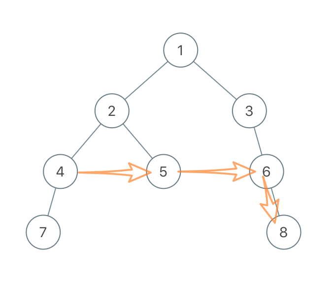

　　此外，要**先搜索右子树，后搜索左子树。**否则遇到如下图所示的情况时，给`7`的右孩子`0`找`next`时，`7`的`next的next`尚未搜索，因此无法找到`0`的`next`。  

　　

#### **代码:**

```python
class Solution:
    def connect(self, root: 'Node') -> 'Node':
        if not root:
            return None
            
        if not root.left and not root.right:
            return root

        curr = root.right
        if root.left and root.right:
            root.left.next = root.right
        elif root.left:
            curr = root.left

        temp = root.next
        next = None
        while temp:
            if temp.left:
                next = temp.left
                break
            elif temp.right:
                next = temp.right
                break
            temp = temp.next

        curr.next = next

        self.connect(root.right)
        self.connect(root.left)

        return root
```

## A118. 杨辉三角

难度 `简单`  
#### 题目描述

给定一个非负整数 *numRows* ，生成杨辉三角的前 *numRows* 行。


在杨辉三角中，每个数是它左上方和右上方的数的和。

> **示例:**

```
输入: 5
输出:
[
     [1],
    [1,1],
   [1,2,1],
  [1,3,3,1],
 [1,4,6,4,1]
]
```

#### 题目链接

<https://leetcode-cn.com/problems/pascals-triangle/>


#### 思路  


　　从上到下dp。  

#### 代码  
```python
class Solution:
    def generate(self, numRows: int) -> List[List[int]]:
        if numRows == 0:
            return []
        elif numRows == 1:
            return [[1]]

        ans = [[1]] + [[1] + [0 for i in range(j)] + [1] for j in range(numRows-1)]
        for i in range(2, len(ans)):
            for j in range(1, i):
                ans[i][j] = ans[i-1][j-1] + ans[i-1][j]

        return ans
```

## A120. 三角形最小路径和

难度 `中等`  
#### 题目描述

给定一个三角形，找出自顶向下的最小路径和。每一步只能移动到下一行中相邻的结点上。

例如，给定三角形：

```
[
     [2],
    [3,4],
   [6,5,7],
  [4,1,8,3]
]
```

自顶向下的最小路径和为 `11`（即，**2** + **3** + **5** + **1** = 11）。

**说明：**

如果你可以只使用 *O*(*n*) 的额外空间（*n* 为三角形的总行数）来解决这个问题，那么你的算法会很加分。

#### 题目链接

<https://leetcode-cn.com/problems/triangle/>


#### 思路  


　　从上到下动态规划。

#### 代码  
```python
class Solution:
    def minimumTotal(self, triangle: List[List[int]]) -> int:
        n = len(triangle)
        if n == 0:
            return 0
        ans = 0
        dp = [[0 for i in range(j+1)] for j in range(n)]
        dp[0][0] = triangle[0][0]
        for i in range(1, n):
            for j in range(i+1):
                cur = triangle[i][j]
                if j==0:  # 第一个数
                    dp[i][j] = cur + dp[i-1][0]
                elif j == i:  # 最后一个数
                    dp[i][j] = cur + dp[i-1][-1]
                else:  # 中间的数
                    dp[i][j] = cur + min(dp[i-1][j-1], dp[i-1][j])

        return min(dp[-1])
```

## A121. 买卖股票的最佳时机

难度 `简单`  
#### 题目描述

给定一个数组，它的第 *i* 个元素是一支给定股票第 *i* 天的价格。

如果你最多只允许完成一笔交易（即买入和卖出一支股票一次），设计一个算法来计算你所能获取的最大利润。

注意：你不能在买入股票前卖出股票。

> **示例 1:**

```
输入: [7,1,5,3,6,4]
输出: 5
解释: 在第 2 天（股票价格 = 1）的时候买入，在第 5 天（股票价格 = 6）的时候卖出，最大利润 = 6-1 = 5 。
     注意利润不能是 7-1 = 6, 因为卖出价格需要大于买入价格。
```

> **示例 2:**

```
输入: [7,6,4,3,1]
输出: 0
解释: 在这种情况下, 没有交易完成, 所以最大利润为 0。
```

#### 题目链接

<https://leetcode-cn.com/problems/best-time-to-buy-and-sell-stock/>


#### 思路  


　　使用双指针，`i`表示买入时的下标，`j`表示卖出时的下标，`ans`存放全局利润最大值。如果`卖出价格<=买入价格`，则将`买入价格`更新为`卖出价格`。否则`j`不断向后移，如果`prices[j]-prices[i]`大于`ans`，则更新全局的`ans`。  

#### 代码  
```python
class Solution:
    def maxProfit(self, prices: List[int]) -> int:
        i, j = 0, 1
        l = len(prices)
        ans = 0
        while True:
            if j >= l:
                return ans
            buy = prices[i]
            sell = prices[j]
            if sell <= buy:  # 卖出价格小于买入价格，则以卖出价格买入
                i = j
                j = j + 1
            else:
                ans = max(ans, sell - buy)  # 如果有更大利润则更新利润
                j += 1

        return ans

```

## A122. 买卖股票的最佳时机 II

难度`简单`

#### 题目描述

给定一个数组，它的第 *i* 个元素是一支给定股票第 *i* 天的价格。

设计一个算法来计算你所能获取的最大利润。你可以尽可能地完成更多的交易（多次买卖一支股票）。

**注意：**你不能同时参与多笔交易（你必须在再次购买前出售掉之前的股票）。
> **示例 1:**

```
输入: [7,1,5,3,6,4]
输出: 7
解释: 在第 2 天（股票价格 = 1）的时候买入，在第 3 天（股票价格 = 5）的时候卖出, 这笔交易所能获得利润 = 5-1 = 4 。
     随后，在第 4 天（股票价格 = 3）的时候买入，在第 5 天（股票价格 = 6）的时候卖出, 这笔交易所能获得利润 = 6-3 = 3 。
```

> **示例 2:**

```
输入: [1,2,3,4,5]
输出: 4
解释: 在第 1 天（股票价格 = 1）的时候买入，在第 5 天 （股票价格 = 5）的时候卖出, 这笔交易所能获得利润 = 5-1 = 4 。
     注意你不能在第 1 天和第 2 天接连购买股票，之后再将它们卖出。
     因为这样属于同时参与了多笔交易，你必须在再次购买前出售掉之前的股票。
```

> **示例 3:**

```
输入: [7,6,4,3,1]
输出: 0
解释: 在这种情况下, 没有交易完成, 所以最大利润为 0。
```
**提示：**

- `1 <= prices.length <= 3 * 10 ^ 4`
- `0 <= prices[i] <= 10 ^ 4`


#### 题目链接

<https://leetcode-cn.com/problems/best-time-to-buy-and-sell-stock-ii/>

#### **思路:**


　　贪心，如果某天的股票价格比前一天高，那么就赚取这两天之间的差价。  

#### **代码:**

```python
class Solution:
    def maxProfit(self, prices: List[int]) -> int:
        n = len(prices)
        ans = 0

        for i in range(1, n):
            if prices[i] > prices[i-1]:
                ans += prices[i] - prices[i-1]

        return ans

```

## A123. 买卖股票的最佳时机 III

难度 `困难`  
#### 题目描述

给定一个数组，它的第 *i* 个元素是一支给定的股票在第 *i* 天的价格。

设计一个算法来计算你所能获取的最大利润。你最多可以完成 *两笔* 交易。

**注意:** 你不能同时参与多笔交易（你必须在再次购买前出售掉之前的股票）。

> **示例 1:**

```
输入: [3,3,5,0,0,3,1,4]
输出: 6
解释: 在第 4 天（股票价格 = 0）的时候买入，在第 6 天（股票价格 = 3）的时候卖出，这笔交易所能获得利润 = 3-0 = 3 。
     随后，在第 7 天（股票价格 = 1）的时候买入，在第 8 天 （股票价格 = 4）的时候卖出，这笔交易所能获得利润 = 4-1 = 3 。
```

> **示例 2:**

```
输入: [1,2,3,4,5]
输出: 4
解释: 在第 1 天（股票价格 = 1）的时候买入，在第 5 天 （股票价格 = 5）的时候卖出, 这笔交易所能获得利润 = 5-1 = 4 。   
     注意你不能在第 1 天和第 2 天接连购买股票，之后再将它们卖出。   
     因为这样属于同时参与了多笔交易，你必须在再次购买前出售掉之前的股票。
```

> **示例 3:**

```
输入: [7,6,4,3,1] 
输出: 0 
解释: 在这个情况下, 没有交易完成, 所以最大利润为 0。
```

#### 题目链接

<https://leetcode-cn.com/problems/best-time-to-buy-and-sell-stock-iii/>

#### 思路  

1. `dp1[i]`=`prices[i] - minval` 从前往后遍历，表示第`i`天卖出第一笔的最大利润；
2. `dp2[i]`=`max(dp2[i+1], maxval - prices[i])` 从后往前遍历，表示第`i`天到最后一天之间的最大利润；
3. `ans`= `max(dp1[i] + dp2[i])`，`dp1[i] + dp2[i]` 正好表示从第1天到最后一天（在`i`天卖出第一笔）经过两次交易的最大利润，我们的目标是找到令总利润最大的`i`。  

　　例如对于示例1：  

```python
prices = [3, 3, 5, 0, 0, 3, 1, 4]
dp1 =    [0, 0, 2, 0, 0, 3, 1, 4]  # 第i天卖出的最大利润
dp2 =    [0, 4, 4, 4, 3, 3, 0, 0]  # 第i天之后进行的第二笔交易的最大利润
sum() =  [0, 4, 6, 4, 3, 6, 1, 4]  # dp1[i] + dp2[i]
max() = 6  # 在第3天或第6天第一次卖出股票都可以获得最大利润
```

#### 代码  
```python
class Solution:
    def maxProfit(self, prices: List[int]) -> int:
        #  dp1[i-1] 表示第i天售出第一笔股票，第一次交易的最大收益
        n = len(prices)
        if n < 2:
            return 0
        dp1 = [0 for i in range(n)]
        cost = prices[0]  # 成本
        for i in range(1, n):
            cost = min(cost, prices[i-1])
            dp1[i] = max(0, prices[i] - cost)
        # dp2[i] 表示第i天以后进行的第二次交易的最大收益
        sell = prices[-1]
        profit = 0
        dp2 = [0 for i in range(n)]
        for i in range(n-3, 0, -1): # n-3 ~ 1
            cost = prices[i+1]
            if sell < cost:
                sell = cost  # 如果卖的价格低，就以成本来卖
            profit = max(profit, sell - cost)
            dp2[i] = profit

        return max([sum(i) for i in zip(dp1, dp2)])  # p1和p2元素和的最大值

```

## A124. 二叉树中的最大路径和

难度`困难`

#### 题目描述

给定一个**非空**二叉树，返回其最大路径和。

本题中，路径被定义为一条从树中任意节点出发，达到任意节点的序列。该路径**至少包含一个**节点，且不一定经过根节点。

> **示例 1:**

```
输入: [1,2,3]

       1
      / \
     2   3

输出: 6
```

> **示例 2:**

```
输入: [-10,9,20,null,null,15,7]

   -10
   / \
  9  20
    /  \
   15   7

输出: 42
```

#### 题目链接

<https://leetcode-cn.com/problems/binary-tree-maximum-path-sum/>

#### **思路:**

　　dfs。搜索时要关注的有两种可能性：  

　　① 以根结点为**中间结点**(即穿过根结点)的最大路径，计算方法为`以左结点为终点的最大路径`+`以右结点为终点的最大路径`+`根结点值`。

　　② 以根结点为**终点**的最大路径，计算方法为 max(`以左结点为终点的最大路径`+`根结点值`，`以右结点为终点的最大路径`+`根结点值`，`单独根结点的值`)。简化后的表达式如下图所示：  

　　　　　　  
　　后序遍历，访问根结点时已经知道了两个孩子结点的①和②，按条件递归即可。  

#### **代码:**

```python
class Solution:
    def maxPathSum(self, root: TreeNode) -> int:
        ans = float('-inf')  

        def dfs(node): 
            if not node:
                return 0, 0

            nonlocal ans
            if not node.left and not node.right:  # 叶子结点
                ans = max(ans, node.val)
                return node.val, node.val

            cross_l, end_l = dfs(node.left)
            cross_r, end_r = dfs(node.right)

            cross_node = end_l + end_r + node.val
            end_node = max(end_l, end_r, 0) + node.val  # 可能用左子树或右子树，也可能都不用

            ans = max(ans, cross_node, end_node)  
            # cross_node表示以当前结点为中间结点的最大路径 
            # end_node表示以当前结点为终点的最大路径
            return cross_node, end_node

        dfs(root)
        return ans
      
```

## A125. 验证回文串

难度 `简单`  
#### 题目描述

给定一个字符串，验证它是否是回文串，只考虑字母和数字字符，可以忽略字母的大小写。

**说明：**本题中，我们将空字符串定义为有效的回文串。

> **示例 1:**

```
输入: "A man, a plan, a canal: Panama"
输出: true
```

> **示例 2:**

```
输入: "race a car"
输出: false
```

#### 题目链接

<https://leetcode-cn.com/problems/valid-palindrome/>


#### 思路  


　　先去掉其他字符，只保留`数字和字母`，然后转成`全部小写`。最后判断是否是回文串。  

#### 代码  
```python
class Solution:
    def isPalindrome(self, s: str) -> bool:
        s = ''.join(filter(str.isalnum, s)).lower()
        return s == s[::-1]
```

## A126. 单词接龙 II

难度 `困难`  

#### 题目描述

给定两个单词（*beginWord* 和 *endWord*）和一个字典 *wordList* ，找出所有从 *beginWord* 到 *endWord* 的最短转换序列。转换需遵循如下规则：

1. 每次转换只能改变一个字母。
2. 转换过程中的中间单词必须是字典中的单词。

**说明:**

- 如果不存在这样的转换序列，返回一个空列表。
- 所有单词具有相同的长度。
- 所有单词只由小写字母组成。
- 字典中不存在重复的单词。
- 你可以假设 *beginWord* 和 *endWord* 是非空的，且二者不相同。

> **示例 1:**

```
输入:
beginWord = "hit",
endWord = "cog",
wordList = ["hot","dot","dog","lot","log","cog"]

输出:
[
  ["hit","hot","dot","dog","cog"],
  ["hit","hot","lot","log","cog"]
]
```

> **示例 2:**

```
输入:
beginWord = "hit"
endWord = "cog"
wordList = ["hot","dot","dog","lot","log"]

输出: []

解释: endWord "cog" 不在字典中，所以不存在符合要求的转换序列。
```

#### 题目链接

<https://leetcode-cn.com/problems/word-ladder-ii/>

#### 思路  

　　这题实际上是图论中的**单源最短路径**问题，只相差一个字母的两个字符串之间有一条边，如下图所示。  

　　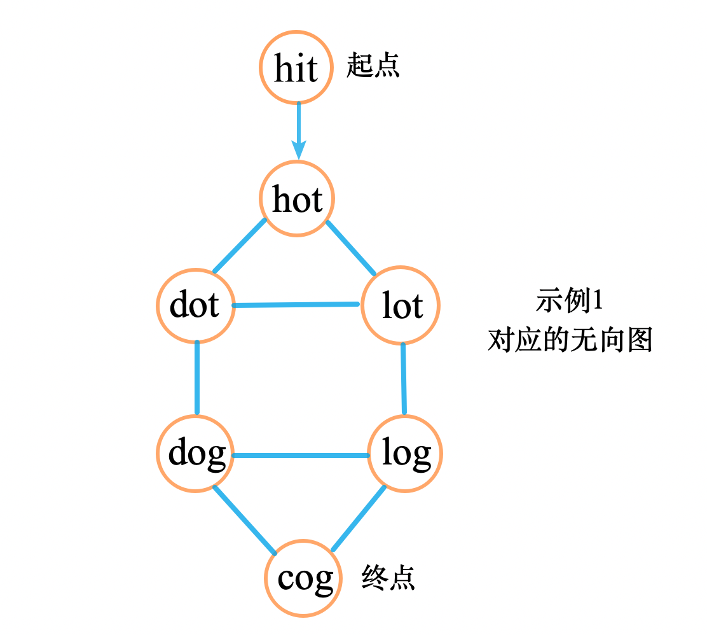

　　单词的数量可能会非常多，有很多根本就用不到，因此**不需要构建完整的图**。  

　　对`当前字母的每一位`都替换成另外的小写字母，如果这个新单词在`wordList`中，那么它和当前单词之间就有一条边。这样做复杂度仅有`26*l*log(N)`，其中`l`表示单词长度，`N`表示词汇表长度。而遍历`wordList`复杂度为`N^2`。  

　　构建好图之后，广度优先搜索即可，在搜索过程中记录来的时候的路径。  

#### 代码  

```python
from collections import defaultdict
class Solution:
    def findLadders(self, beginWord: str, endWord: str, wordList: List[str]) -> List[List[str]]:
        edge = defaultdict(list)
        paths = defaultdict(list)  # 存放所有的结果，ans也由它返回

        word_bag = frozenset(wordList)
        w = [beginWord] + wordList if beginWord not in wordList else wordList
        visited = {i: False for i in w}
        n = len(w)
        # print('length', n)
        l = len(beginWord)

        # 获取相邻的边
        def get_edges(cur_word):
            next_words = []
            for i in range(l):
                for c in list(string.ascii_lowercase):
                    next_word = cur_word[:i] + c + cur_word[i + 1:]
                    if next_word != cur_word and next_word in word_bag:
                        next_words.append(next_word)
            return next_words

        # BFS模板
        paths[beginWord] = [[beginWord]]
        queue = [beginWord]
        while queue:
            for q in queue:
                visited[q] = True

            temp = []
            for q in queue:
                if q == endWord:
                    # print(paths)
                    return paths[endWord]
                for neibour in get_edges(q):
                    if not visited[neibour]:
                        if neibour not in temp:
                            temp.append(neibour)
                        # print('  ', neibour, ' 入队列')
                        for path in paths[q]:
                            paths[neibour].append(path + [neibour])
                            
            queue = temp
            
        return []
```


## A127. 单词接龙

难度`中等`

#### 题目描述

给定两个单词（*beginWord* 和 *endWord* ）和一个字典，找到从 *beginWord* 到 *endWord* 的最短转换序列的长度。转换需遵循如下规则：

1. 每次转换只能改变一个字母。
2. 转换过程中的中间单词必须是字典中的单词。

**说明:**

- 如果不存在这样的转换序列，返回 0。
- 所有单词具有相同的长度。
- 所有单词只由小写字母组成。
- 字典中不存在重复的单词。
- 你可以假设 *beginWord* 和 *endWord* 是非空的，且二者不相同。

> **示例 1:**

```
输入:
beginWord = "hit",
endWord = "cog",
wordList = ["hot","dot","dog","lot","log","cog"]

输出: 5

解释: 一个最短转换序列是 "hit" -> "hot" -> "dot" -> "dog" -> "cog",
     返回它的长度 5。
```

> **示例 2:**

```
输入:
beginWord = "hit"
endWord = "cog"
wordList = ["hot","dot","dog","lot","log"]

输出: 0

解释: endWord "cog" 不在字典中，所以无法进行转换。
```

#### 题目链接

<https://leetcode-cn.com/problems/word-ladder/)>

#### **思路:**

　　标准的bfs。这题主要的时间花在**找相邻的结点上**。  

　　如果每次都遍历`wordList`去找相邻的结点，要花费大量的时间(时间复杂度`O(n^2)`)。因此采用把单词的某个字母替换成其他小写字母的方式，时间复杂度仅为`O(n*l)`，`l`为单词长度。  

#### **代码:**

```python
from collections import defaultdict

class Solution:
    def ladderLength(self, beginWord: str, endWord: str, wordList: List[str]) -> int:
        if endWord not in wordList:
            return 0

        d = defaultdict(list)
        for word in wordList:
            for i in range(len(word)):
                d[word[:i] + "*" + word[i + 1:]].append(word)

        visited = {i: False for i in wordList}
        visited[beginWord] = False

        queue = [beginWord]
        depth = 1
        while queue:
            temp = []
            for q in queue:
                visited[q] = True

            for q in queue:
                if q == endWord:
                    return depth  # 到达终点

                for i in range(len(q)):
                    key = q[:i] + "*" + q[i + 1:]
                    for neibour in d[key]:
                        if not visited[neibour]:
                            temp.append(neibour)
            depth += 1
            queue = temp
            del temp

        return 0

```

## A128. 最长连续序列

难度`困难`

#### 题目描述

给定一个未排序的整数数组，找出最长连续序列的长度。

要求算法的时间复杂度为 *O(n)*。

> **示例:**

```
输入: [100, 4, 200, 1, 3, 2]
输出: 4
解释: 最长连续序列是 [1, 2, 3, 4]。它的长度为 4。
```

#### 题目链接

<https://leetcode-cn.com/problems/longest-consecutive-sequence/>

#### **思路:**　　　　

　　用哈希表存储每个数值所在连续区间的长度

① 若数已在哈希表中：说明已经处理过了，跳过不做处理；  
② 若是新数：取出其左右相邻数已有的连续区间长度`left`和`right`，新数和左右的数能够组成的最长区间为：`cur`=`left + right + 1`；  

③ 更新区间两端点的长度值；  

④ 如果`cur > ans`，则更新`ans`。  

#### **代码:**

```python
from collections import defaultdict
class Solution:
    def longestConsecutive(self, nums: List[int]) -> int:
        mem = defaultdict(int)
        ans = 0
        for num in nums:
            if mem[num] != 0:
                continue
            left = mem[num-1]
            right = mem[num+1]
            cur = left + right + 1

            mem[num] = cur
            mem[num-left] = cur
            mem[num+right] = cur

            ans = max(ans, cur)

        return ans

```

## A129. 求根到叶子节点数字之和

难度`中等`

#### 题目描述

给定一个二叉树，它的每个结点都存放一个 `0-9` 的数字，每条从根到叶子节点的路径都代表一个数字。

例如，从根到叶子节点路径 `1->2->3` 代表数字 `123`。

计算从根到叶子节点生成的所有数字之和。

**说明:** 叶子节点是指没有子节点的节点。

> **示例 1:**

```
输入: [1,2,3]
    1
   / \
  2   3
输出: 25
解释:
从根到叶子节点路径 1->2 代表数字 12.
从根到叶子节点路径 1->3 代表数字 13.
因此，数字总和 = 12 + 13 = 25.
```

> **示例 2:**

```
输入: [4,9,0,5,1]
    4
   / \
  9   0
 / \
5   1
输出: 1026
解释:
从根到叶子节点路径 4->9->5 代表数字 495.
从根到叶子节点路径 4->9->1 代表数字 491.
从根到叶子节点路径 4->0 代表数字 40.
因此，数字总和 = 495 + 491 + 40 = 1026.
```

#### 题目链接

<https://leetcode-cn.com/problems/sum-root-to-leaf-numbers/>

#### **思路:**

　　dfs。用一个全局变量记录`从根结点到当前结点的路径`，当到达叶子结点时结果累加上这条路径的`数值`。  　　

#### **代码:**

```python
class Solution:
    def sumNumbers(self, root: TreeNode) -> int:
        curr = ''  # 路径字符串
        ans = 0  # 累加结果
        def dfs(node):
            if not node:
                return 

            nonlocal curr, ans
            curr += str(node.val)

            if not node.left and not node.right:
                ans += int(curr)
                curr = curr[:-1]
                return 

            dfs(node.left)
            dfs(node.right)

            curr = curr[:-1]  # 恢复到函数调用前的状态

        dfs(root)
        return ans
      
```

## A130. 被围绕的区域

难度`中等`

#### 题目描述

给定一个二维的矩阵，包含 `'X'` 和 `'O'`（**字母 O**）。

找到所有被 `'X'` 围绕的区域，并将这些区域里所有的 `'O'` 用 `'X'` 填充。

> **示例:**

```
X X X X
X O O X
X X O X
X O X X
```

运行你的函数后，矩阵变为：

```
X X X X
X X X X
X X X X
X O X X
```

**解释:**

被围绕的区间不会存在于边界上，换句话说，任何边界上的 `'O'` 都不会被填充为 `'X'`。 任何不在边界上，或不与边界上的 `'O'` 相连的 `'O'` 最终都会被填充为 `'X'`。如果两个元素在水平或垂直方向相邻，则称它们是“相连”的。

#### 题目链接

<https://leetcode-cn.com/problems/surrounded-regions/>

#### **思路:**

　　先沿着**边界的**每个`"O"`进行dfs，把所有搜索到的`"O"`都替换成`"F"`。  

　　然后把剩下的`”O“`都替换成`"X"`。  

　　最后把`"F"`再替换回`"O"`。

#### **代码:**

```python
class Solution:
    def solve(self, board: List[List[str]]) -> None:
        """
        Do not return anything, modify board in-place instead.
        """
        arounds = [(-1, 0), (1, 0), (0, -1), (0, 1)]
        m = len(board)
        if not m: return 
        n = len(board[0])
        def dfs(i, j):
            if i < 0 or j < 0 or i >= m or j >= n:
                return

            if board[i][j] != 'O':
                return

            board[i][j] = 'F'  # fixed
            for di, dj in arounds:
                dfs(i + di, j + dj)

        for i in range(m):
            for j in range(n):
                if i == 0 or i == m-1 or j == 0 or j == n-1:  # 边界
                    dfs(i, j)
            
        def replace(a, b):
            for i in range(m):
                for j in range(n):
                    if board[i][j] == a:
                        board[i][j] = b

        replace('O', 'X')
        replace('F', 'O')
        
```


## A131. 分割回文串

难度`中等`

#### 题目描述

给定一个字符串 *s*，将 *s* 分割成一些子串，使每个子串都是回文串。

返回 *s* 所有可能的分割方案。

> **示例:**

```
输入: "aab"
输出:
[
  ["aa","b"],
  ["a","a","b"]
]
```

#### 题目链接

<https://leetcode-cn.com/problems/palindrome-partitioning/>

#### **思路:**

　　递归，如果`s`的前`i`位是回文，就对后`n-i`位递归地进行分割，直到分割到空字符串返回。  　　　　

#### **代码:**

```python
class Solution:
    def partition(self, s: str) -> List[List[str]]:
      
        def recur(s):  # 递归
            if len(s) == 0:  # 空字符串是回文的
                return [[]]

            res = []
            for i in range(1, len(s)+1):
                if s[:i] == s[:i][::-1]:  # s的前i位是回文的
                    for line in recur(s[i:]):
                        res.append([s[:i]] + line)
                        
            return res
          
        return recur(s)
      
```


## A132. 分割回文串 II

难度 `困难`  
#### 题目描述

给定一个字符串 *s*，将 *s* 分割成一些子串，使每个子串都是回文串。

返回符合要求的最少分割次数。

> **示例:**

```
输入: "aab"
输出: 1
解释: 进行一次分割就可将 s 分割成 ["aa","b"] 这样两个回文子串。
```

#### 题目链接

<https://leetcode-cn.com/problems/palindrome-partitioning-ii/>

#### 思路  

　　方法一：暴力递归，对字符串`s`（`s`不为回文串）的每个位置都尝试分割，`总的分割次数`=`左串分割次数`+`右串分割次数`+`1`。用时很长，使用缓存记录计算过的字符串能勉强AC。  
　　方法二：动态规划。`dp[i+1]`表示以`s[i]`结尾的最少分割次数。  

　　例如对于示例`"ababacccab"`：`dp[i+1]`的更新过程如下图所示：  

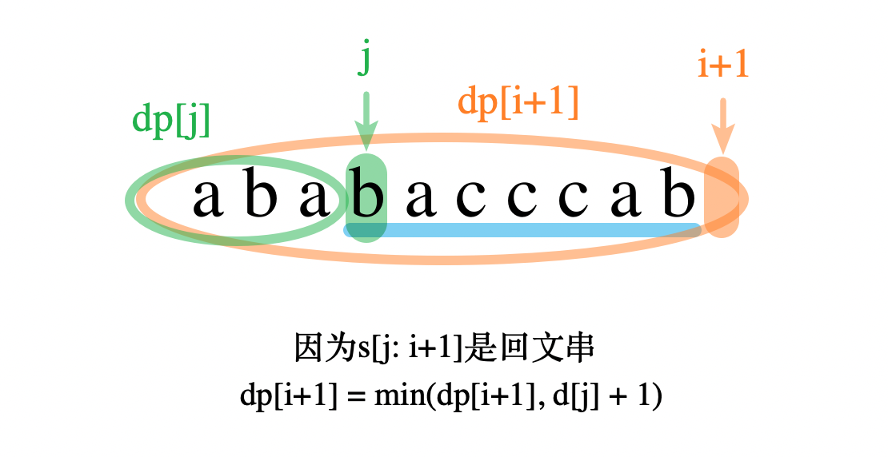

　　依次寻找`s`中以每个字母结尾的所有回文串，如果找到了回文串，则以这个回文串起始位置做分割，看能不能使`dp[i+1]`变小。  

#### 代码  

　　方法一：  

```python
class Solution:
    def minCut(self, s: str) -> int:
        """
        暴力，用时1406ms，勉强AC。  
        """
        from functools import lru_cache
        @lru_cache(None)  # 使用缓存记录已经计算过的结果
        def dp(s: str):
            if len(s) <= 1 or s == s[::-1]:
                return 0  # 本身就是回文，不需要分割

            ans = float('inf')
            for i in range(1, len(s)):
                if s[:i] == s[:i][::-1]:  # 前面是回文串才有分的意义
                    ans = min(ans, dp(s[i:]) + 1)
            
            return ans

        return dp(s)

```

　　方法二：

```python
class Solution:
    def minCut(self, s: str) -> int:
        if s == s[::-1]: return 0

        dp = [len(s) for i in range(len(s) + 1)]
        
        dp[0] = -1
        for i in range(len(s)):
            if s[:i] == s[:i][::-1] and s[i:] == s[i:][::-1]:
                return 1
            for j in range(i + 1):
                if s[j] == s[i] and s[j:i+1] == s[j:i+1][::-1]:
                    dp[i + 1] = min(dp[i + 1], dp[j] + 1)
                    
        return dp[-1]
      
```

## A133. 克隆图

难度`中等`

#### 题目描述

给你无向 **连通** 图中一个节点的引用，请你返回该图的 [**深拷贝**](https://baike.baidu.com/item/深拷贝/22785317?fr=aladdin)（克隆）。

图中的每个节点都包含它的值 `val`（`int`） 和其邻居的列表（`list[Node]`）。

```
class Node {
    public int val;
    public List<Node> neighbors;
} 
```

**测试用例格式：**

简单起见，每个节点的值都和它的索引相同。例如，第一个节点值为 1（`val = 1`），第二个节点值为 2（`val = 2`），以此类推。该图在测试用例中使用邻接列表表示。

**邻接列表** 是用于表示有限图的无序列表的集合。每个列表都描述了图中节点的邻居集。

给定节点将始终是图中的第一个节点（值为 1）。你必须将 **给定节点的拷贝** 作为对克隆图的引用返回。

> **示例 1：**


```
输入：adjList = [[2,4],[1,3],[2,4],[1,3]]
输出：[[2,4],[1,3],[2,4],[1,3]]
解释：
图中有 4 个节点。
节点 1 的值是 1，它有两个邻居：节点 2 和 4 。
节点 2 的值是 2，它有两个邻居：节点 1 和 3 。
节点 3 的值是 3，它有两个邻居：节点 2 和 4 。
节点 4 的值是 4，它有两个邻居：节点 1 和 3 。
```

> **示例 2：**


```
输入：adjList = [[]]
输出：[[]]
解释：输入包含一个空列表。该图仅仅只有一个值为 1 的节点，它没有任何邻居。
```

> **示例 3：**

```
输入：adjList = []
输出：[]
解释：这个图是空的，它不含任何节点。
```

> **示例 4：**


```
输入：adjList = [[2],[1]]
输出：[[2],[1]]
```

#### 题目链接

<https://leetcode-cn.com/problems/clone-graph/>

#### **思路:**

　　用一个字典记录`结点值`和`结点指针`的映射关系，这样在一条**新的边**连接到**旧的结点**上时就能找到之前创建过的结点。  

　　顺便提一下**浅拷贝**和**深拷贝**的区别：**浅拷贝**将原来的图拷贝一遍，增加或删除结点不会影响原来的图，但是浅拷贝**图中的结点还是原来的结点**，修改图中结点的值会影响原图中结点的值。而**深拷贝**将所有的结点都重新初始化一遍，也就是新的图和旧的图完全没有关系了。  

```python
G = [node1, node2, node3, node4]
G_浅拷贝 = [node1, node2, node3, node4]
G_深拷贝 = [new_node1, new_node2, new_node3, new_node4]
```

#### **代码:**

```python
class Solution:
    def cloneGraph(self, node: 'Node') -> 'Node':
        visited = {}
        def dfs(node):
            if not node:
                return None

            temp = Node(node.val)
            visited[node.val] = temp
            for n in node.neighbors:
                if n.val in visited:
                    temp.neighbors.append(visited[n.val])
                    continue
                temp.neighbors.append(dfs(n))      

            return temp

        return dfs(node)

```

 ## A134. 加油站

难度`中等`

#### 题目描述

  在一条环路上有 *N* 个加油站，其中第 *i* 个加油站有汽油 `gas[i]` 升。

  你有一辆油箱容量无限的的汽车，从第 *i* 个加油站开往第 *i+1* 个加油站需要消耗汽油 `cost[i]` 升。你从其中的一个加油站出发，开始时油箱为空。

  如果你可以绕环路行驶一周，则返回出发时加油站的编号，否则返回 -1。

  **说明:** 

  - 如果题目有解，该答案即为唯一答案。
  - 输入数组均为非空数组，且长度相同。
  - 输入数组中的元素均为非负数。

>  **示例 1:**

  ```
  输入: 
  gas  = [1,2,3,4,5]
  cost = [3,4,5,1,2]
  
  输出: 3
  
  解释:
  从 3 号加油站(索引为 3 处)出发，可获得 4 升汽油。此时油箱有 = 0 + 4 = 4 升汽油
  开往 4 号加油站，此时油箱有 4 - 1 + 5 = 8 升汽油
  开往 0 号加油站，此时油箱有 8 - 2 + 1 = 7 升汽油
  开往 1 号加油站，此时油箱有 7 - 3 + 2 = 6 升汽油
  开往 2 号加油站，此时油箱有 6 - 4 + 3 = 5 升汽油
  开往 3 号加油站，你需要消耗 5 升汽油，正好足够你返回到 3 号加油站。
  因此，3 可为起始索引。
  ```

>  **示例 2:**

  ```
  输入: 
  gas  = [2,3,4]
  cost = [3,4,3]
  
  输出: -1
  
  解释:
  你不能从 0 号或 1 号加油站出发，因为没有足够的汽油可以让你行驶到下一个加油站。
  我们从 2 号加油站出发，可以获得 4 升汽油。 此时油箱有 = 0 + 4 = 4 升汽油
  开往 0 号加油站，此时油箱有 4 - 3 + 2 = 3 升汽油
  开往 1 号加油站，此时油箱有 3 - 3 + 3 = 3 升汽油
  你无法返回 2 号加油站，因为返程需要消耗 4 升汽油，但是你的油箱只有 3 升汽油。
  因此，无论怎样，你都不可能绕环路行驶一周。
  ```


#### 题目链接

<https://leetcode-cn.com/problems/gas-station/>

#### **思路:**


　　贪心算法。假设从编号为0站开始，一直到`k`站都正常，在开往`k+1`站时车子没油了。这时，应该将起点设置为`k+1`站。  

#### **代码:**

```python
class Solution:
    def canCompleteCircuit(self, gas: List[int], cost: List[int]) -> int:
        if sum(gas) < sum(cost):
            return -1
        n = len(gas)
        nums = [gas[i] - cost[i] for i in range(n)]  # 油量净增长

        fuel = nums[0]

        ans = 0
        for i in range(1, n):
            if fuel < 0:  # 没油了
                ans = i
                fuel = nums[i]  # i设为起点，并且在i加油，重新开
            else:
                fuel += nums[i]

        return ans

```

## A135. 分发糖果

难度`困难`

#### 题目描述

老师想给孩子们分发糖果，有 *N* 个孩子站成了一条直线，老师会根据每个孩子的表现，预先给他们评分。

你需要按照以下要求，帮助老师给这些孩子分发糖果：

- 每个孩子至少分配到 1 个糖果。
- 相邻的孩子中，评分高的孩子必须获得更多的糖果。

那么这样下来，老师至少需要准备多少颗糖果呢？

> **示例 1:**

```
输入: [1,0,2]
输出: 5
解释: 你可以分别给这三个孩子分发 2、1、2 颗糖果。
```

> **示例 2:**

```
输入: [1,2,2]
输出: 4
解释: 你可以分别给这三个孩子分发 1、2、1 颗糖果。
     第三个孩子只得到 1 颗糖果，这已满足上述两个条件。
```


#### 题目链接

<https://leetcode-cn.com/problems/candy/>

#### **思路:**


　　按评分排序，评分最少的给1个糖，然后从评分低到高依次访问。如果有前后的小朋友分数低但糖更多的(假设有`n`个糖)，就给这个小朋友分`n+1`个糖。

#### **代码:**

```python
class Solution:
    def candy(self, ratings: List[int]) -> int:
        n = len(ratings)
        candies = [0 for _ in range(n)]

        mem = sorted([(r, i) for i, r in enumerate(ratings)])
        
        for _, i in mem:  # 按评分从低到高访问
            if i >= 1 and ratings[i] > ratings[i-1]:  # 比前面的更高
                if candies[i] <= candies[i-1]:  # 糖却少
                    candies[i] = candies[i-1] + 1

            if i < n - 1 and ratings[i] > ratings[i+1]:  # 比后面的更高
                if candies[i] <= candies[i+1]:  # 糖却少
                    candies[i] = candies[i+1] + 1

        return sum(candies) + n

```

## A136. 只出现一次的数字

难度`简单`

#### 题目描述

给定一个**非空**整数数组，除了某个元素只出现一次以外，其余每个元素均出现两次。找出那个只出现了一次的元素。

**说明：**

你的算法应该具有线性时间复杂度。 你可以不使用额外空间来实现吗？

> **示例 1:**

```
输入: [2,2,1]
输出: 1
```

> **示例 2:**

```
输入: [4,1,2,1,2]
输出: 4
```

#### 题目链接

<https://leetcode-cn.com/problems/single-number/>

#### **思路:**

　　用位运算**异或**来求解。  

　　已知`0 ^ num = num`，`num ^ num = 0`。  

　　另外，异或运算满足交换律，即`a ^ b ^ c = c ^ a ^ b`。  

　　将所有数取异或，两两相同的元素异或会得到`0`消除掉，结果就是剩下的`只出现一次`的元素。  

#### **代码:**

　　**方法一：**(异或)

```python
class Solution:
    def singleNumber(self, nums: List[int]) -> int:
        ans = 0
        for num in nums:
            ans ^= num

        return ans

```

　　**方法二：**(集合)

```python
class Solution:
    def singleNumber(self, nums: List[int]) -> int:
        s = set()
        for num in nums:
            if num in s:
                s.remove(num)
            else:
                s.add(num)

        return s.pop()
      
```

## A137. 只出现一次的数字 II

难度`中等`

#### 题目描述

给定一个**非空**整数数组，除了某个元素只出现一次以外，其余每个元素均出现了三次。找出那个只出现了一次的元素。

**说明：**

你的算法应该具有线性时间复杂度。 你可以不使用额外空间来实现吗？

> **示例 1:**

```
输入: [2,2,3,2]
输出: 3
```

> **示例 2:**

```
输入: [0,1,0,1,0,1,99]
输出: 99
```

#### 题目链接

<https://leetcode-cn.com/problems/single-number-ii/>

#### **思路:**

　　计一个状态转换电路，使得一个数出现3次时能自动抵消为0，最后剩下的就是只出现1次的数。  

　　`a`、`b`变量中，相同位置上，分别取出一位，负责完成`00->01->10->00`，当数字出现3次时置零。  

#### **代码:**

```python
class Solution:
    def singleNumber(self, nums: List[int]) -> int:
        a = b = 0
        for num in nums:
            b = (b ^ num) & ~a;
            a = (a ^ num) & ~b;
        
        return b;

```

## A138. 复制带随机指针的链表

难度`中等`

#### 题目描述

给定一个链表，每个节点包含一个额外增加的随机指针，该指针可以指向链表中的任何节点或空节点。

要求返回这个链表的 **深拷贝**。 

我们用一个由 `n` 个节点组成的链表来表示输入/输出中的链表。每个节点用一个 `[val, random_index]` 表示：

- `val`：一个表示 `Node.val` 的整数。
- `random_index`：随机指针指向的节点索引（范围从 `0` 到 `n-1`）；如果不指向任何节点，则为  `null` 。

> **示例 1：**


```
输入：head = [[7,null],[13,0],[11,4],[10,2],[1,0]]
输出：[[7,null],[13,0],[11,4],[10,2],[1,0]]
```

> **示例 2：**


```
输入：head = [[1,1],[2,1]]
输出：[[1,1],[2,1]]
```

> **示例 3：**


```
输入：head = [[3,null],[3,0],[3,null]]
输出：[[3,null],[3,0],[3,null]]
```

> **示例 4：**

```
输入：head = []
输出：[]
解释：给定的链表为空（空指针），因此返回 null。
```

**提示：**

- `-10000 <= Node.val <= 10000`
- `Node.random` 为空（null）或指向链表中的节点。
- 节点数目不超过 1000 。

#### 题目链接

<https://leetcode-cn.com/problems/copy-list-with-random-pointer/>

#### **思路:**

　　第一次遍历(用哈希表)记录原始链表结点与下标的映射，第二次遍历记录原始链表每个结点与`random指针`指向结点的**下标**的映射，第三次遍历复制链表，并根据下标复制`random指针`。  　　

#### **代码:**

```python
"""
class Node:
    def __init__(self, x: int, next: 'Node' = None, random: 'Node' = None):
        self.val = int(x)
        self.next = next
        self.random = random
"""
class Solution:
    def copyRandomList(self, head: 'Node') -> 'Node':
        origin = {}  # node: index
        random = {}
        copy = {}  # index: node
        i = 0
        node = head
        ans = node_copy = Node(0)
        while node:  # 第一遍遍历
            origin[node] = i
            new_node = Node(node.val)
            copy[i] = new_node
            node_copy.next = new_node
            node_copy = new_node

            node = node.next
            i += 1

        node = head
        i = 0 
        while node:
            random[i] = None if node.random is None else origin[node.random]
            node = node.next
            i += 1

        node = ans.next
        i = 0
        while node:
            node.random = None if random[i] is None else copy[random[i]]
            node = node.next
            i += 1

        return ans.next        

```

## A139. 单词拆分

难度 `中等`  
#### 题目描述

给定一个**非空**字符串 *s* 和一个包含**非空**单词列表的字典 *wordDict*，判定 *s* 是否可以被空格拆分为一个或多个在字典中出现的单词。

**说明：**

- 拆分时可以重复使用字典中的单词。
- 你可以假设字典中没有重复的单词。

> **示例 1：**

```
输入: s = "leetcode", wordDict = ["leet", "code"]
输出: true
解释: 返回 true 因为 "leetcode" 可以被拆分成 "leet code"。
```

> **示例 2：**

```
输入: s = "applepenapple", wordDict = ["apple", "pen"]
输出: true
解释: 返回 true 因为 "applepenapple" 可以被拆分成 "apple pen apple"。
     注意你可以重复使用字典中的单词。
```

> **示例 3：**

```
输入: s = "catsandog", wordDict = ["cats", "dog", "sand", "and", "cat"]
输出: false
```

#### 题目链接

<https://leetcode-cn.com/problems/word-break/>


#### 思路  


　　动态规划。`dp[i]`表示字符串`s`的前`i`个字符能否拆分成`wordDict`。  

#### 代码  

　　写法一（记忆数组）：  

```python
class Solution:
    def wordBreak(self, s: str, wordDict: List[str]) -> bool:
        n=len(s)
        dp=[False]*(n+1)
        dp[0]=True
        word=set(wordDict)
        for i in range(1,n+1):
            for j in range(i):
                if dp[j] and s[j:i] in word:
                    dp[i]=True
                    break
        return dp[n]
```

　　写法二（缓存）：   

```python
class Solution:
    def wordBreak(self, s: str, wordDict: List[str]) -> bool:
        set_w = set(wordDict)
        if len(set_w) == 0:
            return not s

        from functools import lru_cache
        @lru_cache(None)  # 使用缓存记录已经计算过的结果
        def dp(s: str):
            if s in set_w:
                return True

            for i in range(len(s)):
                if s[:i] in set_w and dp(s[i:]): return True

            return False

        return dp(s)

```

## A140. 单词拆分 II

难度 `困难`  
#### 题目描述

给定一个**非空**字符串 *s* 和一个包含**非空**单词列表的字典 *wordDict*，在字符串中增加空格来构建一个句子，使得句子中所有的单词都在词典中。返回所有这些可能的句子。

**说明：**

- 分隔时可以重复使用字典中的单词。
- 你可以假设字典中没有重复的单词。

> **示例 1：**

```
输入:
s = "catsanddog"
wordDict = ["cat", "cats", "and", "sand", "dog"]
输出:
[
  "cats and dog",
  "cat sand dog"
]
```

> **示例 2：**

```
输入:
s = "pineapplepenapple"
wordDict = ["apple", "pen", "applepen", "pine", "pineapple"]
输出:
[
  "pine apple pen apple",
  "pineapple pen apple",
  "pine applepen apple"
]
解释: 注意你可以重复使用字典中的单词。
```

> **示例 3：**

```
输入:
s = "catsandog"
wordDict = ["cats", "dog", "sand", "and", "cat"]
输出:
[]
```

#### 题目链接

<https://leetcode-cn.com/problems/word-break-ii/>


#### 思路  


　　有个用例 aaaaaaa…aaaaabaaaaa...aaaaaaa 超出内存。先用上一题[A131.单词拆分](/dp?id=a139-单词拆分)的代码判断一下，如果能拆分再用数组记录。  

#### 代码  
```python
class Solution:
    def wordBreak(self, s: str, wordDict: List[str]) -> List[str]:
        n = len(s)
        can=[False]*(n+1)
        can[0]=True
        word=set(wordDict)
        for i in range(1,n+1):
            for j in range(i):
                if can[j] and s[j:i] in word:
                    can[i]=True
                    break

        if not can[n]:  # s不能拆分成wordDict
            return []

        dp = [[] for i in range(n + 1)]
        for i in range(1, n + 1):
            if not can[i]: continue
            
            if s[:i] in wordDict:
                dp[i].append(s[:i])

            for j in range(1, i):
                if len(dp[j]) > 0 and s[j:i] in word:
                    for sentence in dp[j]:
                        dp[i].append(sentence + ' ' + s[j:i])

        return dp[n]
      
```

## A141. 环形链表

难度`简单`

#### 题目描述

给定一个链表，判断链表中是否有环。

为了表示给定链表中的环，我们使用整数 `pos` 来表示链表尾连接到链表中的位置（索引从 0 开始）。 如果 `pos` 是 `-1`，则在该链表中没有环。
> **示例 1：**

```
输入：head = [3,2,0,-4], pos = 1
输出：true
解释：链表中有一个环，其尾部连接到第二个节点。
```


> **示例 2：**

```
输入：head = [1,2], pos = 0
输出：true
解释：链表中有一个环，其尾部连接到第一个节点。
```


> **示例 3：**

```
输入：head = [1], pos = -1
输出：false
解释：链表中没有环。
```

  

**进阶：**

你能用 *O(1)*（即，常量）内存解决此问题吗？

#### 题目链接

<https://leetcode-cn.com/problems/linked-list-cycle/>

#### **思路:**


　　快慢指针，如果链表中有环，快慢指针一定会相交。  

#### **代码:**

```python
class Solution:
    def hasCycle(self, head: ListNode) -> bool:
        fast = slow = head
        while fast and fast.next:
            fast = fast.next.next  # 快指针一次走2步
            slow = slow.next  # 慢指针一次走1步
            if fast == slow:
                return True

        return False

```

## A142. 环形链表 II

难度`中等`

#### 题目描述

给定一个链表，返回链表开始入环的第一个节点。 如果链表无环，则返回 `null`。

为了表示给定链表中的环，我们使用整数 `pos` 来表示链表尾连接到链表中的位置（索引从 0 开始）。 如果 `pos` 是 `-1`，则在该链表中没有环。

**说明：**不允许修改给定的链表。
> **示例 1：**

```
输入：head = [3,2,0,-4], pos = 1
输出：tail connects to node index 1
解释：链表中有一个环，其尾部连接到第二个节点。
```


> **示例 2：**

```
输入：head = [1,2], pos = 0
输出：tail connects to node index 0
解释：链表中有一个环，其尾部连接到第一个节点。
```


> **示例 3：**

```
输入：head = [1], pos = -1
输出：no cycle
解释：链表中没有环。
```

  

**进阶：**
你是否可以不用额外空间解决此题？


#### 题目链接

<https://leetcode-cn.com/problems/linked-list-cycle-ii/>

#### **思路:**

　　① 先用快慢指针，如果链表中有环，快慢指针一定会相交(假设相交于`slow`)。  

　　② 再用另外一个指针`p`初始指向`head`结点，`p`和`slow`每次都向后移一步，最终必然相交于环的起始点。  

#### **代码:**

```python

class Solution:
    def detectCycle(self, head: ListNode) -> ListNode:
        fast = slow = head
        while fast and fast.next:
            fast = fast.next.next  # 快指针一次走2步
            slow = slow.next  # 慢指针一次走1步
            if fast == slow:
                p = head
                while slow != p:
                    p= p.next
                    slow = slow.next
                return slow

        return None

```

## A143. 重排链表

难度`中等`

#### 题目描述

给定一个单链表 *L*：*L*0→*L*1→…→*Ln*-1→*L*n ，
将其重新排列后变为： *L*0→*Ln*→*L*1→*Ln*-1→*L*2→*Ln*-2→…

你不能只是单纯的改变节点内部的值，而是需要实际的进行节点交换。

> **示例 1:**

```
给定链表 1->2->3->4, 重新排列为 1->4->2->3.
```

> **示例 2:**

```
给定链表 1->2->3->4->5, 重新排列为 1->5->2->4->3.
```

#### 题目链接

<https://leetcode-cn.com/problems/reorder-list/>

#### **思路:**

　　先用快慢指针找到链表的中点。然后逆序后半部分，最后合并前后两个链表。  

#### **代码:**

```python
class Solution:
    def reorderList(self, head: ListNode) -> None:
        """
        Do not return anything, modify head in-place instead.
        """
        if not head:
            return
        fast = slow = head
        while fast.next and fast.next.next:
            slow = slow.next
            fast = fast.next.next

        list1 = head
        list2 = slow.next
        slow.next = None
        rever = None
        while list2:
            list2.next, rever, list2,  = rever, list2, list2.next

        list2 = rever
        while list1 and list2:
            n1 = list1.next
            n2 = list2.next if list2 else None
            list1.next, list2.next = list2, list1.next
            list1 = n1
            list2 = n2

```

## A144. 二叉树的前序遍历

难度`中等`

#### 题目描述

给定一个二叉树，返回它的 *前序* 遍历。

 **示例:**

```
输入: [1,null,2,3]  
   1
    \
     2
    /
   3 

输出: [1,2,3]
```

**进阶:** 递归算法很简单，你可以通过迭代算法完成吗？

#### 题目链接

<https://leetcode-cn.com/problems/binary-tree-preorder-traversal/>

#### **思路:**

　　用迭代的方法，用一个堆栈维护已访问过的结点，先不断向左遍历，然后再不断向右遍历。  

#### **代码:**

```python
class Solution:
    def preorderTraversal(self, root: TreeNode) -> List[int]:
        if not root:
            return []
        ans = []
        stack = [root]
        ans.append(root.val)

        while stack:
            node = stack[-1]
            if node.left:
                stack.append(node.left)
                ans.append(node.left.val)
                node.left = None
                continue
            if node.right:
                stack.append(node.right)
                ans.append(node.right.val)
                node.right = None
                continue

            stack.pop()

        return ans

```

## A145. 二叉树的后序遍历

难度`困难`

#### 题目描述

给定一个二叉树，返回它的 *后序* 遍历。

> **示例:**

```
输入: [1,null,2,3]  
   1
    \
     2
    /
   3 

输出: [3,2,1]
```

**进阶:** 递归算法很简单，你可以通过迭代算法完成吗？

#### 题目链接

<https://leetcode-cn.com/problems/binary-tree-postorder-traversal/>

#### **思路:**

　　跟上一题一样，只是遍历完左右结点再遍历根结点即可。  

#### **代码:**

```python
class Solution:
    def postorderTraversal(self, root: TreeNode) -> List[int]:
        if not root:
            return []
        ans = []
        stack = [root]

        while stack:
            node = stack[-1]
            if node.left:
                stack.append(node.left)
                node.left = None
                continue
            if node.right:
                stack.append(node.right)
                node.right = None
                continue

            ans.append(stack.pop().val)

        return ans

```

## A146. LRU缓存机制

难度`中等`

#### 题目描述

运用你所掌握的数据结构，设计和实现一个  [LRU (最近最少使用) 缓存机制](https://baike.baidu.com/item/LRU)。它应该支持以下操作： 获取数据 `get` 和 写入数据 `put` 。

获取数据 `get(key)` - 如果密钥 (key) 存在于缓存中，则获取密钥的值（总是正数），否则返回 -1。
写入数据 `put(key, value)` - 如果密钥已经存在，则变更其数据值；如果密钥不存在，则插入该组「密钥/数据值」。当缓存容量达到上限时，它应该在写入新数据之前删除最久未使用的数据值，从而为新的数据值留出空间。
**进阶:**

你是否可以在 **O(1)** 时间复杂度内完成这两种操作？
> **示例:**

```
LRUCache cache = new LRUCache( 2 /* 缓存容量 */ );

cache.put(1, 1);
cache.put(2, 2);
cache.get(1);       // 返回  1
cache.put(3, 3);    // 该操作会使得密钥 2 作废
cache.get(2);       // 返回 -1 (未找到)
cache.put(4, 4);    // 该操作会使得密钥 1 作废
cache.get(1);       // 返回 -1 (未找到)
cache.get(3);       // 返回  3
cache.get(4);       // 返回  4
```

#### 题目链接

<https://leetcode-cn.com/problems/lru-cache/>

#### **思路:**

　　区别`LRU`和`LFU`：  


　　`LRU`是**最近最少使用页面**置换算法(`Least Recently Used`),也就是首先淘汰**最长时间未被使用**的页面！  

　　`LFU`是**最近最不常用页面**置换算法(`Least Frequently Used`),也就是淘汰**一定时期内被访问次数最少的页**!  

　　`LRU`关键是看页面**最后一次被使用**到**发生调度**的时间长短；  

　　而`LFU`关键是看**一定时间段内页面被使用的频率**!　　

#### **代码:**

```python
class LRUCache:
    def __init__(self, capacity: int):
        self.mem = {}
        self.times = {}
        self.time = 0
        self.capacity = capacity

    def get(self, key: int) -> int:
        self.time += 1
        if key in self.mem:
            self.times[key] = self.time
            return self.mem[key]
        else:
            return -1

    def put(self, key: int, value: int) -> None:
        self.time += 1
        self.times[key] = self.time
        self.mem[key] = value

        if len(self.mem) > self.capacity:
            minimal = min(self.times, key=self.times.get)
            self.mem.pop(minimal)
            self.times.pop(minimal)
        # print(self.times)

```

## A147. 对链表进行插入排序

难度`中等`

#### 题目描述

对链表进行插入排序。

  

插入排序的动画演示如上。从第一个元素开始，该链表可以被认为已经部分排序（用黑色表示）。
每次迭代时，从输入数据中移除一个元素（用红色表示），并原地将其插入到已排好序的链表中。

**插入排序算法：**

1. 插入排序是迭代的，每次只移动一个元素，直到所有元素可以形成一个有序的输出列表。
2. 每次迭代中，插入排序只从输入数据中移除一个待排序的元素，找到它在序列中适当的位置，并将其插入。
3. 重复直到所有输入数据插入完为止。

> **示例 1：**

```
输入: 4->2->1->3
输出: 1->2->3->4
```

> **示例 2：**

```
输入: -1->5->3->4->0
输出: -1->0->3->4->5
```

#### 题目链接

<https://leetcode-cn.com/problems/insertion-sort-list/>

#### **思路:**

　　如果当前结点的下一个结点大于当前结点，则不需要操作，否则先删除下一个结点，然后将它插入到`头节点到当前结点`之间正确的位置。  

#### **代码:**

```python
class Solution:
    def insertionSortList(self, head: ListNode) -> ListNode:
        if not head or not head.next:
            return head
        head_pointer = ListNode(0)  # 头指针
        start = head_pointer
        while head:
            cur_node = head
            head = head.next

            if cur_node.val < start.val:
                start = head_pointer  # 寻找插入位置
                
            while start.next and start.next.val < cur_node.val:
                start = start.next

            cur_node.next = start.next
            start.next = cur_node
            
        return head_pointer.next
```

## A148. 排序链表

难度`中等`

#### 题目描述s

在 *O*(*n* log *n*) 时间复杂度和常数级空间复杂度下，对链表进行排序。

> **示例 1:**

```
输入: 4->2->1->3
输出: 1->2->3->4
```

> **示例 2:**

```
输入: -1->5->3->4->0
输出: -1->0->3->4->5
```

#### 题目链接

<https://leetcode-cn.com/problems/sort-list/>

#### **思路:**

　　该题采用归并排序，归并排序的步骤如下：  

　　① 找到中间结点(用快慢指针)；  

　　② 对左半边进行归并排序；  

　　③ 对右半边进行归并排序；  

　　④ 合并两个升序链表并返回。  

#### **代码:**

```python
class Solution:
    def merge(self, l1, l2):
        if not l1: return l2
        if not l2: return l1
        if l1.val <= l2.val:
            l1.next = self.merge(l1.next, l2)
            return l1
        else:
            l2.next = self.merge(l2.next, l1)
            return l2

    def mergeSort(self, node):
        if not node or not node.next:
            return node

        fast = slow = breaknode = node
        while fast and fast.next:
            fast = fast.next.next
            breaknode = slow  # 从中间断开
            slow = slow.next

        breaknode.next = None
        mid = slow  # 中间结点
        l1 = self.mergeSort(node)
        l2 = self.mergeSort(mid)
        return self.merge(l1, l2)

    def sortList(self, head: ListNode) -> ListNode:
        if not head:
            return None
        return self.mergeSort(head)
      
```

## A149. 直线上最多的点数

难度`困难`

#### 题目描述

给定一个二维平面，平面上有 *n* 个点，求最多有多少个点在同一条直线上。

> **示例 1:**

```
输入: [[1,1],[2,2],[3,3]]
输出: 3
解释:
^
|
|        o
|     o
|  o  
+------------->
0  1  2  3  4
```

> **示例 2:**

```
输入: [[1,1],[3,2],[5,3],[4,1],[2,3],[1,4]]
输出: 4
解释:
^
|
|  o
|     o        o
|        o
|  o        o
+------------------->
0  1  2  3  4  5  6
```

#### 题目链接

<https://leetcode-cn.com/problems/max-points-on-a-line/>

#### **思路:**

　　这题要注意精度的问题。  

　　把相同的点合并到一起，每个点`(x, y)`都和之后的所有点比较一遍，看最多能有多少个点能和`(x, y)`在一条直线上。最后统计全局的最大值。  

#### **代码:**

```python
class Solution:

    def maxPoints(self, p):
        cnt = collections.Counter((x, y) for x, y in p)
        if len(cnt) <= 2:
            return len(p)
        ans = 0
        for _ in range(1, len(cnt)):
            (x1, y1), t1 = cnt.popitem()
            slp = collections.defaultdict(lambda: t1)
            for (x2, y2), t2 in cnt.items():  # 以x2,y2为起点比较
                s = (y2 - y1) / (x2 - x1) if x1 != x2 else float('inf')
                slp[s] += t2
            ans = max(ans, max(slp.values()))
        print(slp)
        return ans

```

## A150. 逆波兰表达式求值

难度`中等`

#### 题目描述

根据[逆波兰表示法](https://baike.baidu.com/item/逆波兰式/128437)，求表达式的值。

有效的运算符包括 `+`, `-`, `*`, `/` 。每个运算对象可以是整数，也可以是另一个逆波兰表达式。

**说明：**

- 整数除法只保留整数部分。
- 给定逆波兰表达式总是有效的。换句话说，表达式总会得出有效数值且不存在除数为 0 的情况。

> **示例 1：**

```
输入: ["2", "1", "+", "3", "*"]
输出: 9
解释: ((2 + 1) * 3) = 9
```

> **示例 2：**

```
输入: ["4", "13", "5", "/", "+"]
输出: 6
解释: (4 + (13 / 5)) = 6
```

> **示例 3：**

```
输入: ["10", "6", "9", "3", "+", "-11", "*", "/", "*", "17", "+", "5", "+"]
输出: 22
解释: 
  ((10 * (6 / ((9 + 3) * -11))) + 17) + 5
= ((10 * (6 / (12 * -11))) + 17) + 5
= ((10 * (6 / -132)) + 17) + 5
= ((10 * 0) + 17) + 5
= (0 + 17) + 5
= 17 + 5
= 22
```

#### 题目链接

<https://leetcode-cn.com/problems/evaluate-reverse-polish-notation/>

#### **思路:**

　　维护一个`数据栈`和一个`符号栈`，遇到数值时入数据栈，遇到符号时从数据栈出栈2个元素`num2`和`num1`，将`num1`和`num2`按符号运算后的结果再入数据栈。最后数据栈中只剩下唯一的一个元素就是结果。  

#### **代码:**

```python
class Solution:
    def evalRPN(self, tokens: List[str]) -> int:
        def op(num1, num2, sign):
            if sign == '+': return num1 + num2
            if sign == '-': return num1 - num2
            if sign == '*': return num1 * num2
            if sign == '/': return int(num1 / num2)

        nums = []
        signs = []
        for token in tokens:
            try:
                nums.append(int(token))  # 数值
            except:
                num2 = nums.pop()
                num1 = nums.pop()
                num = op(num1, num2, token)
                # print(num1, token, num2, '=', num)
                nums.append(num)

        # print(nums)
        return nums[0]

```

## A151. 翻转字符串里的单词

难度 `中等`  

#### 题目描述

给定一个字符串，逐个翻转字符串中的每个单词。

> **示例 1：**

```
输入: "the sky is blue"
输出: "blue is sky the"
```

> **示例 2：**

```
输入: "  hello world!  "
输出: "world! hello"
解释: 输入字符串可以在前面或者后面包含多余的空格，但是反转后的字符不能包括。
```

> **示例 3：**

```
输入: "a good   example"
输出: "example good a"
解释: 如果两个单词间有多余的空格，将反转后单词间的空格减少到只含一个。
```

#### 题目链接

<https://leetcode-cn.com/problems/reverse-words-in-a-string/>

#### 思路  


　　调用`split`。  

#### 代码  

```python
class Solution:
    def reverseWords(self, s: str) -> str:
        s = s.strip(' ')
        reverse = filter(lambda x: x != '', s.split(' ')[::-1])
        return ' '.join(reverse)
```


## A152. 乘积最大子数组

难度 `中等`  
#### 题目描述

给定一个整数数组 `nums` ，找出一个序列中乘积最大的连续子序列（该序列至少包含一个数）。

> **示例 1:**

```
输入: [2,3,-2,4]
输出: 6
解释: 子数组 [2,3] 有最大乘积 6。
```

> **示例 2:**

```
输入: [-2,0,-1]
输出: 0
解释: 结果不能为 2, 因为 [-2,-1] 不是子数组。
```

#### 题目链接

<https://leetcode-cn.com/problems/maximum-product-subarray/>


#### 思路  


　　用`dp_pos[i]`和`dp_neg[i]`分别表示以`nums[i]`结尾的**最大正数乘积**和**最小负数乘积**。遇到`0`时会重新开始计算。一些例子如下：  

```python
nums =   [2,  -5, -2, 0, 3, 2]
dp_pos = [2,   0, 20, 0, 3, 6]  # 最大正数乘积
dp_neg = [0, -10, -2, 0, 0, 0]  # 最大负数乘积

nums =   [-2,  3,   3,  -2]
dp_pos = [0,   3,   9,  36]  # 最大正数乘积
dp_neg = [-2, -6, -18, -18]  # 最大负数乘积
```

　　根据`nums[i]`是正数还是负数，分别更新`dp_pos[i]`和`dp_neg[i]`。　　

#### 代码  
```python
class Solution:
    def maxProduct(self, nums: List[int]) -> int:
        n = len(nums) 
        if n == 1:
            return nums[0]
        dp_pos = [0 for i in range(n)]  # 记录最大正数乘积
        dp_neg = [0 for i in range(n)]  # 记录最大负数乘积

        temp = 1
        ans = 0
        for i in range(n):
            num = nums[i]
            if num > 0:  # num是正数
                dp_pos[i] = max(dp_pos[i-1] * num, num) if i else num  # 正数 × 正数 = 正数
                dp_neg[i] = dp_neg[i-1] * num  # 正数 × 负数 = 负数
            elif num < 0:  # num是负数
                dp_neg[i] = min(dp_pos[i-1] * num, num) if i else num  # 正数 × 负数 = 负数
                dp_pos[i] = dp_neg[i-1] * num  # 负数 × 负数 = 正数

            ans = max(ans, dp_pos[i])
            
        return ans
        
```

## A153. 寻找旋转排序数组中的最小值

难度`中等`

#### 题目描述

假设按照升序排序的数组在预先未知的某个点上进行了旋转。

( 例如，数组 `[0,1,2,4,5,6,7]` 可能变为 `[4,5,6,7,0,1,2]` )。

请找出其中最小的元素。

你可以假设数组中不存在重复元素。

> **示例 1:**

```
输入: [3,4,5,1,2]
输出: 1
```

> **示例 2:**

```
输入: [4,5,6,7,0,1,2]
输出: 0
```

#### 题目链接

<https://leetcode-cn.com/problems/find-minimum-in-rotated-sorted-array/>

#### **思路:**

　　二分查找，比较第一个数和中间的数，如果中间的数大，则`左半边有序`，否则`右半边有序`。  

　　对于有序的半边，只有第一个数可能是最小的，对于无序的半边继续查找。  　　

#### **代码:**

```python
class Solution:
    def findMin(self, nums: List[int]) -> int:
        i, j = 0, len(nums) - 1
        ans = float('inf')
        while i <= j and i < len(nums):
            if j - i <= 1:
                return min(ans, min(nums[i:j+1]))
            mid = (i + j) // 2
            if nums[i] < nums[mid]:  # 左边有序
                ans = min(ans, nums[i])
                i = mid + 1
            else:   # 右边有序
                ans = min(ans, nums[mid])
                j = mid - 1

        return ans

```

## A162. 寻找峰值

难度`中等`

#### 题目描述

峰值元素是指其值大于左右相邻值的元素。

给定一个输入数组 `nums`，其中 `nums[i] ≠ nums[i+1]`，找到峰值元素并返回其索引。

数组可能包含多个峰值，在这种情况下，返回任何一个峰值所在位置即可。

你可以假设 `nums[-1] = nums[n] = -∞`。

> **示例 1:**

```
输入: nums = [1,2,3,1]
输出: 2
解释: 3 是峰值元素，你的函数应该返回其索引 2。
```

> **示例 2:**

```
输入: nums = [1,2,1,3,5,6,4]
输出: 1 或 5 
解释: 你的函数可以返回索引 1，其峰值元素为 2；
     或者返回索引 5， 其峰值元素为 6。
```

**说明:**  

你的解法应该是 *O*(*logN*) 时间复杂度的。  

#### 题目链接

<https://leetcode-cn.com/problems/find-peak-element/>

#### **思路:**

　　要求`O(logN)`复杂度一般考虑二分搜索。该题有如下规律：  

- 规律一：如果`nums[i] > nums[i+1]`，则在`i`之前一定存在峰值元素； 

- 规律二：如果`nums[i] < nums[i+1]`，则在`i+1`之后一定存在峰值元素。

#### **代码:**

```python
class Solution:
    def findPeakElement(self, nums: List[int]) -> int:
        nums = [float('-inf')] + nums + [float('-inf')]
        i, j = 0, len(nums) - 1
        while i <= j and i < len(nums):
            mid = (i + j) // 2
            if nums[mid] > nums[mid+1]:  # 前半边
                if nums[mid] > nums[mid-1]:
                    return mid - 1
                j = mid - 1
            else:  # 后半边
                i = mid + 1

        return -1
      
```

## A164. 最大间距

难度`困难`

#### 题目描述

给定一个无序的数组，找出数组在排序之后，相邻元素之间最大的差值。

如果数组元素个数小于 2，则返回 0。

> **示例 1:**

```
输入: [3,6,9,1]
输出: 3
解释: 排序后的数组是 [1,3,6,9], 其中相邻元素 (3,6) 和 (6,9) 之间都存在最大差值 3。
```

> **示例 2:**

```
输入: [10]
输出: 0
解释: 数组元素个数小于 2，因此返回 0。
```

**说明:**

- 你可以假设数组中所有元素都是非负整数，且数值在 32 位有符号整数范围内。
- 请尝试在线性时间复杂度和空间复杂度的条件下解决此问题。

#### 题目链接

<https://leetcode-cn.com/problems/maximum-gap/>

#### **思路:**


　　在做这道题目之前，首先学习一下桶排序：

##### **算法过程**

1. 根据待排序集合中最大元素和最小元素的差值范围和映射规则，确定申请的桶个数；
2. 遍历待排序集合，将每一个元素移动到对应的桶中；
3. 对每一个桶中元素进行排序，并移动到已排序集合中。

##### **演示示例**

　　待排序集合为：`[-7, 51, 3, 121, -3, 32, 21, 43, 4, 25, 56, 77, 16, 22, 87, 56, -10, 68, 99, 70]`   

　　映射规则为：

```tex
　　　　\displaystyle f(x)=\frac{x}{10}-c
```

　　其中常量位：(这个公式支持真是太差劲了)  

```tex
　　　　\displaystyle c=\frac{\min }{10}
```

　　即以间隔大小 10 来区分不同值域。

**step 1:**

　　遍历集合可得，最大值为：`max = 121`，最小值为：`min = 10`，待申请桶的个数为：

```tex
　　　　\displaystyle \frac {\max}{10} -\frac {\min}{10}+1=12-(-1)+1=14
```

**step 2:**

　　遍历待排序集合，依次添加各元素到对应的桶中。

| 桶下标 |  桶中元素   |
| ------ | :---------: |
| 0      | -7, -3, -10 |
| 1      |    3, 4     |
| 2      |     16      |
| 3      | 21, 25, 22  |
| 4      |     32      |
| 5      |     43      |
| 6      | 51, 56, 56  |
| 7      |     68      |
| 8      |   77, 70    |
| 9      |     87      |
| 10     |     99      |
| 11     |             |
| 12     |             |
| 13     |     121     |

**step 3:**

对每一个桶中元素进行排序，并移动回原始集合中，即完成排序过程。

##### **算法示例**

```python
def bucketSort(arr):
    maximum, minimum = max(arr), min(arr)
    bucketArr = [[] for i in range(maximum // 10 - minimum // 10 + 1)]  # set the map rule and apply for space
    for i in arr:  # map every element in array to the corresponding bucket
        index = i // 10 - minimum // 10
        bucketArr[index].append(i)
    arr.clear()
    for i in bucketArr:
        heapSort(i)   # sort the elements in every bucket
        arr.extend(i)  # move the sorted elements in bucket to array
```

*引用自<https://www.jianshu.com/p/204ed43aec0c>*


　　回到这一题，有两个关键思路：  

　　① 桶个数的设置，根据抽屉原理，桶的个数为n+1的时候，把n个数放入桶中，一定会产生一个空桶，这样就可以确定最大间距出现在不同的桶之间(跳过空桶)。  

　　② 在每个桶中，并不需要要存放所有的元素，而只要存放该桶中最大的和最小的就行了(因为最大间距一定出现在不同的桶中)。  

#### **代码:**

```python
class Solution:
    def maximumGap(self, nums: List[int]) -> int:
        n = len(nums)
        if n < 2:
            return 0

        minimum, maximum = min(nums), max(nums)
        if maximum == minimum:  # 最大值与最小值相等
            return 0  

        mins = [float('inf')] * (n + 1)  # 存放最小数的桶
        maxs = [float('-inf')] * (n + 1)  # 存放最大数的桶

        for num in nums:
            index = int((num - minimum) * n / (maximum - minimum))
            mins[index] = min(mins[index], num)
            maxs[index] = max(maxs[index], num)

        print(mins)
        print(maxs)
        ans = 0
        m = maxs[0]  # 之前的最大数
        for i in range(1, n + 1):
            if mins[i] < float('inf') and m > float('-inf'):
                ans = max(ans, mins[i] - m)
                m = maxs[i]

        return ans

```

## A165. 比较版本号

难度 `中等`  

#### 题目描述

比较两个版本号 *version1* 和 *version2*。
如果 `*version1* > *version2*` 返回 `1`，如果 `*version1* < *version2*` 返回 `-1`， 除此之外返回 `0`。

你可以假设版本字符串非空，并且只包含数字和 `.` 字符。

 `.` 字符不代表小数点，而是用于分隔数字序列。

例如，`2.5` 不是“两个半”，也不是“差一半到三”，而是第二版中的第五个小版本。

你可以假设版本号的每一级的默认修订版号为 `0`。例如，版本号 `3.4` 的第一级（大版本）和第二级（小版本）修订号分别为 `3` 和 `4`。其第三级和第四级修订号均为 `0`。


> **示例 1:**

```
输入: version1 = "0.1", version2 = "1.1"
输出: -1
```

> **示例 2:**

```
输入: version1 = "1.0.1", version2 = "1"
输出: 1
```

> **示例 3:**

```
输入: version1 = "7.5.2.4", version2 = "7.5.3"
输出: -1
```

> **示例 4：**

```
输入：version1 = "1.01", version2 = "1.001"
输出：0
解释：忽略前导零，“01” 和 “001” 表示相同的数字 “1”。
```

**示例 5：**

```
输入：version1 = "1.0", version2 = "1.0.0"
输出：0
解释：version1 没有第三级修订号，这意味着它的第三级修订号默认为 “0”。
```

#### 题目链接

<https://leetcode-cn.com/problems/compare-version-numbers/>

#### 思路  

　　对两个版本号都按`"."`先`split`成列表，然后将每一段转成整数，最后去掉列表后面多余的`0`。  

　　然后比较两个列表即可。  　　

#### 代码  

```python
class Solution(object):
    def compareVersion(self, version1, version2):

        v1 = list(map(int, version1.split('.')))
        v2 = list(map(int, version2.split('.')))
        for i in range(len(v1)-1, -1, -1):
            if v1[i] != 0:
                v1 = v1[:i+1]  # 去掉多余的0
                break
        for i in range(len(v2)-1, -1, -1):
            if v2[i] != 0:
                v2 = v2[:i+1]
                break

        return cmp(v1, v2)
```


## A166. 分数到小数

难度`中等`

#### 题目描述

给定两个整数，分别表示分数的分子 numerator 和分母 denominator，以字符串形式返回小数。

如果小数部分为循环小数，则将循环的部分括在括号内。

> **示例 1:**

```
输入: numerator = 1, denominator = 2
输出: "0.5"
```

> **示例 2:**

```
输入: numerator = 2, denominator = 1
输出: "2"
```

> **示例 3:**

```
输入: numerator = 2, denominator = 3
输出: "0.(6)"
```

#### 题目链接

<https://leetcode-cn.com/problems/fraction-to-recurring-decimal/>

#### **思路:**

　　用模拟除法的方式来计算。注意`Python`中负数除以正数的余数为正数，所有将被除数和除数都先转成正数处理。  

#### **代码:**

```python
class Solution:
    def fractionToDecimal(self, numerator: int, denominator: int) -> str:
        if numerator * denominator >= 0:
            negative = False
        else:
            negative = True

        numerator, denominator = abs(numerator), abs(denominator)

        ans = ''
        set_n = {}  # 记录有哪些被除数的部分算过了 如 2/6=0.3...2 这里再次出现的2就算过了
        i = 0

        dot = False

        while numerator:
            div, mod = divmod(numerator, denominator)
            ans += str(div)
            if not dot: ans += '.'; dot = True
            numerator = mod * 10
            i += len(str(div))

            if numerator in set_n:
                k = set_n[numerator]
                ans = ans[:k+1] + '(' + ans[k+1:]
                break
            else:
                set_n[numerator] = i

        if '(' in ans: ans += ')'
        ans = ans.rstrip('.')
        if not ans: ans = '0'
        if negative: ans = '-' + ans

        return ans

```

## A167. 两数之和 II - 输入有序数组

难度`简单`

#### 题目描述

给定一个已按照**升序排列** 的有序数组，找到两个数使得它们相加之和等于目标数。

函数应该返回这两个下标值 index1 和 index2，其中 index1 必须小于 index2*。*

**说明:**

- 返回的下标值（index1 和 index2）不是从零开始的。
- 你可以假设每个输入只对应唯一的答案，而且你不可以重复使用相同的元素。

> **示例:**

```
输入: numbers = [2, 7, 11, 15], target = 9
输出: [1,2]
解释: 2 与 7 之和等于目标数 9 。因此 index1 = 1, index2 = 2 。
```

#### 题目链接

<https://leetcode-cn.com/problems/two-sum-ii-input-array-is-sorted/>

#### **思路:**

　　注意数组中**可以有负数**。  

　　双指针，初始分别指向第一个元素和最后一个元素，如果它们的和大于`target`，则右指针向左移；如果它们的和小于`target`，则左指针向右移。时间复杂度`O(n)`。  

#### **代码:**

```python
class Solution:
    def twoSum(self, numbers: List[int], target: int) -> List[int]:
        nums = numbers
        i, j = 0, len(nums) - 1 

        while i < j:
            to_sum = nums[i] + nums[j]
            if to_sum == target:
                return [i+1, j+1]
            if to_sum > target:
                j -= 1
            elif to_sum <target:
                i += 1
                
```

## A169. 多数元素

难度`简单`

#### 题目描述

给定一个大小为 *n* 的数组，找到其中的多数元素。多数元素是指在数组中出现次数**大于** `⌊ n/2 ⌋` 的元素。

你可以假设数组是非空的，并且给定的数组总是存在多数元素。

> **示例 1:**

```
输入: [3,2,3]
输出: 3
```

> **示例 2:**

```
输入: [2,2,1,1,1,2,2]
输出: 2
```

#### 题目链接

<https://leetcode-cn.com/problems/majority-element/>

#### **思路:**

　　**方法一：**用一个字典(哈希表)记录每个数出现的次数，如果大于`n//2`则返回该数。  

　　**方法二：**`摩尔投票法`：从第一个数开始`count=1`，遇到相同的就加1，遇到不同的就减1，减到0就重新换个数开始计数，总能找到最多的那个。  

#### **代码:**

　　**方法一**

```python
class Solution:
    def majorityElement(self, nums: List[int]) -> int:
        helper = {}
        n = len(nums) // 2
        if n == 0:
            return nums[0]

        for num in nums:
            if num in helper:
                helper[num] += 1
                if helper[num] > n:
                    return num
            else:
                helper[num] = 1
```

　　**方法二**

```python
class Solution:
    def majorityElement(self, nums: List[int]) -> int:
        count = 1
        ans = nums[0]
        for i, num in enumerate(nums[1:]):
            if num == ans:
                count += 1
            else:
                count -= 1
                if not count:
                    ans = nums[i+2]

        return ans
```

## A174. 地下城游戏

难度 `困难`  

#### 题目描述

一些恶魔抓住了公主（**P**）并将她关在了地下城的右下角。地下城是由 M x N 个房间组成的二维网格。我们英勇的骑士（**K**）最初被安置在左上角的房间里，他必须穿过地下城并通过对抗恶魔来拯救公主。

骑士的初始健康点数为一个正整数。如果他的健康点数在某一时刻降至 0 或以下，他会立即死亡。

有些房间由恶魔守卫，因此骑士在进入这些房间时会失去健康点数（若房间里的值为*负整数*，则表示骑士将损失健康点数）；其他房间要么是空的（房间里的值为 *0*），要么包含增加骑士健康点数的魔法球（若房间里的值为*正整数*，则表示骑士将增加健康点数）。

为了尽快到达公主，骑士决定每次只向右或向下移动一步。

**编写一个函数来计算确保骑士能够拯救到公主所需的最低初始健康点数。**

例如，考虑到如下布局的地下城，如果骑士遵循最佳路径 `右 -> 右 -> 下 -> 下`，则骑士的初始健康点数至少为 **7**。

| -2 (K) | -3   | 3      |
| ------ | ---- | ------ |
| -5     | -10  | 1      |
| 10     | 30   | -5 (P) |

#### 题目链接

<https://leetcode-cn.com/problems/dungeon-game/>

#### 思路  

　　感觉难度有点虚标，最多也就"中等" 。  
　　从**终点**向**起点**遍历。`dp[i][j]`表示在位置`[i][j]`是所允许的最小生命点数。`dp[i][j] = (min(dp[i][j+1], dp[i+1][j]) - dungeon[i][j])`。也就是`来的时候的最小生命点数`-`dungeon[i][j]补充的点数`。需要注意的是生命值不能为`0`。因此`dp[i][j] = max(1, dp[i][j])`。  

#### 代码  

```python
class Solution:
    def calculateMinimumHP(self, dungeon: List[List[int]]) -> int:
        m = len(dungeon)
        if m == 0:
            return 0

        n = len(dungeon[0])
        dp = [[float('inf') for j in range(n)]for i in range(m)]

        dp[m-1][n-1] = 1 - min(dungeon[m-1][n-1], 0)
        for i in range(m-1,-1,-1):
            for j in range(n-1,-1,-1):
                if i == m-1 and j == n-1:
                    pass
                elif i == m-1:
                    dp[i][j] = max(1, dp[i][j+1] - dungeon[i][j])
                elif j == n-1:
                    dp[i][j] = max(1, dp[i+1][j] - dungeon[i][j])
                else:
                    dp[i][j] = max(1, (min(dp[i][j+1], dp[i+1][j]) - dungeon[i][j]))

        # print(dp)
        return dp[0][0]
```

## A179. 最大数

难度`中等`

#### 题目描述

给定一组非负整数，重新排列它们的顺序使之组成一个最大的整数。

> **示例 1:**

```
输入: [10,2]
输出: 210
```

> **示例 2:**

```
输入: [3,30,34,5,9]
输出: 9534330
```

**说明:** 输出结果可能非常大，所以你需要返回一个字符串而不是整数。

#### 题目链接

<https://leetcode-cn.com/problems/largest-number/>

#### **思路:**

　　定义一个比较函数，比较`s1 s2`和`s2 s1`的数值大小，然后用这个比较函数排序。  

#### **代码:**

```python
from functools import cmp_to_key

class Solution:
    def largestNumber(self, nums: List[int]) -> str:
        nums = list(map(str, nums))

        def cmpp(s1, s2):  # 定义一个比较函数
            if int(s1 + s2) > int(s2 + s1):
                return 1
            elif int(s1 + s2) < int(s2 + s1):
                return -1
            else:
                return 0

        nums.sort(key=cmp_to_key(cmpp), reverse=True)
        return str(int(''.join(nums)))  # 去掉前导0

```

## A187. 重复的DNA序列

难度`中等`

#### 题目描述

所有 DNA 都由一系列缩写为 A，C，G 和 T 的核苷酸组成，例如：“ACGAATTCCG”。在研究 DNA 时，识别 DNA 中的重复序列有时会对研究非常有帮助。

编写一个函数来查找 DNA 分子中所有出现超过一次的 10 个字母长的序列（子串）。

> **示例：**

```
输入：s = "AAAAACCCCCAAAAACCCCCCAAAAAGGGTTT"
输出：["AAAAACCCCC", "CCCCCAAAAA"]
```

#### 题目链接

<https://leetcode-cn.com/problems/repeated-dna-sequences/>

#### **思路:**

　　用集合记录长度为`10`的片段，如果当前的片段出现过，就加入到结果中。  

#### **代码:**

```python
class Solution:
    def findRepeatedDnaSequences(self, s: str) -> List[str]:
        n = len(s)
        if n <=10:
            return []

        shown = set()
        ans = set()
        for i in range(n-10+1):
            fragment = s[i:i+10]
            if fragment in shown:
                ans.add(fragment)
            shown.add(fragment)

        return [a for a in ans]

```

## A188. 买卖股票的最佳时机 IV

难度 `困难`  
#### 题目描述

给定一个数组，它的第 *i* 个元素是一支给定的股票在第 *i* 天的价格。

设计一个算法来计算你所能获取的最大利润。你最多可以完成 **k** 笔交易。

**注意:** 你不能同时参与多笔交易（你必须在再次购买前出售掉之前的股票）。

> **示例 1:**

```
输入: [2,4,1], k = 2
输出: 2
解释: 在第 1 天 (股票价格 = 2) 的时候买入，在第 2 天 (股票价格 = 4) 的时候卖出，这笔交易所能获得利润 = 4-2 = 2 。
```

> **示例 2:**

```
输入: [3,2,6,5,0,3], k = 2
输出: 7
解释: 在第 2 天 (股票价格 = 2) 的时候买入，在第 3 天 (股票价格 = 6) 的时候卖出, 这笔交易所能获得利润 = 6-2 = 4 。
     随后，在第 5 天 (股票价格 = 0) 的时候买入，在第 6 天 (股票价格 = 3) 的时候卖出, 这笔交易所能获得利润 = 3-0 = 3 。
```

#### 题目链接

<https://leetcode-cn.com/problems/best-time-to-buy-and-sell-stock-iv/>


#### 思路  

　　解法摘自[@派大星星星星](https://leetcode-cn.com/u/fongim/)。  

　　标准的三维DP动态规划，三个维度，第一维表示天，第二维表示交易了几次，第三维表示是否持有股票。  

　　首先初始化三维数组，填充第1天操作j次的没买或买了的情况的初始值，没买就是`0`，第一天就买入即`-prices[0]`。这里定义卖出操作时交易次数加`1`。  

　　然后是状态转移方程，下面描述的`i, j`都大于`0`：  

　　「第`i`天交易次数`0`不持有股票」的情况只能来自「第`i-1`天交易次数`0`不持有股票」；  

　　「第`i`天交易`j`次不持有股票」的状态可以来自「第`i-1`天交易`j`次不持有股票」或者「第`i-1`天交易`j-1`次持有股票」(即今天卖出股票，然后交易次数+1)；  

　　「第`i`天交易`j`次持有股票」的状态可以来自「第`i-1`天交易`j`次持有股票」或者「第`i-1`天交易`j`次不持有股票」(即今天买入股票，因为是买入操作所以交易次数不变) ；  

　　最后对于这题LeetCode的测试样例里有超大k值的情况，退化成122题不限次数的操作，可以用贪心解决或者直接替换k值为数组长度的一半。 　

#### 代码  
```python
class Solution:
    def maxProfit(self, k: int, prices: List[int]) -> int:
        if not prices or not k:
            return 0
        n = len(prices)
        
        # 当k大于数组长度的一半时，等同于不限次数交易即122题，用贪心算法解决，否则LeetCode会超时，也可以直接把超大的k替换为数组的一半，就不用写额外的贪心算法函数
        if k > n//2:
            return self.greedy(prices)
        
        dp, res = [[[0]*2 for _ in range(k+1)] for _ in range(n)], []
        # dp[i][k][0]表示第i天已交易k次时不持有股票 dp[i][k][1]表示第i天已交易k次时持有股票
        # 设定在卖出时加1次交易次数
        for i in range(k+1):
            dp[0][i][0], dp[0][i][1] = 0, - prices[0]
        for i in range(1, n):
            for j in range(k+1):
                if not j:
                    dp[i][j][0] = dp[i-1][j][0]
                else:
                    dp[i][j][0] = max(dp[i-1][j][0], dp[i-1][j-1][1] + prices[i])
                dp[i][j][1] = max(dp[i-1][j][1], dp[i-1][j][0] - prices[i])
        # 「所有交易次数最后一天不持有股票」的集合的最大值即为问题的解
        # for m in range(k+1):
        #     res.append(dp[n-1][m][0])
        return max([dp[-1][m][0] for m in range(k+1)])
    
    # 处理k过大导致超时的问题，用贪心解决
    def greedy(self, prices):
        res = 0
        for i in range(1, len(prices)):
            if prices[i] > prices[i-1]:
                res += prices[i] - prices[i-1]
        return res
```

## A198. 打家劫舍

难度 `简单`  
#### 题目描述

你是一个专业的小偷，计划偷窃沿街的房屋。每间房内都藏有一定的现金，影响你偷窃的唯一制约因素就是相邻的房屋装有相互连通的防盗系统，**如果两间相邻的房屋在同一晚上被小偷闯入，系统会自动报警**。

给定一个代表每个房屋存放金额的非负整数数组，计算你**在不触动警报装置的情况下，**能够偷窃到的最高金额。

> **示例 1:**

```
输入: [1,2,3,1]
输出: 4
解释: 偷窃 1 号房屋 (金额 = 1) ，然后偷窃 3 号房屋 (金额 = 3)。
     偷窃到的最高金额 = 1 + 3 = 4 。
```

> **示例 2:**

```
输入: [2,7,9,3,1]
输出: 12
解释: 偷窃 1 号房屋 (金额 = 2), 偷窃 3 号房屋 (金额 = 9)，接着偷窃 5 号房屋 (金额 = 1)。
     偷窃到的最高金额 = 2 + 9 + 1 = 12 。
```

#### 题目链接

<https://leetcode-cn.com/problems/house-robber/>

#### 思路  

　　动态规划。`dp[i]`表示最后一个偷`nums[i]`能偷到的最大金额。转移关系如下图所示：
　　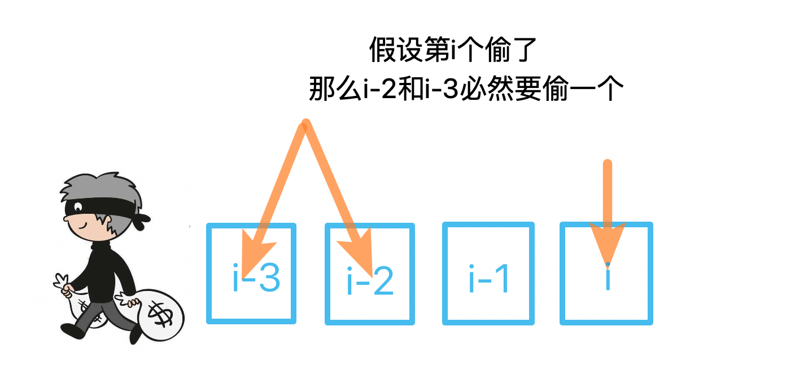

　　因此状态转移方程`dp[i] = max(dp[i-2], dp[i-3]) + num`。  

#### 代码  

```python
class Solution:
    def rob(self, nums: List[int]) -> int:
        n = len(nums)
        if n == 0: return 0
        if n <= 2: return max(nums)

        # dp[i] 表示最后偷nums[i]能偷到的最大金额
        dp = [0 for i in range(n)]
        dp[0] = nums[0]
        dp[1] = nums[1]
        dp[2] = nums[0] + nums[2]

        for i in range(3, n):
            num = nums[i]
            dp[i] = max(dp[i-2], dp[i-3]) + num

        return max(dp[-1], dp[-2])  # 最后偷的可能是最后一个，也可能是倒数第二个
      
```

## A199. 二叉树的右视图

难度`中等`

#### 题目描述

给定一棵二叉树，想象自己站在它的右侧，按照从顶部到底部的顺序，返回从右侧所能看到的节点值。

> **示例:**

```
输入: [1,2,3,null,5,null,4]
输出: [1, 3, 4]
解释:

   1            <---
 /   \
2     3         <---
 \     \
  5     4       <---
```

#### 题目链接

<https://leetcode-cn.com/problems/binary-tree-right-side-view/>

#### **思路:**

　　使用层序遍历，并只保留每层最后一个节点的值。  

#### **代码:**

```python

class Solution:
    def rightSideView(self, root: TreeNode) -> List[int]:
        
        if not root:
            return []

        queue = [root]
        ans = []
        while queue:
            temp = []
            ans.append(queue[-1].val)
            for q in queue:
                if q.left:
                    temp.append(q.left)
                if q.right:
                    temp.append(q.right)
            
            queue = temp

        return ans

```

## A200. 岛屿数量

难度`中等`

#### 题目描述

给定一个由 `'1'`（陆地）和 `'0'`（水）组成的的二维网格，计算岛屿的数量。一个岛被水包围，并且它是通过水平方向或垂直方向上相邻的陆地连接而成的。你可以假设网格的四个边均被水包围。

> **示例 1:**

```
输入:
11110
11010
11000
00000

输出: 1
```

> **示例 2:**

```
输入:
11000
11000
00100
00011

输出: 3
```

#### 题目链接

<https://leetcode-cn.com/problems/number-of-islands/>

#### **思路:**

　　经典dfs。遍历整个矩阵，从`任意"1"`的位置开始dfs，同时计数`+1`，搜索岛屿的过程中将搜索过的位置都置为`"0"`。最终计数的结果就是岛屿的数量。  

#### **代码:**

```python
class Solution:
    def numIslands(self, grid: List[List[str]]) -> int:
        arounds = [(-1, 0), (1, 0), (0, -1), (0, 1)]  # 上下左右
        m = len(grid)
        if not m:
            return 0
        n = len(grid[0])

        ans = 0
        def dfs(i, j):
            if i < 0 or j < 0 or i >= m or j >= n:
                return
            if grid[i][j] == "0":
                return 

            grid[i][j] = "0"
            for di, dj in arounds:
                dfs(i + di, j + dj)

        for i in range(m):
            for j in range(n):
                if grid[i][j] == "1":
                    ans += 1
                    dfs(i, j)

        return ans

```

## A201. 数字范围按位与

难度`中等`

#### 题目描述

给定范围 [m, n]，其中 0 <= m <= n <= 2147483647，返回此范围内所有数字的按位与（包含 m, n 两端点）。

> **示例 1:** 

```
输入: [5,7]
输出: 4
```

> **示例 2:**

```
输入: [0,1]
输出: 0
```

#### 题目链接

<https://leetcode-cn.com/problems/bitwise-and-of-numbers-range/>

#### **思路:**

　　`m`和`n`相等时，返回`m`，`m`和`n`不相等时，分别抛弃它们的最低位。  

#### **代码:**

```python
class Solution:
    def rangeBitwiseAnd(self, m: int, n: int) -> int:
        i = 0
        while m != n:
            m >>= 1
            n >>= 1
            i += 1

        return m << i

```

## A202. 快乐数

难度`简单`

#### 题目描述

编写一个算法来判断一个数 `n` 是不是快乐数。

「快乐数」定义为：对于一个正整数，每一次将该数替换为它每个位置上的数字的平方和，然后重复这个过程直到这个数变为 1，也可能是 **无限循环** 但始终变不到 1。如果 **可以变为**  1，那么这个数就是快乐数。

如果 `n` 是快乐数就返回 `True` ；不是，则返回 `False` 。

> **示例：**

```
输入：19
输出：true
解释：
12 + 92 = 82
82 + 22 = 68
62 + 82 = 100
12 + 02 + 02 = 1
```

#### 题目链接

<https://leetcode-cn.com/problems/happy-number/>

#### **思路:**

　　用集合判断下一个数字是否已经出现过了。  

#### **代码:**

```python
class Solution:
    def isHappy(self, n: int) -> bool:
        shown = set()
        shown.add(n)
        while n != 1:
            n = sum(map(lambda x:int(x)**2 ,list(str(n))))
            # print(n)
            if n in shown:
                return False
            shown.add(n)
            
        return True

```

## A204. 计数质数

难度`简单`

#### 题目描述

统计所有小于非负整数 *n* 的质数的数量。

> **示例:**

```
输入: 10
输出: 4
解释: 小于 10 的质数一共有 4 个, 它们是 2, 3, 5, 7 。
```

#### 题目链接

<https://leetcode-cn.com/problems/count-primes/>

#### **思路:**

　　这题的解法称之为`埃拉托斯特尼筛法`，发现一个质数以后，把这个质数所有的倍数全部划去。最后统计质数的个数。    

#### **代码:**

```python
class Solution:
    def countPrimes(self, n: int) -> int:
        # 最小的质数是 2
        if n < 2:
            return 0

        isPrime = [1] * n
        isPrime[0] = isPrime[1] = 0   # 0和1不是质数，先排除掉

        # 埃式筛，把不大于根号n的所有质数的倍数剔除
        for i in range(2, int(n ** 0.5) + 1):
            if isPrime[i]:
                isPrime[i * i:n:i] = [0] * ((n - 1 - i * i) // i + 1)

        return sum(isPrime)

```

## A205. 同构字符串

难度`简单`

#### 题目描述

给定两个字符串 ***s*** 和 **t**，判断它们是否是同构的。

如果 ***s*** 中的字符可以被替换得到 **t** ，那么这两个字符串是同构的。

所有出现的字符都必须用另一个字符替换，同时保留字符的顺序。两个字符不能映射到同一个字符上，但字符可以映射自己本身。

> **示例 1:**

```
输入: s = "egg", t = "add"
输出: true
```

> **示例 2:**

```
输入: s = "foo", t = "bar"
输出: false
```

> **示例 3:**

```
输入: s = "paper", t = "title"
输出: true
```

**说明:**
你可以假设 ***s*** 和 **t** 具有相同的长度。

#### 题目链接

<https://leetcode-cn.com/problems/isomorphic-strings/>

#### **思路:**


　　注意正映射和反映射必须是**一对一**的。  

#### **代码:**

```python
class Solution:
    def isIsomorphic(self, s: str, t: str) -> bool:
        mapper = {}
        reverse = {}
        for i in range(len(s)):
            if s[i] in mapper and mapper[s[i]] != t[i]:
                return False

            if t[i] in reverse and reverse[t[i]] != s[i]:  # 互相映射
                return False

            mapper[s[i]] = t[i]
            reverse[t[i]] = s[i]

        return True

```

## A207. 课程表

难度`中等`

#### 题目描述

你这个学期必须选修 `numCourse` 门课程，记为 `0` 到 `numCourse-1` 。

在选修某些课程之前需要一些先修课程。 例如，想要学习课程 0 ，你需要先完成课程 1 ，我们用一个匹配来表示他们：`[0,1]`

给定课程总量以及它们的先决条件，请你判断是否可能完成所有课程的学习？

> **示例 1:**

```
输入: 2, [[1,0]] 
输出: true
解释: 总共有 2 门课程。学习课程 1 之前，你需要完成课程 0。所以这是可能的。
```

> **示例 2:**

```
输入: 2, [[1,0],[0,1]]
输出: false
解释: 总共有 2 门课程。学习课程 1 之前，你需要先完成课程 0；并且学习课程 0 之前，你还应先完成课程 1。这是不可能的。
```

**提示：**

1. 输入的先决条件是由 **边缘列表** 表示的图形，而不是 邻接矩阵 。详情请参见[图的表示法](http://blog.csdn.net/woaidapaopao/article/details/51732947)。
2. 你可以假定输入的先决条件中没有重复的边。
3. `1 <= numCourses <= 10^5`

#### 题目链接

<https://leetcode-cn.com/problems/course-schedule/>

#### **思路:**

　　拓扑排序。构建的邻接表就是我们通常认识的邻接表，每一个结点存放的是后继结点的集合。

　　该方法的每一步总是输出当前无前趋（即入度为零）的顶点。

　　对应到本题，每一步总是学习**当前无先修课程的**课程。然后把这些学过的课程从其他课程的先修课程中移除。同时把`未学习课程集合`中减去已学习的课程。    

　　最终判断`未学习课程集合`是否为空。  

#### **代码:**

```python
from collections import defaultdict

class Solution:
    def canFinish(self, numCourses: int, prerequisites: List[List[int]]) -> bool: 
        dict_p = defaultdict(list)
        dict_after = defaultdict(list)

        for curr, pre in prerequisites:
            dict_p[curr].append(pre)  # 邻接表
            dict_after[pre].append(curr)  # 逆邻接表

        # print(dict_p)
        not_learned = set(range(numCourses))  # 未学习课程的集合
        while True:
            new_learned = set()
            for i in not_learned:
                if not dict_p[i]:  # 没有先修课程的课程，都可以学
                    new_learned.add(i)

            if not new_learned:  # 无法学习新课程，结束循环
                break
            for learned in new_learned:
                for after in dict_after[learned]:
                    dict_p[after].remove(learned)  # 从其他课程的先决条件里去掉已经学过的课 

            not_learned = not_learned - new_learned  # 集合差集

        return len(not_learned) == 0
```

## A208. 实现 Trie 

难度`中等`

#### 题目描述

实现一个 Trie (前缀树)，包含 `insert`, `search`, 和 `startsWith` 这三个操作。

> **示例:**

```
Trie trie = new Trie();

trie.insert("apple");
trie.search("apple");   // 返回 true
trie.search("app");     // 返回 false
trie.startsWith("app"); // 返回 true
trie.insert("app");   
trie.search("app");     // 返回 true
```

**说明:**

- 你可以假设所有的输入都是由小写字母 `a-z` 构成的。
- 保证所有输入均为非空字符串。

#### 题目链接

<前缀树https://leetcode-cn.com/problems/implement-trie-prefix-tree/>

#### **思路:**

　　Trie树的模板。

#### **代码:**

```python
class Trie:

    def __init__(self):
        """
        Initialize your data structure here.
        """
        self.trie = {}


    def insert(self, word: str) -> None:
        """
        Inserts a word into the trie.
        """
        node = self.trie
        for char in word:
            node = node.setdefault(char, {})
        node['#'] = True

    def search(self, word: str) -> bool:
        """
        Returns if the word is in the trie.
        """
        tmp = self.trie
        for char in word:
            if char not in tmp:
                return False
            tmp = tmp[char]
        # print(tmp)
        return '#' in tmp


    def startsWith(self, prefix: str) -> bool:
        """
        Returns if there is any word in the trie that starts with the given prefix.
        """
        tmp = self.trie
        for char in prefix:
            if char not in tmp:
                return False
            tmp = tmp[char]
        return True

```

## A209. 长度最小的子数组

难度`中等`

#### 题目描述

给定一个含有 **n** 个正整数的数组和一个正整数 **s ，**找出该数组中满足其和 **≥ s** 的长度最小的连续子数组**。**如果不存在符合条件的连续子数组，返回 0。

> **示例:** 

```
输入: s = 7, nums = [2,3,1,2,4,3]
输出: 2
解释: 子数组 [4,3] 是该条件下的长度最小的连续子数组。
```

**进阶:**

如果你已经完成了*O*(*n*) 时间复杂度的解法, 请尝试 *O*(*n* log *n*) 时间复杂度的解法。

#### 题目链接

<https://leetcode-cn.com/problems/minimum-size-subarray-sum/>

#### **思路:**

　　双指针。如果`窗口内的数字和`小于`target`，右指针右移，增加数字；如果`窗口内的数字和`大于等于`target`， 左指针**不断右移**(直到窗口内的数字和小于`target`)，然后记录此时窗口的大小。  

#### **代码:**

```python
class Solution:
    def minSubArrayLen(self, s: int, nums: List[int]) -> int:
        n = len(nums)
        if not n: return 0
        ans = float('inf')
        sum_now = 0
        if max(nums) >= s: return 1  # 最大的数比s大

        left = 0
        for right, num in enumerate(nums):
            sum_now += num
            if sum_now >= s:

                while sum_now >= s:
                    sum_now -= nums[left]
                    left += 1
                # print(left, right)
                ans = min(ans, right - left + 2)


        return ans if ans != float('inf') else 0
      
```

## A210. 课程表 II

难度`中等`

#### 题目描述

现在你总共有 *n* 门课需要选，记为 `0` 到 `n-1`。

在选修某些课程之前需要一些先修课程。 例如，想要学习课程 0 ，你需要先完成课程 1 ，我们用一个匹配来表示他们: `[0,1]`

给定课程总量以及它们的先决条件，返回你为了学完所有课程所安排的学习顺序。

可能会有多个正确的顺序，你只要返回一种就可以了。如果不可能完成所有课程，返回一个空数组。

> **示例 1:**

```
输入: 2, [[1,0]] 
输出: [0,1]
解释: 总共有 2 门课程。要学习课程 1，你需要先完成课程 0。因此，正确的课程顺序为 [0,1] 。
```

> **示例 2:**

```
输入: 4, [[1,0],[2,0],[3,1],[3,2]]
输出: [0,1,2,3] or [0,2,1,3]
解释: 总共有 4 门课程。要学习课程 3，你应该先完成课程 1 和课程 2。并且课程 1 和课程 2 都应该排在课程 0 之后。
     因此，一个正确的课程顺序是 [0,1,2,3] 。另一个正确的排序是 [0,2,1,3] 。
```

**说明:**

1. 输入的先决条件是由**边缘列表**表示的图形，而不是邻接矩阵。详情请参见[图的表示法](http://blog.csdn.net/woaidapaopao/article/details/51732947)。
2. 你可以假定输入的先决条件中没有重复的边。

**提示:**

1. 这个问题相当于查找一个循环是否存在于有向图中。如果存在循环，则不存在拓扑排序，因此不可能选取所有课程进行学习。
2. [通过 DFS 进行拓扑排序](https://www.coursera.org/specializations/algorithms) - 一个关于Coursera的精彩视频教程（21分钟），介绍拓扑排序的基本概念。
3. 拓扑排序也可以通过 [BFS](https://baike.baidu.com/item/宽度优先搜索/5224802?fr=aladdin&fromid=2148012&fromtitle=广度优先搜索) 完成。

#### 题目链接

<https://leetcode-cn.com/problems/course-schedule-ii/>

#### **思路:**

　　和上一题[A207. 课程表](/dfs?id=a207-课程表)一样，新增记录顺序即可。  

#### **代码:**

```python
from collections import defaultdict

class Solution:
    def findOrder(self, numCourses: int, prerequisites: List[List[int]]) -> List[int]:
        dict_p = defaultdict(list)
        dict_after = defaultdict(list)

        for curr, pre in prerequisites:
            dict_p[curr].append(pre)  # 邻接表
            dict_after[pre].append(curr)  # 逆邻接表

        # print(dict_p)
        not_learned = set(range(numCourses))  # 未学习课程的集合
        ans = []
        while True:
            new_learned = set()
            for i in not_learned:
                if not dict_p[i]:  # 没有先修课程的课程，都可以学
                    new_learned.add(i)

            if not new_learned:  # 无法学习新课程，结束循环
                break
            for learned in new_learned:
                ans.append(learned)
                for after in dict_after[learned]:
                    dict_p[after].remove(learned)  # 从其他课程的先决条件里去掉已经学过的课 

            not_learned = not_learned - new_learned  # 集合差集

        if len(not_learned) == 0:  # 能学完所有课程
            return ans
        else:
            return []
```

## A211. 添加与搜索单词 - 数据结构设计

难度`中等`

#### 题目描述

设计一个支持以下两种操作的数据结构：

```
void addWord(word)
bool search(word)
```

search(word) 可以搜索文字或正则表达式字符串，字符串只包含字母 `.` 或 `a-z` 。 `.` 可以表示任何一个字母。

> **示例:**

```
addWord("bad")
addWord("dad")
addWord("mad")
search("pad") -> false
search("bad") -> true
search(".ad") -> true
search("b..") -> true
```

**说明:**

你可以假设所有单词都是由小写字母 `a-z` 组成的。

#### 题目链接

<https://leetcode-cn.com/problems/add-and-search-word-data-structure-design/>

#### **思路:**

　　典型的`trie树`应用，`trie树`(又称字典树或前缀树)，将相同前缀的单词放在同一棵子树上，以实现快速的多对多匹配。如下如所示：  

　　　　　　

　　对于有单词的结点(图中橙色的结点)，我们用一个`"#"`来表示。  

　　上图的`trie树`在Python中的表示是这样的：  

```python
trie = 
{'c': 
    {'o': 
        {'d': {'e': {'#': True}}, 
         'o': {'k': {'#': True}}
         }
     }, 
 'f': 
    {'i': 
        {'v': {'e': {'#': True}}, 
         'l': {'e': {'#': True}}
        }, 
     'a': {'t': {'#': True}}
    }
}
```

　　增加单词时在`Trie树`中插入结点，查找单词时搜索`Trie`树。  

#### **代码:**

```python
class WordDictionary:

    def __init__(self):
        """
        Initialize your data structure here.
        """
        self.trie = {}  # 声明成员变量

    def addWord(self, word: str) -> None:
        """
        Adds a word into the data structure.
        """
        # 增加单词
        node = self.trie  
        for char in word:
            node = node.setdefault(char, {})
        node['#'] = True


    def search(self, word: str) -> bool:
        """
        Returns if the word is in the data structure. A word could contain the dot character '.' to represent any one letter.
        """
        # 搜索trie树
        trie = self.trie
        def recur(n, node):  # n表示模式的第几位 从0开始 
            if n >= len(word):
                return '#' in node  # 匹配串搜索结束，返回trie树对应的结点是否有单词

            char = word[n]
            if char == '.':  # 任意字符
                for nxt in node:  # 下一个
                    if nxt != '#' and recur(n+1, node[nxt]):  # 只能搜字母
                        return True

            else:
                if char in node:
                    return recur(n+1, node[char])

            return False

        return recur(0, trie)

```

## A212. 单词搜索 II

难度`困难`

#### 题目描述

给定一个二维网格 **board** 和一个字典中的单词列表 **words**，找出所有同时在二维网格和字典中出现的单词。

单词必须按照字母顺序，通过相邻的单元格内的字母构成，其中“相邻”单元格是那些水平相邻或垂直相邻的单元格。同一个单元格内的字母在一个单词中不允许被重复使用。

> **示例:**

```
输入: 
words = ["oath","pea","eat","rain"] and board =
[
  ['o','a','a','n'],
  ['e','t','a','e'],
  ['i','h','k','r'],
  ['i','f','l','v']
]

输出: ["eat","oath"]
```

**说明:**
你可以假设所有输入都由小写字母 `a-z` 组成。

**提示:**

- 你需要优化回溯算法以通过更大数据量的测试。你能否早点停止回溯？
- 如果当前单词不存在于所有单词的前缀中，则可以立即停止回溯。什么样的数据结构可以有效地执行这样的操作？散列表是否可行？为什么？ 前缀树如何？如果你想学习如何实现一个基本的前缀树，请先查看这个问题： [实现Trie（前缀树）](https://leetcode-cn.com/problems/implement-trie-prefix-tree/description/)。

#### 题目链接

<https://leetcode-cn.com/problems/word-search-ii/>

#### **思路:**

　　Trie树+dfs搜索。  

　　先用`words`中的单词构建Trie树，然后沿着`board`和trie树同时搜索。当搜索到结束符`"#"`时记录这个单词。  

　　**注意：**搜索到一个单词时要将它从前缀树中删除，否则`board`中再次出现可能会重复。  

　　**优化：**(*摘自官方题解* )

　　在回溯过程中逐渐剪除 Trie 中的节点（剪枝）。   
　　这个想法的动机是整个算法的时间复杂度取决于 Trie 的大小。对于 Trie 中的叶节点，一旦遍历它（即找到匹配的单词），就不需要再遍历它了。结果，我们可以把它从树上剪下来。  

　　逐渐地，这些非叶节点可以成为叶节点以后，因为我们修剪他们的孩子叶节点。在极端情况下，一旦我们找到字典中所有单词的匹配项，Trie 就会变成空的。这个剪枝措施可以减少在线测试用例 50% 的运行时间。  

　　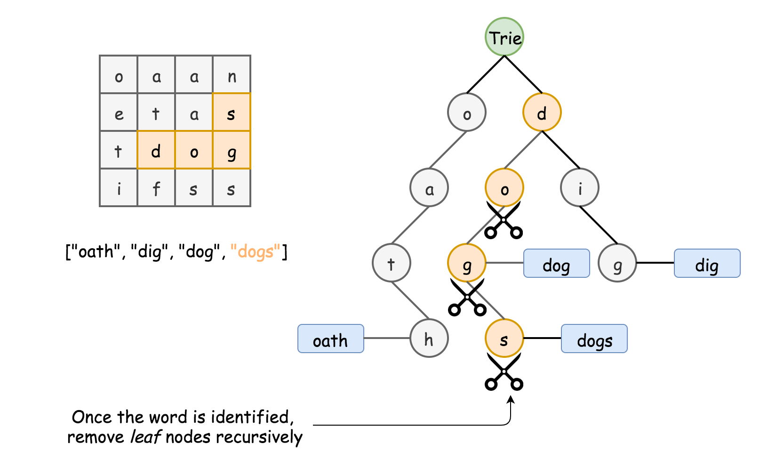　　

#### **代码:**

　　**未优化：**(340ms)

```python
class Solution:
    def findWords(self, board: List[List[str]], words: List[str]) -> List[str]:
        # words = ['abcd', 'acd', 'ace', 'bc']
        arounds = [(-1, 0), (1, 0), (0, -1), (0, 1)]
        ans = []
        trie = {}  # 构造字典树
        for i, word in enumerate(words):
            node = trie
            for char in word:
                node = node.setdefault(char, {})
            node['#'] = i

        m = len(board)
        if not m: return []
        n = len(board[0])

        visted = [[False for _ in range(n)] for _ in range(m)] 
        def dfs(i, j, node):
            if '#' in node:
                ans.append(words[node.pop('#')])  # 查过的单词就去掉

            visted[i][j] = True
            for di, dj in arounds:
                x, y = i + di, j + dj
                if x < 0 or y < 0 or x >= m or y >= n or visted[x][y] or board[x][y] not in node:
                    continue
                dfs(i + di, j + dj, node[board[x][y]])

            visted[i][j] = False  # 还原状态
            #  ①在此处添加剪枝代码
    
        for i in range(m):
            for j in range(n):
                if board[i][j] in trie:
                    dfs(i, j, trie[board[i][j]])


        # print(trie)
        return ans
      
```

　　**剪枝优化：**(280ms)  

```python
    emptys = []
    for child in node:
        if not node[child]:
            emptys.append(child)

    for em in emptys:
        node.pop(em)
```
## A213. 打家劫舍 II

难度 `中等`  
#### 题目描述

你是一个专业的小偷，计划偷窃沿街的房屋，每间房内都藏有一定的现金。这个地方所有的房屋都**围成一圈，**这意味着第一个房屋和最后一个房屋是紧挨着的。同时，相邻的房屋装有相互连通的防盗系统，**如果两间相邻的房屋在同一晚上被小偷闯入，系统会自动报警**。

给定一个代表每个房屋存放金额的非负整数数组，计算你**在不触动警报装置的情况下，**能够偷窃到的最高金额。

> **示例 1:**

```
输入: [2,3,2]
输出: 3
解释: 你不能先偷窃 1 号房屋（金额 = 2），然后偷窃 3 号房屋（金额 = 2）, 因为他们是相邻的。
```

> **示例 2:**

```
输入: [1,2,3,1]
输出: 4
解释: 你可以先偷窃 1 号房屋（金额 = 1），然后偷窃 3 号房屋（金额 = 3）。
     偷窃到的最高金额 = 1 + 3 = 4 。
```

#### 题目链接

<https://leetcode-cn.com/problems/house-robber-ii/>


#### 思路  


　　将环拆开，分别考虑不偷第一个和不偷最后一个。然后调用上一题[A198. 打家劫舍](/dp?id=a198-打家劫舍)的函数即可。  

#### 代码  
```python
class Solution:
    def rob(self, nums: List[int]) -> int:
        def rob_1(nums):
            n = len(nums)
            if n == 0: return 0
            if n <= 2: return max(nums)

            # dp[i] 表示最后偷nums[i]能偷到的最大金额
            dp = [0 for i in range(n)]
            dp[0] = nums[0]
            dp[1] = nums[1]
            dp[2] = nums[0] + nums[2]

            for i in range(3, n):
                num = nums[i]
                dp[i] = max(dp[i-2], dp[i-3]) + num

            return max(dp[-1], dp[-2])  # 最后偷的可能是最后一个，也可能是倒数第二个

        if len(nums) == 0: return 0
        if len(nums) <= 3: return max(nums)
        return max(rob_1(nums[:-1]), rob_1(nums[1:]))
```

## A214. 最短回文串

难度 `中等`  

#### 题目描述

给定一个字符串 ***s***，你可以通过在字符串前面添加字符将其转换为回文串。找到并返回可以用这种方式转换的最短回文串。

> **示例 1:**

```
输入: "aacecaaa"
输出: "aaacecaaa"
```

> **示例 2:**

```
输入: "abcd"
输出: "dcbabcd"
```

#### 题目链接

<https://leetcode-cn.com/problems/shortest-palindrome/>

#### 思路  

　　这题其实就是找`s[:i]`中最长的回文串。  


　　**方法一：**先逆序，然后截取逆序后的前`i`个字符拼接到原串上，取满足回文条件最小的`i`。  

​        **方法二：**把字符转正反拼接，用**[最长公共前后缀]()**解决。需要注意的是拼接中间要加一个特殊符号，以免出现公共前后缀长度比原始字符串更长的现象。最长公共前后缀是KMP的核心，就算单独拿出来也是一个不简单的问题。最重要的是要知道，一个字符串的次长公共前后缀是其最长公共前后缀的最长公共前后缀，所以最长公共前后最是可以在 O(n)时间内递推计算的。  

#### 代码  

　　**方法一：**

```python
class Solution:
    def shortestPalindrome(self, s: str) -> str:
        ls = len(s)
        reverse = s[::-1]
        # print(reverse)
        for i in range(ls):
            if reverse[i] == s[0] and reverse[i:] == s[:ls-i]:
                return reverse[:i] + s

        return reverse + s

```

​        **方法二：**

```python
class Solution:
    def shortestPalindrome(self, s) :
        if len(s) <= 1: return s
        r = s + "$" + s[::-1]
        c = [0] * len(r)
        i, j = 1, 0
        while i < len(r):
            while j >= 1 and r[i] != r[j]:
                j = c[j - 1]
            if r[i] == r[j]:
                c[i] = j = j + 1
            i += 1
        b = min(c[-1], len(s))
        return s[:b-1:-1] + s
      
```


## A215. 数组中的第K个最大元素

难度`中等`

#### 题目描述

在未排序的数组中找到第 **k** 个最大的元素。请注意，你需要找的是数组排序后的第 k 个最大的元素，而不是第 k 个不同的元素。

> **示例 1:**

```
输入: [3,2,1,5,6,4] 和 k = 2
输出: 5
```

> **示例 2:**

```
输入: [3,2,3,1,2,4,5,5,6] 和 k = 4
输出: 4
```

**说明:**

你可以假设 k 总是有效的，且 1 ≤ k ≤ 数组的长度。

#### 题目链接

<https://leetcode-cn.com/problems/kth-largest-element-in-an-array/>

#### **思路:**

　　**方法一：**最大堆，构建以后连续取出`k`个元素即可。  

　　**方法二：**使用快速排序的`partition`函数，`partition`后返回的位置`store_index`，左边的元素一定比它小，右边的元素一定比它大。比较`store_index`和`k`，再对`k`所在的那半边继续`partition`即可。  

#### **代码:**

　　**方法一：**

```python
import heapq
class Solution:
    def findKthLargest(self, nums: List[int], k: int) -> int:
        heapq.heapify(nums)
        n = len(nums)
        k = n - k + 1  # 转成第k小来做
        
        peek = 0
        for _ in range(k):
            peek = heapq.heappop(nums)
            
        return peek

```

　　**方法二：**

```python
import random

class Solution:
    def findKthLargest(self, nums: List[int], k: int) -> int:
        def partition(left, right, pivot_index):
            pivot = nums[pivot_index]
            nums[pivot_index],nums[right] = nums[right], nums[pivot_index]

            store_index = left
            for i in range(left, right):
                if nums[i] < pivot:
                    nums[store_index], nums[i] = nums[i], nums[store_index]
                    store_index +=1
            nums[right], nums[store_index] = nums[store_index], nums[right]

            return store_index

        left = 0
        right = len(nums) - 1
        while left <= right:
            if left == right:
                return nums[left]
            p = random.randint(left, right)
            ans = partition(left, right, p)
            if ans  == len(nums) - k:
                return nums[ans]
            elif ans < len(nums) - k:
                left = ans + 1
            elif ans > len(nums) - k:
                right = ans - 1

```

## A216. 组合总和 III

难度`中等`

#### 题目描述

找出所有相加之和为 ***n*** 的 **k** 个数的组合**。**组合中只允许含有 1 - 9 的正整数，并且每种组合中不存在重复的数字。

**说明：**

- 所有数字都是正整数。
- 解集不能包含重复的组合。 

> **示例 1:**

```
输入: k = 3, n = 7
输出: [[1,2,4]]
```

> **示例 2:**

```
输入: k = 3, n = 9
输出: [[1,2,6], [1,3,5], [2,3,4]]
```

#### 题目链接

<https://leetcode-cn.com/problems/combination-sum-iii/>

#### **思路:**

　　递归。因为不能包含重复的数字，所以使用**升序**作为答案。每一层递归数字的取值范围在`nums[-1] + 1`到`9`之间。  

#### **代码:**

```python
class Solution:
    def combinationSum3(self, k: int, n: int) -> List[List[int]]:
        ans = []
        temp = []
        def recur(i, minimal):  # 递归  i <= k
            if i >= k-1:
                left = n - sum(temp)  # 最后一个数用减法，减少一层循环
                if minimal < left <= 9:
                    ans.append(temp.copy()+[left])
                return
            
            for j in range(minimal+1, 10):
                temp.append(j)
                recur(i+1, j)
                temp.pop()

        recur(0, 0)
        return ans
      
```


## A217. 存在重复元素

难度`简单`

#### 题目描述

给定一个整数数组，判断是否存在重复元素。

如果任意一值在数组中出现至少两次，函数返回 `true` 。如果数组中每个元素都不相同，则返回 `false` 。

> **示例 1:**

```
输入: [1,2,3,1]
输出: true
```

> **示例 2:**

```
输入: [1,2,3,4]
输出: false
```

> **示例 3:**

```
输入: [1,1,1,3,3,4,3,2,4,2]
输出: true
```

#### 题目链接

<https://leetcode-cn.com/problems/contains-duplicate/>

#### **思路:**

　　用集合判断不重复的数量，和原数组比较。  

#### **代码:**

```python
class Solution:
    def containsDuplicate(self, nums: List[int]) -> bool:
        return len(set(nums)) != len(nums)

```

## A218. 天际线问题

难度`困难`

#### 题目描述

城市的天际线是从远处观看该城市中所有建筑物形成的轮廓的外部轮廓。现在，假设您获得了城市风光照片（图A）上**显示的所有建筑物的位置和高度**，请编写一个程序以输出由这些建筑物**形成的天际线**（图B）。

  

每个建筑物的几何信息用三元组 `[Li，Ri，Hi]` 表示，其中 `Li` 和 `Ri` 分别是第 i 座建筑物左右边缘的 x 坐标，`Hi` 是其高度。可以保证 `0 ≤ Li, Ri ≤ INT_MAX`, `0 < Hi ≤ INT_MAX` 和 `Ri - Li > 0`。您可以假设所有建筑物都是在绝对平坦且高度为 0 的表面上的完美矩形。

例如，图A中所有建筑物的尺寸记录为：`[ [2 9 10], [3 7 15], [5 12 12], [15 20 10], [19 24 8] ] `。

输出是以 `[ [x1,y1], [x2, y2], [x3, y3], ... ]` 格式的“**关键点**”（图B中的红点）的列表，它们唯一地定义了天际线。**关键点是水平线段的左端点**。请注意，最右侧建筑物的最后一个关键点仅用于标记天际线的终点，并始终为零高度。此外，任何两个相邻建筑物之间的地面都应被视为天际线轮廓的一部分。

例如，图B中的天际线应该表示为：`[ [2 10], [3 15], [7 12], [12 0], [15 10], [20 8], [24, 0] ]`。

**说明:**

- 任何输入列表中的建筑物数量保证在 `[0, 10000]` 范围内。
- 输入列表已经按左 `x` 坐标 `Li`  进行升序排列。
- 输出列表必须按 x 位排序。
- 输出天际线中不得有连续的相同高度的水平线。例如 `[...[2 3], [4 5], [7 5], [11 5], [12 7]...]` 是不正确的答案；三条高度为 5 的线应该在最终输出中合并为一个：`[...[2 3], [4 5], [12 7], ...]`

#### 题目链接

<https://leetcode-cn.com/problems/the-skyline-problem/>

#### **思路:**

　　用一个`大根堆`存放当前所有建筑的高度，在建筑的边界时，把堆顶的元素放入结果数组中。  

　　注意不能输出连续相同高度的水平线，所以要判断结果数组最后一个元素是不是和堆顶的元素相同。  

　　例如，示例中的过程为：  

```python
x = 2, 蓝色房子入堆, heap = [10], ans = [[2 10]]
x = 3, 红色房子入堆, heap = [10, 15], ans = [[2 10], [3 15]]
x = 5, 绿色房子入堆, heap = [10, 12, 15]，堆顶元素高度为15，但是ans最后已经出现15了，忽略
x = 7, 最高的房子(红色房子)出堆, heap = [10, 12]，堆顶高度12, ans = [[2 10], [3 15], [7 12]]
x = 9, 最高的房子(绿色房子)还未结束, 不出堆, 堆顶高度12, 与ans[-1]重复，忽略
x = 12, 绿色房子和蓝色房子都已经结束, 均出堆, 堆中已没有元素, 插入0, ans = [[2 10], [3 15], [7 12], [12 0]]
x = 15, 紫色房子入堆, heap = [10], ans = [[2 10], [3 15], [7 12], [12 0], [15 10]]
x = 19, 黄色房子入堆, heap = [10, 8], 最高的房子还未结束, 不出堆, 堆顶高度10, 重复，忽略, ans不变
x = 20, 紫色房子出堆, heap = [8], 堆顶高度8, ans = [[2 10], [3 15], [7 12], [12 0], [15 10], [20 8]]
x = 24, 黄色房子出堆, 堆中已没有元素, 插入0, ans = [[2 10], [3 15], [7 12], [12 0], [15 10], [20 8], [24 0]]

```

#### **代码:**

```python
import heapq
class Solution:
    def getSkyline(self, buildings: List[List[int]]) -> List[List[int]]:
        n = len(buildings)
        x = [b[0] for b in buildings] + [b[1] for b in buildings]
        x.sort()

        heap = []
        ans = [[0, 0]]
        idx = 0

        for i in x:
            while idx < n and buildings[idx][0] == i:
                h, right = buildings[idx][2], buildings[idx][1]
                heapq.heappush(heap, (-h, right))  # 大根堆
                idx += 1

            while heap:
                h, right = heapq.heappop(heap)
                if right > i:  # 还没有结束
                    heapq.heappush(heap, (h, right))  # 再放回去
                    if ans[-1][1] != -h:
                        ans.append([i, -h])
                    break
            else:
                if ans[-1][1] != 0:
                    ans.append([i, 0])

        return ans[1:]

```

## A219. 存在重复元素 II

难度`简单`

#### 题目描述

给定一个整数数组和一个整数 *k*，判断数组中是否存在两个不同的索引 *i* 和 *j*，使得 **nums [i] = nums [j]**，并且 *i* 和 *j* 的差的 **绝对值** 至多为 *k*。

> **示例 1:**

```
输入: nums = [1,2,3,1], k = 3
输出: true
```

> **示例 2:**

```
输入: nums = [1,0,1,1], k = 1
输出: true
```

> **示例 3:**

```
输入: nums = [1,2,3,1,2,3], k = 2
输出: false
```

#### 题目链接

<https://leetcode-cn.com/problems/contains-duplicate-ii/>

#### **思路:**

　　按(数值, 索引)排序，然后每个元素和前一个比较即可。  

#### **代码:**

```python
class Solution:
    def containsNearbyDuplicate(self, nums: List[int], k: int) -> bool:
        n = len(nums)
        s = sorted([(nums[i] ,i) for i in range(n)])
        # print(s)

        for i in range(1,n):
            if s[i][0] == s[i-1][0] and s[i][1] - s[i-1][1] <= k:
                return True

        return False

```

## A220. 存在重复元素 III

难度`中等`

#### 题目描述

给定一个整数数组，判断数组中是否有两个不同的索引 *i* 和 *j*，使得 **nums [i]** 和 **nums [j]** 的差的绝对值最大为 *t*，并且 *i* 和 *j* 之间的差的绝对值最大为 *ķ*。

> **示例 1:**

```
输入: nums = [1,2,3,1], k = 3, t = 0
输出: true
```

> **示例 2:**

```
输入: nums = [1,0,1,1], k = 1, t = 2
输出: true
```

> **示例 3:**

```
输入: nums = [1,5,9,1,5,9], k = 2, t = 3
输出: false
```

#### 题目链接

<https://leetcode-cn.com/problems/contains-duplicate-iii/>

#### **思路:**

　　**方法一：**暴力(超时)，用一个`set`记录长度为`k`的窗口中的数字，当窗口长度超过`k`时，去掉第`i - k`个数字(`i`为当前下标)。查找窗口中有没有与当前数字之差的绝对值小于等于`t`的。    
　　**方法二：**如果窗口中的数字是有序的，那么插入和删除的复杂度就可以降低到`O(logn)`，Python中的`bisect`库可以做到这一点。  

#### **代码:**  

　　**方法一：(超时)**

```python
class Solution:
    def containsNearbyAlmostDuplicate(self, nums: List[int], k: int, t: int) -> bool:
        if k <= 0 or t < 0:
            return False

        wnd = set()  # 最大为k
        for i, num in enumerate(nums):
            for w in wnd:
                if abs(w-num) <= t:
                    return True
            if len(wnd) >= k:
                wnd.remove(nums[i - k])
            wnd.add(num)
                
        return False

```

　　**方法二：**

```python
import bisect

class Solution:
    def containsNearbyAlmostDuplicate(self, nums: List[int], k: int, t: int) -> bool:
        if k <= 0 or t < 0:
            return False

        wnd = []  # 最大为k
        for i, num in enumerate(nums):
 
            idx = bisect.bisect(wnd, num)
            if 0 <= idx - 1 < len(wnd):
                if num - wnd[idx-1] <= t:
                    return True
            if idx< len(wnd):
               if wnd[idx] - num <= t:
                    return True
            if len(wnd) >= k:
                idx = bisect.bisect_left(wnd, nums[i - k])
                wnd.pop(idx)
                # 上面两行等价于 wnd.remove(nums[i - k]) 不过时间复杂度以O(logn)

            bisect.insort(wnd, num)
                
        return False

```

## A221. 最大正方形

难度 `中等`  
#### 题目描述

在一个由 0 和 1 组成的二维矩阵内，找到只包含 1 的最大正方形，并返回其面积。

> **示例:**

```
输入: 

1 0 1 0 0
1 0 1 1 1
1 1 1 1 1
1 0 0 1 0

输出: 4
```

#### 题目链接

<https://leetcode-cn.com/problems/maximal-square/>


#### 思路  

　　令`dp[i][j]`表示以`[i][j]`为**右下角点**的最大正方形边长。递推关系如下图所示：  

　

　　由于`dp[i][j] = 4`已经是全为"1"的正方形了，`dp[i+1][j+1]`最大值只能为`5`。它的大小由图中蓝色箭头标注的区域决定。  

　　如果`[i+1][j+1]`的上方和左方都有**连续**`n`个"1"，那么`dp[i+1][j+1] = min(5, n+1)`。  

#### 代码  
```python
class Solution:
    def maximalSquare(self, matrix: List[List[str]]) -> int:
        m = len(matrix)
        if not m: return 0
        n = len(matrix[0])

        dp = [[1 if matrix[i][j] == '1' else 0 for j in range(n)] for i in range(m)]  # 复制一遍matrix
        ans = 0
        for i in range(m):
            for j in range(n):
                if matrix[i][j] == '1':
                    if not ans: ans = 1
                    if i > 0 and j > 0:
                        for k in range(1, dp[i-1][j-1]+1):
                            if matrix[i-k][j] == '1' and matrix[i][j-k] == '1':  # 上方和左方同时为1
                                dp[i][j] = dp[i][j] + 1
                                ans = max(ans, dp[i][j])
                            else:
                                break
                                
        return ans ** 2
        
```

## A222. 完全二叉树的节点个数

难度`中等`

#### 题目描述

给出一个**完全二叉树**，求出该树的节点个数。

**说明：**

[完全二叉树](https://baike.baidu.com/item/完全二叉树/7773232?fr=aladdin)的定义如下：在完全二叉树中，除了最底层节点可能没填满外，其余每层节点数都达到最大值，并且最下面一层的节点都集中在该层最左边的若干位置。若最底层为第 h 层，则该层包含 1~ 2h 个节点。

> **示例:**

```
输入: 
    1
   / \
  2   3
 / \  /
4  5 6

输出: 6
```

#### 题目链接

<https://leetcode-cn.com/problems/count-complete-tree-nodes/>

#### **思路:**

　　层序遍历，按照普通二叉树来统计。  

#### **代码:**

```python
class Solution:
    def countNodes(self, root: TreeNode) -> int:
        if not root:
            return 0

        queue = [root]
        ans = 0
        while queue:
            temp = []
            ans += len(queue)
            # queue存放的是当前层的所有结点
            for q in queue:
                if q.left:
                    temp.append(q.left)
                if q.right:
                    temp.append(q.right)

            queue = temp
        return ans
      
```

## A223. 矩形面积

难度`中等`

#### 题目描述

在**二维**平面上计算出两个**由直线构成的**矩形重叠后形成的总面积。

每个矩形由其左下顶点和右上顶点坐标表示，如图所示。


> **示例:**

```
输入: -3, 0, 3, 4, 0, -1, 9, 2
输出: 45
```

**说明:** 假设矩形面积不会超出 **int** 的范围。

#### 题目链接

<https://leetcode-cn.com/problems/rectangle-area/>

#### **思路:**

　　两个矩形的并集=`两个矩形的面积和`-`两个矩形的交集`。  

#### **代码:**

```python
class Solution:
    def computeArea(self, A: int, B: int, C: int, D: int, E: int, F: int, G: int, H: int) -> int:
        union = (C-A) * (D-B) + (G-E) * (H-F)
        if E >= C or A >= G:
            return union
        if F >= D or B >= H:
            return union
        
        width = min(C, G) - max(A, E)
        # print(width)
        height = min(D, H) - max(B, F)
        # print(height)

        return union - width * height

```

## A224. 基本计算器

难度`困难`

#### 题目描述

实现一个基本的计算器来计算一个简单的字符串表达式的值。

字符串表达式可以包含左括号 `(` ，右括号 `)`，加号 `+` ，减号 `-`，**非负**整数和空格 ` `。

> **示例 1:**

```
输入: "1 + 1"
输出: 2
```

> **示例 2:**

```
输入: " 2-1 + 2 "
输出: 3
```

> **示例 3:**

```
输入: "(1+(4+5+2)-3)+(6+8)"
输出: 23
```

#### 题目链接

<https://leetcode-cn.com/problems/basic-calculator/>

#### **思路:**

　　和[A227. 基本计算器](/string?id=a227-基本计算器-ii)类似，只不过多了括号。  

　　用`符号栈`和`数据栈`分别存放运算符和数据。  

　　在`s`末尾添加一个`"#"`表示结束，它的优先级是最低的。

　　扫描`s`，如果**遇到数据**则`直接入数据栈`，**遇到四则运算符**则：

　　①符号栈为空：入符号栈，继续扫描；  

　　②优先级高于`符号栈栈顶`的符号：入符号栈，继续扫描；  

　　③优先级小于等于`符号栈栈顶`的符号：弹出两个数据栈元素分别作为两个操作数(`num2, num1`)，弹出符号栈顶符号(`op`)，运算(`num1 +-*/ num2`)以后将运算结果压人数据栈，然后重复①~③。  

　　**括号**需要另外处理：

　　①`"("`：直接入栈，继续扫描；  

　　②`")"`：不断出栈，直到`栈顶为左括号`，将左括号也出栈。    

　　如`s = "(1+(4+5+2)-3)+(6+8)"`。扫描过程如下：  

```c
入栈 ( 
入栈 1 
入栈 + 
入栈 (
入栈 4 
入栈 + 
入栈 5 [1, 4, 5] ['(', '+', '(', '+']
出栈(4, 5, +)，运算结果:(9)
结果入栈 9 [1, 9] ['(', '+', '(']
入栈 + [1, 9] ['(', '+', '(', '+']
遇到)
入栈 2 [1, 9, 2] ['(', '+', '(', '+']
出栈(9, 2, +)，运算结果:(11)
结果入栈 11 [1, 11] ['(', '+', '(']
弹出( [1, 11] ['(', '+']
出栈(1, 11, +)，运算结果:(12)
结果入栈 12 [12] ['(']
入栈 - [12] ['(', '-']
遇到)
入栈 3 [12, 3] ['(', '-']
出栈(12, 3, -)，运算结果:(9)
结果入栈 9 [9] ['(']
弹出( [9] []
入栈 + [9] ['+']
入栈 ( [9] ['+', '(']
入栈 6 [9, 6] ['+', '(']
入栈 + [9, 6] ['+', '(', '+']
遇到)
入栈 8 [9, 6, 8] ['+', '(', '+']
出栈(6, 8, +)，运算结果:(14)
结果入栈 14 [9, 14] ['+', '(']
弹出( [9, 14] ['+']
出栈(9, 14, +)，运算结果:(23)
结果入栈 23 [23] []
入栈 # [23] ['#']
nums = [23]
```

　　最终数据栈中只剩下**一个元素**，它就是最终运算结果。（符号栈中只剩`"#"`）  

#### **代码:**

```python
class Solution:
    def calculate(self, s: str) -> int:
        s = s.strip() + '#'
        ls = len(s)
        prior = {'+': 1, '-': 1, '*': 2, '/': 2, '#': 0, '(': 0}  # 优先级
        # '(': 必入栈,  ')' 必出栈  
        nums = []
        signs = []
        j = 0

        def operate(num1, num2, op):
            if op == '+': return num1 + num2
            if op == '-': return num1 - num2
            if op == '*': return num1 * num2
            if op == '/': return num1 // num2
            
        for i, char in enumerate(s):
            if char == '(':
                signs.append(char)  # 符号入符号栈
                # print('入栈', char, nums, signs)
                j = i + 1
            elif char in prior:
                if s[j: i]:
                    nums.append(int(s[j: i]))  # 数值直接入栈
                    # print('入栈', int(s[j: i]), nums, signs)
                while signs and prior[signs[-1]] >= prior[char]:  # 栈顶优先级高
                    num2 = nums.pop()  # 先弹出的是第二个操作数
                    num1 = nums.pop()  # 后弹出的是第一个操作数
                    op = signs.pop()  # 弹出操作符
                    ans = operate(num1, num2, op)
                    # print('出栈(%d, %d, %s)，运算结果:(%d)' % (num1, num2, op, ans)) 
                    nums.append(ans)  # 运算以后将结果入数据栈
                    # print('结果入栈', ans, nums, signs)

                signs.append(char)  # 符号入符号栈
                # print('入栈', char, nums, signs)
                j = i + 1
            elif char == ')':
                # print('遇到)')
                if s[j: i]:
                    nums.append(int(s[j: i]))  # 数值直接入栈
                # print('入栈', int(s[j: i]), nums, signs)
                while signs[-1] != '(':  # 出栈到左括号
                    num2 = nums.pop()  # 先弹出的是第二个操作数
                    num1 = nums.pop()  # 后弹出的是第一个操作数
                    op = signs.pop()  # 弹出操作符
                    ans = operate(num1, num2, op)  # 运算
                    # print('出栈(%d, %d, %s)，运算结果:(%d)' % (num1, num2, op, ans)) 
                    nums.append(ans)  # 运算以后将结果入数据栈
                    # print('结果入栈', ans, nums, signs)

                op = signs.pop()  # 弹出左括号
                # print('弹出(', nums, signs)
                j = i + 1

        # print(nums)
        return nums[-1]

    
```

## A227. 基本计算器 II

难度 `中等`  

#### 题目描述

实现一个基本的计算器来计算一个简单的字符串表达式的值。

字符串表达式仅包含非负整数，`+`， `-` ，`*`，`/` 四种运算符和空格 ` `。 整数除法仅保留整数部分。

> **示例 1:**

```
输入: "3+2*2"
输出: 7
```

> **示例 2:**

```
输入: " 3/2 "
输出: 1
```

> **示例 3:**

```
输入: " 3+5 / 2 "
输出: 5
```

**说明：**

- 你可以假设所给定的表达式都是有效的。
- 请**不要**使用内置的库函数 `eval`。

#### 题目链接

<https://leetcode-cn.com/problems/basic-calculator-ii/>

#### 思路  

　　用`符号栈`和`数据栈`分别存放运算符和数据。  

　　在`s`末尾添加一个`"#"`表示结束，它的优先级是最低的。

　　扫描`s`，如果**遇到数据**则`直接入数据栈`，**遇到四则运算符**则：

　　①符号栈为空：入符号栈，继续扫描；  

　　② 优先级高于`符号栈栈顶`的符号：入符号栈，继续扫描；  

　　③优先级小于等于`符号栈栈顶`的符号：弹出两个数据栈元素分别作为两个操作数(`num2, num1`)，弹出符号栈顶符号(`op`)，运算(`num1 +-*/ num2`)以后将运算结果压人数据栈，然后重复①~③。  

　　如`s = "1+2*3-4#"`。扫描过程如下：  

```c
!-------------------  扫描过程  ------------------------
1  入数据栈　　　　      nums = [1], signs = []
+  满足①，入符号栈      nums = [1], signs = [+]
2  入数据栈　　　　      nums = [1, 2], signs = [+]
*  满足②，入符号栈      nums = [1, 2], signs = [+, *]
3  入数据栈　　　　      nums = [1, 2, 3], signs = [+, *]
-  满足③，弹出(2, 3, *)， 运算后将结果6压入数据栈中  nums = [1, 6], signs = [+]
   - 满足③，弹出(1, 6, +)，运算后将结果7压入数据栈中  nums = [7], signs = []
   - 满足①，入符号栈    nums = [7], signs = [-]
4  入数据栈　　　　      nums = [7, 4], signs = [-]
   # 满足①，入符号栈    nums = [3], signs = [#]
!-------------------  结束  ------------------------
```

　　最终数据栈中只剩下**一个元素**，它就是最终运算结果。（符号栈中只剩`"#"`）  

#### 代码  

```python
class Solution:
    def calculate(self, s: str) -> int:
        s = s.strip() + '#'
        ls = len(s)
        prior = {'+': 1, '-': 1, '*': 2, '/': 2, '#': 0}  # 优先级
        nums = []
        signs = []
        j = 0  # j记录的是每个操作数的起始位置，遇到符号 s 时更新 j = s+1

        def operate(num1, num2, op):
            if op == '+': return num1 + num2
            if op == '-': return num1 - num2
            if op == '*': return num1 * num2
            if op == '/': return num1 // num2

        for i, char in enumerate(s):
            if char in prior:
                nums.append(int(s[j: i]))
                # print('入栈', int(s[j: i]))
                while signs and prior[signs[-1]] >= prior[char]:  # 栈顶优先级高
                    num2 = nums.pop()  # 先弹出的是第二个操作数
                    num1 = nums.pop()  # 后弹出的是第一个操作数
                    op = signs.pop()  # 弹出操作符
                    # print('出栈', num1, num2, op)
                    ans = operate(num1, num2, op)
                    # print(num1, num2, op)
                    nums.append(ans)  # 运算以后将结果入数据栈
                    # print('结果入栈', ans, nums, ops)

                signs.append(char)  # 符号入符号栈
                # print('入栈', char)
                j = i + 1

        return nums[-1]
```


## A228. 汇总区间

难度`中等`

#### 题目描述

给定一个无重复元素的有序整数数组，返回数组区间范围的汇总。

> **示例 1:**

```
输入: [0,1,2,4,5,7]
输出: ["0->2","4->5","7"]
解释: 0,1,2 可组成一个连续的区间; 4,5 可组成一个连续的区间。
```

> **示例 2:**

```
输入: [0,2,3,4,6,8,9]
输出: ["0","2->4","6","8->9"]
解释: 2,3,4 可组成一个连续的区间; 8,9 可组成一个连续的区间。
```

#### 题目链接

<https://leetcode-cn.com/problems/summary-ranges/>

#### **思路:**

　　比较`nums[i]`和`nums[i-1]`，如果它们相差为`1`则可以汇总。  

#### **代码:**

```python
class Solution:
    def summaryRanges(self, nums: List[int]) -> List[str]:
        ans = []
        if not nums:
            return []
        last = nums[0]
        nums.append(999999999999)
        for i in range(1, len(nums)):
            if nums[i] - nums[i-1] == 1:
                continue
            else:
                if last == nums[i-1]:
                    ans.append(f'{last}')
                else:
                    ans.append(f'{last}->{nums[i-1]}')
                last = nums[i]

        return ans

```

## A230. 二叉搜索树中第K小的元素

难度`中等`

#### 题目描述

给定一个二叉搜索树，编写一个函数 `kthSmallest` 来查找其中第 **k** 个最小的元素。

**说明：**
你可以假设 k 总是有效的，1 ≤ k ≤ 二叉搜索树元素个数。

> **示例 1:**

```
输入: root = [3,1,4,null,2], k = 1
   3
  / \
 1   4
  \
   2
输出: 1
```

> **示例 2:**

```
输入: root = [5,3,6,2,4,null,null,1], k = 3
       5
      / \
     3   6
    / \
   2   4
  /
 1
输出: 3
```

**进阶：**
如果二叉搜索树经常被修改（插入/删除操作）并且你需要频繁地查找第 k 小的值，你将如何优化 `kthSmallest` 函数？

#### 题目链接

<https://leetcode-cn.com/problems/kth-smallest-element-in-a-bst/>

#### **思路:**

　　二叉搜索树的**中序遍历**是有序的，因此只需要找到中序遍历第`k`个访问的元素即为结果。  

#### **代码:**

　　**写法一：**

```python
class Solution:
    def kthSmallest(self, root: TreeNode, k: int) -> int:
        count = 0  # 访问计数器，每访问一个元素就+1
        def dfs(node):
            nonlocal count
            if not node:
                return None

            ans = dfs(node.left)
            if ans is not None: return ans

            count += 1
            if count == k:
                return node.val
            
            ans = dfs(node.right)
            if ans is not None: return ans

        return dfs(root)
      
```

　　**写法二：**

```python
class Solution:
    def kthSmallest(self, root, k):
        """
        :type root: TreeNode
        :type k: int
        :rtype: int
        """
        def gen(r):
            if r is not None:
                yield from gen(r.left)
                yield r.val
                yield from gen(r.right)
        
        it = gen(root)
        for _ in range(k):
            ans = next(it)
        return ans
```

## A234. 回文链表

难度`简单`

#### 题目描述

请判断一个链表是否为回文链表。

> **示例 1:**

```
输入: 1->2
输出: false
```

> **示例 2:**

```
输入: 1->2->2->1
输出: true
```

**进阶：**
你能否用 O(n) 时间复杂度和 O(1) 空间复杂度解决此题？

#### 题目链接

<https://leetcode-cn.com/problems/palindrome-linked-list/>

#### **思路:**

　　① 使用快慢指针找到链表中点；  

　　② reverse 逆序后半部分；   

　　③ 从头、中点，开始比较是否相同。  

#### **代码:**

```python
class Solution:
    def isPalindrome(self, head: ListNode) -> bool:
        if not head:
            return True

        slow = fast = head
        prev = None
        while fast and fast.next:
            fast = fast.next.next
            slow = slow.next

        rever = None
        slow = head
        while slow:
            slow.next, rever, slow = rever, slow, slow.next

        while head and prev:
            if head.val != prev.val:
                return False
            head = head.next
            prev = prev.next

        return True

```
## A239. 滑动窗口最大值

难度`困难`

#### 题目描述

给定一个数组 *nums* ，有一个大小为 *k* 的滑动窗口从数组的最左侧移动到数组的最右侧。你只可以看到在滑动窗口内的 *k* 个数字。滑动窗口每次只向右移动一位。

返回滑动窗口中的最大值。
**进阶：**

你能在线性时间复杂度内解决此题吗？
> **示例:**

```
输入: nums = [1,3,-1,-3,5,3,6,7], 和 k = 3
输出: [3,3,5,5,6,7] 
解释: 

  滑动窗口的位置                最大值
---------------               -----
[1  3  -1] -3  5  3  6  7       3
 1 [3  -1  -3] 5  3  6  7       3
 1  3 [-1  -3  5] 3  6  7       5
 1  3  -1 [-3  5  3] 6  7       5
 1  3  -1  -3 [5  3  6] 7       6
 1  3  -1  -3  5 [3  6  7]      7
```
**提示：**

- `1 <= nums.length <= 10^5`
- `-10^4 <= nums[i] <= 10^4`
- `1 <= k <= nums.length`

#### 题目链接

<https://leetcode-cn.com/problems/sliding-window-maximum/>

#### **思路:**

　　**方法一：**维护一个升序数组`Asc`，存放窗口内的数，每次取`Asc`的最后一个元素就是当前窗口的最大值。  

　　用二分法插入新元素和删除滑出窗口的元素，插入和删除的时间复杂度为`O(logn)`。  

　　**方法二：**滑动窗口+最大堆。  

#### **代码:**

　　**方法一：**(升序数组)

```python
import bisect

class Solution:
    def maxSlidingWindow(self, nums: List[int], k: int) -> List[int]:
        n = len(nums)

        asc = []
        for i in range(k):
            bisect.insort(asc, nums[i]) 

        ans = [0 for _ in range(n - k + 1)]
        ans[0] = asc[-1]

        for i in range(k, n):
            idx = bisect.bisect_left(asc, nums[i - k])
            asc.pop(idx)
            bisect.insort(asc, nums[i]) 
            ans[i-k+1] = asc[-1]

        return ans

```

　　**方法二：**(滑动窗口+最大堆)

```python
class Solution:
    def maxSlidingWindow(self, nums: List[int], k: int) -> List[int]:
        left = 0
        heap = []
        ans = []
        for right, num in enumerate(nums):
            heappush(heap, (-num, right))
            while heap:
                maximal, i = heappop(heap)
                if i > right - k:  # (right-k, right]
                    heappush(heap, (maximal, i))
                    break

            if right >= k - 1:
                ans.append(-maximal)

        return ans
```

## A240. 搜索二维矩阵 II

难度`中等`

#### 题目描述

编写一个高效的算法来搜索 *m* x *n* 矩阵 matrix 中的一个目标值 target。该矩阵具有以下特性：

- 每行的元素从左到右升序排列。
- 每列的元素从上到下升序排列。

> **示例:**

现有矩阵 matrix 如下：

```
[
  [1,   4,  7, 11, 15],
  [2,   5,  8, 12, 19],
  [3,   6,  9, 16, 22],
  [10, 13, 14, 17, 24],
  [18, 21, 23, 26, 30]
]
```

给定 target = `5`，返回 `true`。

给定 target = `20`，返回 `false`。

#### 题目链接

<https://leetcode-cn.com/problems/search-a-2d-matrix-ii/>

#### **思路:**

　　先找到`target`可能在哪几行中，在对这几行分别用**二分法**查找。  

　　如果某一行`line`满足以下两个条件，那么`target`可能在其中：  

　　① 第一个元素小于等于`target`；  

　　② 最后一个元素大于等于`target`。  

　　用二分法找到第一个满足条件②的行，然后从这行开始逐行采用二分法查找`target`，当某一行不满足①时结束。  

#### **代码:**

```python
class Solution:
    def check(self, nums, target):
        i, j = 0, len(nums) - 1
        while i <= j and i < len(nums):
            mid = (i + j) // 2
            if nums[mid] > target:
                j = mid - 1
            elif nums[mid] < target:
                i = mid + 1
            else:
                return True if nums[mid] == target else False
        return False

    def searchMatrix(self, matrix, target):
        """
        :type matrix: List[List[int]]
        :type target: int
        :rtype: bool
        """
        m = len(matrix)
        if not m: return False
        n = len(matrix[0])
        if not n: return False

        i, j = 0, m - 1   # 查行
        while i <= j and i < m:
            mid = (i + j) // 2
            if matrix[mid][0] > target:
                j = mid - 1
            elif matrix[mid][0] < target:
                if mid == m-1 or matrix[mid+1][0] > target:
                    break
                i = mid + 1
            elif matrix[mid][0] == target:
                return True

        for line in range(mid, -1 ,-1):
            if matrix[line][-1] < target:
                break
            if self.check(matrix[line], target):
                return True
            
        return False
      
```

## A241. 为运算表达式设计优先级

难度`中等`

#### 题目描述

给定一个含有数字和运算符的字符串，为表达式添加括号，改变其运算优先级以求出不同的结果。你需要给出所有可能的组合的结果。有效的运算符号包含 `+`, `-` 以及 `*` 。

> **示例 1:**

```
输入: "2-1-1"
输出: [0, 2]
解释: 
((2-1)-1) = 0 
(2-(1-1)) = 2
```

> **示例 2:**

```
输入: "2*3-4*5"
输出: [-34, -14, -10, -10, 10]
解释: 
(2*(3-(4*5))) = -34 
((2*3)-(4*5)) = -14 
((2*(3-4))*5) = -10 
(2*((3-4)*5)) = -10 
(((2*3)-4)*5) = 10
```


#### 题目链接

<https://leetcode-cn.com/problems/different-ways-to-add-parentheses/>

#### **思路:**

　　从每个运算符的位置都可以拆开，给左右分别加括号。`示例2`的拆分方式如下：  

```python　　　
(2)*(3-4*5)  # 从*拆开
(2*3)-(4*5)  # 从-拆开
(2*3-4)*(5)  # 从*拆开
```

　　对于拆分过的部分，如果还有运算符，可以递归地继续进行拆分。  

#### **代码:**

```python
class Solution:
    def diffWaysToCompute(self, input: str) -> List[int]:
        if not input:
            return []
        if input.isdigit():
            return [int(input)]

        def op(a, b, sym):
            if sym == '+': return a + b
            if sym == '-': return a - b
            if sym == '*': return a * b

        # 每个符号拆开来，两边算
        ans = []
        for i, char in enumerate(input):
            if char in ('+', '-', '*'):
                left = self.diffWaysToCompute(input[:i])
                right = self.diffWaysToCompute(input[i+1:])
                for l in left:
                    for r in right:
                        ans.append(op(l, r, char))

        return ans

```

## A242. 有效的字母异位词

难度`简单`

#### 题目描述

给定两个字符串 *s* 和 *t* ，编写一个函数来判断 *t* 是否是 *s* 的字母异位词。

> **示例 1:**

```
输入: s = "anagram", t = "nagaram"
输出: true
```

> **示例 2:**

```
输入: s = "rat", t = "car"
输出: false
```

**说明:**
你可以假设字符串只包含小写字母。

**进阶:**
如果输入字符串包含 unicode 字符怎么办？你能否调整你的解法来应对这种情况？

#### 题目链接

<https://leetcode-cn.com/problems/valid-anagram/>

#### **思路:**

　　就是判断两个字符串的字母是否相同。  

#### **代码:**

```python
class Solution:
    def isAnagram(self, s: str, t: str) -> bool:
        import collections
        cs = collections.Counter(s)  # 字符计数
        ct = collections.Counter(t)
        return cs == ct
      　　
```

## A257. 二叉树的所有路径

难度`简单`

#### 题目描述

给定一个二叉树，返回所有从根节点到叶子节点的路径。

**说明:** 叶子节点是指没有子节点的节点。

> **示例:**

```
输入:

   1
 /   \
2     3
 \
  5

输出: ["1->2->5", "1->3"]

解释: 所有根节点到叶子节点的路径为: 1->2->5, 1->3
```

#### 题目链接

<https://leetcode-cn.com/problems/binary-tree-paths/>

#### **思路:**

　　dfs。用一个全局变量`curr`记录`从根结点到当前结点的路径`，当到达叶子结点时记录这条路径。  

#### **代码:**

```python

class Solution:
    def binaryTreePaths(self, root: TreeNode) -> List[str]:
        curr = []  # 路径列表
        ans = []  # 结果结果
        def dfs(node):
            if not node:
                return 

            curr.append(str(node.val))
            idx = len(curr) - 1  # 记录插入的位置，方便函数返回前弹出

            if not node.left and not node.right:  # 到达叶子结点
                ans.append('->'.join(curr))
                curr.pop(idx)
                return 

            dfs(node.left)
            dfs(node.right)

            curr.pop(idx)  # 恢复到函数调用前的状态

        dfs(root)
        return ans
```

## A264. 丑数 II

难度 `中等`  

#### 题目描述

编写一个程序，找出第 `n` 个丑数。

丑数就是只包含质因数 `2, 3, 5` 的**正整数**。

> **示例:**

```
输入: n = 10
输出: 12
解释: 1, 2, 3, 4, 5, 6, 8, 9, 10, 12 是前 10 个丑数。
```

**说明:**  

1. `1` 是丑数。
2. `n` **不超过**1690。

#### 题目链接

<https://leetcode-cn.com/problems/ugly-number-ii/>

#### 思路  

　　方法一：小顶堆，每次取堆顶的元素（也就是最小的），第`i`次取的就是第`i`个丑数。再把它分别乘以`2`、`3`、`5`插入到堆中，如下图所示：  

　　  

　　为了避免出现重复，用一个集合`used_set`记录已经出现过的元素。已经出现过的元素就不会再入堆了。  

　　方法二：三指针法。使用三个指针`id_2`、`id_3`、`id_5`，分别表示2、3、5应该乘以丑数数组中的哪个元素。如下图所示：  

　　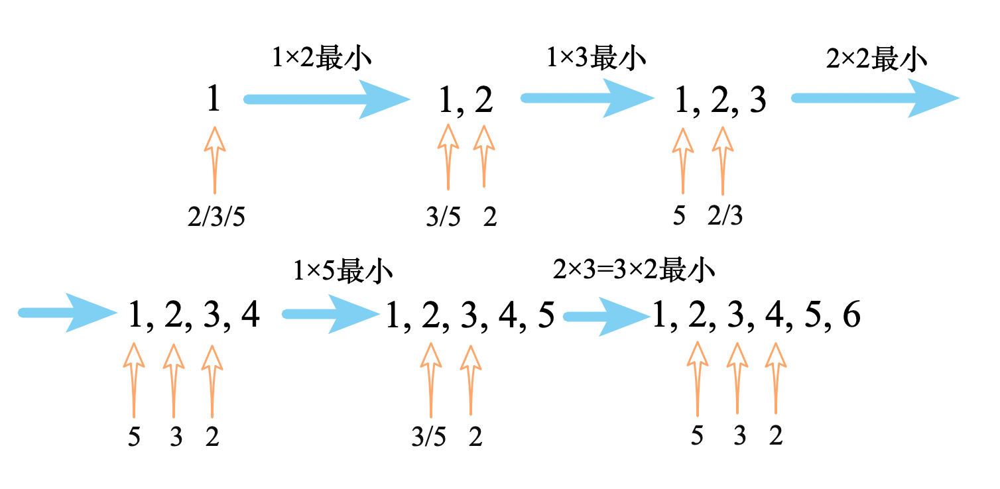

　　初始时丑数数组 =`[1]`，三个指针均为`0`，比较三个指针乘积的结果，把最小的作为下一个丑数，并且这个指针向右移`1`。  

　　如果有多个指针乘积结果相同（如图中的2×3=3×2），则同时移动它们。  

#### 代码  

方法一（小顶堆+去重）：

```python
class Solution:
    def nthUglyNumber(self, n: int) -> int:
        if n == 1: return 1
        cur = 1
        used_set = {1}
        factors = (2, 3, 5)
        
        import heapq
        heap = []
        for i in range(2, n+1):
            for f in factors:
                new_num = cur * f
                if new_num not in used_set:
                    used_set.add(new_num)
                    heapq.heappush(heap, new_num)
            cur = heapq.heappop(heap)

        return cur

```

方法二（三指针）：

```python
class Solution:
    def nthUglyNumber(self, n: int) -> int:
        if n == 1: return 1
        result = [0] * n
        result[0] = 1
        id_2, id_3, id_5 = 0, 0, 0
        for i in range(1, n):
            a = result[id_2] * 2
            b = result[id_3] * 3
            c = result[id_5] * 5
            minimal = min(a, b, c)

            if a == minimal: id_2 += 1
            if b == minimal: id_3 += 1
            if c == minimal: id_5 += 1

            result[i] = minimal
            
        return result[-1]
```

## A273. 整数转换英文表示

难度 `困难`  

#### 题目描述

将非负整数转换为其对应的英文表示。可以保证给定输入小于 231 - 1 。

> **示例 1:**

```
输入: 123
输出: "One Hundred Twenty Three"
```

> **示例 2:**

```
输入: 12345
输出: "Twelve Thousand Three Hundred Forty Five"
```

> **示例 3:**

```
输入: 1234567
输出: "One Million Two Hundred Thirty Four Thousand Five Hundred Sixty Seven"
```

> **示例 4:**

```
输入: 1234567891
输出: "One Billion Two Hundred Thirty Four Million Five Hundred Sixty Seven Thousand Eight Hundred Ninety One"
```

#### 题目链接

<https://leetcode-cn.com/problems/integer-to-english-words/>

#### 思路  


　　还好不用加`"and"`，把单词放在**数组**里，然后`' '.join()`就行了。  

#### 代码  

```python
class Solution:
    def numberToWords(self, num: int) -> str:
        if num == 0: return "Zero"
        ones = [[],["One"],["Two"],["Three"],["Four"],["Five"],["Six"],["Seven"],["Eight"],["Nine"]]
        dozen = [["Eleven"], ["Twelve"], ["Thirteen"], ["Fourteen"], ["Fifteen"], ["Sixteen"], ["Seventeen"], ["Eighteen"], ["Nineteen"]]
        tens = [[], ["Ten"], ["Twenty"], ["Thirty"], ["Forty"], ["Fifty"], ["Sixty"], ["Seventy"], ["Eighty"], ["Ninety"]]

        # aaa,bbb,ccc,ddd
        a = num // 1000000000
        b = (num % 1000000000) // 1000000
        c = (num % 1000000) // 1000
        d = num % 1000

        def parse_d(n):  # 解析小于1000的数
            if n == 0:
                return []
            elif 11 <= n <= 19:  # 11~19
                return dozen[n-11]

            d = n // 100
            e = (n % 100) // 10
            f =  n % 10
            ans = []
            if d: ans +=  ones[d] + ['Hundred']
            if 11 <= n % 100 <= 19:  # *1*
                return ans + dozen[n % 100 - 11]
            return ans + tens[e] + ones[f]

        ans = []
        if a: ans += parse_d(a) + ['Billion']
        if b: ans += parse_d(b) + ['Million']
        if c: ans += parse_d(c) + ['Thousand']
        ans += parse_d(d)

        return ' '.join(ans)
      
```


## A275. H指数 II

难度`中等`

#### 题目描述

给定一位研究者论文被引用次数的数组（被引用次数是非负整数），数组已经按照**升序排列**。编写一个方法，计算出研究者的 *h* 指数。

[h 指数的定义](https://baike.baidu.com/item/h-index/3991452?fr=aladdin): “h 代表“高引用次数”（high citations），一名科研人员的 h 指数是指他（她）的 （N 篇论文中）**至多**有 h 篇论文分别被引用了**至少** h 次。（其余的 *N - h* 篇论文每篇被引用次数**不多于** *h* 次。）"

> **示例:**

```
输入: citations = [0,1,3,5,6]
输出: 3 
解释: 给定数组表示研究者总共有 5 篇论文，每篇论文相应的被引用了 0, 1, 3, 5, 6 次。
     由于研究者有 3 篇论文每篇至少被引用了 3 次，其余两篇论文每篇被引用不多于 3 次，所以她的 h 指数是 3。
```

**说明:**

如果 *h* 有多有种可能的值 ，*h* 指数是其中最大的那个。

**进阶：**

- 这是 [H指数](https://leetcode-cn.com/problems/h-index/description/) 的延伸题目，本题中的 `citations` 数组是保证有序的。
- 你可以优化你的算法到对数时间复杂度吗？

#### 题目链接

<https://leetcode-cn.com/problems/h-index-ii/>

#### **思路:**

　　一般`O(logn)`的复杂度都使用二分法。为了帮助理解题意，对于示例中的`citations = [0, 1, 3, 5, 6]`，假设有另一个辅助数组`order = [5, 4, 3, 2, 1]`，第一个`citations`大于等于`order`的元素，`order`的值就是结果。  

　　因此二分法的判断条件为比较两个数组的对应元素`citations[i]`和`n - i`。   

#### **代码:**

```python
class Solution:
    def hIndex(self, citations: List[int]) -> int:
        n = len(citations)
        if not n: return 0
        # len(n) ~ 1
        i, j = 0, n - 1
        while i <= j and i < len(citations):
            mid = (i + j) // 2
            if citations[mid] == n - mid:
                return n - mid
            elif citations[mid] < n - mid: 
                i = mid + 1  # 往后搜
            elif citations[mid] > n - mid:
                if mid == 0 or citations[mid-1] < n - (mid-1):
                    return n - mid
                j = mid - 1

        return 0
      
```

## A278. 第一个错误的版本

难度`简单`

#### 题目描述

你是产品经理，目前正在带领一个团队开发新的产品。不幸的是，你的产品的最新版本没有通过质量检测。由于每个版本都是基于之前的版本开发的，所以错误的版本之后的所有版本都是错的。

假设你有 `n` 个版本 `[1, 2, ..., n]`，你想找出导致之后所有版本出错的第一个错误的版本。

你可以通过调用 `bool isBadVersion(version)` 接口来判断版本号 `version` 是否在单元测试中出错。实现一个函数来查找第一个错误的版本。你应该尽量减少对调用 API 的次数。

> **示例:**

```
给定 n = 5，并且 version = 4 是第一个错误的版本。

调用 isBadVersion(3) -> false
调用 isBadVersion(5) -> true
调用 isBadVersion(4) -> true

所以，4 是第一个错误的版本。 
```

#### 题目链接

<https://leetcode-cn.com/problems/first-bad-version/>

#### **思路:**

　　二分查找。  

#### **代码:**

```python
class Solution:
    def firstBadVersion(self, n):
        """
        :type n: int
        :rtype: int
        """
        i, j = 1, n
        while i <= j and i <= n:
            mid = (i + j) // 2
            if isBadVersion(mid):  # 当前版本是错误的
                if mid == 1 or not isBadVersion(mid-1):  # 前一个版本不是错误的
                    return mid
                j = mid - 1  # 往前找
            else:  # 当前版本是正确的，往后找
                i = mid + 1

        return 1
      
```

## A279. 完全平方数

难度 `中等`  
#### 题目描述

给定正整数 *n*，找到若干个完全平方数（比如 `1, 4, 9, 16, ...`）使得它们的和等于 *n*。你需要让组成和的完全平方数的个数最少。

> **示例 1:**

```
输入: n = 12
输出: 3 
解释: 12 = 4 + 4 + 4.
```

> **示例 2:**

```
输入: n = 13
输出: 2
解释: 13 = 4 + 9.
```

#### 题目链接

<https://leetcode-cn.com/problems/perfect-squares/>


#### 思路  

　　动态规划，类似于背包问题。递推公式如下：  

```
f(n) = 1 + min{
  f(n-1^2), f(n-2^2), f(n-3^2), f(n-4^2), ... , f(n-k^2) //(k为满足k^2<=n的最大的k)
}
```

#### 代码  
```python
class helper:
    def __init__(self):
        max_n = 10000
        self.nums = nums = [1] * max_n  # nums[1] 表示1
        for i in range(2, max_n):
            sqr = int(math.sqrt(i))
            if sqr * sqr == i:  # 本身就是完全平方数
                nums[i] = 1
                continue
            temp = i
            for j in range(1, sqr+1):
                temp = min(temp, nums[i - j ** 2] + 1)
            nums[i] = temp
        # print(nums)


class Solution:
    h = helper()
    def numSquares(self, n: int) -> int: 
        return self.h.nums[n]
```


## A282. 给表达式添加运算符

难度`困难`

#### 题目描述

给定一个仅包含数字 `0-9` 的字符串和一个目标值，在数字之间添加**二元**运算符（不是一元）`+`、`-` 或 `*` ，返回所有能够得到目标值的表达式。

> **示例 1:**

```
输入: num = "123", target = 6
输出: ["1+2+3", "1*2*3"] 
```

> **示例 2:**

```
输入: num = "232", target = 8
输出: ["2*3+2", "2+3*2"]
```

> **示例 3:**

```
输入: num = "105", target = 5
输出: ["1*0+5","10-5"]
```

> **示例 4:**

```
输入: num = "00", target = 0
输出: ["0+0", "0-0", "0*0"]
```

> **示例 5:**

```
输入: num = "3456237490", target = 9191
输出: []
```


#### 题目链接

<https://leetcode-cn.com/problems/expression-add-operators/>

#### **思路:**

　　在`num`中的每一个位置都可以添加 `+-*`号，(也可以不添加)。让我们来找一下规律：  

　　例如`num = "321"`，`target = 7`，在`3`后面添加符号：  

　　① 添加`"+"`，变成了`3 + handle("21") = 7`，也就是解决`handle("21") = 4`这个子问题；  

　　② 添加`"-"`，变成了`3 - handle("21") = 7`，减法其实也可以看成是加法(加上一个负数)，将`handle`前面的负号作为参数传递给`handle`即可，也就是解决`handle("21", factor=-1) = 4`这个子问题；  

　　③ 添加`"*"`，变成了`3 * handle("21") = 7`，需要让`handle`知道有个前导的系数`3`，因此需要解决`handle("21", factor=3) = 7`这个子问题。  

　　④ 不添加任何符号，如果`num * factor`就是`target`也可以符合条件。  

　　**如何解决带`factor`的子问题？**

　　例如`handle("21", factor=3) = 7`，同样可以对应上面的的①②③④。  

　　① 添加`"+"`，变成了`6 + handle("1") = 7`，这里的`6`是`factor * 添加的符号前面的数`得到的；  

　　② 添加`"-"`，变成了`6 - handle("1") = 7`，也就是`handle("1", factor=-1) = 1`；  

　　③ 添加`"*"`，变成了`6 * handle("1") = 7`，也就是`handle("1", factor=6) = 7`；  

　　④ 不添加符号，`3 * 21 != 7`。  

　　显然②③④的子问题都是无解的。  

#### **代码:**

```python
class Solution:
    def myaddOperators(self, num: str, target: int, factor) -> List[str]:
        # 减法其实也可以看成是加法(加上一个负数)
        # factor 表示前一个数的系数， 加法是1，减法是-1，乘法是乘数

        n = len(num)

        ans = []
        if num.isdigit() and int(num) * factor == target:  # 整个可以匹配
            if len(num) == 1 or not num.startswith('0'):  # 不能有前导0
                ans.append(num)
        
        if n == 1:return ans

        for i in range(1, n):
            if i > 1 and num.startswith('0'):  # 不能有前导0
                continue

            current = int(num[:i]) * factor
            
            plus = self.myaddOperators(num[i:], target - current, 1)  #  加法
            for exp in plus:
                ans.append(num[:i] + '+' + exp)

            minus = self.myaddOperators(num[i:], target - current, -1)  #  减法
            for exp in minus:
                ans.append(num[:i] + '-' + exp)

            multiply = self.myaddOperators(num[i:], target, current)  #  乘法
            for exp in multiply:
                ans.append(num[:i] + '*' + exp)

        return ans  


    def addOperators(self, num: str, target: int) -> List[str]:
        return self.myaddOperators(num, target, 1)  # 初始的factor是1

```

## A283. 移动零

难度`简单`

#### 题目描述

给定一个数组 `nums`，编写一个函数将所有 `0` 移动到数组的末尾，同时保持非零元素的相对顺序。

> **示例:**

```
输入: [0,1,0,3,12]
输出: [1,3,12,0,0]
```

**说明**:

1. 必须在原数组上操作，不能拷贝额外的数组。
2. 尽量减少操作次数。

#### 题目链接

<https://leetcode-cn.com/problems/move-zeroes/>

#### **思路:**


　　双指针，`i`指向最左边出现`0`的位置，`j`遍历`nums`，且`i < j`，每次交换`nums[i]`和`nums[j]`即可。  

#### **代码:**

```python
class Solution:
    def moveZeroes(self, nums: List[int]) -> None:
        """
        Do not return anything, modify nums in-place instead.
        """
        i = 0
        for j, num in enumerate(nums):
            if num == 0:
                continue

            while i < j - 1 and nums[i] != 0:
                i += 1
            if i < j and nums[i] == 0:
                nums[i], nums[j] = nums[j], nums[i]  # 交换
                i += 1

```

## A287. 寻找重复数

难度`中等`

#### 题目描述

给定一个包含 *n* + 1 个整数的数组 *nums* ，其数字都在 1 到 *n* 之间（包括 1 和 *n* ），可知至少存在一个重复的整数。假设只有一个重复的整数，找出这个重复的数。

> **示例 1:**

```
输入: [1,3,4,2,2]
输出: 2
```

> **示例 2:**

```
输入: [3,1,3,4,2]
输出: 3
```

**说明：**

1. **不能**更改原数组（假设数组是只读的）。
2. 只能使用额外的 *O*(1) 的空间。
3. 时间复杂度小于 *O*(*n*2) 。
4. 数组中只有一个重复的数字，但它可能不止重复出现一次。

#### 题目链接

<https://leetcode-cn.com/problems/find-the-duplicate-number/>

#### **思路:**

- 其一，对于链表问题，使用快慢指针可以判断是否有环。
- 其二，本题可以使用数组配合下标，抽象成链表问题。

　　快慢指针第一次重合后，将快指针也变成慢指针，第二次必然在重复数字处重合。  

#### **代码:**

```python
class Solution:
    def findDuplicate(self, nums: List[int]) -> int:
        fast, slow = 0, 0
        while True:
            fast = nums[nums[fast]];  # 快指针一次走2步
            slow = nums[slow];  # 慢指针一次走1步
            if slow == fast:
                fast = 0
                while slow != fast:
                    fast = nums[fast]
                    slow = nums[slow]

                return slow

```

## A290. 单词规律

难度`简单`

#### 题目描述

给定一种规律 `pattern` 和一个字符串 `str` ，判断 `str` 是否遵循相同的规律。

这里的 **遵循** 指完全匹配，例如， `pattern` 里的每个字母和字符串 `str` 中的每个非空单词之间存在着双向连接的对应规律。

> **示例1:**

```
输入: pattern = "abba", str = "dog cat cat dog"
输出: true
```

> **示例 2:**

```
输入:pattern = "abba", str = "dog cat cat fish"
输出: false
```

> **示例 3:**

```
输入: pattern = "aaaa", str = "dog cat cat dog"
输出: false
```

> **示例 4:**

```
输入: pattern = "abba", str = "dog dog dog dog"
输出: false
```

#### 题目链接

<https://leetcode-cn.com/problems/word-pattern/>

#### **思路:**

　　正反映射对应即可。  

#### **代码:**

```python
class Solution:
    def wordPattern(self, pattern: str, str: str) -> bool:
        p = list(pattern)
        s = str.split(' ')
        a_to_b = {}
        b_to_a = {}

        if len(p) != len(s):
            return False

        for i in range(len(p)):
            a = p[i]
            b = s[i]
            if a in a_to_b and a_to_b[a] != b:
                return False

            a_to_b[a] = b
            if b in b_to_a and b_to_a[b] != a:
                return False

            b_to_a[b] = a

        return True

```

## A300. 最长上升子序列

难度 `中等`  

#### 题目描述

给定一个无序的整数数组，找到其中最长上升子序列的长度。

> **示例:**

```
输入: [10,9,2,5,3,7,101,18]
输出: 4 
解释: 最长的上升子序列是 [2,3,7,101]，它的长度是 4。
```

**说明:**

- 可能会有多种最长上升子序列的组合，你只需要输出对应的长度即可。
- 你算法的时间复杂度应该为 O(*n2*) 。

**进阶:** 你能将算法的时间复杂度降低到 O(*n* log *n*) 吗?

#### 题目链接

<https://leetcode-cn.com/problems/longest-increasing-subsequence/>

#### 思路  

　　**方法一：**用一个辅助数组`orders`记录以每个数为最大的数字时，最长上升子序列的长度。如示例中`[10,9,2,5,3,7,101,18]`对应的`orders=[1,1,1,2,1,3,4,4]` 。  
　　初始状态`orders`全为`1`，统计`nums`中某个数字之前所有比它小的数字的`orders`的最大值 + 1即为`order[i]`新的值。复杂度为`O(n^2)` 。  
　　**方法二：**维护一个`升序的`结果数组`results`。如果`num`大于结果数组中的所有元素，就将`num`插入到结果数组的最后。否则用`num`替换`results`中第一个大于等于`num`的数。  
　　最终`results`的长度即为结果。复杂度为`O(nlogn)`。  

#### 代码  

　　**方法一：**  

```python
class Solution:
    def lengthOfLIS(self, nums: List[int]) -> int:
        n = len(nums)
        if not n:
            return 0
        orders = [1 for i in range(n)]  # 以nums[i]为最大s\数的最长上升子序列长度
        ans = 1
        i = 0
        for i in range(n-1):
            if nums[i+1] > nums[i]:
                orders[i+1] = 2
                ans = 2
                break

        for i in range(i+2, n):
            order_i = 1
            for j in range(i):
                if nums[j] < nums[i]:
                    order_i = max(order_i, orders[j]+1)
            orders[i] = order_i
            ans = max(ans, order_i)

        return ans

```

　　**方法二：**

```python
class Solution:
    def lengthOfLIS(self, nums: List[int]) -> int:
        if len(nums) == 0:
            return 0

        results = []
        for num in nums:
            if len(results) == 0 or num > results[-1]:
                results.append(num)
            else:
                for i, re in enumerate(results):
                    if re >= num:
                        results[i] = num
                        break

        print(results)
        return len(results)

```

## A301. 删除无效的括号

难度`困难`

#### 题目描述

删除最小数量的无效括号，使得输入的字符串有效，返回所有可能的结果。

**说明:** 输入可能包含了除 `(` 和 `)` 以外的字符。

> **示例 1:**

```
输入: "()())()"
输出: ["()()()", "(())()"]
```

> **示例 2:**

```
输入: "(a)())()"
输出: ["(a)()()", "(a())()"]
```

> **示例 3:**

```
输入: ")("
输出: [""]
```

#### 题目链接

<https://leetcode-cn.com/problems/remove-invalid-parentheses/>

#### **思路:**

　　dfs。第一遍搜索找到`最少删除括号的个数`。  

　　第二遍搜索以`最少删除括号的个数`为剪枝条件，寻找所有括号匹配的可能性。  

　　用`set`去除重复。

#### **代码:**

```python
class Solution:
    def removeInvalidParentheses(self, s: str) -> List[str]:
        ls = len(s)
        ans = set()
        minimum_delete = ls  # 最小删除的括号数
        def dfs(i, cnt, del_cnt, max_delte, cur): # s[i:] cnt个左括号 删了几个 最多删几个括号, 当前字符串
            nonlocal minimum_delete
            if del_cnt > max_delte:
                return False
            if i >= ls:
                if cnt == 0:
                    minimum_delete = del_cnt
                    # print(del_cnt)
                    ans.add(cur)
                    if max_delte == float('inf'):
                        return True  # return True可以确保找最小删除数的时候不重复搜索
                return False

            if s[i] == '(':  # 要么用这个左括号 要么不用
                if dfs(i+1, cnt+1, del_cnt, max_delte, cur + '('):  # 用(
                    return True
                return dfs(i+1, cnt, del_cnt+1, max_delte, cur) # 不用(
              
            elif s[i] == ')':
                if cnt > 0 and dfs(i+1, cnt - 1, del_cnt, max_delte, cur+')'):  # 用)
                    return True
                return dfs(i+1, cnt, del_cnt+1, max_delte, cur)   # 不用)
              
            else:  # 非括号字符
                return dfs(i+1, cnt, del_cnt, max_delte, cur + s[i])
            
        
        dfs(0, 0, 0, float('inf'), '')  # 第一次dfs，找到最少删几个括号
        ans.clear()
        dfs(0, 0, 0, minimum_delete, '')  # 第二次dfs，找到所有的结果
        return [a for a in ans]
      
```

## A303. 区域和检索 - 数组不可变

难度 `简单`  
#### 题目描述

给定一个整数数组  *nums*，求出数组从索引 *i* 到 *j*  (*i* ≤ *j*) 范围内元素的总和，包含 *i,  j* 两点。

> **示例：**

```
给定 nums = [-2, 0, 3, -5, 2, -1]，求和函数为 sumRange()

sumRange(0, 2) -> 1
sumRange(2, 5) -> -1
sumRange(0, 5) -> -3
```

**说明:**

1. 你可以假设数组不可变。
2. 会多次调用 *sumRange* 方法。

#### 题目链接

<https://leetcode-cn.com/problems/range-sum-query-immutable/>


#### 思路  


　　重点在于会多次调用。因此在初始化时先求好前`n`项和。调用`sumRange`时只要返回`self.sums[j] - self.sums[i-1]`即可。  

#### 代码  
```python
class NumArray:
    def __init__(self, nums: List[int]):
        t = 0
        def accumulate(x):
            nonlocal t
            t += x
            return t

        self.nums = nums
        self.sums = list(map(accumulate, nums))  # 前n项和的列表
              
    def sumRange(self, i: int, j: int) -> int:
        if i <= 0: return self.sums[j]
        if j >= len(self.sums): j = len(self.sums) - 1

        return self.sums[j] - self.sums[i-1]

```

## A304. 二维区域和检索 - 矩阵不可变

难度 `中等`  
#### 题目描述

给定一个二维矩阵，计算其子矩形范围内元素的总和，该子矩阵的左上角为 (*row*1, *col*1) ，右下角为 (*row*2, *col*2)。

　　  
上图子矩阵左上角 (row1, col1) = **(2, 1)** ，右下角(row2, col2) = **(4, 3)，**该子矩形内元素的总和为 8。

> **示例:**

```
给定 matrix = [
  [3, 0, 1, 4, 2],
  [5, 6, 3, 2, 1],
  [1, 2, 0, 1, 5],
  [4, 1, 0, 1, 7],
  [1, 0, 3, 0, 5]
]

sumRegion(2, 1, 4, 3) -> 8
sumRegion(1, 1, 2, 2) -> 11
sumRegion(1, 2, 2, 4) -> 12
```

**说明:**

1. 你可以假设矩阵不可变。
2. 会多次调用 *sumRegion* 方法*。*
3. 你可以假设 *row*1 ≤ *row*2 且 *col*1 ≤ *col*2。

#### 题目链接

<https://leetcode-cn.com/problems/range-sum-query-2d-immutable/>


#### 思路  

　　和上一题类似，在初始化时先计算好从左上角到`[i][j]`的矩形内数字和`sums[i][j]`。任意矩形面积的计算方法如下图所示：  
　　　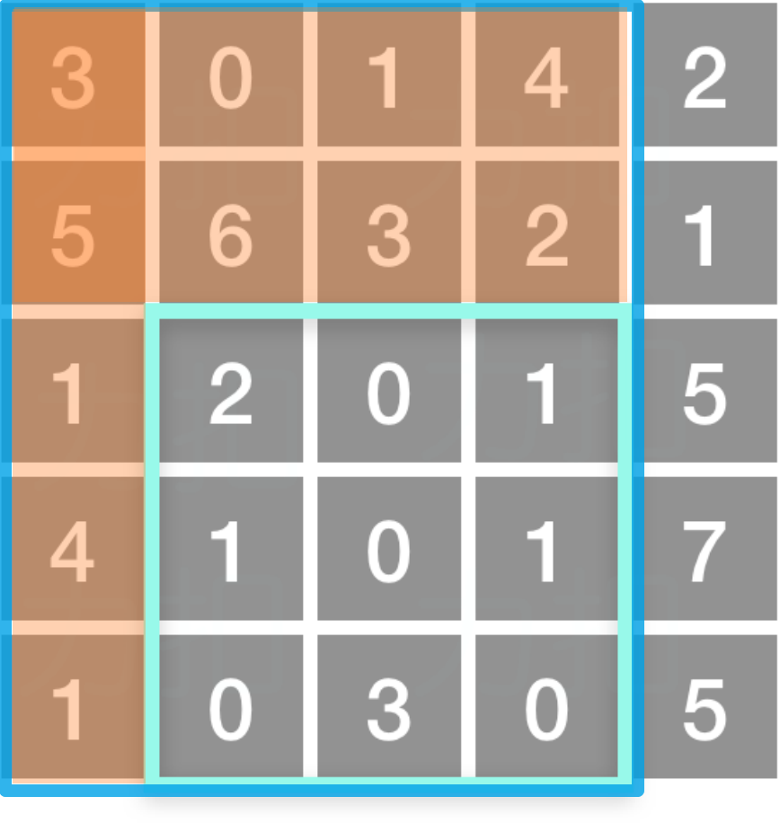  

　　 `淡蓝色框内的数字和`=`深蓝色框内的数字和`-`两个橙色矩形内的数字和`+`两橙色矩形重合部分的数字和`。  

　　用公式表示为：`两点之间的数字和`=`sums[row2][col2] - sums[row1-1][col2] - sums[row2][col1-1] + sums[row1-1][col1-1]`。  

#### 代码  
```python
class NumMatrix:

    def __init__(self, matrix: List[List[int]]):
        self.m = m = len(matrix)
        if not m: self.sums = []; return
        self.n = n = len(matrix[0])

        self.sums = sums = [[0 for _ in range(n)] for _ in range(m)]
        for i in range(m):
            for j in range(n):
                if i == 0 and 0 == 1:
                    sums[i][j] = matrix[i][j]
                elif i == 0:
                    sums[i][j] = sums[i][j-1] + matrix[i][j]
                elif j == 0:
                    sums[i][j] = sums[i-1][j] + matrix[i][j]
                else:
                    sums[i][j] = sums[i-1][j] + sums[i][j-1] - sums[i-1][j-1] + matrix[i][j]
        # print(sums)

    def sumRegion(self, row1: int, col1: int, row2: int, col2: int) -> int:
        if not self.m: return 0
        row1 = max(0, row1)
        col1 = max(0, col1)
        row2 = min(self.m-1, row2)
        col2 = min(self.n-1, col2)

        sums = self.sums

        if row1 == 0 and col1 == 0: return self.sums[row2][col2]
        if row1 == 0: return sums[row2][col2] - sums[row2][col1-1]
        if col1 == 0: return sums[row2][col2] - sums[row1-1][col2]

        return sums[row2][col2] - sums[row1-1][col2] - sums[row2][col1-1] + sums[row1-1][col1-1]
```

## A309. 最佳买卖股票时机含冷冻期

难度 `中等`  
#### 题目描述

给定一个整数数组，其中第 *i* 个元素代表了第 *i* 天的股票价格 。

设计一个算法计算出最大利润。在满足以下约束条件下，你可以尽可能地完成更多的交易（多次买卖一支股票）:

- 你不能同时参与多笔交易（你必须在再次购买前出售掉之前的股票）。
- 卖出股票后，你无法在第二天买入股票 (即冷冻期为 1 天)。

> **示例:**

```
输入: [1,2,3,0,2]
输出: 3 
解释: 对应的交易状态为: [买入, 卖出, 冷冻期, 买入, 卖出]
```

#### 题目链接

<https://leetcode-cn.com/problems/best-time-to-buy-and-sell-stock-with-cooldown/>


#### 思路  

　　动态规划，双重转移方程。  

　　用两个数组`dp_0[i]`和`dp_1[i]`分别表示第`i`天`无股票的最大收益`和`有股票的最大收益`。则有以下转移方程：  

```
dp_1[i] = max(dp_1[i-1], dp_0[i-2] - prices[i])  # 不进行操作 或者买入股票(注意冻结期)
dp_0[i] = max(dp_0[i-1], prices[i] + dp_1[i-1])  # 不进行操作 或者卖出股票
```

#### 代码  
```python
class Solution:
    def maxProfit(self, prices: List[int]) -> int:
        # dp[i]表示i天之前卖出的最大利润
        n = len(prices)
        if n <= 1:
            return 0

        dp_0 = [0] * n  # 无股票的最大收益
        dp_1 = [0] * n  # 有股票的最大收益

        dp_1[0] = - prices[0]
        dp_1[1] = - min(prices[0], prices[1])
        dp_0[1] = max(0, prices[1]-prices[0])

        for i in range(2, n):
            if i >= 2:
                dp_1[i] = max(dp_1[i-1], dp_0[i-2] - prices[i])  # 保持前一天的股票 或者买入股票(注意冻结期)
                dp_0[i] = max(dp_0[i-1], prices[i] + dp_1[i-1])
            

        return dp_0[-1]
      
```

## A310. 最小高度树

难度`中等`

#### 题目描述

对于一个具有树特征的无向图，我们可选择任何一个节点作为根。图因此可以成为树，在所有可能的树中，具有最小高度的树被称为最小高度树。给出这样的一个图，写出一个函数找到所有的最小高度树并返回他们的根节点。

**格式**

该图包含 `n` 个节点，标记为 `0` 到 `n - 1`。给定数字 `n` 和一个无向边 `edges` 列表（每一个边都是一对标签）。

你可以假设没有重复的边会出现在 `edges` 中。由于所有的边都是无向边， `[0, 1]`和 `[1, 0]` 是相同的，因此不会同时出现在 `edges` 里。

> **示例 1:**

```
输入: n = 4, edges = [[1, 0], [1, 2], [1, 3]]

        0
        |
        1
       / \
      2   3 

输出: [1]
```

> **示例 2:**

```
输入: n = 6, edges = [[0, 3], [1, 3], [2, 3], [4, 3], [5, 4]]

     0  1  2
      \ | /
        3
        |
        4
        |
        5 

输出: [3, 4]
```

#### 题目链接

<https://leetcode-cn.com/problems/minimum-height-trees/>

#### **思路:**

　　构建图，循环遍历图，找出叶子节点。去除叶子节点。直到图中节点只剩下2个或1个。返回剩下的节点。  

#### **代码:**

```python
from collections import defaultdict

class Solution:
    def findMinHeightTrees(self, n: int, edges: List[List[int]]) -> List[int]:
        if not n:
            return []
        if not edges:
            return list(range(n))

        graph = defaultdict(list)
        for x, y in edges:
            graph[x].append(y)
            graph[y].append(x)

        nodes = set(range(n))
        while True:
            if len(nodes) <= 2:
                return [n for n in nodes]
                
            leaves = []
            for k in graph:
                if len(graph[k]) == 1:
                    leaves.append(k)
                    nodes.remove(k)

            for k in leaves:
                    o = graph[k][0]
                    graph[k].clear()
                    graph[o].remove(k)

```

## A312. 戳气球

难度 `困难`  
#### 题目描述

有 `n` 个气球，编号为`0` 到 `n-1`，每个气球上都标有一个数字，这些数字存在数组 `nums` 中。

现在要求你戳破所有的气球。每当你戳破一个气球 `i` 时，你可以获得 `nums[left] * nums[i] * nums[right]` 个硬币。 这里的 `left` 和 `right` 代表和 `i` 相邻的两个气球的序号。注意当你戳破了气球 `i` 后，气球 `left` 和气球 `right` 就变成了相邻的气球。

求所能获得硬币的最大数量。

**说明:**

- 你可以假设 `nums[-1] = nums[n] = 1`，但注意它们不是真实存在的所以并不能被戳破。
- 0 ≤ `n` ≤ 500, 0 ≤ `nums[i]` ≤ 100

> **示例:**

```
输入: [3,1,5,8]
输出: 167 
解释: nums = [3,1,5,8] --> [3,5,8] -->   [3,8]   -->  [8]  --> []
     coins =  3*1*5      +  3*5*8    +  1*3*8      + 1*8*1   = 167
```

#### 题目链接

<https://leetcode-cn.com/problems/burst-balloons/>


#### 思路  

　　这题类似于矩阵连乘。关键点在于先选出**最后一个**戳破的气球🎈，递推公式图下图所示：

　　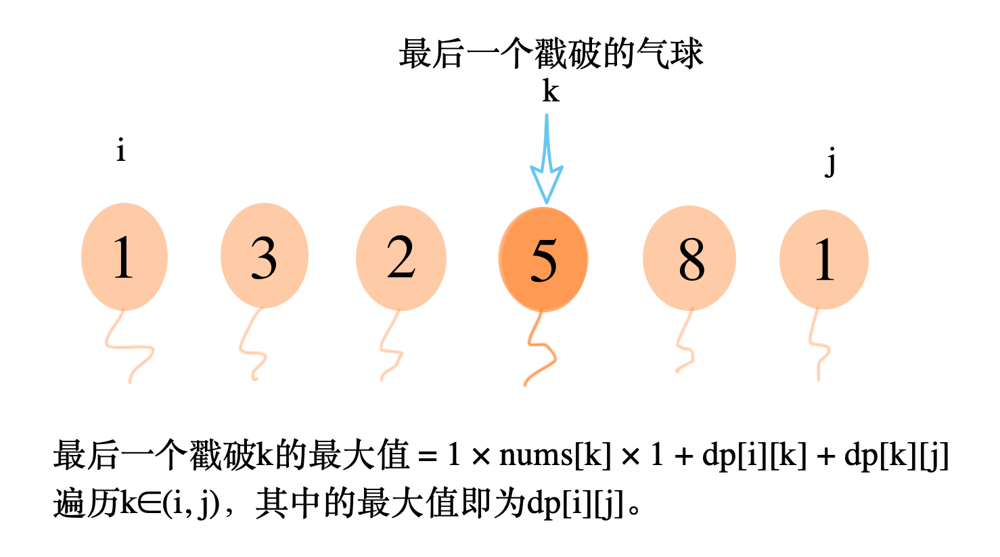

　　`dp[i][j]`表示以`i`、`j`两个数作为左右端点（不戳破`i`和`j`），能获得硬币的最大值。`k`为最后一个戳破的气球，戳破`k`能获得`1 × nums[k] × 1`个硬币。最后一个戳破`k`时，能获得的最大硬币数为：  

```
max_coin_k = 1 * nums[k] * 1 + dp(i,k) + dp(k,j)
```

　　递归地计算`dp(i,k)`和`dp(k,j)`，找到倒数第二个被戳破的气球。。以此类推。  

#### 代码  
```python
class Solution:
    def maxCoins(self, nums: List[int]) -> int:
        n = len(nums)
        if n == 0: return 0
        nums = [1] + nums + [1]

        from functools import lru_cache
        @lru_cache(None)
        def dp(i, j):
            if j - i == 1: return 0
            ans = 0
            for k in range(i+1, j):  # 不包括i和j
                ans = max(ans, nums[i] * nums[j] * nums[k] + dp(i,k) + dp(k,j)) 
            return ans

        return dp(0, n+1)
      
```

## A313. 超级丑数

难度`中等`

#### 题目描述

编写一段程序来查找第 `*n*` 个超级丑数。

超级丑数是指其所有质因数都是长度为 `k` 的质数列表 `primes` 中的正整数。

> **示例:**

```
输入: n = 12, primes = [2,7,13,19]
输出: 32 
解释: 给定长度为 4 的质数列表 primes = [2,7,13,19]，前 12 个超级丑数序列为：[1,2,4,7,8,13,14,16,19,26,28,32] 。
```

**说明:**

- `1` 是任何给定 `primes` 的超级丑数。
- 给定 `primes` 中的数字以升序排列。
- 0 < `k` ≤ 100, 0 < `n` ≤ 106, 0 < `primes[i]` < 1000 。
- 第 `n` 个超级丑数确保在 32 位有符整数范围内。

#### 题目链接

<https://leetcode-cn.com/problems/super-ugly-number/>

#### **思路:**

　　最小堆。每次取出最小的元素，乘以所有的素数然后放回堆中。  

#### **代码:**

```python
class Solution:
    def nthSuperUglyNumber(self, n: int, primes: List[int]) -> int:
        heap = primes.copy()
        shown = set(heap)
        heapify(heap)
        ans = 1
        for _ in range(n-1):
            ans = top = heappop(heap)
            shown.remove(top)
            for prime in primes:
                c = top * prime
                if c not in shown:
                    shown.add(c)
                    heappush(heap, c)

        return ans

```

## A315. 计算右侧小于当前元素的个数

难度`困难`

#### 题目描述

给定一个整数数组 *nums* ，按要求返回一个新数组 *counts* 。数组 *counts* 有该性质： `counts[i]` 的值是  `nums[i]` 右侧小于 `nums[i]` 的元素的数量。

> **示例:**

```
输入: [5,2,6,1]
输出: [2,1,1,0] 
解释:
5 的右侧有 2 个更小的元素 (2 和 1).
2 的右侧仅有 1 个更小的元素 (1).
6 的右侧有 1 个更小的元素 (1).
1 的右侧有 0 个更小的元素.
```

#### 题目链接

<https://leetcode-cn.com/problems/count-of-smaller-numbers-after-self/>

#### **思路:**

　　维护一个升序数组，**从右往左**遍历`nums`，查找`nums[i]`在升序数组中的位置（并插入）就是`counts[i]`。  

　　二分查找时间复杂度`O(logn)`，插入操作`O(n)`，总的时间复杂度为`O(n^2 + nlogn)`。

#### **代码:**

```python
class Solution:
    def countSmaller(self, nums: List[int]) -> List[int]:
        n = len(nums)
        if not n: return []
        temp = [nums[-1]]
        ans = [0 for i in range(n)]

        for i in range(n-2, -1, -1):
            num = nums[i]
            idx = bisect.bisect_left(temp, num)
            ans[i] = idx
            bisect.insort(temp, num)

        return ans

```

## A316. 去除重复字母

难度`困难`

#### 题目描述

给你一个仅包含小写字母的字符串，请你去除字符串中重复的字母，使得每个字母只出现一次。需保证返回结果的字典序最小（要求不能打乱其他字符的相对位置）。

> **示例 1:**

```
输入: "bcabc"
输出: "abc"
```

> **示例 2:**

```
输入: "cbacdcbc"
输出: "acdb"
```

#### 题目链接

<https://leetcode-cn.com/problems/remove-duplicate-letters/>

#### **思路:**

　　**方法一：**递归，假设`s`中最小的字母是`"a"`，先看第一个`"a"`右边是不是所有其他的字母都有，如果都有，把右边的部分中的`"a"`去掉，然后递归地调用本算法。  

　　如果右边不是所有的字母都有，则继续查找第二小的字母。  

　　例如示例2的递归过程如下：  

```python
① 最小的是"a"，"a"的右边所有字母都有, ans = "a"，递归处理"cdcbc"；
② 最小的是"b"，"b"的右边没有"d"，继续找下一个；
    下一个最小的是"c"，"c"的右边所有字母都有，ans = "ac"， 递归处理"db"；
③ 最小的是"b"，"b"的右边没有"d"，继续找下一个；
    下一个最小的是"d"，"b"的右边所有字母都有，ans = "acd"， 递归处理"b"；
④ 只剩一个字母了，返回"b"，ans = "acdb"；

```

　　**方法二：**单调栈，思路就是，遇到一个新字符，如果比`栈顶`小，并且在后面和`栈顶`一样的字母还有，就把栈顶的字符抛弃了。  

#### **代码:**

　　**方法一：**递归(68ms)

```python
import string
class Solution:        
    def removeDuplicateLetters(self, s: str) -> str:
        all_letters = set(s)
        minimal_letters = sorted(list(all_letters))

        # 先找a 看a右边是不是所有字母都有，再找b
        for char in minimal_letters:
            idx = s.find(char)
            if set(s[idx:]) == all_letters:
                return char + self.removeDuplicateLetters(s[idx:].replace(char, ''))

        return ''

```

　　**方法二：**单调栈(44ms)

```python
import string
class Solution:        
    def removeDuplicateLetters(self, s: str) -> str:
        used = set()
        
        stack = ['#']  # 井号的ascii码小于所有小写字母

        ans = ''
        for i, char in enumerate(s):
            if char not in used:
                while char < stack[-1] and s.find(stack[-1], i+1) != -1 :  # 比栈顶小
                    top = stack.pop()
                    used.remove(top)

                stack.append(char)
                used.add(char)

        return ''.join(stack[1:])  # 最后将栈中的元素按顺序输出就是答案
                
```

## A318. 最大单词长度乘积

难度`中等`

#### 题目描述

给定一个字符串数组 `words`，找到 `length(word[i]) * length(word[j])` 的最大值，并且这两个单词不含有公共字母。你可以认为每个单词只包含小写字母。如果不存在这样的两个单词，返回 0。

> **示例 1:**

```
输入: ["abcw","baz","foo","bar","xtfn","abcdef"]
输出: 16 
解释: 这两个单词为 "abcw", "xtfn"。
```

> **示例 2:**

```
输入: ["a","ab","abc","d","cd","bcd","abcd"]
输出: 4 
解释: 这两个单词为 "ab", "cd"。
```

> **示例 3:**

```
输入: ["a","aa","aaa","aaaa"]
输出: 0 
解释: 不存在这样的两个单词。
```

#### 题目链接

<https://leetcode-cn.com/problems/maximum-product-of-word-lengths/>

#### **思路:**

　　使用二进制进行状态压缩。26个小写字母可以用一个小于`2^26`的整数来表示。出现过的字母对应位上置1，没出现过的置为0。  

#### **代码:**

```python
class Solution:
    def maxProduct(self, words: List[str]) -> int:
        ans = 0

        hashes = []

        for word in words:
            hash = 0
            for letter in set(word):
                pos = ord(letter) - 97
                hash += 1 << pos

            hashes.append(hash)

        for i, word1 in enumerate(words):
            for j, word2 in enumerate(words):
                if hashes[i] & hashes[j] == 0:
                    ans = max(ans, len(word1) * len(word2))

        return ans
```

## A321. 拼接最大数

难度 `困难`  
#### 题目描述

给定长度分别为 `m` 和 `n` 的两个数组，其元素由 `0-9` 构成，表示两个自然数各位上的数字。现在从这两个数组中选出 `k (k <= m + n)` 个数字拼接成一个新的数，要求从同一个数组中取出的数字保持其在原数组中的相对顺序。

求满足该条件的最大数。结果返回一个表示该最大数的长度为 `k` 的数组。

**说明:** 请尽可能地优化你算法的时间和空间复杂度。

> **示例 1:**

```
输入:
nums1 = [3, 4, 6, 5]
nums2 = [9, 1, 2, 5, 8, 3]
k = 5
输出:
[9, 8, 6, 5, 3]
```

> **示例 2:**

```
输入:
nums1 = [6, 7]
nums2 = [6, 0, 4]
k = 5
输出:
[6, 7, 6, 0, 4]
```

> **示例 3:**

```
输入:
nums1 = [3, 9]
nums2 = [8, 9]
k = 3
输出:
[9, 8, 9]
```

#### 题目链接

<https://leetcode-cn.com/problems/create-maximum-number/>


#### 思路  

　　我们可以取`nums1`的可以形成 **i** 位最大数字，`nums2`的 **k - i** 位最大数字，它们再**合并**组成数字就是最大的。  

　　找`nums1`能组成的 **i** 位最大数字，使用递归的方式，如下图所示：  

　　

　　在每轮递归中，都先找到`最大数`的下标，然后对`右边递归`，最后对`左边递归`。  

　　如上图搜索的最终结果为：

```
数字  下标
8:    3
3:    4
2:    5
7:    0
5:    2
1:    1
```

　　`nums1`能组成的 **i** 位最大数字，取前 **i** 个下标，排序后到`nums1`中依次索引即可。  

　　如上图能组成的最大 4 位数字，取下标的前 4 个`[3, 4, 5, 0]`，排序后为`[0, 3, 4, 5]`，也就是`nums`中的`"7832"`。  

　　  

　　**合并两数组**的算法：  

　　比较它们的**前缀大小**，每次都到前缀大的数组中取第一个数字，详细步骤如下：

```
第1步: "7832" < "791"  ， 取nums2, result = "7"
第2步: "7832" < "91"  ， 取nums2, result = "79"
第3步: "7832" > "1"  ， 取nums1, result = "797"
第4步: "832" > "1"  ， 取nums1, result = "7978"
第5步: "32" > "1"  ， 取nums1, result = "79783"
第6步: "2" > "1"  ， 取nums1, result = "797832"
第7步: "" < "1"  ， 取nums2, result = "7978321"

```

#### 代码  
```python
class Solution:
    def maxNumber(self, nums1: List[int], nums2: List[int], k: int) -> List[int]:
        l1 = len(nums1)
        l2 = len(nums2)
        if k == 0: return []

        def dfs(nums, i, j, put_in):  # 递归
            if j <= i: return
            max_id = i + nums[i: j].index(max(nums[i: j]))  # 找到i,j之间最大元素的下标
            put_in.append(max_id)

            dfs(nums, max_id + 1, j, put_in)
            dfs(nums, i, max_id, put_in)

        m1 = []; dfs(nums1, 0, l1, m1)
        m2 = []; dfs(nums2, 0, l2, m2)

        def merge(s1, s2):  # merge('67', '604') = '67604'
            i, j = 0, 0
            ans = ''
            while i < len(s1) or j < len(s2):
                if s1[i:] > s2[j:]: ans += s1[i]; i += 1
                else: ans += s2[j]; j += 1

            return ans

        s1 = ['' for _ in range(l1)]
        ans = 0
        for i in range(max(0, k-l2), min(k, l1)+1):  # nums1 最少~最多取几个
            # nums1 取i位能组成的最大数(字符串形式))：
            # 将下标数组 m 的前 i 位排序后依次到nums中索引
            s1 = ''.join(map(str, map(nums1.__getitem__, sorted([idx for idx in m1[:i]])))) 
            j = k - i
            s2 = ''.join(map(str, map(nums2.__getitem__, sorted([idx for idx in m2[:j]]))))
            ans = max(ans, int(merge(s1, s2)))

        return list(map(int ,list(str(ans))))


```

## A322. 零钱兑换

难度 `中等`  
#### 题目描述

给定不同面额的硬币 coins 和一个总金额 amount。编写一个函数来计算可以凑成总金额所需的最少的硬币个数。如果没有任何一种硬币组合能组成总金额，返回 `-1`。

> **示例 1:**

```
输入: coins = [1, 2, 5], amount = 11
输出: 3 
解释: 11 = 5 + 5 + 1
```

> **示例 2:**

```
输入: coins = [2], amount = 3
输出: -1
```

#### 题目链接

<https://leetcode-cn.com/problems/coin-change/>


#### 思路  

　　背包🎒问题。  

　　如果**所有**`amount - coins[i]`所需的最少硬币个数都已知，那么`它们之中的最小值` + 1 就是`amount`所需的最少硬币个数。

#### 代码  

　　写法一：  

```python
class Solution:
    def coinChange(self, coins: List[int], amount: int) -> int:
        ans = [-1 for i in range(amount + 1)]
        ans[0] = 0

        for i in range(1, amount+1):
            minimal = float('inf')
            if ans[i] == -1:
                for coin in coins:
                    left = i - coin
                    if left >= 0:
                        if ans[left] != -1:
                            minimal = min(minimal, ans[left] + 1)

                minimal = -1 if minimal == float('inf') else minimal

                ans[i] = minimal

        return ans[amount]
```

　　写法二：

```python
class Solution:
    def coinChange(self, coins: List[int], amount: int) -> int:
        inf = float('inf')
        dp = [inf for i in range(amount + 1)]
        dp[0] = 0

        for i in range(1, amount+1):
            all_i_use_coins = [dp[i - coin] for coin in filter(lambda x: x <= i, coins)] + [inf]  # 加一个inf 防止为空
            dp[i] = min(all_i_use_coins) + 1

        if dp[amount] == inf: return -1
        return dp[amount]
```

　## A324. 摆动排序 II

难度`中等`

#### 题目描述

给定一个无序的数组 `nums`，将它重新排列成 `nums[0] < nums[1] > nums[2] < nums[3]...` 的顺序。

> **示例 1:**

```
输入: nums = [1, 5, 1, 1, 6, 4]
输出: 一个可能的答案是 [1, 4, 1, 5, 1, 6]
```

> **示例 2:**

```
输入: nums = [1, 3, 2, 2, 3, 1]
输出: 一个可能的答案是 [2, 3, 1, 3, 1, 2]
```

**说明:**
你可以假设所有输入都会得到有效的结果。

**进阶:**
你能用 O(n) 时间复杂度和 / 或原地 O(1) 额外空间来实现吗？

#### 题目链接

<https://leetcode-cn.com/problems/wiggle-sort-ii/>

#### **思路:**


　　降序排序以后穿插取数字即可。  

#### **代码:**

```python
class Solution:
    def wiggleSort(self, nums):
        """
        :type nums: List[int]
        :rtype: void Do not return anything, modify nums in-place instead.
        """
        nums.sort(reverse=True)
        nums[::2], nums[1::2] = nums[len(nums)//2:], nums[:len(nums)//2]

```

## A327. 区间和的个数

难度`困难`

#### 题目描述

给定一个整数数组 `nums`，返回区间和在 `[lower, upper]` 之间的个数，包含 `lower` 和 `upper`。
区间和 `S(i, j)` 表示在 `nums` 中，位置从 `i` 到 `j` 的元素之和，包含 `i` 和 `j` (`i` ≤ `j`)。

**说明:**
最直观的算法复杂度是 *O*(*n*2) ，请在此基础上优化你的算法。

> **示例:**

```
输入: nums = [-2,5,-1], lower = -2, upper = 2,
输出: 3 
解释: 3个区间分别是: [0,0], [2,2], [0,2]，它们表示的和分别为: -2, -1, 2。
```

#### 题目链接

<https://leetcode-cn.com/problems/count-of-range-sum/>

#### **思路:**

　　**方法一：**(前缀和+二分)，先计算前n项和`accum(n)`，维护一个升序数组`Asc`将其依次插入。  

　　题目要求的连续区间落在`lower`和`upper`之间，实际上就是求`前n项和`之差落在`lower`和`upper`之间的个数。  

　　插入`accum(n)`时，`Asc`中已经存放着前`1~(n-1)`项和(而且是升序的)，目标是找到其中有几项与`accum(n)`的差落在`lower`和`upper`之间。只要分别(用二分法)查找`accum(n) - upper`和`accum(n) - lower`在`Asc`中的位置，它们的下标差就是满足条件的个数。  

　　**方法二：**权值线段树。python实现起来耗时比方法一更长。  

#### **代码:**

　　**方法一：**(前缀和+二分)

```python
import bisect

class Solution:
    def countRangeSum(self, nums: List[int], lower: int, upper: int) -> int:
        n = len(nums)
        if not n: return 0

        ans = 0
        asc = [0]
        temp = 0
        accum = []
        for num in nums:
            temp += num
            accum.append(temp)

        for sum_wnd in accum:
            i = bisect.bisect_left(asc, sum_wnd - upper)  # 查找应该插入的位置
            j = bisect.bisect(asc, sum_wnd - lower)
            bisect.insort(asc, sum_wnd)  # 插入
            ans += j - i

        return ans
```

　　**方法二：**(权值线段树)

```python
import bisect
class Solution:
    def countRangeSum(self, nums: List[int], lower: int, upper: int) -> int:
        n = len(nums)
        if not n: return 0
        tree = [0 for _ in range(n+1)]

        ans = 0
        temp = 0
        prefix = []  # 前缀和
        for num in nums:
            temp += num
            prefix.append(temp)

        asc = sorted(prefix)  # 升序的前缀和
        dic = {num :i+1 for i, num in enumerate(asc)}
        rank = [dic[num] for num in prefix]  # 对应的次序

        # ======线段树的三个函数=======
        def lowbit(x):
            return x & (-x)

        def getsum(pos):
            sum = 0
            while pos:
                sum += tree[pos]
                pos -= lowbit(pos)
            return sum

        def update(pos):
            while pos < len(tree):
                tree[pos] += 1
                pos += lowbit(pos)
        # ======线段树的三个函数=======

        for i in range(n):
            if lower <= prefix[i] <= upper: ans += 1
            l = bisect.bisect_left(asc, prefix[i] - upper)  # 查找应该插入的位置
            r = bisect.bisect(asc, prefix[i] - lower)
            ans += getsum(r) - getsum(l);
            update(rank[i])

        return ans

```

## A329. 矩阵中的最长递增路径

难度`困难`

#### 题目描述

给定一个整数矩阵，找出最长递增路径的长度。

对于每个单元格，你可以往上，下，左，右四个方向移动。 你不能在对角线方向上移动或移动到边界外（即不允许环绕）。

> **示例 1:**

```
输入: nums = 
[
  [9,9,4],
  [6,6,8],
  [2,1,1]
] 
输出: 4 
解释: 最长递增路径为 [1, 2, 6, 9]。
```

> **示例 2:**

```
输入: nums = 
[
  [3,4,5],
  [3,2,6],
  [2,2,1]
] 
输出: 4 
解释: 最长递增路径是 [3, 4, 5, 6]。注意不允许在对角线方向上移动。
```

#### 题目链接

<https://leetcode-cn.com/problems/longest-increasing-path-in-a-matrix/>

#### **思路:**

　　**方法一：**dfs记忆化搜索。先从矩阵中找到所有**四周元素都不比自己小**的元素作为起点，从它们开始dfs。用数组`dp[i][j]`记录从开始位置到某个位置的最长路径，如果某个元素不能使周围元素的`dp`变大，就不再继续往下搜索了，起到剪枝的效果。  　　

　　**方法二：**动态规划。先预处理，对矩阵的值按从小到大排序，按大小顺序才能保证依赖的子问题都求解过了。

　　`dp[i][j]`表示以`matrix[i][j]`结尾的最长递增长度。

- 初始`dp[i][j]`都等于1；  
- 若`matrix[i][j]`四个方向有任意小于它，则可以更新`dp[i][j] = max(dp[i][j], 1 + dp[r][c])`。  

#### **代码:**  

　　**方法一：**dfs记忆化搜索 (1036 ms)  

```python
class Solution:
    def longestIncreasingPath(self, matrix: List[List[int]]) -> int:
        arounds = [(-1, 0), (1, 0), (0, -1), (0, 1)]  # 上下左右
        # matrix = grid = board
        m = len(matrix)
        if not m: return 0
        n = len(matrix[0])
        dp = [[1 for _ in range(n)] for _ in range(m)]
        visited = [[False for _ in range(n)] for _ in range(m)]
        ans = 0

        def dfs(i, j, depth, from_num):
            nonlocal ans
            if i < 0 or j < 0 or i >= m or j >= n:  # 边界
                return

            if visited[i][j] or matrix[i][j] <= from_num:  # 不能走
                return

            visited[i][j] = True
            depth += 1
            ans = max(ans, depth)
            dp[i][j] = depth

            temp = []
            for di, dj in arounds:
                x, y = i + di, j+ dj
                if x < 0 or y < 0 or x >= m or y >= n or visited[x][y]:
                    continue
                if dp[x][y] < depth + 1:  # 无法更优就不搜索了
                    temp.append((matrix[x][y] - matrix[i][j], x, y))

            temp.sort()  # 从相邻的数字中小的开始搜索
            for _, x, y in temp:
                dfs(x, y, depth, matrix[i][j])

            visited[i][j] = False

        def get(i, j):
            if i < 0 or j < 0 or i >= m or j >= n:  # 边界
                return float('inf')
            return matrix[i][j]

        for i in range(m):
            for j in range(n):
                num = matrix[i][j]
                if all([get(i + di, j + dj) >= num for di, dj in arounds]):  # 四周没有更小的数
                    dfs(i, j, 0, float('-inf'))

        return ans
```

　　**方法二：**动态规划 (516ms)

```python
class Solution(object):
    def longestIncreasingPath(self, matrix):
        if not matrix or not matrix[0]:
            return 0
        m, n = len(matrix), len(matrix[0])
        lst = []
        for i in range(m):
            for j in range(n):
                lst.append((matrix[i][j], i, j))
        lst.sort()
        dp = [[0 for _ in range(n)] for _ in range(m)]
        for num, i, j in lst:
            dp[i][j] = 1
            for di, dj in [(0, 1), (1, 0), (0, -1), (-1, 0)]:
                r, c = i + di, j + dj
                if 0 <= r < m and 0 <= c < n:
                    if matrix[i][j] > matrix[r][c]:
                        dp[i][j] = max(dp[i][j], 1 + dp[r][c])
        return max([dp[i][j] for i in range(m) for j in range(n)])
      
```

## A330. 按要求补齐数组

难度`困难`

#### 题目描述

给定一个已排序的正整数数组 *nums，* 和一个正整数 *n 。* 从 `[1, n]` 区间内选取任意个数字补充到 *nums* 中，使得 `[1, n]` 区间内的任何数字都可以用 *nums* 中某几个数字的和来表示。请输出满足上述要求的最少需要补充的数字个数。

> **示例 1:**

```
输入: nums = [1,3], n = 6
输出: 1 
解释:
根据 nums 里现有的组合 [1], [3], [1,3]，可以得出 1, 3, 4。
现在如果我们将 2 添加到 nums 中， 组合变为: [1], [2], [3], [1,3], [2,3], [1,2,3]。
其和可以表示数字 1, 2, 3, 4, 5, 6，能够覆盖 [1, 6] 区间里所有的数。
所以我们最少需要添加一个数字。
```

> **示例 2:**

```
输入: nums = [1,5,10], n = 20
输出: 2
解释: 我们需要添加 [2, 4]。
```

> **示例 3:**

```
输入: nums = [1,2,2], n = 5
输出: 0
```


#### 题目链接

<https://leetcode-cn.com/problems/patching-array/>

#### **思路:**

　　**方法一：**记录所有求和可以得到的数字，遍历1~n，如果某个数字无法得到，就补上这个数字，并重新计算所有可以得到的数字。(超时)  　　

　　**方法二：**用一个变量`fit_max`表示当前求和可以得到的最大数字，( `[1, fit_max]`之间的所有数字都可以得到)。  

　　① 如果`nums`中有**未使用过**的数字`num`，并且它小于等于`fit_max + 1`，那么可以用上它，`fit_max = fit_max + num`；  

　　② 如果`nums`中的数字都已经用过了，或者没用过的均大于`fit_max + 1`，那么只能补上`fit_max + 1`。之后`fit_max` 更新为`2 * fit_max + 1`。

#### **代码:**

　　**方法一：**遍历1~n(超时)

```python
class Solution:
    def minPatches(self, nums: List[int], n: int) -> int:

        set_t = set()
        
        def add(num):
            if set_t:
                new_added = set()
                for t in set_t:
                    new_added.add(num + t)
                set_t.update(new_added)

            set_t.add(num)

        for num in nums:
            add(num)

        ans = 0 
        for i in range(1, n + 1):
            if i not in set_t:
                ans += 1
                add(i)

        return ans
```

　　**方法二：**记录最大能得到的数(80ms)

```python
class Solution:
    def minPatches(self, nums: List[int], n: int) -> int:
        idx = 0  # nums中的id
        ln = len(nums)

        fit_max = 0  # 当前能够表示的最大范围为[1, fit_max]
        ans = 0
        while fit_max < n:
            if idx < ln and nums[idx] <= fit_max + 1:  # 如果 nums 中有小于等于 fit_max + 1的数字，可以直接用上
                fit_max = nums[idx] + fit_max
                idx += 1
            else:  # 无法用nums中的数字
                # 添加fit_max + 1
                ans += 1
                fit_max = fit_max + fit_max + 1

        return ans

```

## A332. 重新安排行程

难度`中等`

#### 题目描述

给定一个机票的字符串二维数组 `[from, to]`，子数组中的两个成员分别表示飞机出发和降落的机场地点，对该行程进行重新规划排序。所有这些机票都属于一个从JFK（肯尼迪国际机场）出发的先生，所以该行程必须从 JFK 出发。

**说明:**

1. 如果存在多种有效的行程，你可以按字符自然排序返回最小的行程组合。例如，行程 ["JFK", "LGA"] 与 ["JFK", "LGB"] 相比就更小，排序更靠前
2. 所有的机场都用三个大写字母表示（机场代码）。
3. 假定所有机票至少存在一种合理的行程。

> **示例 1:**

```
输入: [["MUC", "LHR"], ["JFK", "MUC"], ["SFO", "SJC"], ["LHR", "SFO"]]
输出: ["JFK", "MUC", "LHR", "SFO", "SJC"]
```

> **示例 2:**

```
输入: [["JFK","SFO"],["JFK","ATL"],["SFO","ATL"],["ATL","JFK"],["ATL","SFO"]]
输出: ["JFK","ATL","JFK","SFO","ATL","SFO"]
解释: 另一种有效的行程是 ["JFK","SFO","ATL","JFK","ATL","SFO"]。但是它自然排序更大更靠后。
```

#### 题目链接

<https://leetcode-cn.com/problems/reconstruct-itinerary/>

#### **思路:**

　　求欧拉路径(一笔画问题)的栈版本，每次入栈的是字母序最小的。如果栈顶的结点没有相邻的结点就出栈。 

　　将出栈的次序倒序排列就是最终的结果。   

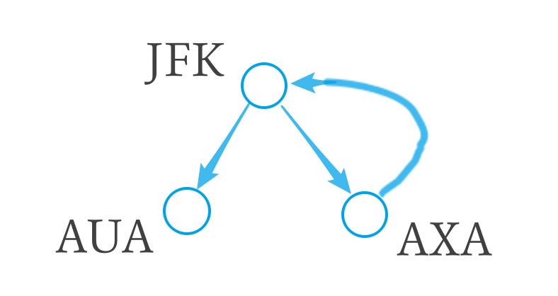

#### **代码:**

```python
from collections import defaultdict

class Solution:
    def findItinerary(self, tickets: List[List[str]]) -> List[str]:
        l = len(tickets)
        dict_t = defaultdict(list)
        for f, t in tickets:
            dict_t[f].append(t)

        stack = ['JFK']  # 初始位置
        ans = []
        while stack:
            curr = stack[-1]  # peek
            if dict_t[curr]:
                next = min(dict_t[curr])
                dict_t[curr].remove(next)
                stack.append(next)
            else:
                ans.append(curr)
                stack.pop()

        return ans[::-1]
      
```

## A336. 回文对

难度 `困难`  

#### 题目描述

给定一组**唯一**的单词， 找出所有**不同** 的索引对`(i, j)`，使得列表中的两个单词， `words[i] + words[j]` ，可拼接成回文串。

> **示例 1:**

```
输入: ["abcd","dcba","lls","s","sssll"]
输出: [[0,1],[1,0],[3,2],[2,4]] 
解释: 可拼接成的回文串为 ["dcbaabcd","abcddcba","slls","llssssll"]
```

> **示例 2:**

```
输入: ["bat","tab","cat"]
输出: [[0,1],[1,0]] 
解释: 可拼接成的回文串为 ["battab","tabbat"]
```

#### 题目链接

<https://leetcode-cn.com/problems/palindrome-pairs/>

#### 思路  

　　有一个隐含的条件是单词的数量**远远大于**单词的长度。  

　　对每一个单词，在它左边或者右边加上一些字母后可以变成回文串，我们来遍历所有能加上的情况。  

　　先将单词`s`反序（记为`r`），然后在原单词上滑动，如下图所示：  

　　

　　如果`r`和`s`没有重叠的部分，或者**重叠的部分相同**，那么就可以组成图中**横线下方**的回文串，查找需要在`s`上添加的部分有没有出现在单词列表中，如果出现了，则记录`s`和它的索引对（注意前后顺序）。  

　　有以下两种特殊的情况需要考虑：  

　　①两个单词互为逆序，如果放在左右添加中会重复计算，所以要单独考虑。    

　　②单词表中有空字符串`""`，则它可以和任意**原本就是回文串**的单词组成回文单词（在前在后都可以）。  

#### 代码  

```python
class Solution:
    def palindromePairs(self, words: List[str]) -> List[List[int]]:
        mem = {word: i for i, word in enumerate(words)}  # 单词到下标的映射
        
        flag = '' in words  # 是否有空串     

        ans = []
        for i, word in enumerate(words):
            reverse = word[::-1]
            l = len(word)
            if flag and word and word == reverse :  # ""和自身回文的串匹配
                ans.append([i, mem['']])
                ans.append([mem[''], i])  # 空串在前在后都可以
                
            if word != reverse and reverse in mem:  # 整体相反 如abcd和dcba
                ans.append([i, mem[reverse]])
            for j in range(1, l):  # 在后面添加
                if reverse[:j] == word[l-j:] and reverse[j:] in mem:
                    ans.append([i, mem[reverse[j:]]])
            for j in range(1, l):  # 在前面添加
                if reverse[l-j:] == word[:j] and reverse[:l-j] in mem:
                    ans.append([mem[reverse[:l-j]], i])
                    
        return ans
      
```


## A337. 打家劫舍 III

难度`中等`

#### 题目描述

在上次打劫完一条街道之后和一圈房屋后，小偷又发现了一个新的可行窃的地区。这个地区只有一个入口，我们称之为“根”。 除了“根”之外，每栋房子有且只有一个“父“房子与之相连。一番侦察之后，聪明的小偷意识到“这个地方的所有房屋的排列类似于一棵二叉树”。 如果两个直接相连的房子在同一天晚上被打劫，房屋将自动报警。

计算在不触动警报的情况下，小偷一晚能够盗取的最高金额。

> **示例 1:**

```
输入: [3,2,3,null,3,null,1]

     3
    / \
   2   3
    \   \ 
     3   1

输出: 7 
解释: 小偷一晚能够盗取的最高金额 = 3 + 3 + 1 = 7.
```

> **示例 2:**

```
输入: [3,4,5,1,3,null,1]

     3
    / \
   4   5
  / \   \ 
 1   3   1

输出: 9
解释: 小偷一晚能够盗取的最高金额 = 4 + 5 = 9.
```

#### 题目链接

<https://leetcode-cn.com/problems/house-robber-iii/>

#### **思路:**

　　对于任意一个结点`node`，只有两种状态，要么偷，要么不偷，分别计算这这种情况的最大值即可。  


　　如果偷结点`node`，就不能偷`node`的子结点，最大值为`not_rob_left`+`not_rob_right`+`node.val`。  

　　如果不偷结点`node`，可以偷`node`的子结点(也可以不偷)，最大值为max(`rob_left`,`not_rob_left`) + max(`rob_right`,`not_rob_right`)。  

#### **代码:**

```python
class Solution:
    def rob(self, root: TreeNode) -> int:
        def dfs(node):  # 返回use not_use
            if not node:
                return 0, 0

            if not node.left and not node.right:  # 叶子结点
                return node.val, 0

            rob_left, no_rob_left = dfs(node.left)
            rob_right, no_rob_right = dfs(node.right)
            
            return no_rob_left + no_rob_right + node.val, max(rob_left, no_rob_left) + max(rob_right, no_rob_right)

        rob_root, no_rob_root = dfs(root)
        return max(rob_root, no_rob_root)
      
```

## A338. 比特位计数

难度 `中等`  
#### 题目描述

给定一个非负整数 **num**。对于 **0 ≤ i ≤ num** 范围中的每个数字 **i** ，计算其二进制数中的 1 的数目并将它们作为数组返回。

> **示例 1:**

```
输入: 2
输出: [0,1,1]
```

> **示例 2:**

```
输入: 5
输出: [0,1,1,2,1,2]
```

**进阶:**

- 给出时间复杂度为**O(n\*sizeof(integer))**的解答非常容易。但你可以在线性时间**O(n)**内用一趟扫描做到吗？
- 要求算法的空间复杂度为**O(n)**。
- 你能进一步完善解法吗？要求在C++或任何其他语言中不使用任何内置函数（如 C++ 中的 **__builtin_popcount**）来执行此操作。

#### 题目链接

<https://leetcode-cn.com/problems/counting-bits/>


#### 思路  

　　**方法一：**先用O(n)的复杂度统计所有偶数的二进制最右边有几个零。`奇数的1个数` = `前一个数的1个数` + 1。`偶数的1个数` = `前一个数的1个数` - `最右边零的个数` + 1 。时间复杂度`O(n)`，但是遍历了两次。  
　　**方法二：**动态规划。`i & (i - 1)`可以去掉i最右边的一个1（如果有），因此 i & (i - 1）是比 i 小的，而且i & (i - 1)的1的个数已经在前面算过了，所以i的1的个数就是 i & (i - 1)的1的个数加上1。  

#### 代码  

　　**方法一**：  

```python

class Solution:
    def countBits(self, num: int) -> List[int]:
        n = num
        helper = [0] * (n+1)  # 记录是2的几次方
        dp = [0] * (n+1)
        order = 2
        while order <= n:
            for i in range(0, n+1, order): helper[i] += 1
            order *= 2
            # 总访问次数为 n-1 次，因此复杂度是O(n)
        
        for i in range(1, num+1):
            if i % 2 == 1:
                dp[i] = dp[i-1] + 1
            else:
                dp[i] = dp[i-1] - helper[i] + 1

        return dp

```

　　**方法二：**

```python
class Solution:
    def countBits(self, num: int) -> List[int]:
        dp = [0] * (num+1)
        for i in range(1, num+1):
            dp[i] = dp[i & (i-1)] + 1

        return dp
```

## A343. 整数拆分

难度 `中等`  
#### 题目描述

给定一个正整数 *n*，将其拆分为**至少**两个正整数的和，并使这些整数的乘积最大化。 返回你可以获得的最大乘积。

> **示例 1:**

```
输入: 2
输出: 1
解释: 2 = 1 + 1, 1 × 1 = 1。
```

> **示例 2:**

```
输入: 10
输出: 36
解释: 10 = 3 + 3 + 4, 3 × 3 × 4 = 36。
```

**说明:** 你可以假设 *n* 不小于 2 且不大于 58。

#### 题目链接

<https://leetcode-cn.com/problems/integer-break/>


#### 思路  

　　动态规划。大于等于5的数拆分后相乘一定比自身大。如 `5 = 2 + 3`，而`2 × 3 = 6 > 5`。    

　　整数`num`可以拆分成两个数 j 和 `num-j`，其中 j 大于等于5。因为 j 比`num`小，j 的拆分结果之前已经计算过了，因此可得转移方程`dp[num] = max(dp[j] * (num - j))`。  

#### 代码  
```python
class Solution:
    dp = [0, 0, 1, 2, 4, 6, 9, 12] + [0] * 55
    for i in range(8, 59):
        for j in range(5, i-1):
            dp[i] = max(dp[i],  dp[j] * (i - j))

    def integerBreak(self, n: int) -> int:
        return self.dp[n]
      
```

## A344. 反转字符串

难度 `简单`  

#### 题目描述

编写一个函数，其作用是将输入的字符串反转过来。输入字符串以字符数组 `char[]` 的形式给出。

不要给另外的数组分配额外的空间，你必须**原地修改输入数组**、使用 O(1) 的额外空间解决这一问题。

你可以假设数组中的所有字符都是 [ASCII](https://baike.baidu.com/item/ASCII) 码表中的可打印字符。

> **示例 1：**

```
输入：["h","e","l","l","o"]
输出：["o","l","l","e","h"]
```

> **示例 2：**

```
输入：["H","a","n","n","a","h"]
输出：["h","a","n","n","a","H"]
```

#### 题目链接

<https://leetcode-cn.com/problems/reverse-string/>

#### 思路  

　　因为要`原地操作`所以不能用`s = s[::-1]`。  

　　遍历到下标的一半，头和尾互换即可。  

#### 代码  

```python
class Solution:
    def reverseString(self, s: List[str]) -> None:
        """
        Do not return anything, modify s in-place instead.
        """
        ls = len(s)
        for i in range(ls//2):
            s[i], s[-i-1] =  s[-i-1], s[i]
            
```


## A345. 反转字符串中的元音字母

难度 `简单`  

#### 题目描述

编写一个函数，以字符串作为输入，反转该字符串中的元音字母。

> **示例 1:**

```
输入: "hello"
输出: "holle"
```

> **示例 2:**

```
输入: "leetcode"
输出: "leotcede"
```

#### 题目链接

<https://leetcode-cn.com/problems/reverse-vowels-of-a-string/>

#### 思路  


　　把元音抠出来，倒序以后再放回去。  

#### 代码  

```python
class Solution:
    def reverseVowels(self, s: str) -> str:
        vowels = 'aeiouAEIOU'
        f = filter(vowels.__contains__ ,s[::-1])  # 筛选出元音并倒序
        t, s = 0, list(s)
        for i, char in enumerate(s):
            if s[i] in vowels:  # 替换回s中的元音
                s[i] = next(f)

        return ''.join(s)
      
```


## A347. 前 K 个高频元素

难度`中等`

#### 题目描述

给定一个非空的整数数组，返回其中出现频率前 **k** 高的元素。

> **示例 1:**

```
输入: nums = [1,1,1,2,2,3], k = 2
输出: [1,2]
```

> **示例 2:**

```
输入: nums = [1], k = 1
输出: [1]
```

**说明：**

- 你可以假设给定的 *k* 总是合理的，且 1 ≤ k ≤ 数组中不相同的元素的个数。
- 你的算法的时间复杂度**必须**优于 O(*n* log *n*) , *n* 是数组的大小。

#### 题目链接

<https://leetcode-cn.com/problems/top-k-frequent-elements/>

#### **思路:**

　　先统计次数，然后排序，输出前`k`个。  

#### **代码:**

```python
from collections import Counter

class Solution:
    def topKFrequent(self, nums: List[int], k: int) -> List[int]:
        c = Counter(nums)
        c = list(c.items())

        c.sort(key=lambda kv: kv[1], reverse=True)
        return [i[0] for i in c[:k]]

```

## A349. 两个数组的交集

难度`简单`

#### 题目描述

给定两个数组，编写一个函数来计算它们的交集。

> **示例 1:**

```
输入: nums1 = [1,2,2,1], nums2 = [2,2]
输出: [2]
```

> **示例 2:**

```
输入: nums1 = [4,9,5], nums2 = [9,4,9,8,4]
输出: [9,4]
```

**说明:**

- 输出结果中的每个元素一定是唯一的。
- 我们可以不考虑输出结果的顺序。

#### 题目链接

<https://leetcode-cn.com/problems/intersection-of-two-arrays/>

#### **思路:**

　　用`set`自带的`&`运算符取交集。  　　　　

#### **代码:**

```python
class Solution:
    def intersection(self, nums1: List[int], nums2: List[int]) -> List[int]:
        return list(set(nums1) & set(nums2))
      
```

## A350. 两个数组的交集 II

难度`简单`

#### 题目描述

给定两个数组，编写一个函数来计算它们的交集。

> **示例 1:**

```
输入: nums1 = [1,2,2,1], nums2 = [2,2]
输出: [2,2]
```

> **示例 2:**

```
输入: nums1 = [4,9,5], nums2 = [9,4,9,8,4]
输出: [4,9]
```

**说明：**

- 输出结果中每个元素出现的次数，应与元素在两个数组中出现的次数一致。
- 我们可以不考虑输出结果的顺序。

**进阶:**

- 如果给定的数组已经排好序呢？你将如何优化你的算法？
- 如果 *nums1* 的大小比 *nums2* 小很多，哪种方法更优？
- 如果 *nums2* 的元素存储在磁盘上，磁盘内存是有限的，并且你不能一次加载所有的元素到内存中，你该怎么办？

#### 题目链接

<https://leetcode-cn.com/problems/intersection-of-two-arrays-ii/>

#### **思路:**

　　先取两个数组的交集`inter`，然后每个元素都重复`nums1`和`nums2`中出现次数较少的次数。  

#### **代码:**

```python
class Solution:
    def intersect(self, nums1: List[int], nums2: List[int]) -> List[int]:
        import collections
        c1 = collections.Counter(nums1)
        c2 = collections.Counter(nums2)
        ans = []
        for k in set(c1.keys()) & set(c2.keys()):
            for _ in range(min(c1[k], c2[k])):
                ans.append(k)

        return ans
      
```

## A352. 将数据流变为多个不相交区间

难度`困难`

#### 题目描述

给定一个非负整数的数据流输入 a1，a2，…，an，…，将到目前为止看到的数字总结为不相交的区间列表。

例如，假设数据流中的整数为 1，3，7，2，6，…，每次的总结为：

```
[1, 1]
[1, 1], [3, 3]
[1, 1], [3, 3], [7, 7]
[1, 3], [7, 7]
[1, 3], [6, 7]
```

**进阶：**
如果有很多合并，并且与数据流的大小相比，不相交区间的数量很小，该怎么办?

**提示：**
特别感谢 [@yunhong](https://discuss.leetcode.com/user/yunhong) 提供了本问题和其测试用例。

#### 题目链接

<https://leetcode-cn.com/problems/data-stream-as-disjoint-intervals/>

#### **思路:**

　　维护一个升序的**不重复的**数组，每次增加新数字时都添加到对应位置。获取`区间总结`时，遍历该数组，将连续出现的数字合并。  

　　也可以用[A57. 插入区间](/array?id=a57-插入区间)的算法。  

#### **代码:**

```python
import bisect

class SummaryRanges:

    def __init__(self):
        """
        Initialize your data structure here.
        """
        self.asc = []
        self.shown = set()

    def addNum(self, val: int) -> None:
        if val not in self.shown:
            self.shown.add(val)
            bisect.insort_left(self.asc, val)

    def getIntervals(self) -> List[List[int]]:
        asc = self.asc
        if not len(asc): return []
        temp = asc[0]
        ans = []
        start = asc[0]
        for i in range(1, len(self.asc)):
            if self.asc[i] == temp + 1:
                temp += 1
            else:
                ans.append([start, temp])
                start = self.asc[i]
                temp = start

        ans.append([start, temp])
        return ans
      
```

## A354. 俄罗斯套娃信封问题

难度 `困难`  
#### 题目描述

给定一些标记了宽度和高度的信封，宽度和高度以整数对形式 `(w, h)` 出现。当另一个信封的宽度和高度都比这个信封大的时候，这个信封就可以放进另一个信封里，如同俄罗斯套娃一样。

请计算最多能有多少个信封能组成一组“俄罗斯套娃”信封（即可以把一个信封放到另一个信封里面）。

**说明:**
不允许旋转信封。

> **示例:**

```
输入: envelopes = [[5,4],[6,4],[6,7],[2,3]]
输出: 3 
解释: 最多信封的个数为 3, 组合为: [2,3] => [5,4] => [6,7]。
```

#### 题目链接

<https://leetcode-cn.com/problems/russian-doll-envelopes/>


#### 思路  

　　将信封按`(宽升序、高降序)`排列。因为宽已经有序了，将所有的高依次取出来组成一个数组，就变成了[A300. 最长上升子序列](/dp?id=a300-最长上升子序列)问题。  
　　**方法一：**动态规划，查找每个信封前面的所有信封，如果某一个`信封j`的宽和高都小于当前信封，那么`dp[now] = max(dp[now], dp[j] + 1)`。时间复杂度`O(n^2)` 。  
　　**方法二：**维护一个`升序的`结果数组`results`。如果`num`大于结果数组中的所有元素，就将`num`插入到结果数组的最后。否则用`num`替换`results`中第一个大于等于`num`的数。  
　　最终`results`的长度即为结果。复杂度为`O(nlogn)`。  

#### 代码  

　　**方法一：**`O(n^2)`（超时）

```python
class Solution:
    def maxEnvelopes(self, envelopes: List[List[int]]) -> int:
        n = len(envelopes)
        if not n: return 0

        envelopes = sorted(envelopes)
        dp = [1] * n

        ans = 1
        for i in range(1, n):
            w, h = envelopes[i]
            for j in range(i):
                w0, h0 = envelopes[j]
                if w0 < w and h0 < h:
                    dp[i] = max(dp[i], dp[j] + 1)

            ans = max(ans, dp[i])

        return ans

```

　　**方法二：**`O(nlogn)`

```python
from bisect import bisect_left
class Solution:
    def lengthOfLIS(self, nums: List[int]) -> int:
        if len(nums) == 0:
            return 0

        results = []
        for num in nums:
            if len(results) == 0 or num > results[-1]:
                results.append(num)
            else:
                idx = bisect_left(results, num)
                results[idx] = num

        return len(results)

    def maxEnvelopes(self, envelopes: List[List[int]]) -> int:
        n = len(envelopes)
        if not n: return 0

        envelopes = sorted(envelopes, key=lambda kv: (kv[0], -kv[1]))   
        nums =  [num for _, num in envelopes]
        return self.lengthOfLIS(nums)


```

## A357. 计算各个位数不同的数字个数

难度 `中等`  
#### 题目描述

给定一个**非负**整数 n，计算各位数字都不同的数字 x 的个数，其中 0 ≤ x < 10n 。

> **示例:**

```
输入: 2
输出: 91 
解释: 答案应为除去 11,22,33,44,55,66,77,88,99 外，在 [0,100) 区间内的所有数字。
```

#### 题目链接

<https://leetcode-cn.com/problems/count-numbers-with-unique-digits/>


#### 思路  

　　排列组合问题。  

```
从左往右
首位数可以取9种(除了0以外都能取)，第二位也能取9中(和第一位不同或者取0) 第三位取8种(和前两位都不同) 下一位比前一位取法少一种，因为不能重复。
0有     1 种
一位数有 9 种
两位数有 9*9 种
三位数有 9*9*8 种
四位数有 9*9*8*7 种
五位数有 9*9*8*7*6 种
.....
超过10位数一种也没有
```

#### 代码  
```python
class Solution:
    def countNumbersWithUniqueDigits(self, n: int) -> int:
        multiply = lambda x, y: x * y
        dp = [1 for i in range(11)]
        dp[1] = 10
        for i in range(2, 11):
            dp[i] = 9 * reduce(multiply, range(9, 10-i, -1)) + dp[i-1]  # 累乘

        n = min(10, n)
        return dp[n]

```

## A367. 有效的完全平方数

难度`简单`

#### 题目描述

给定一个正整数 *num* ，编写一个函数，如果 *num* 是一个完全平方数，则返回 True，否则返回 False。

**说明：**不要使用任何内置的库函数，如  `sqrt`。

> **示例 1：**

```
输入：16
输出：True
```

> **示例 2：**

```
输入：14
输出：False
```

#### 题目链接

<https://leetcode-cn.com/problems/valid-perfect-square/>

#### **思路:**

　　**方法一：**利用[A69. x 的平方根](/binary?id=a69-x-的平方根)的二分法求平方根。  

　　**方法二：**利用 1+3+5+7+9+…+(2n-1)=n^2，即完全平方数肯定是前n个连续奇数的和。  

#### **代码:**

　　**方法一：**

```python
class Solution:
    def mySqrt(self, x: int) -> int:
        if x == 0: return 0
        if x < 4: return 1

        i, j = 2, x - 1
        while i <= i and i < x-1:
            mid = (i+j) // 2
            if mid * mid > x:
                j = mid - 1
            elif mid * mid <= x and (mid + 1) ** 2 > x:
                return mid
            else:
                i = mid + 1

    def isPerfectSquare(self, num: int) -> bool:
        return (self.mySqrt(num) ** 2 == num)
      
```

　　**方法二：**

```python
class Solution:
    def isPerfectSquare(self, num: int) -> bool:
        i = 1
        while num > 0:
            num -= i
            i += 2
        return num == 0
      
```

#### [1283. 使结果不超过阈值的最小除数](https://leetcode-cn.com/problems/find-the-smallest-divisor-given-a-threshold/)

难度中等16收藏分享切换为英文关注反馈

给你一个整数数组 `nums` 和一个正整数 `threshold`  ，你需要选择一个正整数作为除数，然后将数组里每个数都除以它，并对除法结果求和。

请你找出能够使上述结果小于等于阈值 `threshold` 的除数中 **最小** 的那个。

每个数除以除数后都向上取整，比方说 7/3 = 3 ， 10/2 = 5 。

题目保证一定有解。

 

**示例 1：**

```
输入：nums = [1,2,5,9], threshold = 6
输出：5
解释：如果除数为 1 ，我们可以得到和为 17 （1+2+5+9）。
如果除数为 4 ，我们可以得到和为 7 (1+1+2+3) 。如果除数为 5 ，和为 5 (1+1+1+2)。
```

**示例 2：**

```
输入：nums = [2,3,5,7,11], threshold = 11
输出：3
```

**示例 3：**

```
输入：nums = [19], threshold = 5
输出：4
```

 

**提示：**

- `1 <= nums.length <= 5 * 10^4`
- `1 <= nums[i] <= 10^6`
- `nums.length <= threshold <= 10^6`

## A368. 最大整除子集

难度 `中等`  
#### 题目描述

给出一个由**无重复的**正整数组成的集合，找出其中最大的整除子集，子集中任意一对 (Si，Sj) 都要满足：Si % Sj = 0 或 Sj % Si = 0。

如果有多个目标子集，返回其中任何一个均可。

> **示例 1:**

```
输入: [1,2,3]
输出: [1,2] (当然, [1,3] 也正确)
```

> **示例 2:**

```
输入: [1,2,4,8]
输出: [1,2,4,8]
```

#### 题目链接

<https://leetcode-cn.com/problems/largest-divisible-subset/>


#### 思路  


　　动态规划。先排序，然后在每个数的前面找它的因子即可。状态转移方程 `dp[now] = max(dp[now], dp[j] + 1)`。其中 j 位置的数字是当前数字的因子。  

#### 代码  
```python
import bisect
class Solution:
    def largestDivisibleSubset(self, nums: List[int]) -> List[int]:
        n = len(nums)
        if not n: return []

        dp = [1 for i in range(n)]
        previous = [0 for i in range(n)]  # 记录是前一个因子
        nums = sorted(nums)

        max_i = 0
        max_n = 1
        for i in range(1, n):
            start = bisect.bisect(nums, nums[i] // 2)
            for j in range(start-1, -1, -1):
                if nums[i] % nums[j] == 0:
                    if dp[i] < dp[j] + 1:
                        dp[i] = dp[j] + 1
                        previous[i] = j

            if dp[i] > max_n:
                max_n = dp[i]
                max_i = i

        ans = []
        for i in range(max_n):
            ans.append(nums[max_i])
            max_i = previous[max_i]
        return ans

```

## A375. 猜数字大小 II

难度 `中等`  

#### 题目描述

我们正在玩一个猜数游戏，游戏规则如下：

我从 **1** 到 **n** 之间选择一个数字，你来猜我选了哪个数字。

每次你猜错了，我都会告诉你，我选的数字比你的大了或者小了。

然而，当你猜了数字 x 并且猜错了的时候，你需要支付金额为 x 的现金。直到你猜到我选的数字，你才算赢得了这个游戏。

> **示例:**

```
n = 10, 我选择了8.

第一轮: 你猜我选择的数字是5，我会告诉你，我的数字更大一些，然后你需要支付5块。
第二轮: 你猜是7，我告诉你，我的数字更大一些，你支付7块。
第三轮: 你猜是9，我告诉你，我的数字更小一些，你支付9块。

游戏结束。8 就是我选的数字。

你最终要支付 5 + 7 + 9 = 21 块钱。
```

给定 **n ≥ 1，**计算你至少需要拥有多少现金才能确保你能赢得这个游戏。

#### 题目链接

<https://leetcode-cn.com/problems/guess-number-higher-or-lower-ii/>

#### 思路  

　　类似矩阵连乘问题。最小消耗的选择方法如下图所示：  

　

　　n个数时，选择`k`的总消耗为`k + max(dp(1, k-1), dp(k+1, n))`。遍历`(n+1)//`到`n-3`，找到消耗最小的`k`即可。  

　　本以为这个复杂度必超时，没想到击败了96%（测试集的n是一个很小的数，不会超过几百）。  

#### 代码  

```python
class Solution:
    def getMoneyAmount(self, n: int) -> int:
        ans = 0
        from functools import lru_cache
        @lru_cache(None)
        def dfs(i, j):
            if i == j: return 0
            if 1 <= j - i <= 2:
                return j - 1
            if 3 <= j - i <= 4:
                return j - 1 + j - 3

            mid = (i+j)//2
            ans = float('inf')
            for k in range(mid, j-2):
                ans = min(ans, k + max(dfs(i, k-1), dfs(k+1, j)))

            return ans

        ans = dfs(1, n)
        return ans
```

## A376. 摆动序列

难度 `中等`  

#### 题目描述

如果连续数字之间的差严格地在正数和负数之间交替，则数字序列称为**摆动序列。**第一个差（如果存在的话）可能是正数或负数。少于两个元素的序列也是摆动序列。

例如， `[1,7,4,9,2,5]` 是一个摆动序列，因为差值 `(6,-3,5,-7,3)` 是正负交替出现的。相反, `[1,4,7,2,5]` 和 `[1,7,4,5,5]` 不是摆动序列，第一个序列是因为它的前两个差值都是正数，第二个序列是因为它的最后一个差值为零。

给定一个整数序列，返回作为摆动序列的最长子序列的长度。 通过从原始序列中删除一些（也可以不删除）元素来获得子序列，剩下的元素保持其原始顺序。

> **示例 1:**

```
输入: [1,7,4,9,2,5]
输出: 6 
解释: 整个序列均为摆动序列。
```

> **示例 2:**

```
输入: [1,17,5,10,13,15,10,5,16,8]
输出: 7
解释: 这个序列包含几个长度为 7 摆动序列，其中一个可为[1,17,10,13,10,16,8]。
```

> **示例 3:**

```
输入: [1,2,3,4,5,6,7,8,9]
输出: 2
```

**进阶:**
你能否用 O(*n*) 时间复杂度完成此题?

#### 题目链接

<https://leetcode-cn.com/problems/wiggle-subsequence/>

#### 思路  

　　动态规划+双重转移方程。  

　　如果一个数大于它前面一个数，那么有两种选择：1、原来是上升的，继续上升，即`asc[i] = asc[i-1]`；2、原来是下降的，摆动变为上升，即`asc[i] = dsc[i-1] + 1`。用这两种选择中较大的值作为`asc[i]`更新后的数值。  

　　因为只进一次遍历，时间复杂度为`O(n)`。  

#### 代码  

```python
class Solution:
    def wiggleMaxLength(self, nums: List[int]) -> int:
        n = len(nums)
        if n <= 1: return n
        # [4,9,2,1,5,6]
        asc = [1 for i in range(n)]  # 上升
        dsc = [1 for i in range(n)]  # 下降  

        for i in range(1, n):
            if nums[i] > nums[i-1]:
                asc[i] = max(asc[i-1], dsc[i-1] + 1)  # 要么选择摆动 要么选择继续上升
            elif nums[i] < nums[i-1]:
                dsc[i] = max(dsc[i-1], asc[i-1] + 1)
            else:
                asc[i] = asc[i-1]
                dsc[i] = dsc[i-1]
                
        return max(asc[-1], dsc[-1])
      
```

## A377. 组合总和 Ⅳ

难度 `中等`  

#### 题目描述

给定一个由正整数组成且不存在重复数字的数组，找出和为给定目标正整数的组合的个数。

> **示例:**

```
nums = [1, 2, 3]
target = 4

所有可能的组合为：
(1, 1, 1, 1)
(1, 1, 2)
(1, 2, 1)
(1, 3)
(2, 1, 1)
(2, 2)
(3, 1)

请注意，顺序不同的序列被视作不同的组合。

因此输出为 7。
```

**进阶：**
如果给定的数组中含有负数会怎么样？
问题会产生什么变化？
我们需要在题目中添加什么限制来允许负数的出现？

#### 题目链接

<https://leetcode-cn.com/problems/combination-sum-iv/>

#### 思路  

　　类似于背包🎒问题。  

　　1. 如果所有`target - nums[i]`能组成的组合总数都已知，那么`target`能组成的组合总数就是它们的和。  

　　2. 为方便计算，0能组成的组合总数是1。  

　　状态转移方程：`dp(n) = sum(dp(n - nums[i])`。  

#### 代码  

　　**自顶向下：**  

```python
class Solution:
    def combinationSum4(self, nums: List[int], target: int) -> int:

        from functools import lru_cache
        @lru_cache(None)
        def dp(n):
            if n == 0: return 1
            if n < 0: return 0
            return sum([dp(n - num) for num in nums])

        return dp(target)
```

　　**自底向上：**

```python
class Solution:
    def combinationSum4(self, nums: List[int], target: int) -> int:

        dp = [0] * (target + 1)
        dp[0] = 1
        for i in range(1, target + 1):
            for num in nums:
                if i - num >= 0:
                    dp[i] += dp[i-num]

        # print(dp)
        return dp[target]
```

## A383. 赎金信

难度 `简单`  

#### 题目描述

给定一个赎金信 (ransom) 字符串和一个杂志(magazine)字符串，判断第一个字符串ransom能不能由第二个字符串magazines里面的字符构成。如果可以构成，返回 true ；否则返回 false。

(题目说明：为了不暴露赎金信字迹，要从杂志上搜索各个需要的字母，组成单词来表达意思。)

**注意：**

你可以假设两个字符串均只含有小写字母。

```
canConstruct("a", "b") -> false
canConstruct("aa", "ab") -> false
canConstruct("aa", "aab") -> true
```

#### 题目链接

<https://leetcode-cn.com/problems/ransom-note/>

#### 思路  

　　题目描述说的花里胡哨的，其实关键就是**判断第一个字符串ransom能不能由第二个字符串magazines里面的字符构成**。  

　　将两个字符串的字符分别计数，如果`ransomNote`中某个字符出现次数比`magazines`多，则返回`False`。  

#### 代码  

```python
import collections

class Solution:
    def canConstruct(self, ransomNote: str, magazine: str) -> bool:
        r = collections.Counter(ransomNote)
        m = collections.Counter(magazine)
        for char in r:
            if char not in m or m[char] < r[char]:
                return False
        return True
      
```


## A385. 迷你语法分析器

难度 `中等`  

#### 题目描述

给定一个用字符串表示的整数的嵌套列表，实现一个解析它的语法分析器。

列表中的每个元素只可能是整数或整数嵌套列表

**提示：**你可以假定这些字符串都是格式良好的：

- 字符串非空
- 字符串不包含空格
- 字符串只包含数字`0-9`, `[`, `-` `,`, `]` 

> **示例 1：**

```
给定 s = "324",

你应该返回一个 NestedInteger 对象，其中只包含整数值 324。
```

> **示例 2：**

```
给定 s = "[123,[456,[789]]]",

返回一个 NestedInteger 对象包含一个有两个元素的嵌套列表：

1. 一个 integer 包含值 123
2. 一个包含两个元素的嵌套列表：
    i.  一个 integer 包含值 456
    ii. 一个包含一个元素的嵌套列表
         a. 一个 integer 包含值 789
```

#### 题目链接

<https://leetcode-cn.com/problems/mini-parser/>

#### 思路  

　　递归。  

　　由于字符串是`良好`的，因此判断起来就十分方便了：  

- 开头不为`"["`的，要么为纯数字，要么为空。  
- 不是纯数字的两边一定为`"[]"`。  

　　去掉两边的`"[]"`，对中间的部分进行`split`。由于中间部分可能有嵌套，因此不能直接分割。先计算每个逗号嵌套的深度(遇到`"["`则+1，`"]"`则-1)，将最外侧的逗号都替换成分号`";"`，再按分号分割以后就可以递归了。  

#### 代码  

```python
class Solution:
    def deserialize(self, s: str) -> NestedInteger:

        if s and not s.startswith('['):  # 单独的整数
            return NestedInteger(int(s))

        ans = NestedInteger()
        strip = s[1: -1]  # 去掉中括号
        if not strip:  # 为空
            return ans

        count = 0
        strip_list = list(strip)
        for i, c in enumerate(strip_list):
            if c == '[': count += 1
            if c == ']': count -= 1
            if c == ',' and count == 0:
                strip_list[i] = ';'  # 分号是可以split的
        
        strip = ''.join(strip_list)
        elements = strip.split(';')
        for elem in elements:
            ans.add(self.deserialize(elem))
        return ans
      
```


## A386. 字典序排数

难度`中等`

#### 题目描述

给定一个整数 *n*, 返回从 *1* 到 *n* 的字典顺序。

例如，

给定 *n* =13，返回 [1,10,11,12,13,2,3,4,5,6,7,8,9] 。

请尽可能的优化算法的时间复杂度和空间复杂度。 输入的数据 *n* 小于等于 5,000,000。

#### 题目链接

<https://leetcode-cn.com/problems/lexicographical-numbers/>

#### **思路:**

　　可以用dfs，也可以用python自带的排序，用转换成字符串以后的类型作为key。  

#### **代码:**

```python
class Solution:
    def lexicalOrder(self, n: int) -> List[int]:
        ans = []
        def dfs(x):
            nonlocal n
            if x <= n:
                ans.append(x)
            else:
                return

            x = x * 10
            for i in range(10):
                dfs(x+i)

        for i in range(1, 10):
            dfs(i)

        return ans     

```


## A387. 字符串中的第一个唯一字符

难度 `简单` 

#### 题目描述

给定一个字符串，找到它的第一个不重复的字符，并返回它的索引。如果不存在，则返回 -1。

> **案例:**

```
s = "leetcode"
返回 0.

s = "loveleetcode",
返回 2.
```

#### 题目链接

<https://leetcode-cn.com/problems/first-unique-character-in-a-string/>

#### 思路  


　　先统计次数，然后返回次数为`1`的。  

#### 代码  

```python
class Solution:
    def firstUniqChar(self, s: str) -> int:
        dict = {a: s.count(a) for a in string.ascii_lowercase}
        for i, char in enumerate(s):
            if dict[char] == 1:
                return i
        return -1
```

## A388. 文件的最长绝对路径

难度`中等`

#### 题目描述

假设我们以下述方式将我们的文件系统抽象成一个字符串:

字符串 `"dir\n\tsubdir1\n\tsubdir2\n\t\tfile.ext"` 表示:

```
dir
    subdir1
    subdir2
        file.ext
```

目录 `dir` 包含一个空的子目录 `subdir1` 和一个包含一个文件 `file.ext` 的子目录 `subdir2` 。

字符串 `"dir\n\tsubdir1\n\t\tfile1.ext\n\t\tsubsubdir1\n\tsubdir2\n\t\tsubsubdir2\n\t\t\tfile2.ext"` 表示:

```
dir
    subdir1
        file1.ext
        subsubdir1
    subdir2
        subsubdir2
            file2.ext
```

目录 `dir` 包含两个子目录 `subdir1` 和 `subdir2`。 `subdir1` 包含一个文件 `file1.ext` 和一个空的二级子目录 `subsubdir1`。`subdir2` 包含一个二级子目录 `subsubdir2` ，其中包含一个文件 `file2.ext`。

我们致力于寻找我们文件系统中文件的最长 (按字符的数量统计) 绝对路径。例如，在上述的第二个例子中，最长路径为 `"dir/subdir2/subsubdir2/file2.ext"`，其长度为 `32` (不包含双引号)。

给定一个以上述格式表示文件系统的字符串，返回文件系统中文件的最长绝对路径的长度。 如果系统中没有文件，返回 `0`。

**说明:**

- 文件名至少存在一个 `.` 和一个扩展名。
- 目录或者子目录的名字不能包含 `.`。

要求时间复杂度为 `O(n)` ，其中 `n` 是输入字符串的大小。

请注意，如果存在路径 `aaaaaaaaaaaaaaaaaaaaa/sth.png` 的话，那么  `a/aa/aaa/file1.txt` 就不是一个最长的路径。

#### 题目链接

<https://leetcode-cn.com/problems/longest-absolute-file-path/>

#### **思路:**

　　注意是只统计**文件**的长度，不包括文件夹；可以通过统计`\t`的个数来判断层级。  

　　用一个栈来维护当前的路径，当层级`+1`时入栈，层级不变时先出栈后入栈，层级`-n`时连续出栈`n+1`后入栈。  

#### **代码:**

```python
class Solution:
    def lengthLongestPath(self, input: str) -> int:
        if not input:
            return 0

        files = input.split('\n')
        stack = []
        length = 0
        ans = 0
        for i in range(len(files)):
            if i == 0:  # 根目录
                length += len(files[0])
                stack.append(len(files[0]))
                if '.' in files[0]:
                    ans = max(ans, length)
            else:
                level1 = files[i-1].count('\t')
                level2 = files[i].count('\t')
                file = files[i].lstrip('\t')
                if level2 - level1 == 1:  # 前进1级
                    # length += len(files[i])
                    stack.append(len(file))
                    if '.' in files[i]:
                        ans = max(ans, sum(stack) + len(stack) - 1)
                elif level2 == level1:  # 同级
                    stack.pop()
                    stack.append(len(file))
                    if '.' in files[i]:
                        ans = max(ans, sum(stack) + len(stack) - 1)
                else:  # 后退level1 - level2级
                    for _ in range(level1 - level2):
                        stack.pop()

                    stack.pop()
                    stack.append(len(file))
                    if '.' in files[i]:
                        ans = max(ans, sum(stack) + len(stack) - 1)
        return ans

```

## A392. 判断子序列

难度 `简单`  

#### 题目描述

给定字符串 **s** 和 **t** ，判断 **s** 是否为 **t** 的子序列。

你可以认为 **s** 和 **t** 中仅包含英文小写字母。字符串 **t** 可能会很长（长度 ~= 500,000），而 **s** 是个短字符串（长度 <=100）。

字符串的一个子序列是原始字符串删除一些（也可以不删除）字符而不改变剩余字符相对位置形成的新字符串。（例如，`"ace"`是`"abcde"`的一个子序列，而`"aec"`不是）。

> **示例 1:**  

**s** = `"abc"`, **t** = `"ahbgdc"`

返回 `true`.

> **示例 2:**  

**s** = `"axc"`, **t** = `"ahbgdc"`

返回 `false`.

**后续挑战** **:**

如果有大量输入的 S，称作S1, S2, ... , Sk 其中 k >= 10亿，你需要依次检查它们是否为 T 的子序列。在这种情况下，你会怎样改变代码？

#### 题目链接

<https://leetcode-cn.com/problems/is-subsequence/>

#### 思路  

　　如果`s是t的子序列`，也就是说`s`中的所有字符都会按照顺序出现在`t`中，因此，使用双指针的方式实现。  

#### 代码  

　　**写法一：**

```python
class Solution:
    def isSubsequence(self, s: str, t: str) -> bool:
        ls, lt =  len(s), len(t)
        if not ls: return True
        if not lt: return False
        id_s = 0
        id_t = 0
        while id_t < lt:
            if t[id_t] == s[id_s]:
                id_s += 1
                if id_s >= ls:
                    return True
            id_t += 1

        # print(lt)
        return False
```

　　**写法二：**  

```python
class Solution(object):
    def isSubsequence(self, s, t):
        """
        :type a: str
        :type b: str
        :rtype: bool
        """
        t = iter(t)
        return all(i in t for i in s)

```

## A394. 字符串解码

难度`中等`

#### 题目描述

给定一个经过编码的字符串，返回它解码后的字符串。

编码规则为: `k[encoded_string]`，表示其中方括号内部的 *encoded_string* 正好重复 *k* 次。注意 *k* 保证为正整数。

你可以认为输入字符串总是有效的；输入字符串中没有额外的空格，且输入的方括号总是符合格式要求的。

此外，你可以认为原始数据不包含数字，所有的数字只表示重复的次数 *k* ，例如不会出现像 `3a` 或 `2[4]` 的输入。

> **示例 1：**

```
输入：s = "3[a]2[bc]"
输出："aaabcbc"
```

> **示例 2：**

```
输入：s = "3[a2[c]]"
输出："accaccacc"
```

> **示例 3：**

```
输入：s = "2[abc]3[cd]ef"
输出："abcabccdcdcdef"
```

> **示例 4：**

```
输入：s = "abc3[cd]xyz"
输出："abccdcdcdxyz"
```

#### 题目链接

<https://leetcode-cn.com/problems/decode-string/>

#### **思路:**

　　可以递归地来处理这个问题。第一层递归处理最外面一层中括号，第二层递归处理里面一层的中括号，以此类推。  

#### **代码:**

```python
class Solution:
    def decodeString(self, s: str) -> str:
        #  k[]
        times = 0
        stack = []
        ans = ''
        for i, char in enumerate(s):
            if char.isdigit():
                if not stack:  # 最外层
                    times = times * 10 + int(char)
            elif char == '[':
                stack.append(i)
            elif char == ']':
                top = stack.pop()
                if not stack:
                    ans += times * self.decodeString(s[top+1: i])  # 递归
                    times = 0
                    # print(top, i)
            else:
                if not stack:  # 最外层
                    ans += char

        return ans

```

## A397. 整数替换

难度`中等`

#### 题目描述

给定一个正整数 *n*，你可以做如下操作：

\1. 如果 *n* 是偶数，则用 `n / 2`替换 *n*。
\2. 如果 *n* 是奇数，则可以用 `n + 1`或`n - 1`替换 *n*。
*n* 变为 1 所需的最小替换次数是多少？

> **示例 1:**

```
输入:
8

输出:
3

解释:
8 -> 4 -> 2 -> 1
```

> **示例 2:**

```
输入:
7

输出:
4

解释:
7 -> 8 -> 4 -> 2 -> 1
或
7 -> 6 -> 3 -> 2 -> 1
```

#### 题目链接

<https://leetcode-cn.com/problems/integer-replacement/>

#### **思路:**

　　 因为要以**最短的替换次数**到达1，相当于边权为1的最短路径问题(每次替换都只占用1次次数)，使用bfs。  

#### **代码:**

```python
class Solution:
    def integerReplacement(self, n: int) -> int:
        visited = defaultdict(bool)
        queue = [n]  # 开始的位置
        visited[n] = True
        depth = 0

        while queue:
            for q in queue:
                if q == 1:
                    return depth  # 到达终点的条件

            depth += 1
            temp = []
            for q in queue:
                neibours = []
                if q % 2 == 0:
                    neibours = [q//2]
                else:
                    neibours = [q+1, q-1]

                for neibour in neibours:  # 所有相邻的路径
                    if not visited[neibour]:
                        if neibour not in temp:
                            visited[neibour] = True
                            temp.append(neibour)

            queue = temp
```

## A402. 移掉K位数字

难度`中等`

#### 题目描述

给定一个以字符串表示的非负整数 *num* ，移除这个数中的 *k* 位数字，使得剩下的数字最小。

**注意:**

- *num* 的长度小于 10002 且 ≥ *k。*
- *num* 不会包含任何前导零。

> **示例 1 :**

```
输入: num = "1432219", k = 3
输出: "1219"
解释: 移除掉三个数字 4, 3, 和 2 形成一个新的最小的数字 1219。
```

> **示例 2 :**

```
输入: num = "10200", k = 1
输出: "200"
解释: 移掉首位的 1 剩下的数字为 200. 注意输出不能有任何前导零。
```

示例 **3 :**

```
输入: num = "10", k = 2
输出: "0"
解释: 从原数字移除所有的数字，剩余为空就是0。
```


#### 题目链接

<https://leetcode-cn.com/problems/remove-k-digits/>

#### **思路:**


　　找到`num`的前`k+1`位中最小的，把它留下来作为结果的首位。将它前面的数字(假设有`a`个)**全部删除**；对它后面的数字继续计算移除`k-a`个数字能够得到的最小的数，递归地求解即可。  

#### **代码:**

```python
class Solution:
    def helper(self, num, k):
        if k == 0:
            return num

        ln = len(num)
        if ln == k:
            return ''

        first = min(num[:k+1])  # 结果最小的首位数字
        a = num.index(first)
        return first + self.helper(num[a+1:], k - a)

    def removeKdigits(self, num: str, k: int) -> str:
        ans = self.helper(num, k)

        ans = ans.lstrip('0')  # 去除前导0
        if not ans:
            ans = '0'
        return ans

```

## A403. 青蛙过河

难度 `困难`  

#### 题目描述

一只青蛙想要过河。 假定河流被等分为 x 个单元格，并且在每一个单元格内都有可能放有一石子（也有可能没有）。 青蛙可以跳上石头，但是不可以跳入水中。

给定石子的位置列表（用单元格序号升序表示）， **请判定青蛙能否成功过河**（即能否在最后一步跳至最后一个石子上）。 开始时， 青蛙默认已站在第一个石子上，并可以假定它第一步只能跳跃一个单位（即只能从单元格1跳至单元格2）。

如果青蛙上一步跳跃了 *k* 个单位，那么它接下来的跳跃距离只能选择为 *k - 1*、*k* 或 *k + 1*个单位。 另请注意，青蛙只能向前方（终点的方向）跳跃。

**请注意：**

- 石子的数量 ≥ 2 且 < 1100；
- 每一个石子的位置序号都是一个非负整数，且其 < 231；
- 第一个石子的位置永远是0。

> **示例 1:**

```
[0,1,3,5,6,8,12,17]

总共有8个石子。
第一个石子处于序号为0的单元格的位置, 第二个石子处于序号为1的单元格的位置,
第三个石子在序号为3的单元格的位置， 以此定义整个数组...
最后一个石子处于序号为17的单元格的位置。

返回 true。即青蛙可以成功过河，按照如下方案跳跃： 
跳1个单位到第2块石子, 然后跳2个单位到第3块石子, 接着 
跳2个单位到第4块石子, 然后跳3个单位到第6块石子, 
跳4个单位到第7块石子, 最后，跳5个单位到第8个石子（即最后一块石子）。
```

> **示例 2:**

```
[0,1,2,3,4,8,9,11]

返回 false。青蛙没有办法过河。 
这是因为第5和第6个石子之间的间距太大，没有可选的方案供青蛙跳跃过去。
```

#### 题目链接

<https://leetcode-cn.com/problems/frog-jump/>

#### 思路  

　　标准的动态规划。先遍历一遍`stones`，用一个集合`set`记录哪些位置出现过。  

　　从每个当前位置`n`都尝试跳`k-1`、`k`、`k+1`个单位，如果能落在`set`中出现过的位置，则继续递归，否则返回。  

　　用`记忆数组`或者`lru缓存`记录已经计算过的`(n, k)`的组合，避免重复计算。  

#### 代码  

```python
sys.setrecursionlimit(100000)
class Solution:
    def canCross(self, stones: List[int]) -> bool:
        dict = {stone: i for i, stone in enumerate(stones)}
        # print(dict)
        ls = len(stones)

        from functools import lru_cache
        @lru_cache(None)
        def jump(n, k):  # 从下标n 跳k个单位
            if k <= 0: return False  # 避免原地跳和向后跳
            to = stones[n] + k

            land = dict.get(to)  # 落地的下标
            if land is None: return False  # 避免跳到水里

            if land == ls - 1: return True  # 落在最后一块石子，返回

            if jump(land, k - 1) or jump(land, k) or jump(land, k + 1):
                return True

            return False

        return jump(0, 1)
```

## A406. 根据身高重建队列

难度`中等`

#### 题目描述

假设有打乱顺序的一群人站成一个队列。 每个人由一个整数对`(h, k)`表示，其中`h`是这个人的身高，`k`是排在这个人前面且身高大于或等于`h`的人数。 编写一个算法来重建这个队列。

**注意：**
总人数少于1100人。

> **示例**

```
输入:
[[7,0], [4,4], [7,1], [5,0], [6,1], [5,2]]

输出:
[[5,0], [7,0], [5,2], [6,1], [4,4], [7,1]]
```


#### 题目链接

<https://leetcode-cn.com/problems/queue-reconstruction-by-height/>

#### **思路:**

　　先按照`(k, h)`排序，然后用插入排序的思想。  

　　一个人如果身高为`h`，前面有`k`个身高大于等于他的人，那么插入排序时让他**尽量往后站**，只要保证前面身高大于等于他的人数为`k`即可。  

#### **代码:**

```python
class Solution:
    def reconstructQueue(self, people: List[List[int]]) -> List[List[int]]:
        people.sort(key = lambda kv: (kv[1], kv[0]))
        # print(people)

        ans = []
        for h, k in people:
            count = 0
            i = 0
            for i, (h0, _) in enumerate(ans):
                if h0 >= h:
                    count += 1
                if count > k:
                    ans.insert(i, [h, k])
                    break
            else:
                ans.insert(i + 1, [h, k])

        return ans

```

## A410. 分割数组的最大值


难度 `困难`  

#### 题目描述

给定一个非负整数数组和一个整数 *m*，你需要将这个数组分成 *m* 个非空的连续子数组。设计一个算法使得这 *m* 个子数组各自和的最大值最小。

**注意:**
数组长度 *n* 满足以下条件:

- 1 ≤ *n* ≤ 1000
- 1 ≤ *m* ≤ min(50, *n*)

> **示例:**

```
输入:
nums = [7,2,5,10,8]
m = 2

输出:
18

解释:
一共有四种方法将nums分割为2个子数组。
其中最好的方式是将其分为[7,2,5] 和 [10,8]，
因为此时这两个子数组各自的和的最大值为18，在所有情况中最小。
```

#### 题目链接

<https://leetcode-cn.com/problems/split-array-largest-sum/>

#### 思路  

　　**方法一：**动态规划。如果数组`nums`前`n-1`项和小于`m`次划分的平均数，但是再加上第`n`项就会大于平均数。那么第一次划分一定是`n-1`和`n`中的一个（无法严格证明，但是能AC）。  

　　**方法二：**首先分析题意，可以得出结论，结果必定落在`[max(nums), sum(nums)]`这个区间内，因为左端点对应每个单独的元素构成一个子数组，右端点对应所有元素构成一个子数组。

　　然后可以利用二分查找法逐步缩小区间范围，当区间长度为1时，即找到了最终答案。

　　每次二分查找就是先算一个`mid`值，这个`mid`就是代表当前猜测的答案，然后模拟一下划分子数组的过程，可以得到用这个`mid`值会一共得到的子区间数`cnt`，然后比较`cnt`和`m`的关系，来更新区间范围。

#### 代码  

　　**方法一：**  

```python
class Solution:
    def splitArray(self, nums: List[int], m: int) -> int:
        n = len(nums)
        if n == 0: return 0
        if n == 1: return nums[0]

        sums = [0] * n
        for i, num in enumerate(nums):
            if i == 0:
                sums[i] = num
            else:
                sums[i] = sums[i - 1] + num

        def get_sum(i, j):  # O(1) 求和
            if i == 0: return sums[j - 1]
            return sums[j - 1] - sums[i - 1]

        from functools import lru_cache
        @lru_cache(None)
        def dp(i, j, m):  # 下标i到j 分成m个
            if j <= i: return 0
            if m == 1: return get_sum(i, j)

            ave = get_sum(i, j) / m
            temp = 0
            for k in range(i, j):
                temp += nums[k]
                if temp > ave:
                    if k == 0: return max(temp, dp(k + 1, j, m - 1))
                    return min(max(temp, dp(k + 1, j, m - 1)), max(temp - nums[k], dp(k, j, m - 1)))

        return dp(0, n, m)

```

　　**方法二：**  

```python
class Solution:
    def splitArray(self, nums, m):
        def countGroups(mid):
            temp = 0
            count = 1
            for num in nums:
                temp += num
                if temp > mid:
                    count += 1
                    temp = num # 准备下一组
            return count
        
        left, right = max(nums), sum(nums)
        
        while left < right:
            mid = left + (right - left) // 2
            num_group = countGroups(mid)
            
            if num_group > m: # 划分多了，mid太小了
                left = mid + 1
            else:
                right = mid
        print(left, mid, right)
        return left # left恰好是满足条件的最少分割，自然就最大
      
```

## A413. 等差数列划分


难度 `中等`  

#### 题目描述

如果一个数列至少有三个元素，并且任意两个相邻元素之差相同，则称该数列为等差数列。

例如，以下数列为等差数列:

```
1, 3, 5, 7, 9
7, 7, 7, 7
3, -1, -5, -9
```

以下数列不是等差数列。

```
1, 1, 2, 5, 7 
```

数组 A 包含 N 个数，且索引从0开始。数组 A 的一个子数组划分为数组 (P, Q)，P 与 Q 是整数且满足 0<=P<Q<N 。

如果满足以下条件，则称子数组(P, Q)为等差数组：

元素 A[P], A[p + 1], ..., A[Q - 1], A[Q] 是等差的。并且 P + 1 < Q 。

函数要返回数组 A 中所有为等差数组的子数组个数。

> **示例:**

```
A = [1, 2, 3, 4]

返回: 3, A 中有三个子等差数组: [1, 2, 3], [2, 3, 4] 以及自身 [1, 2, 3, 4]。
```

#### 题目链接

<https://leetcode-cn.com/problems/arithmetic-slices/>

#### 思路  

　　动态规划。注意由题意**连续的**才能为子等差序列。  

　　`dp[i]`表示以第`i`个元素结尾的子等差数列的个数。如果`A[i] - A[i-1] != A[i-1] - A[i-2]`，那么以第`i`个元素结尾不可能组成任何子等差数列。否则能组成 `dp[i-1] + 1`个子等差数列。  

#### 代码  

```python
class Solution:
    def numberOfArithmeticSlices(self, A: List[int]) -> int:
        n = len(A)
        if n < 3: return 0

        dp = [0 for _ in range(n+1)]

        for i in range(2, n):  
            if A[i] - A[i-1] == A[i-1] - A[i-2]:
                dp[i] = dp[i-1] + 1
    
        return sum(dp)
                    
```

## A416. 分割等和子集

难度 `中等`  

#### 题目描述

给定一个**只包含正整数**的**非空**数组。是否可以将这个数组分割成两个子集，使得两个子集的元素和相等。

**注意:**

1. 每个数组中的元素不会超过 100
2. 数组的大小不会超过 200

> **示例 1:**

```
输入: [1, 5, 11, 5]

输出: true

解释: 数组可以分割成 [1, 5, 5] 和 [11].
```

> **示例 2:**

```
输入: [1, 2, 3, 5]

输出: false

解释: 数组不能分割成两个元素和相等的子集.
```

#### 题目链接

<https://leetcode-cn.com/problems/partition-equal-subset-sum/>

#### 思路  

　　拆分成找全部数字之和一半的问题。用一个集合记录到当前为止出现过的和。  

#### 代码  

```python
class Solution:
    def canPartition(self, nums: List[int]) -> bool:
        sums = sum(nums)
        if sums % 2 != 0: return False
        half_sum = sums // 2  # 全部数字和的一半
        if nums[0] == half_sum: return True

        set_sums = set()
        set_sums.add(nums[0])
        for i in range(1, len(nums)):
            num = nums[i]
            if num > half_sum: 
                return False

            if num == half_sum: 
                return True

            for s in list(set_sums):
                if s + num == half_sum:
                    return True

                set_sums.add(s + num)

        return False
```


## A417. 太平洋大西洋水流问题

难度`中等`

#### 题目描述

给定一个 `m x n` 的非负整数矩阵来表示一片大陆上各个单元格的高度。“太平洋”处于大陆的左边界和上边界，而“大西洋”处于大陆的右边界和下边界。

规定水流只能按照上、下、左、右四个方向流动，且只能从高到低或者在同等高度上流动。

请找出那些水流既可以流动到“太平洋”，又能流动到“大西洋”的陆地单元的坐标。 

**提示：**

1. 输出坐标的顺序不重要
2. *m* 和 *n* 都小于150

> **示例：** 

```
给定下面的 5x5 矩阵:

  太平洋 ~   ~   ~   ~   ~ 
       ~  1   2   2   3  (5) *
       ~  3   2   3  (4) (4) *
       ~  2   4  (5)  3   1  *
       ~ (6) (7)  1   4   5  *
       ~ (5)  1   1   2   4  *
          *   *   *   *   * 大西洋

返回:

[[0, 4], [1, 3], [1, 4], [2, 2], [3, 0], [3, 1], [4, 0]] (上图中带括号的单元).
```

#### 题目链接

<https://leetcode-cn.com/problems/pacific-atlantic-water-flow/>

#### **思路:**

　　类似泛洪的思想，从太平洋和大西洋逆流往上，分别bfs，记录所有能到达的点，然后取交集。  

#### **代码:**

```python
class Solution:
    def pacificAtlantic(self, matrix: List[List[int]]) -> List[List[int]]:
        m = len(matrix)
        if not m:
            return []
        n = len(matrix[0])

        pacific = []
        atlantic = []
        for i in range(m):
            for j in range(n):
                if i == 0 or j == 0:
                    pacific.append((i, j))
                if i == m - 1 or j == n - 1:
                    atlantic.append((i, j))

        arounds = [(-1, 0), (1, 0), (0, -1), (0, 1)]

        def bfs(queue):
            can_reach = set()
            visited = [[False for _ in range(n)] for _ in range(m)]
            while queue:
                for i, j in queue:
                    visited[i][j] = True
                    can_reach.add((i, j))

                temp = []
                for i, j in queue:
                    for di, dj in arounds:
                        x, y = i + di, j + dj
                        if x < 0 or y < 0 or x >= m or y >= n:
                            continue
                        if not visited[x][y] and matrix[x][y] >= matrix[i][j]:
                            temp.append((x, y))

                queue = temp
            return can_reach

        a = bfs(pacific)
        b = bfs(atlantic)
        c = a & b
        return [_ for _ in c]
```

## A424. 替换后的最长重复字符

难度`中等`

#### 题目描述

给你一个仅由大写英文字母组成的字符串，你可以将任意位置上的字符替换成另外的字符，总共可最多替换 *k* 次。在执行上述操作后，找到包含重复字母的最长子串的长度。

**注意:**
字符串长度 和 *k* 不会超过 104。

> **示例 1:**

```
输入:
s = "ABAB", k = 2

输出:
4

解释:
用两个'A'替换为两个'B',反之亦然。
```

> **示例 2:**

```
输入:
s = "AABABBA", k = 1

输出:
4

解释:
将中间的一个'A'替换为'B',字符串变为 "AABBBBA"。
子串 "BBBB" 有最长重复字母, 答案为 4。
```


#### 题目链接

<https://leetcode-cn.com/problems/longest-repeating-character-replacement/>

#### **思路:**

　　双指针，记录窗口内每个字母出现的次数。更新过程如下：  

　　① 保证窗口内`最多字母的出现次数`-`其他字母数的出现次数`<=`k`；  

　　② 如果窗口的大小大于之前的最大值，则更新最大值。  

#### **代码:**

```python
from collections import defaultdict

class Solution:
    def characterReplacement(self, s: str, k: int) -> int:
        mem = defaultdict(int)  # 记录窗口内有哪些字母
        if not s:
            return 0
        left = 0
        ans = 1
        max_times = 0  # 最大出现次数
        for right, char in enumerate(s):
            mem[char] += 1
            max_times = max(max_times, mem[char])
						# right - left + 1 是窗口内的字母数
            while right - left + 1 - max_times > k:  # 其他的字母数大于k
                char_left = s[left]
                mem[char_left] -= 1
                left += 1

            ans = max(ans, right - left + 1)  # 以right结尾

        return ans

```

## A429. N叉树的层序遍历

难度`中等`

#### 题目描述

给定一个 N 叉树，返回其节点值的*层序遍历*。 (即从左到右，逐层遍历)。

例如，给定一个 `3叉树` :


 

返回其层序遍历:

```
[
     [1],
     [3,2,4],
     [5,6]
]
```

**说明:**

1. 树的深度不会超过 `1000`。
2. 树的节点总数不会超过 `5000`。

#### 题目链接

<https://leetcode-cn.com/problems/n-ary-tree-level-order-traversal/>

#### **思路:**

　　[层序遍历模板](/实用模板?id=广搜：bfs🌲层序遍历)。  

#### **代码:**

```python
"""
class Node:
    def __init__(self, val=None, children=None):
        self.val = val
        self.children = children
"""

class Solution:
    def levelOrder(self, root: 'Node') -> List[List[int]]:
        if not root:
            return 

        queue = [root]
        ans = []
        while queue:
            temp = []
            ans.append([q.val for q in queue])
            # queue存放的是当前层的所有结点
            for q in queue:
                for children in q.children:
                    temp.append(children)

            queue = temp
        return ans
      
```

## A435. 无重叠区间

难度`中等`

#### 题目描述

给定一个区间的集合，找到需要移除区间的最小数量，使剩余区间互不重叠。

**注意:**

1. 可以认为区间的终点总是大于它的起点。
2. 区间 [1,2] 和 [2,3] 的边界相互“接触”，但没有相互重叠。

> **示例 1:**

```
输入: [ [1,2], [2,3], [3,4], [1,3] ]

输出: 1

解释: 移除 [1,3] 后，剩下的区间没有重叠。
```

> **示例 2:**

```
输入: [ [1,2], [1,2], [1,2] ]

输出: 2

解释: 你需要移除两个 [1,2] 来使剩下的区间没有重叠。
```

> **示例 3:**

```
输入: [ [1,2], [2,3] ]

输出: 0

解释: 你不需要移除任何区间，因为它们已经是无重叠的了。
```


#### 题目链接

<https://leetcode-cn.com/problems/non-overlapping-intervals/>

#### **思路:**

　　类似于[A56. 合并区间](/array?id=a56-合并区间)的思路。  

　　将所有区间排序，然后两两合并(取交集)，最后剩余的区间都是不重叠的。返回`原区间数`-`剩余区间数`。  

#### **代码:**

```python
class Solution:
    def eraseOverlapIntervals(self, intervals: List[List[int]]) -> int:
        if len(intervals) == 0:
            return 0
        s = sorted(intervals)
        ans = [s[0]]

        for i in s[1:]:
            if i[0] < ans[-1][1]:
                ans[-1] = [max(ans[-1][0], i[0]), min(i[1], ans[-1][1])] 
            else:
                ans.append(i)

        return len(intervals) - len(ans)

```

## A446. 等差数列划分 II - 子序列

难度 `困难`  

#### 题目描述

如果一个数列至少有三个元素，并且任意两个相邻元素之差相同，则称该数列为等差数列。

例如，以下数列为等差数列:

```
1, 3, 5, 7, 9
7, 7, 7, 7
3, -1, -5, -9
```

以下数列不是等差数列。

```
1, 1, 2, 5, 7
```


数组 A 包含 N 个数，且索引从 0 开始。该数组**子序列**将划分为整数序列 (P0, P1, ..., Pk)，P 与 Q 是整数且满足 0 ≤ P0 < P1 < ... < Pk < N。


如果序列 A[P0]，A[P1]，...，A[Pk-1]，A[Pk] 是等差的，那么数组 A 的**子序列** (P0，P1，…，PK) 称为等差序列。值得注意的是，这意味着 k ≥ 2。

函数要返回数组 A 中所有等差子序列的个数。

输入包含 N 个整数。每个整数都在 -231 和 231-1 之间，另外 0 ≤ N ≤ 1000。保证输出小于 231-1。

> **示例：**

```
输入：[2, 4, 6, 8, 10]

输出：7

解释：
所有的等差子序列为：
[2,4,6]
[4,6,8]
[6,8,10]
[2,4,6,8]
[4,6,8,10]
[2,4,6,8,10]
[2,6,10]
```

#### 题目链接

<https://leetcode-cn.com/problems/arithmetic-slices-ii-subsequence/>

#### 思路  

　　**暴力：**对于任意一对`j < i`, 计算它们的差`k`，然后再重新到`(0, j-1)`之间找第三个数。时间复杂度至少为`O(n^3)` 。  
　　**改进一：**用一个字典记录每个元素出现的所有位置，如果某个差`k`没有在字典中出现过，就不用遍历了。时间复杂度至少为`O(n^2logn)`（还有读取缓存的时间）。  
　　**改进二：**放弃使用`lru缓存`，直接用一个字典的列表记录元素`i`的每个公差为`k`的等差数列的个数。将读取缓存的时间优化成常数级。  

#### 代码  

　　**暴力：**（超时）

```python
class Solution:
    def numberOfArithmeticSlices(self, A: List[int]) -> int:
        n = len(A)
        if n < 3: return 0

        from functools import lru_cache
        @lru_cache(None)
        def dp(i, k, m):  # m是2或者3, k是等差数列的步长
            if m == 2:
                ans = 0
                for j in range(i):
                    if A[i] - A[j] == k:
                        ans += 1
                return ans
            elif m == 3:
                ans = 0
                for j in range(i):
                    if A[i] - A[j] == k:
                        ans += dp(j, k, m)
                        ans += dp(j, k, 2)
                return ans

        ans = 0
        for i in range(2, n):
            used = set()
            for j in range(1, i):
                used.add(A[i] - A[j])
            for u in used:
                ans += dp(i, u, 3)

        return ans


```

　　**改进一：**（3000ms）

```python
class Solution:
    def numberOfArithmeticSlices(self, A: List[int]) -> int:
        n = len(A)
        if n < 3: return 0
        id_dict = {}
        for i, num in enumerate(A):
            if num not in id_dict:
                id_dict[num] = [i]
            else:
                id_dict[num].append(i)
        # print(id_dict)

        from functools import lru_cache
        @lru_cache(None)
        def dp(i, k, m):  # m是2或者3, k是等差数列的步长
            if m == 2:
                id_list = id_dict.get(A[i] - k)
                if id_list is None: return 0
                return bisect.bisect_left(id_list, i)  # 二分法查找i
            elif m == 3:
                id_list = id_dict.get(A[i] - k)
                if id_list is None: return 0
                ans = 0
                for j in id_list:
                    if j < i:
                        ans += dp(j, k, m)
                        ans += dp(j, k, 2)
                    else:
                        break

                return ans

        ans = 0
        for i in range(2, n):
            used = set()
            for j in range(1, i):
                used.add(A[i] - A[j])
            for u in used:
                ans += dp(i, u, 3)

        return ans

```

　　**改进二：**（500ms）

```python
class Solution(object):
    def numberOfArithmeticSlices(self, A):
        """
        :type A: List[int]
        :rtype: int
        """
        
        N = len(A)
        num = 0     
        # 总的等差数列的个数
        # 等差数列个数数组
        # 第 n 个元素最后的数为 A[n] 的等差数列的一个映射表
        #   映射表的每一个元素表示公差为key的等差数列的个数 （尾数为A[n]）
        # 注意： 此处的等差数列包含仅有两个元素的数列
        distList = [dict() for i in range(N)]
        
        for i in range(1, N):
            for j in range(i):
                delta = A[i] - A[j]
                
                # 考虑只包含 A[j], A[i]的数列
                if delta in distList[i]:
                    distList[i][delta] += 1  
                else:
                    distList[i][delta] = 1    
                if delta in distList[j]:
                    # A[i] 可以加到所有以A[j]结尾的公差为delta的数列后面
                    distList[i][delta] += distList[j][delta]
                    num += distList[j][delta]
       
        return num
```

## A452. 用最少数量的箭引爆气球

难度`中等`

#### 题目描述

在二维空间中有许多球形的气球。对于每个气球，提供的输入是水平方向上，气球直径的开始和结束坐标。由于它是水平的，所以y坐标并不重要，因此只要知道开始和结束的x坐标就足够了。开始坐标总是小于结束坐标。平面内最多存在104个气球。

一支弓箭可以沿着x轴从不同点完全垂直地射出。在坐标x处射出一支箭，若有一个气球的直径的开始和结束坐标为 xstart，xend， 且满足  xstart ≤ x ≤ xend，则该气球会被引爆。可以射出的弓箭的数量没有限制。 弓箭一旦被射出之后，可以无限地前进。我们想找到使得所有气球全部被引爆，所需的弓箭的最小数量。

> **示例:**

```
输入:
[[10,16], [2,8], [1,6], [7,12]]

输出:
2

解释:
对于该样例，我们可以在x = 6（射爆[2,8],[1,6]两个气球）和 x = 11（射爆另外两个气球）。
```


#### 题目链接

<https://leetcode-cn.com/problems/minimum-number-of-arrows-to-burst-balloons/>

#### **思路:**

　　可以参考[A56. 合并区间](/array?id=a56-合并区间)和[A435. 无重叠区间](/greedy?id=a435-无重叠区间)的思路。  

　　将所有的气球🎈排序，然后两两合并，最后返回区间的数量，注意`A56. 合并区间`是取并集，这一题是取交集。  　

#### **代码:**

```python
class Solution:
    def findMinArrowShots(self, points: List[List[int]]) -> int:

        if len(points) == 0:
            return 0
        s = sorted(points)
        ans = [s[0]]
        # print(s)

        for i in s[1:]:
            if i[0] <= ans[-1][1]:
                ans[-1] = [max(ans[-1][0], i[0]), min(i[1], ans[-1][1])] 
            else:
                ans.append(i)

        return len(ans)

```

## A455. 分发饼干

难度`简单`

#### 题目描述

假设你是一位很棒的家长，想要给你的孩子们一些小饼干。但是，每个孩子最多只能给一块饼干。对每个孩子 i ，都有一个胃口值 gi ，这是能让孩子们满足胃口的饼干的最小尺寸；并且每块饼干 j ，都有一个尺寸 sj 。如果 sj >= gi ，我们可以将这个饼干 j 分配给孩子 i ，这个孩子会得到满足。你的目标是尽可能满足越多数量的孩子，并输出这个最大数值。

**注意：**

你可以假设胃口值为正。
一个小朋友最多只能拥有一块饼干。

> **示例 1:**

```
输入: [1,2,3], [1,1]

输出: 1

解释: 
你有三个孩子和两块小饼干，3个孩子的胃口值分别是：1,2,3。
虽然你有两块小饼干，由于他们的尺寸都是1，你只能让胃口值是1的孩子满足。
所以你应该输出1。
```

> **示例 2:**

```
输入: [1,2], [1,2,3]

输出: 2

解释: 
你有两个孩子和三块小饼干，2个孩子的胃口值分别是1,2。
你拥有的饼干数量和尺寸都足以让所有孩子满足。
所以你应该输出2.
```


#### 题目链接

<https://leetcode-cn.com/problems/assign-cookies/>

#### **思路:**

　　要满足尽量多的孩子， 只能用尽量小的饼干🍪先发放给胃口小的。  

　　先排序，然后用最小的饼干尝试给胃口最小的孩子：① 如果不够，换下一块饼干 ② 如果够了，换下一个孩子。  

#### **代码:**

```python
class Solution:
    def findContentChildren(self, g: List[int], s: List[int]) -> int:
        g.sort()
        s.sort()
        i, j = 0, 0
        ans = 0

        while i < len(g) and j < len(s):
            if s[j] >= g[i]:
                i += 1  # 下一个孩子
                j += 1
                ans += 1
            else:
                j += 1  # 下一块饼干

        return ans

```

## A457. 环形数组循环

难度`中等`

#### 题目描述

给定一个含有正整数和负整数的**环形**数组 `nums`。 如果某个索引中的数 *k* 为正数，则向前移动 *k* 个索引。相反，如果是负数 (*-k*)，则向后移动 *k* 个索引。因为数组是环形的，所以可以假设最后一个元素的下一个元素是第一个元素，而第一个元素的前一个元素是最后一个元素。

确定 `nums` 中是否存在循环（或周期）。循环必须在相同的索引处开始和结束并且循环长度 > 1。此外，一个循环中的所有运动都必须沿着同一方向进行。换句话说，一个循环中不能同时包括向前的运动和向后的运动。

> **示例 1：**

```
输入：[2,-1,1,2,2]
输出：true
解释：存在循环，按索引 0 -> 2 -> 3 -> 0 。循环长度为 3 。
```

> **示例 2：**

```
输入：[-1,2]
输出：false
解释：按索引 1 -> 1 -> 1 ... 的运动无法构成循环，因为循环的长度为 1 。根据定义，循环的长度必须大于 1 。
```

> **示例 3:**

```
输入：[-2,1,-1,-2,-2]
输出：false
解释：按索引 1 -> 2 -> 1 -> ... 的运动无法构成循环，因为按索引 1 -> 2 的运动是向前的运动，而按索引 2 -> 1 的运动是向后的运动。一个循环中的所有运动都必须沿着同一方向进行。
```
**提示：**

1. -1000 ≤ nums[i] ≤ 1000
2. nums[i] ≠ 0
3. 0 ≤ nums.length ≤ 5000
**进阶：**

你能写出时间时间复杂度为 **O(n)** 和额外空间复杂度为 **O(1)** 的算法吗？

#### 题目链接

<https://leetcode-cn.com/problems/circular-array-loop/>

#### **思路:**

　　如果数组中存在环，也就是从**环的任意位置开始**向同一个方向循环，最终一定能回到环中。  

　　从数组的每个元素开始，不断向同一个方向往前走，看最终能不能回到走过的元素中。  

　　为了减少不必要的重复，用`visited`数组标记访问过的元素。  

#### **代码:**

```python
class Solution:
    def circularArrayLoop(self, nums: List[int]) -> bool:
        n = len(nums)
        visited = [False for _ in range(n)]
        for i, num in enumerate(nums):
            if visited[i]:
                continue
            j = i
            circle = set()  # 记录环中的元素
            while not visited[j]:
                circle.add(j)
                visited[j] = True
                nxt = (j + nums[j]) % n
                if nxt == j or nums[nxt] * nums[j] < 0:  # 不能是同一个元素且方向要为同向
                    break
                j = nxt
            else:
                if j in circle:
                    return True

        return False

```

## A459. 重复的子字符串

难度 `简单`  

#### 题目描述

给定一个非空的字符串，判断它是否可以由它的一个子串重复多次构成。给定的字符串只含有小写英文字母，并且长度不超过10000。

> **示例 1:**

```
输入: "abab"

输出: True

解释: 可由子字符串 "ab" 重复两次构成。
```

> **示例 2:**

```
输入: "aba"

输出: False
```

> **示例 3:**

```
输入: "abcabcabcabc"

输出: True

解释: 可由子字符串 "abc" 重复四次构成。 (或者子字符串 "abcabc" 重复两次构成。)
```

#### 题目链接

<https://leetcode-cn.com/problems/repeated-substring-pattern/>

#### 思路  

　　找到大于等于`2`的因子`k`，然后将前`k`位连续相加`len(s)//k`次看是否和`s`一样。  

#### 代码  

```python
class Solution:
    def repeatedSubstringPattern(self, s: str) -> bool:
        ls = len(s)
        if ls >= 2 and s[0] * ls == s: return True
        for i in range(2, int(math.sqrt(ls)) + 1):
            if ls % i == 0:
                m = ls // i
                if s[:i] * m == s or s[:m] * i == s:
                    return True
        return False

```


## A464. 我能赢吗


难度 `中等`  

#### 题目描述

在 "100 game" 这个游戏中，两名玩家轮流选择从 1 到 10 的任意整数，累计整数和，先使得累计整数和达到 100 的玩家，即为胜者。

如果我们将游戏规则改为 “玩家不能重复使用整数” 呢？

例如，两个玩家可以轮流从公共整数池中抽取从 1 到 15 的整数（不放回），直到累计整数和 >= 100。

给定一个整数 `maxChoosableInteger` （整数池中可选择的最大数）和另一个整数 `desiredTotal`（累计和），判断先出手的玩家是否能稳赢（假设两位玩家游戏时都表现最佳）？

你可以假设 `maxChoosableInteger` 不会大于 20， `desiredTotal` 不会大于 300。

> **示例：**

```
输入：
maxChoosableInteger = 10
desiredTotal = 11

输出：
false

解释：
无论第一个玩家选择哪个整数，他都会失败。
第一个玩家可以选择从 1 到 10 的整数。
如果第一个玩家选择 1，那么第二个玩家只能选择从 2 到 10 的整数。
第二个玩家可以通过选择整数 10（那么累积和为 11 >= desiredTotal），从而取得胜利.
同样地，第一个玩家选择任意其他整数，第二个玩家都会赢。
```

#### 题目链接

<https://leetcode-cn.com/problems/can-i-win/>

#### 思路  

　　用集合作为参数传递可以使用的数。对当前使用的数取`差集`。  

　　因为大于等于目标数都可以获胜。也就是说只要可选数字之和大于等于目标数，**一定会有一个人**一定能获胜。  

　　因此只要选择某个数字，使得**对方无法获胜**，自己就能获胜。  

　　递归地解决此问题即可。    

#### 代码  

```python
sys.setrecursionlimit(100000)
class Solution:
    def canIWin(self, maxChoosableInteger: int, desiredTotal: int) -> bool:
        from functools import lru_cache
        @lru_cache(None)
        def dp(can_use, target):  # 可以使用的数的集合， 目标数
            if target in can_use:
                return True
            for me in can_use:
                # 能使用的数字集合去掉自己使用的数字给对方使用，如果对方无法获胜 自己就一定获胜
                if target <= me or not dp(can_use - {me}, target - me):  
                    return True

            return False
            
        a = frozenset(range(1, maxChoosableInteger + 1))
        if sum(a) < desiredTotal: return False  # 排除掉无法获胜的情况

        return dp(a, desiredTotal)
      
```

## A468. 验证IP地址

难度 `中等`  

#### 题目描述

编写一个函数来验证输入的字符串是否是有效的 IPv4 或 IPv6 地址。

**IPv4** 地址由十进制数和点来表示，每个地址包含4个十进制数，其范围为 0 - 255， 用(".")分割。比如，`172.16.254.1`；

同时，IPv4 地址内的数不会以 0 开头。比如，地址 `172.16.254.01` 是不合法的。

**IPv6** 地址由8组16进制的数字来表示，每组表示 16 比特。这些组数字通过 (":")分割。比如,  `2001:0db8:85a3:0000:0000:8a2e:0370:7334` 是一个有效的地址。而且，我们可以加入一些以 0 开头的数字，字母可以使用大写，也可以是小写。所以， `2001:db8:85a3:0:0:8A2E:0370:7334` 也是一个有效的 IPv6 address地址 (即，忽略 0 开头，忽略大小写)。

然而，我们不能因为某个组的值为 0，而使用一个空的组，以至于出现 (::) 的情况。 比如， `2001:0db8:85a3::8A2E:0370:7334` 是无效的 IPv6 地址。

同时，在 IPv6 地址中，多余的 0 也是不被允许的。比如， `02001:0db8:85a3:0000:0000:8a2e:0370:7334` 是无效的。

**说明:** 你可以认为给定的字符串里没有空格或者其他特殊字符。

> **示例 1:**

```
输入: "172.16.254.1"

输出: "IPv4"

解释: 这是一个有效的 IPv4 地址, 所以返回 "IPv4"。
```

> **示例 2:**

```
输入: "2001:0db8:85a3:0:0:8A2E:0370:7334"

输出: "IPv6"

解释: 这是一个有效的 IPv6 地址, 所以返回 "IPv6"。
```

> **示例 3:**

```
输入: "256.256.256.256"

输出: "Neither"

解释: 这个地址既不是 IPv4 也不是 IPv6 地址。
```

#### 题目链接

<https://leetcode-cn.com/problems/validate-ip-address/>

#### 思路  

　　

#### 代码  

```python

```


## A480. 滑动窗口中位数

难度`困难`

#### 题目描述

中位数是有序序列最中间的那个数。如果序列的大小是偶数，则没有最中间的数；此时中位数是最中间的两个数的平均数。

例如：

- `[2,3,4]`，中位数是 `3`
- `[2,3]`，中位数是 `(2 + 3) / 2 = 2.5`

给你一个数组 *nums* ，有一个大小为 *k* 的窗口从最左端滑动到最右端。窗口中有 *k* 个数，每次窗口向右移动 *1* 位。你的任务是找出每次窗口移动后得到的新窗口中元素的中位数，并输出由它们组成的数组。
> **示例：**

给出 *nums* = `[1,3,-1,-3,5,3,6,7]`，以及 *k* = 3。

```
窗口位置                      中位数
---------------               -----
[1  3  -1] -3  5  3  6  7       1
 1 [3  -1  -3] 5  3  6  7      -1
 1  3 [-1  -3  5] 3  6  7      -1
 1  3  -1 [-3  5  3] 6  7       3
 1  3  -1  -3 [5  3  6] 7       5
 1  3  -1  -3  5 [3  6  7]      6
```

 因此，返回该滑动窗口的中位数数组 `[1,-1,-1,3,5,6]`。
**提示：**

- 你可以假设 `k` 始终有效，即：`k` 始终小于输入的非空数组的元素个数。
- 与真实值误差在 `10 ^ -5` 以内的答案将被视作正确答案。

#### 题目链接

<https://leetcode-cn.com/problems/sliding-window-median/>

#### **思路:**

　　和[A239. 滑动窗口最大值](/sliding?id=a239-滑动窗口最大值)一样，维护一个长度固定为`k`的升序数组`Asc`，每次取它的中位数即为该窗口的中位数。  
　　新数据的插入和出窗口数据的删除都使用二分法完成。  

#### **代码:**

```python
import bisect

class Solution:
    def medianSlidingWindow(self, nums: List[int], k: int) -> List[float]:
        n = len(nums)

        asc = []
        for i in range(k):
            bisect.insort(asc, nums[i]) 

        ans = [0 for _ in range(n - k + 1)]

        get_middile = lambda: asc[k // 2] if k % 2 == 1 else 0.5 * (asc[k // 2 - 1] + asc[k // 2])
        ans[0] = get_middile()

        for i in range(k, n):
            idx = bisect.bisect_left(asc, nums[i - k]); asc.pop(idx)
            # 上面一行以O(logn)删除nums[i - k]，相当于asc.remove(nums[i - k])
            bisect.insort(asc, nums[i]) 
            ans[i-k+1] = get_middile()

        return ans

```

## A493. 翻转对

难度`困难`

#### 题目描述

给定一个数组 `nums` ，如果 `i < j` 且 `nums[i] > 2*nums[j]` 我们就将 `(i, j)` 称作一个**重要翻转对**。

你需要返回给定数组中的重要翻转对的数量。

> **示例 1:**

```
输入: [1,3,2,3,1]
输出: 2
```

> **示例 2:**

```
输入: [2,4,3,5,1]
输出: 3
```

**注意:**

1. 给定数组的长度不会超过`50000`。
2. 输入数组中的所有数字都在32位整数的表示范围内。

#### 题目链接

<https://leetcode-cn.com/problems/reverse-pairs/>

#### **思路:**

　　**方法一：**维护一个升序数组，对于一个新的数字`num`，在升序数组中查询`2*num`的位置，然后将`num`插入到升序数组中。  
　　**方法二：**归并排序，递归地计算翻转对的个数，即①先计算左半边 ②再计算右半边 ③用一个两重的`for`循环计算两边的翻转对个数。  

#### **代码:**

　　**方法一：**(bisect)(4000ms)

```python
import bisect

class Solution:
    def reversePairs(self, nums: List[int]) -> int:
        asc = []
        ans = 0
        for i, num in enumerate(nums):
            idx = bisect.bisect_right(asc, num * 2)
            ans += len(asc) - idx
            bisect.insort(asc, num)

        return ans

```

　　**方法二：**(归并排序)(2000ms)

```python

class Solution:
    def reversePairs(self, nums: List[int]) -> int:
        def merge(nums, start, end):
            m = (start + end) // 2
            left, right = nums[start:m + 1], nums[m + 1:end + 1]
            left.append(float('inf'))
            right.append(float('inf'))

            il, ir = 0, 0
            for i in range(start, end + 1):
                if left[il] < right[ir]:
                    nums[i] = left[il]
                    il += 1
                else:
                    nums[i] = right[ir]
                    ir += 1

        def merge_sort_count(nums, start, end) -> int:
            if start >= end: return 0

            m = (start + end) // 2
            c1 = merge_sort_count(nums, start, m)
            c2 = merge_sort_count(nums, m + 1, end)
            ans = c1 + c2
            j = m + 1
            for i in range(start, m + 1):
                while j <= end and nums[i] > 2 * nums[j]:
                    j += 1
                ans += j - (m + 1)

            merge(nums, start, end)
            return ans
        return merge_sort_count(nums, 0, len(nums) - 1)

```

## A502. IPO

难度`困难`

#### 题目描述

假设 力扣（LeetCode）即将开始其 IPO。为了以更高的价格将股票卖给风险投资公司，力扣 希望在 IPO 之前开展一些项目以增加其资本。 由于资源有限，它只能在 IPO 之前完成最多 **k** 个不同的项目。帮助 力扣 设计完成最多 **k** 个不同项目后得到最大总资本的方式。

给定若干个项目。对于每个项目 **i**，它都有一个纯利润 **Pi**，并且需要最小的资本 **Ci** 来启动相应的项目。最初，你有 **W** 资本。当你完成一个项目时，你将获得纯利润，且利润将被添加到你的总资本中。

总而言之，从给定项目中选择最多 **k** 个不同项目的列表，以最大化最终资本，并输出最终可获得的最多资本。

> **示例 1:**

```
输入: k=2, W=0, Profits=[1,2,3], Capital=[0,1,1].

输出: 4

解释:
由于你的初始资本为 0，你尽可以从 0 号项目开始。
在完成后，你将获得 1 的利润，你的总资本将变为 1。
此时你可以选择开始 1 号或 2 号项目。
由于你最多可以选择两个项目，所以你需要完成 2 号项目以获得最大的资本。
因此，输出最后最大化的资本，为 0 + 1 + 3 = 4。
```
**注意:**

1. 假设所有输入数字都是非负整数。
2. 表示利润和资本的数组的长度不超过 50000。
3. 答案保证在 32 位有符号整数范围内。


#### 题目链接

<https://leetcode-cn.com/problems/ipo/>

#### **思路:**

　　贪心算法，由于要实现最大的利润。每次都在**当前成本足够的**项目中选择**利润最大**的。  

　　**方法一：**遍历所有当前成本足够的，然后选择利润最大的。超时。  

　　**方法二：**在方法一中我们发现，之前成本足够的，在获得新的收益后成本一定也足够了，因此不需要重新遍历。维护一个降序数组`asc`，以**收益降序的顺序**存放所有成本足够的项目。每次都做第一个项目即可。  

　　**方法三：**方法二的升序数组的结构用堆来实现更为高效。维护两个堆，`堆1`是小顶堆，存放所有的成本；`堆2`是大顶堆，存放所有的利润。每次用`堆1`中把成本足够的项目都取出来，利润值放到`堆2`中。然后做`堆2`的第一个项目即可。  

#### **代码:**

　　**方法一：**(朴素贪心, 超时)

```python
class Solution:
    def findMaximizedCapital(self, k: int, W: int, Profits: List[int], Capital: List[int]) -> int:
        n = len(Profits)
        if not n:
            return W

        asc = [[Capital[i], Profits[i]] for i in range(n)]
        asc.sort()

        ans = W  # 初始金钱
        for _ in range(k):
            maximal = (0, 0)  # index, num
            for i, (cost, profit) in enumerate(asc):
                if cost <= ans:
                    if profit > maximal[1]:
                        maximal = (i, profit)

                if i == len(asc) - 1 or cost > ans:  # 钱不够了
                    if maximal[1]:
                        ans += maximal[1]
                        asc.pop(maximal[0])
                        break
                    else:
                        return ans

        return ans

```

　　**方法二：**(升序数组, 476ms)

```python
import bisect
class Solution:
    def findMaximizedCapital(self, k: int, W: int, Profits: List[int], Capital: List[int]) -> int:
        n = len(Profits)
        if not n:
            return W

        combine = [[Capital[i], Profits[i]] for i in range(n)]
        combine.sort()

        asc = []
        ans = W  # 初始金钱
        for _ in range(k):
            i = 0
            while i < len(combine):
                cost, profit = combine[i]
                if cost <= ans:
                    bisect.insort(asc, profit)
                    combine.pop(i)
                    continue

                elif i == len(combine) - 1 or cost > ans:  # 钱不够了
                    if not asc:
                        return ans
                    ans += asc.pop()  # 取最大的
                    break
                i += 1
            else:
                if not asc:
                    return ans
                ans += asc.pop()  # 取最大的

        return ans

```

　　**方法三：**(最大最小堆, 276ms)

```python
class Solution:
    def findMaximizedCapital(self, k: int, W: int, Profits: List[int], Capital: List[int]) -> int:
        n = len(Profits)
        if not n:
            return W

        combine = list(zip(Capital, Profits))

        heapify(combine)

        ans = W
        heap = []
        for _ in range(k):
            while combine and combine[0][0] <= ans:  # 够投资的
                heappush(heap, - heappop(combine)[1])

            if not heap:
                break

            ans += -heappop(heap)

        return ans
```

## A503. 下一个更大元素 II

难度`中等`

#### 题目描述

给定一个循环数组（最后一个元素的下一个元素是数组的第一个元素），输出每个元素的下一个更大元素。数字 x 的下一个更大的元素是按数组遍历顺序，这个数字之后的第一个比它更大的数，这意味着你应该循环地搜索它的下一个更大的数。如果不存在，则输出 -1。

> **示例 1:**

```
输入: [1,2,1]
输出: [2,-1,2]
解释: 第一个 1 的下一个更大的数是 2；
数字 2 找不到下一个更大的数； 
第二个 1 的下一个最大的数需要循环搜索，结果也是 2。
```

**注意:** 输入数组的长度不会超过 10000。　

#### 题目链接

<https://leetcode-cn.com/problems/next-greater-element-ii/>

#### **思路:**

　　维护一个单调栈。(栈中存放的是数组元素的下标)  

　　栈为空或者当前元素小于等于栈顶元素时入栈，如果当前元素大于栈顶元素，则连续出栈。  

　　例如，对于`[7 4 3 2 5 6 1 8 4]`，操作步骤如下：

```
初始时栈为空，stack = []
7入栈，stack = [7]
4入栈，stack = [7, 4]
3入栈，stack = [7, 4, 3]
2入栈，stack = [7, 4, 3, 2]
5大于栈顶元素，连续出栈，stack = [7, 5]，出栈的三个元素4, 3, 2的下一个更大的数即为5
6大于栈顶元素，连续出栈，stack = [7, 6]，出栈的元素5下一个更大的数即为6
1入栈，stack = [7, 6, 1]
8大于栈顶元素，连续出栈，stack = [8]，出栈的元素7, 6, 1下一个更大的数即为8
4入栈，stack = [8, 4]

由于是循环数组，这样的操作要再进行一轮:
7大于栈顶元素，连续出栈，stack = [8, 7]，出栈的元素4下一个更大的数即为7
```

　　将所有元素下一个更大的数记录下来返回即为结果。

#### **代码:**

```python
class Solution:
    def nextGreaterElements(self, nums: List[int]) -> List[int]:
        n = len(nums)
        ans = [-1] * n 

        stack = []
        for _ in range(2):  # 因为是循环数组 所以要2轮
            for i, num in enumerate(nums):
                while stack and num > nums[stack[-1]]:
                    p = stack.pop()
                    if ans[p] == -1:
                        ans[p] = num

                if not stack or num <= nums[stack[-1]]:
                    stack.append(i)

        return ans
```


## A508. 出现次数最多的子树元素和

难度`中等`

#### 题目描述

给你一个二叉树的根结点，请你找出出现次数最多的子树元素和。一个结点的「子树元素和」定义为以该结点为根的二叉树上所有结点的元素之和（包括结点本身）。

你需要返回出现次数最多的子树元素和。如果有多个元素出现的次数相同，返回所有出现次数最多的子树元素和（不限顺序）。
> **示例 1：**

```
输入:

  5
 /  \
2   -3
```

返回 [2, -3, 4]，所有的值均只出现一次，以任意顺序返回所有值。

> **示例 2：**

```
输入:

  5
 /  \
2   -5
```

返回 [2]，只有 2 出现两次，-5 只出现 1 次。

#### 题目链接

<https://leetcode-cn.com/problems/most-frequent-subtree-sum/>

#### **思路:**


　　记录所有子树元素和，统计它们的出现次数，将次数最多的打印出来。

#### **代码:**

```python
class Solution:
    def findFrequentTreeSum(self, root: TreeNode) -> List[int]:
        if not root:
            return []

        subtrees = []
        def dfs(node):
            if not node:
                return 0

            s = node.val
            if node.left:
                s += dfs(node.left)

            if node.right:
                s += dfs(node.right)
            
            subtrees.append(s)
            return s

        dfs(root)
        c = Counter(subtrees)
        maximum = max(c.values())

        ans = []
        for num, count in c.items():
            if count == maximum:
                ans.append(num)

        return ans

```

## A513. 找树左下角的值

难度`中等`

#### 题目描述

给定一个二叉树，在树的最后一行找到最左边的值。

> **示例 1:**

```
输入:

    2
   / \
  1   3

输出:
1 
```

> **示例 2:**

```
输入:

        1
       / \
      2   3
     /   / \
    4   5   6
       /
      7

输出:
7
```

#### 题目链接

<https://leetcode-cn.com/problems/find-bottom-left-tree-value/>

#### **思路:**

　　[层序遍历模板](/实用模板?id=广搜：bfs🌲层序遍历)。 

#### **代码:**

```python
class Solution:
    def findBottomLeftValue(self, root: TreeNode) -> int:
        if not root:
            return 

        queue = [root]
        ans = 0
        while queue:
            temp = []
            # queue存放的是当前层的所有结点
            for q in queue:
                if q.left:
                    temp.append(q.left)
                if q.right:
                    temp.append(q.right)
            if not temp:
                ans = queue[0].val

            queue = temp
        return ans
```

## A514. 自由之路

难度`困难`

#### 题目描述

视频游戏“辐射4”中，任务“通向自由”要求玩家到达名为“Freedom Trail Ring”的金属表盘，并使用表盘拼写特定关键词才能开门。

给定一个字符串 **ring**，表示刻在外环上的编码；给定另一个字符串 **key**，表示需要拼写的关键词。您需要算出能够拼写关键词中所有字符的**最少**步数。

最初，**ring** 的第一个字符与12:00方向对齐。您需要顺时针或逆时针旋转 ring 以使 **key** 的一个字符在 12:00 方向对齐，然后按下中心按钮，以此逐个拼写完 **key** 中的所有字符。

旋转 **ring** 拼出 key 字符 **key[i]** 的阶段中：

1. 您可以将 **ring** 顺时针或逆时针旋转**一个位置**，计为1步。旋转的最终目的是将字符串 **ring** 的一个字符与 12:00 方向对齐，并且这个字符必须等于字符 **key[i] 。**
2. 如果字符 **key[i]** 已经对齐到12:00方向，您需要按下中心按钮进行拼写，这也将算作 **1 步**。按完之后，您可以开始拼写 **key** 的下一个字符（下一阶段）, 直至完成所有拼写。

> **示例：**  

　　

```
输入: ring = "godding", key = "gd"
输出: 4
解释:
 对于 key 的第一个字符 'g'，已经在正确的位置, 我们只需要1步来拼写这个字符。 
 对于 key 的第二个字符 'd'，我们需要逆时针旋转 ring "godding" 2步使它变成 "ddinggo"。
 当然, 我们还需要1步进行拼写。
 因此最终的输出是 4。
```

**提示：**

1. **ring** 和 **key** 的字符串长度取值范围均为 1 至 100；
2. 两个字符串中都只有小写字符，并且均可能存在重复字符；
3. 字符串 **key** 一定可以由字符串 **ring** 旋转拼出。


#### 题目链接

<https://leetcode-cn.com/problems/freedom-trail/>

#### **思路:**

　　**方法一：**暴力(超时)，给定`key`中的一个字母`char`时，要么选取向右转的第一个`char`，要么选取向左转的第一个`char`。将移动的次数再加上`key`的长度(需要按按钮的次数)就是结果。最坏时间复杂度为`O(m*2^n)`，其中`n`表示`key`的长度。  
　　**方法二：**动态规划，指数级的复杂度显然是太高了。如果我们已经拼出`key[j]`之前所有字母所需的最小步骤`dp[i]`（这里`i`表示`ring`中的位置），那么拼出`key[j]`的最小步骤`dp[i_]`为 min(`dp[i]` + 从`i`移动到`i_`的最短距离)。  

　　例如，`ring = "cadcdeab"`，`key = "ade"`。

　　对于`key`的第一个字母`a`，可以计算出`dp[1] = 1`，`dp[6] = 2`；  

　　对于`key`的第二个字母`d`，可以计算出`dp'[2] = min(dp[1] + 1, dp[6] + 4) = 2`，`dp'[4] = min(dp[1] + 3, dp[6] + 2) = 4`；    

　　对于`key`的第三个字母`e`，可以计算出`dp''[5] = min(dp'[2] + 3, dp'[4] + 1) = 5`。  

#### **代码:**

　　**方法一：**暴力(超时)

```python
class Solution:
    def myfindRotateSteps(self, ring: str, key: str, cur) -> int:
        if not key:
            return 0
        if ring[cur] == key[0]:
            return self.myfindRotateSteps(ring, key[1:], cur)

        char = key[0]
        right = ring.find(char, cur)
        right_move = right - cur
        if right < 0:
            right = ring.find(char)
            right_move = len(ring) - cur + right

        left = ring.rfind(char, 0, cur)
        left_move = cur - left
        if left < 0:
            left = ring.rfind(char)
            left_move = len(ring) - left + cur

        if left == right:  # 往左转和往右转到达一样的结果
            return min(left_move, right_move) + self.myfindRotateSteps(ring, key[1:], left)
        else:
            l = left_move + self.myfindRotateSteps(ring, key[1:], left)
            r = right_move + self.myfindRotateSteps(ring, key[1:], right)
            return min(l, r)

    def findRotateSteps(self, ring: str, key: str) -> int:
        return self.myfindRotateSteps(ring, key, 0) + len(key)

```

　　**方法二：**动态规划(144ms)

```python
from collections import defaultdict 
class Solution:
    def findRotateSteps(self, ring: str, key: str) -> int:
        mem = collections.defaultdict(list)
        for i, ch in enumerate(ring):
            mem[ch].append(i)
        lr = len(ring)
        lk = len(key)
        dp = [(0, 0)]

        for j, char in enumerate(key):
            temp = []
            for pos in mem[char]:
                minimal = float('inf')
                for last_pos, steps in dp:
                    move = abs(pos - last_pos)
                    minimal = min(minimal, steps + move, steps + lr - move)

                temp.append((pos, minimal))

            dp = temp

        return min([d[1] for d in dp]) + lk
      
```

## A515. 在每个树行中找最大值

难度`中等`

#### 题目描述

您需要在二叉树的每一行中找到最大的值。

> **示例：**

```
输入: 

          1
         / \
        3   2
       / \   \  
      5   3   9 

输出: [1, 3, 9]
```

#### 题目链接

<https://leetcode-cn.com/problems/find-largest-value-in-each-tree-row/>

#### **思路:**

　　[层序遍历模板](/实用模板?id=广搜：bfs🌲层序遍历)。 

#### **代码:**

```python
class Solution:
    def largestValues(self, root: TreeNode) -> List[int]:
        if not root:
            return 

        queue = [root]
        ans = []
        while queue:
            temp = []
            ans.append(max([node.val for node in queue]))
            # queue存放的是当前层的所有结点
            for q in queue:
                if q.left:
                    temp.append(q.left)
                if q.right:
                    temp.append(q.right)

            queue = temp
        return ans
```


## A518. 零钱兑换 II

难度`中等`

#### 题目描述

给定不同面额的硬币和一个总金额。写出函数来计算可以凑成总金额的硬币组合数。假设每一种面额的硬币有无限个。 


> **示例 1:**

```
输入: amount = 5, coins = [1, 2, 5]
输出: 4
解释: 有四种方式可以凑成总金额:
5=5
5=2+2+1
5=2+1+1+1
5=1+1+1+1+1
```

> **示例 2:**

```
输入: amount = 3, coins = [2]
输出: 0
解释: 只用面额2的硬币不能凑成总金额3。
```

> **示例 3:**

```
输入: amount = 10, coins = [10] 
输出: 1
```
**注意**

你可以假设：

- 0 <= amount (总金额) <= 5000
- 1 <= coin (硬币面额) <= 5000
- 硬币种类不超过 500 种
- 结果符合 32 位符号整数

#### 题目链接

<https://leetcode-cn.com/problems/coin-change-2/>

#### **思路:**

　　方法一：使用lru_cache，`dp(n, m)`表示最大使用面值为`m`的硬币组成金额为`n`的方法数。  

　　方法二：动态规划，每次在上一钟零钱状态的基础上增加新的面值。

#### **代码:**

　　方法一：(lru_cache)

```python
sys.setrecursionlimit(1000000)

class Solution:
    def change(self, amount: int, coins: List[int]) -> int:
        if not coins:  # 没有硬币
            if amount == 0:
                return 1
            else:
                return 0

        coins.sort()

        from functools import lru_cache
        @lru_cache(None)
        def dp(n, mmax):
            if n == 0:
                return 1
            
            ans = 0
            for coin in coins:
                if coin <= mmax and n-coin >= 0:
                    ans += dp(n-coin, coin)

            return ans

        return dp(amount, coins[-1])
      
```

　　方法二：

```python
class Solution:
    def change(self, amount: int, coins: List[int]) -> int:
        dp = [0] * (amount + 1)
        dp[0] = 1

        for coin in coins:
            for j in range(coin, amount + 1):
                dp[j] += dp[j-coin]

        return dp[-1]
      
```

## A520. 检测大写字母

难度 `简单`  

#### 题目描述

给定一个单词，你需要判断单词的大写使用是否正确。

我们定义，在以下情况时，单词的大写用法是正确的：

1. 全部字母都是大写，比如"USA"。
2. 单词中所有字母都不是大写，比如"leetcode"。
3. 如果单词不只含有一个字母，只有首字母大写， 比如 "Google"。

否则，我们定义这个单词没有正确使用大写字母。

> **示例 1:**

```
输入: "USA"
输出: True
```

> **示例 2:**

```
输入: "FlaG"
输出: False
```

#### 题目链接

<https://leetcode-cn.com/problems/detect-capital/>

#### 思路  

　　感觉Python不太适合做字符串的`简单`题，因为都不用自己写🤦‍♂️。  

#### 代码  

```python
class Solution:
    def detectCapitalUse(self, word: str) -> bool:
        return word.isupper() or word[1:].islower() or len(word) <= 1
      
```

## A521. 最长特殊序列 Ⅰ

难度 `简单`  

#### 题目描述

给定两个字符串，你需要从这两个字符串中找出最长的特殊序列。最长特殊序列定义如下：该序列为某字符串独有的最长子序列（即不能是其他字符串的子序列）。

**子序列**可以通过删去字符串中的某些字符实现，但不能改变剩余字符的相对顺序。空序列为所有字符串的子序列，任何字符串为其自身的子序列。

输入为两个字符串，输出最长特殊序列的长度。如果不存在，则返回 -1。

> **示例 :**

```
输入: "aba", "cdc"
输出: 3
解析: 最长特殊序列可为 "aba" (或 "cdc")
```

#### 题目链接

<https://leetcode-cn.com/problems/longest-uncommon-subsequence-i/>

#### 思路  

　　这题是一道脑筋急转弯题。    

- 两字符串相同时，显然返回`-1`。
- 两字符串长度不相同时，长的显然不可能为短的子串。因此返回`长字符串的长度`。
- 两字符串长度相同但字符不同时，同样`a`不可能为`b`的子串，因此返回`a或b的长度`。  

#### 代码  

```python
class Solution:
    def findLUSlength(self, a: str, b: str) -> int:
        if a == b: return -1
        return max(len(a), len(b))
      
```


## A524. 通过删除字母匹配到字典里最长单词

难度`中等`

#### 题目描述

给定一个字符串和一个字符串字典，找到字典里面最长的字符串，该字符串可以通过删除给定字符串的某些字符来得到。如果答案不止一个，返回长度最长且字典顺序最小的字符串。如果答案不存在，则返回空字符串。

> **示例 1:**

```
输入:
s = "abpcplea", d = ["ale","apple","monkey","plea"]

输出: 
"apple"
```

> **示例 2:**

```
输入:
s = "abpcplea", d = ["a","b","c"]

输出: 
"a"
```

**说明:**

1. 所有输入的字符串只包含小写字母。
2. 字典的大小不会超过 1000。
3. 所有输入的字符串长度不会超过 1000。

#### 题目链接

<https://leetcode-cn.com/problems/longest-word-in-dictionary-through-deleting/>

#### **思路:**

　　① 先将d中的单词按照长度由长到短排序，再按照字母顺序，从小到大(用`sort`的`key`功能)。  
　　② 然后依次比较d中字符串与字典s，如果出现匹配就直接返回。

#### **代码:**

```python
class Solution:
    def findLongestWord(self, s: str, d: List[str]) -> str:
        # 先将d中的单词按照长度由长到短排序，再按照字母顺序，从小到大
        d.sort(key=lambda kv: (-len(kv), kv))

        # 然后依次比较d中字符串与字典s，如果出现匹配就直接返回
        for word in d:
            start = 0
            for char in word:
                start = s.find(char, start) + 1
                if not start:
                    break
            else:
                return word

        return ''

```

## A529. 扫雷游戏

难度`中等`

#### 题目描述

让我们一起来玩扫雷游戏！

给定一个代表游戏板的二维字符矩阵。 **'M'** 代表一个**未挖出的**地雷，**'E'** 代表一个**未挖出的**空方块，**'B'** 代表没有相邻（上，下，左，右，和所有4个对角线）地雷的**已挖出的**空白方块，**数字**（'1' 到 '8'）表示有多少地雷与这块**已挖出的**方块相邻，**'X'** 则表示一个**已挖出的**地雷。

现在给出在所有**未挖出的**方块中（'M'或者'E'）的下一个点击位置（行和列索引），根据以下规则，返回相应位置被点击后对应的面板：

1. 如果一个地雷（'M'）被挖出，游戏就结束了- 把它改为 **'X'**。
2. 如果一个**没有相邻地雷**的空方块（'E'）被挖出，修改它为（'B'），并且所有和其相邻的方块都应该被递归地揭露。
3. 如果一个**至少与一个地雷相邻**的空方块（'E'）被挖出，修改它为数字（'1'到'8'），表示相邻地雷的数量。
4. 如果在此次点击中，若无更多方块可被揭露，则返回面板。

> **示例 1：**

```
输入: 

[['E', 'E', 'E', 'E', 'E'],
 ['E', 'E', 'M', 'E', 'E'],
 ['E', 'E', 'E', 'E', 'E'],
 ['E', 'E', 'E', 'E', 'E']]

Click : [3,0]

输出: 

[['B', '1', 'E', '1', 'B'],
 ['B', '1', 'M', '1', 'B'],
 ['B', '1', '1', '1', 'B'],
 ['B', 'B', 'B', 'B', 'B']]

解释:
```

  

> **示例 2：**

```
输入: 

[['B', '1', 'E', '1', 'B'],
 ['B', '1', 'M', '1', 'B'],
 ['B', '1', '1', '1', 'B'],
 ['B', 'B', 'B', 'B', 'B']]

Click : [1,2]

输出: 

[['B', '1', 'E', '1', 'B'],
 ['B', '1', 'X', '1', 'B'],
 ['B', '1', '1', '1', 'B'],
 ['B', 'B', 'B', 'B', 'B']]

解释:
```


**注意：**

1. 输入矩阵的宽和高的范围为 [1,50]。
2. 点击的位置只能是未被挖出的方块 ('M' 或者 'E')，这也意味着面板至少包含一个可点击的方块。
3. 输入面板不会是游戏结束的状态（即有地雷已被挖出）。
4. 简单起见，未提及的规则在这个问题中可被忽略。例如，当游戏结束时你不需要挖出所有地雷，考虑所有你可能赢得游戏或标记方块的情况。

#### 题目链接

<https://leetcode-cn.com/problems/minesweeper/>

#### **思路:**

　　本题的难点在于理解题意。根据点击的位置不同可以分为以下三种情况：    

- 点击的位置是地雷，将该位置修改为`"X"`，直接返回。  
- 点击位置的`九宫格内有地雷`，将该位置修改为九宫格内地雷的数量，然后直接返回。
- 点击位置的`九宫格内没有地雷`，进行dfs或bfs向周围扩展，直到所有边界的九宫格内都有地雷。  

#### **代码:**

```python
class Solution:
    def updateBoard(self, board: List[List[str]], click: List[int]) -> List[List[str]]:
        x, y = click
        if board[x][y] == 'M':  # 踩地雷了
            board[x][y] = 'X'
            return board

        m = len(board)
        n = len(board[0])
        counts = [[0 for _ in range(n)] for _ in range(m)]
        visited = [[False for _ in range(n)] for _ in range(m)]
        arounds = [(-1, 0), (1, 0), (0, -1), (0, 1), (-1, -1), (-1, 1), (1, -1), (1, 1)]  # 8个方向

        def get_around(i, j):  # 获取周围九宫格
            count = 0
            for x in range(max(0, i-1), min(m, i+2)):
                for y in range(max(0, j-1), min(n, j+2)):
                    if (x != i or y != j) and board[x][y] == 'M':
                        count += 1
            return count

        for i in range(m):
            for j in range(n):
                counts[i][j] = get_around(i, j)  # 每个位置的数字

        if counts[x][y]:  # 如果点的位置是有数字的
            board[x][y] = str(counts[x][y])
            return board

        queue = [(x, y)]  # bfs
        while queue:
            for i, j in queue:
                visited[i][j] = True
                if board[i][j] != 'M':  # 地雷不能修改
                    board[i][j] = str(counts[i][j]) if counts[i][j] else 'B'

            temp = []
            for i, j in queue:
                if counts[i][j]:  # 不是0的位置不继续
                    continue
                for di, dj in arounds:
                    ni, nj = i + di, j + dj  # 下一个位置
                    if ni < 0 or nj < 0 or ni >= m or nj >= n:  # 边界
                        continue
                    if not visited[ni][nj] and (ni, nj) not in temp:
                        temp.append((ni, nj))

            queue = temp
        return board
      
```

## A532. 数组中的K-diff数对

难度`简单`

#### 题目描述

给定一个整数数组和一个整数 **k**, 你需要在数组里找到**不同的** k-diff 数对。这里将 **k-diff** 数对定义为一个整数对 (i, j), 其中 **i** 和 **j** 都是数组中的数字，且两数之差的绝对值是 **k**。

> **示例 1:**

```
输入: [3, 1, 4, 1, 5], k = 2
输出: 2
解释: 数组中有两个 2-diff 数对, (1, 3) 和 (3, 5)。
尽管数组中有两个1，但我们只应返回不同的数对的数量。
```

> **示例 2:**

```
输入:[1, 2, 3, 4, 5], k = 1
输出: 4
解释: 数组中有四个 1-diff 数对, (1, 2), (2, 3), (3, 4) 和 (4, 5)。
```

> **示例 3:**

```
输入: [1, 3, 1, 5, 4], k = 0
输出: 1
解释: 数组中只有一个 0-diff 数对，(1, 1)。
```

**注意:**

1. 数对 (i, j) 和数对 (j, i) 被算作同一数对。
2. 数组的长度不超过10,000。
3. 所有输入的整数的范围在 [-1e7, 1e7]。

#### 题目链接

<https://leetcode-cn.com/problems/k-diff-pairs-in-an-array/>

#### **思路:**

　　① `k < 0`时，直接返回`0`；  

　　②  `k = 0`时，返回`出现次数大于1`的数字个数；  

　　③ `k > 0`时，因为要找不同的`k-diff`数对，出现多次的数字并没有用。设所有出现数字的集合为`c`，如果`num`和`num + k`同时再`c`中出现，则结果数`+1`。  

#### **代码:**

```python
class Solution:
    def findPairs(self, nums: List[int], k: int) -> int:
        c = set(nums)
        ans = 0
        if k < 0:
            return 0
        if k == 0:  # 特判k = 0时， 返回出现次数多于1次的数字个数  
            for num in c:
                if nums.count(num) > 1:
                    ans += 1
            return ans

        for num in c:  # 如果num和num+k都在集合中，结果数+1
            if num + k in c:
                ans += 1

        return ans

```

## A542. 01 矩阵

难度`中等`

#### 题目描述

给定一个由 0 和 1 组成的矩阵，找出每个元素到最近的 0 的距离。

两个相邻元素间的距离为 1 。

> **示例 1:**  

输入:

```
0 0 0
0 1 0
0 0 0
```

输出:

```
0 0 0
0 1 0
0 0 0
```

> **示例 2:** 

输入:

```
0 0 0
0 1 0
1 1 1
```

输出:

```
0 0 0
0 1 0
1 2 1
```

#### 题目链接

<https://leetcode-cn.com/problems/01-matrix/>

#### **思路:**

　　**方法一：**bfs。将所有的`"0"`看做一个整体，向其他数字的位置腐蚀(将它们变成0)，当格子上所有数字都为`"0"`时结束循环。记录循环的深度就是结果。  

　　**方法二：**动态规划，因为最近的`"0"`要么在左上方，要么在右下方。因此只要分**别从左上角到右下角**和**从右下角到左上角**动态规划一次，就得到了最终的结果。  

　　其中从左上到右下的状态转移方程为`dp[i][j] = min(dp[i][j], dp[i-1][j] + 1, dp[i][j-1] + 1)`。  

#### **代码:**

　　**方法一：**(bfs)

```python
class Solution:
    def updateMatrix(self, matrix: List[List[int]]) -> List[List[int]]:
        arounds = [(-1, 0), (1, 0), (0, -1), (0, 1)]  # 上下左右
        grid = matrix
        m = len(matrix)
        if not m: return []
        n = len(matrix[0])

        ans = [[0 for _ in range(n)] for _ in range(m)]
        temp = []

        def rot(x, y):
            if x < 0 or y < 0 or x >= len(grid) or y >= len(grid[0]):
                return False
            if grid[x][y] != 0:  # 成功腐烂新鲜的橘子，返回True
                grid[x][y] = 0  
                temp.append((x, y))
                return True
            return False

        depth = 0
        queue = []
        for i in range(m):
            for j in range(n):
                if grid[i][j] == 0:  # 腐烂的橘子
                    queue.append((i, j))

        while queue: 
            temp = []
            for i, j in queue:
                ans[i][j] = depth
                for di, dj in arounds:
                    rot(i + di, j + dj)

            depth += 1

            queue = temp

        return ans
```

　　**方法二：**(dp)

```python
class Solution:
    def updateMatrix(self, matrix: List[List[int]]) -> List[List[int]]:
        arounds = [(-1, 0), (1, 0), (0, -1), (0, 1)]  # 上下左右
        grid = matrix
        m = len(matrix)
        if not m: return []
        n = len(matrix[0])

        dp = [[float('inf') for _ in range(n)] for _ in range(m)]
        
        for i in range(m):
            for j in range(n):
                if matrix[i][j] == 0:
                    dp[i][j] = 0

        for i in range(m):  # 左上到右下
            for j in range(n):
                if i > 0:
                    dp[i][j] = min(dp[i][j], dp[i-1][j] + 1)
                if j > 0:
                    dp[i][j] = min(dp[i][j], dp[i][j-1] + 1)

        for i in range(m-1,-1,-1):  # 右下到左上
            for j in range(n-1,-1,-1):
                if i < m-1:
                    dp[i][j] = min(dp[i][j], dp[i+1][j] + 1)
                if j < n-1:
                    dp[i][j] = min(dp[i][j], dp[i][j+1] + 1)
                    
        return dp
      
```

## A567. 字符串的排列

难度`中等`

#### 题目描述

给定两个字符串 **s1** 和 **s2**，写一个函数来判断 **s2** 是否包含 **s1** 的排列。

换句话说，第一个字符串的排列之一是第二个字符串的子串。

> **示例1:**

```
输入: s1 = "ab" s2 = "eidbaooo"
输出: True
解释: s2 包含 s1 的排列之一 ("ba").
```
> **示例2:**

```
输入: s1= "ab" s2 = "eidboaoo"
输出: False
```
**注意：**

1. 输入的字符串只包含小写字母
2. 两个字符串的长度都在 [1, 10,000] 之间

#### 题目链接

<https://leetcode-cn.com/problems/permutation-in-string/>

#### **思路:**

　　滑动窗口内计数。  

　　① 因为要判断`s1`的排列，所以窗口的大小是**固定的**(`len(s1)`)。  

　　② 输入的字符只包含小写字母，所以用一个数组对所有的小写字母计数。  

　　③ 出现次数为负表示窗口内该字符缺少几个，为正的字符是不需要的(这样更方便排除掉不需要的字符)。  

　　④ 如果当前窗口内所有字母出现次数都为`"0"`(表示没有缺少的字母)，则返回`True`。  　　

#### **代码:**

```python
from collections import defaultdict

class Solution:
    def checkInclusion(self, s1: str, s2: str) -> bool:
        mem = defaultdict(int)
        for char in s1:
            mem[char] -= 1  # 把s1中的字母扣掉
        
        l1 = len(s1)
        lack_count = l1  # 当前窗口内缺少几个字母

        left = 0
        # 固定窗口长度
        for right, char in enumerate(s2):
            if mem[char] < 0:
                lack_count -= 1  # 原来缺少的字母出现了 因此缺少的字母数-1
            mem[char] += 1

            # 保证窗口的大小为 l1
            if right - left >= l1:
                mem[s2[left]] -= 1
                if mem[s2[left]] < 0:  # 缺数字
                    lack_count += 1
                left += 1

            if lack_count == 0:
                return True

        return False

```

## A621. 任务调度器

难度`中等`

#### 题目描述

给定一个用字符数组表示的 CPU 需要执行的任务列表。其中包含使用大写的 A - Z 字母表示的26 种不同种类的任务。任务可以以任意顺序执行，并且每个任务都可以在 1 个单位时间内执行完。CPU 在任何一个单位时间内都可以执行一个任务，或者在待命状态。

然而，两个**相同种类**的任务之间必须有长度为 **n** 的冷却时间，因此至少有连续 n 个单位时间内 CPU 在执行不同的任务，或者在待命状态。

你需要计算完成所有任务所需要的**最短时间**。

> **示例 ：**

```
输入：tasks = ["A","A","A","B","B","B"], n = 2
输出：8
解释：A -> B -> (待命) -> A -> B -> (待命) -> A -> B.
```

**提示：**

1. 任务的总个数为 `[1, 10000]`。
2. `n` 的取值范围为 `[0, 100]`。

#### 题目链接

<https://leetcode-cn.com/problems/task-scheduler/>

#### **思路:**

　　**方法一：**模拟所有任务的执行，每次都执行当前能执行的数量最多的任务。  

　　**方法二：** 只考虑最多的任务情况，假设最多的任务出现了`x`次，则这个任务必须有`(x-1) * (n+1)`的间隔时间；如果最多的任务同时有`a`项，那么总的时间为`(x-1) * (n+1) + a`。  

　　除了最多的任务以外，其他的任务不用担心冷却的问题，但是可能数量过多而需要额外的时间，因此最终需要的时间为`max((x-1) * (n+1) + a, len(tasks))`。  

#### **代码:**

　　**方法一：**模拟所有任务的执行(1676ms)

```python
from collections import Counter
import bisect

class Solution:
    def leastInterval(self, tasks: List[str], n: int) -> int:
        # 每次都执行最多的任务
        c = Counter(tasks)
        asc = []
        ans = 0
        lasts = {}  # 最后一次执行的时间
        for k in c:
            bisect.insort(asc, (c[k], k))
            lasts[k] = -999

        while asc:
            ans += 1
            for i in range(len(asc)-1,-1,-1):  # 从后往前
                times, char = asc[i]
                if ans - lasts[char] > n:
                    asc.pop(i)
                    times -= 1
                    if times:
                        bisect.insort(asc, (times, char))
                    lasts[char] = ans
                    break
        
        return ans

```

　　**方法二：**只考虑次数最多的任务(48ms)

```python
from collections import Counter
import bisect

class Solution:
    def leastInterval(self, tasks: List[str], n: int) -> int:
        c = Counter(tasks)
        ans = 0
        x = max(c.values())
        ans = (x - 1) * (n + 1)

        ans += list(c.values()).count(x)
        
        return max(ans, len(tasks))
        
```

## A630. 课程表 III

难度`困难`

#### 题目描述

这里有 `n` 门不同的在线课程，他们按从 `1` 到 `n` 编号。每一门课程有一定的持续上课时间（课程时间）`t` 以及关闭时间第 d 天。一门课要持续学习 `t` 天直到第 d 天时要完成，你将会从第 1 天开始。

给出 `n` 个在线课程用 `(t, d)` 对表示。你的任务是找出最多可以修几门课。

> **示例：**

```
输入: [[100, 200], [200, 1300], [1000, 1250], [2000, 3200]]
输出: 3
解释: 
这里一共有 4 门课程, 但是你最多可以修 3 门:
首先, 修第一门课时, 它要耗费 100 天，你会在第 100 天完成, 在第 101 天准备下门课。
第二, 修第三门课时, 它会耗费 1000 天，所以你将在第 1100 天的时候完成它, 以及在第 1101 天开始准备下门课程。
第三, 修第二门课时, 它会耗时 200 天，所以你将会在第 1300 天时完成它。
第四门课现在不能修，因为你将会在第 3300 天完成它，这已经超出了关闭日期。
```

**提示:**

1. 整数 1 <= d, t, n <= 10,000 。
2. 你不能同时修两门课程。

#### 题目链接

<https://leetcode-cn.com/problems/course-schedule-iii/>

#### **思路:**

　　贪心算法。首先解释一下这题为什么能用贪心算法：    

　　**性质一：**如果一门课程`b`的结束时间比`a`晚，而学习时间比`a`短，那么一定可以用课程`b`**替换掉**课程`a`课程。  

　　基于以上前提，我们先把所有课程按照**结束时间**排序。然后依次学习每门课程，如果某门课程无法在结束前学完，可以尝试替换掉之前耗时最长的课程。如果替换成功，可以把当前时间提前到`time = time + cost - longest_cost `(这样就留出更过的时间学习新的课程了)。  

　　具体实现上，可以用升序数组(`bisect`库)，也可以用大顶堆(`heapq`库)。  

#### **代码:**

　　**实现一：**bisect

```python
import bisect

class Solution:
    def scheduleCourse(self, courses: List[List[int]]) -> int:
        courses.sort(key= lambda kv:kv[1])
        chosen = []

        ans = 0
        time = 0
        for i in range(len(courses)):
            cost, end = courses[i]
            if time + cost <= end:
                bisect.insort(chosen, cost)
                time += cost
                ans += 1
            elif chosen:
                longest_cost = chosen[-1] 
                if cost < longest_cost:
                    chosen.pop()
                    bisect.insort(chosen, cost)
                    time = time + cost - longest_cost

        return ans

```

　　**实现二：**heap

```python
class Solution:
    def scheduleCourse(self, courses: List[List[int]]) -> int:
        courses.sort(key= lambda kv:kv[1])
        chosen = []

        ans = 0
        time = 0
        for i in range(len(courses)):
            cost, end = courses[i]
            if time + cost <= end:
                heapq.heappush(chosen, -cost)
                time += cost
                ans += 1
            elif chosen:
                longest_cost = - chosen[0] 
                if cost < longest_cost:
                    heapq.heappop(chosen)
                    heapq.heappush(chosen, -cost)
                    time = time + cost - longest_cost

        return ans

```

## A632. 最小区间

难度`困难`

#### 题目描述

你有 `k` 个升序排列的整数数组。找到一个**最小**区间，使得 `k` 个列表中的每个列表至少有一个数包含在其中。

我们定义如果 `b-a < d-c` 或者在 `b-a == d-c` 时 `a < c`，则区间 [a,b] 比 [c,d] 小。

> **示例 1:**

```
输入:[[4,10,15,24,26], [0,9,12,20], [5,18,22,30]]
输出: [20,24]
解释: 
列表 1：[4, 10, 15, 24, 26]，24 在区间 [20,24] 中。
列表 2：[0, 9, 12, 20]，20 在区间 [20,24] 中。
列表 3：[5, 18, 22, 30]，22 在区间 [20,24] 中。
```

**注意:**

1. 给定的列表可能包含重复元素，所以在这里升序表示 >= 。
2. 1 <= `k` <= 3500
3. -105 <= `元素的值` <= 105
4. **对于使用Java的用户，请注意传入类型已修改为List<List<Integer>>。重置代码模板后可以看到这项改动。**


#### 题目链接

<https://leetcode-cn.com/problems/smallest-range-covering-elements-from-k-lists/>

#### **思路:**

　　**方法一：**双指针， `left`和`right`分别指向区间的左端点和右端点。维护一个长度**固定为k**的升序数组`asc`，每个列表中都放一个值，初始状态`asc`存放的是**每个列表的第一个元素**。步骤如下：  

　　① `asc`中最大的元素即为当前区间的右端点`right`，最小的元素即为区间的左端点`left`；  

　　② 每次都去除`asc`中**最小**的元素，然后到它所在的列表中找下一个元素，再将它插入到`asc`中，并且更新`left`和`right`；  

　　③ 如果当前区间大小比最小的区间还要小，则更新最小的区间；  

　　④ 当某个列表的元素用完时，结束循环。  

　　下面的动画表示`示例1`的查找过程：  

<embed src="_img/a632.mp4" width=700 height=408/>


　　**方法二：**最小堆，堆中存放的结构为`(列表中元素的值, 列表的下标, 该列表当前元素的索引)`。步骤如下：  

　　① 最小的元素出堆，然后到它所在的列表中找`下一个元素`，再将它按上面的结构插入到堆中，并且更新`left`和`right`；  

　　② `left`的值就是每次出堆的最小元素值，`right`的值初始是所有列表第一个元素中的最大值，之后如果小于出堆元素所在列表的`下一个元素`，则更新`right`；  

　　③、④和方法一的③、④相同。  

#### **代码:**

　　**方法一：**（双指针, 320ms）

```python
import bisect   

class Solution:
    def smallestRange(self, nums: List[List[int]]) -> List[int]:
        k = len(nums)
        firsts = [num[0] for num in nums]  # 第一个元素
        left, right = min(firsts), max(firsts)
        min_left, min_right = left, right

        asc = sorted(list(zip(firsts, range(k))))  # 和下标对应

        indics = [0 for _ in range(k)]  # 每个数组的下标
        while True:
            peek, i = asc.pop(0)  # 删除最小的
            indics[i] += 1  # k个数组中的第i个，当前下标加1
            if indics[i] >= len(nums[i]):
                break
            idx = indics[i]
            bisect.insort(asc, (nums[i][idx], i))  # (数值, 数组的下标)
            
            right = asc[-1][0]
            left = asc[0][0]
            if right - left < min_right - min_left:  # 越小的越好 所以要严格小于
                min_right, min_left = right, left

        return [min_left, min_right]

```

　　**方法二：**（最小堆, 276ms）

```python
import bisect   

class Solution:
    def smallestRange(self, nums: List[List[int]]) -> List[int]:
        import heapq

        heap = [(row[0], i, 0) for i, row in enumerate(nums)]
        heapq.heapify(heap)
        min_left, min_right = float('-inf'), float('inf')

        right = max(heap)[0]

        while heap:
            left, i, j = heapq.heappop(heap)  # i表示列表的下标, j表示列表中当前元素的索引
            if right - left < min_right - min_left:
                min_right, min_left = right, left

            if j + 1 >= len(nums[i]):  # 元素用完了
                return [min_left, min_right]

            nxt = nums[i][j+1]
            right = max(right, nxt)
            heapq.heappush(heap, (nxt, i, j + 1))

```

## A675. 为高尔夫比赛砍树

难度`困难`

#### 题目描述

你被请来给一个要举办高尔夫比赛的树林砍树. 树林由一个非负的二维数组表示， 在这个数组中：

1. `0` 表示障碍，无法触碰到.
2. `1` 表示可以行走的地面.
3. `比 1 大的数` 表示一颗允许走过的树的高度.

每一步，你都可以向上、下、左、右四个方向之一移动一个单位，如果你站的地方有一棵树，那么你可以决定是否要砍倒它。

你被要求按照树的高度从低向高砍掉所有的树，每砍过一颗树，树的高度变为 1 。

你将从（0，0）点开始工作，你应该返回你砍完所有树需要走的最小步数。 如果你无法砍完所有的树，返回 -1 。

可以保证的是，没有两棵树的高度是相同的，并且你至少需要砍倒一棵树。

> **示例 1:**

```
输入: 
[
 [1,2,3],
 [0,0,4],
 [7,6,5]
]
输出: 6
```

> **示例 2:**

```
输入: 
[
 [1,2,3],
 [0,0,0],
 [7,6,5]
]
输出: -1
```

> **示例 3:**

```
输入: 
[
 [2,3,4],
 [0,0,5],
 [8,7,6]
]
输出: 6
解释: (0,0) 位置的树，你可以直接砍去，不用算步数
```

**提示：**

- `1 <= forest.length <= 50`
- `1 <= forest[i].length <= 50`
- `0 <= forest[i][j] <= 10^9`

#### 题目链接

<https://leetcode-cn.com/problems/cut-off-trees-for-golf-event/>

#### **思路:**

　　`"0"`的位置是障碍物，其他的位置(**包括有树的位置**)都是可以走的。  

　　先从出发点`(0, 0)`开始，找与最矮的一棵树之间的最短路径(用bfs)，然后砍倒这棵树，再找到剩下树中最矮的一棵的最短路径。最后所有的路径和就是结果。  

　　如果有树被障碍物挡住，返回`-1`。  

#### **代码:**

```python
class Solution:
    def cutOffTree(self, forest: List[List[int]]) -> int:
        arounds = [(-1, 0), (1, 0), (0, -1), (0, 1)]  # 上下左右
        m = len(forest)
        if not m: return 0
        n = len(forest[0])

        dp = [[float('inf') for _ in range(n)] for _ in range(m)]
        dp[0][0] = 0
        sorted_trees = []
        for i in range(m):
             for j in range(n):
                if forest[i][j] > 1:
                     sorted_trees.append((forest[i][j], i, j))

        sorted_trees.sort()

        def from_to(start, end_x, end_y):  # bfs最短路径模板
            visited = {start}
            queue = [start]

            count = 0
            while queue:
                for i, j in queue:
                    if i == end_x and j == end_y:
                        return count
                      
                count += 1

                temp = []
                for i, j in queue:
                    for di, dj in arounds:
                        x, y = i + di, j + dj
                        if x < 0 or y < 0 or x >= m or y >= n or forest[x][y] == 0:  # 边界或障碍
                            continue
                        if (x,y) not in visited: 
                            visited.add((x,y))
                            temp.append((x, y))

                queue = temp

            return -1

        ans = 0
        cur = (0, 0)
        for _, x, y in sorted_trees:
            next_tree = from_to(cur, x, y)
            if next_tree == -1:
                return -1
            ans += next_tree
            cur = (x, y)

        return ans

```

## A690. 员工的重要性

难度`简单`

#### 题目描述

给定一个保存员工信息的数据结构，它包含了员工**唯一的id**，**重要度** 和 **直系下属的id**。

比如，员工1是员工2的领导，员工2是员工3的领导。他们相应的重要度为15, 10, 5。那么员工1的数据结构是[1, 15, [2]]，员工2的数据结构是[2, 10, [3]]，员工3的数据结构是[3, 5, []]。注意虽然员工3也是员工1的一个下属，但是由于**并不是直系**下属，因此没有体现在员工1的数据结构中。

现在输入一个公司的所有员工信息，以及单个员工id，返回这个员工和他所有下属的重要度之和。

> **示例 1:**

```
输入: [[1, 5, [2, 3]], [2, 3, []], [3, 3, []]], 1
输出: 11
解释:
员工1自身的重要度是5，他有两个直系下属2和3，而且2和3的重要度均为3。因此员工1的总重要度是 5 + 3 + 3 = 11。
```

**注意:**

1. 一个员工最多有一个**直系**领导，但是可以有多个**直系**下属
2. 员工数量不超过2000。

#### 题目链接

<https://leetcode-cn.com/problems/employee-importance/>

#### **思路:**

　　递归。  

#### **代码:**

```python
from collections import defaultdict

class Solution:
    def getImportance(self, employees: List['Employee'], id: int) -> int:
        subs = defaultdict(list)
        importance = defaultdict(int)
        for e in employees:
            subs[e.id] = e.subordinates
            importance[e.id] = e.importance
            
        def dfs(node):
            me = importance[node]
            for sub in subs[node]:
                me += dfs(sub)
            return me

        return dfs(id)
      
```

## A713. 乘积小于K的子数组

难度`中等`

#### 题目描述

给定一个正整数数组 `nums`。

找出该数组内乘积小于 `k` 的连续的子数组的个数。

> **示例 1:**

```
输入: nums = [10,5,2,6], k = 100
输出: 8
解释: 8个乘积小于100的子数组分别为: [10], [5], [2], [6], [10,5], [5,2], [2,6], [5,2,6]。
需要注意的是 [10,5,2] 并不是乘积小于100的子数组。
```

**说明:**

- `0 < nums.length <= 50000`
- `0 < nums[i] < 1000`
- `0 <= k < 10^6`


#### 题目链接

<https://leetcode-cn.com/problems/subarray-product-less-than-k/>

#### **思路:**


　　双指针，统计以每个数字结尾的乘积小于`k`的连续子数组的个数然后累加起来即可。  

#### **代码:**

```python
class Solution:
    def numSubarrayProductLessThanK(self, nums: List[int], k: int) -> int:
        if k <= 1:
            return 0

        left = 0
        wnd = 1  # 窗口内元素的乘积
        ans = 0
        for right, num in enumerate(nums):
            wnd *= num
            while wnd >= k:
                wnd = wnd // nums[left]
                left += 1
            ans += right - left + 1  # 以num结尾的满足条件的连续子数组个数

        return ans

```


## A743. 网络延迟时间

难度`中等`

#### 题目描述

有 `N` 个网络节点，标记为 `1` 到 `N`。

给定一个列表 `times`，表示信号经过**有向**边的传递时间。 `times[i] = (u, v, w)`，其中 `u` 是源节点，`v` 是目标节点， `w` 是一个信号从源节点传递到目标节点的时间。

现在，我们从某个节点 `K` 发出一个信号。需要多久才能使所有节点都收到信号？如果不能使所有节点收到信号，返回 `-1`。 

> **示例：**


```
输入：times = [[2,1,1],[2,3,1],[3,4,1]], N = 4, K = 2
输出：2 
```

**注意:**

1. `N` 的范围在 `[1, 100]` 之间。
2. `K` 的范围在 `[1, N]` 之间。
3. `times` 的长度在 `[1, 6000]` 之间。
4. 所有的边 `times[i] = (u, v, w)` 都有 `1 <= u, v <= N` 且 `0 <= w <= 100`。

#### 题目链接

<https://leetcode-cn.com/problems/network-delay-time/>

#### **思路:**

　　由于边的权是不同的**正数**，该题是不含负环的**单源最短路径**问题。  

　　Dijkstra算法是用来求单源最短路径问题，即给定图G和起点s，通过算法得到s到达其他每个顶点的最短距离。

　　基本思想：对图`G(V,E)`设置集合`S`，存放已被访问的顶点，然后每次从集合`V-S`中选择与起点s的最短距离最小的一个顶点（记为u），访问并加入集合`S`。之后，令u为中介点，优化起点s与所有从u能够到达的顶点v之间的最短距离。这样的操作执行n次（n为顶点个数），直到集合`S`已经包含所有顶点。　

#### **代码:**

```python
from collections import defaultdict

class Solution:
    def networkDelayTime(self, times: List[List[int]], N: int, K: int) -> int:
        edge = defaultdict(list)  # edge[1] = (t, 2)
        for u, v, w in times:
            edge[u].append((w, v))

        minimal = [float('inf') for _ in range(N + 1)]
        minimal[K] = 0
        S = {K} # 起点
        VS = edge[K]
        for t, node in edge[K]:
            minimal[node] = t

        while VS:
            t, u = min(VS)
            VS.remove((t, u))
            S.add(u)
            for path in edge[u]:
                if path[1] not in S:
                    VS.append(path)  # 防止出现环
            for t, node in edge[u]:
                minimal[node] = min(minimal[node], minimal[u] + t)  # 经过u为中介

        # print(minimal)
        ans = max(minimal[1:])
        return ans if ans != float('inf') else -1

```


## A752. 打开转盘锁

难度`中等`

#### 题目描述

你有一个带有四个圆形拨轮的转盘锁。每个拨轮都有10个数字： `'0', '1', '2', '3', '4', '5', '6', '7', '8', '9'` 。每个拨轮可以自由旋转：例如把 `'9'` 变为  `'0'`，`'0'` 变为 `'9'` 。每次旋转都只能旋转一个拨轮的一位数字。

锁的初始数字为 `'0000'` ，一个代表四个拨轮的数字的字符串。

列表 `deadends` 包含了一组死亡数字，一旦拨轮的数字和列表里的任何一个元素相同，这个锁将会被永久锁定，无法再被旋转。

字符串 `target` 代表可以解锁的数字，你需要给出最小的旋转次数，如果无论如何不能解锁，返回 -1。

> **示例 1:**

```
输入：deadends = ["0201","0101","0102","1212","2002"], target = "0202"
输出：6
解释：
可能的移动序列为 "0000" -> "1000" -> "1100" -> "1200" -> "1201" -> "1202" -> "0202"。
注意 "0000" -> "0001" -> "0002" -> "0102" -> "0202" 这样的序列是不能解锁的，
因为当拨动到 "0102" 时这个锁就会被锁定。
```

> **示例 2:**

```
输入: deadends = ["8888"], target = "0009"
输出：1
解释：
把最后一位反向旋转一次即可 "0000" -> "0009"。
```

> **示例 3:**

```
输入: deadends = ["8887","8889","8878","8898","8788","8988","7888","9888"], target = "8888"
输出：-1
解释：
无法旋转到目标数字且不被锁定。
```

> **示例 4:**

```
输入: deadends = ["0000"], target = "8888"
输出：-1
```

**提示：**

1. 死亡列表 `deadends` 的长度范围为 `[1, 500]`。
2. 目标数字 `target` 不会在 `deadends` 之中。
3. 每个 `deadends` 和 `target` 中的字符串的数字会在 10,000 个可能的情况 `'0000'` 到 `'9999'` 中产生。

#### 题目链接

<https://leetcode-cn.com/problems/open-the-lock/>

#### **思路:**

　　最短路径问题，四位数字(正反转)相当于`8个方向`，`deadends`相当于障碍物。套用bfs模板。  

　　需要注意的是相邻数字的处理，由于`Python3`取模的结果一定是正数，也就是`-1 % 10 = 9`，所以可以用取模来简化代码。四位数字中的任意一位`±1`然后`%10`就可以得到下一种可能性。  

#### **代码:**

```python
class Solution:
    def openLock(self, deadends: List[str], target: str) -> int:
        if '0000' in deadends: return -1
        target = int(target)
        can_go = [True for _ in range(10000)]
        visted = [False for _ in range(10000)]
        for d in deadends:
            can_go[int(d)] = False

        arounds = [1, -1]

        queue = [0]
        visted[0] = True
        ans = 0
        while queue:
            for q in queue:
                if q == target:
                    return ans

            ans += 1
            temp = []
            for q in queue:
                for i in range(8):
                    # 获取下一个可能的位置
                    digits = [q // 1000, q % 1000 // 100, (q % 100) // 10, q % 10]
                    digits[i//2] = (digits[i//2] + arounds[i%2]) % 10  # 某位数字加减1
                    a, b, c, d = digits
                    nxt = a * 1000 + b * 100 + c * 10 + d
                    if can_go[nxt] and not visted[nxt]:
                        visted[nxt] = True
                        temp.append(nxt)

            queue = temp

        return -1
      
```

## A763. 划分字母区间

难度`中等`

#### 题目描述

字符串 `S` 由小写字母组成。我们要把这个字符串划分为尽可能多的片段，同一个字母只会出现在其中的一个片段。返回一个表示每个字符串片段的长度的列表。

> **示例 1:**

```
输入: S = "ababcbacadefegdehijhklij"
输出: [9,7,8]
解释:
划分结果为 "ababcbaca", "defegde", "hijhklij"。
每个字母最多出现在一个片段中。
像 "ababcbacadefegde", "hijhklij" 的划分是错误的，因为划分的片段数较少。
```

**注意:**

1. `S`的长度在`[1, 500]`之间。
2. `S`只包含小写字母`'a'`到`'z'`。


#### 题目链接

<https://leetcode-cn.com/problems/partition-labels/>

#### **思路:**


　　只需要统计每个字母第一次出现的下标（find函数），和最后一次出现的下标的（rfind函数），就可以得到每个字母的区间范围。  

　　比如示例1 的对应统计数组为： [[0, 8], [1, 5], [4, 7], [9, 14], [10, 15], [11, 11], [13, 13], [16, 19], [17, 22], [18, 23], [20, 20], [21, 21]]。

　　然后题目就会转化为[A56. 合并区间](/array?id=a56-合并区间)。  

#### **代码:**

```python
import string
from collections import defaultdict 

class Solution:

  	# A56. 合并区间
    def merge(self, intervals):
        if len(intervals) == 0:
            return []
        s = sorted(intervals)
        ans = [s[0]]
        for i in s[1:]:
            if i[0] <= ans[-1][1]:
                ans[-1] = [ans[-1][0], max(i[1], ans[-1][1])] 
            else:
                ans.append(i)

        return ans

    def partitionLabels(self, S: str) -> List[int]:
        mem = defaultdict(tuple)
        for char in string.ascii_lowercase:  # 查找所有的小写字母
            if S.find(char) >= 0:
                mem[char] = (S.find(char), S.rfind(char))

        intervals = list(mem.values())
        merge = self.merge(intervals)
        return [j - i + 1 for i, j in merge]

```

## A767. 重构字符串

难度`中等`

#### 题目描述

给定一个字符串`S`，检查是否能重新排布其中的字母，使得两相邻的字符不同。

若可行，输出任意可行的结果。若不可行，返回空字符串。

> **示例 1:**

```
输入: S = "aab"
输出: "aba"
```

> **示例 2:**

```
输入: S = "aaab"
输出: ""
```

**注意:**

- `S` 只包含小写字母并且长度在`[1, 500]`区间内。

#### 题目链接

<https://leetcode-cn.com/problems/reorganize-string/>

#### **思路:**

　　判断解存在很容易，`出现次数最多的字符`不能超过总字符数一半[向上取整]，即`max(shown) <= (n+1)//2`。(比如有10个`"a"`和9个其他字母，把其他字母间隔地插入`"a"`中即可)  
　　选择字符使用**大顶堆**，每次都选择出现次数最多的字符，如果这个字符刚被选过，就重新再选一个，并把使用的字符出现次数`-1`，再重新插入到大根堆中。  

#### **代码:**

```python
import collections
import heapq

class Solution:
    def reorganizeString(self, S: str) -> str:
        ls = len(S)
        if not ls:
            return ''
        maximum = (ls + 1) // 2  # 最多的字母个数不能超过这个
        c = collections.Counter(S)
        if max(c.values()) > maximum:  # 最多的字母出现次数大于了一半[上取整]
            return ''

        heap = []
        for key in c:  # 构建初始的堆
            heapq.heappush(heap, (-c[key], key))
        
        ans = ''
        for _ in range(ls):  # 总共要选ls个字符
            counts, letter = heapq.heappop(heap)
            if len(ans) and letter == ans[-1]:  # 用过了, 换一个字母
                counts2, letter2 = heapq.heappop(heap)
                ans += letter2
                heapq.heappush(heap, (counts, letter))
                heapq.heappush(heap, (counts2 + 1, letter2))
            else:
                ans += letter
                heapq.heappush(heap, (counts+1, letter))

        return ans

```

## A853. 车队

难度`中等`

#### 题目描述

`N`  辆车沿着一条车道驶向位于 `target` 英里之外的共同目的地。

每辆车 `i` 以恒定的速度 `speed[i]` （英里/小时），从初始位置 `position[i]` （英里） 沿车道驶向目的地。

一辆车永远不会超过前面的另一辆车，但它可以追上去，并与前车以相同的速度紧接着行驶。

此时，我们会忽略这两辆车之间的距离，也就是说，它们被假定处于相同的位置。

*车队* 是一些由行驶在相同位置、具有相同速度的车组成的非空集合。注意，一辆车也可以是一个车队。

即便一辆车在目的地才赶上了一个车队，它们仍然会被视作是同一个车队。
会有多少车队到达目的地?
> **示例：**

```
输入：target = 12, position = [10,8,0,5,3], speed = [2,4,1,1,3]
输出：3
解释：
从 10 和 8 开始的车会组成一个车队，它们在 12 处相遇。
从 0 处开始的车无法追上其它车，所以它自己就是一个车队。
从 5 和 3 开始的车会组成一个车队，它们在 6 处相遇。
请注意，在到达目的地之前没有其它车会遇到这些车队，所以答案是 3。
```
**提示：**

1. `0 <= N <= 10 ^ 4`
2. `0 < target <= 10 ^ 6`
3. `0 < speed[i] <= 10 ^ 6`
4. `0 <= position[i] < target`
5. 所有车的初始位置各不相同。

#### 题目链接

<https://leetcode-cn.com/problems/car-fleet/>

#### **思路:**

　　因为追上以后会合并，因此**每辆车只可能追上他前面位置的车**。  

　　先判断倒数第二辆车能不能追上最后一辆车，再判断倒数第三辆车能不能追上倒数第二辆车。  

　　以此类推，如果有不能追上的车队数就`+1`。  

　　位置排在最后的车无法追上其他的车，一定是一个车队。  

#### **代码:**

```python
class Solution:
    def carFleet(self, target: int, position: List[int], speed: List[int]) -> int:
        n = len(position)
        if n:
            ans = 1  # 最后位置的车
        else:
            return 0
        dict = {position[i]:speed[i] for i in range(n)}

        position = sorted(position, reverse = True)
        
        pre = position[0]
        for nxt in position[1:]:
            time_pre = (target - pre) / dict[pre]
            time_next = (target - nxt) / dict[nxt]
            if time_next <= time_pre:
                continue  # 能追上
            else:
                pre = nxt
                ans += 1

        return ans

```

## A978. 最长湍流子数组

难度`中等`

#### 题目描述

当 `A` 的子数组 `A[i], A[i+1], ..., A[j]` 满足下列条件时，我们称其为*湍流子数组*：

- 若 `i <= k < j`，当 `k` 为奇数时， `A[k] > A[k+1]`，且当 `k` 为偶数时，`A[k] < A[k+1]`；
- **或** 若 `i <= k < j`，当 `k` 为偶数时，`A[k] > A[k+1]` ，且当 `k` 为奇数时， `A[k] < A[k+1]`。

也就是说，如果比较符号在子数组中的每个相邻元素对之间翻转，则该子数组是湍流子数组。

返回 `A` 的最大湍流子数组的**长度**。
> **示例 1：**

```
输入：[9,4,2,10,7,8,8,1,9]
输出：5
解释：(A[1] > A[2] < A[3] > A[4] < A[5])
```

> **示例 2：**

```
输入：[4,8,12,16]
输出：2
```

> **示例 3：**

```
输入：[100]
输出：1
```
**提示：**

1. `1 <= A.length <= 40000`
2. `0 <= A[i] <= 10^9`

#### 题目链接

<https://leetcode-cn.com/problems/longest-turbulent-subarray/>

#### **思路:**

　　类似于[A376. 摆动序列](/dp?id=a376-摆动序列)，不过这题要求子数组连续。  

　　如果一个数大于前面的数，称为当前是**上升**的，否则称为当前是**下降**的。`asc[i]`表示`A[i] > A[i-1]`时，以`A[i]`结尾的最长湍流子数组，`dsc[i]`表示`A[i] < A[i-1]`时，以`A[i]`结尾的最长湍流子数组。  

　　如果当前是**上升**的，有状态转移方程`asc[i] = dsc[i-1] + 1`；同样，如果当前是**下降**的，有状态转移方程`dsc[i] = asc[i-1] + 1`。  

#### **代码:**

```python
class Solution:
    def maxTurbulenceSize(self, A: List[int]) -> int:
        nums = A
        n = len(nums)
        if n <= 1: return n

        asc = [1 for i in range(n)]  # 上升
        dsc = [1 for i in range(n)]  # 下降  

        ans = 1
        for i in range(1, n):
            if nums[i] > nums[i-1]:  # 某个数大于前面的数
                asc[i] = dsc[i-1] + 1  
                ans = max(ans, asc[i])
            elif nums[i] < nums[i-1]:
                dsc[i] = asc[i-1] + 1
                ans = max(ans, dsc[i])
            else:
                asc[i] = dsc[i] = 1

        return ans

```

## A992. K 个不同整数的子数组

难度`困难`

#### 题目描述

给定一个正整数数组 `A`，如果 `A` 的某个子数组中不同整数的个数恰好为 `K`，则称 `A` 的这个连续、不一定独立的子数组为*好子数组*。

（例如，`[1,2,3,1,2]` 中有 `3` 个不同的整数：`1`，`2`，以及 `3`。）

返回 `A` 中*好子数组*的数目。
> **示例 1：**

```
输入：A = [1,2,1,2,3], K = 2
输出：7
解释：恰好由 2 个不同整数组成的子数组：[1,2], [2,1], [1,2], [2,3], [1,2,1], [2,1,2], [1,2,1,2].
```

> **示例 2：**

```
输入：A = [1,2,1,3,4], K = 3
输出：3
解释：恰好由 3 个不同整数组成的子数组：[1,2,1,3], [2,1,3], [1,3,4].
```
**提示：**

1. `1 <= A.length <= 20000`
2. `1 <= A[i] <= A.length`
3. `1 <= K <= A.length`


#### 题目链接

<https://leetcode-cn.com/problems/subarrays-with-k-different-integers/>

#### **思路:**

　　滑动窗口+中间试探，关键在于**状态还原**。  

　　① 先固定`left`，`right`指针向右试探；  

　　② 满足窗口时，记录结果，同时用`temp`指针从`left`向右试探，看左边减少一些字母后是否仍然能满足条件；  

　　③ 大于窗口时，`left`指针右移，然后重复①。  

#### **代码:**

```python
from collections import defaultdict

class Solution:
    def subarraysWithKDistinct(self, A, K: int) -> int:
        mem = defaultdict(int)  # 记录窗口内每个字符的出现次数
        ans = 0
        left = 0

        for right, num in enumerate(A):
            mem[A[right]] += 1

            while len(mem) > K:
                mem[A[left]] -= 1
                if mem[A[left]] == 0:
                    mem.pop(A[left])
                left += 1

            if len(mem) == K:
                temp = left
                while len(mem) == K:
                    ans += 1
                    mem[A[temp]] -= 1
                    if mem[A[temp]] == 0:
                        mem.pop(A[temp])

                    temp += 1

                while temp > left:
                    mem[A[temp - 1]] += 1
                    temp -= 1

                assert len(mem) == K  # 还原之前的状态

        return ans


```

## A995. K 连续位的最小翻转次数

难度`困难`

#### 题目描述

在仅包含 `0` 和 `1` 的数组 `A` 中，一次 *K 位翻转*包括选择一个长度为 `K` 的（连续）子数组，同时将子数组中的每个 `0` 更改为 `1`，而每个 `1` 更改为 `0`。

返回所需的 `K` 位翻转的次数，以便数组没有值为 `0` 的元素。如果不可能，返回 `-1`。
> **示例 1：**

```
输入：A = [0,1,0], K = 1
输出：2
解释：先翻转 A[0]，然后翻转 A[2]。
```

> **示例 2：**

```
输入：A = [1,1,0], K = 2
输出：-1
解释：无论我们怎样翻转大小为 2 的子数组，我们都不能使数组变为 [1,1,1]。
```

> **示例 3：**

```
输入：A = [0,0,0,1,0,1,1,0], K = 3
输出：3
解释：
翻转 A[0],A[1],A[2]: A变成 [1,1,1,1,0,1,1,0]
翻转 A[4],A[5],A[6]: A变成 [1,1,1,1,1,0,0,0]
翻转 A[5],A[6],A[7]: A变成 [1,1,1,1,1,1,1,1]
```
**提示：**

1. `1 <= A.length <= 30000`
2. `1 <= K <= A.length`


#### 题目链接

<https://leetcode-cn.com/problems/minimum-number-of-k-consecutive-bit-flips/>

#### **思路:**

　　**方法一：**贪心算法+翻转(超时)，如果数组中`nums[i]`的位置出现了`0`，就对`nums[i: i+k]`都进行翻转，如果`i+k`大于数组的长度，则无论如何操作，都不可能变成全`1`。时间复杂度`O(nk)`，其中n表示数组长度。  

　　**方法二：**记录翻转边界(1160ms)，方法一可能会造成大量重复的翻转，因此不对数组中的元素进行翻转，而是用一个标志`flip`记录当前有没有翻转，每次翻转时都另`flip = 1 - flip`。另外，当前元素超出之前翻转的边界时也要再翻转一次，所以要用一个`boundary`数组记录之前所有的翻转边界。  

#### **代码:**

　　**方法一：**(贪心+翻转数组位, 超时)

```python
class Solution:
    def minKBitFlips(self, A: List[int], K: int) -> int:
        n = len(A)
        ans = 0
        for i, num in enumerate(A):
            if num == 1:
                continue
            if i + K > n:
                return - 1
            ans += 1
            for j in range(i, i + K):
                A[j] = 1 - A[j]
            
        return ans

```

　　**方法二：**(记录翻转边界, 1160ms)

```python
class Solution:
    def minKBitFlips(self, A: List[int], K: int) -> int:
        n = len(A)
        ans = 0
        boundary = []  # 记录所有翻转边界的数组

        flip = 1
        for i, num in enumerate(A):
            if boundary and boundary[0] == i:  # 到了某一次的翻转边界 
                flip = 1 - flip
                boundary.pop(0)

            if num == flip:  # 这个数字不需要翻转了
                continue

            if i + K > n:
                return - 1
            ans += 1

            flip = 1 - flip
            boundary.append(i+K)  # 记录翻转边界，即 i + K
            
        return ans
      
```

## A1248. 统计「优美子数组」

难度`中等`

#### 题目描述

给你一个整数数组 `nums` 和一个整数 `k`。

如果某个 **连续** 子数组中恰好有 `k` 个奇数数字，我们就认为这个子数组是「**优美子数组**」。

请返回这个数组中「优美子数组」的数目。

> **示例 1：**

```
输入：nums = [1,1,2,1,1], k = 3
输出：2
解释：包含 3 个奇数的子数组是 [1,1,2,1] 和 [1,2,1,1] 。
```

> **示例 2：**

```
输入：nums = [2,4,6], k = 1
输出：0
解释：数列中不包含任何奇数，所以不存在优美子数组。
```

> **示例 3：**

```
输入：nums = [2,2,2,1,2,2,1,2,2,2], k = 2
输出：16
```

**提示：**

- `1 <= nums.length <= 50000`
- `1 <= nums[i] <= 10^5`
- `1 <= k <= nums.length`

#### 题目链接

<https://leetcode-cn.com/problems/count-number-of-nice-subarrays/>

#### **思路:**

　　**方法一：**双指针。维护一个滑动窗口，记录其中的奇数个数，如果奇数个数大于`k`，则左指针向右移。  
　　**方法二：**这道题的本质是统计所有`相隔为(k-1)`的奇数的左右偶数的乘积的和。用一个字典`mem`记录第`i`个奇数的左边的**偶数个数+1**。利用第`i`个奇数右边的偶数=第`i+1`个奇数左边的偶数这个性质，只要计算所有`mem[temp] * mem[temp-k]`的和即可。  

　　为了便于理解，以`nums = [2,2,2,1,2,2,1,2,2,2]`为例，`nums`中共有2个奇数。

```python
mem[0] = 4
mem[1] = 3
mem[2] = 4  # 结尾的偶数也要计算进去
由于k=2， 因此ans = mem[2] * mem[2-k] = 16
```

#### **代码:**

　　**方法一：**

```python
class Solution:
    def numberOfSubarrays(self, nums: List[int], k: int) -> int:
        left = 0
        cnt = 0
        ans = 0
        fist_right = 0
        nums.append(-1)
        for right, num in enumerate(nums):
            if num % 2 == 1:
                cnt += 1

            if cnt > k or right == len(nums):
                # 从right-1开始往左数偶数
                j = right - 1
                while j >= 0 and nums[j] % 2 == 0:
                    j -= 1
                
                i = left
                while left < right and nums[left] % 2 == 0:
                    left += 1  # 重复去掉偶数
                left += 1  # 再去掉一个奇数 使得窗口内的奇数个数仍然为k
                cnt -= 1
                
                ans += (right - j) * (left - i)

        return ans

```

　　**方法二：**

```python
from collections import defaultdict

class Solution:
    def numberOfSubarrays(self, nums: List[int], k: int) -> int:
        nums.append(-1)
        mem = defaultdict(int)  # mem[i]=j 表示第i个奇数前面有j+1个偶数
        temp = 0
        cnt = 0
        ans = 0
        for num in nums:
            if num % 2 == 0:
                cnt += 1
            else:
                mem[temp] = cnt + 1
                if temp >= k:
                    ans += mem[temp] * mem[temp-k]

                temp += 1
                cnt = 0
                
        return ans
```


## A1263. 推箱子

难度`困难`

#### 题目描述

「推箱子」是一款风靡全球的益智小游戏，玩家需要将箱子推到仓库中的目标位置。

游戏地图用大小为 `n * m` 的网格 `grid` 表示，其中每个元素可以是墙、地板或者是箱子。

现在你将作为玩家参与游戏，按规则将箱子 `'B'` 移动到目标位置 `'T'` ：

- 玩家用字符 `'S'` 表示，只要他在地板上，就可以在网格中向上、下、左、右四个方向移动。
- 地板用字符 `'.'` 表示，意味着可以自由行走。
- 墙用字符 `'#'` 表示，意味着障碍物，不能通行。 
- 箱子仅有一个，用字符 `'B'` 表示。相应地，网格上有一个目标位置 `'T'`。
- 玩家需要站在箱子旁边，然后沿着箱子的方向进行移动，此时箱子会被移动到相邻的地板单元格。记作一次「推动」。
- 玩家无法越过箱子。

返回将箱子推到目标位置的最小 **推动** 次数，如果无法做到，请返回 `-1`。

> **示例 1：**


```
输入：grid = [["#","#","#","#","#","#"],
             ["#","T","#","#","#","#"],
             ["#",".",".","B",".","#"],
             ["#",".","#","#",".","#"],
             ["#",".",".",".","S","#"],
             ["#","#","#","#","#","#"]]
输出：3
解释：我们只需要返回推箱子的次数。
```

> **示例 2：**

```
输入：grid = [["#","#","#","#","#","#"],
             ["#","T","#","#","#","#"],
             ["#",".",".","B",".","#"],
             ["#","#","#","#",".","#"],
             ["#",".",".",".","S","#"],
             ["#","#","#","#","#","#"]]
输出：-1
```

> **示例 3：**

```
输入：grid = [["#","#","#","#","#","#"],
             ["#","T",".",".","#","#"],
             ["#",".","#","B",".","#"],
             ["#",".",".",".",".","#"],
             ["#",".",".",".","S","#"],
             ["#","#","#","#","#","#"]]
输出：5
解释：向下、向左、向左、向上再向上。
```

> **示例 4：**

```
输入：grid = [["#","#","#","#","#","#","#"],
             ["#","S","#",".","B","T","#"],
             ["#","#","#","#","#","#","#"]]
输出：-1
```

**提示：**

- `1 <= grid.length <= 20`
- `1 <= grid[i].length <= 20`
- `grid` 仅包含字符 `'.'`, `'#'`,  `'S'` , `'T'`, 以及 `'B'`。
- `grid` 中 `'S'`, `'B'` 和 `'T'` 各只能出现一个。

#### 题目链接

<https://leetcode-cn.com/problems/minimum-moves-to-move-a-box-to-their-target-location/>

#### **思路:**

　　BFS。不过有两种特殊情况需要考虑：  

　　① 人无法到箱子的另一边推箱子，如下图所示：  

```
["#","#","#","#","#","#"]
["#","#","#","#","#","#"]
["#","#",".","B",".","T"]
["#","#","#","#","S","#"]
["#","#","#","#","#","#"]

```

　　② 箱子的位置可能出现重复，如下图所示，先向左推，再向右推：

```
["#","#","#","#","#","#"]
["#",".",".",".","#","#"]
["#",".",".","B",".","T"]
["#",".",".","#","S","#"]
["#","#","#","#","#","#"]

```

　　因此以`(箱子的位置, 人的位置)`保存`visited`数组，箱子每次可以向上下左右移动，不过需要先判断人能不能移动到箱子相反的位置，判断的方式仍然是BFS。因此这道题实际上是双重BFS。  

#### **代码:**

```python
class Solution:
    def minPushBox(self, grid: List[List[str]]) -> int:
        arounds = [(-1, 0), (1, 0), (0, -1), (0, 1)]  # 上下左右
        m = len(grid)
        if not m: return 0
        n = len(grid[0])

        box_visited = [[[[False for _ in range(n)] for _ in range(m)] for _ in range(n)] for _ in range(m)]
        
        def can_goto(src, dst):
            visited = [[False for _ in range(n)] for _ in range(m)]
            
            queue = [src]  # (0, 0)
            visited[src[0]][src[1]] = True  
        
            count = 0
            while queue:
                for i, j in queue:
                    if i == dst[0] and j == dst[1]:
                        return True  # 结束的条件

                temp = []
                for i, j in queue:
                    for di, dj in arounds:
                        x, y = i + di, j + dj
                        if x < 0 or y < 0 or x >= m or y >= n or grid[x][y]=='#' or grid[x][y] == 'B':  # 边界
                            continue
                        if not visited[x][y]:
                            visited[x][y] = True
                            temp.append((x, y))

                queue = temp
            return False
        
        for i in range(m):
            for j in range(n):
                if grid[i][j] == 'S':
                    start = (i, j)
                elif grid[i][j] == 'B':
                    box = (i, j)
                elif grid[i][j] == 'T':
                    target = (i, j)
                    
        queue = [(box[0], box[1], start[0], start[1])]
        grid[box[0]][box[1]] = '.'
        
        count = 0
        while queue:
            for i, j, _, _ in queue:
                if i == target[0] and j == target[1]:
                    return count # 结束的条件

            count += 1

            temp = []
            for i, j, per1, per2 in queue:
                grid[i][j] = '#'
                for di, dj in arounds:
                    x, y = i + di, j + dj  # 箱子的下一个位置
                    if x < 0 or y < 0 or x >= m or y >= n or grid[x][y]=='#':  # 边界
                        continue
                    x_, y_ = i - di, j - dj  # 人需要站在的位置
                    if x_ < 0 or y_ < 0 or x_ >= m or y_ >= n or grid[x][y]=='#':  # 边界
                        continue
                    if not can_goto((per1, per2), (x_, y_)):  # 走不到那个位置
                        continue

                    if not box_visited[x][y][i][j]:  # (箱子的位置，人推完箱子后的位置)
                        box_visited[x][y][i][j] = True 
                        temp.append((x, y, i, j))

                grid[i][j] = '.'
            queue = temp
                
        return -1
```

## A1269. 停在原地的方案数

难度`困难`

#### 题目描述

有一个长度为 `arrLen` 的数组，开始有一个指针在索引 `0` 处。

每一步操作中，你可以将指针向左或向右移动 1 步，或者停在原地（指针不能被移动到数组范围外）。

给你两个整数 `steps` 和 `arrLen` ，请你计算并返回：在恰好执行 `steps` 次操作以后，指针仍然指向索引 `0` 处的方案数。

由于答案可能会很大，请返回方案数 **模** `10^9 + 7` 后的结果。

> **示例 1：**

```
输入：steps = 3, arrLen = 2
输出：4
解释：3 步后，总共有 4 种不同的方法可以停在索引 0 处。
向右，向左，不动
不动，向右，向左
向右，不动，向左
不动，不动，不动
```

> **示例  2：**

```
输入：steps = 2, arrLen = 4
输出：2
解释：2 步后，总共有 2 种不同的方法可以停在索引 0 处。
向右，向左
不动，不动
```

> **示例 3：**

```
输入：steps = 4, arrLen = 2
输出：8
```

**提示：**

- `1 <= steps <= 500`
- `1 <= arrLen <= 10^6`

#### 题目链接

<https://leetcode-cn.com/problems/number-of-ways-to-stay-in-the-same-place-after-some-steps/>

#### **思路:**  

　　由于`step`的范围小于等于`500`，跳`500`次最多只能跳到`500`的位置，因此数组大于`500`的部分都是**无效**的。  

　　动态规划。`dp[step][i]`表示跳`step`步落在位置`i`的情况数。  

　　状态转移方程`dp[step][i] = dp[step][i-1] + dp[step][i] + dp[step][i+1]`。注意`i`的范围是`[0, arrLen-1]`，因为不能跳到数组外。    

#### **代码:**

```python
class Solution:
    def numWays(self, steps: int, arrLen: int) -> int:
        dp = [[0] * 502 for _ in range(steps+1)]  # dp[step][i]
        dp[0][0] = 1
        for step in range(1, steps+1):
            for i in range(501):  # 0-500
                dp[step][i] = dp[step-1][i]  # 不动
                if i > 0:
                    dp[step][i] += dp[step-1][i-1]  # 向右
                if i < arrLen-1:
                    dp[step][i] += dp[step-1][i+1]  # 向左
                    
        # print(dp[steps][:arrLen])
        return dp[steps][0] % 1000000007

```

## A1278. 分割回文串 III

难度`困难`

#### 题目描述

给你一个由小写字母组成的字符串 `s`，和一个整数 `k`。

请你按下面的要求分割字符串：

- 首先，你可以将 `s` 中的部分字符修改为其他的小写英文字母。
- 接着，你需要把 `s` 分割成 `k` 个非空且不相交的子串，并且每个子串都是回文串。

请返回以这种方式分割字符串所需修改的最少字符数。

> **示例 1：**

```
输入：s = "abc", k = 2
输出：1
解释：你可以把字符串分割成 "ab" 和 "c"，并修改 "ab" 中的 1 个字符，将它变成回文串。
```

> **示例 2：**

```
输入：s = "aabbc", k = 3
输出：0
解释：你可以把字符串分割成 "aa"、"bb" 和 "c"，它们都是回文串。
```

> **示例 3：**

```
输入：s = "leetcode", k = 8
输出：0
```

**提示：**

- `1 <= k <= s.length <= 100`
- `s` 中只含有小写英文字母。

#### 题目链接

<https://leetcode-cn.com/problems/palindrome-partitioning-iii/>

#### **思路:**

　　动态规划。 `dp[i][k]`表示`s[:i]`分割成`k`个子串需要修改的最少字符数。  

　　对于`k=1`的情况，我们直接将字符串`s[:i]`的前一半和后一半的反序作对比，不同字母的个数就是最少需要修改的字符数。如下图所示：  

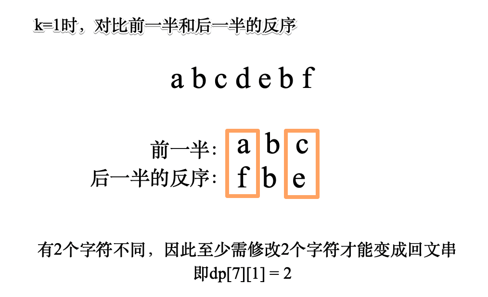

　　对于`k>1`的情况，我们假设在`j`的位置进行最后一次分割，那么`s[:j]`需要分割为`k-1`个子串，`s[j:i]`需要分割成`1`个子串。`s[:j]`分成`k-1`个子串需要修改的字符数为`dp[j][k-1]`，`s[j:i]`分成`1`个子串需要修改的字符数仍然使用上图的方法计算。  

　　状态转移方程`dp[i][k] = min(dp[i][k], dp[j][k-1] + get_change(j, i))`。  

#### **代码:**

```python
class Solution:
    def palindromePartition(self, s: str, k: int) -> int:
        # dp[i][k] 表示s[:i]分割成k个子串需要修改的最少字符数
        n = len(s)
        dp = [[float('inf') for _ in range(k+1)] for _ in range(n+1)]
        
        from functools import lru_cache
        @lru_cache(None)
        def get_change(j, i):  # 获取s[j:i]变成回文串需要修改的最少字符数
            pos = s[j:i]
            rever = pos[::-1]
            dp_i = 0
            for k in range((i-j)//2):
                if pos[k] != rever[k]:
                    dp_i += 1
            return dp_i
        
        for i in range(n+1):
            dp[i][1] = get_change(0, i)
            
        for kk in range(2, k + 1):
            for i in range(n + 1):
                for j in range(i + 1):
                    dp[i][kk] = min(dp[i][kk], dp[j][kk-1] + get_change(j, i))  # s[:j]  s[j:i]
            
        # print(dp)
        return dp[-1][-1]
                

```

## A1283. 使结果不超过阈值的最小除数

难度`中等`

#### 题目描述

给你一个整数数组 `nums` 和一个正整数 `threshold`  ，你需要选择一个正整数作为除数，然后将数组里每个数都除以它，并对除法结果求和。

请你找出能够使上述结果小于等于阈值 `threshold` 的除数中 **最小** 的那个。

每个数除以除数后都向上取整，比方说 7/3 = 3 ， 10/2 = 5 。

题目保证一定有解。

> **示例 1：**

```
输入：nums = [1,2,5,9], threshold = 6
输出：5
解释：如果除数为 1 ，我们可以得到和为 17 （1+2+5+9）。
如果除数为 4 ，我们可以得到和为 7 (1+1+2+3) 。如果除数为 5 ，和为 5 (1+1+1+2)。
```

> **示例 2：**

```
输入：nums = [2,3,5,7,11], threshold = 11
输出：3
```

> **示例 3：**

```
输入：nums = [19], threshold = 5
输出：4
```

**提示：**

- `1 <= nums.length <= 5 * 10^4`
- `1 <= nums[i] <= 10^6`
- `nums.length <= threshold <= 10^6`

#### 题目链接

<https://leetcode-cn.com/problems/find-the-smallest-divisor-given-a-threshold/>

#### **思路:**

　　使用二分法在`1`到`max(nums)`的范围内搜索被除数。  

#### **代码:**

```python
class Solution:
    def smallestDivisor(self, nums: List[int], threshold: int) -> int:
        def get_divider(divider):
            sum = 0
            for num in nums:
                sum = sum + num // divider if num % divider == 0 else sum + num // divider + 1
                
            return sum
        
        # 范围 1~max(nums)
        maximal = max(nums)
        i, j = 1, maximal
        
        while i <= j and i < maximal:
            mid = (i + j) // 2
            
            if get_divider(mid) > threshold:  
                if mid == maximal or get_divider(mid+1) <= threshold:
                    return mid+1
                
                i = mid + 1  # 要往大了搜
            else:
                j = mid - 1
                
        return mid

```

## A1284. 转化为全零矩阵的最少反转次数

难度`困难`

#### 题目描述

给你一个 `m x n` 的二进制矩阵 `mat`。

每一步，你可以选择一个单元格并将它反转（反转表示 0 变 1 ，1 变 0 ）。如果存在和它相邻的单元格，那么这些相邻的单元格也会被反转。（注：相邻的两个单元格共享同一条边。）

请你返回将矩阵 `mat` 转化为全零矩阵的*最少反转次数*，如果无法转化为全零矩阵，请返回 **-1** 。

二进制矩阵的每一个格子要么是 0 要么是 1 。

全零矩阵是所有格子都为 0 的矩阵。

> **示例 1：**


```
输入：mat = [[0,0],[0,1]]
输出：3
解释：一个可能的解是反转 (1, 0)，然后 (0, 1) ，最后是 (1, 1) 。
```

> **示例 2：**

```
输入：mat = [[0]]
输出：0
解释：给出的矩阵是全零矩阵，所以你不需要改变它。
```

> **示例 3：**

```
输入：mat = [[1,1,1],[1,0,1],[0,0,0]]
输出：6
```

> **示例 4：**

```
输入：mat = [[1,0,0],[1,0,0]]
输出：-1
解释：该矩阵无法转变成全零矩阵
```

**提示：**

- `m == mat.length`
- `n == mat[0].length`
- `1 <= m <= 3`
- `1 <= n <= 3`
- `mat[i][j]` 是 0 或 1 。

#### 题目链接

<https://leetcode-cn.com/problems/minimum-number-of-flips-to-convert-binary-matrix-to-zero-matrix/>

#### **思路:**

　　因此`m`和`n`的取值范围都很小，因此可以借助**状压DP**的思想，将整个矩阵的取值**压缩成一个整数**，如：  

```
[[1 0 1]
 [1 1 1]
 [0 0 1]]
```

　　可以展开成`101111001`，也就是十进制的`337`。  

　　然后将所有可能的反转也用相同的方式压缩成十进制数，如：  

```
[[1 1 0]
 [1 0 0]
 [0 0 0]]
```

　　是一种反转方式，其中`1`表示反转，`0`表示不变，可以展开成`110100000`，十进制为`416`。  

　　我们给某个矩阵应用一种变换，就相当于对这两个整数**做异或操作**。（因为异或0不变，异或1反转）。  

　　使用dp的方式，因为最多只有9个位置，最多翻转9次即可，用`dp[status]`记录翻转到状态`status`需要多少次。当`status=0`时返回结果。  

#### **代码:**

```python
class Solution:
    def minFlips(self, mat: List[List[int]]) -> int:
        m = len(mat)
        n = len(mat[0])
        dp = [float('inf') for _ in range(8**3)]

        def to_line(mat):
            ans = ''
            for line in mat:
                ans += ''.join(map(str, line))

            return int(ans, 2)

        transforms = []
        for i in range(m):
            for j in range(n):
                origin = [[0 for _ in range(n)] for _ in range(m)]
                origin[i][j] = 1
                if i > 0:
                    origin[i-1][j] = 1
                if j > 0:
                    origin[i][j-1] = 1
                if i < m-1:
                    origin[i+1][j] = 1
                if j < n-1:
                    origin[i][j+1] = 1

                transforms.append(to_line(origin))

        idx = to_line(mat)
        dp[idx] = 0
        if idx ==0 :
            return 0

        for step in range(1, 10):  # 最多9步
            dp_ = [float('inf') for _ in range(8 ** 3)]
            for status in range(8**3):
                if dp[status] != float('inf'):
                    for transform in transforms:
                        nxt = status ^ transform
                        if nxt == 0:
                            return step
                        dp_[nxt] = step
            dp = dp_

        return -1

```


## A1349. 参加考试的最大学生数

难度`困难`

#### 题目描述

给你一个 `m * n` 的矩阵 `seats` 表示教室中的座位分布。如果座位是坏的（不可用），就用 `'#'` 表示；否则，用 `'.'` 表示。

学生可以看到左侧、右侧、左上、右上这四个方向上紧邻他的学生的答卷，但是看不到直接坐在他前面或者后面的学生的答卷。请你计算并返回该考场可以容纳的一起参加考试且无法作弊的最大学生人数。

学生必须坐在状况良好的座位上。

> **示例 1：**


```
输入：seats = [["#",".","#","#",".","#"],
              [".","#","#","#","#","."],
              ["#",".","#","#",".","#"]]
输出：4
解释：教师可以让 4 个学生坐在可用的座位上，这样他们就无法在考试中作弊。 
```

> **示例 2：**

```
输入：seats = [[".","#"],
              ["#","#"],
              ["#","."],
              ["#","#"],
              [".","#"]]
输出：3
解释：让所有学生坐在可用的座位上。
```

> **示例 3：**

```
输入：seats = [["#",".",".",".","#"],
              [".","#",".","#","."],
              [".",".","#",".","."],
              [".","#",".","#","."],
              ["#",".",".",".","#"]]
输出：10
解释：让学生坐在第 1、3 和 5 列的可用座位上。
```

**提示：**

- `seats` 只包含字符 `'.' 和``'#'`
- `m == seats.length`
- `n == seats[i].length`
- `1 <= m <= 8`
- `1 <= n <= 8`

#### 题目链接

<https://leetcode-cn.com/problems/maximum-students-taking-exam/>

#### **思路:**

　　状态压缩dp。  

　　因为`m`和`n`的范围都很小。因此可以用`2^n`，即最大为`128`的数的二进制位来表示坐或者不坐的状态。  

　　先将座位💺的`"#"`转为`1`，`"."`转为`0`，如果座位和当前状态`与运算`结果为 0，表示可以这么坐。例如`"#.##.#"`转成二进制为`"101101"`，因此可行的坐人方式只有`"010010"`、`"000010"`和`"010000"`三种。  

　　判断左右是否坐人可以用`state & state << 1`和`state & state >> 1`来判断，也可以转成二进制判断字符串中是否有`"11"`。  

　　判断左前方和右前方是否坐人可以用`state & pre << 1`和`state & pre >> 1`来判断。  

　　从前往后dp，`dp[line][s]`表示第`line`行状态为`s`时**总共**坐的人数，有状态转移方程`dp[line][state] = max(dp[line][state],  dp[line-1][pre] + state.count('1')`。  

#### **代码:**

```python
class Solution:
    def maxStudents(self, seats: List[List[str]]) -> int:
        m = len(seats)
        if not m:
            return 0
        n = len(seats[0])
        dp = [[0 for _ in range(2**n)] for _ in range(m)]   # 8 * 64

        # 将 # 设为 1，. 设为0，如果与运算结果为 0，表示可以坐人
        seats = [int(''.join(line).replace('#', '1').replace('.', '0'), 2) for line in seats]

        for line in range(m):
            for state in range(2 ** n):
                if '11' in bin(state) or seats[line] & state:  # 左右有人 或者与座位冲突
                    continue

                for pre in range(2**n):  # 前面的状态
                    if pre & state >> 1 or pre & state << 1:
                        continue
    
                    if line == 0:
                        dp[0][state] = bin(state).count('1')
                    else:
                        dp[line][state] = max(dp[line][state],  dp[line-1][pre] + bin(state).count('1'))

        return max(dp[-1])
      
```

## A1411. 给 N x 3 网格图涂色的方案数

难度`困难`

#### 题目描述

你有一个 `n x 3` 的网格图 `grid` ，你需要用 **红，黄，绿** 三种颜色之一给每一个格子上色，且确保相邻格子颜色不同（也就是有相同水平边或者垂直边的格子颜色不同）。

给你网格图的行数 `n` 。

请你返回给 `grid` 涂色的方案数。由于答案可能会非常大，请你返回答案对 `10^9 + 7` 取余的结果。

> **示例 1：**

```
输入：n = 1
输出：12
解释：总共有 12 种可行的方法：
```


> **示例 2：**

```
输入：n = 2
输出：54
```

> **示例 3：**

```
输入：n = 3
输出：246
```

> **示例 4：**

```
输入：n = 7
输出：106494
```

> **示例 5：**

```
输入：n = 5000
输出：30228214
```

**提示：**

- `n == grid.length`
- `grid[i].length == 3`
- `1 <= n <= 5000`

#### 题目链接

<https://leetcode-cn.com/problems/number-of-ways-to-paint-n-x-3-grid/>

#### **思路:**

　　**方法一：**递归搜索，按从上到下，从左到右的顺序搜索，填充和相邻格子不同的颜色并计数。（超时）  

　　**方法二：**状态压缩dp，将一行看成是一个整体，共有`12`种可能的状态，下一行的状态和上一行的状态不冲突即可。记录每种状态的种数，统计总数即可。  

#### **代码:**

　　**方法一：**递归搜索（超时）

```python
sys.setrecursionlimit(1000000000)
def numOfWays(n: int) -> int:
    mem = [[0 for _ in range(3)] for _ in range(n)]  # n * 3

    ans = 0

    def dfs(i, j):
        nonlocal ans

        if i < 0 or j < 0 or i >= n or j >= 3:
            return

        # 下一个位置
        if j < 2:
            x, y = i, j + 1
        else:
            x, y = i + 1, 0

        for color in range(1, 4):
            if i > 0 and mem[i - 1][j] == color:
                continue
            if j > 0 and mem[i][j - 1] == color:
                continue
            if i < n - 1 and mem[i + 1][j] == color:
                continue
            if j < 2 and mem[i][j + 1] == color:
                continue

            mem[i][j] = color
            if i == n - 1 and j == 2:
                ans += 1
                # print(mem)
            dfs(x, y)
            mem[i][j] = 0

    dfs(0, 0)
    return ans

```

　　**方法二：**状态压缩dp

```python
class Solution:
    def numOfWays(self, n: int) -> int:
        state = ['010', '012', '020', '021', '101', '102', '120', '121','201', '202', '210','212']

        dp = [[0 for _ in range(27)] for _ in range(n)]  # n * 12
        for i in range(12):
            dp[0][int(state[i], 3)] = 1

        for i in range(1, n):
            for s1 in state:
                for s2 in state:
                    for k in range(3):
                        if s1[k] == s2[k]:
                            break
                    else:
                        dp[i][int(s2 ,3)] += dp[i-1][int(s1, 3)]


        return sum(dp[-1]) %1000000007
```

## A1416. 恢复数组

难度`困难`

#### 题目描述

某个程序本来应该输出一个整数数组。但是这个程序忘记输出空格了以致输出了一个数字字符串，我们所知道的信息只有：数组中所有整数都在 `[1, k]` 之间，且数组中的数字都没有前导 0 。

给你字符串 `s` 和整数 `k` 。可能会有多种不同的数组恢复结果。

按照上述程序，请你返回所有可能输出字符串 `s` 的数组方案数。

由于数组方案数可能会很大，请你返回它对 `10^9 + 7` **取余** 后的结果。

> **示例 1：**

```
输入：s = "1000", k = 10000
输出：1
解释：唯一一种可能的数组方案是 [1000]
```

> **示例 2：**

```
输入：s = "1000", k = 10
输出：0
解释：不存在任何数组方案满足所有整数都 >= 1 且 <= 10 同时输出结果为 s 。
```

> **示例 3：**

```
输入：s = "1317", k = 2000
输出：8
解释：可行的数组方案为 [1317]，[131,7]，[13,17]，[1,317]，[13,1,7]，[1,31,7]，[1,3,17]，[1,3,1,7]
```

> **示例 4：**

```
输入：s = "2020", k = 30
输出：1
解释：唯一可能的数组方案是 [20,20] 。 [2020] 不是可行的数组方案，原因是 2020 > 30 。 [2,020] 也不是可行的数组方案，因为 020 含有前导 0 。
```

> **示例 5：**

```
输入：s = "1234567890", k = 90
输出：34
```

**提示：**

- `1 <= s.length <= 10^5`.
- `s` 只包含数字且不包含前导 0 。
- `1 <= k <= 10^9`.

#### 题目链接

<https://leetcode-cn.com/problems/restore-the-array/>

#### **思路:**

　　动态规划。`dp[i]`表示`s[:i]`的分割种数。为了方便令`dp[0] = 1`。    

　　转移方程`dp[i] = sum(dp[0:i])`，注意把前导`0`和大于`k`的情况排除一下。  

#### **代码:**

```python
class Solution:
    def numberOfArrays(self, s: str, k: int) -> int:
        lk = len(str(k))
        n = len(s)
        dp = [0] * (n + 1)  # dp[i] 在i之前的位置加，
        dp[0] = 1  # 不split是一种
        for i in range(1, n + 1):
            if i < n and s[i] == '0':
                continue

            for j in range(i - 1, -1, -1):
                if int(s[j:i]) <= k:
                    dp[i] += dp[j] % 1000000007
                else:
                    break

        return dp[-1] % 1000000007

```

## A1420. 生成数组

难度`困难`

#### 题目描述

给你三个整数 `n`、`m` 和 `k` 。下图描述的算法用于找出正整数数组中最大的元素。

  

请你生成一个具有下述属性的数组 `arr` ：

- `arr` 中有 `n` 个整数。
- `1 <= arr[i] <= m` 其中 `(0 <= i < n)` 。
- 将上面提到的算法应用于 `arr` ，`search_cost` 的值等于 `k` 。

返回上述条件下生成数组 `arr` 的 **方法数** ，由于答案可能会很大，所以 **必须** 对 `10^9 + 7` 取余。

> **示例 1：**

```
输入：n = 2, m = 3, k = 1
输出：6
解释：可能的数组分别为 [1, 1], [2, 1], [2, 2], [3, 1], [3, 2] [3, 3]
```

> **示例 2：**

```
输入：n = 5, m = 2, k = 3
输出：0
解释：没有数组可以满足上述条件
```

> **示例 3：**

```
输入：n = 9, m = 1, k = 1
输出：1
解释：可能的数组只有 [1, 1, 1, 1, 1, 1, 1, 1, 1]
```

> **示例 4：**

```
输入：n = 50, m = 100, k = 25
输出：34549172
解释：不要忘了对 1000000007 取余
```

> **示例 5：**

```
输入：n = 37, m = 17, k = 7
输出：418930126
```

**提示：**

- `1 <= n <= 50`
- `1 <= m <= 100`
- `0 <= k <= n`

#### 题目链接

<https://leetcode-cn.com/problems/build-array-where-you-can-find-the-maximum-exactly-k-comparisons/>

#### **思路:**

　　这道题中`search_cost`的更新规则为，如果`arr[i] > arr[i-1]`，则`search_cost+1`。  

　　所以这题也就是求**恰好有（k-1）个数大于它前面的最大值**的`arr`的种类数。  

　　令`dp[i][j][kk]`表示`arr[:i]`最大元素为`j`且`search_cost = kk`能表示的种数。  

　　假设当前数组最大的元素为`j`，如果增加一个元素，而保持`k`保持不变的话，增加的新的元素不能超过`j`，也就是取值范围`[1, j]`，共有`j`种可能。这一部分表示为`dp[i - 1][j][kk] * j`。  

　　如果增加一个元素，会使得`kk+1`，那么增加的元素一定是最大的`j`，这一部分共有sum(`dp[i - 1][1: j][kk-1]`)种可能性。  

　　因此递推公式`dp[i][j][kk] = dp[i - 1][j][kk] * j +sum(dp[i - 1][1: j][kk-1])`。

#### **代码:**

```python
class Solution:
    def numOfArrays(self, n: int, m: int, k: int) -> int:
        dp = [[[0 for _ in range(k + 1)] for _ in range(m + 1)] for _ in range(n)]
        for j in range(1, m + 1):
            dp[0][j][1] = 1

        for i in range(1, n):
            for kk in range(1, k + 1):           
                acc = 0
                for j in range(1, m + 1):
                    dp[i][j][kk] = dp[i - 1][j][kk] * j + acc
                    acc += dp[i - 1][j][kk - 1]

        ans = 0
        for line in dp[n - 1]:
            ans += line[k]
        return ans % 1000000007

```

## A1423. 可获得的最大点数

难度`中等`

#### 题目描述

几张卡牌 **排成一行**，每张卡牌都有一个对应的点数。点数由整数数组 `cardPoints` 给出。

每次行动，你可以从行的开头或者末尾拿一张卡牌，最终你必须正好拿 `k` 张卡牌。

你的点数就是你拿到手中的所有卡牌的点数之和。

给你一个整数数组 `cardPoints` 和整数 `k`，请你返回可以获得的最大点数。

> **示例 1：**

```
输入：cardPoints = [1,2,3,4,5,6,1], k = 3
输出：12
解释：第一次行动，不管拿哪张牌，你的点数总是 1 。但是，先拿最右边的卡牌将会最大化你的可获得点数。最优策略是拿右边的三张牌，最终点数为 1 + 6 + 5 = 12 。
```

> **示例 2：**

```
输入：cardPoints = [2,2,2], k = 2
输出：4
解释：无论你拿起哪两张卡牌，可获得的点数总是 4 。
```

> **示例 3：**

```
输入：cardPoints = [9,7,7,9,7,7,9], k = 7
输出：55
解释：你必须拿起所有卡牌，可以获得的点数为所有卡牌的点数之和。
```

> **示例 4：**

```
输入：cardPoints = [1,1000,1], k = 1
输出：1
解释：你无法拿到中间那张卡牌，所以可以获得的最大点数为 1 。 
```

> **示例 5：**

```
输入：cardPoints = [1,79,80,1,1,1,200,1], k = 3
输出：202
```

**提示：**

- `1 <= cardPoints.length <= 10^5`
- `1 <= cardPoints[i] <= 10^4`
- `1 <= k <= cardPoints.length`

#### 题目链接

<https://leetcode-cn.com/problems/maximum-points-you-can-obtain-from-cards/>

#### **思路:**

　　因为拿掉的牌**固定为**`k`张，因此剩下的就是中间的`n-k`张，维护一个滑动窗口，求中间`n-k`张的最小值即可。  

#### **代码:**

```python
class Solution:
    def maxScore(self, cardPoints: List[int], k: int) -> int:
        n = len(cardPoints) - k
        if n == 0:
            return sum(cardPoints)
        left = 0
        wnd = 0
        ans = inf
        for right, num in enumerate(cardPoints):  # cardPoints[left: right+1]
            wnd += num
                
            if right + 1 - left == n:  # 窗口内的数量正好为n
                ans = min(ans, wnd)
                wnd -= cardPoints[left]  # 减掉一个
                left += 1
            
        return sum(cardPoints) - ans

```


## A1425. 带限制的子序列和

难度`困难`

#### 题目描述

给你一个整数数组 `nums` 和一个整数 `k` ，请你返回 **非空** 子序列元素和的最大值，子序列需要满足：子序列中每两个 **相邻** 的整数 `nums[i]` 和 `nums[j]` ，它们在原数组中的下标 `i` 和 `j` 满足 `i < j` 且 `j - i <= k` 。

数组的子序列定义为：将数组中的若干个数字删除（可以删除 0 个数字），剩下的数字按照原本的顺序排布。

> **示例 1：**

```
输入：nums = [10,2,-10,5,20], k = 2
输出：37
解释：子序列为 [10, 2, 5, 20] 。
```

> **示例 2：**

```
输入：nums = [-1,-2,-3], k = 1
输出：-1
解释：子序列必须是非空的，所以我们选择最大的数字。
```

> **示例 3：**

```
输入：nums = [10,-2,-10,-5,20], k = 2
输出：23
解释：子序列为 [10, -2, -5, 20] 。
```

**提示：**

- `1 <= k <= nums.length <= 10^5`
- `-10^4 <= nums[i] <= 10^4`

#### 题目链接

<https://leetcode-cn.com/problems/constrained-subset-sum/>

#### **思路:**

　　动态规划。令`dp[i]`表示选择下标为`i`的元素时能选择的最大子序和，因为选择的两个元素下标之差不能大于`k`，因此有状态转移方程`dp[i] = max(0, max(dp[i-k: i])) + nums[i]`。  

　　由于题目的范围较大，不能暴力计算`max(dp[i-k: i])`，因此使用一个**最大堆**来保存`dp[i-k: i]`的最大值。  

#### **代码:**

```python
class Solution:
    def constrainedSubsetSum(self, nums: List[int], k: int) -> int:
        n = len(nums)
        dp = [0] * n
        heap = []
        ans = nums[0]
        for i in range(n):
            num = nums[i]
            
            dp_j = float('inf')
            while heap:
                dp_j, j = heapq.heappop(heap)
                if j >= i - k:
                    heapq.heappush(heap, (dp_j, j))  # 放回去
                    break
            
            dp[i] = max(0, -dp_j) + num
            print(i, dp[i])
            
            if dp[i] > 0:
                heapq.heappush(heap, (-dp[i], i))
            
            ans = max(ans, dp[i])
       
        return(ans)

```


## A1434. 每个人戴不同帽子的方案数

难度`困难`

#### 题目描述

总共有 `n` 个人和 `40` 种不同的帽子，帽子编号从 `1` 到 `40` 。

给你一个整数列表的列表 `hats` ，其中 `hats[i]` 是第 `i` 个人所有喜欢帽子的列表。

请你给每个人安排一顶他喜欢的帽子，确保每个人戴的帽子跟别人都不一样，并返回方案数。

由于答案可能很大，请返回它对 `10^9 + 7` 取余后的结果。

> **示例 1：**

```
输入：hats = [[3,4],[4,5],[5]]
输出：1
解释：给定条件下只有一种方法选择帽子。
第一个人选择帽子 3，第二个人选择帽子 4，最后一个人选择帽子 5。
```

> **示例 2：**

```
输入：hats = [[3,5,1],[3,5]]
输出：4
解释：总共有 4 种安排帽子的方法：
(3,5)，(5,3)，(1,3) 和 (1,5)
```

> **示例 3：**

```
输入：hats = [[1,2,3,4],[1,2,3,4],[1,2,3,4],[1,2,3,4]]
输出：24
解释：每个人都可以从编号为 1 到 4 的帽子中选。
(1,2,3,4) 4 个帽子的排列方案数为 24 。
```

> **示例 4：**

```
输入：hats = [[1,2,3],[2,3,5,6],[1,3,7,9],[1,8,9],[2,5,7]]
输出：111
```

**提示：**

- `n == hats.length`
- `1 <= n <= 10`
- `1 <= hats[i].length <= 40`
- `1 <= hats[i][j] <= 40`
- `hats[i]` 包含一个数字互不相同的整数列表。

#### 题目链接

<https://leetcode-cn.com/problems/number-of-ways-to-wear-different-hats-to-each-other/>

#### **思路:**

　　由于帽子的数量相对较大，而人数相对较小。可以反过来考虑每顶帽子喜欢的人。  

　　状态压缩dp。`n`个人是否选了喜欢的帽子的状态，可以用`n`位二进制来表示。`dp[status]`表示某种状态的种数。选了帽子的人就不能再次选帽子，因此状态转移方程`dp'[cur | j] += dp[j]`，其中`j & cur == 0`。  

　　因为最后所有人的都要选帽子，所以返回的结果为`dp['1111..111']`(n个'1')，也就是`dp[2^n-1]`。  

#### **代码:**

```python
class Solution:
    def numberWays(self, hats: List[List[int]]) -> int:
        n = len(hats)

        # dp[]
        shown = set()  # 所有的帽子
        for line in hats:
            shown.update(set(line))

        # dp[status]

        mem = defaultdict(list)  # 每顶帽子喜欢的人
        for i, line in enumerate(hats):
            for hat in line:
                mem[hat].append(i)

        dp = [0] * 2 ** n
        dp[0] = 1
        for i in range(1, len(shown) + 1):
            temp = dp.copy()
            hat = shown.pop()  # 下一顶帽子hat
            for j in range(2 ** n):
                if dp[j] == 0:  # j的情况不可能出现
                    continue
                for person in mem[hat]:  # 这顶帽子hat喜欢的所有人
                    cur = 1 << person  # 这个人的二进制编码
                    if cur & j:  # 这个人已经有了喜欢的帽子
                        continue
                    temp[cur | j] += dp[j]  # 更新新的状态

            dp = temp

        # print(shown)

        return dp[-1] % (1000000000 + 7)

```

## A1444. 切披萨的方案数

难度`困难`

#### 题目描述

给你一个 `rows x cols` 大小的矩形披萨和一个整数 `k` ，矩形包含两种字符： `'A'` （表示苹果）和 `'.'` （表示空白格子）。你需要切披萨 `k-1` 次，得到 `k` 块披萨并送给别人。

切披萨的每一刀，先要选择是向垂直还是水平方向切，再在矩形的边界上选一个切的位置，将披萨一分为二。如果垂直地切披萨，那么需要把左边的部分送给一个人，如果水平地切，那么需要把上面的部分送给一个人。在切完最后一刀后，需要把剩下来的一块送给最后一个人。

请你返回确保每一块披萨包含 **至少** 一个苹果的切披萨方案数。由于答案可能是个很大的数字，请你返回它对 10^9 + 7 取余的结果。

> **示例 1：**


```
输入：pizza = ["A..","AAA","..."], k = 3
输出：3 
解释：上图展示了三种切披萨的方案。注意每一块披萨都至少包含一个苹果。
```

> **示例 2：**

```
输入：pizza = ["A..","AA.","..."], k = 3
输出：1
```

> **示例 3：**

```
输入：pizza = ["A..","A..","..."], k = 1
输出：1
```

**提示：**

- `1 <= rows, cols <= 50`
- `rows == pizza.length`
- `cols == pizza[i].length`
- `1 <= k <= 10`
- `pizza` 只包含字符 `'A'` 和 `'.'` 。

#### 题目链接

<https://leetcode-cn.com/problems/number-of-ways-of-cutting-a-pizza/>

#### **思路:**

　　由于要多次查询矩形区域内有没有苹果，因此先用`has_apple[x1][x2][y1][y2]`表示`pizza[x1:x2][y1:y2]`的范围内有没有苹果。  

　　`dp[i][j][k]`表示，矩形`[i:n][j:m]` 切割了`k`次的方案数，然后用动态规划求解。注意每次切割要保证切出来的两块矩形区域都有苹果🍎。    　

#### **代码:**

```python
from collections import defaultdict

class Solution:
    def ways(self, pizza: List[str], k: int) -> int:
        m = len(pizza)
        n = len(pizza[0])
        # dp = [[] for _ in range(k+1)]
        dp = {(0,0):1}
        
        has_apple = [[[[False for _ in range(n+1)] for _ in range(n+1)] for _ in range(m+1)] for _ in range(m+1)]   # m m n n
        for x1 in range(m):
            for x2 in range(x1+1, m+1):
                for y1 in range(n):
                    for y2 in range(y1+1, n+1):
                        if pizza[x2-1][y2-1] == 'A':
                            has_apple[x1][x2][y1][y2] = True
                            continue      
                        
                        has_apple[x1][x2][y1][y2] = has_apple[x1][x2-1][y1][y2] or  has_apple[x1][x2][y1][y2-1]
                    
                            
        
        # has_apple(x1, x2, y1, y2):  # pizza[x1:x2][y1:y2] 有没有苹果
            
        # print(has_apple)
            
        for kk in range(1, k):
            temp = defaultdict(int)
            for lm, ln in dp:  # 之前的情况
                count = dp[(lm, ln)]
                for i in range(lm+1, m):  # 按行切
                    if has_apple[lm][i][ln][n] and has_apple[i][m][ln][n]:                
                        temp[(i,ln)] += count
                for j in range(ln+1, n):  # 按列切
                    if has_apple[lm][m][ln][j] and has_apple[lm][m][j][n]:     
                        temp[(lm, j)] += count
                
            # print(temp)
            dp = temp
            
        return sum(dp.values()) % (1000000000 + 7)

```

## A1569. 将子数组重新排序得到同一个二叉查找树的方案数

难度`困难`

#### 题目描述

给你一个数组 `nums` 表示 `1` 到 `n` 的一个排列。我们按照元素在 `nums` 中的顺序依次插入一个初始为空的二叉查找树（BST）。请你统计将 `nums` 重新排序后，统计满足如下条件的方案数：重排后得到的二叉查找树与 `nums` 原本数字顺序得到的二叉查找树相同。

比方说，给你 `nums = [2,1,3]`，我们得到一棵 2 为根，1 为左孩子，3 为右孩子的树。数组 `[2,3,1]` 也能得到相同的 BST，但 `[3,2,1]` 会得到一棵不同的 BST 。

请你返回重排 `nums` 后，与原数组 `nums` 得到相同二叉查找树的方案数。

由于答案可能会很大，请将结果对 `10^9 + 7` 取余数。

> **示例 1：**


```
输入：nums = [2,1,3]
输出：1
解释：我们将 nums 重排， [2,3,1] 能得到相同的 BST 。没有其他得到相同 BST 的方案了。
```

> **示例 2：**

****

```
输入：nums = [3,4,5,1,2]
输出：5
解释：下面 5 个数组会得到相同的 BST：
[3,1,2,4,5]
[3,1,4,2,5]
[3,1,4,5,2]
[3,4,1,2,5]
[3,4,1,5,2]
```

> **示例 3：**

****

```
输入：nums = [1,2,3]
输出：0
解释：没有别的排列顺序能得到相同的 BST 。
```

> **示例 4：**

****

```
输入：nums = [3,1,2,5,4,6]
输出：19
```

> **示例  5：**

```
输入：nums = [9,4,2,1,3,6,5,7,8,14,11,10,12,13,16,15,17,18]
输出：216212978
解释：得到相同 BST 的方案数是 3216212999。将它对 10^9 + 7 取余后得到 216212978。
```

**提示：**

- `1 <= nums.length <= 1000`
- `1 <= nums[i] <= nums.length`
- `nums` 中所有数 **互不相同** 。

#### 题目链接

<https://leetcode-cn.com/problems/number-of-ways-to-reorder-array-to-get-same-bst/>

#### **思路:**

　　分治法。第一个元素一定放在根结点；比第一个元素小的元素放在左子树，比第一个元素大的元素放在右子树。  

　　先计算左子树的情况数`left`，再计算右子树的情况数`right`，左右子树可以互相交错排列，只要保持其在各自数组中的位置不变即可，因此总的情况数为`left × right × C(左右子树结点数和, 左子树结点数)`。  

#### **代码:**

```python
class Solution:
    def numOfWays(self, nums: List[int]) -> int:
        def helper(nums):
            if len(nums) <= 2:
                return 1
            root = nums[0]
            less = list(filter(lambda x: x<root, nums))
            more = list(filter(lambda x: x>root, nums))
            return helper(less) * helper(more) * comb(len(nums)-1, len(more))

        return((helper(nums)-1) % 1000000007)

```


## A1578. 避免重复字母的最小删除成本

难度`中等`

#### 题目描述

给你一个字符串 `s` 和一个整数数组 `cost` ，其中 `cost[i]` 是从 `s` 中删除字符 `i` 的代价。

返回使字符串任意相邻两个字母不相同的最小删除成本。

请注意，删除一个字符后，删除其他字符的成本不会改变。

> **示例 1：**

```
输入：s = "abaac", cost = [1,2,3,4,5]
输出：3
解释：删除字母 "a" 的成本为 3，然后得到 "abac"（字符串中相邻两个字母不相同）。
```

> **示例 2：**

```
输入：s = "abc", cost = [1,2,3]
输出：0
解释：无需删除任何字母，因为字符串中不存在相邻两个字母相同的情况。
```

> **示例 3：**

```
输入：s = "aabaa", cost = [1,2,3,4,1]
输出：2
解释：删除第一个和最后一个字母，得到字符串 ("aba") 。
```

**提示：**

- `s.length == cost.length`
- `1 <= s.length, cost.length <= 10^5`
- `1 <= cost[i] <= 10^4`
- `s` 中只含有小写英文字母

#### 题目链接

<https://leetcode-cn.com/problems/minimum-deletion-cost-to-avoid-repeating-letters/>

#### **思路:**

　　有贪心算法的思想，如果相邻的两个字母相同，就删除花费小的那个。  

　　初始时维护一个空的数组`a`，将`s`中的字母逐个添加到`a`中，如果`s`中第`i`个字母与`a`最后一个字母相同，比较他们的`cost`，将`cost`小的删除，`cost`大的保留再`a`的末尾。  

#### **代码:**

**方法一：**模拟删除的过程（会超时）

```python
class Solution:
    def minCost(self, s: str, cost: List[int]) -> int:
        a = list(s)
        
        def helper(a, cost):
            for i in range(len(a)-1):
                if a[i] == a[i+1]:  # 要么删i 要么删i+1
                    if cost[i] <= cost[i+1]:
                        a.pop(i)
                        ans = cost.pop(i)
                    else:
                        a.pop(i+1)
                        ans = cost.pop(i+1)
                        
                    return ans + helper(a, cost)
                
            return 0
        
        return helper(a, cost)
      
```

**方法二：**

```python
class Solution:
    def minCost(self, s: str, cost: List[int]) -> int:
        a = list(s)
  
        temp = []
        costtemp = []
        ans = 0
        for i in range(len(a)):  # 前i个
            if not temp or temp[-1] != a[i]:
                temp.append(a[i])
                costtemp.append(cost[i])
            else:
                if cost[i] <= costtemp[-1]:  # 不入
                    ans += cost[i]
                else:
                    ans += costtemp[-1]
                    costtemp.pop()
                    costtemp.append(cost[i])
                
        return ans

```


