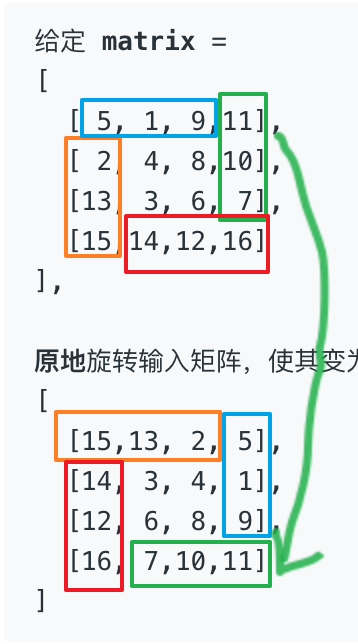

# 数组

## A1. 两数之和

难度 `简单`

#### 题目描述

>　　给定一个整数数组 nums 和一个目标值 target，请你在该数组中找出和为目标值的那 两个 整数，并返回他们的数组下标。  
>　　  
>　　你可以假设每种输入只会对应一个答案。但是，你不能重复利用这个数组中同样的元素。  
>　　  
>　　示例:  
>　　给定 nums = [2, 7, 11, 15], target = 9  
>　　  
>　　因为 nums[0] + nums[1] = 2 + 7 = 9  
>　　所以返回 [0, 1]  

#### 题目链接

<https://leetcode-cn.com/problems/two-sum/>

#### 思路  

　　用一个字典记录数值与下标的映射。遍历`nums`，如果字典中存在`target - num`这个数（且下标与`num`下标不同），则返回这两个数的下标。  

#### 代码  
```python
class Solution:
    def twoSum(self, nums: List[int], target: int) -> List[int]:
        dic = {}
        for i, num in enumerate(nums):
            dic[num] = i
        for i, num in enumerate(nums):
            remain = target-num
            if remain in dic and i != dic[remain]:
                return [i, dic[remain]]
```

## A4. 寻找两个有序数组的中位数

难度 `困难`

#### 题目描述

>　　给定两个大小为 m 和 n 的有序数组 nums1 和 nums2。  
>　　  
>　　请你找出这两个有序数组的中位数，并且要求算法的时间复杂度为 O(log(m + n))。  
>　　  
>　　你可以假设 nums1 和 nums2 不会同时为空。  
>　　  
>　　示例 1:  
>　　nums1 = [1, 3]  
>　　nums2 = [2]  
>　　  
>　　则中位数是 2.0  
>　　  
>　　示例 2:  
>　　nums1 = [1, 2]  
>　　nums2 = [3, 4]  
>　　  
>　　则中位数是 (2 + 3)/2 = 2.5  

#### 题目链接

<https://leetcode-cn.com/problems/median-of-two-sorted-arrays/>

#### **思路**

　　将两个数组合并，然后按顺序查找即可。

#### **代码**

```python
# encoding=utf-8
"""
    执行用时 : 112 ms, 在所有 python3 提交中击败了91.33%的用户
    内存消耗 : 12.8 MB, 在所有 python3 提交中击败了99.43%的用户
"""
def findMedianSortedArrays(nums1: list, nums2: list) -> float:
    i = 0
    j = 0
    l1 = len(nums1)
    l2 = len(nums2)
    ans = []
    while i<l1 and j<l2:
        x = nums1[i]
        y = nums2[j]
        if x<=y:
            ans.append(x)
            i+=1
        else:
            ans.append(y)
            j+=1

    if i<l1:
        ans.extend(nums1[i-l1:])
    else: 
        ans.extend(nums2[j-l2:])

    # print(ans)
    l = len(ans)
    if len(ans) %2==1:
        return ans[l//2]
    else:
        return (ans[l//2-1] + ans[l//2])/2


nums2 = [1,2]
nums1 = [3,4]
print(findMedianSortedArrays(nums1,nums2))

```


## A11. 盛最多水的容器

难度 `中等`

#### 题目描述

>　　给你 n 个非负整数 a1，a2，...，an，每个数代表坐标中的一个点 (i, ai) 。在坐标内画 n 条垂直线，垂直线 i 的两个端点分别为 (i, ai) 和 (i, 0)。找出其中的两条线，使得它们与 x 轴共同构成的容器可以容纳最多的水。  
>　　  
>　　说明：你不能倾斜容器，且 n 的值至少为 2。  
>　　  
>　　图中垂直线代表输入数组 [1,8,6,2,5,4,8,3,7]。在此情况下，容器能够容纳水（表示为蓝色部分）的最大值为 49。  
>　　  
>　　  
>　　示例：  
>　　输入：[1,8,6,2,5,4,8,3,7]  
>　　输出：49  

#### 题目链接

https://leetcode-cn.com/problems/container-with-most-water/

#### 思路  

　　方法一：用`lefts`记录`heights`从左到右所有比之前最高的还高的线，`rights`记录从右到左所有比之前最高的还高的线。遍历`lefts`和`rights`，其中必有一种组合能够容纳最多的水。  
　　方法二：双指针，初始时设头指针和尾指针分别为`i`和`j`。我们能够发现不管是左指针向右移动一位，还是右指针向左移动一位，容器的底都是一样的，都比原来减少了 1。这种情况下我们想要让指针移动后的容器面积增大，就要使移动后的容器的高尽量大，所以我们选择指针所指的高较小的那个指针进行移动，这样我们就保留了容器较高的那条边，放弃了较小的那条边，以获得有更高的边的机会。

#### 代码  

　　方法一：

```python
class Solution:
    def maxArea(self, height: List[int]) -> int:
        lefts = [0]
        rights = [len(height)-1]
        tmp = height[0]
        for i, num in enumerate(height):
            if num > tmp: 
                lefts.append(i)
                tmp = num


        tmp = height[-1]
        for i in range(len(height)-1,-1,-1):
            num = height[i]
            if num > tmp: 
                rights.append(i)
                tmp = num

        def calc(i1, i2):
            return (i2-i1) * (min(height[i1],height[i2]))

        l, r = len(lefts), len(rights)
        i, j = 0, 0
        ans = 0

        for ll in lefts:
            for rr in rights:
                temp = calc(ll,rr)
                if temp > ans:
                    ans = temp
        return ans
```

　　方法二：

```python
class Solution:
    def maxArea(self, height: List[int]) -> int:
        l = len(height)
        i, j = 0, l - 1
        ans = 0
        while i < j:
            h = min(height[i], height[j])
            ans = max(ans, h * (j-i))
            # 指针向所指的高较小的那个指针进行移动
            if height[i] < height[j]:
                i += 1
            else:
                j -= 1

        return ans
```

## A15. 三数之和

难度 `中等`

#### 题目描述

>　　给你一个包含 n 个整数的数组 nums，判断 nums 中是否存在三个元素 a，b，c ，使得 a + b + c = 0 ？请你找出所有满足条件且不重复的三元组。  
>　　  
>　　注意：答案中不可以包含重复的三元组。  
>　　  
>　　  
>　　示例：  
>　　给定数组 nums = [-1, 0, 1, 2, -1, -4]，  
>　　  
>　　满足要求的三元组集合为：  
>　　[  
>　　  [-1, 0, 1],  
>　　  [-1, -1, 2]  
>　　]  

#### 题目链接

<https://leetcode-cn.com/problems/3sum/>


#### 思路  

　　记录每个数字出现的次数，如果有`多于3次`的0，或者`多于2次`的其他数，则忽略不使用。  
　　分以下几种情况分别考虑：  

　　0 + 0 + 0 = 0，0 + `一对相反数` = 0， `两个正数` + `一个负数` = 0， `两个负数` + `一个正数` = 0。

#### 代码  
```python
class Solution:
    def threeSum(self, nums: List[int]) -> List[List[int]]:
        if len(nums) == 0:
            return []
        times = {}  # 记录每个数出现的次数，其中0最多出现3次，其他数最多出现2次
        new_nums = []
        ans = set()
        for num in nums:
            if num not in times:
                times[num] = 1
                new_nums.append(num)
            else:
                if num == 0 and times[num] <= 2:
                    times[num] += 1
                    new_nums.append(num)
                if nums != 0 and times[num] <= 1:
                    times[num] += 1
                    new_nums.append(num)
        
        new_nums = sorted(new_nums)  # 构建一个新的数组并排序，去掉了冗余的数字

        if 0 in times:
            if times[0] == 3:  # 3个0的特例
                ans.add((0, 0, 0))
            for num in times:
                if num > 0 and -num in times:  # 0和一对相反数
                    ans.add((-num, 0, num))

        for i, num1 in enumerate(new_nums):
            for j in range(i+1, len(new_nums)):
                num2 = new_nums[j]
                if num1 < 0 and num2 < 0 and -num1-num2 in times:  # 两正一负
                    ans.add((num1, num2, -num1-num2))
                if num1 > 0 and num2 > 0 and -num1-num2 in times:  # 两负一正
                    ans.add((-num1-num2, num1, num2))

        return [i for i in ans]
```


## A16. 最接近的三数之和

难度 `中等`

#### 题目描述

>　　给定一个包括 n 个整数的数组 nums 和 一个目标值 target。找出 nums 中的三个整数，使得它们的和与 target 最接近。返回这三个数的和。假定每组输入只存在唯一答案。  
>　　  
>　　例如，给定数组 nums = [-1，2，1，-4], 和 target = 1.  
>　　  
>　　与 target 最接近的三个数的和为 2. (-1 + 2 + 1 = 2).  

#### 题目链接

<https://leetcode-cn.com/problems/3sum-closest/>


#### 思路  

　　维护两个集合`ones`和`twos`，前者记录不重复的数，后者通过遍历`ones`来记录任意两个数相加的和。  

　　令`delta`表示任意三个数和target之差的最小值。对于`nums`中的新的一个数字`num`，如果和`twos`中的某个数和与`target`之差小于`delta`，则更新`delta`和`ans`。`num`和`one`中所有数字的和会被加入到`twos`中。

#### 代码  
```python
class Solution:
    def threeSumClosest(self, nums: List[int], target: int) -> int:
        delta = 9999999
        ans = -1
        ones = set()
        twos = set()
        for num in nums:
            for two in twos:  # 任意两数之和的集合
                if abs(two + num - target) < delta:
                    delta = abs(two + num - target)
                    ans = two + num
            for one in ones:  # 新数num和ones中的每个数字相加，并放入twos中
                twos.add(one+num)
            ones.add(num)  # 新数放入ones中

        return ans
```

## A26. 删除排序数组中的重复项

难度 `简单`

#### 题目描述

>　　给定一个排序数组，你需要在 原地 删除重复出现的元素，使得每个元素只出现一次，返回移除后数组的新长度。  
>　　  
>　　不要使用额外的数组空间，你必须在 原地 修改输入数组 并在使用 O(1) 额外空间的条件下完成。  
>　　  
>　　  
>　　示例 1:  
>　　给定数组 nums = [1,1,2],   
>　　  
>　　函数应该返回新的长度 2, 并且原数组 nums 的前两个元素被修改为 1, 2。   
>　　  
>　　你不需要考虑数组中超出新长度后面的元素。  
>　　  
>　　示例 2:  
>　　给定 nums = [0,0,1,1,1,2,2,3,3,4],  
>　　  
>　　函数应该返回新的长度 5, 并且原数组 nums 的前五个元素被修改为 0, 1, 2, 3, 4。  
>　　  
>　　你不需要考虑数组中超出新长度后面的元素。  

#### 题目链接

<https://leetcode-cn.com/problems/remove-duplicates-from-sorted-array/>


#### 思路  


　　用python自带的`remove`函数（这个解法很耗时间）。优化时间复杂度的方法可以使用双指针。

#### 代码  
```python
class Solution:
    def removeDuplicates(self, nums: List[int]) -> int:
        shown = set()
        i = 0
        while i < len(nums):
            num = nums[i]
            if num in shown:
                nums.remove(num)
                i -= 1
            else:
                shown.add(num)
            i += 1

        return len(nums)
```

## A27. 移除元素

难度 `简单`

#### 题目描述

>　　给你一个数组 nums 和一个值 val，你需要 原地 移除所有数值等于 val 的元素，并返回移除后数组的新长度。  
>　　  
>　　不要使用额外的数组空间，你必须仅使用 O(1) 额外空间并 原地 修改输入数组。  
>　　  
>　　元素的顺序可以改变。你不需要考虑数组中超出新长度后面的元素。  
>　　  
>　　示例 1:  
>　　给定 nums = [3,2,2,3], val = 3,  
>　　  
>　　函数应该返回新的长度 2, 并且 nums 中的前两个元素均为 2。  
>　　  
>　　你不需要考虑数组中超出新长度后面的元素。  
>　　  
>　　示例 2:  
>　　给定 nums = [0,1,2,2,3,0,4,2], val = 2,  
>　　  
>　　函数应该返回新的长度 5, 并且 nums 中的前五个元素为 0, 1, 3, 0, 4。  
>　　  
>　　注意这五个元素可为任意顺序。  
>　　  
>　　你不需要考虑数组中超出新长度后面的元素  

#### 题目链接

<https://leetcode-cn.com/problems/remove-element/>


#### 思路  


　　挑战最短代码。

#### 代码  
```python
class Solution:
    def removeElement(self, nums: List[int], val: int) -> int:
        c = nums.count(val)
        while c:
            nums.remove(val)
            c -= 1
            
        return len(nums)
```

## A31. 下一个排列

难度 `中等`

#### 题目描述

>　　实现获取下一个排列的函数，算法需要将给定数字序列重新排列成字典序中下一个更大的排列。  
>　　  
>　　如果不存在下一个更大的排列，则将数字重新排列成最小的排列（即升序排列）。  
>　　  
>　　必须原地修改，只允许使用额外常数空间。  
>　　  
>　　以下是一些例子，输入位于左侧列，其相应输出位于右侧列。  
>　　1,2,3 → 1,3,2  
>　　3,2,1 → 1,2,3  
>　　1,1,5 → 1,5,1  

#### 题目链接

<https://leetcode-cn.com/problems/next-permutation/>


#### 思路  


　　其实就是从数组倒着查找，找到`nums[i]`比`nums[i+1]`小的时候，就将`nums[i]`和`nums[i+1:]`中比`nums[i]`大的**最小的数**和`nums[i]`交换，然后再把`nums[i+1:]`排序就ok了🙆‍♂️。

#### 代码  
```python
class Solution:
    def nextPermutation(self, nums: List[int]) -> None:
        """
        Do not return anything, modify nums in-place instead.
        """
        if len(nums) <= 1:
            return nums
        
        l = len(nums)
        i, j = 0, 0  # 下标为i和下标为j的数交换

        for i in range(l-2, -1, -1):
            if nums[i+1] > nums[i]:
                break
            elif i == 0:
                i = -1

        if i == -1:
            nums[:] = sorted(nums)[:]
        else:
            exchange = float('inf')
            for k, num in enumerate(nums[i+1:]):
                if num > nums[i] and num < exchange:  # 找到比nums[i]大的最小的数
                    exchange = num
                    j = k + i + 1
            nums[i], nums[j] = nums[j], nums[i]  # 下标为i和下标为j的数交换
            nums[i+1:] = sorted(nums[i+1:])
```

## A33. 搜索旋转排序数组

难度 `中等`

#### 题目描述

>　　假设按照升序排序的数组在预先未知的某个点上进行了旋转。  
>　　  
>　　( 例如，数组 [0,1,2,4,5,6,7] 可能变为 [4,5,6,7,0,1,2] )。  
>　　  
>　　搜索一个给定的目标值，如果数组中存在这个目标值，则返回它的索引，否则返回 -1 。  
>　　  
>　　你可以假设数组中不存在重复的元素。  
>　　  
>　　你的算法时间复杂度必须是 O(log n) 级别。  
>　　  
>　　示例 1:  
>　　输入: nums = [4,5,6,7,0,1,2], target = 0  
>　　输出: 4  
>　　  
>　　示例 2:  
>　　输入: nums = [4,5,6,7,0,1,2], target = 3  
>　　输出: -1  

#### 题目链接

<https://leetcode-cn.com/problems/search-in-rotated-sorted-array/>


#### 思路  

　　`nums`从中间切一半，必然有一半是有序的，另一半是无序的，对有序的一半二分查找，对无序的一半递归调用该算法。  
　　如果第一个数`nums[i]` 小于中间的数`nums[mid]`，则左半边有序，否则右半边有序。  

#### 代码  
```python
class Solution:
    def helper(self, nums: List[int], i, j, target):
        if j <= i:
            return -1
        n = j - i
        if n <= 2:
            for k in range(i, j):
                if nums[k] == target:
                    return k
            return -1

        middle = (i + j) // 2

        if nums[i] < nums[middle]:
            # 对左边进行二分查找，对右边递归
            start, end = middle, j
            j = middle
        else:
            # 对右边进行二分查找，对左边递归
            start, end = i, middle
            i = middle

        while i <= j and i < len(nums):
            mid = (i + j) // 2
            if nums[mid] > target:
                j = mid - 1
            elif nums[mid] < target:
                i = mid + 1
            else:
                if nums[mid] == target:
                    return mid

        return self.helper(nums, start, end, target)


    def search(self, nums: List[int], target: int) -> int:
        return self.helper(nums, 0, len(nums), target)
```

## A34. 在排序数组中查找元素的第一个和最后一个位置

难度 `中等`

#### 题目描述

>　　给定一个按照升序排列的整数数组 nums，和一个目标值 target。找出给定目标值在数组中的开始位置和结束位置。  
>　　  
>　　你的算法时间复杂度必须是 O(log n) 级别。  
>　　  
>　　如果数组中不存在目标值，返回 [-1, -1]。  
>　　  
>　　  
>　　示例 1:  
>　　输入: nums = [5,7,7,8,8,10], target = 8  
>　　输出: [3,4]  
>　　  
>　　示例 2:  
>　　输入: nums = [5,7,7,8,8,10], target = 6  
>　　输出: [-1,-1]  

#### 题目链接

<https://leetcode-cn.com/problems/find-first-and-last-position-of-element-in-sorted-array/>


#### 思路  


　　用二分法查找，如果找到了一个`target`但是不是第一个`target`，继续使用二分法在它之前查找。  

#### 代码  
```python
class Solution:
    def find_first(self, nums: List[int], target: int):
        i, j = 0, len(nums)
        while i <= j and i < len(nums):
            mid = (i + j) // 2
            if nums[mid] > target:
                j = mid - 1
            elif nums[mid] < target:
                i = mid + 1
            else:
                if nums[mid] == target:
                    if mid == 0 or nums[mid-1] != target:
                        return mid
                    else:
                        j = mid - 1
                else:
                    return -1
        return -1

    def find_last(self, nums: List[int], target: int):
        i, j = 0, len(nums)
        while i <= j and i < len(nums):
            mid = (i + j) // 2
            if nums[mid] > target:
                j = mid - 1
            elif nums[mid] < target:
                i = mid + 1
            else:
                if nums[mid] == target:
                    if mid == len(nums) - 1 or nums[mid+1] != target:
                        return mid
                    else:
                        i = mid + 1
                else:
                    return -1
        return -1

    def searchRange(self, nums: List[int], target: int) -> List[int]:
        first = self.find_first(nums, target)
        last = self.find_last(nums, target)

        return [first, last]
```

## A35. 搜索插入位置

难度 `简单`

#### 题目描述

>　　给定一个排序数组和一个目标值，在数组中找到目标值，并返回其索引。如果目标值不存在于数组中，返回它将会被按顺序插入的位置。  
>　　  
>　　你可以假设数组中无重复元素。  
>　　  
>　　  
>　　示例 1:  
>　　输入: [1,3,5,6], 5  
>　　输出: 2  
>　　  
>　　示例 2:  
>　　输入: [1,3,5,6], 2  
>　　输出: 1  
>　　  
>　　示例 3:  
>　　输入: [1,3,5,6], 7  
>　　输出: 4  
>　　  
>　　示例 4:  
>　　输入: [1,3,5,6], 0  
>　　输出: 0  

#### 题目链接

<https://leetcode-cn.com/problems/search-insert-position/>


#### 思路  


　　二分查找，如果第`mid`个元素大于`target`，但它前一个元素小于`target`，则返回`i`。  

#### 代码  
```python
class Solution:
    def searchInsert(self, nums: List[int], target: int) -> int:
        i, j = 0, len(nums)
        while i <= j and i < len(nums):
            mid = (i + j) // 2
            if nums[mid] > target:
                if mid == 0 or nums[mid-1] < target:
                    return mid 
                j = mid - 1
            elif nums[mid] < target:
                if mid == len(nums) - 1 or nums[mid+1] > target:
                    return mid + 1
                i = mid + 1
            else:
                if nums[mid] == target:
                    return mid
        
        return -1
```

## A39. 组合总合

难度 `中等`

#### 题目描述

>　　给定一个无重复元素的数组 candidates 和一个目标数 target ，找出 candidates 中所有可以使数字和为 target 的组合。  
>　　  
>　　candidates 中的数字可以无限制重复被选取。  
>　　  
>　　说明：  
>　　  
>　　所有数字（包括 target）都是正整数。  
>　　解集不能包含重复的组合。   
>　　  
>　　示例 1:  
>　　输入: candidates = [2,3,6,7], target = 7,  
>　　所求解集为:  
>　　[  
>　　  [7],  
>　　  [2,2,3]  
>　　]  
>　　  
>　　示例 2:  
>　　输入: candidates = [2,3,5], target = 8,  
>　　所求解集为:  
>　　[  
>　　  [2,2,2,2],  
>　　  [2,3,3],  
>　　  [3,5]  
>　　]  

#### 题目链接

<https://leetcode-cn.com/problems/combination-sum/>


#### 思路  


　　动态规划。`dp[i]`记录数字`i`的所有组成情况。如示例1对应`dp[2] = [[2]]`，`dp[4] = [[2, 2]]`。从`1`到`target`迭代。  

#### 代码  
```python
class Solution:
    def combinationSum(self, candidates: List[int], target: int) -> List[List[int]]:
        candidates.sort()
        dp = [[] for i in range(target+1)]
        for num in candidates:
            if num > target:
                continue
            dp[num] = [(num,)]  # 一个数字组成的组合
            
        for i in range(1, target+1):
            for num in candidates:
                if i-num > 0 and len(dp[i-num])>0:
                    for combine in dp[i-num]:
                        a = list(combine)
                        if num >= a[-1]:  # 确保新的组合是有序的
                            a.append(num)
                            if tuple(a) not in dp[i]:
                                dp[i].append(tuple(a))

        return dp[target]
```

## A40. 组合总和 II

难度 `中等`

#### 题目描述

>　　给定一个数组 candidates 和一个目标数 target ，找出 candidates 中所有可以使数字和为 target 的组合。  
>　　  
>　　candidates 中的每个数字在每个组合中只能使用一次。  
>　　  
>　　说明：  
>　　  
>　　所有数字（包括目标数）都是正整数。  
>　　解集不能包含重复的组合。   
>　　  
>　　示例 1:  
>　　输入: candidates = [10,1,2,7,6,1,5], target = 8,  
>　　所求解集为:  
>　　[  
>　　  [1, 7],  
>　　  [1, 2, 5],  
>　　  [2, 6],  
>　　  [1, 1, 6]  
>　　]  
>　　  
>　　示例 2:  
>　　输入: candidates = [2,5,2,1,2], target = 5,  
>　　所求解集为:  
>　　[  
>　　  [1,2,2],  
>　　  [5]  
>　　]  

#### 题目链接

<https://leetcode-cn.com/problems/combination-sum-ii/>


#### 思路  

　　dfs搜索，难点在于去重。  

　　方法一：用集合来去除重复出现的结果，缺点是效率较低。  

　　方法二：先排序，在每轮的`for`循环中，除了第一个元素外，不会使用和上一个重复的元素。  

#### 代码  

　　方法一：

```python
class Solution:
    def combinationSum2(self, candidates: List[int], target: int) -> List[List[int]]:
        ans = set()
        l = len(candidates)
        visited = [0 for i in range(l)]
        def dfs(n, target):
            nonlocal l
            if n >= l or candidates[n] > target or visited[n]:
                return
            visited[n] = candidates[n]
            if candidates[n] == target:
                temp = []
                for i, vis in enumerate(visited):
                    if vis:
                        temp.append(vis)
                ans.add(tuple(sorted(temp)))

            for i in range(n+1, l):
                dfs(i, target - candidates[n])
                visited[i] = 0

        for i in range(l):
            dfs(i, target)
            visited[i] = 0

        return [i for i in ans]
```

　　方法二：

```python
class Solution:
    def combinationSum2(self, candidates: List[int], target: int) -> List[List[int]]:
        candidates.sort()  # [1, 1, 2, 5, 6, 7, 10]
        ans = []
        l = len(candidates)

        def dfs(n, target, cur):
            nonlocal l
            for i in range(n, l):
                if i == n or candidates[i] != candidates[i-1]:  # 除了第一个元素外，不使用重复的
                    if target < candidates[i]:  # 剪枝
                        return
                    elif target == candidates[i]:
                        ans.append(cur + [candidates[i]])
                        return
                    cur.append(candidates[i])
                    dfs(i+1, target - candidates[i], cur)
                    cur.remove(candidates[i])

        dfs(0, target, [])

        return ans
```

## A41. 缺失的第一个正数

难度 `困难`

#### 题目描述

>　　给定一个未排序的整数数组，找出其中没有出现的最小的正整数。  
>　　  
>　　示例 1:  
>　　输入: [1,2,0]  
>　　输出: 3  
>　　  
>　　示例 2:  
>　　输入: [3,4,-1,1]  
>　　输出: 2  
>　　  
>　　示例 3:  
>　　输入: [7,8,9,11,12]  
>　　输出: 1  
>　　说明:  
>　　  
>　　你的算法的时间复杂度应为O(n)，并且只能使用常数级别的空间。  

#### 题目链接

<https://leetcode-cn.com/problems/first-missing-positive/>


#### 思路  

　　1、由于只能使用`O(1)`的额外空间，所以**在原数组空间上**进行操作。  
　　2、尝试从原数组构造一个`[1,2,3,4,5,6,...,n]`的数组。  
　　3、遍历数组，找到 `1<=元素<=数组长度`的元素，如`5`，将他放到应该放置的位置，即下标 4。  
　　4、遇到范围之外的数值，如`-1`或者超过数组长度的值，不交换，继续下一个。  
　　5、处理之后的数据为`[1, 2, 4, 5]`，再遍历一遍数组，`下标+1`应该是正确值，找出第一个不符合的即可。  

**疑问**：由于在`for`循环里嵌套了`while`，最差情况下的时间复杂度还是`O(n)`吗？

#### 代码  
```python
class Solution:
    def firstMissingPositive(self, nums: List[int]) -> int:
        for i in range(len(nums)):
            while nums[i] >= 1 and nums[i] <= len(nums) and nums[i] != nums[nums[i]-1]:
                nums[nums[i]-1], nums[i] = nums[i], nums[nums[i]-1]
        
        for i, num in enumerate(nums):
            if num != i+1:
                return i+1

        return len(nums) + 1
```

## A42. 接雨水 

难度 `困难`

#### 题目描述

>　　给定 n 个非负整数表示每个宽度为 1 的柱子的高度图，计算按此排列的柱子，下雨之后能接多少雨水。  
>　　  
>　　上面是由数组 [0,1,0,2,1,0,1,3,2,1,2,1] 表示的高度图，在这种情况下，可以接 6 个单位的雨水（蓝色部分表示雨水）。 感谢 Marcos 贡献此图。  
>　　  
>　　示例:  
>　　输入: [0,1,0,2,1,0,1,3,2,1,2,1]  
>　　输出: 6  

#### 题目链接

<https://leetcode-cn.com/problems/trapping-rain-water/>


#### 思路  


　　先遍历一遍`height`，分别找到每个高度`h`的`左侧最高点`和`右侧最高点`，如果min(`左侧最高点`，`右侧最高点`) > h，则可以接雨水。将每个`h`接的雨水数累加。  　　

#### 代码  
```python
class Solution:
    def trap(self, height: List[int]) -> int:
        i, j = 0, 0
        n = len(height)
        if n <= 2:
            return 0
        left_maxes = [0 for i in range(n)]  # 表示左边最高点
        right_maxes = [0 for i in range(n)]  # 表示右边最高点
        temp = height[0]
        for i in range(1, n):
            left_maxes[i] = temp
            temp = max(temp, height[i])
        temp = height[-1]
        for i in range(n-2, -1, -1):
            right_maxes[i] = temp
            temp = max(temp, height[i])

        ans = 0
        for i in range(1, n-1):  # 第一个和最后一个不可能接雨水
            h = min(left_maxes[i], right_maxes[i])
            a = max(h - height[i], 0)
            ans += a

        return ans
```

## A45. 跳跃游戏 II 

难度 `困难`

#### 题目描述

>　　给定一个非负整数数组，你最初位于数组的第一个位置。  
>　　  
>　　数组中的每个元素代表你在该位置可以跳跃的最大长度。  
>　　  
>　　你的目标是使用最少的跳跃次数到达数组的最后一个位置。  
>　　  
>　　  
>　　示例:  
>　　输入: [2,3,1,1,4]  
>　　输出: 2  
>　　解释: 跳到最后一个位置的最小跳跃数是 2。  
>　　     从下标为 0 跳到下标为 1 的位置，跳 1 步，然后跳 3 步到达数组的最后一个位置。  

#### 题目链接

<https://leetcode-cn.com/problems/jump-game-ii/>


#### 思路  

　　贪心算法，每次都跳到最划算的位置。`数值大的位置`会更加划算，`距离当前位置更远的`也会更加划算。  

　　设下一个位置与当前位置`i`的距离为`j`，即优化`nums[i + j] + j`最大即可找到下一个位置。  
　　例如`[2, 3, 1, 1, 4]`。初始`i = 0`，`nums[i] = 2`，能够跳到的两个位置中，`3`的位置偏差为`1`，`1`的位置偏差为`2`；而`3+1 > 1+2`。因此跳到`3`的位置更为划算。  

#### 代码  
```python
class Solution:
    def jump(self, nums: List[int]) -> int:
        n = len(nums)
        if n <= 1:
            return 0
        i = 0  # 当前位置
        max_indic = 0  # 记录跳到最划算位置的下标
        ans = 1
        while i + nums[i] < n - 1:
            max_temp = 0
            num = nums[i]
            for j in range(1, num + 1):  # 这里的j表示跳到的位置和i的偏差
                if nums[i + j] + j > max_temp:
                    max_temp = nums[i + j] + j
                    max_indic = i + j
            ans += 1
            i = max_indic

        return ans
      
```

## A48. 旋转图像

难度 `中等`

#### 题目描述

>　　给定一个 n × n 的二维矩阵表示一个图像。  
>　　  
>　　将图像顺时针旋转 90 度。  
>　　  
>　　说明：  
>　　  
>　　你必须在原地旋转图像，这意味着你需要直接修改输入的二维矩阵。请不要使用另一个矩阵来旋转图像。  
>　　  
>　　  
>　　示例 1:  
>　　给定 matrix =   
>　　[  
>　　  [1,2,3],  
>　　  [4,5,6],  
>　　  [7,8,9]  
>　　],  
>　　  
>　　原地旋转输入矩阵，使其变为:  
>　　[  
>　　  [7,4,1],  
>　　  [8,5,2],  
>　　  [9,6,3]  
>　　]  
>　　  
>　　示例 2:  
>　　给定 matrix =  
>　　[  
>　　  [ 5, 1, 9,11],  
>　　  [ 2, 4, 8,10],  
>　　  [13, 3, 6, 7],  
>　　  [15,14,12,16]  
>　　],   
>　　  
>　　原地旋转输入矩阵，使其变为:  
>　　[  
>　　  [15,13, 2, 5],  
>　　  [14, 3, 4, 1],  
>　　  [12, 6, 8, 9],  
>　　  [16, 7,10,11]  
>　　]  

#### 题目链接

 <https://leetcode-cn.com/problems/rotate-image/>


#### 思路  

　　  
　　扣四个边界出来。四个边界对应的点交换。每遍历一层，就往里缩一个矩阵。  

#### 代码  
```python
class Solution:
    def rotate(self, matrix: List[List[int]]) -> None:
        """
        Do not return anything, modify matrix in-place instead.
        """
        m = matrix
        n = len(m) - 1
        for l in range((n+1) // 2):  # 从外往里第几层
            for i in range(n - l * 2):
                m[l][l+i], m[i+l][n-l], m[n-l][n-l-i], m[n-l-i][l] =  m[n-l-i][l], m[l][l+i], m[l+i][n-l], m[n-l][n-l-i] 

```

## A53. 最大子序和

难度 `简单`

#### 题目描述

>　　给定一个整数数组 nums ，找到一个具有最大和的连续子数组（子数组最少包含一个元素），返回其最大和。  
>　　  
>　　示例:  
>　　输入: [-2,1,-3,4,-1,2,1,-5,4],  
>　　输出: 6  
>　　解释: 连续子数组 [4,-1,2,1] 的和最大，为 6。  
>　　进阶:  
>　　  
>　　如果你已经实现复杂度为 O(n) 的解法，尝试使用更为精妙的分治法求解。  

#### 题目链接

<https://leetcode-cn.com/problems/maximum-subarray/>


#### 思路  

　　方法一：分治法。将列表`nums`从中间切成两半，最大子序和要么在左半边，要么在右半边，要么横跨左右两边。即`maxSubArray(i, j)` = max(`maxSubArray(i, mid)`，`maxSubArray(mid, j)`，`crossOver(mid)`)。  
　　左右两边的最大子序和均使用递归来计算，横跨的最大子序和使用循环来计算。分治法的时间复杂度为`O(nlogn)`。**提交方法一的代码会超时**。  

　　方法二：用`m[i]`记录以某个元素为最后一个元素时的最大子序和。如果前一个数对应的`m[i-1]`为负数，那么`m[i]`不考虑之前的数反而更大。如果前一个数对应的`m[i-1]`为正数，那么`m[i]`=`m[i-1]`+`nums[i]`。  

　　以题目描述中的示例为例。`nums = [-2,1,-3,4,-1,2,1,-5,4]`，`m[0]`=`-2`为负数，因此`m[1]`=`nums[1]`=` 1`。又因为`m[1]`是正数，所以`m[2]`=`m[1] + nums[2]`=`-2`。m的全局最大值即为整个数组的最大子序和。  这种方法的时间复杂度为`O(n)`；若用固定空间来存放`m[i]`，空间复杂度为`O(1)`。  

#### 代码  

　　方法一(分治法)：

```python
class Solution:
    
    def maxSubArray(self, nums: List[int]) -> int:
        def helper(nums, i, j):
            if j <= i:
                return -99999
            if (j-i) == 1:
                return nums[i]

            mid = (i + j) // 2
            left = helper(nums, i, mid)  # 计算左半边的最大子序和
            right = helper(nums, mid, j)  # 计算右半边的最大子序和
            ans = now_sum = nums[mid-1] + nums[mid]
            # 计算中间的最大子序和
            for i in range(mid-2, -1, -1):
                now_sum += nums[i]
                ans = max(ans, now_sum)
            now_sum = ans
            for i in range(mid+1, len(nums)):
                now_sum += nums[i]
                ans = max(ans, now_sum)

            return max(left, right, ans)

        return helper(nums, 0, len(nums))

```

　　方法二：

```python
class Solution:
    
    def maxSubArray(self, nums: List[int]) -> int:
        n = len(nums)
        if n == 1:
            return nums[0]
        ans = m_i = nums[0]  # 以某个结点为最后一个元素的最大子序和
        for i in range(1, n):
            num = nums[i]
            # 更新下一个i的m_i
            if m_i <= 0:
                m_i = num
            else:
                m_i += num
            ans = max(ans, m_i)
        return ans

```

## A54. 螺旋矩阵

难度 `中等`

#### 题目描述

>　　给定一个包含 m x n 个元素的矩阵（m 行, n 列），请按照顺时针螺旋顺序，返回矩阵中的所有元素。 
>　　  
>　　示例 1:  
>　　输入:  
>　　[  
>　　 [ 1, 2, 3 ],  
>　　 [ 4, 5, 6 ],  
>　　 [ 7, 8, 9 ]  
>　　]  
>　　输出: [1,2,3,6,9,8,7,4,5]  
>　　  
>　　示例 2:  
>　　输入:  
>　　[  
>　　  [1, 2, 3, 4],  
>　　  [5, 6, 7, 8],  
>　　  [9,10,11,12]  
>　　]  
>　　输出: [1,2,3,4,8,12,11,10,9,5,6,7]  

#### 题目链接

<https://leetcode-cn.com/problems/spiral-matrix/>

#### 思路  

　　方法一：从外向里，每层用4个`for`循环，边界判断有点烦。  
　　方法二：只用一层线性循环。将已走过的标记为`None`。当遇到边界或者已走过的位置时改变方向。  

#### 代码  

　　方法一：

```python
class Solution:
    def spiralOrder(self, matrix: List[List[int]]) -> List[int]:
        if len(matrix) == 0:
            return []
        m, n = len(matrix), len(matrix[0])  # m行n列
        ans = []
        for l in range(min(m,n)//2):
            for i in range(n-l*2-1):
                ans.append(matrix[l][l+i])
            for i in range(m-l*2-1):
                ans.append(matrix[l+i][n-l-1])
            for i in range(n-l*2-1, 0, - 1):
                ans.append(matrix[m-l-1][l+i])
            for i in range(m-l*2-1, 0, -1):
                ans.append(matrix[l+i][l])
        
        # 如果小边是奇数需要单独搜索最中心的一行(或一列)
        if m >= n and n % 2 == 1:
            for i in range(m-n//2*2):
                ans.append(matrix[n//2+i][n//2])

        if n > m and m % 2 == 1:
            for i in range(n-m//2*2):
                ans.append(matrix[m//2][m//2+i])

        return ans
```

　　方法二：

```python
class Solution:
    def spiralOrder(self, matrix: List[List[int]]) -> List[int]:
        r, i, j, di, dj = [], 0, 0, 0, 1
        if matrix != []:
            for _ in range(len(matrix) * len(matrix[0])):
                r.append(matrix[i][j])
                matrix[i][j] = None
                if matrix[(i + di) % len(matrix)][(j + dj) % len(matrix[0])] is None:
                    di, dj = dj, -di  # 如果到达边界或者已经走过，则改变方向
                i += di
                j += dj
        return r
```

## A55. 跳跃游戏 

难度 `中等`

#### 题目描述

>　　给定一个非负整数数组，你最初位于数组的第一个位置。  
>　　  
>　　数组中的每个元素代表你在该位置可以跳跃的最大长度。  
>　　  
>　　判断你是否能够到达最后一个位置。  
>　　  
>　　示例 1:  
>　　输入: [2,3,1,1,4]  
>　　输出: true  
>　　解释: 我们可以先跳 1 步，从位置 0 到达 位置 1, 然后再从位置 1 跳 3 步到达最后一个位置。  
>　　  
>　　示例 2:  
>　　输入: [3,2,1,0,4]  
>　　输出: false  
>　　解释: 无论怎样，你总会到达索引为 3 的位置。但该位置的最大跳跃长度是 0 ， 所以你永远不可能到达最后一个位置。  

#### 题目链接

<https://leetcode-cn.com/problems/jump-game/>


#### 思路  

　　方法一：贪心算法。与[A45. 跳跃游戏II](/array?id=a45-跳跃游戏-ii)类似，每次都跳到最划算的位置。  
　　方法二：从右往左遍历，如果某个位置能走到最后则截断后面的元素。如果某个元素为`0`则从前面找能走到它后面的。方法二比方法一用时短一些。  

#### 代码  

　　方法一：

```python
class Solution:
    def canJump(self, nums: List[int]) -> bool:
        n = len(nums)
        if n == 1:
            return True

        i = 0  # 当前位置
        while nums[i] != 0 and i < n-1:
            temp_indic = 0
            temp_max = -1
            for j in range(nums[i]):
                if i + j + 1 >= n - 1:
                    return True
                if nums[i + j + 1] + j > temp_max:
                    temp_indic = i + j + 1
                    temp_max = nums[i + j + 1] + j
            i = temp_indic

        return i >= n-1
```

　　方法二：

```python
class Solution:
    def canJump(self, nums: List[int]) -> bool:
        n = len(nums)
        if n == 1:
            return True

        j = 0
        for i in range(n-2,-1,-1):
            if nums[i] == 0 or j > 0:  # 出现了或之前出现过0，则每次都加一
                j += 1
            if nums[i] >= j:  # 如果当前位置能跳过最后一个0，则归0
                j = 0

        return j == 0
```

## A56. 合并区间

难度 `中等`

#### 题目描述

>　　给出一个区间的集合，请合并所有重叠的区间。  
>　　  
>　　示例 1:  
>　　输入: [[1,3],[2,6],[8,10],[15,18]]  
>　　输出: [[1,6],[8,10],[15,18]]  
>　　解释: 区间 [1,3] 和 [2,6] 重叠, 将它们合并为 [1,6].  
>　　  
>　　示例 2:  
>　　输入: [[1,4],[4,5]]  
>　　输出: [[1,5]]  
>　　解释: 区间 [1,4] 和 [4,5] 可被视为重叠区间。  

#### 题目链接

<https://leetcode-cn.com/problems/merge-intervals/>


#### 思路  


　　先将`intervals`排序，令`ans`=`[intervals[0]]`，取`intervals`中的每一个元素尝试与`ans`的最后一个元素合并。如果重合，则合并后放回`ans[-1]`；如果不重合，则`append`到`ans`的最后。  

#### 代码  
```python
class Solution:
    def merge(self, intervals: List[List[int]]) -> List[List[int]]:
        if len(intervals) == 0:
            return []
        s = sorted(intervals)
        ans = [s[0]]
        for i in s[1:]:
            if i[0] <= ans[-1][1]:
                ans[-1] = [ans[-1][0], max(i[1], ans[-1][1])] 
            else:
                ans.append(i)

        return ans

```

## A57. 插入区间

难度 `困难`

#### 题目描述

>　　给出一个无重叠的 ，按照区间起始端点排序的区间列表。  
>　　  
>　　在列表中插入一个新的区间，你需要确保列表中的区间仍然有序且不重叠（如果有必要的话，可以合并区间）。  
>　　  
>　　示例 1:  
>　　输入: intervals = [[1,3],[6,9]], newInterval = [2,5]  
>　　输出: [[1,5],[6,9]]  
>　　  
>　　示例 2:  
>　　输入: intervals = [[1,2],[3,5],[6,7],[8,10],[12,16]], newInterval = [4,8]  
>　　输出: [[1,2],[3,10],[12,16]]  
>　　解释: 这是因为新的区间 [4,8] 与 [3,5],[6,7],[8,10] 重叠。  

#### 题目链接

<https://leetcode-cn.com/problems/insert-interval/>


#### 思路  

　　方法一：把`newInterval`插入到`intervals`的最后。然后用上一题[A56. 合并区间](/array?id=a56-合并区间)的算法。  
　　方法二：分别用`no_over_first`、 `no_over_last` 和`over_first`记录`newInterval`前未重叠的第一个位置、`newInterval`后未重叠的第一个位置和重叠的第一个位置。

　　如果没有任何重叠，直接插入到相应位置即可。  

　　如果有重叠，答案是将`重叠位置之间的列表`、`重叠位置的重叠计算结果`和`no_over_last`及之后的列表组合起来。  

#### 代码  

　　方法二：

```python
class Solution:
    def insert(self, intervals: List[List[int]], newInterval: List[int]) -> List[List[int]]:
        if len(intervals) == 0:
            return [newInterval]
        
        no_over_first, no_over_last = -1, len(intervals)
        over_first = -1

        for i, t in enumerate(intervals):
            if t[1] < newInterval[0]:
                no_over_first = i
            if over_first == -1 and newInterval[0] <= t[1] and newInterval[1] >= t[0]:
                over_first = i
            if no_over_last == len(intervals) and newInterval[1] < t[0]:
                no_over_last = i

        if over_first == -1:  # 没有任何重叠
            return intervals[:no_over_first+1] + [newInterval] + intervals[no_over_last:]
        
        m_0 = min(intervals[over_first][0], newInterval[0])
        m_1 = max(intervals[no_over_last-1][1], newInterval[1])
        middle = [[m_0, m_1]]

        ans = intervals[:over_first] + middle + intervals[no_over_last:]
        return ans

```

## A59. 螺旋矩阵 II

难度 `中等`

#### 题目描述

>　　给定一个正整数 n，生成一个包含 1 到 n2 所有元素，且元素按顺时针顺序螺旋排列的正方形矩阵。  
>　　  
>　　示例:  
>　　输入: 3  
>　　输出:  
>　　[  
>　　 [ 1, 2, 3 ],  
>　　 [ 8, 9, 4 ],  
>　　 [ 7, 6, 5 ]  
>　　]  

#### 题目链接

<https://leetcode-cn.com/problems/spiral-matrix-ii/>


#### 思路  


　　使用和[A54. 螺旋矩阵](/array?id=a54-螺旋矩阵)一样的解法。只用一层线性循环。开始时将所有的都以`0`初始化。当遇到边界或者非`0`的位置时改变方向。  

#### 代码  
```python
class Solution:
    def generateMatrix(self, n: int) -> List[List[int]]:
        ans = [[0 for i in range(n)] for j in range(n)]
        x = y = 0
        dx, dy = 0, 1
        for i in range(n**2): # 0-8
            ans[x][y] = i + 1
            if x + dx < 0 or x + dx >= n or y + dy < 0 or y + dy >= n or ans[x + dx][y + dy] != 0:
                dx, dy = dy, -dx
            x += dx
            y += dy

        return ans
```

## A62. 不同路径

难度 `中等`

#### 题目描述

>　　一个机器人位于一个 m x n 网格的左上角 （起始点在下图中标记为“Start” ）。  
>　　  
>　　机器人每次只能向下或者向右移动一步。机器人试图达到网格的右下角（在下图中标记为“Finish”）。  　　  
>　　问总共有多少条不同的路径？  
>　　  
>　　例如，上图是一个7 x 3 的网格。有多少可能的路径？  

#### 题目链接

<https://leetcode-cn.com/problems/unique-paths/>


#### 思路  


　　\# 没入门动态规划之前，大佬：用动态规划可解 稍微入门动态规划后，大佬：一个方程就可解。  

　　\# 我：？？？  

　　方法一：动态规划。上边界和左边界的路径数为1。其他位置的路径数等于`上边格子的路径数`+`左边格子的路径数`。  

　　方法二：机器人一定会走`m + n - 2`步，即从`m + n - 2`中挑出`m - 1`步向下走不就行了吗？即`C((m + n - 2), (m - 1))`。  

#### 代码  

　　方法一：  

```python
class Solution:
    def uniquePaths(self, m: int, n: int) -> int:
        if not m or not n:
            return 0
        # m * n
        ans = [[1 for i in range(m)] for j in range(n)]

        for i in range(1, n):
            for j in range(1, m):
                ans[i][j] = ans[i-1][j] + ans[i][j-1]

        return ans[n-1][m-1]
```

　　方法二：  

```python
class Solution:
    def uniquePaths(self, m: int, n: int) -> int:
        def factor(num):
            if num < 2:
                return 1
            res = 1
            for i in range(1, num+1):
                res *= i
            return res

        def A(m, n):
            return factor(m) // factor(m-n)

        def C(m, n):
            return A(m, n) // factor(n)

        return C(m+n-2,m-1)
         
```

## A63. 不同路径 II

难度 `中等`

#### 题目描述

>　　一个机器人位于一个 m x n 网格的左上角 （起始点在下图中标记为“Start” ）。  
>　　  
>　　机器人每次只能向下或者向右移动一步。机器人试图达到网格的右下角（在下图中标记为“Finish”）。  
>　　现在考虑网格中有障碍物。那么从左上角到右下角将会有多少条不同的路径？  
>　　  
>　　网格中的障碍物和空位置分别用 1 和 0 来表示。  
>　　  
>　　说明：m 和 n 的值均不超过 100。  
>　　  
>　　示例 1:  
>　　输入:  
>　　[  
>　　  [0,0,0],  
>　　  [0,1,0],  
>　　  [0,0,0]  
>　　]  
>　　输出: 2  
>　　解释:  
>　　3x3 网格的正中间有一个障碍物。  
>　　从左上角到右下角一共有 2 条不同的路径：  
>
>　　1. 向右 -> 向右 -> 向下 -> 向下  
>　　2. 向下 -> 向下 -> 向右 -> 向右  

#### 题目链接

<https://leetcode-cn.com/problems/unique-paths-ii/>

#### 思路  

　　\# 解法倒是简单，但是数据卡人。会有傻x把障碍放在入口？？？？？？？？？？？？？  

　　\# 网友：是的，防止疫情扩散，所以做隔离  

　　动态规划。所有有障碍物的位置路径数为`0`。先把第一行和第一列算好。其他位置的路径数等于`上边格子的路径数`+`左边格子的路径数`。  

#### 代码  
```python
class Solution:
    def uniquePathsWithObstacles(self, obstacleGrid: List[List[int]]) -> int:
        # m * n
        m = len(obstacleGrid)
        n = len(obstacleGrid[0])
        if obstacleGrid[0][0] == 1:  # 开始就是障碍物
            return 0

        ans = [[1 if not obstacleGrid[i][j] else 0 for j in range(n)] for i in range(m)]
        print(ans)
        for i in range(m):
            for j in range(n):
                if obstacleGrid[i][j] == 0:
                    if i == 0 and j == 0:
                        pass
                    elif i == 0:
                        ans[i][j] = ans[i][j-1]
                    elif j == 0:
                        ans[i][j] = ans[i-1][j]
                    else:
                        ans[i][j] = ans[i-1][j] + ans[i][j-1]

        return ans[m-1][n-1]
      
```

## A64. 最小路径和 

难度 `中等`

#### 题目描述

>　　给定一个包含非负整数的 m x n 网格，请找出一条从左上角到右下角的路径，使得路径上的数字总和为最小。  
>　　  
>　　说明：每次只能向下或者向右移动一步。  
>　　  
>　　示例:  
>　　输入:  
>　　[  
>　　  [1,3,1],  
>　　  [1,5,1],  
>　　  [4,2,1]  
>　　]  
>　　输出: 7  
>　　解释: 因为路径 1→3→1→1→1 的总和最小。  

#### 题目链接

<https://leetcode-cn.com/problems/minimum-path-sum/>


#### 思路  


　　动态规划。先将第一行和第一列算好，再选较小的与自身相加。  

#### 代码  
```python
class Solution:
    def minPathSum(self, grid: List[List[int]]) -> int:
        m = len(grid)
        if m == 0:
            return 0

        n = len(grid[0])
        ans = [[0 for i in range(n)] for j in range(m)]
        for i in range(m):
            for j in range(n):
                if i == 0 and j == 0:
                    ans[i][j] = grid[i][j]
                elif i == 0:
                    ans[i][j] = grid[i][j] +  ans[i][j-1]
                elif j == 0:
                    ans[i][j] = grid[i][j] +  ans[i-1][j]
                else:
                    ans[i][j] = grid[i][j] +  min(ans[i-1][j], ans[i][j-1])

        return ans[m-1][n-1]
```

## A66. 加一

难度 `简单`

#### 题目描述

>　　给定一个由整数组成的非空数组所表示的非负整数，在该数的基础上加一。  
>　　  
>　　最高位数字存放在数组的首位， 数组中每个元素只存储单个数字。  
>　　  
>　　你可以假设除了整数 0 之外，这个整数不会以零开头。  
>　　  
>　　示例 1:  
>　　输入: [1,2,3]  
>　　输出: [1,2,4]  
>　　解释: 输入数组表示数字 123。  
>　　  
>　　示例 2:  
>　　输入: [4,3,2,1]  
>　　输出: [4,3,2,2]  
>　　解释: 输入数组表示数字 4321。  

#### 题目链接

<https://leetcode-cn.com/problems/plus-one/>


#### 思路  

　　方法一：最后一位加`1`，如果满`10`了依次向前进位即可。  
　　方法二：用`map`映射一行代码即可。  

#### 代码  

　　方法一：

```python
class Solution:
    def plusOne(self, digits: List[int]) -> List[int]:
        n = len(digits)
        digits[-1] += 1
        for i in range(n-1, 0, -1):
            if digits[i] == 10:
                digits[i] = 0
                digits[i-1] += 1
            else:
                break

        if digits[0] == 10:
            digits[0] = 0
            return [1] + digits

        return digits
```

　　方法二：

```python
class Solution:
    def plusOne(self, digits: List[int]) -> List[int]:
        return list(map(int, list(str(int(''.join(map(str, digits))) + 1))))
```

## A73. 矩阵置零

难度 `中等`  
#### 题目描述
>　　给定一个 m x n 的矩阵，如果一个元素为 0，则将其所在行和列的所有元素都设为 0。请使用原地算法。  
>　　  
>　　  
>　　示例 1:  
>　　输入:   
>　　[  
>　　  [1,1,1],  
>　　  [1,0,1],  
>　　  [1,1,1]  
>　　]  
>　　输出:   
>　　[  
>　　  [1,0,1],  
>　　  [0,0,0],  
>　　  [1,0,1]  
>　　]  
>　　  
>　　示例 2:  
>　　输入:   
>　　[  
>　　  [0,1,2,0],  
>　　  [3,4,5,2],  
>　　  [1,3,1,5]  
>　　]  
>　　输出:   
>　　[  
>　　  [0,0,0,0],  
>　　  [0,4,5,0],  
>　　  [0,3,1,0]  
>　　]  

#### 题目链接

<https://leetcode-cn.com/problems/set-matrix-zeroes/>


#### 思路  

　　方法一：先遍历一遍矩阵，将出现`0`位置的同一行同一列所有`不为0`的元素标记为`None`。然后再遍历一遍矩阵，将所有`None`更改为`0`。这种方法的空间复杂度为`O(1)`；但是时间复杂度较高。  
　　方法二：用矩阵的`第一行`和`第一列`来记录每一行和每一列是否有`0`。这一步操作可能会让首行首列是否有零这个信息损失掉，因为首行首列被用来存储其他信息了，会改变他们的取值，所以再定义两个变量`row0`和`col0`记录首行首列是否有零。  

#### 代码  

　　方法一： 

```python
class Solution:
    def setZeroes(self, matrix: List[List[int]]) -> None:
        """
        Do not return anything, modify matrix in-place instead.
        """
        m = len(matrix)
        n = len(matrix[0])
        for i in range(m):
            for j in range(n):
                if matrix[i][j] == 0:
                    for k in range(m):
                        if matrix[k][j] != 0:
                            matrix[k][j] = None
                    for k in range(n):
                        if matrix[i][k] != 0:
                            matrix[i][k] = None

        for i in range(m):
            for j in range(n):
                if matrix[i][j] is None:
                    matrix[i][j] = 0
                    
```

　　方法二：  

```python
class Solution:
    def setZeroes(self, matrix: List[List[int]]) -> None:
        """
        Do not return anything, modify matrix in-place instead.
        """
        m = len(matrix)
        n = len(matrix[0])
        row_0, col_0 = False, False

        for i in range(m):
            for j in range(n):
                if matrix[i][j] == 0:
                    if i == 0:
                        row_0 = True
                    if j == 0:
                        col_0 = True
                    matrix[i][0] = matrix[0][j] = 0
        
        for i in range(1, m):
            for j in range(1, n):
               if matrix[0][j] == 0 or matrix[i][0] == 0:
                    matrix[i][j] = 0

        if row_0:
            for j in range(n):
                matrix[0][j] = 0

        if col_0:
            for i in range(m):
                matrix[i][0] = 0

```

## A74. 搜索二维矩阵

难度 `中等`  
#### 题目描述
>　　编写一个高效的算法来判断 m x n 矩阵中，是否存在一个目标值。该矩阵具有如下特性：  
>　　  
>　　每行中的整数从左到右按升序排列。  
>　　每行的第一个整数大于前一行的最后一个整数。  
>　　  
>　　示例 1:  
>　　输入:  
>　　matrix = [  
>　　  [1,   3,  5,  7],  
>　　  [10, 11, 16, 20],  
>　　  [23, 30, 34, 50]  
>　　]  
>　　target = 3  
>　　输出: true  
>　　  
>　　示例 2:  
>　　输入:  
>　　matrix = [  
>　　  [1,   3,  5,  7],  
>　　  [10, 11, 16, 20],  
>　　  [23, 30, 34, 50]  
>　　]  
>　　target = 13  
>　　输出: false  

#### 题目链接

<https://leetcode-cn.com/problems/search-a-2d-matrix/>


#### 思路  


　　整除和取模把一维坐标转为二维，然后套用二分查找模板。时间复杂度`O(log(mn))`。  

#### 代码  
```python
class Solution:
    def searchMatrix(self, matrix: List[List[int]], target: int) -> bool:
        m = len(matrix)
        if m == 0:
            return False

        n = len(matrix[0])

        def _1d_to_2d(i):
            return i // n, i % n
        
        i, j = 0, m * n
        while i <= j and i < m * n:
            mid = (i + j) // 2
            x, y = _1d_to_2d(mid)
            num = matrix[x][y]
            if num > target:
                j = mid - 1
            elif num < target:
                i = mid + 1
            else:
                return num == target
            
        return False
      
```