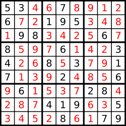

# DFS(深度优先搜索)

## A37. 解数独

难度`困难`

#### 题目描述

编写一个程序，通过已填充的空格来解决数独问题。

一个数独的解法需**遵循如下规则**：

1. 数字 `1-9` 在每一行只能出现一次。
2. 数字 `1-9` 在每一列只能出现一次。
3. 数字 `1-9` 在每一个以粗实线分隔的 `3x3` 宫内只能出现一次。

空白格用 `'.'` 表示。


一个数独。



答案被标成红色。

**Note:**

- 给定的数独序列只包含数字 `1-9` 和字符 `'.'` 。
- 你可以假设给定的数独只有唯一解。
- 给定数独永远是 `9x9` 形式的。

#### 题目链接

<https://leetcode-cn.com/problems/sudoku-solver/>

#### **思路:**

　　标准的dfs。  

#### **代码:**

```python
sys.setrecursionlimit(100000)

class Solution:
    def solveSudoku(self, board: List[List[str]]) -> None:
        """
        Do not return anything, modify board in-place instead.
        """
        fixed = [[False for _ in range(9)] for _ in range(9)]  # 记录原来就有的不能更改的
        row, col, room = [set() for _ in range(9)], [set() for _ in range(9)], [set() for _ in range(9)]  # 用三个集合分别记录每行、每列、每个九宫格用过了哪些数字

        def get_room(i, j):
            return i // 3 * 3 + j // 3

        for i in range(9):
            for j in range(9):
                if board[i][j] != '.':
                    fixed[i][j] = True
                    row[i].add(board[i][j])  # 行
                    col[j].add(board[i][j])  # 列
                    room[get_room(i, j)].add(board[i][j])  # 九宫格

        def dfs(n):  # n取值0 ~ 80，坐标 [n // 9][n % 9]
            while n < 81 and fixed[n // 9][n % 9]:
                n += 1  # 固定的不能修改的

            if n >= 81:
                return True

            x, y = n // 9, n % 9
            for i in range(1, 10):
                element = str(i)
                if element in row[x] or element in col[y] or element in room[get_room(x, y)]:
                    continue  # 这个数字不能用

                row[x].add(element)
                col[y].add(element)
                room[get_room(x, y)].add(element)  
                board[x][y] = str(i)  # (x,y)填上i，然后继续后面的尝试
                if dfs(n + 1):
                    return True
                row[x].remove(element)
                col[y].remove(element)
                room[get_room(x, y)].remove(element)
                board[x][y] = '.'  # 还原现场

            return False

        dfs(0)
```

## A40. 组合总和 II

难度 `中等`

#### 题目描述

给定一个数组 `candidates` 和一个目标数 `target` ，找出 `candidates` 中所有可以使数字和为 `target` 的组合。

`candidates` 中的每个数字在每个组合中只能使用一次。

**说明：**

- 所有数字（包括目标数）都是正整数。
- 解集不能包含重复的组合。 

> **示例 1:**

```
输入: candidates = [10,1,2,7,6,1,5], target = 8,
所求解集为:
[
  [1, 7],
  [1, 2, 5],
  [2, 6],
  [1, 1, 6]
]
```

> **示例 2:**

```
输入: candidates = [2,5,2,1,2], target = 5,
所求解集为:
[
  [1,2,2],
  [5]
]
```

#### 题目链接

<https://leetcode-cn.com/problems/combination-sum-ii/>

#### 思路  

　　dfs搜索，难点在于去重。  

　　方法一：用集合来去除重复出现的结果，缺点是效率较低。  

　　方法二：先排序，在每轮的`for`循环中，除了第一个元素外，不会使用和上一个重复的元素。  

#### 代码  

　　方法一：

```python
class Solution:
    def combinationSum2(self, candidates: List[int], target: int) -> List[List[int]]:
        ans = set()
        l = len(candidates)
        visited = [0 for i in range(l)]
        def dfs(n, target):
            nonlocal l
            if n >= l or candidates[n] > target or visited[n]:
                return
            visited[n] = candidates[n]
            if candidates[n] == target:
                temp = []
                for i, vis in enumerate(visited):
                    if vis:
                        temp.append(vis)
                ans.add(tuple(sorted(temp)))

            for i in range(n+1, l):
                dfs(i, target - candidates[n])
                visited[i] = 0

        for i in range(l):
            dfs(i, target)
            visited[i] = 0

        return [i for i in ans]
```

　　方法二：

```python
class Solution:
    def combinationSum2(self, candidates: List[int], target: int) -> List[List[int]]:
        candidates.sort()  # [1, 1, 2, 5, 6, 7, 10]
        ans = []
        l = len(candidates)

        def dfs(n, target, cur):
            nonlocal l
            for i in range(n, l):
                if i == n or candidates[i] != candidates[i-1]:  # 除了第一个元素外，不使用重复的
                    if target < candidates[i]:  # 剪枝
                        return
                    elif target == candidates[i]:
                        ans.append(cur + [candidates[i]])
                        return
                    cur.append(candidates[i])
                    dfs(i+1, target - candidates[i], cur)
                    cur.remove(candidates[i])

        dfs(0, target, [])

        return ans
```

## A79. 单词搜索

难度 `中等`  

#### 题目描述

给定一个二维网格和一个单词，找出该单词是否存在于网格中。

单词必须按照字母顺序，通过相邻的单元格内的字母构成，其中“相邻”单元格是那些水平相邻或垂直相邻的单元格。同一个单元格内的字母不允许被重复使用。

> **示例:**

```
board =
[
  ['A','B','C','E'],
  ['S','F','C','S'],
  ['A','D','E','E']
]

给定 word = "ABCCED", 返回 true
给定 word = "SEE", 返回 true
给定 word = "ABCB", 返回 false
```

#### 题目链接

<https://leetcode-cn.com/problems/word-search/>

#### 思路  

　　从每个字母开始dfs搜索。需要注意的是不要每次都新建`visited`数组，不然会超时。　　

#### 代码  

```python
class Solution:
    def exist(self, board: List[List[str]], word: str) -> bool:
        m = len(board)
        if not m:
            return False
        n = len(board[0])

        visited = [[False for j in range(n)] for i in range(m)]
        def dfs(i, j, word):
            if len(word) == 0:
                return True
            if i < 0 or j < 0 or i >= m or j >= n:  # 超出边界
                return False
            if board[i][j] != word[0] or visited[i][j]:  # 已经走过了或者字母不对
                return False
                
            visited[i][j] = True 

            if dfs(i-1, j, word[1:]) or dfs(i+1, j, word[1:]) \
            or dfs(i, j-1, word[1:]) or dfs(i, j+1, word[1:]):
                return True

            visited[i][j] = False

        for i in range(m):
            for j in range(n):
                if dfs(i, j, word):
                    return True

        return False

```

## A90. 子集 II

难度 `中等`  

#### 题目描述

给定一个可能包含重复元素的整数数组 ***nums*** ，返回该数组所有可能的子集（幂集）。

**说明：**解集不能包含重复的子集。

> **示例:**

```
输入: [1,2,2]
输出:
[
  [2],
  [1],
  [1,2,2],
  [2,2],
  [1,2],
  []
]
```

#### 题目链接

<https://leetcode-cn.com/problems/subsets-ii/>

#### 思路  

　　这题和[A78. 子集](/bit?id=a78-子集)类似，只不过多了重复的情况，需要在搜索时减枝，排除重复的方法与[A40. 组合总数 II](/dfs?id=a40-组合总和-ii)类似。  

　　先排序，在每轮的`for`循环中，除了第一个元素外，**不使用**和上一个重复的元素。

#### 代码  

```python
class Solution:
    def subsetsWithDup(self, nums: List[int]) -> List[List[int]]:
        nums.sort()
        ans = []
        l = len(nums)
        def dfs(n, temp):
            ans.append(temp.copy())
            nonlocal l
            for i in range(n, l):
                if i == n or nums[i] != nums[i-1]:  # 用不同递归次数来减枝
                    temp.append(nums[i])
                    dfs(i+1, temp)
                    temp.remove(nums[i])

        dfs(0, [])
        return ans
```

## A130. 被围绕的区域

难度`中等`

#### 题目描述

给定一个二维的矩阵，包含 `'X'` 和 `'O'`（**字母 O**）。

找到所有被 `'X'` 围绕的区域，并将这些区域里所有的 `'O'` 用 `'X'` 填充。

> **示例:**

```
X X X X
X O O X
X X O X
X O X X
```

运行你的函数后，矩阵变为：

```
X X X X
X X X X
X X X X
X O X X
```

**解释:**

被围绕的区间不会存在于边界上，换句话说，任何边界上的 `'O'` 都不会被填充为 `'X'`。 任何不在边界上，或不与边界上的 `'O'` 相连的 `'O'` 最终都会被填充为 `'X'`。如果两个元素在水平或垂直方向相邻，则称它们是“相连”的。

#### 题目链接

<https://leetcode-cn.com/problems/surrounded-regions/>

#### **思路:**

　　先沿着**边界的**每个`"O"`进行dfs，把所有搜索到的`"O"`都替换成`"F"`。  

　　然后把剩下的`”O“`都替换成`"X"`。  

　　最后把`"F"`再替换回`"O"`。

#### **代码:**

```python
class Solution:
    def solve(self, board: List[List[str]]) -> None:
        """
        Do not return anything, modify board in-place instead.
        """
        arounds = [(-1, 0), (1, 0), (0, -1), (0, 1)]
        m = len(board)
        if not m: return 
        n = len(board[0])
        def dfs(i, j):
            if i < 0 or j < 0 or i >= m or j >= n:
                return

            if board[i][j] != 'O':
                return

            board[i][j] = 'F'  # fixed
            for di, dj in arounds:
                dfs(i + di, j + dj)

        for i in range(m):
            for j in range(n):
                if i == 0 or i == m-1 or j == 0 or j == n-1:  # 边界
                    dfs(i, j)
            
        def replace(a, b):
            for i in range(m):
                for j in range(n):
                    if board[i][j] == a:
                        board[i][j] = b

        replace('O', 'X')
        replace('F', 'O')
        
```


## A200. 岛屿数量

难度`中等`

#### 题目描述

给定一个由 `'1'`（陆地）和 `'0'`（水）组成的的二维网格，计算岛屿的数量。一个岛被水包围，并且它是通过水平方向或垂直方向上相邻的陆地连接而成的。你可以假设网格的四个边均被水包围。

> **示例 1:**

```
输入:
11110
11010
11000
00000

输出: 1
```

> **示例 2:**

```
输入:
11000
11000
00100
00011

输出: 3
```

#### 题目链接

<https://leetcode-cn.com/problems/number-of-islands/>

#### **思路:**

　　经典dfs。遍历整个矩阵，从`任意"1"`的位置开始dfs，同时计数`+1`，搜索岛屿的过程中将搜索过的位置都置为`"0"`。最终计数的结果就是岛屿的数量。  

#### **代码:**

```python
class Solution:
    def numIslands(self, grid: List[List[str]]) -> int:
        arounds = [(-1, 0), (1, 0), (0, -1), (0, 1)]  # 上下左右
        m = len(grid)
        if not m:
            return 0
        n = len(grid[0])

        ans = 0
        def dfs(i, j):
            if i < 0 or j < 0 or i >= m or j >= n:
                return
            if grid[i][j] == "0":
                return 

            grid[i][j] = "0"
            for di, dj in arounds:
                dfs(i + di, j + dj)

        for i in range(m):
            for j in range(n):
                if grid[i][j] == "1":
                    ans += 1
                    dfs(i, j)

        return ans

```

## A207. 课程表

难度`中等`

#### 题目描述

你这个学期必须选修 `numCourse` 门课程，记为 `0` 到 `numCourse-1` 。

在选修某些课程之前需要一些先修课程。 例如，想要学习课程 0 ，你需要先完成课程 1 ，我们用一个匹配来表示他们：`[0,1]`

给定课程总量以及它们的先决条件，请你判断是否可能完成所有课程的学习？

> **示例 1:**

```
输入: 2, [[1,0]] 
输出: true
解释: 总共有 2 门课程。学习课程 1 之前，你需要完成课程 0。所以这是可能的。
```

> **示例 2:**

```
输入: 2, [[1,0],[0,1]]
输出: false
解释: 总共有 2 门课程。学习课程 1 之前，你需要先完成课程 0；并且学习课程 0 之前，你还应先完成课程 1。这是不可能的。
```

**提示：**

1. 输入的先决条件是由 **边缘列表** 表示的图形，而不是 邻接矩阵 。详情请参见[图的表示法](http://blog.csdn.net/woaidapaopao/article/details/51732947)。
2. 你可以假定输入的先决条件中没有重复的边。
3. `1 <= numCourses <= 10^5`

#### 题目链接

<https://leetcode-cn.com/problems/course-schedule/>

#### **思路:**

　　拓扑排序。构建的邻接表就是我们通常认识的邻接表，每一个结点存放的是后继结点的集合。

　　该方法的每一步总是输出当前无前趋（即入度为零）的顶点。

　　对应到本题，每一步总是学习**当前无先修课程的**课程。然后把这些学过的课程从其他课程的先修课程中移除。同时把`未学习课程集合`中减去已学习的课程。    

　　最终判断`未学习课程集合`是否为空。  

#### **代码:**

```python
from collections import defaultdict

class Solution:
    def canFinish(self, numCourses: int, prerequisites: List[List[int]]) -> bool: 
        dict_p = defaultdict(list)
        dict_after = defaultdict(list)

        for curr, pre in prerequisites:
            dict_p[curr].append(pre)  # 邻接表
            dict_after[pre].append(curr)  # 逆邻接表

        # print(dict_p)
        not_learned = set(range(numCourses))  # 未学习课程的集合
        while True:
            new_learned = set()
            for i in not_learned:
                if not dict_p[i]:  # 没有先修课程的课程，都可以学
                    new_learned.add(i)

            if not new_learned:  # 无法学习新课程，结束循环
                break
            for learned in new_learned:
                for after in dict_after[learned]:
                    dict_p[after].remove(learned)  # 从其他课程的先决条件里去掉已经学过的课 

            not_learned = not_learned - new_learned  # 集合差集

        return len(not_learned) == 0
```

## A210. 课程表 II

难度`中等`

#### 题目描述

现在你总共有 *n* 门课需要选，记为 `0` 到 `n-1`。

在选修某些课程之前需要一些先修课程。 例如，想要学习课程 0 ，你需要先完成课程 1 ，我们用一个匹配来表示他们: `[0,1]`

给定课程总量以及它们的先决条件，返回你为了学完所有课程所安排的学习顺序。

可能会有多个正确的顺序，你只要返回一种就可以了。如果不可能完成所有课程，返回一个空数组。

> **示例 1:**

```
输入: 2, [[1,0]] 
输出: [0,1]
解释: 总共有 2 门课程。要学习课程 1，你需要先完成课程 0。因此，正确的课程顺序为 [0,1] 。
```

> **示例 2:**

```
输入: 4, [[1,0],[2,0],[3,1],[3,2]]
输出: [0,1,2,3] or [0,2,1,3]
解释: 总共有 4 门课程。要学习课程 3，你应该先完成课程 1 和课程 2。并且课程 1 和课程 2 都应该排在课程 0 之后。
     因此，一个正确的课程顺序是 [0,1,2,3] 。另一个正确的排序是 [0,2,1,3] 。
```

**说明:**

1. 输入的先决条件是由**边缘列表**表示的图形，而不是邻接矩阵。详情请参见[图的表示法](http://blog.csdn.net/woaidapaopao/article/details/51732947)。
2. 你可以假定输入的先决条件中没有重复的边。

**提示:**

1. 这个问题相当于查找一个循环是否存在于有向图中。如果存在循环，则不存在拓扑排序，因此不可能选取所有课程进行学习。
2. [通过 DFS 进行拓扑排序](https://www.coursera.org/specializations/algorithms) - 一个关于Coursera的精彩视频教程（21分钟），介绍拓扑排序的基本概念。
3. 拓扑排序也可以通过 [BFS](https://baike.baidu.com/item/宽度优先搜索/5224802?fr=aladdin&fromid=2148012&fromtitle=广度优先搜索) 完成。

#### 题目链接

<https://leetcode-cn.com/problems/course-schedule-ii/>

#### **思路:**

　　和上一题[A207. 课程表](/dfs?id=a207-课程表)一样，新增记录顺序即可。  

#### **代码:**

```python
from collections import defaultdict

class Solution:
    def findOrder(self, numCourses: int, prerequisites: List[List[int]]) -> List[int]:
        dict_p = defaultdict(list)
        dict_after = defaultdict(list)

        for curr, pre in prerequisites:
            dict_p[curr].append(pre)  # 邻接表
            dict_after[pre].append(curr)  # 逆邻接表

        # print(dict_p)
        not_learned = set(range(numCourses))  # 未学习课程的集合
        ans = []
        while True:
            new_learned = set()
            for i in not_learned:
                if not dict_p[i]:  # 没有先修课程的课程，都可以学
                    new_learned.add(i)

            if not new_learned:  # 无法学习新课程，结束循环
                break
            for learned in new_learned:
                ans.append(learned)
                for after in dict_after[learned]:
                    dict_p[after].remove(learned)  # 从其他课程的先决条件里去掉已经学过的课 

            not_learned = not_learned - new_learned  # 集合差集

        if len(not_learned) == 0:  # 能学完所有课程
            return ans
        else:
            return []
```

## A301. 删除无效的括号

难度`困难`

#### 题目描述

删除最小数量的无效括号，使得输入的字符串有效，返回所有可能的结果。

**说明:** 输入可能包含了除 `(` 和 `)` 以外的字符。

> **示例 1:**

```
输入: "()())()"
输出: ["()()()", "(())()"]
```

> **示例 2:**

```
输入: "(a)())()"
输出: ["(a)()()", "(a())()"]
```

> **示例 3:**

```
输入: ")("
输出: [""]
```

#### 题目链接

<https://leetcode-cn.com/problems/remove-invalid-parentheses/>

#### **思路:**

　　dfs。第一遍搜索找到`最少删除括号的个数`。  

　　第二遍搜索以`最少删除括号的个数`为剪枝条件，寻找所有括号匹配的可能性。  

　　用`set`去除重复。

#### **代码:**

```python
class Solution:
    def removeInvalidParentheses(self, s: str) -> List[str]:
        ls = len(s)
        ans = set()
        minimum_delete = ls  # 最小删除的括号数
        def dfs(i, cnt, del_cnt, max_delte, cur): # s[i:] cnt个左括号 删了几个 最多删几个括号, 当前字符串
            nonlocal minimum_delete
            if del_cnt > max_delte:
                return False
            if i >= ls:
                if cnt == 0:
                    minimum_delete = del_cnt
                    # print(del_cnt)
                    ans.add(cur)
                    if max_delte == float('inf'):
                        return True  # return True可以确保找最小删除数的时候不重复搜索
                return False

            if s[i] == '(':  # 要么用这个左括号 要么不用
                if dfs(i+1, cnt+1, del_cnt, max_delte, cur + '('):  # 用(
                    return True
                return dfs(i+1, cnt, del_cnt+1, max_delte, cur) # 不用(
              
            elif s[i] == ')':
                if cnt > 0 and dfs(i+1, cnt - 1, del_cnt, max_delte, cur+')'):  # 用)
                    return True
                return dfs(i+1, cnt, del_cnt+1, max_delte, cur)   # 不用)
              
            else:  # 非括号字符
                return dfs(i+1, cnt, del_cnt, max_delte, cur + s[i])
            
        
        dfs(0, 0, 0, float('inf'), '')  # 第一次dfs，找到最少删几个括号
        ans.clear()
        dfs(0, 0, 0, minimum_delete, '')  # 第二次dfs，找到所有的结果
        return [a for a in ans]
      
```

## A329. 矩阵中的最长递增路径

难度`困难`

#### 题目描述

给定一个整数矩阵，找出最长递增路径的长度。

对于每个单元格，你可以往上，下，左，右四个方向移动。 你不能在对角线方向上移动或移动到边界外（即不允许环绕）。

> **示例 1:**

```
输入: nums = 
[
  [9,9,4],
  [6,6,8],
  [2,1,1]
] 
输出: 4 
解释: 最长递增路径为 [1, 2, 6, 9]。
```

> **示例 2:**

```
输入: nums = 
[
  [3,4,5],
  [3,2,6],
  [2,2,1]
] 
输出: 4 
解释: 最长递增路径是 [3, 4, 5, 6]。注意不允许在对角线方向上移动。
```

#### 题目链接

<https://leetcode-cn.com/problems/longest-increasing-path-in-a-matrix/>

#### **思路:**

　　**方法一：**dfs记忆化搜索。先从矩阵中找到所有**四周元素都不比自己小**的元素作为起点，从它们开始dfs。用数组`dp[i][j]`记录从开始位置到某个位置的最长路径，如果某个元素不能使周围元素的`dp`变大，就不再继续往下搜索了，起到剪枝的效果。  　　

　　**方法二：**动态规划。先预处理，对矩阵的值按从小到大排序，按大小顺序才能保证依赖的子问题都求解过了。

　　`dp[i][j]`表示以`matrix[i][j]`结尾的最长递增长度。

- 初始`dp[i][j]`都等于1；  
- 若`matrix[i][j]`四个方向有任意小于它，则可以更新`dp[i][j] = max(dp[i][j], 1 + dp[r][c])`。  

#### **代码:**  

　　**方法一：**dfs记忆化搜索 (1036 ms)  

```python
class Solution:
    def longestIncreasingPath(self, matrix: List[List[int]]) -> int:
        arounds = [(-1, 0), (1, 0), (0, -1), (0, 1)]  # 上下左右
        # matrix = grid = board
        m = len(matrix)
        if not m: return 0
        n = len(matrix[0])
        dp = [[1 for _ in range(n)] for _ in range(m)]
        visited = [[False for _ in range(n)] for _ in range(m)]
        ans = 0

        def dfs(i, j, depth, from_num):
            nonlocal ans
            if i < 0 or j < 0 or i >= m or j >= n:  # 边界
                return

            if visited[i][j] or matrix[i][j] <= from_num:  # 不能走
                return

            visited[i][j] = True
            depth += 1
            ans = max(ans, depth)
            dp[i][j] = depth

            temp = []
            for di, dj in arounds:
                x, y = i + di, j+ dj
                if x < 0 or y < 0 or x >= m or y >= n or visited[x][y]:
                    continue
                if dp[x][y] < depth + 1:  # 无法更优就不搜索了
                    temp.append((matrix[x][y] - matrix[i][j], x, y))

            temp.sort()  # 从相邻的数字中小的开始搜索
            for _, x, y in temp:
                dfs(x, y, depth, matrix[i][j])

            visited[i][j] = False

        def get(i, j):
            if i < 0 or j < 0 or i >= m or j >= n:  # 边界
                return float('inf')
            return matrix[i][j]

        for i in range(m):
            for j in range(n):
                num = matrix[i][j]
                if all([get(i + di, j + dj) >= num for di, dj in arounds]):  # 四周没有更小的数
                    dfs(i, j, 0, float('-inf'))

        return ans
```

　　**方法二：**动态规划 (516ms)

```python
class Solution(object):
    def longestIncreasingPath(self, matrix):
        if not matrix or not matrix[0]:
            return 0
        m, n = len(matrix), len(matrix[0])
        lst = []
        for i in range(m):
            for j in range(n):
                lst.append((matrix[i][j], i, j))
        lst.sort()
        dp = [[0 for _ in range(n)] for _ in range(m)]
        for num, i, j in lst:
            dp[i][j] = 1
            for di, dj in [(0, 1), (1, 0), (0, -1), (-1, 0)]:
                r, c = i + di, j + dj
                if 0 <= r < m and 0 <= c < n:
                    if matrix[i][j] > matrix[r][c]:
                        dp[i][j] = max(dp[i][j], 1 + dp[r][c])
        return max([dp[i][j] for i in range(m) for j in range(n)])
      
```

## A386. 字典序排数

难度`中等`

#### 题目描述

给定一个整数 *n*, 返回从 *1* 到 *n* 的字典顺序。

例如，

给定 *n* =13，返回 [1,10,11,12,13,2,3,4,5,6,7,8,9] 。

请尽可能的优化算法的时间复杂度和空间复杂度。 输入的数据 *n* 小于等于 5,000,000。

#### 题目链接

<https://leetcode-cn.com/problems/lexicographical-numbers/>

#### **思路:**

　　可以用dfs，也可以用python自带的排序，用转换成字符串以后的类型作为key。  

#### **代码:**

```python
class Solution:
    def lexicalOrder(self, n: int) -> List[int]:
        ans = []
        def dfs(x):
            nonlocal n
            if x <= n:
                ans.append(x)
            else:
                return

            x = x * 10
            for i in range(10):
                dfs(x+i)

        for i in range(1, 10):
            dfs(i)

        return ans     

```


