# 动态规划

## A32. 最长有效括号

难度 `困难`  
#### 题目描述

给定一个只包含 `'('` 和 `')'` 的字符串，找出最长的包含有效括号的子串的长度。

> **示例 1:**

```
输入: "(()"
输出: 2
解释: 最长有效括号子串为 "()"
```

> **示例 2:**

```
输入: ")()())"
输出: 4
解释: 最长有效括号子串为 "()()"
```

#### 题目链接

<https://leetcode-cn.com/problems/longest-valid-parentheses/>


#### 思路  

　　方法一：对字符串遍历，进行括弧有效性验证，出现`(`时候`symbol_count`+`1`，出现`')'`时`symbol_count`-`1`，记录`symbol_count`为`0`时的最大长度。同样的方式，倒序再来一次，取最大值。  

　　方法二：动态规划。`dp[i]`表示以`i`结尾的最长有效括号长度。

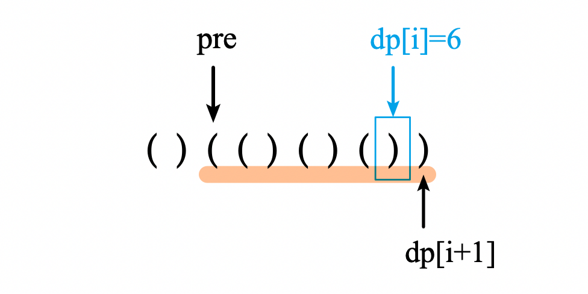

　　如上图所示，假设`dp[i]`=`6`。那么计算`dp[i+1]`时，如果遇到`')'`，会到`pre`(即`i-dp[i]`)的位置寻找`'('`，如果找到了，则`dp[i+1]`=`dp[i]`+`2`=`8`。并且还要把`pre`之前的也考虑上，即`dp[i+1]`+=`dp[pre - 1]`=`8 + 2`=`10`。  

　　方法三：用一个栈记录下标，初始栈为`[-1]`，当前元素为`'('`时入栈，为`')'`时出栈。如果栈为空了则将当前元素下标入栈。  

#### 代码  

　　方法一：

```python
class Solution:
    def longestValidParentheses(self, s: str) -> int:
        def helper(s, symbol):  # '(' or ')'
            ans = 0
            symbol_count = 0
            cur_length = 0
            for char in s:
                cur_length += 1
                if char == symbol:
                    symbol_count += 1
                else:
                    symbol_count -= 1
                    if symbol_count < 0:
                        symbol_count = 0
                        cur_length = 0
                    elif symbol_count == 0: 
                        ans = max(ans, cur_length)
            return ans

        return max(helper(s, '('), helper(s[::-1], ')'))
```

　　方法二：

```python
class Solution:
    def longestValidParentheses(self, s: str) -> int:
        n = len(s)
        if n == 0:
            return 0
        dp = [0 for i in range(n)]
        for i in range(1, n):
            char = s[i]
            if char == ')':
                pre = i - dp[i-1] -1
                if pre >= 0 and s[pre] == '(':
                    dp[i] = dp[i-1] + 2
                    if pre > 0:
                        dp[i] += dp[pre - 1]

        return max(dp)
```

　　方法三：

```python
class Solution:
    def longestValidParentheses(self, s: str) -> int:
        stack = [-1]
        max_path = 0
        for idx,char in enumerate(s):
            if char == '(':
                stack.append(idx)
            else:
                stack.pop() #匹配括号出栈
                if not stack:# 如果没有开始下标
                    stack.append(idx)
                else:
                    path = idx - stack[-1] #保存的开始下标
                    if path > max_path:
                        max_path = path
        return max_path
```

## A39. 组合总和

难度 `中等`

#### 题目描述

给定一个**无重复元素**的数组 `candidates` 和一个目标数 `target` ，找出 `candidates` 中所有可以使数字和为 `target` 的组合。

`candidates` 中的数字可以无限制重复被选取。

**说明：**

- 所有数字（包括 `target`）都是正整数。
- 解集不能包含重复的组合。 

> **示例 1:**

```
输入: candidates = [2,3,6,7], target = 7,
所求解集为:
[
  [7],
  [2,2,3]
]
```

> **示例 2:**

```
输入: candidates = [2,3,5], target = 8,
所求解集为:
[
  [2,2,2,2],
  [2,3,3],
  [3,5]
]
```

#### 题目链接

<https://leetcode-cn.com/problems/combination-sum/>

#### 思路  

　　动态规划。`dp[i]`记录数字`i`的所有组成情况。如示例1对应`dp[2] = [[2]]`，`dp[4] = [[2, 2]]`。从`1`到`target`迭代。  

#### 代码  

```python
class Solution:
    def combinationSum(self, candidates: List[int], target: int) -> List[List[int]]:
        candidates.sort()
        dp = [[] for i in range(target+1)]
        for num in candidates:
            if num > target:
                continue
            dp[num] = [(num,)]  # 一个数字组成的组合
            
        for i in range(1, target+1):
            for num in candidates:
                if i-num > 0 and len(dp[i-num])>0:
                    for combine in dp[i-num]:
                        a = list(combine)
                        if num >= a[-1]:  # 确保新的组合是有序的
                            a.append(num)
                            if tuple(a) not in dp[i]:
                                dp[i].append(tuple(a))

        return dp[target]
```

## A44. 通配符匹配

难度 `困难`  
#### 题目描述

给定一个字符串 (`s`) 和一个字符模式 (`p`) ，实现一个支持 `'?'` 和 `'*'` 的通配符匹配。

```
'?' 可以匹配任何单个字符。
'*' 可以匹配任意字符串（包括空字符串）。
```

两个字符串**完全匹配**才算匹配成功。

**说明:**

- `s` 可能为空，且只包含从 `a-z` 的小写字母。
- `p` 可能为空，且只包含从 `a-z` 的小写字母，以及字符 `?` 和 `*`。

> **示例 1:**

```
输入:
s = "aa"
p = "a"
输出: false
解释: "a" 无法匹配 "aa" 整个字符串。
```

> **示例 2:**

```
输入:
s = "aa"
p = "*"
输出: true
解释: '*' 可以匹配任意字符串。
```

> **示例 3:**

```
输入:
s = "cb"
p = "?a"
输出: false
解释: '?' 可以匹配 'c', 但第二个 'a' 无法匹配 'b'。
```

> **示例 4:**

```
输入:
s = "adceb"
p = "*a*b"
输出: true
解释: 第一个 '*' 可以匹配空字符串, 第二个 '*' 可以匹配字符串 "dce".
```

> **示例 5:**

```
输入:
s = "acdcb"
p = "a*c?b"
输入: false
```

#### 题目链接

<https://leetcode-cn.com/problems/wildcard-matching/>


#### 思路  

　　动态规划，用`dp[j][i]`表示`p[0~j]`能否匹配`s[0~i]`。  

　　空字符串只能被`空字符串`或`全是*的字符串`匹配。  

　　如果匹配串当前为`?`，或者当前`p[j]`=`s[i]`，则`dp[j][i]` =`dp[j-1][i-1]`。  

　　如果匹配串当前为`*`，则`dp[j][i]`=`dp[j][i-1]`or`dp[j-1][i]`。  

#### 代码  

　　版本一(空字符串做特例处理)：

```python
class Solution:
    def isMatch(self, s: str, p: str) -> bool:
        # p[:j] 如果能匹配 s[:i]
        if len(s) == 0:
            return len(p.strip('*')) == 0
        elif len(p) == 0:
            return False

        dp = [[False for i in range(len(s))] for j in range(len(p))]
        for j in range(len(p)):
            for i in range(len(s)):
                if j == 0:  # 长度为1的pattern
                    dp[j][i] = p[0] == '*' or (i==0 and (p[0] == '?' or p[0] == s[0])) 
                    continue
                if i == 0:  # 长度大于1的pattern匹配长度为1的s
                    t = p[:j+1].strip('*') 
                    dp[j][i] = t == '' or t == '?' or t == s[0]
                    continue

                if p[j] == '?':
                    dp[j][i] = dp[j-1][i-1]
                elif p[j] == '*':
                    dp[j][i] = any(dp[j-1][:i+1])
                else:
                    dp[j][i] = p[j]==s[i] and dp[j-1][i-1]
            
        return dp[-1][-1]
```

　　简化版(dp数组中考虑空字符串)：

```python
class Solution:
    def isMatch(self, s: str, p: str) -> bool:
        # p[:j] 如果能匹配 s[:i]
        ls = len(s)
        lp = len(p)

        dp = [[False for i in range(ls+1)] for j in range(lp+1)]
        dp[0][0] = True # 空匹配空
        for j in range(1, lp+1):  # 多个*匹配空字符串
            if p[j-1] == '*': dp[j][0] = True
            else: break

        for i in range(1, ls+1):
            for j in range(1, lp+1):
                if p[j-1] == '?' or p[j-1] == s[i-1]:
                    dp[j][i] = dp[j-1][i-1]
                elif p[j-1] == '*':
                    dp[j][i] = dp[j][i-1] or dp[j-1][i]
            
        return dp[-1][-1]
```

## A53. 最大子序和

难度 `简单`

#### 题目描述

给定一个整数数组 `nums` ，找到一个具有最大和的连续子数组（子数组最少包含一个元素），返回其最大和。

> **示例:**

```
输入: [-2,1,-3,4,-1,2,1,-5,4],
输出: 6
解释: 连续子数组 [4,-1,2,1] 的和最大，为 6。
```

> **进阶:**

如果你已经实现复杂度为 O(*n*) 的解法，尝试使用更为精妙的分治法求解。 

#### 题目链接

<https://leetcode-cn.com/problems/maximum-subarray/>


#### 思路  

　　方法一：分治法。将列表`nums`从中间切成两半，最大子序和要么在左半边，要么在右半边，要么横跨左右两边。即`maxSubArray(i, j)` = max(`maxSubArray(i, mid)`，`maxSubArray(mid, j)`，`crossOver(mid)`)。  
　　左右两边的最大子序和均使用递归来计算，横跨的最大子序和使用循环来计算。分治法的时间复杂度为`O(nlogn)`。**提交方法一的代码会超时**。  

　　方法二：动态规划。用`m[i]`记录以某个元素为最后一个元素时的最大子序和。如果以前一个数结尾的最大子序和为负数，那么当前的数不使用之前的数反而更大。  

　　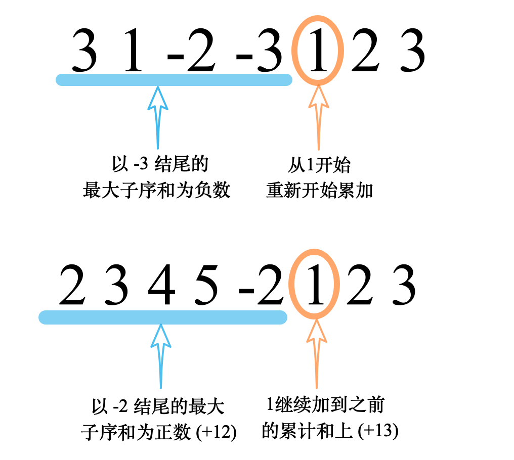

　　一次遍历后。`m[i]`的`全局最大值`即为整个数组的最大子序和。  这种方法的时间复杂度为`O(n)`；若用固定空间来存放`m[i]`，空间复杂度为`O(1)`。  


#### 代码  

　　方法一(分治法)：

```python
class Solution:
    
    def maxSubArray(self, nums: List[int]) -> int:
        def helper(nums, i, j):
            if j <= i:
                return -99999
            if (j-i) == 1:
                return nums[i]

            mid = (i + j) // 2
            left = helper(nums, i, mid)  # 计算左半边的最大子序和
            right = helper(nums, mid, j)  # 计算右半边的最大子序和
            ans = now_sum = nums[mid-1] + nums[mid]
            # 计算中间的最大子序和
            for i in range(mid-2, -1, -1):
                now_sum += nums[i]
                ans = max(ans, now_sum)
            now_sum = ans
            for i in range(mid+1, len(nums)):
                now_sum += nums[i]
                ans = max(ans, now_sum)

            return max(left, right, ans)

        return helper(nums, 0, len(nums))

```

　　方法二：

```python
class Solution:
    
    def maxSubArray(self, nums: List[int]) -> int:
        n = len(nums)
        if n == 1:
            return nums[0]
        ans = m_i = nums[0]  # 以某个结点为最后一个元素的最大子序和
        for i in range(1, n):
            num = nums[i]
            # 更新下一个i的m_i
            if m_i <= 0:
                m_i = num
            else:
                m_i += num
            ans = max(ans, m_i)
        return ans

```

## A62. 不同路径

难度 `中等`

#### 题目描述

一个机器人位于一个 *m x n* 网格的左上角 （起始点在下图中标记为“Start” ）。

机器人每次只能向下或者向右移动一步。机器人试图达到网格的右下角（在下图中标记为“Finish”）。

问总共有多少条不同的路径？


例如，上图是一个7 x 3 的网格。有多少可能的路径？

 

> **示例 1:**

```
输入: m = 3, n = 2
输出: 3
解释:
从左上角开始，总共有 3 条路径可以到达右下角。
1. 向右 -> 向右 -> 向下
2. 向右 -> 向下 -> 向右
3. 向下 -> 向右 -> 向右
```

> **示例 2:**

```
输入: m = 7, n = 3
输出: 28
```

#### 题目链接

<https://leetcode-cn.com/problems/unique-paths/>


#### 思路  


　　\# 没入门动态规划之前，大佬：用动态规划可解 稍微入门动态规划后，大佬：一个方程就可解。  

　　\# 我：？？？  

　　方法一：动态规划。上边界和左边界的路径数为1。其他位置的路径数等于`上边格子的路径数`+`左边格子的路径数`。  

　　方法二：机器人一定会走`m + n - 2`步，即从`m + n - 2`中挑出`m - 1`步向下走不就行了吗？即`C((m + n - 2), (m - 1))`。  

#### 代码  

　　方法一：  

```python
class Solution:
    def uniquePaths(self, m: int, n: int) -> int:
        if not m or not n:
            return 0
        # m * n
        ans = [[1 for i in range(m)] for j in range(n)]

        for i in range(1, n):
            for j in range(1, m):
                ans[i][j] = ans[i-1][j] + ans[i][j-1]

        return ans[n-1][m-1]
```

　　方法二：  

```python
class Solution:
    def uniquePaths(self, m: int, n: int) -> int:
        def factor(num):
            if num < 2:
                return 1
            res = 1
            for i in range(1, num+1):
                res *= i
            return res

        def A(m, n):
            return factor(m) // factor(m-n)

        def C(m, n):
            return A(m, n) // factor(n)

        return C(m+n-2,m-1)
         
```

## A63. 不同路径 II

难度 `中等`

#### 题目描述

一个机器人位于一个 *m x n* 网格的左上角 （起始点在下图中标记为“Start” ）。

机器人每次只能向下或者向右移动一步。机器人试图达到网格的右下角（在下图中标记为“Finish”）。

现在考虑网格中有障碍物。那么从左上角到右下角将会有多少条不同的路径？


网格中的障碍物和空位置分别用 `1` 和 `0` 来表示。

**说明：***m* 和 *n* 的值均不超过 100。

> **示例 1:**

```
输入:
[
  [0,0,0],
  [0,1,0],
  [0,0,0]
]
输出: 2
解释:
3x3 网格的正中间有一个障碍物。
从左上角到右下角一共有 2 条不同的路径：
1. 向右 -> 向右 -> 向下 -> 向下
2. 向下 -> 向下 -> 向右 -> 向右
```

#### 题目链接

<https://leetcode-cn.com/problems/unique-paths-ii/>

#### 思路  

　　\# 解法倒是简单，但是数据卡人。会有傻x把障碍放在入口？？？？？？？？？？？？？  

　　\# 网友：是的，防止疫情扩散，所以做隔离  

　　动态规划。所有有障碍物的位置路径数为`0`。先把第一行和第一列算好。其他位置的路径数等于`上边格子的路径数`+`左边格子的路径数`。  

#### 代码  
```python
class Solution:
    def uniquePathsWithObstacles(self, obstacleGrid: List[List[int]]) -> int:
        # m * n
        m = len(obstacleGrid)
        n = len(obstacleGrid[0])
        if obstacleGrid[0][0] == 1:  # 开始就是障碍物
            return 0

        ans = [[1 if not obstacleGrid[i][j] else 0 for j in range(n)] for i in range(m)]
        print(ans)
        for i in range(m):
            for j in range(n):
                if obstacleGrid[i][j] == 0:
                    if i == 0 and j == 0:
                        pass
                    elif i == 0:
                        ans[i][j] = ans[i][j-1]
                    elif j == 0:
                        ans[i][j] = ans[i-1][j]
                    else:
                        ans[i][j] = ans[i-1][j] + ans[i][j-1]

        return ans[m-1][n-1]
      
```

## A64. 最小路径和 

难度 `中等`

#### 题目描述

给定一个包含非负整数的 *m* x *n* 网格，请找出一条从左上角到右下角的路径，使得路径上的数字总和为最小。

**说明：**每次只能向下或者向右移动一步。

> **示例:**

```
输入:
[
  [1,3,1],
  [1,5,1],
  [4,2,1]
]
输出: 7
解释: 因为路径 1→3→1→1→1 的总和最小。
```

#### 题目链接

<https://leetcode-cn.com/problems/minimum-path-sum/>


#### 思路  


　　动态规划。先将第一行和第一列算好，再选较小的与自身相加。  

#### 代码  
```python
class Solution:
    def minPathSum(self, grid: List[List[int]]) -> int:
        m = len(grid)
        if m == 0:
            return 0

        n = len(grid[0])
        ans = [[0 for i in range(n)] for j in range(m)]
        for i in range(m):
            for j in range(n):
                if i == 0 and j == 0:
                    ans[i][j] = grid[i][j]
                elif i == 0:
                    ans[i][j] = grid[i][j] +  ans[i][j-1]
                elif j == 0:
                    ans[i][j] = grid[i][j] +  ans[i-1][j]
                else:
                    ans[i][j] = grid[i][j] +  min(ans[i-1][j], ans[i][j-1])

        return ans[m-1][n-1]
```

## A70. 爬楼梯

难度 `简单`  
#### 题目描述

假设你正在爬楼梯。需要 *n* 阶你才能到达楼顶。

每次你可以爬 1 或 2 个台阶。你有多少种不同的方法可以爬到楼顶呢？

**注意：**给定 *n* 是一个正整数。

> **示例 1：**

```
输入： 2
输出： 2
解释： 有两种方法可以爬到楼顶。
1.  1 阶 + 1 阶
2.  2 阶
```

> **示例 2：**

```
输入： 3
输出： 3
解释： 有三种方法可以爬到楼顶。
1.  1 阶 + 1 阶 + 1 阶
2.  1 阶 + 2 阶
3.  2 阶 + 1 阶
```

#### 题目链接

<https://leetcode-cn.com/problems/climbing-stairs/>


#### 思路  


　　动态规划。最后一步必定为走`1`个台阶或`2`个台阶。因此有递推公式`dp[i]`=`dp[i-1]`+`dp[i-2]`。  

#### 代码  
```python
class Solution(object):
    def climbStairs(self, n):
        """
        :type n: int
        :rtype: int
        """
        if n == 0:
            return 1
        dp = [0 for i in range(n+1)]
        dp[0] = dp[1] = 1
        for i in range(2, n+1):
            dp[i] = dp[i-1] + dp[i-2]

        # print(dp)
        return dp[-1]
      
```

## A72. 编辑距离

难度 `困难`  
#### 题目描述

给定两个单词 *word1* 和 *word2* ，计算出将 *word1* 转换成 *word2* 所使用的最少操作数 。

你可以对一个单词进行如下三种操作：

1. 插入一个字符
2. 删除一个字符
3. 替换一个字符

> **示例 1:**

```
输入: word1 = "horse", word2 = "ros"
输出: 3
解释: 
horse -> rorse (将 'h' 替换为 'r')
rorse -> rose (删除 'r')
rose -> ros (删除 'e')
```

> **示例 2:**

```
输入: word1 = "intention", word2 = "execution"
输出: 5
解释: 
intention -> inention (删除 't')
inention -> enention (将 'i' 替换为 'e')
enention -> exention (将 'n' 替换为 'x')
exention -> exection (将 'n' 替换为 'c')
exection -> execution (插入 'u')
```

#### 题目链接

<https://leetcode-cn.com/problems/edit-distance/>


#### 思路  

　　动态规划，令`dp[i][j]`表示`word1[:i]`变成`word2[:j]`的最少操作数。  

　　先考虑为空时的情况，`word1`为空时，`''`变成`word2[:j]`需要加上`j`个个字符。同样，`word2`为空时，`word1[:i]`变成`''`需要减去`i`个字符。因此，`dp[0][j]`=`j`，`dp[i][0]`=`i`。  

　　考虑不为空的情况。如果两个字符串当前的末尾相同，即`word1[i-1]`==`word2[j-1]`，那么`dp[i][j]`=`dp[i-1][j-1]`。如下如所示：  

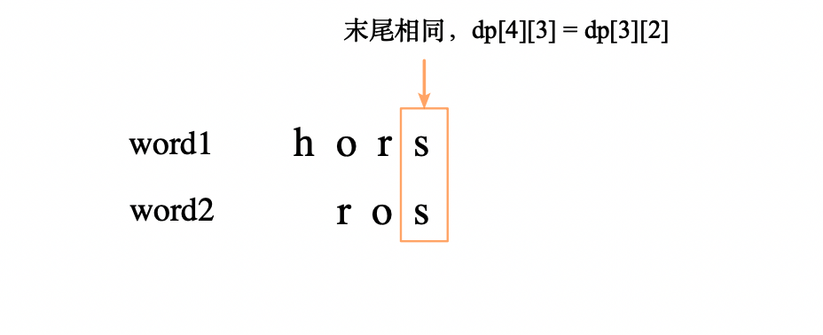  

　　如果两个字符串当前的末尾不同，那么有三种处理方式。即1. `删除word1末尾的元素`，然后按`dp[i-1][j]`处理；2. `将word1末尾的元素替换成word2末尾的元素`，然后按`dp[i-1][j-1]`处理；3. `在word1末尾添加word2末尾的元素`，然后按`dp[i][j-1]`处理。如下图所示：  

  

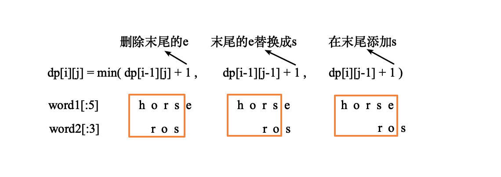

　　最终`dp[i][j]`的值为这三种操作的操作次数中最少的。即`dp[i][j]`=min(`dp[i-1][j-1]`,`dp[i-1][j]`,`dp[i][j-1]`)+`1`。  

#### 代码  

```python
class Solution(object):
    def minDistance(self, word1, word2):
        """
        :type word1: str
        :type word2: str
        :rtype: int
        """
        # word1[i] word2[j]
        # dp[i][j] 表示 word1[i] 变成 word2[j]的最少操作数
        l1, l2 = len(word1), len(word2)
        dp = [[0 for j in range(l2+1)]for i in range(l1+1)]
        for i in range(l1+1):
            for j in range(l2+1):
                if i == 0:
                    dp[i][j] = j
                elif j == 0:
                    dp[i][j] = i
                else:
                    if word1[i-1] == word2[j-1]:
                        dp[i][j] = dp[i-1][j-1]
                    else:
                        dp[i][j] = min(dp[i-1][j-1], dp[i-1][j], dp[i][j-1]) + 1
        # print(dp)
        return dp[-1][-1]
```

## A87. 扰乱字符串

难度 `困难`  
#### 题目描述

给定一个字符串 *s1*，我们可以把它递归地分割成两个非空子字符串，从而将其表示为二叉树。

下图是字符串 *s1* = `"great"` 的一种可能的表示形式。

```
    great
   /    \
  gr    eat
 / \    /  \
g   r  e   at
           / \
          a   t
```

在扰乱这个字符串的过程中，我们可以挑选任何一个非叶节点，然后交换它的两个子节点。

例如，如果我们挑选非叶节点 `"gr"` ，交换它的两个子节点，将会产生扰乱字符串 `"rgeat"` 。

```
    rgeat
   /    \
  rg    eat
 / \    /  \
r   g  e   at
           / \
          a   t
```

我们将 `"rgeat”` 称作 `"great"` 的一个扰乱字符串。

同样地，如果我们继续交换节点 `"eat"` 和 `"at"` 的子节点，将会产生另一个新的扰乱字符串 `"rgtae"` 。

```
    rgtae
   /    \
  rg    tae
 / \    /  \
r   g  ta  e
       / \
      t   a
```

我们将 `"rgtae”` 称作 `"great"` 的一个扰乱字符串。

给出两个长度相等的字符串 *s1* 和 *s2*，判断 *s2* 是否是 *s1* 的扰乱字符串。

> **示例 1:**

```
输入: s1 = "great", s2 = "rgeat"
输出: true
```

> **示例 2:**

```
输入: s1 = "abcde", s2 = "caebd"
输出: false
```

#### 题目链接

<https://leetcode-cn.com/problems/scramble-string/>

#### 思路  

　　这题的主要难点在于理解题意。根据题意，`s2`是`s1`的**扰乱字符串**的充分必要条件为：把它们分成两部分，这两部分都互为扰乱字符串。划分方式有以下两种：  

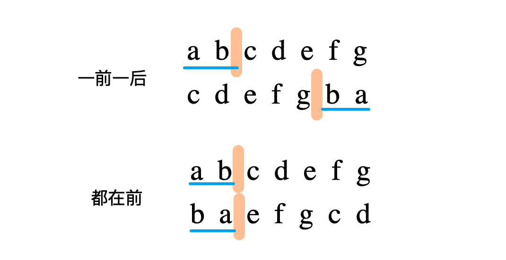

　　因此只要递归地判断即可。对于一前一后的划分方式，`s1[:i]`与`s2[n-i:]`互为扰乱字符串，并且`s1[i:]`和`s2[:n-i]`互为扰乱字符串。  

　　下面两个结论可以在递归判断中简化问题：  

　　1、如果两个字符串互为扰乱字符串，那么它们出现的字母一定是相同的。  

　　2、相同的字符串互为扰乱字符串。  

　　至于代码中的使用 *带记忆数组* 存储中间过程，实际运行中并不能有效地减少时间。  

#### 代码  
```python
class Solution(object):
    def isScramble(self, s1, s2):
        if len(s1) != len(s2):
            return False
        n = len(s1)
        # dp[i][j][l]表示s1[i:i+l]能否和s2[j:j+l]匹配
        dp = [[[None for l in range(n+1)] for j in range(n)] for i in range(n)]  # 带记忆数组
        for i in range(n):
            for j in range(n):
                dp[i][j][1] = s1[i] == s2[j]

        def dfs(i, j, lp): # lp表示父字符串的长度
            if dp[i][j][lp] is not None:  # 如果带记忆数组中已经有结果 则直接返回
                return dp[i][j][lp]

            if s1[i:i+lp] == s2[j:j+lp]:  # 相同的字符串互相扰乱
                dp[i][j][lp] = True
                return True

            if sorted(s1[i:i+lp]) != sorted(s2[j:j+lp]):  # 字符不同，不互相扰乱
                dp[i][j][lp] = False
                return False

            for l in range(1, lp):
                if dfs(i, j, l) and dfs(i+l, j+l, lp-l):  # 都在前的划分方式
                    return True
                if dfs(i, j+lp-l, l) and dfs(i+l, j, lp-l):  # 一前一后的划分方式
                    return True
                    
            return False
        
        return dfs(0, 0, n)
```

## A91. 解码方法

难度 `中等`  
#### 题目描述

一条包含字母 `A-Z` 的消息通过以下方式进行了编码：

```
'A' -> 1
'B' -> 2
...
'Z' -> 26
```

给定一个只包含数字的**非空**字符串，请计算解码方法的总数。

> **示例 1:**

```
输入: "12"
输出: 2
解释: 它可以解码为 "AB"（1 2）或者 "L"（12）。
```

> **示例 2:**

```
输入: "226"
输出: 3
解释: 它可以解码为 "BZ" (2 26), "VF" (22 6), 或者 "BBF" (2 2 6) 。
```

#### 题目链接

<https://leetcode-cn.com/problems/decode-ways/>


#### 思路  

　　动态规划，这道题的解法不难，但是要注意考虑`0`的情况。  
　　`dp[i]`表示`s`的前`i`位能解码的方法总数。计算`dp[i]`时须考虑`最后一位能解码`和`最后两位能解码`的情况。如果最后一位能解码(即最后一位不为`'0'`)，则`dp[i]`加上`dp[i-1]`。如果最后两位能解码(即最后两位在`10`和`26`之间)，则`dp[i]`加上`dp[i-2]`。  

　　即有递推公式：

　　`dp[i]`=`dp[i-1]`(最后一位能解码) +`dp[i-2]`(最后两位能解码) else `0`

#### 代码  
```python
class Solution(object):
    def numDecodings(self, s: str) -> int:
        # dp[i] = dp[i-1] + dp[i-2](if 10 <= int(s[i-2: i]) <= 26)
        n = len(s)
        if n == 0:
            return n
        dp = [0 for i in range(n+1)]
        dp[0] = 1
        dp[1] = 1 if s[0] != '0' else 0
        for i in range(2, n+1):
            last_1 = dp[i-1] if s[i-1] != '0' else 0  # 最后一位能够解码
            last_2 = dp[i-2] if 10 <= int(s[i-2: i]) <= 26 else 0 # 最后两位能够解码，范围在10-26之间
            dp[i] = last_1 + last_2

        # print(dp)
        return dp[-1]
```

## A95. 不同的二叉搜索树 II

难度 `中等`  
#### 题目描述

给定一个整数 *n*，生成所有由 1 ... *n* 为节点所组成的**二叉搜索树**。

> **示例:**

```
输入: 3
输出:
[
  [1,null,3,2],
  [3,2,null,1],
  [3,1,null,null,2],
  [2,1,3],
  [1,null,2,null,3]
]
解释:
以上的输出对应以下 5 种不同结构的二叉搜索树：

   1         3     3      2      1
    \       /     /      / \      \
     3     2     1      1   3      2
    /     /       \                 \
   2     1         2                 3
```

#### 题目链接

<https://leetcode-cn.com/problems/unique-binary-search-trees-ii/>


#### 思路  

　　其实不用动态规划，由于二叉搜索树是 *递归定义* 的，递归即可。  
　　`generate(i, j)`用于生成数字`[i, j)`之间的**所有**二叉搜索树。  

　　将每个`k`∈`[i, j)`作为根结点，先生成所有左子树，再生成所有右子树。遍历左子树和右子树的列表，作为`k`的左右子结点。最后将所有不同的树作为一个列表返回。  

#### 代码  
```python
class Solution:
    def generateTrees(self, n: int) -> List[TreeNode]:
        # generate[i][j]  [i: j)
        def generate(i, j):
            if j <= i:
                return [None]

            for k in range(i, j):
                left = generate(i, k)  # 左子树的列表
                right = generate(k+1, j)  # 右子树的列表
                for l in left:
                    for r in right:
                        root = TreeNode(k)
                        root.left = l
                        root.right = r
                        ans.append(root)
            return ans
        
        return generate(1, n+1) if n else []
```

## A96. 不同的二叉搜索树

难度 `中等`  
#### 题目描述

给定一个整数 *n*，求以 1 ... *n* 为节点组成的二叉搜索树有多少种？

> **示例:**

```
输入: 3
输出: 5
解释:
给定 n = 3, 一共有 5 种不同结构的二叉搜索树:

   1         3     3      2      1
    \       /     /      / \      \
     3     2     1      1   3      2
    /     /       \                 \
   2     1         2                 3
```

#### 题目链接

<https://leetcode-cn.com/problems/unique-binary-search-trees/>


#### 思路  

　　和上一题[A95. 不同的二叉搜索树 II](/dp?id=a95-不同的二叉搜索树-ii)思路类似，递归求解。  

　　以每个元素作为根结点时，左右子树情况的**乘积**即为这个根结点的种数。用一个 *记忆数组* 保存计算过结果的`n`，避免重复计算。  

#### 代码  
```python
class Solution:
    def numTrees(self, n: int) -> int:
        # 0、1、2 个结点分别有 1、1、2种
        dp = [1, 1, 2] + [0 for i in range(n)] 
        def helper(n):  # 和 numTrees(n) 作用相同
            if dp[n]: return dp[n]  # 如果在记忆数组中，则直接返回，不需要重复计算

            ans = 0
            for root in range(1, n+1):  # 根结点
                left = helper(root-1)
                right = helper(n-root)
                ans += left * right
                
            dp[n] = ans
            return ans

        return helper(n)
```

## A97. 交错字符串

难度 `困难`  
#### 题目描述

给定三个字符串 *s1*, *s2*, *s3*, 验证 *s3* 是否是由 *s1* 和 *s2* 交错组成的。

> **示例 1:**

```
输入: s1 = "aabcc", s2 = "dbbca", s3 = "aadbbcbcac"
输出: true
```

> **示例 2:**

```
输入: s1 = "aabcc", s2 = "dbbca", s3 = "aadbbbaccc"
输出: false
```

#### 题目链接

<https://leetcode-cn.com/problems/interleaving-string/>


#### 思路  

　　动态规划。`dp[i][j]`表示`s1[:i]`和`s2[:j]`能否交错组成`s3[:i+j]`。  

　　先考虑有一个为空的情况。`j=0`时，`dp[i][0]`=`s1[:i] == s3[:i]`；同样，`i=0`时，`dp[0][j]` = `s2[:j] == s3[:j]`。  

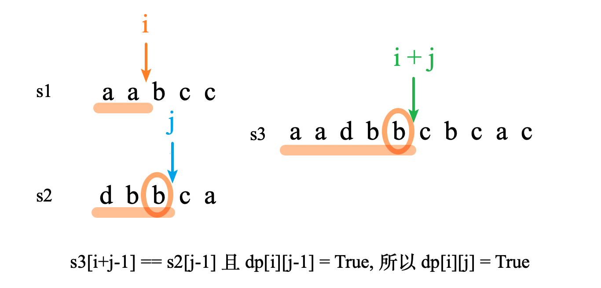

　　`dp[i][j]`只在满足以下两种情况之一时为真：  

　　1. `s3`的末尾元素和`s1`的末尾元素相同，且`dp[i-1][j] = True`；  

　　2. `s3` 的末尾元素和`s2`的末尾元素相同，且`dp[i][j-1] = True`。上图所示的是第二种情况。    

#### 代码  
```python
class Solution:
    def isInterleave(self, s1: str, s2: str, s3: str) -> bool:
        # s1[i] s2[j] s3[i+j]
        l1, l2, l3 = len(s1), len(s2), len(s3)
        if l3 != l1 + l2:
            return False
        if not l1: return s2 == s3
        elif not l2: return s1 == s3

        dp = [[False for j in range(l2+1)] for i in range(l1+1)]
        for i in range(l1+1):
            dp[i][0] = s1[:i] == s3[:i]

        for j in range(l2+1):
            dp[0][j] = s2[:j] == s3[:j]

        for i in range(1, l1+1):
            for j in range(1, l2+1):
                dp[i][j] = (s3[i+j-1] == s1[i-1] and dp[i-1][j]) or (s3[i+j-1] == s2[j-1] and dp[i][j-1])

        # print(dp)
        return dp[-1][-1]
```
## A115. 不同的子序列

难度 `困难`  
#### 题目描述

给定一个字符串 **S** 和一个字符串 **T**，计算在 **S** 的子序列中 **T** 出现的个数。

一个字符串的一个子序列是指，通过删除一些（也可以不删除）字符且不干扰剩余字符相对位置所组成的新字符串。（例如，`"ACE"` 是 `"ABCDE"` 的一个子序列，而 `"AEC"` 不是）

> **示例 1:**

```
输入: S = "rabbbit", T = "rabbit"
输出: 3
解释:

如下图所示, 有 3 种可以从 S 中得到 "rabbit" 的方案。
(上箭头符号 ^ 表示选取的字母)

rabbbit
^^^^ ^^
rabbbit
^^ ^^^^
rabbbit
^^^ ^^^
```

> **示例 2:**

```
输入: S = "babgbag", T = "bag"
输出: 5
解释:

如下图所示, 有 5 种可以从 S 中得到 "bag" 的方案。 
(上箭头符号 ^ 表示选取的字母)

babgbag
^^ ^
babgbag
^^    ^
babgbag
^    ^^
babgbag
  ^  ^^
babgbag
    ^^^
```

#### 题目链接

<https://leetcode-cn.com/problems/distinct-subsequences/>


#### 思路  

　　令`dp[i][j]`表示`t[:j]`在`s[:i]`的子序列中出现的次数。  

　　为了方便起见，`T`=`''`时，认为可以匹配`S`，即`dp[i][0]`=`1`。  

　　计算一般情况下的`dp[i][j]`，要根据`S`的最后一个字符是否和`T`最后一个字符相等来讨论。如下图所示：  

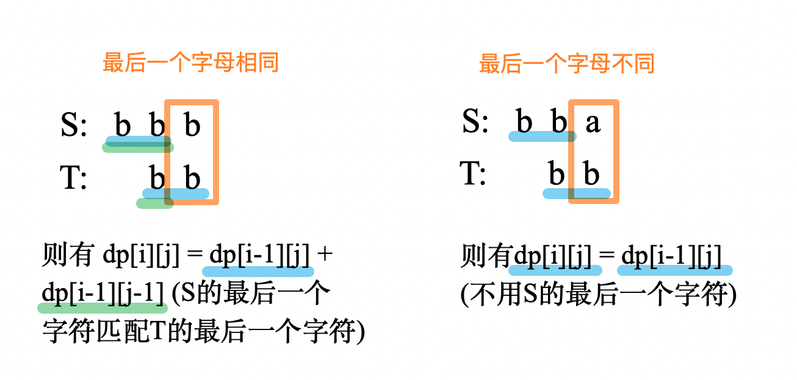

　　当最后一个字母不相等时，抛弃`S`的最后一个字母不用（即`T`匹配`S[:-1]`的种数），有`dp[i-1][j]`种可能。  

　　当最后一个字母相等时，可以选择不用最后一个字母，也可以**用`S`的最后一个字母匹配`T`的最后一个字母**，共有`dp[i-1][j]`+`dp[i-1][j-1]`种可能。  

#### 代码  
```python
class Solution:
    def numDistinct(self, s: str, t: str) -> int:
        # s[:i] t[:j]
        set_t = set(t)
        # 下面这一行去掉s中没有在t中出现的字母，可以极大地加快运行速度。  
        #  s = ''.join(map(lambda x: x if x in set_t else '', s))

        ls, lt = len(s), len(t)
        if lt > ls:
            return 0
        if not lt:
            return 1

        dp = [[0 for j in range(lt+1)] for i in range(ls+1)]
        for j in range(lt+1):
            dp[j][j] = 1 if s[:j] == t[:j] else 0  # 相同串可以匹配
            
        for i in range(ls+1):
            dp[i][0] = 1  # T='' 可以匹配任意S

        for j in range(1, lt+1):
            for i in range(j+1, ls+1):
                dp[i][j] = dp[i-1][j]  # 至少有不用S的最后一个字母种可能
                if s[i-1] == t[j-1]:  # 最后一个字母相同，可以用S的最后一个字母匹配T的最后一个字母
                    dp[i][j] += dp[i-1][j-1]

        return dp[-1][-1]
```

## A118. 杨辉三角

难度 `简单`  
#### 题目描述

给定一个非负整数 *numRows* ，生成杨辉三角的前 *numRows* 行。


在杨辉三角中，每个数是它左上方和右上方的数的和。

> **示例:**

```
输入: 5
输出:
[
     [1],
    [1,1],
   [1,2,1],
  [1,3,3,1],
 [1,4,6,4,1]
]
```

#### 题目链接

<https://leetcode-cn.com/problems/pascals-triangle/>


#### 思路  


　　从上到下dp。  

#### 代码  
```python
class Solution:
    def generate(self, numRows: int) -> List[List[int]]:
        if numRows == 0:
            return []
        elif numRows == 1:
            return [[1]]

        ans = [[1]] + [[1] + [0 for i in range(j)] + [1] for j in range(numRows-1)]
        for i in range(2, len(ans)):
            for j in range(1, i):
                ans[i][j] = ans[i-1][j-1] + ans[i-1][j]

        return ans
```

## A120. 三角形最小路径和

难度 `中等`  
#### 题目描述

给定一个三角形，找出自顶向下的最小路径和。每一步只能移动到下一行中相邻的结点上。

例如，给定三角形：

```
[
     [2],
    [3,4],
   [6,5,7],
  [4,1,8,3]
]
```

自顶向下的最小路径和为 `11`（即，**2** + **3** + **5** + **1** = 11）。

**说明：**

如果你可以只使用 *O*(*n*) 的额外空间（*n* 为三角形的总行数）来解决这个问题，那么你的算法会很加分。

#### 题目链接

<https://leetcode-cn.com/problems/triangle/>


#### 思路  


　　从上到下动态规划。

#### 代码  
```python
class Solution:
    def minimumTotal(self, triangle: List[List[int]]) -> int:
        n = len(triangle)
        if n == 0:
            return 0
        ans = 0
        dp = [[0 for i in range(j+1)] for j in range(n)]
        dp[0][0] = triangle[0][0]
        for i in range(1, n):
            for j in range(i+1):
                cur = triangle[i][j]
                if j==0:  # 第一个数
                    dp[i][j] = cur + dp[i-1][0]
                elif j == i:  # 最后一个数
                    dp[i][j] = cur + dp[i-1][-1]
                else:  # 中间的数
                    dp[i][j] = cur + min(dp[i-1][j-1], dp[i-1][j])

        return min(dp[-1])
```

## A123. 买卖股票的最佳时机 III

难度 `困难`  
#### 题目描述

给定一个数组，它的第 *i* 个元素是一支给定的股票在第 *i* 天的价格。

设计一个算法来计算你所能获取的最大利润。你最多可以完成 *两笔* 交易。

**注意:** 你不能同时参与多笔交易（你必须在再次购买前出售掉之前的股票）。

> **示例 1:**

```
输入: [3,3,5,0,0,3,1,4]
输出: 6
解释: 在第 4 天（股票价格 = 0）的时候买入，在第 6 天（股票价格 = 3）的时候卖出，这笔交易所能获得利润 = 3-0 = 3 。
     随后，在第 7 天（股票价格 = 1）的时候买入，在第 8 天 （股票价格 = 4）的时候卖出，这笔交易所能获得利润 = 4-1 = 3 。
```

> **示例 2:**

```
输入: [1,2,3,4,5]
输出: 4
解释: 在第 1 天（股票价格 = 1）的时候买入，在第 5 天 （股票价格 = 5）的时候卖出, 这笔交易所能获得利润 = 5-1 = 4 。   
     注意你不能在第 1 天和第 2 天接连购买股票，之后再将它们卖出。   
     因为这样属于同时参与了多笔交易，你必须在再次购买前出售掉之前的股票。
```

> **示例 3:**

```
输入: [7,6,4,3,1] 
输出: 0 
解释: 在这个情况下, 没有交易完成, 所以最大利润为 0。
```

#### 题目链接

<https://leetcode-cn.com/problems/best-time-to-buy-and-sell-stock-iii/>

#### 思路  

1. `dp1[i]`=`prices[i] - minval` 从前往后遍历，表示第`i`天卖出第一笔的最大利润；
2. `dp2[i]`=`max(dp2[i+1], maxval - prices[i])` 从后往前遍历，表示第`i`天到最后一天之间的最大利润；
3. `ans`= `max(dp1[i] + dp2[i])`，`dp1[i] + dp2[i]` 正好表示从第1天到最后一天（在`i`天卖出第一笔）经过两次交易的最大利润，我们的目标是找到令总利润最大的`i`。  

　　例如对于示例1：  

```python
prices = [3, 3, 5, 0, 0, 3, 1, 4]
dp1 =    [0, 0, 2, 0, 0, 3, 1, 4]  # 第i天卖出的最大利润
dp2 =    [0, 4, 4, 4, 3, 3, 0, 0]  # 第i天之后进行的第二笔交易的最大利润
sum() =  [0, 4, 6, 4, 3, 6, 1, 4]  # dp1[i] + dp2[i]
max() = 6  # 在第3天或第6天第一次卖出股票都可以获得最大利润
```

#### 代码  
```python
class Solution:
    def maxProfit(self, prices: List[int]) -> int:
        #  dp1[i-1] 表示第i天售出第一笔股票，第一次交易的最大收益
        n = len(prices)
        if n < 2:
            return 0
        dp1 = [0 for i in range(n)]
        cost = prices[0]  # 成本
        for i in range(1, n):
            cost = min(cost, prices[i-1])
            dp1[i] = max(0, prices[i] - cost)
        # dp2[i] 表示第i天以后进行的第二次交易的最大收益
        sell = prices[-1]
        profit = 0
        dp2 = [0 for i in range(n)]
        for i in range(n-3, 0, -1): # n-3 ~ 1
            cost = prices[i+1]
            if sell < cost:
                sell = cost  # 如果卖的价格低，就以成本来卖
            profit = max(profit, sell - cost)
            dp2[i] = profit

        return max([sum(i) for i in zip(dp1, dp2)])  # p1和p2元素和的最大值

```

## A132. 分割回文串 II

难度 `困难`  
#### 题目描述

给定一个字符串 *s*，将 *s* 分割成一些子串，使每个子串都是回文串。

返回符合要求的最少分割次数。

> **示例:**

```
输入: "aab"
输出: 1
解释: 进行一次分割就可将 s 分割成 ["aa","b"] 这样两个回文子串。
```

#### 题目链接

<https://leetcode-cn.com/problems/palindrome-partitioning-ii/>

#### 思路  

　　方法一：暴力递归，对字符串`s`（`s`不为回文串）的每个位置都尝试分割，`总的分割次数`=`左串分割次数`+`右串分割次数`+`1`。用时很长，使用缓存记录计算过的字符串能勉强AC。  
　　方法二：动态规划。`dp[i+1]`表示以`s[i]`结尾的最少分割次数。  

　　例如对于示例`"ababacccab"`：`dp[i+1]`的更新过程如下图所示：  

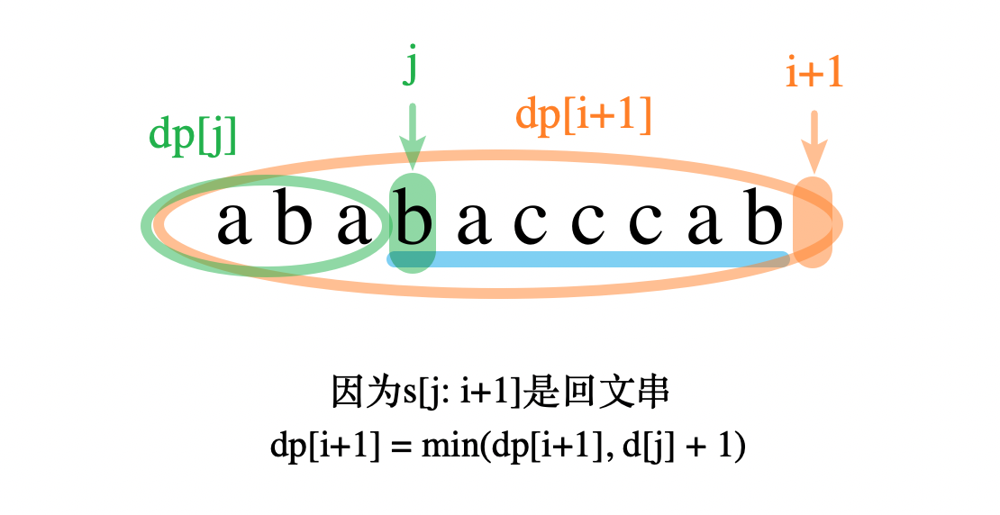

　　依次寻找`s`中以每个字母结尾的所有回文串，如果找到了回文串，则以这个回文串起始位置做分割，看能不能使`dp[i+1]`变小。  

#### 代码  

　　方法一：  

```python
class Solution:
    def minCut(self, s: str) -> int:
        """
        暴力，用时1406ms，勉强AC。  
        """
        from functools import lru_cache
        @lru_cache(None)  # 使用缓存记录已经计算过的结果
        def dp(s: str):
            if len(s) <= 1 or s == s[::-1]:
                return 0  # 本身就是回文，不需要分割

            ans = float('inf')
            for i in range(1, len(s)):
                if s[:i] == s[:i][::-1]:  # 前面是回文串才有分的意义
                    ans = min(ans, dp(s[i:]) + 1)
            
            return ans

        return dp(s)

```

　　方法二：

```python
class Solution:
    def minCut(self, s: str) -> int:
        if s == s[::-1]: return 0

        dp = [len(s) for i in range(len(s) + 1)]
        
        dp[0] = -1
        for i in range(len(s)):
            if s[:i] == s[:i][::-1] and s[i:] == s[i:][::-1]:
                return 1
            for j in range(i + 1):
                if s[j] == s[i] and s[j:i+1] == s[j:i+1][::-1]:
                    dp[i + 1] = min(dp[i + 1], dp[j] + 1)
                    
        return dp[-1]
      
```

## A139. 单词拆分

难度 `中等`  
#### 题目描述

给定一个**非空**字符串 *s* 和一个包含**非空**单词列表的字典 *wordDict*，判定 *s* 是否可以被空格拆分为一个或多个在字典中出现的单词。

**说明：**

- 拆分时可以重复使用字典中的单词。
- 你可以假设字典中没有重复的单词。

> **示例 1：**

```
输入: s = "leetcode", wordDict = ["leet", "code"]
输出: true
解释: 返回 true 因为 "leetcode" 可以被拆分成 "leet code"。
```

> **示例 2：**

```
输入: s = "applepenapple", wordDict = ["apple", "pen"]
输出: true
解释: 返回 true 因为 "applepenapple" 可以被拆分成 "apple pen apple"。
     注意你可以重复使用字典中的单词。
```

> **示例 3：**

```
输入: s = "catsandog", wordDict = ["cats", "dog", "sand", "and", "cat"]
输出: false
```

#### 题目链接

<https://leetcode-cn.com/problems/word-break/>


#### 思路  


　　动态规划。`dp[i]`表示字符串`s`的前`i`个字符能否拆分成`wordDict`。  

#### 代码  

　　写法一（记忆数组）：  

```python
class Solution:
    def wordBreak(self, s: str, wordDict: List[str]) -> bool:
        n=len(s)
        dp=[False]*(n+1)
        dp[0]=True
        word=set(wordDict)
        for i in range(1,n+1):
            for j in range(i):
                if dp[j] and s[j:i] in word:
                    dp[i]=True
                    break
        return dp[n]
```

　　写法二（缓存）：   

```python
class Solution:
    def wordBreak(self, s: str, wordDict: List[str]) -> bool:
        set_w = set(wordDict)
        if len(set_w) == 0:
            return not s

        from functools import lru_cache
        @lru_cache(None)  # 使用缓存记录已经计算过的结果
        def dp(s: str):
            if s in set_w:
                return True

            for i in range(len(s)):
                if s[:i] in set_w and dp(s[i:]): return True

            return False

        return dp(s)

```

## A140. 单词拆分 II

难度 `困难`  
#### 题目描述

给定一个**非空**字符串 *s* 和一个包含**非空**单词列表的字典 *wordDict*，在字符串中增加空格来构建一个句子，使得句子中所有的单词都在词典中。返回所有这些可能的句子。

**说明：**

- 分隔时可以重复使用字典中的单词。
- 你可以假设字典中没有重复的单词。

> **示例 1：**

```
输入:
s = "catsanddog"
wordDict = ["cat", "cats", "and", "sand", "dog"]
输出:
[
  "cats and dog",
  "cat sand dog"
]
```

> **示例 2：**

```
输入:
s = "pineapplepenapple"
wordDict = ["apple", "pen", "applepen", "pine", "pineapple"]
输出:
[
  "pine apple pen apple",
  "pineapple pen apple",
  "pine applepen apple"
]
解释: 注意你可以重复使用字典中的单词。
```

> **示例 3：**

```
输入:
s = "catsandog"
wordDict = ["cats", "dog", "sand", "and", "cat"]
输出:
[]
```

#### 题目链接

<https://leetcode-cn.com/problems/word-break-ii/>


#### 思路  


　　有个用例 aaaaaaa…aaaaabaaaaa...aaaaaaa 超出内存。先用上一题[A131.单词拆分](/dp?id=a139-单词拆分)的代码判断一下，如果能拆分再用数组记录。  

#### 代码  
```python
class Solution:
    def wordBreak(self, s: str, wordDict: List[str]) -> List[str]:
        n = len(s)
        can=[False]*(n+1)
        can[0]=True
        word=set(wordDict)
        for i in range(1,n+1):
            for j in range(i):
                if can[j] and s[j:i] in word:
                    can[i]=True
                    break

        if not can[n]:  # s不能拆分成wordDict
            return []

        dp = [[] for i in range(n + 1)]
        for i in range(1, n + 1):
            if not can[i]: continue
            
            if s[:i] in wordDict:
                dp[i].append(s[:i])

            for j in range(1, i):
                if len(dp[j]) > 0 and s[j:i] in word:
                    for sentence in dp[j]:
                        dp[i].append(sentence + ' ' + s[j:i])

        return dp[n]
      
```

## A152. 乘积最大子数组

难度 `中等`  
#### 题目描述

给定一个整数数组 `nums` ，找出一个序列中乘积最大的连续子序列（该序列至少包含一个数）。

> **示例 1:**

```
输入: [2,3,-2,4]
输出: 6
解释: 子数组 [2,3] 有最大乘积 6。
```

> **示例 2:**

```
输入: [-2,0,-1]
输出: 0
解释: 结果不能为 2, 因为 [-2,-1] 不是子数组。
```

#### 题目链接

<https://leetcode-cn.com/problems/maximum-product-subarray/>


#### 思路  


　　用`dp_pos[i]`和`dp_neg[i]`分别表示以`nums[i]`结尾的**最大正数乘积**和**最小负数乘积**。遇到`0`时会重新开始计算。一些例子如下：  

```python
nums =   [2,  -5, -2, 0, 3, 2]
dp_pos = [2,   0, 20, 0, 3, 6]  # 最大正数乘积
dp_neg = [0, -10, -2, 0, 0, 0]  # 最大负数乘积

nums =   [-2,  3,   3,  -2]
dp_pos = [0,   3,   9,  36]  # 最大正数乘积
dp_neg = [-2, -6, -18, -18]  # 最大负数乘积
```

　　根据`nums[i]`是正数还是负数，分别更新`dp_pos[i]`和`dp_neg[i]`。　　

#### 代码  
```python
class Solution:
    def maxProduct(self, nums: List[int]) -> int:
        n = len(nums) 
        if n == 1:
            return nums[0]
        dp_pos = [0 for i in range(n)]  # 记录最大正数乘积
        dp_neg = [0 for i in range(n)]  # 记录最大负数乘积

        temp = 1
        ans = 0
        for i in range(n):
            num = nums[i]
            if num > 0:  # num是正数
                dp_pos[i] = max(dp_pos[i-1] * num, num) if i else num  # 正数 × 正数 = 正数
                dp_neg[i] = dp_neg[i-1] * num  # 正数 × 负数 = 负数
            elif num < 0:  # num是负数
                dp_neg[i] = min(dp_pos[i-1] * num, num) if i else num  # 正数 × 负数 = 负数
                dp_pos[i] = dp_neg[i-1] * num  # 负数 × 负数 = 正数

            ans = max(ans, dp_pos[i])
            
        return ans
        
```

## A174. 地下城游戏

难度 `困难`  

#### 题目描述

一些恶魔抓住了公主（**P**）并将她关在了地下城的右下角。地下城是由 M x N 个房间组成的二维网格。我们英勇的骑士（**K**）最初被安置在左上角的房间里，他必须穿过地下城并通过对抗恶魔来拯救公主。

骑士的初始健康点数为一个正整数。如果他的健康点数在某一时刻降至 0 或以下，他会立即死亡。

有些房间由恶魔守卫，因此骑士在进入这些房间时会失去健康点数（若房间里的值为*负整数*，则表示骑士将损失健康点数）；其他房间要么是空的（房间里的值为 *0*），要么包含增加骑士健康点数的魔法球（若房间里的值为*正整数*，则表示骑士将增加健康点数）。

为了尽快到达公主，骑士决定每次只向右或向下移动一步。

**编写一个函数来计算确保骑士能够拯救到公主所需的最低初始健康点数。**

例如，考虑到如下布局的地下城，如果骑士遵循最佳路径 `右 -> 右 -> 下 -> 下`，则骑士的初始健康点数至少为 **7**。

| -2 (K) | -3   | 3      |
| ------ | ---- | ------ |
| -5     | -10  | 1      |
| 10     | 30   | -5 (P) |

#### 题目链接

<https://leetcode-cn.com/problems/dungeon-game/>

#### 思路  

　　感觉难度有点虚标，最多也就"中等" 。  
　　从**终点**向**起点**遍历。`dp[i][j]`表示在位置`[i][j]`是所允许的最小生命点数。`dp[i][j] = (min(dp[i][j+1], dp[i+1][j]) - dungeon[i][j])`。也就是`来的时候的最小生命点数`-`dungeon[i][j]补充的点数`。需要注意的是生命值不能为`0`。因此`dp[i][j] = max(1, dp[i][j])`。  

#### 代码  

```python
class Solution:
    def calculateMinimumHP(self, dungeon: List[List[int]]) -> int:
        m = len(dungeon)
        if m == 0:
            return 0

        n = len(dungeon[0])
        dp = [[float('inf') for j in range(n)]for i in range(m)]

        dp[m-1][n-1] = 1 - min(dungeon[m-1][n-1], 0)
        for i in range(m-1,-1,-1):
            for j in range(n-1,-1,-1):
                if i == m-1 and j == n-1:
                    pass
                elif i == m-1:
                    dp[i][j] = max(1, dp[i][j+1] - dungeon[i][j])
                elif j == n-1:
                    dp[i][j] = max(1, dp[i+1][j] - dungeon[i][j])
                else:
                    dp[i][j] = max(1, (min(dp[i][j+1], dp[i+1][j]) - dungeon[i][j]))

        # print(dp)
        return dp[0][0]
```

## A188. 买卖股票的最佳时机 IV

难度 `困难`  
#### 题目描述

给定一个数组，它的第 *i* 个元素是一支给定的股票在第 *i* 天的价格。

设计一个算法来计算你所能获取的最大利润。你最多可以完成 **k** 笔交易。

**注意:** 你不能同时参与多笔交易（你必须在再次购买前出售掉之前的股票）。

> **示例 1:**

```
输入: [2,4,1], k = 2
输出: 2
解释: 在第 1 天 (股票价格 = 2) 的时候买入，在第 2 天 (股票价格 = 4) 的时候卖出，这笔交易所能获得利润 = 4-2 = 2 。
```

> **示例 2:**

```
输入: [3,2,6,5,0,3], k = 2
输出: 7
解释: 在第 2 天 (股票价格 = 2) 的时候买入，在第 3 天 (股票价格 = 6) 的时候卖出, 这笔交易所能获得利润 = 6-2 = 4 。
     随后，在第 5 天 (股票价格 = 0) 的时候买入，在第 6 天 (股票价格 = 3) 的时候卖出, 这笔交易所能获得利润 = 3-0 = 3 。
```

#### 题目链接

<https://leetcode-cn.com/problems/best-time-to-buy-and-sell-stock-iv/>


#### 思路  

　　解法摘自[@派大星星星星](https://leetcode-cn.com/u/fongim/)。  

　　标准的三维DP动态规划，三个维度，第一维表示天，第二维表示交易了几次，第三维表示是否持有股票。  

　　首先初始化三维数组，填充第1天操作j次的没买或买了的情况的初始值，没买就是`0`，第一天就买入即`-prices[0]`。这里定义卖出操作时交易次数加`1`。  

　　然后是状态转移方程，下面描述的`i, j`都大于`0`：  

　　「第`i`天交易次数`0`不持有股票」的情况只能来自「第`i-1`天交易次数`0`不持有股票」；  

　　「第`i`天交易`j`次不持有股票」的状态可以来自「第`i-1`天交易`j`次不持有股票」或者「第`i-1`天交易`j-1`次持有股票」(即今天卖出股票，然后交易次数+1)；  

　　「第`i`天交易`j`次持有股票」的状态可以来自「第`i-1`天交易`j`次持有股票」或者「第`i-1`天交易`j`次不持有股票」(即今天买入股票，因为是买入操作所以交易次数不变) ；  

　　最后对于这题LeetCode的测试样例里有超大k值的情况，退化成122题不限次数的操作，可以用贪心解决或者直接替换k值为数组长度的一半。 　

#### 代码  
```python
class Solution:
    def maxProfit(self, k: int, prices: List[int]) -> int:
        if not prices or not k:
            return 0
        n = len(prices)
        
        # 当k大于数组长度的一半时，等同于不限次数交易即122题，用贪心算法解决，否则LeetCode会超时，也可以直接把超大的k替换为数组的一半，就不用写额外的贪心算法函数
        if k > n//2:
            return self.greedy(prices)
        
        dp, res = [[[0]*2 for _ in range(k+1)] for _ in range(n)], []
        # dp[i][k][0]表示第i天已交易k次时不持有股票 dp[i][k][1]表示第i天已交易k次时持有股票
        # 设定在卖出时加1次交易次数
        for i in range(k+1):
            dp[0][i][0], dp[0][i][1] = 0, - prices[0]
        for i in range(1, n):
            for j in range(k+1):
                if not j:
                    dp[i][j][0] = dp[i-1][j][0]
                else:
                    dp[i][j][0] = max(dp[i-1][j][0], dp[i-1][j-1][1] + prices[i])
                dp[i][j][1] = max(dp[i-1][j][1], dp[i-1][j][0] - prices[i])
        # 「所有交易次数最后一天不持有股票」的集合的最大值即为问题的解
        # for m in range(k+1):
        #     res.append(dp[n-1][m][0])
        return max([dp[-1][m][0] for m in range(k+1)])
    
    # 处理k过大导致超时的问题，用贪心解决
    def greedy(self, prices):
        res = 0
        for i in range(1, len(prices)):
            if prices[i] > prices[i-1]:
                res += prices[i] - prices[i-1]
        return res
```

## A198. 打家劫舍

难度 `简单`  
#### 题目描述

你是一个专业的小偷，计划偷窃沿街的房屋。每间房内都藏有一定的现金，影响你偷窃的唯一制约因素就是相邻的房屋装有相互连通的防盗系统，**如果两间相邻的房屋在同一晚上被小偷闯入，系统会自动报警**。

给定一个代表每个房屋存放金额的非负整数数组，计算你**在不触动警报装置的情况下，**能够偷窃到的最高金额。

> **示例 1:**

```
输入: [1,2,3,1]
输出: 4
解释: 偷窃 1 号房屋 (金额 = 1) ，然后偷窃 3 号房屋 (金额 = 3)。
     偷窃到的最高金额 = 1 + 3 = 4 。
```

> **示例 2:**

```
输入: [2,7,9,3,1]
输出: 12
解释: 偷窃 1 号房屋 (金额 = 2), 偷窃 3 号房屋 (金额 = 9)，接着偷窃 5 号房屋 (金额 = 1)。
     偷窃到的最高金额 = 2 + 9 + 1 = 12 。
```

#### 题目链接

<https://leetcode-cn.com/problems/house-robber/>

#### 思路  

　　动态规划。`dp[i]`表示最后一个偷`nums[i]`能偷到的最大金额。转移关系如下图所示：
　　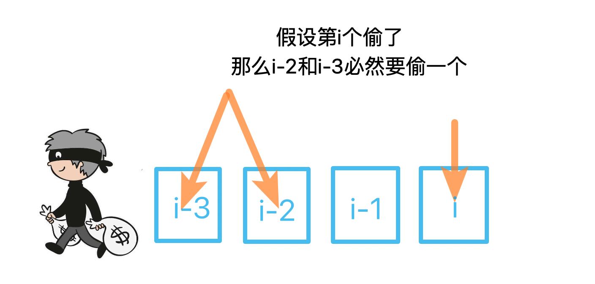

　　因此状态转移方程`dp[i] = max(dp[i-2], dp[i-3]) + num`。  

#### 代码  

```python
class Solution:
    def rob(self, nums: List[int]) -> int:
        n = len(nums)
        if n == 0: return 0
        if n <= 2: return max(nums)

        # dp[i] 表示最后偷nums[i]能偷到的最大金额
        dp = [0 for i in range(n)]
        dp[0] = nums[0]
        dp[1] = nums[1]
        dp[2] = nums[0] + nums[2]

        for i in range(3, n):
            num = nums[i]
            dp[i] = max(dp[i-2], dp[i-3]) + num

        return max(dp[-1], dp[-2])  # 最后偷的可能是最后一个，也可能是倒数第二个
      
```

## A213. 打家劫舍 II

难度 `中等`  
#### 题目描述

你是一个专业的小偷，计划偷窃沿街的房屋，每间房内都藏有一定的现金。这个地方所有的房屋都**围成一圈，**这意味着第一个房屋和最后一个房屋是紧挨着的。同时，相邻的房屋装有相互连通的防盗系统，**如果两间相邻的房屋在同一晚上被小偷闯入，系统会自动报警**。

给定一个代表每个房屋存放金额的非负整数数组，计算你**在不触动警报装置的情况下，**能够偷窃到的最高金额。

> **示例 1:**

```
输入: [2,3,2]
输出: 3
解释: 你不能先偷窃 1 号房屋（金额 = 2），然后偷窃 3 号房屋（金额 = 2）, 因为他们是相邻的。
```

> **示例 2:**

```
输入: [1,2,3,1]
输出: 4
解释: 你可以先偷窃 1 号房屋（金额 = 1），然后偷窃 3 号房屋（金额 = 3）。
     偷窃到的最高金额 = 1 + 3 = 4 。
```

#### 题目链接

<https://leetcode-cn.com/problems/house-robber-ii/>


#### 思路  


　　将环拆开，分别考虑不偷第一个和不偷最后一个。然后调用上一题[A198. 打家劫舍](/dp?id=a198-打家劫舍)的函数即可。  

#### 代码  
```python
class Solution:
    def rob(self, nums: List[int]) -> int:
        def rob_1(nums):
            n = len(nums)
            if n == 0: return 0
            if n <= 2: return max(nums)

            # dp[i] 表示最后偷nums[i]能偷到的最大金额
            dp = [0 for i in range(n)]
            dp[0] = nums[0]
            dp[1] = nums[1]
            dp[2] = nums[0] + nums[2]

            for i in range(3, n):
                num = nums[i]
                dp[i] = max(dp[i-2], dp[i-3]) + num

            return max(dp[-1], dp[-2])  # 最后偷的可能是最后一个，也可能是倒数第二个

        if len(nums) == 0: return 0
        if len(nums) <= 3: return max(nums)
        return max(rob_1(nums[:-1]), rob_1(nums[1:]))
```

## A221. 最大正方形

难度 `中等`  
#### 题目描述

在一个由 0 和 1 组成的二维矩阵内，找到只包含 1 的最大正方形，并返回其面积。

> **示例:**

```
输入: 

1 0 1 0 0
1 0 1 1 1
1 1 1 1 1
1 0 0 1 0

输出: 4
```

#### 题目链接

<https://leetcode-cn.com/problems/maximal-square/>


#### 思路  

　　令`dp[i][j]`表示以`[i][j]`为**右下角点**的最大正方形边长。递推关系如下图所示：  

　

　　由于`dp[i][j] = 4`已经是全为"1"的正方形了，`dp[i+1][j+1]`最大值只能为`5`。它的大小由图中蓝色箭头标注的区域决定。  

　　如果`[i+1][j+1]`的上方和左方都有**连续**`n`个"1"，那么`dp[i+1][j+1] = min(5, n+1)`。  

#### 代码  
```python
class Solution:
    def maximalSquare(self, matrix: List[List[str]]) -> int:
        m = len(matrix)
        if not m: return 0
        n = len(matrix[0])

        dp = [[1 if matrix[i][j] == '1' else 0 for j in range(n)] for i in range(m)]  # 复制一遍matrix
        ans = 0
        for i in range(m):
            for j in range(n):
                if matrix[i][j] == '1':
                    if not ans: ans = 1
                    if i > 0 and j > 0:
                        for k in range(1, dp[i-1][j-1]+1):
                            if matrix[i-k][j] == '1' and matrix[i][j-k] == '1':  # 上方和左方同时为1
                                dp[i][j] = dp[i][j] + 1
                                ans = max(ans, dp[i][j])
                            else:
                                break
                                
        return ans ** 2
        
```

## A279. 完全平方数

难度 `中等`  
#### 题目描述

给定正整数 *n*，找到若干个完全平方数（比如 `1, 4, 9, 16, ...`）使得它们的和等于 *n*。你需要让组成和的完全平方数的个数最少。

> **示例 1:**

```
输入: n = 12
输出: 3 
解释: 12 = 4 + 4 + 4.
```

> **示例 2:**

```
输入: n = 13
输出: 2
解释: 13 = 4 + 9.
```

#### 题目链接

<https://leetcode-cn.com/problems/perfect-squares/>


#### 思路  

　　动态规划，类似于背包问题。递推公式如下：  

```
f(n) = 1 + min{
  f(n-1^2), f(n-2^2), f(n-3^2), f(n-4^2), ... , f(n-k^2) //(k为满足k^2<=n的最大的k)
}
```

#### 代码  
```python
class helper:
    def __init__(self):
        max_n = 10000
        self.nums = nums = [1] * max_n  # nums[1] 表示1
        for i in range(2, max_n):
            sqr = int(math.sqrt(i))
            if sqr * sqr == i:  # 本身就是完全平方数
                nums[i] = 1
                continue
            temp = i
            for j in range(1, sqr+1):
                temp = min(temp, nums[i - j ** 2] + 1)
            nums[i] = temp
        # print(nums)


class Solution:
    h = helper()
    def numSquares(self, n: int) -> int: 
        return self.h.nums[n]
```


## A300. 最长上升子序列

难度 `中等`  

#### 题目描述

给定一个无序的整数数组，找到其中最长上升子序列的长度。

> **示例:**

```
输入: [10,9,2,5,3,7,101,18]
输出: 4 
解释: 最长的上升子序列是 [2,3,7,101]，它的长度是 4。
```

**说明:**

- 可能会有多种最长上升子序列的组合，你只需要输出对应的长度即可。
- 你算法的时间复杂度应该为 O(*n2*) 。

**进阶:** 你能将算法的时间复杂度降低到 O(*n* log *n*) 吗?

#### 题目链接

<https://leetcode-cn.com/problems/longest-increasing-subsequence/>

#### 思路  

　　**方法一：**用一个辅助数组`orders`记录以每个数为最大的数字时，最长上升子序列的长度。如示例中`[10,9,2,5,3,7,101,18]`对应的`orders=[1,1,1,2,1,3,4,4]` 。  
　　初始状态`orders`全为`1`，统计`nums`中某个数字之前所有比它小的数字的`orders`的最大值 + 1即为`order[i]`新的值。复杂度为`O(n^2)` 。  
　　**方法二：**维护一个`升序的`结果数组`results`。如果`num`大于结果数组中的所有元素，就将`num`插入到结果数组的最后。否则用`num`替换`results`中第一个大于等于`num`的数。  
　　最终`results`的长度即为结果。复杂度为`O(nlogn)`。  

#### 代码  

　　**方法一：**  

```python
class Solution:
    def lengthOfLIS(self, nums: List[int]) -> int:
        n = len(nums)
        if not n:
            return 0
        orders = [1 for i in range(n)]  # 以nums[i]为最大s\数的最长上升子序列长度
        ans = 1
        i = 0
        for i in range(n-1):
            if nums[i+1] > nums[i]:
                orders[i+1] = 2
                ans = 2
                break

        for i in range(i+2, n):
            order_i = 1
            for j in range(i):
                if nums[j] < nums[i]:
                    order_i = max(order_i, orders[j]+1)
            orders[i] = order_i
            ans = max(ans, order_i)

        return ans

```

　　**方法二：**

```python
class Solution:
    def lengthOfLIS(self, nums: List[int]) -> int:
        if len(nums) == 0:
            return 0

        results = []
        for num in nums:
            if len(results) == 0 or num > results[-1]:
                results.append(num)
            else:
                for i, re in enumerate(results):
                    if re >= num:
                        results[i] = num
                        break

        print(results)
        return len(results)

```

## A303. 区域和检索 - 数组不可变

难度 `简单`  
#### 题目描述

给定一个整数数组  *nums*，求出数组从索引 *i* 到 *j*  (*i* ≤ *j*) 范围内元素的总和，包含 *i,  j* 两点。

> **示例：**

```
给定 nums = [-2, 0, 3, -5, 2, -1]，求和函数为 sumRange()

sumRange(0, 2) -> 1
sumRange(2, 5) -> -1
sumRange(0, 5) -> -3
```

**说明:**

1. 你可以假设数组不可变。
2. 会多次调用 *sumRange* 方法。

#### 题目链接

<https://leetcode-cn.com/problems/range-sum-query-immutable/>


#### 思路  


　　重点在于会多次调用。因此在初始化时先求好前`n`项和。调用`sumRange`时只要返回`self.sums[j] - self.sums[i-1]`即可。  

#### 代码  
```python
class NumArray:
    def __init__(self, nums: List[int]):
        t = 0
        def accumulate(x):
            nonlocal t
            t += x
            return t

        self.nums = nums
        self.sums = list(map(accumulate, nums))  # 前n项和的列表
              
    def sumRange(self, i: int, j: int) -> int:
        if i <= 0: return self.sums[j]
        if j >= len(self.sums): j = len(self.sums) - 1

        return self.sums[j] - self.sums[i-1]

```

## A304. 二维区域和检索 - 矩阵不可变

难度 `中等`  
#### 题目描述

给定一个二维矩阵，计算其子矩形范围内元素的总和，该子矩阵的左上角为 (*row*1, *col*1) ，右下角为 (*row*2, *col*2)。

　　  
上图子矩阵左上角 (row1, col1) = **(2, 1)** ，右下角(row2, col2) = **(4, 3)，**该子矩形内元素的总和为 8。

> **示例:**

```
给定 matrix = [
  [3, 0, 1, 4, 2],
  [5, 6, 3, 2, 1],
  [1, 2, 0, 1, 5],
  [4, 1, 0, 1, 7],
  [1, 0, 3, 0, 5]
]

sumRegion(2, 1, 4, 3) -> 8
sumRegion(1, 1, 2, 2) -> 11
sumRegion(1, 2, 2, 4) -> 12
```

**说明:**

1. 你可以假设矩阵不可变。
2. 会多次调用 *sumRegion* 方法*。*
3. 你可以假设 *row*1 ≤ *row*2 且 *col*1 ≤ *col*2。

#### 题目链接

<https://leetcode-cn.com/problems/range-sum-query-2d-immutable/>


#### 思路  

　　和上一题类似，在初始化时先计算好从左上角到`[i][j]`的矩形内数字和`sums[i][j]`。任意矩形面积的计算方法如下图所示：  
　　　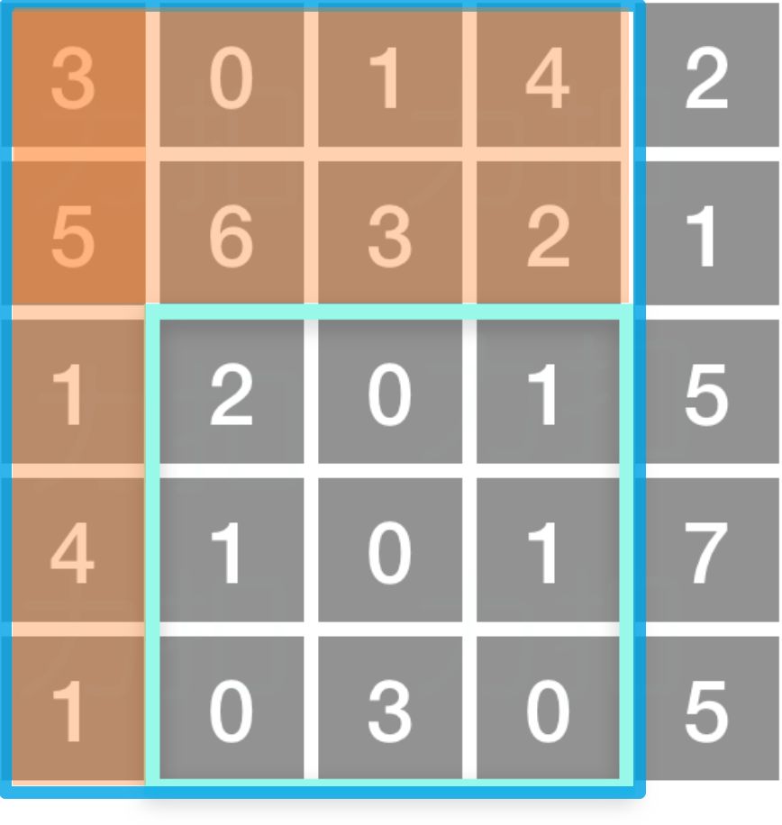  

　　 `淡蓝色框内的数字和`=`深蓝色框内的数字和`-`两个橙色矩形内的数字和`+`两橙色矩形重合部分的数字和`。  

　　用公式表示为：`两点之间的数字和`=`sums[row2][col2] - sums[row1-1][col2] - sums[row2][col1-1] + sums[row1-1][col1-1]`。  

#### 代码  
```python
class NumMatrix:

    def __init__(self, matrix: List[List[int]]):
        self.m = m = len(matrix)
        if not m: self.sums = []; return
        self.n = n = len(matrix[0])

        self.sums = sums = [[0 for _ in range(n)] for _ in range(m)]
        for i in range(m):
            for j in range(n):
                if i == 0 and 0 == 1:
                    sums[i][j] = matrix[i][j]
                elif i == 0:
                    sums[i][j] = sums[i][j-1] + matrix[i][j]
                elif j == 0:
                    sums[i][j] = sums[i-1][j] + matrix[i][j]
                else:
                    sums[i][j] = sums[i-1][j] + sums[i][j-1] - sums[i-1][j-1] + matrix[i][j]
        # print(sums)

    def sumRegion(self, row1: int, col1: int, row2: int, col2: int) -> int:
        if not self.m: return 0
        row1 = max(0, row1)
        col1 = max(0, col1)
        row2 = min(self.m-1, row2)
        col2 = min(self.n-1, col2)

        sums = self.sums

        if row1 == 0 and col1 == 0: return self.sums[row2][col2]
        if row1 == 0: return sums[row2][col2] - sums[row2][col1-1]
        if col1 == 0: return sums[row2][col2] - sums[row1-1][col2]

        return sums[row2][col2] - sums[row1-1][col2] - sums[row2][col1-1] + sums[row1-1][col1-1]
```

## A309. 最佳买卖股票时机含冷冻期

难度 `中等`  
#### 题目描述

给定一个整数数组，其中第 *i* 个元素代表了第 *i* 天的股票价格 。

设计一个算法计算出最大利润。在满足以下约束条件下，你可以尽可能地完成更多的交易（多次买卖一支股票）:

- 你不能同时参与多笔交易（你必须在再次购买前出售掉之前的股票）。
- 卖出股票后，你无法在第二天买入股票 (即冷冻期为 1 天)。

> **示例:**

```
输入: [1,2,3,0,2]
输出: 3 
解释: 对应的交易状态为: [买入, 卖出, 冷冻期, 买入, 卖出]
```

#### 题目链接

<https://leetcode-cn.com/problems/best-time-to-buy-and-sell-stock-with-cooldown/>


#### 思路  

　　动态规划，双重转移方程。  

　　用两个数组`dp_0[i]`和`dp_1[i]`分别表示第`i`天`无股票的最大收益`和`有股票的最大收益`。则有以下转移方程：  

```
dp_1[i] = max(dp_1[i-1], dp_0[i-2] - prices[i])  # 不进行操作 或者买入股票(注意冻结期)
dp_0[i] = max(dp_0[i-1], prices[i] + dp_1[i-1])  # 不进行操作 或者卖出股票
```

#### 代码  
```python
class Solution:
    def maxProfit(self, prices: List[int]) -> int:
        # dp[i]表示i天之前卖出的最大利润
        n = len(prices)
        if n <= 1:
            return 0

        dp_0 = [0] * n  # 无股票的最大收益
        dp_1 = [0] * n  # 有股票的最大收益

        dp_1[0] = - prices[0]
        dp_1[1] = - min(prices[0], prices[1])
        dp_0[1] = max(0, prices[1]-prices[0])

        for i in range(2, n):
            if i >= 2:
                dp_1[i] = max(dp_1[i-1], dp_0[i-2] - prices[i])  # 保持前一天的股票 或者买入股票(注意冻结期)
                dp_0[i] = max(dp_0[i-1], prices[i] + dp_1[i-1])
            

        return dp_0[-1]
      
```

## A312. 戳气球

难度 `困难`  
#### 题目描述

有 `n` 个气球，编号为`0` 到 `n-1`，每个气球上都标有一个数字，这些数字存在数组 `nums` 中。

现在要求你戳破所有的气球。每当你戳破一个气球 `i` 时，你可以获得 `nums[left] * nums[i] * nums[right]` 个硬币。 这里的 `left` 和 `right` 代表和 `i` 相邻的两个气球的序号。注意当你戳破了气球 `i` 后，气球 `left` 和气球 `right` 就变成了相邻的气球。

求所能获得硬币的最大数量。

**说明:**

- 你可以假设 `nums[-1] = nums[n] = 1`，但注意它们不是真实存在的所以并不能被戳破。
- 0 ≤ `n` ≤ 500, 0 ≤ `nums[i]` ≤ 100

> **示例:**

```
输入: [3,1,5,8]
输出: 167 
解释: nums = [3,1,5,8] --> [3,5,8] -->   [3,8]   -->  [8]  --> []
     coins =  3*1*5      +  3*5*8    +  1*3*8      + 1*8*1   = 167
```

#### 题目链接

<https://leetcode-cn.com/problems/burst-balloons/>


#### 思路  

　　这题类似于矩阵连乘。关键点在于先选出**最后一个**戳破的气球🎈，递推公式图下图所示：

　　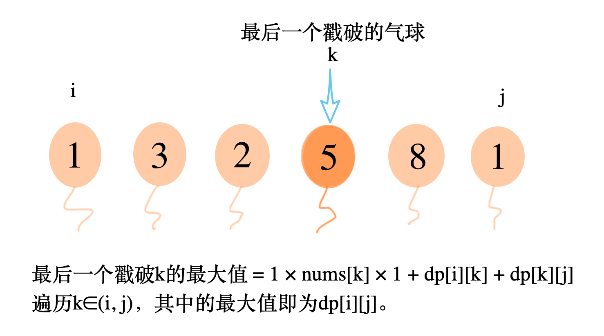

　　`dp[i][j]`表示以`i`、`j`两个数作为左右端点（不戳破`i`和`j`），能获得硬币的最大值。`k`为最后一个戳破的气球，戳破`k`能获得`1 × nums[k] × 1`个硬币。最后一个戳破`k`时，能获得的最大硬币数为：  

```
max_coin_k = 1 * nums[k] * 1 + dp(i,k) + dp(k,j)
```

　　递归地计算`dp(i,k)`和`dp(k,j)`，找到倒数第二个被戳破的气球。。以此类推。  

#### 代码  
```python
class Solution:
    def maxCoins(self, nums: List[int]) -> int:
        n = len(nums)
        if n == 0: return 0
        nums = [1] + nums + [1]

        from functools import lru_cache
        @lru_cache(None)
        def dp(i, j):
            if j - i == 1: return 0
            ans = 0
            for k in range(i+1, j):  # 不包括i和j
                ans = max(ans, nums[i] * nums[j] * nums[k] + dp(i,k) + dp(k,j)) 
            return ans

        return dp(0, n+1)
      
```

## A321. 拼接最大数

难度 `困难`  
#### 题目描述

给定长度分别为 `m` 和 `n` 的两个数组，其元素由 `0-9` 构成，表示两个自然数各位上的数字。现在从这两个数组中选出 `k (k <= m + n)` 个数字拼接成一个新的数，要求从同一个数组中取出的数字保持其在原数组中的相对顺序。

求满足该条件的最大数。结果返回一个表示该最大数的长度为 `k` 的数组。

**说明:** 请尽可能地优化你算法的时间和空间复杂度。

> **示例 1:**

```
输入:
nums1 = [3, 4, 6, 5]
nums2 = [9, 1, 2, 5, 8, 3]
k = 5
输出:
[9, 8, 6, 5, 3]
```

> **示例 2:**

```
输入:
nums1 = [6, 7]
nums2 = [6, 0, 4]
k = 5
输出:
[6, 7, 6, 0, 4]
```

> **示例 3:**

```
输入:
nums1 = [3, 9]
nums2 = [8, 9]
k = 3
输出:
[9, 8, 9]
```

#### 题目链接

<https://leetcode-cn.com/problems/create-maximum-number/>


#### 思路  

　　我们可以取`nums1`的可以形成 **i** 位最大数字，`nums2`的 **k - i** 位最大数字，它们再**合并**组成数字就是最大的。  

　　找`nums1`能组成的 **i** 位最大数字，使用递归的方式，如下图所示：  

　　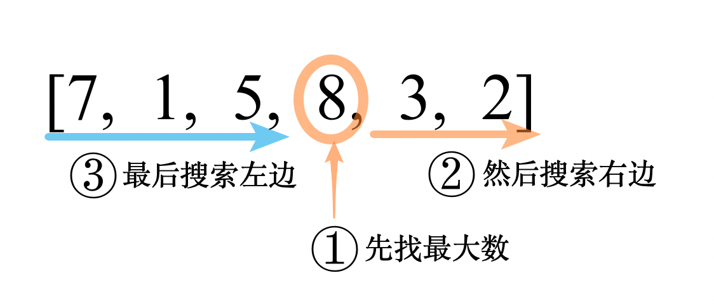

　　在每轮递归中，都先找到`最大数`的下标，然后对`右边递归`，最后对`左边递归`。  

　　如上图搜索的最终结果为：

```
数字  下标
8:    3
3:    4
2:    5
7:    0
5:    2
1:    1
```

　　`nums1`能组成的 **i** 位最大数字，取前 **i** 个下标，排序后到`nums1`中依次索引即可。  

　　如上图能组成的最大 4 位数字，取下标的前 4 个`[3, 4, 5, 0]`，排序后为`[0, 3, 4, 5]`，也就是`nums`中的`"7832"`。  

　　  

　　**合并两数组**的算法：  

　　比较它们的**前缀大小**，每次都到前缀大的数组中取第一个数字，详细步骤如下：

```
# 假设 nums1能组成的最大4位数为"7832"，nums2能组成的最大3位数为"791"， 合并这两个数组
第1步: "7832" < "791"  ， 取nums2, result = "7"
第2步: "7832" < "91"  ， 取nums2, result = "79"
第3步: "7832" > "1"  ， 取nums1, result = "797"
第4步: "832" > "1"  ， 取nums1, result = "7978"
第5步: "32" > "1"  ， 取nums1, result = "79783"
第6步: "2" > "1"  ， 取nums1, result = "797832"
第7步: "" < "1"  ， 取nums2, result = "7978321"

```

#### 代码  
```python
class Solution:
    def maxNumber(self, nums1: List[int], nums2: List[int], k: int) -> List[int]:
        l1 = len(nums1)
        l2 = len(nums2)
        if k == 0: return []

        def dfs(nums, i, j, put_in):  # 递归
            if j <= i: return
            max_id = i + nums[i: j].index(max(nums[i: j]))  # 找到i,j之间最大元素的下标
            put_in.append(max_id)

            dfs(nums, max_id + 1, j, put_in)
            dfs(nums, i, max_id, put_in)

        m1 = []; dfs(nums1, 0, l1, m1)
        m2 = []; dfs(nums2, 0, l2, m2)

        def merge(s1, s2):  # merge('67', '604') = '67604'
            i, j = 0, 0
            ans = ''
            while i < len(s1) or j < len(s2):
                if s1[i:] > s2[j:]: ans += s1[i]; i += 1
                else: ans += s2[j]; j += 1

            return ans

        s1 = ['' for _ in range(l1)]
        ans = 0
        for i in range(max(0, k-l2), min(k, l1)+1):  # nums1 最少~最多取几个
            # nums1 取i位能组成的最大数(字符串形式))：
            # 将下标数组 m 的前 i 位排序后依次到nums中索引
            s1 = ''.join(map(str, map(nums1.__getitem__, sorted([idx for idx in m1[:i]])))) 
            j = k - i
            s2 = ''.join(map(str, map(nums2.__getitem__, sorted([idx for idx in m2[:j]]))))
            ans = max(ans, int(merge(s1, s2)))

        return list(map(int ,list(str(ans))))


```

## A322. 零钱兑换

难度 `中等`  
#### 题目描述

给定不同面额的硬币 coins 和一个总金额 amount。编写一个函数来计算可以凑成总金额所需的最少的硬币个数。如果没有任何一种硬币组合能组成总金额，返回 `-1`。

> **示例 1:**

```
输入: coins = [1, 2, 5], amount = 11
输出: 3 
解释: 11 = 5 + 5 + 1
```

> **示例 2:**

```
输入: coins = [2], amount = 3
输出: -1
```

#### 题目链接

<https://leetcode-cn.com/problems/coin-change/>


#### 思路  

　　背包🎒问题。  

　　如果**所有**`amount - coins[i]`所需的最少硬币个数都已知，那么`它们之中的最小值` + 1 就是`amount`所需的最少硬币个数。

#### 代码  

　　写法一：  

```python
class Solution:
    def coinChange(self, coins: List[int], amount: int) -> int:
        ans = [-1 for i in range(amount + 1)]
        ans[0] = 0

        for i in range(1, amount+1):
            minimal = float('inf')
            if ans[i] == -1:
                for coin in coins:
                    left = i - coin
                    if left >= 0:
                        if ans[left] != -1:
                            minimal = min(minimal, ans[left] + 1)

                minimal = -1 if minimal == float('inf') else minimal

                ans[i] = minimal

        return ans[amount]
```

　　写法二：

```python
class Solution:
    def coinChange(self, coins: List[int], amount: int) -> int:
        inf = float('inf')
        dp = [inf for i in range(amount + 1)]
        dp[0] = 0

        for i in range(1, amount+1):
            all_i_use_coins = [dp[i - coin] for coin in filter(lambda x: x <= i, coins)] + [inf]  # 加一个inf 防止为空
            dp[i] = min(all_i_use_coins) + 1

        if dp[amount] == inf: return -1
        return dp[amount]
```

## A338. 比特位计数

难度 `中等`  
#### 题目描述

给定一个非负整数 **num**。对于 **0 ≤ i ≤ num** 范围中的每个数字 **i** ，计算其二进制数中的 1 的数目并将它们作为数组返回。

> **示例 1:**

```
输入: 2
输出: [0,1,1]
```

> **示例 2:**

```
输入: 5
输出: [0,1,1,2,1,2]
```

**进阶:**

- 给出时间复杂度为**O(n\*sizeof(integer))**的解答非常容易。但你可以在线性时间**O(n)**内用一趟扫描做到吗？
- 要求算法的空间复杂度为**O(n)**。
- 你能进一步完善解法吗？要求在C++或任何其他语言中不使用任何内置函数（如 C++ 中的 **__builtin_popcount**）来执行此操作。

#### 题目链接

<https://leetcode-cn.com/problems/counting-bits/>


#### 思路  

　　**方法一：**先用O(n)的复杂度统计所有偶数的二进制最右边有几个零。`奇数的1个数` = `前一个数的1个数` + 1。`偶数的1个数` = `前一个数的1个数` - `最右边零的个数` + 1 。时间复杂度`O(n)`，但是遍历了两次。  
　　**方法二：**动态规划。`i & (i - 1)`可以去掉i最右边的一个1（如果有），因此 i & (i - 1）是比 i 小的，而且i & (i - 1)的1的个数已经在前面算过了，所以i的1的个数就是 i & (i - 1)的1的个数加上1。  

#### 代码  

　　**方法一**：  

```python
# [0, 1, 2, 3, 4, 5, 6, 7, 8, 9,10,11,12,13,14,15,16]  i     
# [4, 0, 1, 0, 2, 0, 1, 0, 3, 0, 1, 0, 2, 0, 1, 0, 4]  最右边有几个0
# [0, 1, 1, 2, 1, 2, 2, 3, 1, 2, 2, 3, 2, 3, 3, 4, 1]  总共有几个1

class Solution:
    def countBits(self, num: int) -> List[int]:
        n = num
        helper = [0] * (n+1)  # 记录是2的几次方
        dp = [0] * (n+1)
        order = 2
        while order <= n:
            for i in range(0, n+1, order): helper[i] += 1
            order *= 2
            # 总访问次数为 n-1 次，因此复杂度是O(n)
        
        for i in range(1, num+1):
            if i % 2 == 1:
                dp[i] = dp[i-1] + 1
            else:
                dp[i] = dp[i-1] - helper[i] + 1

        return dp

```

　　**方法二：**

```python
class Solution:
    def countBits(self, num: int) -> List[int]:
        dp = [0] * (num+1)
        for i in range(1, num+1):
            dp[i] = dp[i & (i-1)] + 1

        return dp
```

## A343. 整数拆分

难度 `中等`  
#### 题目描述

给定一个正整数 *n*，将其拆分为**至少**两个正整数的和，并使这些整数的乘积最大化。 返回你可以获得的最大乘积。

> **示例 1:**

```
输入: 2
输出: 1
解释: 2 = 1 + 1, 1 × 1 = 1。
```

> **示例 2:**

```
输入: 10
输出: 36
解释: 10 = 3 + 3 + 4, 3 × 3 × 4 = 36。
```

**说明:** 你可以假设 *n* 不小于 2 且不大于 58。

#### 题目链接

<https://leetcode-cn.com/problems/integer-break/>


#### 思路  

　　动态规划。大于等于5的数拆分后相乘一定比自身大。如 `5 = 2 + 3`，而`2 × 3 = 6 > 5`。    

　　整数`num`可以拆分成两个数 j 和 `num-j`，其中 j 大于等于5。因为 j 比`num`小，j 的拆分结果之前已经计算过了，因此可得转移方程`dp[num] = max(dp[j] * (num - j))`。  

#### 代码  
```python
class Solution:
    dp = [0, 0, 1, 2, 4, 6, 9, 12] + [0] * 55
    for i in range(8, 59):
        for j in range(5, i-1):
            dp[i] = max(dp[i],  dp[j] * (i - j))

    def integerBreak(self, n: int) -> int:
        return self.dp[n]
      
```

## A354. 俄罗斯套娃信封问题

难度 `困难`  
#### 题目描述

给定一些标记了宽度和高度的信封，宽度和高度以整数对形式 `(w, h)` 出现。当另一个信封的宽度和高度都比这个信封大的时候，这个信封就可以放进另一个信封里，如同俄罗斯套娃一样。

请计算最多能有多少个信封能组成一组“俄罗斯套娃”信封（即可以把一个信封放到另一个信封里面）。

**说明:**
不允许旋转信封。

> **示例:**

```
输入: envelopes = [[5,4],[6,4],[6,7],[2,3]]
输出: 3 
解释: 最多信封的个数为 3, 组合为: [2,3] => [5,4] => [6,7]。
```

#### 题目链接

<https://leetcode-cn.com/problems/russian-doll-envelopes/>


#### 思路  

　　将信封按`(宽升序、高降序)`排列。因为宽已经有序了，将所有的高依次取出来组成一个数组，就变成了[A300. 最长上升子序列](/dp?id=a300-最长上升子序列)问题。  
　　**方法一：**动态规划，查找每个信封前面的所有信封，如果某一个`信封j`的宽和高都小于当前信封，那么`dp[now] = max(dp[now], dp[j] + 1)`。时间复杂度`O(n^2)` 。  
　　**方法二：**维护一个`升序的`结果数组`results`。如果`num`大于结果数组中的所有元素，就将`num`插入到结果数组的最后。否则用`num`替换`results`中第一个大于等于`num`的数。  
　　最终`results`的长度即为结果。复杂度为`O(nlogn)`。  

#### 代码  

　　**方法一：**`O(n^2)`（超时）

```python
class Solution:
    def maxEnvelopes(self, envelopes: List[List[int]]) -> int:
        n = len(envelopes)
        if not n: return 0

        envelopes = sorted(envelopes)
        dp = [1] * n

        ans = 1
        for i in range(1, n):
            w, h = envelopes[i]
            for j in range(i):
                w0, h0 = envelopes[j]
                if w0 < w and h0 < h:
                    dp[i] = max(dp[i], dp[j] + 1)

            ans = max(ans, dp[i])

        return ans

```

　　**方法二：**`O(nlogn)`

```python
from bisect import bisect_left
class Solution:
    def lengthOfLIS(self, nums: List[int]) -> int:
        if len(nums) == 0:
            return 0

        results = []
        for num in nums:
            if len(results) == 0 or num > results[-1]:
                results.append(num)
            else:
                idx = bisect_left(results, num)
                results[idx] = num

        return len(results)

    def maxEnvelopes(self, envelopes: List[List[int]]) -> int:
        n = len(envelopes)
        if not n: return 0

        envelopes = sorted(envelopes, key=lambda kv: (kv[0], -kv[1]))   
        nums =  [num for _, num in envelopes]
        return self.lengthOfLIS(nums)


```

## A357. 计算各个位数不同的数字个数

难度 `中等`  
#### 题目描述

给定一个**非负**整数 n，计算各位数字都不同的数字 x 的个数，其中 0 ≤ x < 10n 。

> **示例:**

```
输入: 2
输出: 91 
解释: 答案应为除去 11,22,33,44,55,66,77,88,99 外，在 [0,100) 区间内的所有数字。
```

#### 题目链接

<https://leetcode-cn.com/problems/count-numbers-with-unique-digits/>


#### 思路  

　　排列组合问题。  

```
从左往右
首位数可以取9种(除了0以外都能取)，第二位也能取9中(和第一位不同或者取0) 第三位取8种(和前两位都不同) 下一位比前一位取法少一种，因为不能重复。
0有     1 种
一位数有 9 种
两位数有 9*9 种
三位数有 9*9*8 种
四位数有 9*9*8*7 种
五位数有 9*9*8*7*6 种
.....
超过10位数一种也没有
```

#### 代码  
```python
class Solution:
    def countNumbersWithUniqueDigits(self, n: int) -> int:
        multiply = lambda x, y: x * y
        dp = [1 for i in range(11)]
        dp[1] = 10
        for i in range(2, 11):
            dp[i] = 9 * reduce(multiply, range(9, 10-i, -1)) + dp[i-1]  # 累乘

        n = min(10, n)
        return dp[n]

```

## A368. 最大整除子集

难度 `中等`  
#### 题目描述

给出一个由**无重复的**正整数组成的集合，找出其中最大的整除子集，子集中任意一对 (Si，Sj) 都要满足：Si % Sj = 0 或 Sj % Si = 0。

如果有多个目标子集，返回其中任何一个均可。

> **示例 1:**

```
输入: [1,2,3]
输出: [1,2] (当然, [1,3] 也正确)
```

> **示例 2:**

```
输入: [1,2,4,8]
输出: [1,2,4,8]
```

#### 题目链接

<https://leetcode-cn.com/problems/largest-divisible-subset/>


#### 思路  


　　动态规划。先排序，然后在每个数的前面找它的因子即可。状态转移方程 `dp[now] = max(dp[now], dp[j] + 1)`。其中 j 位置的数字是当前数字的因子。  

#### 代码  
```python
import bisect
class Solution:
    def largestDivisibleSubset(self, nums: List[int]) -> List[int]:
        n = len(nums)
        if not n: return []

        dp = [1 for i in range(n)]
        previous = [0 for i in range(n)]  # 记录是前一个因子
        nums = sorted(nums)

        max_i = 0
        max_n = 1
        for i in range(1, n):
            start = bisect.bisect(nums, nums[i] // 2)
            for j in range(start-1, -1, -1):
                if nums[i] % nums[j] == 0:
                    if dp[i] < dp[j] + 1:
                        dp[i] = dp[j] + 1
                        previous[i] = j

            if dp[i] > max_n:
                max_n = dp[i]
                max_i = i

        ans = []
        for i in range(max_n):
            ans.append(nums[max_i])
            max_i = previous[max_i]
        return ans

```

## A375. 猜数字大小 II

难度 `中等`  

#### 题目描述

我们正在玩一个猜数游戏，游戏规则如下：

我从 **1** 到 **n** 之间选择一个数字，你来猜我选了哪个数字。

每次你猜错了，我都会告诉你，我选的数字比你的大了或者小了。

然而，当你猜了数字 x 并且猜错了的时候，你需要支付金额为 x 的现金。直到你猜到我选的数字，你才算赢得了这个游戏。

> **示例:**

```
n = 10, 我选择了8.

第一轮: 你猜我选择的数字是5，我会告诉你，我的数字更大一些，然后你需要支付5块。
第二轮: 你猜是7，我告诉你，我的数字更大一些，你支付7块。
第三轮: 你猜是9，我告诉你，我的数字更小一些，你支付9块。

游戏结束。8 就是我选的数字。

你最终要支付 5 + 7 + 9 = 21 块钱。
```

给定 **n ≥ 1，**计算你至少需要拥有多少现金才能确保你能赢得这个游戏。

#### 题目链接

<https://leetcode-cn.com/problems/guess-number-higher-or-lower-ii/>

#### 思路  

　　类似矩阵连乘问题。最小消耗的选择方法如下图所示：  

　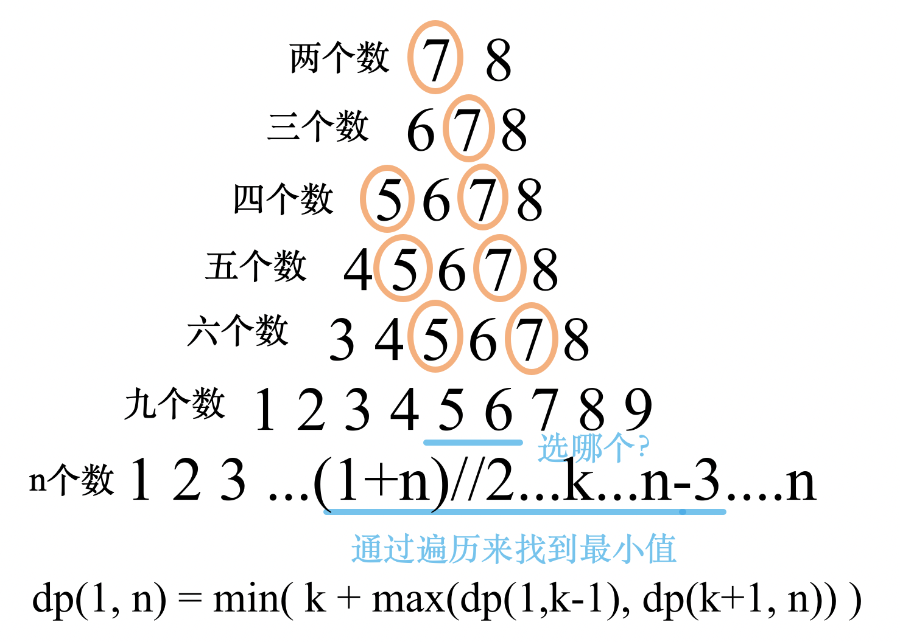

　　n个数时，选择`k`的总消耗为`k + max(dp(1, k-1), dp(k+1, n))`。遍历`(n+1)//`到`n-3`，找到消耗最小的`k`即可。  

　　本以为这个复杂度必超时，没想到击败了96%（测试集的n是一个很小的数，不会超过几百）。  

#### 代码  

```python
class Solution:
    def getMoneyAmount(self, n: int) -> int:
        ans = 0
        from functools import lru_cache
        @lru_cache(None)
        def dfs(i, j):
            if i == j: return 0
            if 1 <= j - i <= 2:
                return j - 1
            if 3 <= j - i <= 4:
                return j - 1 + j - 3

            mid = (i+j)//2
            ans = float('inf')
            for k in range(mid, j-2):
                ans = min(ans, k + max(dfs(i, k-1), dfs(k+1, j)))

            return ans

        ans = dfs(1, n)
        return ans
```

## A376. 摆动序列

难度 `中等`  

#### 题目描述

如果连续数字之间的差严格地在正数和负数之间交替，则数字序列称为**摆动序列。**第一个差（如果存在的话）可能是正数或负数。少于两个元素的序列也是摆动序列。

例如， `[1,7,4,9,2,5]` 是一个摆动序列，因为差值 `(6,-3,5,-7,3)` 是正负交替出现的。相反, `[1,4,7,2,5]` 和 `[1,7,4,5,5]` 不是摆动序列，第一个序列是因为它的前两个差值都是正数，第二个序列是因为它的最后一个差值为零。

给定一个整数序列，返回作为摆动序列的最长子序列的长度。 通过从原始序列中删除一些（也可以不删除）元素来获得子序列，剩下的元素保持其原始顺序。

> **示例 1:**

```
输入: [1,7,4,9,2,5]
输出: 6 
解释: 整个序列均为摆动序列。
```

> **示例 2:**

```
输入: [1,17,5,10,13,15,10,5,16,8]
输出: 7
解释: 这个序列包含几个长度为 7 摆动序列，其中一个可为[1,17,10,13,10,16,8]。
```

> **示例 3:**

```
输入: [1,2,3,4,5,6,7,8,9]
输出: 2
```

**进阶:**
你能否用 O(*n*) 时间复杂度完成此题?

#### 题目链接

<https://leetcode-cn.com/problems/wiggle-subsequence/>

#### 思路  

　　动态规划+双重转移方程。  

　　如果一个数大于它前面一个数，那么有两种选择：1、原来是上升的，继续上升，即`asc[i] = asc[i-1]`；2、原来是下降的，摆动变为上升，即`asc[i] = dsc[i-1] + 1`。用这两种选择中较大的值作为`asc[i]`更新后的数值。  

　　因为只进一次遍历，时间复杂度为`O(n)`。  

#### 代码  

```python
class Solution:
    def wiggleMaxLength(self, nums: List[int]) -> int:
        n = len(nums)
        if n <= 1: return n
        # [4,9,2,1,5,6]
        asc = [1 for i in range(n)]  # 上升
        dsc = [1 for i in range(n)]  # 下降  

        for i in range(1, n):
            if nums[i] > nums[i-1]:
                asc[i] = max(asc[i-1], dsc[i-1] + 1)  # 要么选择摆动 要么选择继续上升
            elif nums[i] < nums[i-1]:
                dsc[i] = max(dsc[i-1], asc[i-1] + 1)
            else:
                asc[i] = asc[i-1]
                dsc[i] = dsc[i-1]
                
        return max(asc[-1], dsc[-1])
      
```

## A377. 组合总和 Ⅳ

难度 `中等`  

#### 题目描述

给定一个由正整数组成且不存在重复数字的数组，找出和为给定目标正整数的组合的个数。

> **示例:**

```
nums = [1, 2, 3]
target = 4

所有可能的组合为：
(1, 1, 1, 1)
(1, 1, 2)
(1, 2, 1)
(1, 3)
(2, 1, 1)
(2, 2)
(3, 1)

请注意，顺序不同的序列被视作不同的组合。

因此输出为 7。
```

**进阶：**
如果给定的数组中含有负数会怎么样？
问题会产生什么变化？
我们需要在题目中添加什么限制来允许负数的出现？

#### 题目链接

<https://leetcode-cn.com/problems/combination-sum-iv/>

#### 思路  

　　类似于背包🎒问题。  

　　1. 如果所有`target - nums[i]`能组成的组合总数都已知，那么`target`能组成的组合总数就是它们的和。  

　　2. 为方便计算，0能组成的组合总数是1。  

　　状态转移方程：`dp(n) = sum(dp(n - nums[i])`。  

#### 代码  

　　**自顶向下：**  

```python
class Solution:
    def combinationSum4(self, nums: List[int], target: int) -> int:

        from functools import lru_cache
        @lru_cache(None)
        def dp(n):
            if n == 0: return 1
            if n < 0: return 0
            return sum([dp(n - num) for num in nums])

        return dp(target)
```

　　**自底向上：**

```python
class Solution:
    def combinationSum4(self, nums: List[int], target: int) -> int:

        dp = [0] * (target + 1)
        dp[0] = 1
        for i in range(1, target + 1):
            for num in nums:
                if i - num >= 0:
                    dp[i] += dp[i-num]

        # print(dp)
        return dp[target]
```

## A392. 判断子序列

难度 `简单`  

#### 题目描述

给定字符串 **s** 和 **t** ，判断 **s** 是否为 **t** 的子序列。

你可以认为 **s** 和 **t** 中仅包含英文小写字母。字符串 **t** 可能会很长（长度 ~= 500,000），而 **s** 是个短字符串（长度 <=100）。

字符串的一个子序列是原始字符串删除一些（也可以不删除）字符而不改变剩余字符相对位置形成的新字符串。（例如，`"ace"`是`"abcde"`的一个子序列，而`"aec"`不是）。

> **示例 1:**  

**s** = `"abc"`, **t** = `"ahbgdc"`

返回 `true`.

> **示例 2:**  

**s** = `"axc"`, **t** = `"ahbgdc"`

返回 `false`.

**后续挑战** **:**

如果有大量输入的 S，称作S1, S2, ... , Sk 其中 k >= 10亿，你需要依次检查它们是否为 T 的子序列。在这种情况下，你会怎样改变代码？

#### 题目链接

<https://leetcode-cn.com/problems/is-subsequence/>

#### 思路  

　　如果`s是t的子序列`，也就是说`s`中的所有字符都会按照顺序出现在`t`中，因此，使用双指针的方式实现。  

#### 代码  

　　**写法一：**

```python
class Solution:
    def isSubsequence(self, s: str, t: str) -> bool:
        ls, lt =  len(s), len(t)
        if not ls: return True
        if not lt: return False
        id_s = 0
        id_t = 0
        while id_t < lt:
            if t[id_t] == s[id_s]:
                id_s += 1
                if id_s >= ls:
                    return True
            id_t += 1

        # print(lt)
        return False
```

　　**写法二：**  

```python
class Solution(object):
    def isSubsequence(self, s, t):
        """
        :type a: str
        :type b: str
        :rtype: bool
        """
        t = iter(t)
        return all(i in t for i in s)

```

## A403. 青蛙过河

难度 `困难`  

#### 题目描述

一只青蛙想要过河。 假定河流被等分为 x 个单元格，并且在每一个单元格内都有可能放有一石子（也有可能没有）。 青蛙可以跳上石头，但是不可以跳入水中。

给定石子的位置列表（用单元格序号升序表示）， **请判定青蛙能否成功过河**（即能否在最后一步跳至最后一个石子上）。 开始时， 青蛙默认已站在第一个石子上，并可以假定它第一步只能跳跃一个单位（即只能从单元格1跳至单元格2）。

如果青蛙上一步跳跃了 *k* 个单位，那么它接下来的跳跃距离只能选择为 *k - 1*、*k* 或 *k + 1*个单位。 另请注意，青蛙只能向前方（终点的方向）跳跃。

**请注意：**

- 石子的数量 ≥ 2 且 < 1100；
- 每一个石子的位置序号都是一个非负整数，且其 < 231；
- 第一个石子的位置永远是0。

> **示例 1:**

```
[0,1,3,5,6,8,12,17]

总共有8个石子。
第一个石子处于序号为0的单元格的位置, 第二个石子处于序号为1的单元格的位置,
第三个石子在序号为3的单元格的位置， 以此定义整个数组...
最后一个石子处于序号为17的单元格的位置。

返回 true。即青蛙可以成功过河，按照如下方案跳跃： 
跳1个单位到第2块石子, 然后跳2个单位到第3块石子, 接着 
跳2个单位到第4块石子, 然后跳3个单位到第6块石子, 
跳4个单位到第7块石子, 最后，跳5个单位到第8个石子（即最后一块石子）。
```

> **示例 2:**

```
[0,1,2,3,4,8,9,11]

返回 false。青蛙没有办法过河。 
这是因为第5和第6个石子之间的间距太大，没有可选的方案供青蛙跳跃过去。
```

#### 题目链接

<https://leetcode-cn.com/problems/frog-jump/>

#### 思路  

　　标准的动态规划。先遍历一遍`stones`，用一个集合`set`记录哪些位置出现过。  

　　从每个当前位置`n`都尝试跳`k-1`、`k`、`k+1`个单位，如果能落在`set`中出现过的位置，则继续递归，否则返回。  

　　用`记忆数组`或者`lru缓存`记录已经计算过的`(n, k)`的组合，避免重复计算。  

#### 代码  

```python
sys.setrecursionlimit(100000)
class Solution:
    def canCross(self, stones: List[int]) -> bool:
        dict = {stone: i for i, stone in enumerate(stones)}
        # print(dict)
        ls = len(stones)

        from functools import lru_cache
        @lru_cache(None)
        def jump(n, k):  # 从下标n 跳k个单位
            if k <= 0: return False  # 避免原地跳和向后跳
            to = stones[n] + k

            land = dict.get(to)  # 落地的下标
            if land is None: return False  # 避免跳到水里

            if land == ls - 1: return True  # 落在最后一块石子，返回

            if jump(land, k - 1) or jump(land, k) or jump(land, k + 1):
                return True

            return False

        return jump(0, 1)
```

## A410. 分割数组的最大值


难度 `困难`  

#### 题目描述

给定一个非负整数数组和一个整数 *m*，你需要将这个数组分成 *m* 个非空的连续子数组。设计一个算法使得这 *m* 个子数组各自和的最大值最小。

**注意:**
数组长度 *n* 满足以下条件:

- 1 ≤ *n* ≤ 1000
- 1 ≤ *m* ≤ min(50, *n*)

> **示例:**

```
输入:
nums = [7,2,5,10,8]
m = 2

输出:
18

解释:
一共有四种方法将nums分割为2个子数组。
其中最好的方式是将其分为[7,2,5] 和 [10,8]，
因为此时这两个子数组各自的和的最大值为18，在所有情况中最小。
```

#### 题目链接

<https://leetcode-cn.com/problems/split-array-largest-sum/>

#### 思路  

　　**方法一：**动态规划。如果数组`nums`前`n-1`项和小于`m`次划分的平均数，但是再加上第`n`项就会大于平均数。那么第一次划分一定是`n-1`和`n`中的一个（无法严格证明，但是能AC）。  

　　**方法二：**首先分析题意，可以得出结论，结果必定落在`[max(nums), sum(nums)]`这个区间内，因为左端点对应每个单独的元素构成一个子数组，右端点对应所有元素构成一个子数组。

　　然后可以利用二分查找法逐步缩小区间范围，当区间长度为1时，即找到了最终答案。

　　每次二分查找就是先算一个`mid`值，这个`mid`就是代表当前猜测的答案，然后模拟一下划分子数组的过程，可以得到用这个`mid`值会一共得到的子区间数`cnt`，然后比较`cnt`和`m`的关系，来更新区间范围。

#### 代码  

　　**方法一：**  

```python
class Solution:
    def splitArray(self, nums: List[int], m: int) -> int:
        n = len(nums)
        if n == 0: return 0
        if n == 1: return nums[0]

        sums = [0] * n
        for i, num in enumerate(nums):
            if i == 0:
                sums[i] = num
            else:
                sums[i] = sums[i - 1] + num

        def get_sum(i, j):  # O(1) 求和
            if i == 0: return sums[j - 1]
            return sums[j - 1] - sums[i - 1]

        from functools import lru_cache
        @lru_cache(None)
        def dp(i, j, m):  # 下标i到j 分成m个
            if j <= i: return 0
            if m == 1: return get_sum(i, j)

            ave = get_sum(i, j) / m
            temp = 0
            for k in range(i, j):
                temp += nums[k]
                if temp > ave:
                    if k == 0: return max(temp, dp(k + 1, j, m - 1))
                    return min(max(temp, dp(k + 1, j, m - 1)), max(temp - nums[k], dp(k, j, m - 1)))

        return dp(0, n, m)

```

　　**方法二：**  

```python
class Solution:
    def splitArray(self, nums, m):
        def countGroups(mid):
            temp = 0
            count = 1
            for num in nums:
                temp += num
                if temp > mid:
                    count += 1
                    temp = num # 准备下一组
            return count
        
        left, right = max(nums), sum(nums)
        
        while left < right:
            mid = left + (right - left) // 2
            num_group = countGroups(mid)
            
            if num_group > m: # 划分多了，mid太小了
                left = mid + 1
            else:
                right = mid
        print(left, mid, right)
        return left # left恰好是满足条件的最少分割，自然就最大
      
```

## A413. 等差数列划分


难度 `中等`  

#### 题目描述

如果一个数列至少有三个元素，并且任意两个相邻元素之差相同，则称该数列为等差数列。

例如，以下数列为等差数列:

```
1, 3, 5, 7, 9
7, 7, 7, 7
3, -1, -5, -9
```

以下数列不是等差数列。

```
1, 1, 2, 5, 7 
```

数组 A 包含 N 个数，且索引从0开始。数组 A 的一个子数组划分为数组 (P, Q)，P 与 Q 是整数且满足 0<=P<Q<N 。

如果满足以下条件，则称子数组(P, Q)为等差数组：

元素 A[P], A[p + 1], ..., A[Q - 1], A[Q] 是等差的。并且 P + 1 < Q 。

函数要返回数组 A 中所有为等差数组的子数组个数。

> **示例:**

```
A = [1, 2, 3, 4]

返回: 3, A 中有三个子等差数组: [1, 2, 3], [2, 3, 4] 以及自身 [1, 2, 3, 4]。
```

#### 题目链接

<https://leetcode-cn.com/problems/arithmetic-slices/>

#### 思路  

　　动态规划。注意由题意**连续的**才能为子等差序列。  

　　`dp[i]`表示以第`i`个元素结尾的子等差数列的个数。如果`A[i] - A[i-1] != A[i-1] - A[i-2]`，那么以第`i`个元素结尾不可能组成任何子等差数列。否则能组成 `dp[i-1] + 1`个子等差数列。  

#### 代码  

```python
class Solution:
    def numberOfArithmeticSlices(self, A: List[int]) -> int:
        n = len(A)
        if n < 3: return 0

        dp = [0 for _ in range(n+1)]

        for i in range(2, n):  
            if A[i] - A[i-1] == A[i-1] - A[i-2]:
                dp[i] = dp[i-1] + 1
    
        return sum(dp)
                    
```

## A416. 分割等和子集

难度 `中等`  

#### 题目描述

给定一个**只包含正整数**的**非空**数组。是否可以将这个数组分割成两个子集，使得两个子集的元素和相等。

**注意:**

1. 每个数组中的元素不会超过 100
2. 数组的大小不会超过 200

> **示例 1:**

```
输入: [1, 5, 11, 5]

输出: true

解释: 数组可以分割成 [1, 5, 5] 和 [11].
```

> **示例 2:**

```
输入: [1, 2, 3, 5]

输出: false

解释: 数组不能分割成两个元素和相等的子集.
```

#### 题目链接

<https://leetcode-cn.com/problems/partition-equal-subset-sum/>

#### 思路  

　　拆分成找全部数字之和一半的问题。用一个集合记录到当前为止出现过的和。  

#### 代码  

```python
class Solution:
    def canPartition(self, nums: List[int]) -> bool:
        sums = sum(nums)
        if sums % 2 != 0: return False
        half_sum = sums // 2  # 全部数字之和的一半

        set_sums = set()
        set_sums.add(nums[0])
        for i in range(1, len(nums)):
            num = nums[i]
            if num > half_sum: return False
            if num == half_sum: return True
            new_set = set()
            for s in set_sums:
                new_set.add(s + num)
            set_sums = set_sums | new_set  # 取并集
            if half_sum in set_sums:
                return True

        return False
```


## A446. 等差数列划分 II - 子序列

难度 `困难`  

#### 题目描述

如果一个数列至少有三个元素，并且任意两个相邻元素之差相同，则称该数列为等差数列。

例如，以下数列为等差数列:

```
1, 3, 5, 7, 9
7, 7, 7, 7
3, -1, -5, -9
```

以下数列不是等差数列。

```
1, 1, 2, 5, 7
```


数组 A 包含 N 个数，且索引从 0 开始。该数组**子序列**将划分为整数序列 (P0, P1, ..., Pk)，P 与 Q 是整数且满足 0 ≤ P0 < P1 < ... < Pk < N。


如果序列 A[P0]，A[P1]，...，A[Pk-1]，A[Pk] 是等差的，那么数组 A 的**子序列** (P0，P1，…，PK) 称为等差序列。值得注意的是，这意味着 k ≥ 2。

函数要返回数组 A 中所有等差子序列的个数。

输入包含 N 个整数。每个整数都在 -231 和 231-1 之间，另外 0 ≤ N ≤ 1000。保证输出小于 231-1。

> **示例：**

```
输入：[2, 4, 6, 8, 10]

输出：7

解释：
所有的等差子序列为：
[2,4,6]
[4,6,8]
[6,8,10]
[2,4,6,8]
[4,6,8,10]
[2,4,6,8,10]
[2,6,10]
```

#### 题目链接

<https://leetcode-cn.com/problems/arithmetic-slices-ii-subsequence/>

#### 思路  

　　**暴力：**对于任意一对`j < i`, 计算它们的差`k`，然后再重新到`(0, j-1)`之间找第三个数。时间复杂度至少为`O(n^3)` 。  
　　**改进一：**用一个字典记录每个元素出现的所有位置，如果某个差`k`没有在字典中出现过，就不用遍历了。时间复杂度至少为`O(n^2logn)`（还有读取缓存的时间）。  
　　**改进二：**放弃使用`lru缓存`，直接用一个字典的列表记录元素`i`的每个公差为`k`的等差数列的个数。将读取缓存的时间优化成常数级。  

#### 代码  

　　**暴力：**（超时）

```python
class Solution:
    def numberOfArithmeticSlices(self, A: List[int]) -> int:
        n = len(A)
        if n < 3: return 0

        from functools import lru_cache
        @lru_cache(None)
        def dp(i, k, m):  # m是2或者3, k是等差数列的步长
            if m == 2:
                ans = 0
                for j in range(i):
                    if A[i] - A[j] == k:
                        ans += 1
                return ans
            elif m == 3:
                ans = 0
                for j in range(i):
                    if A[i] - A[j] == k:
                        ans += dp(j, k, m)
                        ans += dp(j, k, 2)
                return ans

        ans = 0
        for i in range(2, n):
            used = set()
            for j in range(1, i):
                used.add(A[i] - A[j])
            for u in used:
                ans += dp(i, u, 3)

        return ans


```

　　**改进一：**（3000ms）

```python
class Solution:
    def numberOfArithmeticSlices(self, A: List[int]) -> int:
        n = len(A)
        if n < 3: return 0
        id_dict = {}
        for i, num in enumerate(A):
            if num not in id_dict:
                id_dict[num] = [i]
            else:
                id_dict[num].append(i)
        # print(id_dict)

        from functools import lru_cache
        @lru_cache(None)
        def dp(i, k, m):  # m是2或者3, k是等差数列的步长
            if m == 2:
                id_list = id_dict.get(A[i] - k)
                if id_list is None: return 0
                return bisect.bisect_left(id_list, i)  # 二分法查找i
            elif m == 3:
                id_list = id_dict.get(A[i] - k)
                if id_list is None: return 0
                ans = 0
                for j in id_list:
                    if j < i:
                        ans += dp(j, k, m)
                        ans += dp(j, k, 2)
                    else:
                        break

                return ans

        ans = 0
        for i in range(2, n):
            used = set()
            for j in range(1, i):
                used.add(A[i] - A[j])
            for u in used:
                ans += dp(i, u, 3)

        return ans

```

　　**改进二：**（500ms）

```python
class Solution(object):
    def numberOfArithmeticSlices(self, A):
        """
        :type A: List[int]
        :rtype: int
        """
        
        N = len(A)
        num = 0     
        # 总的等差数列的个数
        # 等差数列个数数组
        # 第 n 个元素最后的数为 A[n] 的等差数列的一个映射表
        #   映射表的每一个元素表示公差为key的等差数列的个数 （尾数为A[n]）
        # 注意： 此处的等差数列包含仅有两个元素的数列
        distList = [dict() for i in range(N)]
        
        for i in range(1, N):
            for j in range(i):
                delta = A[i] - A[j]
                
                # 考虑只包含 A[j], A[i]的数列
                if delta in distList[i]:
                    distList[i][delta] += 1  
                else:
                    distList[i][delta] = 1    
                if delta in distList[j]:
                    # A[i] 可以加到所有以A[j]结尾的公差为delta的数列后面
                    distList[i][delta] += distList[j][delta]
                    num += distList[j][delta]
       
        return num
```

## A464. 我能赢吗


难度 `中等`  

#### 题目描述

在 "100 game" 这个游戏中，两名玩家轮流选择从 1 到 10 的任意整数，累计整数和，先使得累计整数和达到 100 的玩家，即为胜者。

如果我们将游戏规则改为 “玩家不能重复使用整数” 呢？

例如，两个玩家可以轮流从公共整数池中抽取从 1 到 15 的整数（不放回），直到累计整数和 >= 100。

给定一个整数 `maxChoosableInteger` （整数池中可选择的最大数）和另一个整数 `desiredTotal`（累计和），判断先出手的玩家是否能稳赢（假设两位玩家游戏时都表现最佳）？

你可以假设 `maxChoosableInteger` 不会大于 20， `desiredTotal` 不会大于 300。

> **示例：**

```
输入：
maxChoosableInteger = 10
desiredTotal = 11

输出：
false

解释：
无论第一个玩家选择哪个整数，他都会失败。
第一个玩家可以选择从 1 到 10 的整数。
如果第一个玩家选择 1，那么第二个玩家只能选择从 2 到 10 的整数。
第二个玩家可以通过选择整数 10（那么累积和为 11 >= desiredTotal），从而取得胜利.
同样地，第一个玩家选择任意其他整数，第二个玩家都会赢。
```

#### 题目链接

<https://leetcode-cn.com/problems/can-i-win/>

#### 思路  

　　用集合作为参数传递可以使用的数。对当前使用的数取`差集`。  

　　因为大于等于目标数都可以获胜。也就是说只要可选数字之和大于等于目标数，**一定会有一个人**一定能获胜。  

　　因此只要选择某个数字，使得**对方无法获胜**，自己就能获胜。  

　　递归地解决此问题即可。    

#### 代码  

```python
sys.setrecursionlimit(100000)
class Solution:
    def canIWin(self, maxChoosableInteger: int, desiredTotal: int) -> bool:
        from functools import lru_cache
        @lru_cache(None)
        def dp(can_use, target):  # 可以使用的数的集合， 目标数
            if target in can_use:
                return True
            for me in can_use:
                # 能使用的数字集合去掉自己使用的数字给对方使用，如果对方无法获胜 自己就一定获胜
                if target <= me or not dp(can_use - {me}, target - me):  
                    return True

            return False
            
        a = frozenset(range(1, maxChoosableInteger + 1))
        if sum(a) < desiredTotal: return False  # 排除掉无法获胜的情况

        return dp(a, desiredTotal)
      
```

## A518. 零钱兑换 II

难度`中等`

#### 题目描述

给定不同面额的硬币和一个总金额。写出函数来计算可以凑成总金额的硬币组合数。假设每一种面额的硬币有无限个。 


> **示例 1:**

```
输入: amount = 5, coins = [1, 2, 5]
输出: 4
解释: 有四种方式可以凑成总金额:
5=5
5=2+2+1
5=2+1+1+1
5=1+1+1+1+1
```

> **示例 2:**

```
输入: amount = 3, coins = [2]
输出: 0
解释: 只用面额2的硬币不能凑成总金额3。
```

> **示例 3:**

```
输入: amount = 10, coins = [10] 
输出: 1
```
**注意**

你可以假设：

- 0 <= amount (总金额) <= 5000
- 1 <= coin (硬币面额) <= 5000
- 硬币种类不超过 500 种
- 结果符合 32 位符号整数

#### 题目链接

<https://leetcode-cn.com/problems/coin-change-2/>

#### **思路:**

　　方法一：使用lru_cache，`dp(n, m)`表示最大使用面值为`m`的硬币组成金额为`n`的方法数。  

　　方法二：动态规划，每次在上一钟零钱状态的基础上增加新的面值。

#### **代码:**

　　方法一：(lru_cache)

```python
sys.setrecursionlimit(1000000)

class Solution:
    def change(self, amount: int, coins: List[int]) -> int:
        if not coins:  # 没有硬币
            if amount == 0:
                return 1
            else:
                return 0

        coins.sort()

        from functools import lru_cache
        @lru_cache(None)
        def dp(n, mmax):
            if n == 0:
                return 1
            
            ans = 0
            for coin in coins:
                if coin <= mmax and n-coin >= 0:
                    ans += dp(n-coin, coin)

            return ans

        return dp(amount, coins[-1])
      
```

　　方法二：

```python
class Solution:
    def change(self, amount: int, coins: List[int]) -> int:
        dp = [0] * (amount + 1)
        dp[0] = 1

        for coin in coins:
            for j in range(coin, amount + 1):
                dp[j] += dp[j-coin]

        return dp[-1]
      
```

## A1269. 停在原地的方案数

难度`困难`

#### 题目描述

有一个长度为 `arrLen` 的数组，开始有一个指针在索引 `0` 处。

每一步操作中，你可以将指针向左或向右移动 1 步，或者停在原地（指针不能被移动到数组范围外）。

给你两个整数 `steps` 和 `arrLen` ，请你计算并返回：在恰好执行 `steps` 次操作以后，指针仍然指向索引 `0` 处的方案数。

由于答案可能会很大，请返回方案数 **模** `10^9 + 7` 后的结果。

> **示例 1：**

```
输入：steps = 3, arrLen = 2
输出：4
解释：3 步后，总共有 4 种不同的方法可以停在索引 0 处。
向右，向左，不动
不动，向右，向左
向右，不动，向左
不动，不动，不动
```

> **示例  2：**

```
输入：steps = 2, arrLen = 4
输出：2
解释：2 步后，总共有 2 种不同的方法可以停在索引 0 处。
向右，向左
不动，不动
```

> **示例 3：**

```
输入：steps = 4, arrLen = 2
输出：8
```

**提示：**

- `1 <= steps <= 500`
- `1 <= arrLen <= 10^6`

#### 题目链接

<https://leetcode-cn.com/problems/number-of-ways-to-stay-in-the-same-place-after-some-steps/>

#### **思路:**  

　　由于`step`的范围小于等于`500`，跳`500`次最多只能跳到`500`的位置，因此数组大于`500`的部分都是**无效**的。  

　　动态规划。`dp[step][i]`表示跳`step`步落在位置`i`的情况数。  

　　状态转移方程`dp[step][i] = dp[step][i-1] + dp[step][i] + dp[step][i+1]`。注意`i`的范围是`[0, arrLen-1]`，因为不能跳到数组外。    

#### **代码:**

```python
class Solution:
    def numWays(self, steps: int, arrLen: int) -> int:
        dp = [[0] * 502 for _ in range(steps+1)]  # dp[step][i]
        dp[0][0] = 1
        for step in range(1, steps+1):
            for i in range(501):  # 0-500
                dp[step][i] = dp[step-1][i]  # 不动
                if i > 0:
                    dp[step][i] += dp[step-1][i-1]  # 向右
                if i < arrLen-1:
                    dp[step][i] += dp[step-1][i+1]  # 向左
                    
        # print(dp[steps][:arrLen])
        return dp[steps][0] % 1000000007

```

## A1278. 分割回文串 III

难度`困难`

#### 题目描述

给你一个由小写字母组成的字符串 `s`，和一个整数 `k`。

请你按下面的要求分割字符串：

- 首先，你可以将 `s` 中的部分字符修改为其他的小写英文字母。
- 接着，你需要把 `s` 分割成 `k` 个非空且不相交的子串，并且每个子串都是回文串。

请返回以这种方式分割字符串所需修改的最少字符数。

> **示例 1：**

```
输入：s = "abc", k = 2
输出：1
解释：你可以把字符串分割成 "ab" 和 "c"，并修改 "ab" 中的 1 个字符，将它变成回文串。
```

> **示例 2：**

```
输入：s = "aabbc", k = 3
输出：0
解释：你可以把字符串分割成 "aa"、"bb" 和 "c"，它们都是回文串。
```

> **示例 3：**

```
输入：s = "leetcode", k = 8
输出：0
```

**提示：**

- `1 <= k <= s.length <= 100`
- `s` 中只含有小写英文字母。

#### 题目链接

<https://leetcode-cn.com/problems/palindrome-partitioning-iii/>

#### **思路:**

　　动态规划。 `dp[i][k]`表示`s[:i]`分割成`k`个子串需要修改的最少字符数。  

　　对于`k=1`的情况，我们直接将字符串`s[:i]`的前一半和后一半的反序作对比，不同字母的个数就是最少需要修改的字符数。如下图所示：  

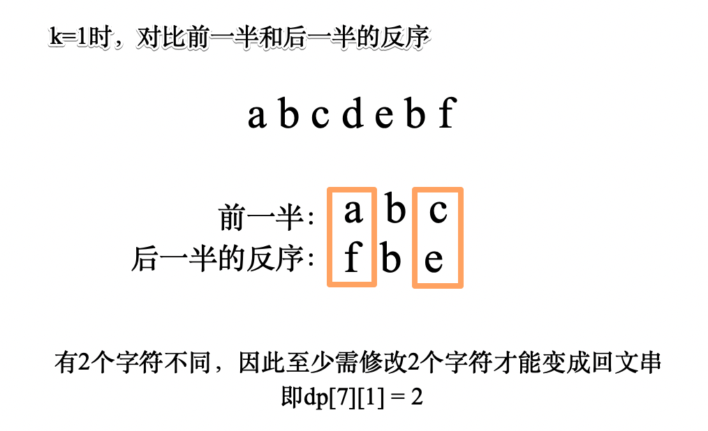

　　对于`k>1`的情况，我们假设在`j`的位置进行最后一次分割，那么`s[:j]`需要分割为`k-1`个子串，`s[j:i]`需要分割成`1`个子串。`s[:j]`分成`k-1`个子串需要修改的字符数为`dp[j][k-1]`，`s[j:i]`分成`1`个子串需要修改的字符数仍然使用上图的方法计算。  

　　状态转移方程`dp[i][k] = min(dp[i][k], dp[j][k-1] + get_change(j, i))`。  

#### **代码:**

```python
class Solution:
    def palindromePartition(self, s: str, k: int) -> int:
        # dp[i][k] 表示s[:i]分割成k个子串需要修改的最少字符数
        n = len(s)
        dp = [[float('inf') for _ in range(k+1)] for _ in range(n+1)]
        
        from functools import lru_cache
        @lru_cache(None)
        def get_change(j, i):  # 获取s[j:i]变成回文串需要修改的最少字符数
            pos = s[j:i]
            rever = pos[::-1]
            dp_i = 0
            for k in range((i-j)//2):
                if pos[k] != rever[k]:
                    dp_i += 1
            return dp_i
        
        for i in range(n+1):
            dp[i][1] = get_change(0, i)
            
        for kk in range(2, k + 1):
            for i in range(n + 1):
                for j in range(i + 1):
                    dp[i][kk] = min(dp[i][kk], dp[j][kk-1] + get_change(j, i))  # s[:j]  s[j:i]
            
        # print(dp)
        return dp[-1][-1]
                

```

## A1349. 参加考试的最大学生数

难度`困难`

#### 题目描述

给你一个 `m * n` 的矩阵 `seats` 表示教室中的座位分布。如果座位是坏的（不可用），就用 `'#'` 表示；否则，用 `'.'` 表示。

学生可以看到左侧、右侧、左上、右上这四个方向上紧邻他的学生的答卷，但是看不到直接坐在他前面或者后面的学生的答卷。请你计算并返回该考场可以容纳的一起参加考试且无法作弊的最大学生人数。

学生必须坐在状况良好的座位上。

> **示例 1：**


```
输入：seats = [["#",".","#","#",".","#"],
              [".","#","#","#","#","."],
              ["#",".","#","#",".","#"]]
输出：4
解释：教师可以让 4 个学生坐在可用的座位上，这样他们就无法在考试中作弊。 
```

> **示例 2：**

```
输入：seats = [[".","#"],
              ["#","#"],
              ["#","."],
              ["#","#"],
              [".","#"]]
输出：3
解释：让所有学生坐在可用的座位上。
```

> **示例 3：**

```
输入：seats = [["#",".",".",".","#"],
              [".","#",".","#","."],
              [".",".","#",".","."],
              [".","#",".","#","."],
              ["#",".",".",".","#"]]
输出：10
解释：让学生坐在第 1、3 和 5 列的可用座位上。
```

**提示：**

- `seats` 只包含字符 `'.' 和``'#'`
- `m == seats.length`
- `n == seats[i].length`
- `1 <= m <= 8`
- `1 <= n <= 8`

#### 题目链接

<https://leetcode-cn.com/problems/maximum-students-taking-exam/>

#### **思路:**

　　状态压缩dp。  

　　因为`m`和`n`的范围都很小。因此可以用`2^n`，即最大为`128`的数的二进制位来表示坐或者不坐的状态。  

　　先将座位💺的`"#"`转为`1`，`"."`转为`0`，如果座位和当前状态`与运算`结果为 0，表示可以这么坐。例如`"#.##.#"`转成二进制为`"101101"`，因此可行的坐人方式只有`"010010"`、`"000010"`和`"010000"`三种。  

　　判断左右是否坐人可以用`state & state << 1`和`state & state >> 1`来判断，也可以转成二进制判断字符串中是否有`"11"`。  

　　判断左前方和右前方是否坐人可以用`state & pre << 1`和`state & pre >> 1`来判断。  

　　从前往后dp，`dp[line][s]`表示第`line`行状态为`s`时**总共**坐的人数，有状态转移方程`dp[line][state] = max(dp[line][state],  dp[line-1][pre] + state.count('1')`。  

#### **代码:**

```python
class Solution:
    def maxStudents(self, seats: List[List[str]]) -> int:
        m = len(seats)
        if not m:
            return 0
        n = len(seats[0])
        dp = [[0 for _ in range(2**n)] for _ in range(m)]   # 8 * 64

        # 将 # 设为 1，. 设为0，如果与运算结果为 0，表示可以坐人
        seats = [int(''.join(line).replace('#', '1').replace('.', '0'), 2) for line in seats]

        for line in range(m):
            for state in range(2 ** n):
                if '11' in bin(state) or seats[line] & state:  # 左右有人 或者与座位冲突
                    continue

                for pre in range(2**n):  # 前面的状态
                    if pre & state >> 1 or pre & state << 1:
                        continue
    
                    if line == 0:
                        dp[0][state] = bin(state).count('1')
                    else:
                        dp[line][state] = max(dp[line][state],  dp[line-1][pre] + bin(state).count('1'))

        return max(dp[-1])
      
```

## A1411. 给 N x 3 网格图涂色的方案数

难度`困难`

#### 题目描述

你有一个 `n x 3` 的网格图 `grid` ，你需要用 **红，黄，绿** 三种颜色之一给每一个格子上色，且确保相邻格子颜色不同（也就是有相同水平边或者垂直边的格子颜色不同）。

给你网格图的行数 `n` 。

请你返回给 `grid` 涂色的方案数。由于答案可能会非常大，请你返回答案对 `10^9 + 7` 取余的结果。

> **示例 1：**

```
输入：n = 1
输出：12
解释：总共有 12 种可行的方法：
```


> **示例 2：**

```
输入：n = 2
输出：54
```

> **示例 3：**

```
输入：n = 3
输出：246
```

> **示例 4：**

```
输入：n = 7
输出：106494
```

> **示例 5：**

```
输入：n = 5000
输出：30228214
```

**提示：**

- `n == grid.length`
- `grid[i].length == 3`
- `1 <= n <= 5000`

#### 题目链接

<https://leetcode-cn.com/problems/number-of-ways-to-paint-n-x-3-grid/>

#### **思路:**

　　**方法一：**递归搜索，按从上到下，从左到右的顺序搜索，填充和相邻格子不同的颜色并计数。（超时）  

　　**方法二：**状态压缩dp，将一行看成是一个整体，共有`12`种可能的状态，下一行的状态和上一行的状态不冲突即可。记录每种状态的种数，统计总数即可。  

#### **代码:**

　　**方法一：**递归搜索（超时）

```python
sys.setrecursionlimit(1000000000)
def numOfWays(n: int) -> int:
    mem = [[0 for _ in range(3)] for _ in range(n)]  # n * 3

    ans = 0

    def dfs(i, j):
        nonlocal ans

        if i < 0 or j < 0 or i >= n or j >= 3:
            return

        # 下一个位置
        if j < 2:
            x, y = i, j + 1
        else:
            x, y = i + 1, 0

        for color in range(1, 4):
            if i > 0 and mem[i - 1][j] == color:
                continue
            if j > 0 and mem[i][j - 1] == color:
                continue
            if i < n - 1 and mem[i + 1][j] == color:
                continue
            if j < 2 and mem[i][j + 1] == color:
                continue

            mem[i][j] = color
            if i == n - 1 and j == 2:
                ans += 1
                # print(mem)
            dfs(x, y)
            mem[i][j] = 0

    dfs(0, 0)
    return ans

```

　　**方法二：**状态压缩dp

```python
class Solution:
    def numOfWays(self, n: int) -> int:
        state = ['010', '012', '020', '021', '101', '102', '120', '121','201', '202', '210','212']

        dp = [[0 for _ in range(27)] for _ in range(n)]  # n * 12
        for i in range(12):
            dp[0][int(state[i], 3)] = 1

        for i in range(1, n):
            for s1 in state:
                for s2 in state:
                    for k in range(3):
                        if s1[k] == s2[k]:
                            break
                    else:
                        dp[i][int(s2 ,3)] += dp[i-1][int(s1, 3)]


        return sum(dp[-1]) %1000000007
```

## A1416. 恢复数组

难度`困难`

#### 题目描述

某个程序本来应该输出一个整数数组。但是这个程序忘记输出空格了以致输出了一个数字字符串，我们所知道的信息只有：数组中所有整数都在 `[1, k]` 之间，且数组中的数字都没有前导 0 。

给你字符串 `s` 和整数 `k` 。可能会有多种不同的数组恢复结果。

按照上述程序，请你返回所有可能输出字符串 `s` 的数组方案数。

由于数组方案数可能会很大，请你返回它对 `10^9 + 7` **取余** 后的结果。

> **示例 1：**

```
输入：s = "1000", k = 10000
输出：1
解释：唯一一种可能的数组方案是 [1000]
```

> **示例 2：**

```
输入：s = "1000", k = 10
输出：0
解释：不存在任何数组方案满足所有整数都 >= 1 且 <= 10 同时输出结果为 s 。
```

> **示例 3：**

```
输入：s = "1317", k = 2000
输出：8
解释：可行的数组方案为 [1317]，[131,7]，[13,17]，[1,317]，[13,1,7]，[1,31,7]，[1,3,17]，[1,3,1,7]
```

> **示例 4：**

```
输入：s = "2020", k = 30
输出：1
解释：唯一可能的数组方案是 [20,20] 。 [2020] 不是可行的数组方案，原因是 2020 > 30 。 [2,020] 也不是可行的数组方案，因为 020 含有前导 0 。
```

> **示例 5：**

```
输入：s = "1234567890", k = 90
输出：34
```

**提示：**

- `1 <= s.length <= 10^5`.
- `s` 只包含数字且不包含前导 0 。
- `1 <= k <= 10^9`.

#### 题目链接

<https://leetcode-cn.com/problems/restore-the-array/>

#### **思路:**

　　动态规划。`dp[i]`表示`s[:i]`的分割种数。为了方便令`dp[0] = 1`。    

　　转移方程`dp[i] = sum(dp[0:i])`，注意把前导`0`和大于`k`的情况排除一下。  

#### **代码:**

```python
class Solution:
    def numberOfArrays(self, s: str, k: int) -> int:
        lk = len(str(k))
        n = len(s)
        dp = [0] * (n + 1)  # dp[i] 在i之前的位置加，
        dp[0] = 1  # 不split是一种
        for i in range(1, n + 1):
            if i < n and s[i] == '0':
                continue

            for j in range(i - 1, -1, -1):
                if int(s[j:i]) <= k:
                    dp[i] += dp[j] % 1000000007
                else:
                    break

        return dp[-1] % 1000000007

```

## A1420. 生成数组

难度`困难`

#### 题目描述

给你三个整数 `n`、`m` 和 `k` 。下图描述的算法用于找出正整数数组中最大的元素。

  

请你生成一个具有下述属性的数组 `arr` ：

- `arr` 中有 `n` 个整数。
- `1 <= arr[i] <= m` 其中 `(0 <= i < n)` 。
- 将上面提到的算法应用于 `arr` ，`search_cost` 的值等于 `k` 。

返回上述条件下生成数组 `arr` 的 **方法数** ，由于答案可能会很大，所以 **必须** 对 `10^9 + 7` 取余。

> **示例 1：**

```
输入：n = 2, m = 3, k = 1
输出：6
解释：可能的数组分别为 [1, 1], [2, 1], [2, 2], [3, 1], [3, 2] [3, 3]
```

> **示例 2：**

```
输入：n = 5, m = 2, k = 3
输出：0
解释：没有数组可以满足上述条件
```

> **示例 3：**

```
输入：n = 9, m = 1, k = 1
输出：1
解释：可能的数组只有 [1, 1, 1, 1, 1, 1, 1, 1, 1]
```

> **示例 4：**

```
输入：n = 50, m = 100, k = 25
输出：34549172
解释：不要忘了对 1000000007 取余
```

> **示例 5：**

```
输入：n = 37, m = 17, k = 7
输出：418930126
```

**提示：**

- `1 <= n <= 50`
- `1 <= m <= 100`
- `0 <= k <= n`

#### 题目链接

<https://leetcode-cn.com/problems/build-array-where-you-can-find-the-maximum-exactly-k-comparisons/>

#### **思路:**

　　这道题中`search_cost`的更新规则为，如果`arr[i] > arr[i-1]`，则`search_cost+1`。  

　　所以这题也就是求**恰好有（k-1）个数大于它前面的最大值**的`arr`的种类数。  

　　令`dp[i][j][kk]`表示`arr[:i]`最大元素为`j`且`search_cost = kk`能表示的种数。  

　　假设当前数组最大的元素为`j`，如果增加一个元素，而保持`k`保持不变的话，增加的新的元素不能超过`j`，也就是取值范围`[1, j]`，共有`j`种可能。这一部分表示为`dp[i - 1][j][kk] * j`。  

　　如果增加一个元素，会使得`kk+1`，那么增加的元素一定是最大的`j`，这一部分共有sum(`dp[i - 1][1: j][kk-1]`)种可能性。  

　　因此递推公式`dp[i][j][kk] = dp[i - 1][j][kk] * j +sum(dp[i - 1][1: j][kk-1])`。

#### **代码:**

```python
class Solution:
    def numOfArrays(self, n: int, m: int, k: int) -> int:
        dp = [[[0 for _ in range(k + 1)] for _ in range(m + 1)] for _ in range(n)]
        for j in range(1, m + 1):
            dp[0][j][1] = 1

        for i in range(1, n):
            for kk in range(1, k + 1):           
                acc = 0
                for j in range(1, m + 1):
                    dp[i][j][kk] = dp[i - 1][j][kk] * j + acc
                    acc += dp[i - 1][j][kk - 1]

        ans = 0
        for line in dp[n - 1]:
            ans += line[k]
        return ans % 1000000007

```

## A1434. 每个人戴不同帽子的方案数

难度`困难`

#### 题目描述

总共有 `n` 个人和 `40` 种不同的帽子，帽子编号从 `1` 到 `40` 。

给你一个整数列表的列表 `hats` ，其中 `hats[i]` 是第 `i` 个人所有喜欢帽子的列表。

请你给每个人安排一顶他喜欢的帽子，确保每个人戴的帽子跟别人都不一样，并返回方案数。

由于答案可能很大，请返回它对 `10^9 + 7` 取余后的结果。

> **示例 1：**

```
输入：hats = [[3,4],[4,5],[5]]
输出：1
解释：给定条件下只有一种方法选择帽子。
第一个人选择帽子 3，第二个人选择帽子 4，最后一个人选择帽子 5。
```

> **示例 2：**

```
输入：hats = [[3,5,1],[3,5]]
输出：4
解释：总共有 4 种安排帽子的方法：
(3,5)，(5,3)，(1,3) 和 (1,5)
```

> **示例 3：**

```
输入：hats = [[1,2,3,4],[1,2,3,4],[1,2,3,4],[1,2,3,4]]
输出：24
解释：每个人都可以从编号为 1 到 4 的帽子中选。
(1,2,3,4) 4 个帽子的排列方案数为 24 。
```

> **示例 4：**

```
输入：hats = [[1,2,3],[2,3,5,6],[1,3,7,9],[1,8,9],[2,5,7]]
输出：111
```

**提示：**

- `n == hats.length`
- `1 <= n <= 10`
- `1 <= hats[i].length <= 40`
- `1 <= hats[i][j] <= 40`
- `hats[i]` 包含一个数字互不相同的整数列表。

#### 题目链接

<https://leetcode-cn.com/problems/number-of-ways-to-wear-different-hats-to-each-other/>

#### **思路:**

　　由于帽子的数量相对较大，而人数相对较小。可以反过来考虑每顶帽子喜欢的人。  

　　状态压缩dp。`n`个人是否选了喜欢的帽子的状态，可以用`n`位二进制来表示。`dp[status]`表示某种状态的种数。选了帽子的人就不能再次选帽子，因此状态转移方程`dp'[cur | j] += dp[j]`，其中`j & cur == 0`。  

　　因为最后所有人的都要选帽子，所以返回的结果为`dp['1111..111']`(n个'1')，也就是`dp[2^n-1]`。  

#### **代码:**

```python
class Solution:
    def numberWays(self, hats: List[List[int]]) -> int:
        n = len(hats)

        # dp[]
        shown = set()  # 所有的帽子
        for line in hats:
            shown.update(set(line))

        # dp[status]

        mem = defaultdict(list)  # 每顶帽子喜欢的人
        for i, line in enumerate(hats):
            for hat in line:
                mem[hat].append(i)

        dp = [0] * 2 ** n
        dp[0] = 1
        for i in range(1, len(shown) + 1):
            temp = dp.copy()
            hat = shown.pop()  # 下一顶帽子hat
            for j in range(2 ** n):
                if dp[j] == 0:  # j的情况不可能出现
                    continue
                for person in mem[hat]:  # 这顶帽子hat喜欢的所有人
                    cur = 1 << person  # 这个人的二进制编码
                    if cur & j:  # 这个人已经有了喜欢的帽子
                        continue
                    temp[cur | j] += dp[j]  # 更新新的状态

            dp = temp

        # print(shown)

        return dp[-1] % (1000000000 + 7)

```

## 周赛题：切披萨的方案数

难度`困难`

#### 题目描述

给你一个 `rows x cols` 大小的矩形披萨和一个整数 `k` ，矩形包含两种字符： `'A'` （表示苹果）和 `'.'` （表示空白格子）。你需要切披萨 `k-1` 次，得到 `k` 块披萨并送给别人。

切披萨的每一刀，先要选择是向垂直还是水平方向切，再在矩形的边界上选一个切的位置，将披萨一分为二。如果垂直地切披萨，那么需要把左边的部分送给一个人，如果水平地切，那么需要把上面的部分送给一个人。在切完最后一刀后，需要把剩下来的一块送给最后一个人。

请你返回确保每一块披萨包含 **至少** 一个苹果的切披萨方案数。由于答案可能是个很大的数字，请你返回它对 10^9 + 7 取余的结果。

> **示例 1：**

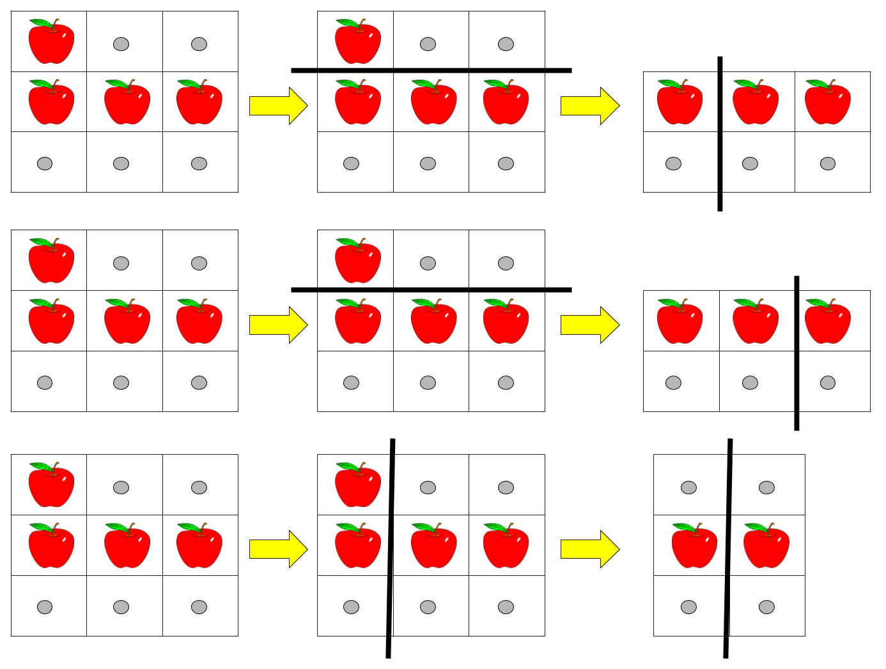

```
输入：pizza = ["A..","AAA","..."], k = 3
输出：3 
解释：上图展示了三种切披萨的方案。注意每一块披萨都至少包含一个苹果。
```

> **示例 2：**

```
输入：pizza = ["A..","AA.","..."], k = 3
输出：1
```

> **示例 3：**

```
输入：pizza = ["A..","A..","..."], k = 1
输出：1
```

**提示：**

- `1 <= rows, cols <= 50`
- `rows == pizza.length`
- `cols == pizza[i].length`
- `1 <= k <= 10`
- `pizza` 只包含字符 `'A'` 和 `'.'` 。

#### 题目链接

<https://leetcode-cn.com/problems/number-of-ways-of-cutting-a-pizza/>

#### **思路:**

　　由于要多次查询矩形区域内有没有苹果，因此先用`has_apple[x1][x2][y1][y2]`表示`pizza[x1:x2][y1:y2]`的范围内有没有苹果。  

　　`dp[i][j][k]`表示，矩形`[i:n][j:m]` 切割了`k`次的方案数，然后用动态规划求解。注意每次切割要保证切出来的两块矩形区域都有苹果🍎。    　

#### **代码:**

```python
from collections import defaultdict

class Solution:
    def ways(self, pizza: List[str], k: int) -> int:
        m = len(pizza)
        n = len(pizza[0])
        # dp = [[] for _ in range(k+1)]
        dp = {(0,0):1}
        
        has_apple = [[[[False for _ in range(n+1)] for _ in range(n+1)] for _ in range(m+1)] for _ in range(m+1)]   # m m n n
        for x1 in range(m):
            for x2 in range(x1+1, m+1):
                for y1 in range(n):
                    for y2 in range(y1+1, n+1):
                        if pizza[x2-1][y2-1] == 'A':
                            has_apple[x1][x2][y1][y2] = True
                            continue      
                        
                        has_apple[x1][x2][y1][y2] = has_apple[x1][x2-1][y1][y2] or  has_apple[x1][x2][y1][y2-1]
                    
                            
        
        # has_apple(x1, x2, y1, y2):  # pizza[x1:x2][y1:y2] 有没有苹果
            
        # print(has_apple)
            
        for kk in range(1, k):
            temp = defaultdict(int)
            for lm, ln in dp:  # 之前的情况
                count = dp[(lm, ln)]
                for i in range(lm+1, m):  # 按行切
                    if has_apple[lm][i][ln][n] and has_apple[i][m][ln][n]:                
                        temp[(i,ln)] += count
                for j in range(ln+1, n):  # 按列切
                    if has_apple[lm][m][ln][j] and has_apple[lm][m][j][n]:     
                        temp[(lm, j)] += count
                
            # print(temp)
            dp = temp
            
        return sum(dp.values()) % (1000000000 + 7)

```

## ALCP 14. 切分数组

难度`困难`

#### 题目描述

给定一个整数数组 `nums` ，小李想将 `nums` 切割成若干个非空子数组，使得每个子数组最左边的数和最右边的数的最大公约数大于 1 。为了减少他的工作量，请求出最少可以切成多少个子数组。

> **示例 1：**

> 输入：`nums = [2,3,3,2,3,3]`
>
> 输出：`2`
>
> 解释：最优切割为 [2,3,3,2] 和 [3,3] 。第一个子数组头尾数字的最大公约数为 2 ，第二个子数组头尾数字的最大公约数为 3 。

> **示例 2：**

> 输入：`nums = [2,3,5,7]`
>
> 输出：`4`
>
> 解释：只有一种可行的切割：[2], [3], [5], [7]

**限制：**

- `1 <= nums.length <= 10^5`
- `2 <= nums[i] <= 10^6`

#### 题目链接

<https://leetcode-cn.com/problems/qie-fen-shu-zu/>

#### **思路:**

　　准备工作：先用埃式筛法找出所有素数，然后对所有的元素分解质因数。  

　　动态规划。令`dp[i]`表示数组的前`i`位最少切成多少个子数组，`D[c]`表示以某个素数`c`的倍数的元素之前做分割最少切成多少个子数组。详细见代码注释。  

#### **代码:**

```python
# 埃氏筛求素数表(得到<1000000的所有素数)
for i in range(2, 1000):
    if P[i]:
        Z.append(i)
        for j in range(i * 2, 1000, i):
            P[j] = False

# 分解质因数
@lru_cache(None)
def Factor(n):
    Res = []
    for p in Z:
        if not n % p:
            while not n % p:
                n //= p
            Res.append(p)
    if n != 1:
        Res.append(n)
    return Res

class Solution:
    def splitArray(self, nums: List[int]) -> int:
        D = defaultdict(lambda: inf)  # D[c] 表示以因子c划分，得到的最小结果
        dp = [inf for _ in range(len(nums)+1)]
        dp[0] = 0

        # Factor(n)
        for i in range(len(nums)):
            num = nums[i]
            dp[i+1] = dp[i] + 1  # 将num单独分出来
            for c in Factor(num):
                dp[i+1] = min(dp[i+1], D[c])  # 以num为右端点，某个c的倍数的位置为左端点，得到的最小结果
                D[c] = min(D[c], dp[i] + 1)

        # print(dp)    
        return dp[-1]

```

