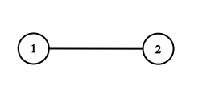
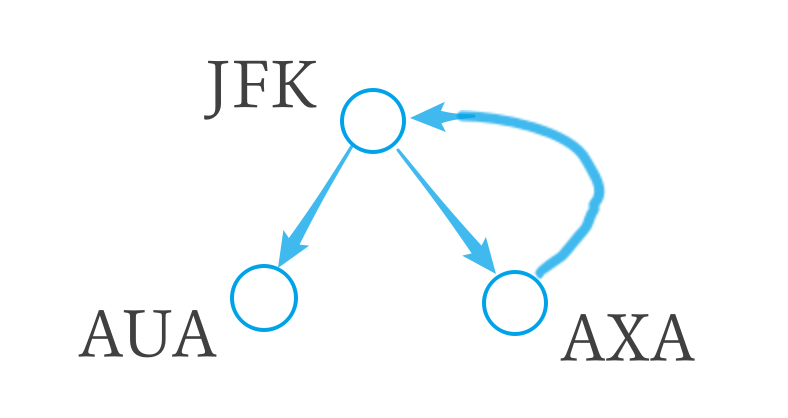

# 图

## A133. 克隆图

难度`中等`

#### 题目描述

给你无向 **连通** 图中一个节点的引用，请你返回该图的 [**深拷贝**](https://baike.baidu.com/item/深拷贝/22785317?fr=aladdin)（克隆）。

图中的每个节点都包含它的值 `val`（`int`） 和其邻居的列表（`list[Node]`）。

```
class Node {
    public int val;
    public List<Node> neighbors;
} 
```

**测试用例格式：**

简单起见，每个节点的值都和它的索引相同。例如，第一个节点值为 1（`val = 1`），第二个节点值为 2（`val = 2`），以此类推。该图在测试用例中使用邻接列表表示。

**邻接列表** 是用于表示有限图的无序列表的集合。每个列表都描述了图中节点的邻居集。

给定节点将始终是图中的第一个节点（值为 1）。你必须将 **给定节点的拷贝** 作为对克隆图的引用返回。

> **示例 1：**


```
输入：adjList = [[2,4],[1,3],[2,4],[1,3]]
输出：[[2,4],[1,3],[2,4],[1,3]]
解释：
图中有 4 个节点。
节点 1 的值是 1，它有两个邻居：节点 2 和 4 。
节点 2 的值是 2，它有两个邻居：节点 1 和 3 。
节点 3 的值是 3，它有两个邻居：节点 2 和 4 。
节点 4 的值是 4，它有两个邻居：节点 1 和 3 。
```

> **示例 2：**


```
输入：adjList = [[]]
输出：[[]]
解释：输入包含一个空列表。该图仅仅只有一个值为 1 的节点，它没有任何邻居。
```

> **示例 3：**

```
输入：adjList = []
输出：[]
解释：这个图是空的，它不含任何节点。
```

> **示例 4：**



```
输入：adjList = [[2],[1]]
输出：[[2],[1]]
```

#### 题目链接

<https://leetcode-cn.com/problems/clone-graph/>

#### **思路:**

　　用一个字典记录`结点值`和`结点指针`的映射关系，这样在一条**新的边**连接到**旧的结点**上时就能找到之前创建过的结点。  

　　顺便提一下**浅拷贝**和**深拷贝**的区别：**浅拷贝**将原来的图拷贝一遍，增加或删除结点不会影响原来的图，但是浅拷贝**图中的结点还是原来的结点**，修改图中结点的值会影响原图中结点的值。而**深拷贝**将所有的结点都重新初始化一遍，也就是新的图和旧的图完全没有关系了。  

```python
G = [node1, node2, node3, node4]
G_浅拷贝 = [node1, node2, node3, node4]
# G_浅拷贝.append() 或者 G_浅拷贝.pop() 不会影响G
# 但是修改原有node的值(如G[0].val = 1)会影响原来的G
G_深拷贝 = [new_node1, new_node2, new_node3, new_node4]
# G_深拷贝 和 G 已经完全没有关系了
```

#### **代码:**

```python
class Solution:
    def cloneGraph(self, node: 'Node') -> 'Node':
        visited = {}
        def dfs(node):
            if not node:
                return None

            temp = Node(node.val)
            visited[node.val] = temp
            for n in node.neighbors:
                if n.val in visited:
                    temp.neighbors.append(visited[n.val])
                    continue
                temp.neighbors.append(dfs(n))      

            return temp

        return dfs(node)

```

## A310. 最小高度树

难度`中等`

#### 题目描述

对于一个具有树特征的无向图，我们可选择任何一个节点作为根。图因此可以成为树，在所有可能的树中，具有最小高度的树被称为最小高度树。给出这样的一个图，写出一个函数找到所有的最小高度树并返回他们的根节点。

**格式**

该图包含 `n` 个节点，标记为 `0` 到 `n - 1`。给定数字 `n` 和一个无向边 `edges` 列表（每一个边都是一对标签）。

你可以假设没有重复的边会出现在 `edges` 中。由于所有的边都是无向边， `[0, 1]`和 `[1, 0]` 是相同的，因此不会同时出现在 `edges` 里。

> **示例 1:**

```
输入: n = 4, edges = [[1, 0], [1, 2], [1, 3]]

        0
        |
        1
       / \
      2   3 

输出: [1]
```

> **示例 2:**

```
输入: n = 6, edges = [[0, 3], [1, 3], [2, 3], [4, 3], [5, 4]]

     0  1  2
      \ | /
        3
        |
        4
        |
        5 

输出: [3, 4]
```

#### 题目链接

<https://leetcode-cn.com/problems/minimum-height-trees/>

#### **思路:**

　　构建图，循环遍历图，找出叶子节点。去除叶子节点。直到图中节点只剩下2个或1个。返回剩下的节点。  

#### **代码:**

```python
from collections import defaultdict

class Solution:
    def findMinHeightTrees(self, n: int, edges: List[List[int]]) -> List[int]:
        if not n:
            return []
        if not edges:
            return list(range(n))

        graph = defaultdict(list)
        for x, y in edges:
            graph[x].append(y)
            graph[y].append(x)

        nodes = set(range(n))
        while True:
            if len(nodes) <= 2:
                return [n for n in nodes]
                
            leaves = []
            for k in graph:
                if len(graph[k]) == 1:
                    leaves.append(k)
                    nodes.remove(k)

            for k in leaves:
                    o = graph[k][0]
                    graph[k].clear()
                    graph[o].remove(k)

```

## A332. 重新安排行程

难度`中等`

#### 题目描述

给定一个机票的字符串二维数组 `[from, to]`，子数组中的两个成员分别表示飞机出发和降落的机场地点，对该行程进行重新规划排序。所有这些机票都属于一个从JFK（肯尼迪国际机场）出发的先生，所以该行程必须从 JFK 出发。

**说明:**

1. 如果存在多种有效的行程，你可以按字符自然排序返回最小的行程组合。例如，行程 ["JFK", "LGA"] 与 ["JFK", "LGB"] 相比就更小，排序更靠前
2. 所有的机场都用三个大写字母表示（机场代码）。
3. 假定所有机票至少存在一种合理的行程。

> **示例 1:**

```
输入: [["MUC", "LHR"], ["JFK", "MUC"], ["SFO", "SJC"], ["LHR", "SFO"]]
输出: ["JFK", "MUC", "LHR", "SFO", "SJC"]
```

> **示例 2:**

```
输入: [["JFK","SFO"],["JFK","ATL"],["SFO","ATL"],["ATL","JFK"],["ATL","SFO"]]
输出: ["JFK","ATL","JFK","SFO","ATL","SFO"]
解释: 另一种有效的行程是 ["JFK","SFO","ATL","JFK","ATL","SFO"]。但是它自然排序更大更靠后。
```

#### 题目链接

<https://leetcode-cn.com/problems/reconstruct-itinerary/>

#### **思路:**

　　求欧拉路径(一笔画问题)的栈版本，每次入栈的是字母序最小的。如果栈顶的结点没有相邻的结点就出栈。 

　　将出栈的次序倒序排列就是最终的结果。   



#### **代码:**

```python
from collections import defaultdict

class Solution:
    def findItinerary(self, tickets: List[List[str]]) -> List[str]:
        l = len(tickets)
        dict_t = defaultdict(list)
        for f, t in tickets:
            dict_t[f].append(t)

        stack = ['JFK']  # 初始位置
        ans = []
        while stack:
            curr = stack[-1]  # peek
            if dict_t[curr]:
                next = min(dict_t[curr])
                dict_t[curr].remove(next)
                stack.append(next)
            else:
                ans.append(curr)
                stack.pop()

        return ans[::-1]
      
```

## A743. 网络延迟时间

难度`中等`

#### 题目描述

有 `N` 个网络节点，标记为 `1` 到 `N`。

给定一个列表 `times`，表示信号经过**有向**边的传递时间。 `times[i] = (u, v, w)`，其中 `u` 是源节点，`v` 是目标节点， `w` 是一个信号从源节点传递到目标节点的时间。

现在，我们从某个节点 `K` 发出一个信号。需要多久才能使所有节点都收到信号？如果不能使所有节点收到信号，返回 `-1`。 

> **示例：**


```
输入：times = [[2,1,1],[2,3,1],[3,4,1]], N = 4, K = 2
输出：2 
```

**注意:**

1. `N` 的范围在 `[1, 100]` 之间。
2. `K` 的范围在 `[1, N]` 之间。
3. `times` 的长度在 `[1, 6000]` 之间。
4. 所有的边 `times[i] = (u, v, w)` 都有 `1 <= u, v <= N` 且 `0 <= w <= 100`。

#### 题目链接

<https://leetcode-cn.com/problems/network-delay-time/>

#### **思路:**

　　由于边的权是不同的**正数**，该题是不含负环的**单源最短路径**问题。  

　　Dijkstra算法是用来求单源最短路径问题，即给定图G和起点s，通过算法得到s到达其他每个顶点的最短距离。

　　基本思想：对图`G(V,E)`设置集合`S`，存放已被访问的顶点，然后每次从集合`V-S`中选择与起点s的最短距离最小的一个顶点（记为u），访问并加入集合`S`。之后，令u为中介点，优化起点s与所有从u能够到达的顶点v之间的最短距离。这样的操作执行n次（n为顶点个数），直到集合`S`已经包含所有顶点。　

#### **代码:**

```python
from collections import defaultdict

class Solution:
    def networkDelayTime(self, times: List[List[int]], N: int, K: int) -> int:
        edge = defaultdict(list)  # edge[1] = (t, 2)
        for u, v, w in times:
            edge[u].append((w, v))

        minimal = [float('inf') for _ in range(N + 1)]
        minimal[K] = 0
        S = {K} # 起点
        VS = edge[K]
        for t, node in edge[K]:
            minimal[node] = t

        while VS:
            t, u = min(VS)
            VS.remove((t, u))
            S.add(u)
            for path in edge[u]:
                if path[1] not in S:
                    VS.append(path)  # 防止出现环
            for t, node in edge[u]:
                minimal[node] = min(minimal[node], minimal[u] + t)  # 经过u为中介

        # print(minimal)
        ans = max(minimal[1:])
        return ans if ans != float('inf') else -1

```

