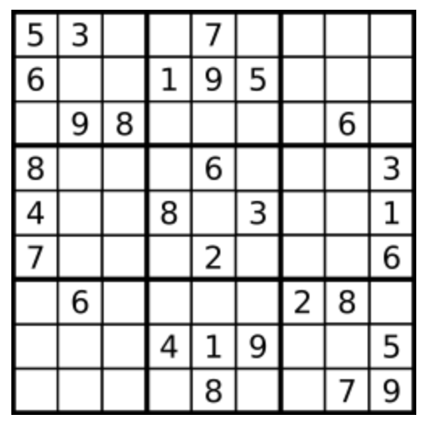

# 哈希表

## A36. 有效的数独

难度`中等`

#### 题目描述

判断一个 9x9 的数独是否有效。只需要**根据以下规则**，验证已经填入的数字是否有效即可。

1. 数字 `1-9` 在每一行只能出现一次。
2. 数字 `1-9` 在每一列只能出现一次。
3. 数字 `1-9` 在每一个以粗实线分隔的 `3x3` 宫内只能出现一次。



上图是一个部分填充的有效的数独。

数独部分空格内已填入了数字，空白格用 `'.'` 表示。

> **示例 1:**

```
输入:
[
  ["5","3",".",".","7",".",".",".","."],
  ["6",".",".","1","9","5",".",".","."],
  [".","9","8",".",".",".",".","6","."],
  ["8",".",".",".","6",".",".",".","3"],
  ["4",".",".","8",".","3",".",".","1"],
  ["7",".",".",".","2",".",".",".","6"],
  [".","6",".",".",".",".","2","8","."],
  [".",".",".","4","1","9",".",".","5"],
  [".",".",".",".","8",".",".","7","9"]
]
输出: true
```

> **示例 2:**

```
输入:
[
  ["8","3",".",".","7",".",".",".","."],
  ["6",".",".","1","9","5",".",".","."],
  [".","9","8",".",".",".",".","6","."],
  ["8",".",".",".","6",".",".",".","3"],
  ["4",".",".","8",".","3",".",".","1"],
  ["7",".",".",".","2",".",".",".","6"],
  [".","6",".",".",".",".","2","8","."],
  [".",".",".","4","1","9",".",".","5"],
  [".",".",".",".","8",".",".","7","9"]
]
输出: false
解释: 除了第一行的第一个数字从 5 改为 8 以外，空格内其他数字均与 示例1 相同。
     但由于位于左上角的 3x3 宫内有两个 8 存在, 因此这个数独是无效的。
```

**说明:**

- 一个有效的数独（部分已被填充）不一定是可解的。
- 只需要根据以上规则，验证已经填入的数字是否有效即可。
- 给定数独序列只包含数字 `1-9` 和字符 `'.'` 。
- 给定数独永远是 `9x9` 形式的。


#### 题目链接

<https://leetcode-cn.com/problems/valid-sudoku/>

#### **思路:**


　　用集合判断数字是否出现过。  

#### **代码:**

```python
class Solution:
    def isValidSudoku(self, board: List[List[str]]) -> bool:
        line = [set() for _ in range(9)]
        col = [set() for _ in range(9)]
        room = [set() for _ in range(9)]  # 九宫格

        for i in range(9):
            for j in range(9):
                x = (i // 3) * 3 + j // 3   # room_id
                num = board[i][j]
                if num == '.':  # 忽略 .
                    continue

                if num in line[i] or num in col[j] or num in room[x]:
                    return False

                line[i].add(num)
                col[j].add(num)
                room[x].add(num)

        return True

```

## A128. 最长连续序列

难度`困难`

#### 题目描述

给定一个未排序的整数数组，找出最长连续序列的长度。

要求算法的时间复杂度为 *O(n)*。

> **示例:**

```
输入: [100, 4, 200, 1, 3, 2]
输出: 4
解释: 最长连续序列是 [1, 2, 3, 4]。它的长度为 4。
```

#### 题目链接

<https://leetcode-cn.com/problems/longest-consecutive-sequence/>

#### **思路:**　　　　

　　用哈希表存储每个数值所在连续区间的长度

① 若数已在哈希表中：说明已经处理过了，跳过不做处理；  
② 若是新数：取出其左右相邻数已有的连续区间长度`left`和`right`，新数和左右的数能够组成的最长区间为：`cur`=`left + right + 1`；  

③ 更新区间两端点的长度值；  

④ 如果`cur > ans`，则更新`ans`。  

#### **代码:**

```python
from collections import defaultdict
class Solution:
    def longestConsecutive(self, nums: List[int]) -> int:
        mem = defaultdict(int)
        ans = 0
        for num in nums:
            if mem[num] != 0:
                continue
            left = mem[num-1]
            right = mem[num+1]
            cur = left + right + 1

            mem[num] = cur
            mem[num-left] = cur
            mem[num+right] = cur

            ans = max(ans, cur)

        return ans

```

## A138. 复制带随机指针的链表

难度`中等`

#### 题目描述

给定一个链表，每个节点包含一个额外增加的随机指针，该指针可以指向链表中的任何节点或空节点。

要求返回这个链表的 **深拷贝**。 

我们用一个由 `n` 个节点组成的链表来表示输入/输出中的链表。每个节点用一个 `[val, random_index]` 表示：

- `val`：一个表示 `Node.val` 的整数。
- `random_index`：随机指针指向的节点索引（范围从 `0` 到 `n-1`）；如果不指向任何节点，则为  `null` 。

> **示例 1：**


```
输入：head = [[7,null],[13,0],[11,4],[10,2],[1,0]]
输出：[[7,null],[13,0],[11,4],[10,2],[1,0]]
```

> **示例 2：**


```
输入：head = [[1,1],[2,1]]
输出：[[1,1],[2,1]]
```

> **示例 3：**


```
输入：head = [[3,null],[3,0],[3,null]]
输出：[[3,null],[3,0],[3,null]]
```

> **示例 4：**

```
输入：head = []
输出：[]
解释：给定的链表为空（空指针），因此返回 null。
```

**提示：**

- `-10000 <= Node.val <= 10000`
- `Node.random` 为空（null）或指向链表中的节点。
- 节点数目不超过 1000 。

#### 题目链接

<https://leetcode-cn.com/problems/copy-list-with-random-pointer/>

#### **思路:**

　　第一次遍历(用哈希表)记录原始链表结点与下标的映射，第二次遍历记录原始链表每个结点与`random指针`指向结点的**下标**的映射，第三次遍历复制链表，并根据下标复制`random指针`。  　　

#### **代码:**

```python
"""
# Definition for a Node.
class Node:
    def __init__(self, x: int, next: 'Node' = None, random: 'Node' = None):
        self.val = int(x)
        self.next = next
        self.random = random
"""
class Solution:
    def copyRandomList(self, head: 'Node') -> 'Node':
        origin = {}  # node: index
        random = {}
        copy = {}  # index: node
        i = 0
        node = head
        ans = node_copy = Node(0)
        while node:  # 第一遍遍历
            origin[node] = i
            new_node = Node(node.val)
            copy[i] = new_node
            node_copy.next = new_node
            node_copy = new_node

            node = node.next
            i += 1

        node = head
        i = 0 
        while node:
            random[i] = None if node.random is None else origin[node.random]
            node = node.next
            i += 1

        node = ans.next
        i = 0
        while node:
            node.random = None if random[i] is None else copy[random[i]]
            node = node.next
            i += 1

        return ans.next        

```

## A149. 直线上最多的点数

难度`困难`

#### 题目描述

给定一个二维平面，平面上有 *n* 个点，求最多有多少个点在同一条直线上。

> **示例 1:**

```
输入: [[1,1],[2,2],[3,3]]
输出: 3
解释:
^
|
|        o
|     o
|  o  
+------------->
0  1  2  3  4
```

> **示例 2:**

```
输入: [[1,1],[3,2],[5,3],[4,1],[2,3],[1,4]]
输出: 4
解释:
^
|
|  o
|     o        o
|        o
|  o        o
+------------------->
0  1  2  3  4  5  6
```

#### 题目链接

<https://leetcode-cn.com/problems/max-points-on-a-line/>

#### **思路:**

　　这题要注意精度的问题。  

　　把相同的点合并到一起，每个点`(x, y)`都和之后的所有点比较一遍，看最多能有多少个点能和`(x, y)`在一条直线上。最后统计全局的最大值。  

#### **代码:**

```python
class Solution:

    def maxPoints(self, p):
        cnt = collections.Counter((x, y) for x, y in p)
        if len(cnt) <= 2:
            return len(p)
        ans = 0
        for _ in range(1, len(cnt)):
            (x1, y1), t1 = cnt.popitem()
            slp = collections.defaultdict(lambda: t1)
            for (x2, y2), t2 in cnt.items():  # 以x2,y2为起点比较
                s = (y2 - y1) / (x2 - x1) if x1 != x2 else float('inf')
                slp[s] += t2
            ans = max(ans, max(slp.values()))
        print(slp)
        return ans

```

## A166. 分数到小数

难度`中等`

#### 题目描述

给定两个整数，分别表示分数的分子 numerator 和分母 denominator，以字符串形式返回小数。

如果小数部分为循环小数，则将循环的部分括在括号内。

> **示例 1:**

```
输入: numerator = 1, denominator = 2
输出: "0.5"
```

> **示例 2:**

```
输入: numerator = 2, denominator = 1
输出: "2"
```

> **示例 3:**

```
输入: numerator = 2, denominator = 3
输出: "0.(6)"
```

#### 题目链接

<https://leetcode-cn.com/problems/fraction-to-recurring-decimal/>

#### **思路:**

　　用模拟除法的方式来计算。注意`Python`中负数除以正数的余数为正数，所有将被除数和除数都先转成正数处理。  

#### **代码:**

```python
class Solution:
    def fractionToDecimal(self, numerator: int, denominator: int) -> str:
        if numerator * denominator >= 0:
            negative = False
        else:
            negative = True

        numerator, denominator = abs(numerator), abs(denominator)

        ans = ''
        set_n = {}  # 记录有哪些被除数的部分算过了 如 2/6=0.3...2 这里再次出现的2就算过了
        i = 0

        dot = False

        while numerator:
            div, mod = divmod(numerator, denominator)
            ans += str(div)
            if not dot: ans += '.'; dot = True
            numerator = mod * 10
            i += len(str(div))

            if numerator in set_n:
                k = set_n[numerator]
                ans = ans[:k+1] + '(' + ans[k+1:]
                break
            else:
                set_n[numerator] = i

        if '(' in ans: ans += ')'
        ans = ans.rstrip('.')
        if not ans: ans = '0'
        if negative: ans = '-' + ans

        return ans

```

## A187. 重复的DNA序列

难度`中等`

#### 题目描述

所有 DNA 都由一系列缩写为 A，C，G 和 T 的核苷酸组成，例如：“ACGAATTCCG”。在研究 DNA 时，识别 DNA 中的重复序列有时会对研究非常有帮助。

编写一个函数来查找 DNA 分子中所有出现超过一次的 10 个字母长的序列（子串）。

> **示例：**

```
输入：s = "AAAAACCCCCAAAAACCCCCCAAAAAGGGTTT"
输出：["AAAAACCCCC", "CCCCCAAAAA"]
```

#### 题目链接

<https://leetcode-cn.com/problems/repeated-dna-sequences/>

#### **思路:**

　　用集合记录长度为`10`的片段，如果当前的片段出现过，就加入到结果中。  

#### **代码:**

```python
class Solution:
    def findRepeatedDnaSequences(self, s: str) -> List[str]:
        n = len(s)
        if n <=10:
            return []

        shown = set()
        ans = set()
        for i in range(n-10+1):
            fragment = s[i:i+10]
            if fragment in shown:
                ans.add(fragment)
            shown.add(fragment)

        return [a for a in ans]

```

## A202. 快乐数

难度`简单`

#### 题目描述

编写一个算法来判断一个数 `n` 是不是快乐数。

「快乐数」定义为：对于一个正整数，每一次将该数替换为它每个位置上的数字的平方和，然后重复这个过程直到这个数变为 1，也可能是 **无限循环** 但始终变不到 1。如果 **可以变为**  1，那么这个数就是快乐数。

如果 `n` 是快乐数就返回 `True` ；不是，则返回 `False` 。

> **示例：**

```
输入：19
输出：true
解释：
12 + 92 = 82
82 + 22 = 68
62 + 82 = 100
12 + 02 + 02 = 1
```

#### 题目链接

<https://leetcode-cn.com/problems/happy-number/>

#### **思路:**

　　用集合判断下一个数字是否已经出现过了。  

#### **代码:**

```python
class Solution:
    def isHappy(self, n: int) -> bool:
        shown = set()
        shown.add(n)
        while n != 1:
            n = sum(map(lambda x:int(x)**2 ,list(str(n))))
            # print(n)
            if n in shown:
                return False
            shown.add(n)
            
        return True

```

## A204. 计数质数

难度`简单`

#### 题目描述

统计所有小于非负整数 *n* 的质数的数量。

> **示例:**

```
输入: 10
输出: 4
解释: 小于 10 的质数一共有 4 个, 它们是 2, 3, 5, 7 。
```

#### 题目链接

<https://leetcode-cn.com/problems/count-primes/>

#### **思路:**

　　这题的解法称之为`埃拉托斯特尼筛法`，发现一个质数以后，把这个质数所有的倍数全部划去。最后统计质数的个数。    

#### **代码:**

```python
class Solution:
    def countPrimes(self, n: int) -> int:
        # 最小的质数是 2
        if n < 2:
            return 0

        isPrime = [1] * n
        isPrime[0] = isPrime[1] = 0   # 0和1不是质数，先排除掉

        # 埃式筛，把不大于根号n的所有质数的倍数剔除
        for i in range(2, int(n ** 0.5) + 1):
            if isPrime[i]:
                isPrime[i * i:n:i] = [0] * ((n - 1 - i * i) // i + 1)

        return sum(isPrime)

```

## A205. 同构字符串

难度`简单`

#### 题目描述

给定两个字符串 ***s*** 和 **t**，判断它们是否是同构的。

如果 ***s*** 中的字符可以被替换得到 **t** ，那么这两个字符串是同构的。

所有出现的字符都必须用另一个字符替换，同时保留字符的顺序。两个字符不能映射到同一个字符上，但字符可以映射自己本身。

> **示例 1:**

```
输入: s = "egg", t = "add"
输出: true
```

> **示例 2:**

```
输入: s = "foo", t = "bar"
输出: false
```

> **示例 3:**

```
输入: s = "paper", t = "title"
输出: true
```

**说明:**
你可以假设 ***s*** 和 **t** 具有相同的长度。

#### 题目链接

<https://leetcode-cn.com/problems/isomorphic-strings/>

#### **思路:**


　　注意正映射和反映射必须是**一对一**的。  

#### **代码:**

```python
class Solution:
    def isIsomorphic(self, s: str, t: str) -> bool:
        mapper = {}
        reverse = {}
        for i in range(len(s)):
            if s[i] in mapper and mapper[s[i]] != t[i]:
                return False

            if t[i] in reverse and reverse[t[i]] != s[i]:  # 互相映射
                return False

            mapper[s[i]] = t[i]
            reverse[t[i]] = s[i]

        return True

```

## A217. 存在重复元素

难度`简单`

#### 题目描述

给定一个整数数组，判断是否存在重复元素。

如果任意一值在数组中出现至少两次，函数返回 `true` 。如果数组中每个元素都不相同，则返回 `false` 。

> **示例 1:**

```
输入: [1,2,3,1]
输出: true
```

> **示例 2:**

```
输入: [1,2,3,4]
输出: false
```

> **示例 3:**

```
输入: [1,1,1,3,3,4,3,2,4,2]
输出: true
```

#### 题目链接

<https://leetcode-cn.com/problems/contains-duplicate/>

#### **思路:**

　　用集合判断不重复的数量，和原数组比较。  

#### **代码:**

```python
class Solution:
    def containsDuplicate(self, nums: List[int]) -> bool:
        return len(set(nums)) != len(nums)

```

## A219. 存在重复元素 II

难度`简单`

#### 题目描述

给定一个整数数组和一个整数 *k*，判断数组中是否存在两个不同的索引 *i* 和 *j*，使得 **nums [i] = nums [j]**，并且 *i* 和 *j* 的差的 **绝对值** 至多为 *k*。

> **示例 1:**

```
输入: nums = [1,2,3,1], k = 3
输出: true
```

> **示例 2:**

```
输入: nums = [1,0,1,1], k = 1
输出: true
```

> **示例 3:**

```
输入: nums = [1,2,3,1,2,3], k = 2
输出: false
```

#### 题目链接

<https://leetcode-cn.com/problems/contains-duplicate-ii/>

#### **思路:**

　　按(数值, 索引)排序，然后每个元素和前一个比较即可。  

#### **代码:**

```python
class Solution:
    def containsNearbyDuplicate(self, nums: List[int], k: int) -> bool:
        n = len(nums)
        s = sorted([(nums[i] ,i) for i in range(n)])
        # print(s)

        for i in range(1,n):
            if s[i][0] == s[i-1][0] and s[i][1] - s[i-1][1] <= k:
                return True

        return False

```

## A290. 单词规律

难度`简单`

#### 题目描述

给定一种规律 `pattern` 和一个字符串 `str` ，判断 `str` 是否遵循相同的规律。

这里的 **遵循** 指完全匹配，例如， `pattern` 里的每个字母和字符串 `str` 中的每个非空单词之间存在着双向连接的对应规律。

> **示例1:**

```
输入: pattern = "abba", str = "dog cat cat dog"
输出: true
```

> **示例 2:**

```
输入:pattern = "abba", str = "dog cat cat fish"
输出: false
```

> **示例 3:**

```
输入: pattern = "aaaa", str = "dog cat cat dog"
输出: false
```

> **示例 4:**

```
输入: pattern = "abba", str = "dog dog dog dog"
输出: false
```

#### 题目链接

<https://leetcode-cn.com/problems/word-pattern/>

#### **思路:**

　　正反映射对应即可。  

#### **代码:**

```python
class Solution:
    def wordPattern(self, pattern: str, str: str) -> bool:
        p = list(pattern)
        s = str.split(' ')
        a_to_b = {}
        b_to_a = {}

        if len(p) != len(s):
            return False

        for i in range(len(p)):
            a = p[i]
            b = s[i]
            if a in a_to_b and a_to_b[a] != b:
                return False

            a_to_b[a] = b
            if b in b_to_a and b_to_a[b] != a:
                return False

            b_to_a[b] = a

        return True

```

## A347. 前 K 个高频元素

难度`中等`

#### 题目描述

给定一个非空的整数数组，返回其中出现频率前 **k** 高的元素。

> **示例 1:**

```
输入: nums = [1,1,1,2,2,3], k = 2
输出: [1,2]
```

> **示例 2:**

```
输入: nums = [1], k = 1
输出: [1]
```

**说明：**

- 你可以假设给定的 *k* 总是合理的，且 1 ≤ k ≤ 数组中不相同的元素的个数。
- 你的算法的时间复杂度**必须**优于 O(*n* log *n*) , *n* 是数组的大小。

#### 题目链接

<https://leetcode-cn.com/problems/top-k-frequent-elements/>

#### **思路:**

　　先统计次数，然后排序，输出前`k`个。  

#### **代码:**

```python
from collections import Counter

class Solution:
    def topKFrequent(self, nums: List[int], k: int) -> List[int]:
        c = Counter(nums)
        c = list(c.items())

        c.sort(key=lambda kv: kv[1], reverse=True)
        return [i[0] for i in c[:k]]

```

## A1248. 统计「优美子数组」

难度`中等`

#### 题目描述

给你一个整数数组 `nums` 和一个整数 `k`。

如果某个 **连续** 子数组中恰好有 `k` 个奇数数字，我们就认为这个子数组是「**优美子数组**」。

请返回这个数组中「优美子数组」的数目。

> **示例 1：**

```
输入：nums = [1,1,2,1,1], k = 3
输出：2
解释：包含 3 个奇数的子数组是 [1,1,2,1] 和 [1,2,1,1] 。
```

> **示例 2：**

```
输入：nums = [2,4,6], k = 1
输出：0
解释：数列中不包含任何奇数，所以不存在优美子数组。
```

> **示例 3：**

```
输入：nums = [2,2,2,1,2,2,1,2,2,2], k = 2
输出：16
```

**提示：**

- `1 <= nums.length <= 50000`
- `1 <= nums[i] <= 10^5`
- `1 <= k <= nums.length`

#### 题目链接

<https://leetcode-cn.com/problems/count-number-of-nice-subarrays/>

#### **思路:**

　　**方法一：**双指针。维护一个滑动窗口，记录其中的奇数个数，如果奇数个数大于`k`，则左指针向右移。  
　　**方法二：**这道题的本质是统计所有`相隔为(k-1)`的奇数的左右偶数的乘积的和。用一个字典`mem`记录第`i`个奇数的左边的**偶数个数+1**。利用第`i`个奇数右边的偶数=第`i+1`个奇数左边的偶数这个性质，只要计算所有`mem[temp] * mem[temp-k]`的和即可。  

　　为了便于理解，以`nums = [2,2,2,1,2,2,1,2,2,2]`为例，`nums`中共有2个奇数。

```python
mem[0] = 4
mem[1] = 3
mem[2] = 4  # 结尾的偶数也要计算进去
由于k=2， 因此ans = mem[2] * mem[2-k] = 16
```

#### **代码:**

　　**方法一：**

```python
class Solution:
    def numberOfSubarrays(self, nums: List[int], k: int) -> int:
        left = 0
        cnt = 0
        ans = 0
        fist_right = 0
        nums.append(-1)
        for right, num in enumerate(nums):
            if num % 2 == 1:
                cnt += 1

            if cnt > k or right == len(nums):
                # 从right-1开始往左数偶数
                j = right - 1
                while j >= 0 and nums[j] % 2 == 0:
                    j -= 1
                
                i = left
                while left < right and nums[left] % 2 == 0:
                    left += 1  # 重复去掉偶数
                left += 1  # 再去掉一个奇数 使得窗口内的奇数个数仍然为k
                cnt -= 1
                
                ans += (right - j) * (left - i)

        return ans

```

　　**方法二：**

```python
from collections import defaultdict

class Solution:
    def numberOfSubarrays(self, nums: List[int], k: int) -> int:
        nums.append(-1)
        mem = defaultdict(int)  # mem[i]=j 表示第i个奇数前面有j+1个偶数
        temp = 0
        cnt = 0
        ans = 0
        for num in nums:
            if num % 2 == 0:
                cnt += 1
            else:
                mem[temp] = cnt + 1
                if temp >= k:
                    ans += mem[temp] * mem[temp-k]

                temp += 1
                cnt = 0
                
        return ans
```

