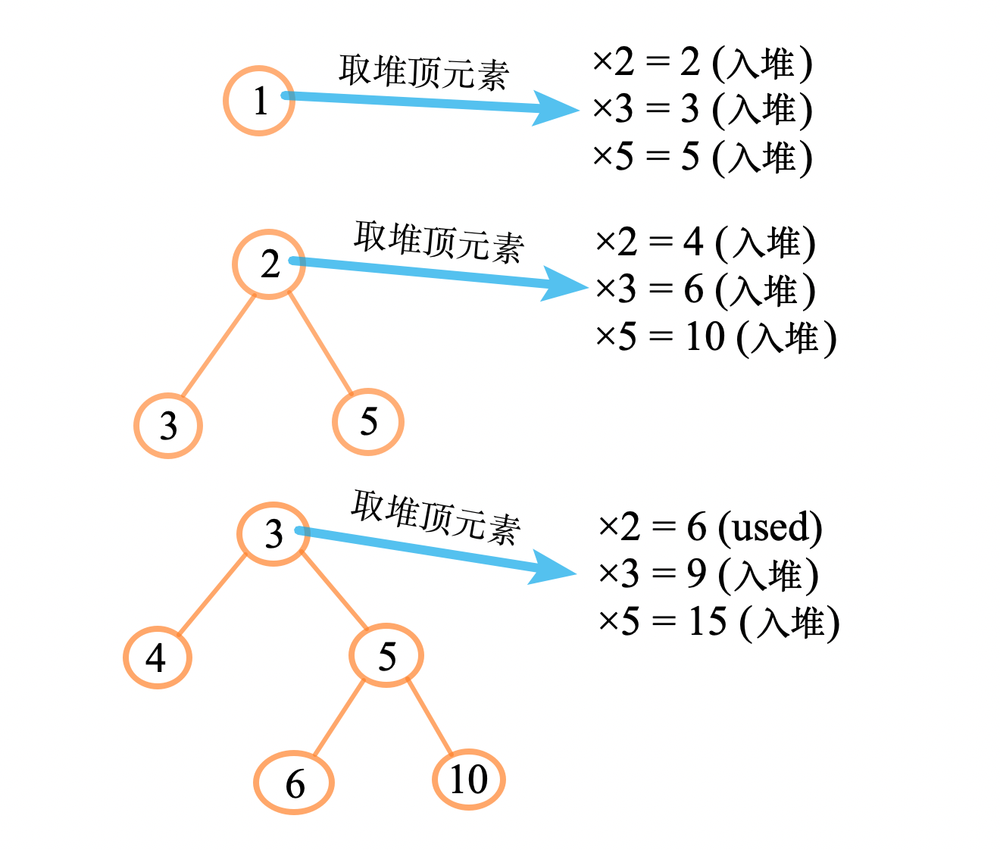
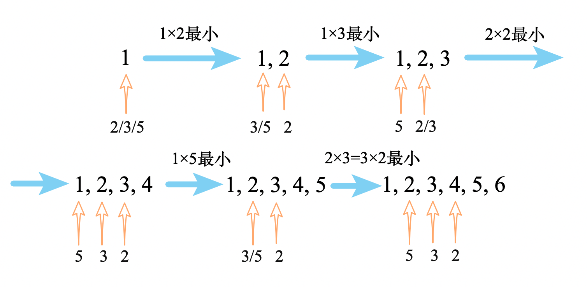

# 堆

## A218. 天际线问题

难度`困难`

#### 题目描述

城市的天际线是从远处观看该城市中所有建筑物形成的轮廓的外部轮廓。现在，假设您获得了城市风光照片（图A）上**显示的所有建筑物的位置和高度**，请编写一个程序以输出由这些建筑物**形成的天际线**（图B）。

  

每个建筑物的几何信息用三元组 `[Li，Ri，Hi]` 表示，其中 `Li` 和 `Ri` 分别是第 i 座建筑物左右边缘的 x 坐标，`Hi` 是其高度。可以保证 `0 ≤ Li, Ri ≤ INT_MAX`, `0 < Hi ≤ INT_MAX` 和 `Ri - Li > 0`。您可以假设所有建筑物都是在绝对平坦且高度为 0 的表面上的完美矩形。

例如，图A中所有建筑物的尺寸记录为：`[ [2 9 10], [3 7 15], [5 12 12], [15 20 10], [19 24 8] ] `。

输出是以 `[ [x1,y1], [x2, y2], [x3, y3], ... ]` 格式的“**关键点**”（图B中的红点）的列表，它们唯一地定义了天际线。**关键点是水平线段的左端点**。请注意，最右侧建筑物的最后一个关键点仅用于标记天际线的终点，并始终为零高度。此外，任何两个相邻建筑物之间的地面都应被视为天际线轮廓的一部分。

例如，图B中的天际线应该表示为：`[ [2 10], [3 15], [7 12], [12 0], [15 10], [20 8], [24, 0] ]`。

**说明:**

- 任何输入列表中的建筑物数量保证在 `[0, 10000]` 范围内。
- 输入列表已经按左 `x` 坐标 `Li`  进行升序排列。
- 输出列表必须按 x 位排序。
- 输出天际线中不得有连续的相同高度的水平线。例如 `[...[2 3], [4 5], [7 5], [11 5], [12 7]...]` 是不正确的答案；三条高度为 5 的线应该在最终输出中合并为一个：`[...[2 3], [4 5], [12 7], ...]`

#### 题目链接

<https://leetcode-cn.com/problems/the-skyline-problem/>

#### **思路:**

　　用一个`大根堆`存放当前所有建筑的高度，在建筑的边界时，把堆顶的元素放入结果数组中。  

　　注意不能输出连续相同高度的水平线，所以要判断结果数组最后一个元素是不是和堆顶的元素相同。  

　　例如，示例中的过程为：  

```python
x = 2, 蓝色房子入堆, heap = [10], ans = [[2 10]]
x = 3, 红色房子入堆, heap = [10, 15], ans = [[2 10], [3 15]]
x = 5, 绿色房子入堆, heap = [10, 12, 15]，堆顶元素高度为15，但是ans最后已经出现15了，忽略
x = 7, 最高的房子(红色房子)出堆, heap = [10, 12]，堆顶高度12, ans = [[2 10], [3 15], [7 12]]
x = 9, 最高的房子(绿色房子)还未结束, 不出堆, 堆顶高度12, 与ans[-1]重复，忽略
x = 12, 绿色房子和蓝色房子都已经结束, 均出堆, 堆中已没有元素, 插入0, ans = [[2 10], [3 15], [7 12], [12 0]]
x = 15, 紫色房子入堆, heap = [10], ans = [[2 10], [3 15], [7 12], [12 0], [15 10]]
x = 19, 黄色房子入堆, heap = [10, 8], 最高的房子还未结束, 不出堆, 堆顶高度10, 重复，忽略, ans不变
x = 20, 紫色房子出堆, heap = [8], 堆顶高度8, ans = [[2 10], [3 15], [7 12], [12 0], [15 10], [20 8]]
x = 24, 黄色房子出堆, 堆中已没有元素, 插入0, ans = [[2 10], [3 15], [7 12], [12 0], [15 10], [20 8], [24 0]]

```

#### **代码:**

```python
import heapq
class Solution:
    def getSkyline(self, buildings: List[List[int]]) -> List[List[int]]:
        n = len(buildings)
        x = [b[0] for b in buildings] + [b[1] for b in buildings]
        x.sort()

        heap = []
        ans = [[0, 0]]
        idx = 0

        for i in x:
            while idx < n and buildings[idx][0] == i:
                h, right = buildings[idx][2], buildings[idx][1]
                heapq.heappush(heap, (-h, right))  # 大根堆
                idx += 1

            while heap:
                h, right = heapq.heappop(heap)
                if right > i:  # 还没有结束
                    heapq.heappush(heap, (h, right))  # 再放回去
                    if ans[-1][1] != -h:
                        ans.append([i, -h])
                    break
            else:
                if ans[-1][1] != 0:
                    ans.append([i, 0])

        return ans[1:]

```

## A264. 丑数 II

难度 `中等`  

#### 题目描述

编写一个程序，找出第 `n` 个丑数。

丑数就是只包含质因数 `2, 3, 5` 的**正整数**。

> **示例:**

```
输入: n = 10
输出: 12
解释: 1, 2, 3, 4, 5, 6, 8, 9, 10, 12 是前 10 个丑数。
```

**说明:**  

1. `1` 是丑数。
2. `n` **不超过**1690。

#### 题目链接

<https://leetcode-cn.com/problems/ugly-number-ii/>

#### 思路  

　　方法一：小顶堆，每次取堆顶的元素（也就是最小的），第`i`次取的就是第`i`个丑数。再把它分别乘以`2`、`3`、`5`插入到堆中，如下图所示：  

　　  

　　为了避免出现重复，用一个集合`used_set`记录已经出现过的元素。已经出现过的元素就不会再入堆了。  

　　方法二：三指针法。使用三个指针`id_2`、`id_3`、`id_5`，分别表示2、3、5应该乘以丑数数组中的哪个元素。如下图所示：  

　　

　　初始时丑数数组 =`[1]`，三个指针均为`0`，比较三个指针乘积的结果，把最小的作为下一个丑数，并且这个指针向右移`1`。  

　　如果有多个指针乘积结果相同（如图中的2×3=3×2），则同时移动它们。  

#### 代码  

方法一（小顶堆+去重）：

```python
class Solution:
    def nthUglyNumber(self, n: int) -> int:
        if n == 1: return 1
        cur = 1
        used_set = {1}
        factors = (2, 3, 5)
        
        import heapq
        heap = []
        for i in range(2, n+1):
            for f in factors:
                new_num = cur * f
                if new_num not in used_set:
                    used_set.add(new_num)
                    heapq.heappush(heap, new_num)
            cur = heapq.heappop(heap)

        return cur

```

方法二（三指针）：

```python
class Solution:
    def nthUglyNumber(self, n: int) -> int:
        if n == 1: return 1
        result = [0] * n
        result[0] = 1
        id_2, id_3, id_5 = 0, 0, 0
        for i in range(1, n):
            a = result[id_2] * 2
            b = result[id_3] * 3
            c = result[id_5] * 5
            minimal = min(a, b, c)

            if a == minimal: id_2 += 1
            if b == minimal: id_3 += 1
            if c == minimal: id_5 += 1

            result[i] = minimal
            
        return result[-1]
```

## A313. 超级丑数

难度`中等`

#### 题目描述

编写一段程序来查找第 `*n*` 个超级丑数。

超级丑数是指其所有质因数都是长度为 `k` 的质数列表 `primes` 中的正整数。

> **示例:**

```
输入: n = 12, primes = [2,7,13,19]
输出: 32 
解释: 给定长度为 4 的质数列表 primes = [2,7,13,19]，前 12 个超级丑数序列为：[1,2,4,7,8,13,14,16,19,26,28,32] 。
```

**说明:**

- `1` 是任何给定 `primes` 的超级丑数。
- 给定 `primes` 中的数字以升序排列。
- 0 < `k` ≤ 100, 0 < `n` ≤ 106, 0 < `primes[i]` < 1000 。
- 第 `n` 个超级丑数确保在 32 位有符整数范围内。

#### 题目链接

<https://leetcode-cn.com/problems/super-ugly-number/>

#### **思路:**

　　最小堆。每次取出最小的元素，乘以所有的素数然后放回堆中。  

#### **代码:**

```python
class Solution:
    def nthSuperUglyNumber(self, n: int, primes: List[int]) -> int:
        heap = primes.copy()
        shown = set(heap)
        heapify(heap)
        ans = 1
        for _ in range(n-1):
            ans = top = heappop(heap)
            shown.remove(top)
            for prime in primes:
                c = top * prime
                if c not in shown:
                    shown.add(c)
                    heappush(heap, c)

        return ans

```

## A502. IPO

难度`困难`

#### 题目描述

假设 力扣（LeetCode）即将开始其 IPO。为了以更高的价格将股票卖给风险投资公司，力扣 希望在 IPO 之前开展一些项目以增加其资本。 由于资源有限，它只能在 IPO 之前完成最多 **k** 个不同的项目。帮助 力扣 设计完成最多 **k** 个不同项目后得到最大总资本的方式。

给定若干个项目。对于每个项目 **i**，它都有一个纯利润 **Pi**，并且需要最小的资本 **Ci** 来启动相应的项目。最初，你有 **W** 资本。当你完成一个项目时，你将获得纯利润，且利润将被添加到你的总资本中。

总而言之，从给定项目中选择最多 **k** 个不同项目的列表，以最大化最终资本，并输出最终可获得的最多资本。

> **示例 1:**

```
输入: k=2, W=0, Profits=[1,2,3], Capital=[0,1,1].

输出: 4

解释:
由于你的初始资本为 0，你尽可以从 0 号项目开始。
在完成后，你将获得 1 的利润，你的总资本将变为 1。
此时你可以选择开始 1 号或 2 号项目。
由于你最多可以选择两个项目，所以你需要完成 2 号项目以获得最大的资本。
因此，输出最后最大化的资本，为 0 + 1 + 3 = 4。
```
**注意:**

1. 假设所有输入数字都是非负整数。
2. 表示利润和资本的数组的长度不超过 50000。
3. 答案保证在 32 位有符号整数范围内。


#### 题目链接

<https://leetcode-cn.com/problems/ipo/>

#### **思路:**

　　贪心算法，由于要实现最大的利润。每次都在**当前成本足够的**项目中选择**利润最大**的。  

　　**方法一：**遍历所有当前成本足够的，然后选择利润最大的。超时。  

　　**方法二：**在方法一中我们发现，之前成本足够的，在获得新的收益后成本一定也足够了，因此不需要重新遍历。维护一个降序数组`asc`，以**收益降序的顺序**存放所有成本足够的项目。每次都做第一个项目即可。  

　　**方法三：**方法二的升序数组的结构用堆来实现更为高效。维护两个堆，`堆1`是小顶堆，存放所有的成本；`堆2`是大顶堆，存放所有的利润。每次用`堆1`中把成本足够的项目都取出来，利润值放到`堆2`中。然后做`堆2`的第一个项目即可。  

#### **代码:**

　　**方法一：**(朴素贪心, 超时)

```python
class Solution:
    def findMaximizedCapital(self, k: int, W: int, Profits: List[int], Capital: List[int]) -> int:
        n = len(Profits)
        if not n:
            return W

        asc = [[Capital[i], Profits[i]] for i in range(n)]
        asc.sort()

        ans = W  # 初始金钱
        for _ in range(k):
            maximal = (0, 0)  # index, num
            for i, (cost, profit) in enumerate(asc):
                if cost <= ans:
                    if profit > maximal[1]:
                        maximal = (i, profit)

                if i == len(asc) - 1 or cost > ans:  # 钱不够了
                    if maximal[1]:
                        ans += maximal[1]
                        asc.pop(maximal[0])
                        break
                    else:
                        return ans

        return ans

```

　　**方法二：**(升序数组, 476ms)

```python
import bisect
class Solution:
    def findMaximizedCapital(self, k: int, W: int, Profits: List[int], Capital: List[int]) -> int:
        n = len(Profits)
        if not n:
            return W

        combine = [[Capital[i], Profits[i]] for i in range(n)]
        combine.sort()

        asc = []
        ans = W  # 初始金钱
        for _ in range(k):
            i = 0
            while i < len(combine):
                cost, profit = combine[i]
                if cost <= ans:
                    bisect.insort(asc, profit)
                    combine.pop(i)
                    continue

                elif i == len(combine) - 1 or cost > ans:  # 钱不够了
                    if not asc:
                        return ans
                    ans += asc.pop()  # 取最大的
                    break
                i += 1
            else:
                if not asc:
                    return ans
                ans += asc.pop()  # 取最大的

        return ans

```

　　**方法三：**(最大最小堆, 276ms)

```python
class Solution:
    def findMaximizedCapital(self, k: int, W: int, Profits: List[int], Capital: List[int]) -> int:
        n = len(Profits)
        if not n:
            return W

        combine = list(zip(Capital, Profits))

        heapify(combine)

        ans = W
        heap = []
        for _ in range(k):
            while combine and combine[0][0] <= ans:  # 够投资的
                heappush(heap, - heappop(combine)[1])

            if not heap:
                break

            ans += -heappop(heap)

        return ans
```

## A1425. 带限制的子序列和

难度`困难`

#### 题目描述

给你一个整数数组 `nums` 和一个整数 `k` ，请你返回 **非空** 子序列元素和的最大值，子序列需要满足：子序列中每两个 **相邻** 的整数 `nums[i]` 和 `nums[j]` ，它们在原数组中的下标 `i` 和 `j` 满足 `i < j` 且 `j - i <= k` 。

数组的子序列定义为：将数组中的若干个数字删除（可以删除 0 个数字），剩下的数字按照原本的顺序排布。

> **示例 1：**

```
输入：nums = [10,2,-10,5,20], k = 2
输出：37
解释：子序列为 [10, 2, 5, 20] 。
```

> **示例 2：**

```
输入：nums = [-1,-2,-3], k = 1
输出：-1
解释：子序列必须是非空的，所以我们选择最大的数字。
```

> **示例 3：**

```
输入：nums = [10,-2,-10,-5,20], k = 2
输出：23
解释：子序列为 [10, -2, -5, 20] 。
```

**提示：**

- `1 <= k <= nums.length <= 10^5`
- `-10^4 <= nums[i] <= 10^4`

#### 题目链接

<https://leetcode-cn.com/problems/constrained-subset-sum/>

#### **思路:**

　　动态规划。令`dp[i]`表示选择下标为`i`的元素时能选择的最大子序和，因为选择的两个元素下标之差不能大于`k`，因此有状态转移方程`dp[i] = max(0, max(dp[i-k: i])) + nums[i]`。  

　　由于题目的范围较大，不能暴力计算`max(dp[i-k: i])`，因此使用一个**最大堆**来保存`dp[i-k: i]`的最大值。  

#### **代码:**

```python
class Solution:
    def constrainedSubsetSum(self, nums: List[int], k: int) -> int:
        n = len(nums)
        dp = [0] * n
        heap = []
        ans = nums[0]
        for i in range(n):
            num = nums[i]
            
            dp_j = float('inf')
            while heap:
                dp_j, j = heapq.heappop(heap)
                if j >= i - k:
                    heapq.heappush(heap, (dp_j, j))  # 放回去
                    break
            
            dp[i] = max(0, -dp_j) + num
            print(i, dp[i])
            
            if dp[i] > 0:
                heapq.heappush(heap, (-dp[i], i))
            
            ans = max(ans, dp[i])
       
        return(ans)

```


