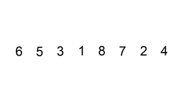

# 链表

## A24. 两两交换链表中的节点

难度`中等`

#### 题目描述

给定一个链表，两两交换其中相邻的节点，并返回交换后的链表。

**你不能只是单纯的改变节点内部的值**，而是需要实际的进行节点交换。

> **示例:**

```
给定 1->2->3->4, 你应该返回 2->1->4->3.
```

#### 题目链接

<https://leetcode-cn.com/problems/swap-nodes-in-pairs/>

#### **思路:**

　　可以用递归来做，先交换前两个结点，然后递归地处理后面的链表。  

#### **代码:**

```python
class Solution:
    def swapPairs(self, head: ListNode) -> ListNode:
        if not head or not head.next:
            return head

        p, q = head, head.next
        p.next, q.next = q.next, p  # 将 p->q 交换为 q->p

        p.next = self.swapPairs(p.next)

        return q

```

## A25. K 个一组翻转链表

难度`困难`

#### 题目描述

给你一个链表，每 *k* 个节点一组进行翻转，请你返回翻转后的链表。

*k* 是一个正整数，它的值小于或等于链表的长度。

如果节点总数不是 *k* 的整数倍，那么请将最后剩余的节点保持原有顺序。

> **示例：**

给你这个链表：`1->2->3->4->5`

当 *k* = 2 时，应当返回: `2->1->4->3->5`

当 *k* = 3 时，应当返回: `3->2->1->4->5`
**说明：**

- 你的算法只能使用常数的额外空间。
- **你不能只是单纯的改变节点内部的值**，而是需要实际进行节点交换。

#### 题目链接

<https://leetcode-cn.com/problems/reverse-nodes-in-k-group/>

#### **思路:**

　　先将前`k`个结点翻转，然后递归地对后面的链表进行处理。  

#### **代码:**

```python
class Solution:
    def reverseKGroup(self, head: ListNode, k: int) -> ListNode:
        if k <= 1:
            return head
        node = head
        for _ in range(k):
            if not node:
                return head
            node = node.next

        rever = None
        node = head
        for _ in range(k):
            node.next, rever, node = rever, node, node.next

        temp = rever
        for _ in range(k-1):
            temp = temp.next

        temp.next = self.reverseKGroup(node, k)

        return rever

```

## A82. 删除排序链表中的重复元素 II

难度`中等`

#### 题目描述

给定一个排序链表，删除所有含有重复数字的节点，只保留原始链表中 *没有重复出现* 的数字。

> **示例 1:**

```
输入: 1->2->3->3->4->4->5
输出: 1->2->5
```

> **示例 2:**

```
输入: 1->1->1->2->3
输出: 2->3
```

#### 题目链接

<https://leetcode-cn.com/problems/remove-duplicates-from-sorted-list-ii/>

#### **思路:**

　　用一个字典记录每个数字出现的次数，如果出现次数大于`1`就删除。  

#### **代码:**

```python
from collections import defaultdict

class Solution:
    def deleteDuplicates(self, head: ListNode) -> ListNode:
        if not head:
            return

        ans = ListNode(0)
        cur = ans
        mem = defaultdict(int)
        node = head
        while node:
            mem[node.val] += 1
            node = node.next

        node = head
        while node:
            if mem[node.val] == 1:
                cur.next = node
                cur = node
            else:
                cur.next = None
            node = node.next

        return ans.next

```

## A92. 反转链表 II

难度`中等`

#### 题目描述

反转从位置 *m* 到 *n* 的链表。请使用一趟扫描完成反转。

**说明:**
1 ≤ *m* ≤ *n* ≤ 链表长度。

> **示例:**

```
输入: 1->2->3->4->5->NULL, m = 2, n = 4
输出: 1->4->3->2->5->NULL
```

#### 题目链接

<https://leetcode-cn.com/problems/reverse-linked-list-ii/>

#### **思路:**

　　第一个指针先从头指针向后移`m-1`次，然后反转`n-m+1`个结点，最后把结尾的结点连在最后即可。  

#### **代码:**

```python
# Definition for singly-linked list.
# class ListNode:
#     def __init__(self, x):
#         self.val = x
#         self.next = None

class Solution:
    def reverseBetween(self, head: ListNode, m: int, n: int) -> ListNode:
        node = head
        dummy = ListNode(0)

        mid = dummy
        for _ in range(m-1):
            mid = node
            node = node.next

        mid2 = node
        rever = None

        for _ in range(n-m+1):
            node.next, rever, node = rever, node, node.next

        mid.next = rever  # mid是前面的部分，rever是反转的部分
        mid2.next = node  # mid2是反转部分的最后一个结点，node是后面的部分
        return rever if m == 1 else head
      
```

## A143. 重排链表

难度`中等`

#### 题目描述

给定一个单链表 *L*：*L*0→*L*1→…→*Ln*-1→*L*n ，
将其重新排列后变为： *L*0→*Ln*→*L*1→*Ln*-1→*L*2→*Ln*-2→…

你不能只是单纯的改变节点内部的值，而是需要实际的进行节点交换。

> **示例 1:**

```
给定链表 1->2->3->4, 重新排列为 1->4->2->3.
```

> **示例 2:**

```
给定链表 1->2->3->4->5, 重新排列为 1->5->2->4->3.
```

#### 题目链接

<https://leetcode-cn.com/problems/reorder-list/>

#### **思路:**

　　先用快慢指针找到链表的中点。然后逆序后半部分，最后合并前后两个链表。  

#### **代码:**

```python
class Solution:
    def reorderList(self, head: ListNode) -> None:
        """
        Do not return anything, modify head in-place instead.
        """
        if not head:
            return
        fast = slow = head
        while fast.next and fast.next.next:
            slow = slow.next
            fast = fast.next.next

        list1 = head
        list2 = slow.next
        slow.next = None
        rever = None
        while list2:
            list2.next, rever, list2,  = rever, list2, list2.next

        list2 = rever
        while list1 and list2:
            n1 = list1.next
            n2 = list2.next if list2 else None
            list1.next, list2.next = list2, list1.next
            list1 = n1
            list2 = n2

```

## A147. 对链表进行插入排序

难度`中等`

#### 题目描述

对链表进行插入排序。

  

插入排序的动画演示如上。从第一个元素开始，该链表可以被认为已经部分排序（用黑色表示）。
每次迭代时，从输入数据中移除一个元素（用红色表示），并原地将其插入到已排好序的链表中。

**插入排序算法：**

1. 插入排序是迭代的，每次只移动一个元素，直到所有元素可以形成一个有序的输出列表。
2. 每次迭代中，插入排序只从输入数据中移除一个待排序的元素，找到它在序列中适当的位置，并将其插入。
3. 重复直到所有输入数据插入完为止。

> **示例 1：**

```
输入: 4->2->1->3
输出: 1->2->3->4
```

> **示例 2：**

```
输入: -1->5->3->4->0
输出: -1->0->3->4->5
```

#### 题目链接

<https://leetcode-cn.com/problems/insertion-sort-list/>

#### **思路:**

　　如果当前结点的下一个结点大于当前结点，则不需要操作，否则先删除下一个结点，然后将它插入到`头节点到当前结点`之间正确的位置。  

#### **代码:**

```python
class Solution:
    def insertionSortList(self, head: ListNode) -> ListNode:
        if not head or not head.next:
            return head
        head_pointer = ListNode(0)  # 头指针
        start = head_pointer
        while head:
            cur_node = head
            head = head.next

            if cur_node.val < start.val:
                start = head_pointer  # 寻找插入位置
                
            while start.next and start.next.val < cur_node.val:
                start = start.next

            cur_node.next = start.next
            start.next = cur_node
            
        return head_pointer.next
```

## A148. 排序链表

难度`中等`

#### 题目描述s

在 *O*(*n* log *n*) 时间复杂度和常数级空间复杂度下，对链表进行排序。

> **示例 1:**

```
输入: 4->2->1->3
输出: 1->2->3->4
```

> **示例 2:**

```
输入: -1->5->3->4->0
输出: -1->0->3->4->5
```

#### 题目链接

<https://leetcode-cn.com/problems/sort-list/>

#### **思路:**

　　该题采用归并排序，归并排序的步骤如下：  

　　① 找到中间结点(用快慢指针)；  

　　② 对左半边进行归并排序；  

　　③ 对右半边进行归并排序；  

　　④ 合并两个升序链表并返回。  

#### **代码:**

```python
class Solution:
    def merge(self, l1, l2):
        if not l1: return l2
        if not l2: return l1
        if l1.val <= l2.val:
            l1.next = self.merge(l1.next, l2)
            return l1
        else:
            l2.next = self.merge(l2.next, l1)
            return l2

    def mergeSort(self, node):
        if not node or not node.next:
            return node

        fast = slow = breaknode = node
        while fast and fast.next:
            fast = fast.next.next
            breaknode = slow  # 从中间断开
            slow = slow.next

        breaknode.next = None
        mid = slow  # 中间结点
        l1 = self.mergeSort(node)
        l2 = self.mergeSort(mid)
        return self.merge(l1, l2)

    def sortList(self, head: ListNode) -> ListNode:
        if not head:
            return None
        return self.mergeSort(head)
      
```

## A19. 删除链表的倒数第N个节点

难度`中等`

#### 题目描述

给定一个链表，删除链表的倒数第 *n* 个节点，并且返回链表的头结点。

> **示例：**

```
给定一个链表: 1->2->3->4->5, 和 n = 2.

当删除了倒数第二个节点后，链表变为 1->2->3->5.
```

**说明：**

给定的 *n* 保证是有效的。

**进阶：**

你能尝试使用一趟扫描实现吗？


#### 题目链接

<https://leetcode-cn.com/problems/remove-nth-node-from-end-of-list/>

#### **思路:**


　　快慢指针，快指针先走n步，然后快慢一起走，直到快指针走到最后，慢指针的位置就是要删除的位置。要注意的是可能是要删除第一个结点，这个时候可以直接返回`head -> next`。  

#### **代码:**

```python
class Solution:
    def removeNthFromEnd(self, head: ListNode, n: int) -> ListNode:
        if not head or not n:
            return head

        fast = slow = head
        for _ in range(n):
            fast = fast.next
        if not fast:  # 删除头结点
            return head.next

        while fast.next:
            fast = fast.next
            slow = slow.next
        #  此时的slow是要删除结点的前一个结点
        slow.next = slow.next.next

        return head


```

## A61. 旋转链表

难度`中等`

#### 题目描述

给定一个链表，旋转链表，将链表每个节点向右移动 *k* 个位置，其中 *k* 是非负数。

> **示例 1:**

```
输入: 1->2->3->4->5->NULL, k = 2
输出: 4->5->1->2->3->NULL
解释:
向右旋转 1 步: 5->1->2->3->4->NULL
向右旋转 2 步: 4->5->1->2->3->NULL
```

> **示例 2:**

```
输入: 0->1->2->NULL, k = 4
输出: 2->0->1->NULL
解释:
向右旋转 1 步: 2->0->1->NULL
向右旋转 2 步: 1->2->0->NULL
向右旋转 3 步: 0->1->2->NULL
向右旋转 4 步: 2->0->1->NULL
```


#### 题目链接

<https://leetcode-cn.com/problems/rotate-list/>

#### **思路:**

　　其实就是将倒数第k个元素作为头，原来的头接到原来的尾上。  

　　找到倒数第k个元素可以用上一题[A19. 删除链表的倒数第n个结点](/dual_pointer?id=a19-删除链表的倒数第n个节点)的方法。  

#### **代码:**

```python
class Solution:
    def rotateRight(self, head: ListNode, k: int) -> ListNode:
        if not head or not head.next:
            return head

        fast = slow = head
        i = 0
        while i < k:
            if fast.next:
                fast = fast.next
                i += 1
            else:
                fast = head
                k = k % (i+1)
                i = 0

        while fast.next:
            fast = fast.next
            slow = slow.next
        
        if not slow.next:  # 循环了若干圈
            return head
        
        new_head = slow.next  # 新的头结点
        slow.next = None
        temp = new_head
        while temp.next:
            temp = temp.next
        
        temp.next = head
        return new_head

```

## A86. 分隔链表

难度`中等`

#### 题目描述

给定一个链表和一个特定值 *x*，对链表进行分隔，使得所有小于 *x* 的节点都在大于或等于 *x* 的节点之前。

你应当保留两个分区中每个节点的初始相对位置。

> **示例:**

```
输入: head = 1->4->3->2->5->2, x = 3
输出: 1->2->2->4->3->5
```

#### 题目链接

<https://leetcode-cn.com/problems/partition-list/>

#### **思路:**

　　用两个新链表`head1`和`head2`分别记录小于`x`的元素和大于等于`x`的元素，然后再把它们连接起来。  

　　给两个新链表使用虚拟头结点(`dummyhead`)，使代码更简单。  

#### **代码:**

```python
class Solution:
    def partition(self, head: ListNode, x: int) -> ListNode:
        if not head:
            return None

        p1 = dummyhead1 = ListNode(None)
        p2 = dummyhead2 = ListNode(None)

        node = head
        while node:
            cur = node
            node = node.next
            if cur.val < x:
                p1.next = cur
                p1 = p1.next
                p1.next = None
            elif cur.val >= x:
                p2.next = cur
                p2 = p2.next
                p2.next = None 

        p1.next = dummyhead2.next  # 将head2连接再head1最后
        return dummyhead1.next

```

## A141. 环形链表

难度`简单`

#### 题目描述

给定一个链表，判断链表中是否有环。

为了表示给定链表中的环，我们使用整数 `pos` 来表示链表尾连接到链表中的位置（索引从 0 开始）。 如果 `pos` 是 `-1`，则在该链表中没有环。
> **示例 1：**

```
输入：head = [3,2,0,-4], pos = 1
输出：true
解释：链表中有一个环，其尾部连接到第二个节点。
```


> **示例 2：**

```
输入：head = [1,2], pos = 0
输出：true
解释：链表中有一个环，其尾部连接到第一个节点。
```


> **示例 3：**

```
输入：head = [1], pos = -1
输出：false
解释：链表中没有环。
```

  

**进阶：**

你能用 *O(1)*（即，常量）内存解决此问题吗？

#### 题目链接

<https://leetcode-cn.com/problems/linked-list-cycle/>

#### **思路:**


　　快慢指针，如果链表中有环，快慢指针一定会相交。  

#### **代码:**

```python
class Solution:
    def hasCycle(self, head: ListNode) -> bool:
        fast = slow = head
        while fast and fast.next:
            fast = fast.next.next  # 快指针一次走2步
            slow = slow.next  # 慢指针一次走1步
            if fast == slow:
                return True

        return False

```

## A142. 环形链表 II

难度`中等`

#### 题目描述

给定一个链表，返回链表开始入环的第一个节点。 如果链表无环，则返回 `null`。

为了表示给定链表中的环，我们使用整数 `pos` 来表示链表尾连接到链表中的位置（索引从 0 开始）。 如果 `pos` 是 `-1`，则在该链表中没有环。

**说明：**不允许修改给定的链表。
> **示例 1：**

```
输入：head = [3,2,0,-4], pos = 1
输出：tail connects to node index 1
解释：链表中有一个环，其尾部连接到第二个节点。
```


> **示例 2：**

```
输入：head = [1,2], pos = 0
输出：tail connects to node index 0
解释：链表中有一个环，其尾部连接到第一个节点。
```


> **示例 3：**

```
输入：head = [1], pos = -1
输出：no cycle
解释：链表中没有环。
```

  

**进阶：**
你是否可以不用额外空间解决此题？


#### 题目链接

<https://leetcode-cn.com/problems/linked-list-cycle-ii/>

#### **思路:**

　　① 先用快慢指针，如果链表中有环，快慢指针一定会相交(假设相交于`slow`)。  

　　② 再用另外一个指针`p`初始指向`head`结点，`p`和`slow`每次都向后移一步，最终必然相交于环的起始点。  

#### **代码:**

```python
# Definition for singly-linked list.
# class ListNode:
#     def __init__(self, x):
#         self.val = x
#         self.next = None

class Solution:
    def detectCycle(self, head: ListNode) -> ListNode:
        fast = slow = head
        while fast and fast.next:
            fast = fast.next.next  # 快指针一次走2步
            slow = slow.next  # 慢指针一次走1步
            if fast == slow:
                p = head
                while slow != p:
                    p= p.next
                    slow = slow.next
                return slow

        return None

```

## A234. 回文链表

难度`简单`

#### 题目描述

请判断一个链表是否为回文链表。

> **示例 1:**

```
输入: 1->2
输出: false
```

> **示例 2:**

```
输入: 1->2->2->1
输出: true
```

**进阶：**
你能否用 O(n) 时间复杂度和 O(1) 空间复杂度解决此题？

#### 题目链接

<https://leetcode-cn.com/problems/palindrome-linked-list/>

#### **思路:**

　　① 使用快慢指针找到链表中点；  

　　② reverse 逆序后半部分；   

　　③ 从头、中点，开始比较是否相同。  

#### **代码:**

```python
class Solution:
    def isPalindrome(self, head: ListNode) -> bool:
        if not head:
            return True

        slow = fast = head
        prev = None
        while fast and fast.next:
            fast = fast.next.next
            slow = slow.next

        rever = None
        slow = head
        while slow:
            slow.next, rever, slow = rever, slow, slow.next

        while head and prev:
            if head.val != prev.val:
                return False
            head = head.next
            prev = prev.next

        return True

```