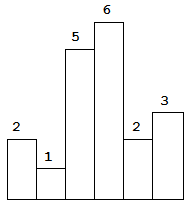

# 栈

## A84. 柱状图中最大的矩形

难度 `困难`  

#### 题目描述

给定 *n* 个非负整数，用来表示柱状图中各个柱子的高度。每个柱子彼此相邻，且宽度为 1 。  

求在该柱状图中，能够勾勒出来的矩形的最大面积。  



以上是柱状图的示例，其中每个柱子的宽度为 1，给定的高度为 `[2,1,5,6,2,3]`。

 


图中阴影部分为所能勾勒出的最大矩形面积，其面积为 `10` 个单位。 

> **示例:**

```
输入: [2,1,5,6,2,3]
输出: 10
```

#### 题目链接

<https://leetcode-cn.com/problems/largest-rectangle-in-histogram/>

#### 思路  

　　单调栈，新元素如果小于等于栈顶元素则**不断**弹栈。实际实现时栈内记录的是元素的下标。

　　为了方便理解，假设此时栈内元素为 `A`  `B` 。遇到元素`C <= B`，需要做出栈处理（然后再将`C`入栈），则对于即将要出栈的B来说：`A`是从`B`起向左，第一个小于`B`的元素；`C`是从`B`起向右，第一个小于等于B的元素。`A`和`C`的下标之差即高度为`B`的最大宽度。    

　　例如：`heights= [2,1,5,6,2,3]`。栈操作过程如下：  

```
入栈 2
出栈 2 宽度 1 ans=2
入栈 1
入栈 5
入栈 6
出栈 6 宽度 1 ans=6
出栈 5 宽度 2 ans=10
入栈 2
入栈 3
出栈 3 宽度 1 ans不变
出栈 2 宽度 4 ans不变
出栈 1 宽度 6 ans不变
```

#### 代码  

```python
class Solution:
    def largestRectangleArea(self, heights: List[int]) -> int:
        n = len(heights)
        if n == 0:
            return 0

        s = [-1]
        heights.append(0)
        ans = 0
        for i, h in enumerate(heights):
            while len(s) >= 2 and h <= heights[s[-1]]:  # 出栈
                last = s.pop()  
                before = s[-1]
                w = i - before - 1
                ans = max(ans, heights[last] * w)
                # print('出栈', heights[last], '宽度', w)

            if len(s)==0 or h >= heights[s[-1]]:  # 入栈
                s.append(i)
                # print('入栈', heights[i])

        return ans
```

## A85. 最大矩形

难度 `困难`  

#### 题目描述

给定一个仅包含 0 和 1 的二维二进制矩阵，找出只包含 1 的最大矩形，并返回其面积。

> **示例:**

```
输入:
[
  ["1","0","1","0","0"],
  ["1","0","1","1","1"],
  ["1","1","1","1","1"],
  ["1","0","0","1","0"]
]
输出: 6
```

#### 题目链接

<https://leetcode-cn.com/problems/maximal-rectangle/>

#### 思路  

　　对每一行都求出每一列的高度，然后每行依次调用上一题[A84. 柱状图中最大的矩形](/stack?id=a84-柱状图中最大的矩形)的`largestRectangleArea`函数。  
　　例如示例对应的高度矩阵为：

```
[
  [1, 0, 1, 0, 0],  # 该行调用largestRectangleArea结果为1
  [2, 0, 2, 1, 1],  # 该行调用largestRectangleArea结果为3
  [3, 1, 3, 2, 2],  # 该行调用largestRectangleArea结果为6
  [4, 0, 0, 3, 0]   # 该行调用largestRectangleArea结果为1
]
```

#### 代码  

```python
class Solution:
    def largestRectangleArea(self, heights: List[int]) -> int:
        n = len(heights)
        if n == 0:
            return 0

        s = [-1]
        heights.append(0)
        ans = 0
        for i, h in enumerate(heights):
            while len(s) >= 2 and h <= heights[s[-1]]:  # 出栈
                last = s.pop()  
                before = s[-1]
                w = i - before - 1
                ans = max(ans, heights[last] * w)

            if len(s)==0 or h >= heights[s[-1]]:  # 入栈
                s.append(i)
        return ans

    def maximalRectangle(self, matrix: List[List[str]]) -> int:
        m = len(matrix)
        if m == 0:
            return 0
        n = len(matrix[0])
        helper = [[0 for i in range(n)] for i in range(m)]
        for j in range(n):
            tmp = 0
            for i in range(m):
                if matrix[i][j] == '1':
                    tmp += 1
                    helper[i][j] = tmp
                else:
                    tmp = 0

        ans = 0
        for heights in helper:
            aera_line = self.largestRectangleArea(heights)
            ans = max(ans, aera_line)
        
        return ans

```

## A150. 逆波兰表达式求值

难度`中等`

#### 题目描述

根据[逆波兰表示法](https://baike.baidu.com/item/逆波兰式/128437)，求表达式的值。

有效的运算符包括 `+`, `-`, `*`, `/` 。每个运算对象可以是整数，也可以是另一个逆波兰表达式。

**说明：**

- 整数除法只保留整数部分。
- 给定逆波兰表达式总是有效的。换句话说，表达式总会得出有效数值且不存在除数为 0 的情况。

> **示例 1：**

```
输入: ["2", "1", "+", "3", "*"]
输出: 9
解释: ((2 + 1) * 3) = 9
```

> **示例 2：**

```
输入: ["4", "13", "5", "/", "+"]
输出: 6
解释: (4 + (13 / 5)) = 6
```

> **示例 3：**

```
输入: ["10", "6", "9", "3", "+", "-11", "*", "/", "*", "17", "+", "5", "+"]
输出: 22
解释: 
  ((10 * (6 / ((9 + 3) * -11))) + 17) + 5
= ((10 * (6 / (12 * -11))) + 17) + 5
= ((10 * (6 / -132)) + 17) + 5
= ((10 * 0) + 17) + 5
= (0 + 17) + 5
= 17 + 5
= 22
```

#### 题目链接

<https://leetcode-cn.com/problems/evaluate-reverse-polish-notation/>

#### **思路:**

　　维护一个`数据栈`和一个`符号栈`，遇到数值时入数据栈，遇到符号时从数据栈出栈2个元素`num2`和`num1`，将`num1`和`num2`按符号运算后的结果再入数据栈。最后数据栈中只剩下唯一的一个元素就是结果。  

#### **代码:**

```python
class Solution:
    def evalRPN(self, tokens: List[str]) -> int:
        def op(num1, num2, sign):
            if sign == '+': return num1 + num2
            if sign == '-': return num1 - num2
            if sign == '*': return num1 * num2
            if sign == '/': return int(num1 / num2)

        nums = []
        signs = []
        for token in tokens:
            try:
                nums.append(int(token))  # 数值
            except:
                num2 = nums.pop()
                num1 = nums.pop()
                num = op(num1, num2, token)
                # print(num1, token, num2, '=', num)
                nums.append(num)

        # print(nums)
        return nums[0]

```

## A224. 基本计算器

难度`困难`

#### 题目描述

实现一个基本的计算器来计算一个简单的字符串表达式的值。

字符串表达式可以包含左括号 `(` ，右括号 `)`，加号 `+` ，减号 `-`，**非负**整数和空格 ` `。

> **示例 1:**

```
输入: "1 + 1"
输出: 2
```

> **示例 2:**

```
输入: " 2-1 + 2 "
输出: 3
```

> **示例 3:**

```
输入: "(1+(4+5+2)-3)+(6+8)"
输出: 23
```

#### 题目链接

<https://leetcode-cn.com/problems/basic-calculator/>

#### **思路:**

　　和[A227. 基本计算器](/string?id=a227-基本计算器-ii)类似，只不过多了括号。  

　　用`符号栈`和`数据栈`分别存放运算符和数据。  

　　在`s`末尾添加一个`"#"`表示结束，它的优先级是最低的。

　　扫描`s`，如果**遇到数据**则`直接入数据栈`，**遇到四则运算符**则：

　　①符号栈为空：入符号栈，继续扫描；  

　　②优先级高于`符号栈栈顶`的符号：入符号栈，继续扫描；  

　　③优先级小于等于`符号栈栈顶`的符号：弹出两个数据栈元素分别作为两个操作数(`num2, num1`)，弹出符号栈顶符号(`op`)，运算(`num1 +-*/ num2`)以后将运算结果压人数据栈，然后重复①~③。  

　　**括号**需要另外处理：

　　①`"("`：直接入栈，继续扫描；  

　　②`")"`：不断出栈，直到`栈顶为左括号`，将左括号也出栈。    

　　如`s = "(1+(4+5+2)-3)+(6+8)"`。扫描过程如下：  

```c
入栈 ( 
入栈 1 
入栈 + 
入栈 (
入栈 4 
入栈 + 
入栈 5 [1, 4, 5] ['(', '+', '(', '+']
出栈(4, 5, +)，运算结果:(9)
结果入栈 9 [1, 9] ['(', '+', '(']
入栈 + [1, 9] ['(', '+', '(', '+']
遇到)
入栈 2 [1, 9, 2] ['(', '+', '(', '+']
出栈(9, 2, +)，运算结果:(11)
结果入栈 11 [1, 11] ['(', '+', '(']
弹出( [1, 11] ['(', '+']
出栈(1, 11, +)，运算结果:(12)
结果入栈 12 [12] ['(']
入栈 - [12] ['(', '-']
遇到)
入栈 3 [12, 3] ['(', '-']
出栈(12, 3, -)，运算结果:(9)
结果入栈 9 [9] ['(']
弹出( [9] []
入栈 + [9] ['+']
入栈 ( [9] ['+', '(']
入栈 6 [9, 6] ['+', '(']
入栈 + [9, 6] ['+', '(', '+']
遇到)
入栈 8 [9, 6, 8] ['+', '(', '+']
出栈(6, 8, +)，运算结果:(14)
结果入栈 14 [9, 14] ['+', '(']
弹出( [9, 14] ['+']
出栈(9, 14, +)，运算结果:(23)
结果入栈 23 [23] []
入栈 # [23] ['#']
nums = [23]
```

　　最终数据栈中只剩下**一个元素**，它就是最终运算结果。（符号栈中只剩`"#"`）  

#### **代码:**

```python
class Solution:
    def calculate(self, s: str) -> int:
        s = s.strip() + '#'
        ls = len(s)
        prior = {'+': 1, '-': 1, '*': 2, '/': 2, '#': 0, '(': 0}  # 优先级
        # '(': 必入栈,  ')' 必出栈  
        nums = []
        signs = []
        j = 0

        def operate(num1, num2, op):
            if op == '+': return num1 + num2
            if op == '-': return num1 - num2
            if op == '*': return num1 * num2
            if op == '/': return num1 // num2
            
        for i, char in enumerate(s):
            if char == '(':
                signs.append(char)  # 符号入符号栈
                # print('入栈', char, nums, signs)
                j = i + 1
            elif char in prior:
                if s[j: i]:
                    nums.append(int(s[j: i]))  # 数值直接入栈
                    # print('入栈', int(s[j: i]), nums, signs)
                while signs and prior[signs[-1]] >= prior[char]:  # 栈顶优先级高
                    num2 = nums.pop()  # 先弹出的是第二个操作数
                    num1 = nums.pop()  # 后弹出的是第一个操作数
                    op = signs.pop()  # 弹出操作符
                    ans = operate(num1, num2, op)
                    # print('出栈(%d, %d, %s)，运算结果:(%d)' % (num1, num2, op, ans)) 
                    nums.append(ans)  # 运算以后将结果入数据栈
                    # print('结果入栈', ans, nums, signs)

                signs.append(char)  # 符号入符号栈
                # print('入栈', char, nums, signs)
                j = i + 1
            elif char == ')':
                # print('遇到)')
                if s[j: i]:
                    nums.append(int(s[j: i]))  # 数值直接入栈
                # print('入栈', int(s[j: i]), nums, signs)
                while signs[-1] != '(':  # 出栈到左括号
                    num2 = nums.pop()  # 先弹出的是第二个操作数
                    num1 = nums.pop()  # 后弹出的是第一个操作数
                    op = signs.pop()  # 弹出操作符
                    ans = operate(num1, num2, op)  # 运算
                    # print('出栈(%d, %d, %s)，运算结果:(%d)' % (num1, num2, op, ans)) 
                    nums.append(ans)  # 运算以后将结果入数据栈
                    # print('结果入栈', ans, nums, signs)

                op = signs.pop()  # 弹出左括号
                # print('弹出(', nums, signs)
                j = i + 1

        # print(nums)
        return nums[-1]

    
```

