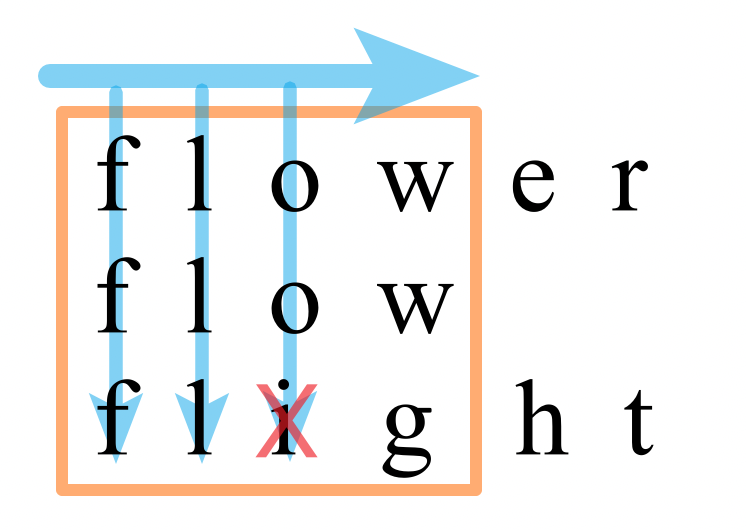
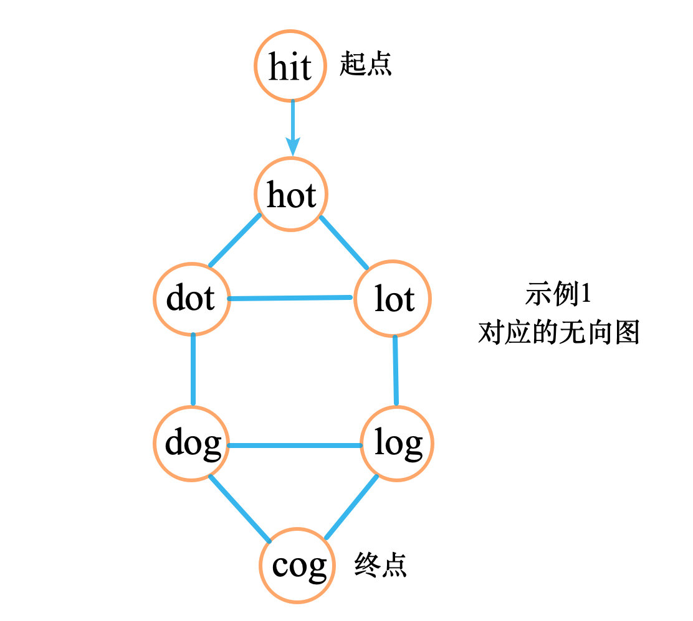
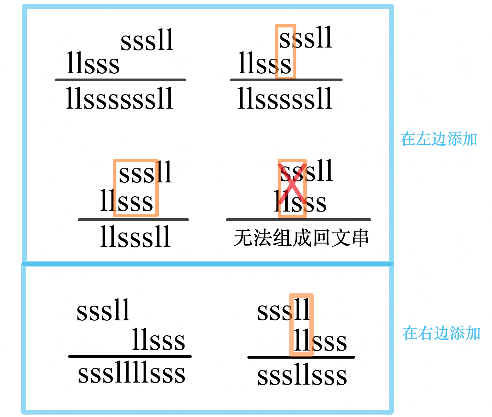

# 字符串

## A3. 无重复字符的最长子串

难度 `中等`  
#### 题目描述

给定一个字符串，请你找出其中不含有重复字符的 **最长子串** 的长度。

> **示例 1:**

```
输入: "abcabcbb"
输出: 3 
解释: 因为无重复字符的最长子串是 "abc"，所以其长度为 3。
```

> **示例 2:**

```
输入: "bbbbb"
输出: 1
解释: 因为无重复字符的最长子串是 "b"，所以其长度为 1。
```

> **示例 3:**

```
输入: "pwwkew"
输出: 3
解释: 因为无重复字符的最长子串是 "wke"，所以其长度为 3。
     请注意，你的答案必须是 子串 的长度，"pwke" 是一个子序列，不是子串。
```

#### 题目链接

<https://leetcode-cn.com/problems/longest-substring-without-repeating-characters/>


#### 思路  


　　使用双指针滑动窗口的方法。`j`向前遍历，`i`指向重复的位置（`i`只会向右移动），在`j`遍历的同时用一个字典记下`每个字母最后出现的下标`，`j - i + 1`的最大值即为结果。  

#### 代码  
```python
class Solution:
    def lengthOfLongestSubstring(self, s: str) -> int:
        n = len(s)
        if n <= 1:
            return n 
        ans = 1
        dict = {s[0]: 0}
        i, j  = 0, 1
        j = 1
        while j < n:
            char = s[j]
            if char in dict:
                i = max(i, dict[char] + 1)
            
            dict[char] = j
            ans = max(ans, j-i+1)
            j += 1

        return ans
         
```

## A5. 最长回文子串

难度 `中等`  

#### 题目描述

给定一个字符串 `s`，找到 `s` 中最长的回文子串。你可以假设 `s` 的最大长度为 1000。

**示例 1：**

```
输入: "babad"
输出: "bab"
注意: "aba" 也是一个有效答案。
```

**示例 2：**

```
输入: "cbbd"
输出: "bb"
```

#### 题目链接

<https://leetcode-cn.com/problems/longest-palindromic-substring/>

#### 思路  

　　**方法一：**中心扩展法。

　　遍历一遍字符串`s`，以字符`s[i]`分别作为奇数和偶数中心向两边扩展。

　　如果扩展的回文串大于之前最长的长度`maximum`，则更新`maximum`和结果字符串`ans`。　

　　时间复杂度`O(n^2)`。

　　**方法二：**马拉车算法。时间复杂度`O(n)`。

#### 代码  

　　**方法一：**(中心扩展法)

```python
class Solution:
    def search(self, s: str, i: int, j: int) -> str:
        if j-i==2:
            ans = s[i+1]
        else:
            ans = ""

        while(i>=0 and j<len(s) and s[i]==s[j]):
            i -= 1
            j += 1
        return s[i+1: j]

    def longestPalindrome(self, s: str) -> str:
        maximum = 0
        ans = ""
        update = lambda n: (len(n),n)
        for i in range(len(s)):
            lr = self.search(s, i-1, i+1)
            # l = search(s, i-1, i)
            r = self.search(s, i, i+1)
            if len(lr) > maximum:
                maximum, ans = update(lr)
            # if len(l) > mmax:
            #     mmax, ans = update(l)
            if len(r) > maximum:
                maximum, ans = update(r)
        return ans

```

　　**方法二：**(马拉车算法)

```python
class Solution:
    def longestPalindrome(self, s: str) -> str:
        s = '#' + '#'.join(s) + '#' # 字符串处理，用特殊字符隔离字符串，方便处理偶数子串
        lens = len(s)
        p = [0] * lens            # p[i]表示i作中心的最长回文子串的半径，初始化p[i]
        mx = 0                    # 之前最长回文子串的右边界
        id = 0                    # 之前最长回文子串的中心位置
        for i in range(lens):     # 遍历字符串
            if mx > i:
                p[i] = min(mx-i, p[int(2*id-i)]) #由理论分析得到
            else :                # mx <= i
                p[i] = 1
            while i-p[i] >= 0 and i+p[i] < lens and s[i-p[i]] == s[i+p[i]]:  # 满足回文条件的情况下
                p[i] += 1  # 两边扩展
            if(i+p[i]) > mx:  # 新子串右边界超过了之前最长子串右边界
                mx, id = i+p[i], i # 移动之前最长回文子串的中心位置和边界，继续向右匹配
        i_res = p.index(max(p)) # 获取最终最长子串中心位置
        s_res = s[i_res-(p[i_res]-1):i_res+p[i_res]] #获取最终最长子串，带"#"
        return s_res.replace('#', '')  # 长度为：max(p)-1
```

## A6. Z 字形变换

#### 题目描述

将一个给定字符串根据给定的行数，以从上往下、从左到右进行 Z 字形排列。

比如输入字符串为 `"LEETCODEISHIRING"` 行数为 3 时，排列如下：

```
L   C   I   R
E T O E S I I G
E   D   H   N
```

之后，你的输出需要从左往右逐行读取，产生出一个新的字符串，比如：`"LCIRETOESIIGEDHN"`。

请你实现这个将字符串进行指定行数变换的函数：

```
string convert(string s, int numRows);
```

> **示例 1:**

```
输入: s = "LEETCODEISHIRING", numRows = 3
输出: "LCIRETOESIIGEDHN"
```

> **示例 2:**

```
输入: s = "LEETCODEISHIRING", numRows = 4
输出: "LDREOEIIECIHNTSG"
解释:

L     D     R
E   O E   I I
E C   I H   N
T     S     G
```

#### 题目链接

<https://leetcode-cn.com/problems/zigzag-conversion/>

#### **思路:**

　　找规律法，经观察发现，除了第一行和最后一行外，每一行的下一个数，要么就是从底下拐(经过`2*(numRows-1-i)`个字母)，要么就是从上面拐(经过`2*i`个字母), 用flag作为标记，是否从底下拐。

#### **代码:**

```c
/*
    执行用时 : 0 ms, 在所有 cpp 提交中击败了 100% 的用户
    内存消耗 : 10.2 MB, 在所有 cpp 提交中击败了 91.73% 的用户
*/

string convert(string s, int numRows) {
    if (numRows==1) return s;
    string ans = "";
    for(int i =0;i<numRows;i++){
        int j=i;
        bool flag=true;  // flag为true表示从底下拐，否则从上面拐
        if (i==numRows-1)flag = false;  // 第一行总是true 最后一行总是false 
        while(j<s.size()){
            ans += s[j];
            if (flag){
                j += 2*(numRows-1-i);
                if (i!=0) flag=false; // 第一行总是true
            }else{
                j+= 2 * i;
                if (i!=numRows-1) flag = true; // 最后一行总是false 
            }
        }
    }

    return ans;
}
```

## A8. 字符串转换整数 (atoi)

难度 `中等`  

#### 题目描述

请你来实现一个 `atoi` 函数，使其能将字符串转换成整数。

首先，该函数会根据需要丢弃无用的开头空格字符，直到寻找到第一个非空格的字符为止。

当我们寻找到的第一个非空字符为正或者负号时，则将该符号与之后面尽可能多的连续数字组合起来，作为该整数的正负号；假如第一个非空字符是数字，则直接将其与之后连续的数字字符组合起来，形成整数。

该字符串除了有效的整数部分之后也可能会存在多余的字符，这些字符可以被忽略，它们对于函数不应该造成影响。

注意：假如该字符串中的第一个非空格字符不是一个有效整数字符、字符串为空或字符串仅包含空白字符时，则你的函数不需要进行转换。

在任何情况下，若函数不能进行有效的转换时，请返回 0。

**说明：**

假设我们的环境只能存储 32 位大小的有符号整数，那么其数值范围为 [−231,  231 − 1]。如果数值超过这个范围，请返回  INT_MAX (231 − 1) 或 INT_MIN (−231) 。

> **示例 1:**

```
输入: "42"
输出: 42
```

> **示例 2:**

```
输入: "   -42"
输出: -42
解释: 第一个非空白字符为 '-', 它是一个负号。
     我们尽可能将负号与后面所有连续出现的数字组合起来，最后得到 -42 。
```

> **示例 3:**

```
输入: "4193 with words"
输出: 4193
解释: 转换截止于数字 '3' ，因为它的下一个字符不为数字。
```

> **示例 4:**

```
输入: "words and 987"
输出: 0
解释: 第一个非空字符是 'w', 但它不是数字或正、负号。
     因此无法执行有效的转换。
```

> **示例 5:**

```
输入: "-91283472332"
输出: -2147483648
解释: 数字 "-91283472332" 超过 32 位有符号整数范围。 
     因此返回 INT_MIN (−231) 。
```

#### 题目链接

<https://leetcode-cn.com/problems/string-to-integer-atoi/>

#### 思路  

　　感觉这种题意义不大，面向测试用例编程。  

#### 代码  

```python
class Solution:
    def myAtoi(self, str: str) -> int:
        str = str.lstrip(' ')  # 去掉开头空格
        factor = 1  # 正数
        if str.startswith('-'):
            str = str[1:]
            factor = -1
        elif str.startswith('+'):
            str = str[1:]

        for i, s in enumerate(str):
            if not s.isdigit():  # 不是数字就退出
                str = str[:i]
                break
        
        try:
            num = factor * int(str)

            if num < -2147483648:
                return -2147483648
            elif num > 2147483647:
                return 2147483647
            return num
        except:
            return 0
```

## A10. 正则表达式匹配

难度 `困难`  

#### 题目描述

给你一个字符串 `s` 和一个字符规律 `p`，请你来实现一个支持 `'.'` 和 `'*'` 的正则表达式匹配。

```
'.' 匹配任意单个字符
'*' 匹配零个或多个前面的那一个元素
```

所谓匹配，是要涵盖 **整个** 字符串 `s`的，而不是部分字符串。

**说明:**

- `s` 可能为空，且只包含从 `a-z` 的小写字母。
- `p` 可能为空，且只包含从 `a-z` 的小写字母，以及字符 `.` 和 `*`。

> **示例 1:**

```
输入:
s = "aa"
p = "a"
输出: false
解释: "a" 无法匹配 "aa" 整个字符串。
```

> **示例 2:**

```
输入:
s = "aa"
p = "a*"
输出: true
解释: 因为 '*' 代表可以匹配零个或多个前面的那一个元素, 在这里前面的元素就是 'a'。因此，字符串 "aa" 可被视为 'a' 重复了一次。
```

> **示例 3:**

```
输入:
s = "ab"
p = ".*"
输出: true
解释: ".*" 表示可匹配零个或多个（'*'）任意字符（'.'）。
```

> **示例 4:**

```
输入:
s = "aab"
p = "c*a*b"
输出: true
解释: 因为 '*' 表示零个或多个，这里 'c' 为 0 个, 'a' 被重复一次。因此可以匹配字符串 "aab"。
```

> **示例 5:**

```
输入:
s = "mississippi"
p = "mis*is*p*."
输出: false
```

#### 题目链接

<https://leetcode-cn.com/problems/regular-expression-matching/>

#### 思路  

　　动态规划，类似于[A44. 通配符匹配](/dp?id=a44-通配符匹配)。`dp[i][j]`记录`s[:i]`能否匹配`p[:j]`。  

　　先处理`s`为空的情况。空字符串能匹配空字符串，另外只有当`p[:j]`为`"a*b*c*.*d*"`这样全是`"?*"`的时候才能匹配空字符串。  

　　`".*"`匹配`0~n`个任意字符，转移方程`dp[i][j] = dp[i-1][j] or dp[i][j-1]`；   

　　类似地，`"a*"`匹配`0~n`个`a`，转移方程`dp[i][j] = (dp[i-1][j] and s[i-1] == p[j-1]) or dp[i][j-1]`；  

　　普通`"."`的转移方程`dp[i][j] = dp[i-1][j-1]`；

　　普通字母的转移方程`dp[i][j] = dp[i-1][j-1] and s[i-1] == p[j-1]`。  

　　注意`".*"`和`"a*"`占了两个字符的位置，所以代码中用`dp[i][j+1]`。  

#### 代码  

```python
class Solution:
    def isMatch(self, s: str, p: str) -> bool:
        # dp[i][j] s的前i个 p的前j个
        ls = len(s)
        lp = len(p)
        dp = [[False for _ in range(lp+1)] for _ in range(ls+1)]
        dp[0][0] = True  # 空匹配空
        for j in range(1, lp, 2):  # 类似'a*.*'匹配空的s
            if p[j] == '*':
                dp[0][j+1] = True
            else:
                break

        for i in range(1, ls+1):
            j = 1
            while j < lp + 1:
                if j != lp and p[j] == '*':
                    if p[j-1] == '.':  # 处理 “.*"
                        dp[i][j+1] = dp[i-1][j+1] or dp[i][j-1]
                    else:  # 处理 “a*"
                        dp[i][j+1] = (dp[i-1][j+1] and s[i-1] == p[j-1]) or dp[i][j-1]
                    j += 2
                else:
                    if p[j-1] == '.':  # 处理 "."
                        dp[i][j] = dp[i-1][j-1]
                    else:  # 处理普通字母
                        dp[i][j] = dp[i-1][j-1] and s[i-1] == p[j-1]
                    j += 1

        # print(dp)
        return dp[-1][-1]
```

## A12. 整数转罗马数字

难度 `中等`  

#### 题目描述

罗马数字包含以下七种字符： `I`， `V`， `X`， `L`，`C`，`D` 和 `M`。

```
字符          数值
I             1
V             5
X             10
L             50
C             100
D             500
M             1000
```

例如， 罗马数字 2 写做 `II` ，即为两个并列的 1。12 写做 `XII` ，即为 `X` + `II` 。 27 写做  `XXVII`, 即为 `XX` + `V` + `II` 。

通常情况下，罗马数字中小的数字在大的数字的右边。但也存在特例，例如 4 不写做 `IIII`，而是 `IV`。数字 1 在数字 5 的左边，所表示的数等于大数 5 减小数 1 得到的数值 4 。同样地，数字 9 表示为 `IX`。这个特殊的规则只适用于以下六种情况：

- `I` 可以放在 `V` (5) 和 `X` (10) 的左边，来表示 4 和 9。
- `X` 可以放在 `L` (50) 和 `C` (100) 的左边，来表示 40 和 90。 
- `C` 可以放在 `D` (500) 和 `M` (1000) 的左边，来表示 400 和 900。

给定一个整数，将其转为罗马数字。输入确保在 1 到 3999 的范围内。

> **示例 1:**

```
输入: 3
输出: "III"
```

> **示例 2:**

```
输入: 4
输出: "IV"
```

> **示例 3:**

```
输入: 9
输出: "IX"
```

> **示例 4:**

```
输入: 58
输出: "LVIII"
解释: L = 50, V = 5, III = 3.
```

> **示例 5:**

```
输入: 1994
输出: "MCMXCIV"
解释: M = 1000, CM = 900, XC = 90, IV = 4.
```

#### 题目链接

<https://leetcode-cn.com/problems/integer-to-roman/>

#### 思路  

　　千位、百位十位和个位的规则具有一致性，可以写成一个函数。  

#### 代码  

```python
class Solution:
    def intToRoman(self, num: int) -> str:
        ans = ''
        def helper(a, fifty, ten, hundred):
            nonlocal ans
            if a == 9:
                ans += ten + hundred
            elif a >= 5:
                ans += fifty + ten * (a-5)
            elif a == 4:
                ans += ten + fifty
            else:
                ans += ten * a

        helper(num // 1000, '', 'M', '')  # 千位
        helper(num % 1000 // 100, 'D', 'C', 'M')  # 百位
        helper(num % 100 // 10, 'L', 'X', 'C')  # 十位
        helper(num % 10 , 'V', 'I', 'X')  # 十位

        return ans

```

## A13. 罗马数字转整数

难度 `简单`  

#### 题目描述

罗马数字包含以下七种字符: `I`， `V`， `X`， `L`，`C`，`D` 和 `M`。

```
字符          数值
I             1
V             5
X             10
L             50
C             100
D             500
M             1000
```

例如， 罗马数字 2 写做 `II` ，即为两个并列的 1。12 写做 `XII` ，即为 `X` + `II` 。 27 写做  `XXVII`, 即为 `XX` + `V` + `II` 。

通常情况下，罗马数字中小的数字在大的数字的右边。但也存在特例，例如 4 不写做 `IIII`，而是 `IV`。数字 1 在数字 5 的左边，所表示的数等于大数 5 减小数 1 得到的数值 4 。同样地，数字 9 表示为 `IX`。这个特殊的规则只适用于以下六种情况：

- `I` 可以放在 `V` (5) 和 `X` (10) 的左边，来表示 4 和 9。
- `X` 可以放在 `L` (50) 和 `C` (100) 的左边，来表示 40 和 90。 
- `C` 可以放在 `D` (500) 和 `M` (1000) 的左边，来表示 400 和 900。

给定一个罗马数字，将其转换成整数。输入确保在 1 到 3999 的范围内。

> **示例 1:**

```
输入: "III"
输出: 3
```

> **示例 2:**

```
输入: "IV"
输出: 4
```

> **示例 3:**

```
输入: "IX"
输出: 9
```

> **示例 4:**

```
输入: "LVIII"
输出: 58
解释: L = 50, V= 5, III = 3.
```

> **示例 5:**

```
输入: "MCMXCIV"
输出: 1994
解释: M = 1000, CM = 900, XC = 90, IV = 4.
```

#### 题目链接

<https://leetcode-cn.com/problems/roman-to-integer/>

#### 思路  


　　这题懂了就非常简单。首先建立一个字典来映射符号和值，然后对字符串从左到右来，如果`当前字符代表的值不小于其右边`，就加上该值；否则就减去该值。以此类推到最左边的数，最终得到的结果即是答案。  

#### 代码  

```python
class Solution:
    def romanToInt(self, s: str) -> int:
        mapper = {'I': 1, 'V': 5, 'X': 10, 'L': 50, 'C': 100, 'D': 500, 'M': 1000}
        # 后面一个如果比前面大 就减➖ 否则就加
        ans = 0
        n = len(s)
        if not n: return 0

        i = 0
        for i in range(n):        
            if i < n - 1 and mapper[s[i+1]] > mapper[s[i]]:
                ans -= mapper[s[i]]
            else:
                ans += mapper[s[i]]

        return ans
            
```

## A14. 最长公共前缀

难度 `简单`  

#### 题目描述

编写一个函数来查找字符串数组中的最长公共前缀。

如果不存在公共前缀，返回空字符串 `""`。

> **示例 1:**

```
输入: ["flower","flow","flight"]
输出: "fl"
```

> **示例 2:**

```
输入: ["dog","racecar","car"]
输出: ""
解释: 输入不存在公共前缀。
```

**说明:**

所有输入只包含小写字母 `a-z` 。

#### 题目链接

<https://leetcode-cn.com/problems/longest-common-prefix/>

#### 思路  

　　先找最短字符的长度`min_l`，然后从`0 ~ min_l`逐列扫描，如果有不同的就退出循环。如下图所示：  

　　

#### 代码  

```python
class Solution:
    def longestCommonPrefix(self, strs: List[str]) -> str:
        n = len(strs)
        if not n: return ''

        minimum = min([len(s) for s in strs])  # 最短的字符长度
        ans = ''
        str_0 = strs[0]
        for i in range(minimum):
            if all([s[i] == str_0[i] for s in strs]):
                ans += str_0[i]
            else:
                break

        return ans
      
```

## A17. 电话号码的字母组合

难度 `中等`  

#### 题目描述

给定一个仅包含数字 `2-9` 的字符串，返回所有它能表示的字母组合。

给出数字到字母的映射如下（与电话按键相同）。注意 1 不对应任何字母。


> **示例:**

```
输入："23"
输出：["ad", "ae", "af", "bd", "be", "bf", "cd", "ce", "cf"].
```

**说明:**
尽管上面的答案是按字典序排列的，但是你可以任意选择答案输出的顺序。

#### 题目链接

<https://leetcode-cn.com/problems/letter-combinations-of-a-phone-number/>

#### 思路  


　　用一个**滚动数组**记录之前的结果。下一个数字的所有字母，添加到之前的所有结果上。  

#### 代码  

```python
class Solution:
    def letterCombinations(self, digits: str) -> List[str]:
        mapper = ['', '', 'abc', 'def', 'ghi', 'jkl', 'mno', 'pqrs', 'tuv', 'wxyz']
        if not digits: return []
        
        ans = ['']
        for digit in digits:
            temp = []
            for a in ans:
                for alpha in mapper[int(digit)]:  # 下一个数字的所有字母 添加到之前的所有结果上
                    temp.append(a + alpha)

            ans = temp

        return ans

```

## A20. 有效的括号

难度 `简单`  

#### 题目描述

给定一个只包括 `'('`，`')'`，`'{'`，`'}'`，`'['`，`']'` 的字符串，判断字符串是否有效。

有效字符串需满足：

1. 左括号必须用相同类型的右括号闭合。
2. 左括号必须以正确的顺序闭合。

注意空字符串可被认为是有效字符串。

> **示例 1:**

```
输入: "()"
输出: true
```

> **示例 2:**

```
输入: "()[]{}"
输出: true
```

> **示例 3:**

```
输入: "(]"
输出: false
```

> **示例 4:**

```
输入: "([)]"
输出: false
```

> **示例 5:**

```
输入: "{[]}"
输出: true
```

#### 题目链接

<https://leetcode-cn.com/problems/valid-parentheses/>

#### 思路  

　　感觉超出了简单的范围。注意`”([])"`也可以，并不是必须大括号套中括号套小括号。  

　　堆栈，如果为左括号(`{ [ (`)就入栈，如果为右括号则判断能否和`栈顶元素`闭合。  

　　**注意：**字符用完时栈必须为空，否则无效。

#### 代码  

```python
class Solution:
    def isValid(self, s: str) -> bool:
        if not s: return True  # 空的有效
        mapper = {'(': 1, '[': 2, '{': 3, ')': -1, ']': -2, '}': -3}
        # 正数压栈 负数出栈

        stack = []
        for c in s:

            if len(stack) == 0:  # 栈为空
                if mapper[c] < 0: return False
                stack.append(mapper[c])
            else:
                peek = stack[-1]
                if mapper[c] > 0:  # 左括号入栈
                    stack.append(mapper[c])
                elif mapper[c] == -peek:  # 右括号，和栈顶元素匹配
                    stack.pop()
                else:
                    return False
                
            # print(stack)
        return len(stack) == 0  # 最后栈要为空

        
```

## A22. 括号生成

难度 `中等`  
#### 题目描述

给出 *n* 代表生成括号的对数，请你写出一个函数，使其能够生成所有可能的并且**有效的**括号组合。

例如，给出 *n* = 3，生成结果为：

```
[
  "((()))",
  "(()())",
  "(())()",
  "()(())",
  "()()()"
]
```

#### 题目链接

<https://leetcode-cn.com/problems/generate-parentheses/>


#### 思路  


　　dfs。在搜索的过程中注意满足以下两个条件：  

　　① 当前右括号的数量不能大于左括号的数量；  

　　② 左括号的数量不能大于`n`。  

#### 代码  
```python
class Solution:
    def generateParenthesis(self, n: int) -> List[str]:
        temp = ['.'] * (n * 2)
        ans = []
        # i是当前下标，count_left是左括号的数量
        def dfs(i, count, count_left):  # "(":count + 1，")": count-1。 
            nonlocal n
            if i >= n * 2:
                ans.append(''.join(temp))
                return
            if count > 0:
                temp[i] = ')'
                dfs(i + 1, count - 1, count_left)  #减少count
                temp[i] = '.'
            if count_left < n:  # 如果还有左括号
                temp[i] = '('
                dfs(i + 1, count + 1, count_left + 1)  # 增加count
                temp[i] = '.'

        dfs(0, 0, 0)
        return ans

```

## A29. 两数相除

难度`中等`

#### 题目描述

给定两个整数，被除数 `dividend` 和除数 `divisor`。将两数相除，要求不使用乘法、除法和 mod 运算符。

返回被除数 `dividend` 除以除数 `divisor` 得到的商。

整数除法的结果应当截去（`truncate`）其小数部分，例如：`truncate(8.345) = 8` 以及 `truncate(-2.7335) = -2`

> **示例 1:**

```
输入: dividend = 10, divisor = 3
输出: 3
解释: 10/3 = truncate(3.33333..) = truncate(3) = 3
```

> **示例 2:**

```
输入: dividend = 7, divisor = -3
输出: -2
解释: 7/-3 = truncate(-2.33333..) = -2
```

**提示：**

- 被除数和除数均为 32 位有符号整数。
- 除数不为 0。
- 假设我们的环境只能存储 32 位有符号整数，其数值范围是 [−231,  231 − 1]。本题中，如果除法结果溢出，则返回 231 − 1。

#### 题目链接

<https://leetcode-cn.com/problems/divide-two-integers/>

#### **思路:**

　　模拟除法的过程。  

#### **代码:**

```python
class Solution:
    def divide(self, dividend: int, divisor: int) -> int:
        if dividend * divisor < 0:
            factor = -1
        else: 
            factor = 1

        dividend = abs(dividend)
        divisor = abs(divisor)

        ans = ''
        mod = '0'
        for i, d in enumerate(str(dividend)):
            nxt = int(mod + d)  # 将被除数的一位拿下来 加到余数上
            div, mod = divmod(nxt, divisor)
            ans += str(div)
            mod = str(mod)        

        if not ans: ans = '0'
        ans = factor * int(ans)
        ans = min(ans, 2**31 - 1)
        ans = max(ans, -2**31 )

        return ans

```


## A30. 串联所有单词的子串

难度 `困难`  

#### 题目描述

给定一个字符串 **s** 和一些长度相同的单词 **words。**找出 **s** 中恰好可以由 **words** 中所有单词串联形成的子串的起始位置。

注意子串要与 **words** 中的单词完全匹配，中间不能有其他字符，但不需要考虑 **words** 中单词串联的顺序。

> **示例 1：**

```
输入：
  s = "barfoothefoobarman",
  words = ["foo","bar"]
输出：[0,9]
解释：
从索引 0 和 9 开始的子串分别是 "barfoo" 和 "foobar" 。
输出的顺序不重要, [9,0] 也是有效答案。
```

> **示例 2：**

```
输入：
  s = "wordgoodgoodgoodbestword",
  words = ["word","good","best","word"]
输出：[]
```

#### 题目链接

<https://leetcode-cn.com/problems/substring-with-concatenation-of-all-words/>

#### 思路  

　　注意题目中单词的长度是`相同的` 。  

　　方法一：暴力，从字符串的每个字母开始遍历，用一个列表记录当前剩余的单词，用递归来匹配。  
　　方法二：因为`words`中的单词是可以重复的，用一个字典记录`words`中每个单词出现的次数，然后再用递归来匹配。

#### 代码  

　　**暴力（2272ms）：**

```python
sys.setrecursionlimit(100000)
class Solution:
    def findSubstring(self, s: str, words: List[str]) -> List[int]:
        # 'abcdefghj'
        if not s or not len(words): return []
        word_len = len(words[0])

        def match(s: str, can_use: List):
            front_l = s[:word_len]  # s前word_len个字母
            if len(can_use) == 0: return True
            if front_l not in can_use:   # 如果可使用列表中没有这个单词
                return False
            temp = can_use.copy()
            temp.remove(front_l)  # 去掉已经用了的单词
            return match(s[word_len:], temp)

        length = len(words) * word_len
        ls = len(s)
        ans = []
        for i in range(ls - length + 1):
            s_now = s[i: i + length]
            if match(s_now, words):
                ans.append(i)

        return ans
      
```

　　**改进（568ms）：**

```python
sys.setrecursionlimit(100000)
class Solution:
    def findSubstring(self, s: str, words: List[str]) -> List[int]:
        # 'abcdefghj'
        if not s or not len(words): return []
        word_len = len(words[0])  # 字典记录每个单词出现的次数

        dict_w = {}
        for word in words:
            if word not in dict_w:
                dict_w[word] = 1
            else:
                dict_w[word] += 1

        def match(s: str):
            front_l = s[:word_len]  # s前word_len个字母
            if len(s) == 0: return True
            if not dict_w.get(front_l):  # 如果可使用字典中没有这个单词或者已经达到使用次数
                return False
            dict_w[front_l] -= 1
            can_match = match(s[word_len:])
            dict_w[front_l] += 1  # 返回之前要加回去，这样下一次调用match时dict_w才能保持不变
            return can_match

        length = len(words) * word_len
        ls = len(s)
        ans = []
        for i in range(ls - length + 1):
            s_now = s[i: i + length]
            if match(s_now):
                ans.append(i)

        return ans

```

## A38. 外观数列

难度 `简单`  

#### 题目描述

「外观数列」是一个整数序列，从数字 1 开始，序列中的每一项都是对前一项的描述。前五项如下：

```
1.     1
2.     11
3.     21
4.     1211
5.     111221
```

`1` 被读作  `"one 1"`  (`"一个一"`) , 即 `11`。
`11` 被读作 `"two 1s"` (`"两个一"`）, 即 `21`。
`21` 被读作 `"one 2"`,  "`one 1"` （`"一个二"` ,  `"一个一"`) , 即 `1211`。

给定一个正整数 *n*（1 ≤ *n* ≤ 30），输出外观数列的第 *n* 项。

注意：整数序列中的每一项将表示为一个字符串。 

> **示例 1:**

```
输入: 1
输出: "1"
解释：这是一个基本样例。
```

> **示例 2:**

```
输入: 4
输出: "1211"
解释：当 n = 3 时，序列是 "21"，其中我们有 "2" 和 "1" 两组，"2" 可以读作 "12"，也就是出现频次 = 1 而 值 = 2；类似 "1" 可以读作 "11"。所以答案是 "12" 和 "11" 组合在一起，也就是 "1211"。
```

#### 题目链接

<https://leetcode-cn.com/problems/count-and-say/>

#### 思路  

　　`111221`其实是`11-12-21`，也就是1个1、1个2、2个1。  
　　从前一项向后推后一项。  

#### 代码  

```python
class Solution:
    dp = ['' for _ in range(31)]
    dp[0] = '1'
    for i in range(1, 31):
        s = dp[i-1]
        count = 1
        ans = ''
        for j in range(1, len(s)):
            if s[j] == s[j-1]:
                count += 1
            else:
                ans += str(count) + s[j-1]
                count = 1

        ans += str(count) + s[-1]
        dp[i] = ans

    def countAndSay(self, n: int) -> str:
        return self.dp[n-1]

```

## A49. 字母异位词分组

难度 `中等`  

#### 题目描述

给定一个字符串数组，将字母异位词组合在一起。字母异位词指字母相同，但排列不同的字符串。

> **示例:**

```
输入: ["eat", "tea", "tan", "ate", "nat", "bat"],
输出:
[
  ["ate","eat","tea"],
  ["nat","tan"],
  ["bat"]
]
```

**说明：**

- 所有输入均为小写字母。
- 不考虑答案输出的顺序。

#### 题目链接

<https://leetcode-cn.com/problems/group-anagrams/>

#### 思路  

　　将每个字符串排序后的顺序作为`key`插入到字典中。  

　　`"ate"`和`"eat"`排序后的顺序都为`"aet"`。  

#### 代码  

```python
class Solution:
    def groupAnagrams(self, strs: List[str]) -> List[List[str]]:
        dict_t = {}
        for s in strs:
            key = ''.join(sorted(s))
            if key not in dict_t:
                dict_t[key] = [s]
            else:
                dict_t[key].append(s)

        return list(dict_t.values())

```

## A58. 最后一个单词的长度

难度 `简单`  

#### 题目描述

给定一个仅包含大小写字母和空格 `' '` 的字符串 `s`，返回其最后一个单词的长度。如果字符串从左向右滚动显示，那么最后一个单词就是最后出现的单词。

如果不存在最后一个单词，请返回 0 。

**说明：**一个单词是指仅由字母组成、不包含任何空格字符的 **最大子字符串**。

> **示例:**

```
输入: "Hello World"
输出: 5
```

#### 题目链接

<https://leetcode-cn.com/problems/length-of-last-word/>

#### 思路  

　　先去掉最右边的空格，然后再从右往左找空格。 

#### 代码  

```python
class Solution:
    def lengthOfLastWord(self, s: str) -> int:
        s = s.rstrip(' ')
        x = s.rfind(' ')
        if x != -1:  # 没有空格
            return len(s) - x - 1
        else:
            return len(s)
          
```

## A65. 有效数字

难度 `困难`  

#### 题目描述

验证给定的字符串是否可以解释为十进制数字。

例如:

```
"0"` => `true`
`" 0.1 "` => `true`
`"abc"` => `false`
`"1 a"` => `false`
`"2e10"` => `true`
`" -90e3   "` => `true`
`" 1e"` => `false`
`"e3"` => `false`
`" 6e-1"` => `true`
`" 99e2.5 "` => `false`
`"53.5e93"` => `true`
`" --6 "` => `false`
`"-+3"` => `false`
`"95a54e53"` => `false
```

**说明:** 我们有意将问题陈述地比较模糊。在实现代码之前，你应当事先思考所有可能的情况。这里给出一份可能存在于有效十进制数字中的字符列表：

- 数字 0-9
- 指数 - "e"
- 正/负号 - "+"/"-"
- 小数点 - "."

当然，在输入中，这些字符的上下文也很重要。

#### 题目链接

<https://leetcode-cn.com/problems/valid-number/>

#### 思路  

　　我的正则一级棒✌️。  

　　一些会踩坑的**正确**样例：  

```
"+3."  
".3"
"1.e0"
"-.1e+5"
```

　　感兴趣也可以参考[有限状态机](https://leetcode-cn.com/problems/valid-number/solution/biao-qu-dong-fa-by-user8973/)解法。  

#### 代码  

```python
import re
class Solution:
    def isNumber(self, s: str) -> bool:
        s = s.strip(' ')
        # [正负号开头](N点M or 点M or N点 or N)[e [正负号] 几]
        pattern = '([+-]?)(([0-9]+[\.][0-9]+)|([\.][0-9]+)|([0-9]+[\.])|([0-9]+))([e][+-]?[0-9]+)?'
        a = re.search(pattern, s)
 
        if a:
            a = a.group() 
            return len(a)>0 and a == s
        return False
            
```

## A67. 二进制求和

难度 `简单`  

#### 题目描述

给定两个二进制字符串，返回他们的和（用二进制表示）。

输入为**非空**字符串且只包含数字 `1` 和 `0`。

> **示例 1:**

```
输入: a = "11", b = "1"
输出: "100"
```

> **示例 2:**

```
输入: a = "1010", b = "1011"
输出: "10101"
```

#### 题目链接

<https://leetcode-cn.com/problems/add-binary/>

#### 思路  

　　活用`int`和`bin`。  

#### 代码  

```python
class Solution:
    def addBinary(self, a: str, b: str) -> str:
        ans = int(a, base=2) + int(b, base=2)
        return bin(ans)[2:]
      
```

## A68. 文本左右对齐

难度 `困难`  

#### 题目描述

给定一个单词数组和一个长度 *maxWidth*，重新排版单词，使其成为每行恰好有 *maxWidth* 个字符，且左右两端对齐的文本。

你应该使用“贪心算法”来放置给定的单词；也就是说，尽可能多地往每行中放置单词。必要时可用空格 `' '` 填充，使得每行恰好有 *maxWidth* 个字符。

要求尽可能均匀分配单词间的空格数量。如果某一行单词间的空格不能均匀分配，则左侧放置的空格数要多于右侧的空格数。

文本的最后一行应为左对齐，且单词之间不插入**额外的**空格。

**说明:**

- 单词是指由非空格字符组成的字符序列。
- 每个单词的长度大于 0，小于等于 *maxWidth*。
- 输入单词数组 `words` 至少包含一个单词。

> **示例:**

```
输入:
words = ["This", "is", "an", "example", "of", "text", "justification."]
maxWidth = 16
输出:
[
   "This    is    an",
   "example  of text",
   "justification.  "
]
```

> **示例 2:**

```
输入:
words = ["What","must","be","acknowledgment","shall","be"]
maxWidth = 16
输出:
[
  "What   must   be",
  "acknowledgment  ",
  "shall be        "
]
解释: 注意最后一行的格式应为 "shall be    " 而不是 "shall     be",
     因为最后一行应为左对齐，而不是左右两端对齐。       
     第二行同样为左对齐，这是因为这行只包含一个单词。
```

> **示例 3:**

```
输入:
words = ["Science","is","what","we","understand","well","enough","to","explain",
         "to","a","computer.","Art","is","everything","else","we","do"]
maxWidth = 20
输出:
[
  "Science  is  what we",
  "understand      well",
  "enough to explain to",
  "a  computer.  Art is",
  "everything  else  we",
  "do                  "
]
```

#### 题目链接

<https://leetcode-cn.com/problems/text-justification/>

#### 思路  

　　不算是困难题，但是很麻烦。  

-  要区分是不是最后一行，如果是最后一行则`左对齐`，否则`两边对齐`。
-  先找出每一行有哪些单词，然后对每行分别操作。  
-  处理空格时：如果`总空格数`是`总间隙数`的倍数，均匀地填充即可。否则填充`总空格数 // 总间隙数 + 1`个空格。(因为左边的空格要比右边的多)。 

#### 代码  

```python
class Solution:
    def fullJustify(self, words: List[str], maxWidth: int) -> List[str]:
        if not len(words): return []
        ans = []
        lines = []
        temp = [words[0]]
        count = len(words[0])
        for word in words[1:]:
            if count + len(word) + 1 <= maxWidth:
                temp.append(word)
                count += len(word) + 1
            else:
                lines.append(temp)
                temp = [word]
                count = len(word)

        def form_line(words):  # 调整一行
            blanks = maxWidth - sum([len(word) for word in words]) - (len(words) - 1)
            intervals = max(1, len(words)-1)  # 有几个间隙
            blank_list = []
            if blanks == 0: return ' '.join(words)
            for i in range(intervals, 0, -1):
                if blanks % i == 0:
                    cur_blank = (blanks // i)      
                else:
                    cur_blank = blanks // i + 1   # 左边的要比右边的多

                blank_list.append(' ' * cur_blank) 
                blanks -= cur_blank

            line = ''
            for i in range(len(words)):
                line += words[i]
                if i == len(words) - 1:
                    break
                line += ' ' + blank_list[i]
            if len(line) < maxWidth:
                line += ' ' * (maxWidth - len(line))
            return line

        for line in lines:
            ans.append(form_line(line))

        last_line = ' '.join(temp)
        if len(last_line) < maxWidth:
            last_line += ' ' * (maxWidth - len(last_line))

        ans.append(last_line)
        return ans
      
```

## A71. 简化路径

难度 `中等`  

#### 题目描述

以 Unix 风格给出一个文件的**绝对路径**，你需要简化它。或者换句话说，将其转换为规范路径。

在 Unix 风格的文件系统中，一个点（`.`）表示当前目录本身；此外，两个点 （`..`） 表示将目录切换到上一级（指向父目录）；两者都可以是复杂相对路径的组成部分。更多信息请参阅：[Linux / Unix中的绝对路径 vs 相对路径](https://blog.csdn.net/u011327334/article/details/50355600)

请注意，返回的规范路径必须始终以斜杠 `/` 开头，并且两个目录名之间必须只有一个斜杠 `/`。最后一个目录名（如果存在）**不能**以 `/` 结尾。此外，规范路径必须是表示绝对路径的**最短**字符串。 

> **示例 1：**

```
输入："/home/"
输出："/home"
解释：注意，最后一个目录名后面没有斜杠。
```

> **示例 2：**

```
输入："/../"
输出："/"
解释：从根目录向上一级是不可行的，因为根是你可以到达的最高级。
```

> **示例 3：**

```
输入："/home//foo/"
输出："/home/foo"
解释：在规范路径中，多个连续斜杠需要用一个斜杠替换。
```

> **示例 4：**

```
输入："/a/./b/../../c/"
输出："/c"
```

> **示例 5：**

```
输入："/a/../../b/../c//.//"
输出："/c"
```

> **示例 6：**

```
输入："/a//b////c/d//././/.."
输出："/a/b/c"
```

#### 题目链接

<https://leetcode-cn.com/problems/simplify-path/>

#### 思路  

　　栈。Python大法真是好！  

- 按`'/'`先`split`，为`''`或`'.'`时不做任何操作。  
- 为`'..'`时出栈。  
- 其他情况时入栈。  

#### 代码  

```python
class Solution:
    def simplifyPath(self, path: str) -> str:
        stack = []
        splits = path.split('/')
        for s in splits:
            if not s or s == '.':  # 为空或者为"."，不做任何操作
                pass
            elif s == '..' and stack:  # 返回上一级
                stack.pop()  # 出栈
            else:
                stack.append(s)

        return '/' + '/'.join(stack)

```

## A76. 最小覆盖子串

难度 `困难`  

#### 题目描述

给你一个字符串 S、一个字符串 T，请在字符串 S 里面找出：包含 T 所有字母的最小子串。

> **示例：**

```
输入: S = "ADOBECODEBANC", T = "ABC"
输出: "BANC"
```

**说明：**

- 如果 S 中不存这样的子串，则返回空字符串 `""`。
- 如果 S 中存在这样的子串，我们保证它是唯一的答案。

#### 题目链接

<https://leetcode-cn.com/problems/minimum-window-substring/>

#### 思路  

　　先用一个字典统计`t`中每个字母出现的次数，注意出现的字母是`减去`次数。  

　　然后用两个指针`left`和`right`维护一个滑动窗口，遍历`s`，`右指针`移动时在字典中加上次数，`左指针`移动时在字典中减去次数。字典中每个字母对应次数的意义为：  

- 出现次数`> 0` 的字母是多余的；
- 出现次数`== 0`表示正好匹配；
- 出现次数`< 0` 的字母是缺少的。

　　滑动窗口的移动：分三种情况来移动窗口：（这里令当前窗口的左右边界分别为l，r，窗口的大小为winSize=r-l+1）

```
1) 当winSize < len(t) r++;  也就是窗口右边界向右移动
2) 当winSize == len(t) :
   2.1) 当窗口中的字符已经符合要求了，直接返回return，已经找到了
   2.2) 否则r++，窗口右边界向右移动
3) 当winSize > len(t)
   3.1) 当窗口中的字符已经符合要求了，l++，窗口左边界向右移动
   3.2) 否则r++，窗口右边界向右移动
```

　　当滑动窗口中的字母正好匹配时，将`right-left`和之前的最小值比较。  

#### 代码  

```python
from collections import defaultdict

class Solution(object):
    def minWindow(self, s, t):
        mem = defaultdict(int)
        for char in t:  #  统计t每个字母的出现次数
            mem[char] -= 1  # 负的表示缺的，正的表示多余的

        count = len(t)

        left = 0
        min_i, min_j = 0, len(s)
        for right, char in enumerate(s):
            if mem[char] < 0:
                count -= 1
            mem[char] += 1

            if count == 0:  # 成功匹配
                while mem[s[left]] > 0:  # 把左边多余的去掉 然后再计算 min max
                    mem[s[left]] -= 1
                    left += 1

                if right - left < min_j - min_i:
                    min_i, min_j = left, right

                mem[s[left]] -= 1
                left += 1
                count += 1

        return '' if min_j == len(s) else s[min_i:min_j + 1]

```

## A93. 复原IP地址

难度 `中等`  
#### 题目描述

给定一个只包含数字的字符串，复原它并返回所有可能的 IP 地址格式。

> **示例:**

```
输入: "25525511135"
输出: ["255.255.11.135", "255.255.111.35"]
```

#### 题目链接

<https://leetcode-cn.com/problems/restore-ip-addresses/>


#### 思路  

　　深度优先搜索。  

　　**注意：**ip地址每一段都不能有`前导0`，如`0.010.0.1`是不合法的。  

#### 代码  
```python
class Solution:
    def restoreIpAddresses(self, s: str) -> List[str]:
        ls = len(s)
        if ls > 12: return []
        temp = [''] * 4
        valid = lambda x: len(x) > 0 and int(x) < 256 and (x == '0' or not x.startswith('0'))

        ans = []
        def dfs(n, s): # n是第几段，取值0123
            if not s: return
            if n == 3:
                if valid(s):
                    temp[3] = s
                    ans.append('.'.join(temp))
                return
            
            for i in range(1, 4):
                if valid(s[:i]):
                    temp[n] = s[:i]
                    dfs(n+1, s[i:])
            
        dfs(0, s)
        return ans
      
```

## A125. 验证回文串

难度 `简单`  
#### 题目描述

给定一个字符串，验证它是否是回文串，只考虑字母和数字字符，可以忽略字母的大小写。

**说明：**本题中，我们将空字符串定义为有效的回文串。

> **示例 1:**

```
输入: "A man, a plan, a canal: Panama"
输出: true
```

> **示例 2:**

```
输入: "race a car"
输出: false
```

#### 题目链接

<https://leetcode-cn.com/problems/valid-palindrome/>


#### 思路  


　　先去掉其他字符，只保留`数字和字母`，然后转成`全部小写`。最后判断是否是回文串。  

#### 代码  
```python
class Solution:
    def isPalindrome(self, s: str) -> bool:
        s = ''.join(filter(str.isalnum, s)).lower()
        return s == s[::-1]
```

## A126. 单词接龙 II

难度 `困难`  

#### 题目描述

给定两个单词（*beginWord* 和 *endWord*）和一个字典 *wordList* ，找出所有从 *beginWord* 到 *endWord* 的最短转换序列。转换需遵循如下规则：

1. 每次转换只能改变一个字母。
2. 转换过程中的中间单词必须是字典中的单词。

**说明:**

- 如果不存在这样的转换序列，返回一个空列表。
- 所有单词具有相同的长度。
- 所有单词只由小写字母组成。
- 字典中不存在重复的单词。
- 你可以假设 *beginWord* 和 *endWord* 是非空的，且二者不相同。

> **示例 1:**

```
输入:
beginWord = "hit",
endWord = "cog",
wordList = ["hot","dot","dog","lot","log","cog"]

输出:
[
  ["hit","hot","dot","dog","cog"],
  ["hit","hot","lot","log","cog"]
]
```

> **示例 2:**

```
输入:
beginWord = "hit"
endWord = "cog"
wordList = ["hot","dot","dog","lot","log"]

输出: []

解释: endWord "cog" 不在字典中，所以不存在符合要求的转换序列。
```

#### 题目链接

<https://leetcode-cn.com/problems/word-ladder-ii/>

#### 思路  

　　这题实际上是图论中的**单源最短路径**问题，只相差一个字母的两个字符串之间有一条边，如下图所示。  

　　

　　单词的数量可能会非常多，有很多根本就用不到，因此**不需要构建完整的图**。  

　　对`当前字母的每一位`都替换成另外的小写字母，如果这个新单词在`wordList`中，那么它和当前单词之间就有一条边。这样做复杂度仅有`26*l*log(N)`，其中`l`表示单词长度，`N`表示词汇表长度。而遍历`wordList`复杂度为`N^2`。  

　　构建好图之后，广度优先搜索即可，在搜索过程中记录来的时候的路径。  

#### 代码  

```python
from collections import defaultdict
class Solution:
    def findLadders(self, beginWord: str, endWord: str, wordList: List[str]) -> List[List[str]]:
        edge = defaultdict(list)
        paths = defaultdict(list)  # 存放所有的结果，ans也由它返回

        word_bag = frozenset(wordList)
        w = [beginWord] + wordList if beginWord not in wordList else wordList
        visited = {i: False for i in w}
        n = len(w)
        # print('length', n)
        l = len(beginWord)

        # 获取相邻的边
        def get_edges(cur_word):
            next_words = []
            for i in range(l):
                for c in list(string.ascii_lowercase):
                    next_word = cur_word[:i] + c + cur_word[i + 1:]
                    if next_word != cur_word and next_word in word_bag:
                        next_words.append(next_word)
            return next_words

        # BFS模板
        paths[beginWord] = [[beginWord]]
        queue = [beginWord]
        while queue:
            for q in queue:
                visited[q] = True

            temp = []
            for q in queue:
                if q == endWord:
                    # print(paths)
                    return paths[endWord]
                for neibour in get_edges(q):
                    if not visited[neibour]:
                        if neibour not in temp:
                            temp.append(neibour)
                        # print('  ', neibour, ' 入队列')
                        for path in paths[q]:
                            paths[neibour].append(path + [neibour])
                            
            queue = temp
            
        return []
```


## A151. 翻转字符串里的单词

难度 `中等`  

#### 题目描述

给定一个字符串，逐个翻转字符串中的每个单词。

> **示例 1：**

```
输入: "the sky is blue"
输出: "blue is sky the"
```

> **示例 2：**

```
输入: "  hello world!  "
输出: "world! hello"
解释: 输入字符串可以在前面或者后面包含多余的空格，但是反转后的字符不能包括。
```

> **示例 3：**

```
输入: "a good   example"
输出: "example good a"
解释: 如果两个单词间有多余的空格，将反转后单词间的空格减少到只含一个。
```

#### 题目链接

<https://leetcode-cn.com/problems/reverse-words-in-a-string/>

#### 思路  


　　调用`split`。  

#### 代码  

```python
class Solution:
    def reverseWords(self, s: str) -> str:
        s = s.strip(' ')
        reverse = filter(lambda x: x != '', s.split(' ')[::-1])
        return ' '.join(reverse)
```


## A165. 比较版本号

难度 `中等`  

#### 题目描述

比较两个版本号 *version1* 和 *version2*。
如果 `*version1* > *version2*` 返回 `1`，如果 `*version1* < *version2*` 返回 `-1`， 除此之外返回 `0`。

你可以假设版本字符串非空，并且只包含数字和 `.` 字符。

 `.` 字符不代表小数点，而是用于分隔数字序列。

例如，`2.5` 不是“两个半”，也不是“差一半到三”，而是第二版中的第五个小版本。

你可以假设版本号的每一级的默认修订版号为 `0`。例如，版本号 `3.4` 的第一级（大版本）和第二级（小版本）修订号分别为 `3` 和 `4`。其第三级和第四级修订号均为 `0`。


> **示例 1:**

```
输入: version1 = "0.1", version2 = "1.1"
输出: -1
```

> **示例 2:**

```
输入: version1 = "1.0.1", version2 = "1"
输出: 1
```

> **示例 3:**

```
输入: version1 = "7.5.2.4", version2 = "7.5.3"
输出: -1
```

> **示例 4：**

```
输入：version1 = "1.01", version2 = "1.001"
输出：0
解释：忽略前导零，“01” 和 “001” 表示相同的数字 “1”。
```

**示例 5：**

```
输入：version1 = "1.0", version2 = "1.0.0"
输出：0
解释：version1 没有第三级修订号，这意味着它的第三级修订号默认为 “0”。
```

#### 题目链接

<https://leetcode-cn.com/problems/compare-version-numbers/>

#### 思路  

　　对两个版本号都按`"."`先`split`成列表，然后将每一段转成整数，最后去掉列表后面多余的`0`。  

　　然后比较两个列表即可。  　　

#### 代码  

```python
# !- python2 才有cmp函数
class Solution(object):
    def compareVersion(self, version1, version2):

        v1 = list(map(int, version1.split('.')))
        v2 = list(map(int, version2.split('.')))
        for i in range(len(v1)-1, -1, -1):
            if v1[i] != 0:
                v1 = v1[:i+1]  # 去掉多余的0
                break
        for i in range(len(v2)-1, -1, -1):
            if v2[i] != 0:
                v2 = v2[:i+1]
                break

        return cmp(v1, v2)
```


## A214. 最短回文串

难度 `中等`  

#### 题目描述

给定一个字符串 ***s***，你可以通过在字符串前面添加字符将其转换为回文串。找到并返回可以用这种方式转换的最短回文串。

> **示例 1:**

```
输入: "aacecaaa"
输出: "aaacecaaa"
```

> **示例 2:**

```
输入: "abcd"
输出: "dcbabcd"
```

#### 题目链接

<https://leetcode-cn.com/problems/shortest-palindrome/>

#### 思路  

　　这题其实就是找`s[:i]`中最长的回文串。  


　　**方法一：**先逆序，然后截取逆序后的前`i`个字符拼接到原串上，取满足回文条件最小的`i`。  

​        **方法二：**把字符转正反拼接，用**[最长公共前后缀]()**解决。需要注意的是拼接中间要加一个特殊符号，以免出现公共前后缀长度比原始字符串更长的现象。最长公共前后缀是KMP的核心，就算单独拿出来也是一个不简单的问题。最重要的是要知道，一个字符串的次长公共前后缀是其最长公共前后缀的最长公共前后缀，所以最长公共前后最是可以在 O(n)时间内递推计算的。  

#### 代码  

　　**方法一：**

```python
class Solution:
    def shortestPalindrome(self, s: str) -> str:
        ls = len(s)
        reverse = s[::-1]
        # print(reverse)
        for i in range(ls):
            if reverse[i] == s[0] and reverse[i:] == s[:ls-i]:
                return reverse[:i] + s

        return reverse + s

```

​        **方法二：**

```python
class Solution:
    def shortestPalindrome(self, s) :
        if len(s) <= 1: return s
        r = s + "$" + s[::-1]
        c = [0] * len(r)
        i, j = 1, 0
        while i < len(r):
            while j >= 1 and r[i] != r[j]:
                j = c[j - 1]
            if r[i] == r[j]:
                c[i] = j = j + 1
            i += 1
        b = min(c[-1], len(s))
        return s[:b-1:-1] + s
      
```


## A227. 基本计算器 II

难度 `中等`  

#### 题目描述

实现一个基本的计算器来计算一个简单的字符串表达式的值。

字符串表达式仅包含非负整数，`+`， `-` ，`*`，`/` 四种运算符和空格 ` `。 整数除法仅保留整数部分。

> **示例 1:**

```
输入: "3+2*2"
输出: 7
```

> **示例 2:**

```
输入: " 3/2 "
输出: 1
```

> **示例 3:**

```
输入: " 3+5 / 2 "
输出: 5
```

**说明：**

- 你可以假设所给定的表达式都是有效的。
- 请**不要**使用内置的库函数 `eval`。

#### 题目链接

<https://leetcode-cn.com/problems/basic-calculator-ii/>

#### 思路  

　　用`符号栈`和`数据栈`分别存放运算符和数据。  

　　在`s`末尾添加一个`"#"`表示结束，它的优先级是最低的。

　　扫描`s`，如果**遇到数据**则`直接入数据栈`，**遇到四则运算符**则：

　　①符号栈为空：入符号栈，继续扫描；  

　　② 优先级高于`符号栈栈顶`的符号：入符号栈，继续扫描；  

　　③优先级小于等于`符号栈栈顶`的符号：弹出两个数据栈元素分别作为两个操作数(`num2, num1`)，弹出符号栈顶符号(`op`)，运算(`num1 +-*/ num2`)以后将运算结果压人数据栈，然后重复①~③。  

　　如`s = "1+2*3-4#"`。扫描过程如下：  

```c
!-------------------  扫描过程  ------------------------
1  入数据栈　　　　      nums = [1], signs = []
+  满足①，入符号栈      nums = [1], signs = [+]
2  入数据栈　　　　      nums = [1, 2], signs = [+]
*  满足②，入符号栈      nums = [1, 2], signs = [+, *]
3  入数据栈　　　　      nums = [1, 2, 3], signs = [+, *]
-  满足③，弹出(2, 3, *)， 运算后将结果6压入数据栈中  nums = [1, 6], signs = [+]
   - 满足③，弹出(1, 6, +)，运算后将结果7压入数据栈中  nums = [7], signs = []
   - 满足①，入符号栈    nums = [7], signs = [-]
4  入数据栈　　　　      nums = [7, 4], signs = [-]
#  满足③，弹出(7, 4, -)， 运算后将结果3压入数据栈中  nums = [3], signs = []
   # 满足①，入符号栈    nums = [3], signs = [#]
!-------------------  结束  ------------------------
```

　　最终数据栈中只剩下**一个元素**，它就是最终运算结果。（符号栈中只剩`"#"`）  

#### 代码  

```python
class Solution:
    def calculate(self, s: str) -> int:
        s = s.strip() + '#'
        ls = len(s)
        prior = {'+': 1, '-': 1, '*': 2, '/': 2, '#': 0}  # 优先级
        nums = []
        signs = []
        j = 0  # j记录的是每个操作数的起始位置，遇到符号 s 时更新 j = s+1

        def operate(num1, num2, op):
            if op == '+': return num1 + num2
            if op == '-': return num1 - num2
            if op == '*': return num1 * num2
            if op == '/': return num1 // num2

        for i, char in enumerate(s):
            if char in prior:
                nums.append(int(s[j: i]))
                # print('入栈', int(s[j: i]))
                while signs and prior[signs[-1]] >= prior[char]:  # 栈顶优先级高
                    num2 = nums.pop()  # 先弹出的是第二个操作数
                    num1 = nums.pop()  # 后弹出的是第一个操作数
                    op = signs.pop()  # 弹出操作符
                    # print('出栈', num1, num2, op)
                    ans = operate(num1, num2, op)
                    # print(num1, num2, op)
                    nums.append(ans)  # 运算以后将结果入数据栈
                    # print('结果入栈', ans, nums, ops)

                signs.append(char)  # 符号入符号栈
                # print('入栈', char)
                j = i + 1

        return nums[-1]
```


## A273. 整数转换英文表示

难度 `困难`  

#### 题目描述

将非负整数转换为其对应的英文表示。可以保证给定输入小于 231 - 1 。

> **示例 1:**

```
输入: 123
输出: "One Hundred Twenty Three"
```

> **示例 2:**

```
输入: 12345
输出: "Twelve Thousand Three Hundred Forty Five"
```

> **示例 3:**

```
输入: 1234567
输出: "One Million Two Hundred Thirty Four Thousand Five Hundred Sixty Seven"
```

> **示例 4:**

```
输入: 1234567891
输出: "One Billion Two Hundred Thirty Four Million Five Hundred Sixty Seven Thousand Eight Hundred Ninety One"
```

#### 题目链接

<https://leetcode-cn.com/problems/integer-to-english-words/>

#### 思路  


　　还好不用加`"and"`，把单词放在**数组**里，然后`' '.join()`就行了。  

#### 代码  

```python
class Solution:
    def numberToWords(self, num: int) -> str:
        if num == 0: return "Zero"
        ones = [[],["One"],["Two"],["Three"],["Four"],["Five"],["Six"],["Seven"],["Eight"],["Nine"]]
        dozen = [["Eleven"], ["Twelve"], ["Thirteen"], ["Fourteen"], ["Fifteen"], ["Sixteen"], ["Seventeen"], ["Eighteen"], ["Nineteen"]]
        tens = [[], ["Ten"], ["Twenty"], ["Thirty"], ["Forty"], ["Fifty"], ["Sixty"], ["Seventy"], ["Eighty"], ["Ninety"]]

        # aaa,bbb,ccc,ddd
        a = num // 1000000000
        b = (num % 1000000000) // 1000000
        c = (num % 1000000) // 1000
        d = num % 1000

        def parse_d(n):  # 解析小于1000的数
            if n == 0:
                return []
            elif 11 <= n <= 19:  # 11~19
                return dozen[n-11]

            d = n // 100
            e = (n % 100) // 10
            f =  n % 10
            ans = []
            if d: ans +=  ones[d] + ['Hundred']
            if 11 <= n % 100 <= 19:  # *1*
                return ans + dozen[n % 100 - 11]
            return ans + tens[e] + ones[f]

        ans = []
        if a: ans += parse_d(a) + ['Billion']
        if b: ans += parse_d(b) + ['Million']
        if c: ans += parse_d(c) + ['Thousand']
        ans += parse_d(d)

        return ' '.join(ans)
      
```


## A336. 回文对

难度 `困难`  

#### 题目描述

给定一组**唯一**的单词， 找出所有**不同** 的索引对`(i, j)`，使得列表中的两个单词， `words[i] + words[j]` ，可拼接成回文串。

> **示例 1:**

```
输入: ["abcd","dcba","lls","s","sssll"]
输出: [[0,1],[1,0],[3,2],[2,4]] 
解释: 可拼接成的回文串为 ["dcbaabcd","abcddcba","slls","llssssll"]
```

> **示例 2:**

```
输入: ["bat","tab","cat"]
输出: [[0,1],[1,0]] 
解释: 可拼接成的回文串为 ["battab","tabbat"]
```

#### 题目链接

<https://leetcode-cn.com/problems/palindrome-pairs/>

#### 思路  

　　有一个隐含的条件是单词的数量**远远大于**单词的长度。  

　　对每一个单词，在它左边或者右边加上一些字母后可以变成回文串，我们来遍历所有能加上的情况。  

　　先将单词`s`反序（记为`r`），然后在原单词上滑动，如下图所示：  

　　

　　如果`r`和`s`没有重叠的部分，或者**重叠的部分相同**，那么就可以组成图中**横线下方**的回文串，查找需要在`s`上添加的部分有没有出现在单词列表中，如果出现了，则记录`s`和它的索引对（注意前后顺序）。  

　　有以下两种特殊的情况需要考虑：  

　　①两个单词互为逆序，如果放在左右添加中会重复计算，所以要单独考虑。    

　　②单词表中有空字符串`""`，则它可以和任意**原本就是回文串**的单词组成回文单词（在前在后都可以）。  

#### 代码  

```python
class Solution:
    def palindromePairs(self, words: List[str]) -> List[List[int]]:
        mem = {word: i for i, word in enumerate(words)}  # 单词到下标的映射
        
        flag = '' in words  # 是否有空串     

        ans = []
        for i, word in enumerate(words):
            reverse = word[::-1]
            l = len(word)
            if flag and word and word == reverse :  # ""和自身回文的串匹配
                ans.append([i, mem['']])
                ans.append([mem[''], i])  # 空串在前在后都可以
                
            if word != reverse and reverse in mem:  # 整体相反 如abcd和dcba
                ans.append([i, mem[reverse]])
            for j in range(1, l):  # 在后面添加
                if reverse[:j] == word[l-j:] and reverse[j:] in mem:
                    ans.append([i, mem[reverse[j:]]])
            for j in range(1, l):  # 在前面添加
                if reverse[l-j:] == word[:j] and reverse[:l-j] in mem:
                    ans.append([mem[reverse[:l-j]], i])
                    
        return ans
      
```


## A344. 反转字符串

难度 `简单`  

#### 题目描述

编写一个函数，其作用是将输入的字符串反转过来。输入字符串以字符数组 `char[]` 的形式给出。

不要给另外的数组分配额外的空间，你必须**原地修改输入数组**、使用 O(1) 的额外空间解决这一问题。

你可以假设数组中的所有字符都是 [ASCII](https://baike.baidu.com/item/ASCII) 码表中的可打印字符。

> **示例 1：**

```
输入：["h","e","l","l","o"]
输出：["o","l","l","e","h"]
```

> **示例 2：**

```
输入：["H","a","n","n","a","h"]
输出：["h","a","n","n","a","H"]
```

#### 题目链接

<https://leetcode-cn.com/problems/reverse-string/>

#### 思路  

　　因为要`原地操作`所以不能用`s = s[::-1]`。  

　　遍历到下标的一半，头和尾互换即可。  

#### 代码  

```python
class Solution:
    def reverseString(self, s: List[str]) -> None:
        """
        Do not return anything, modify s in-place instead.
        """
        ls = len(s)
        for i in range(ls//2):
            s[i], s[-i-1] =  s[-i-1], s[i]
            
```


## A345. 反转字符串中的元音字母

难度 `简单`  

#### 题目描述

编写一个函数，以字符串作为输入，反转该字符串中的元音字母。

> **示例 1:**

```
输入: "hello"
输出: "holle"
```

> **示例 2:**

```
输入: "leetcode"
输出: "leotcede"
```

#### 题目链接

<https://leetcode-cn.com/problems/reverse-vowels-of-a-string/>

#### 思路  


　　把元音抠出来，倒序以后再放回去。  

#### 代码  

```python
class Solution:
    def reverseVowels(self, s: str) -> str:
        vowels = 'aeiouAEIOU'
        f = filter(vowels.__contains__ ,s[::-1])  # 筛选出元音并倒序
        t, s = 0, list(s)
        for i, char in enumerate(s):
            if s[i] in vowels:  # 替换回s中的元音
                s[i] = next(f)

        return ''.join(s)
      
```


## A383. 赎金信

难度 `简单`  

#### 题目描述

给定一个赎金信 (ransom) 字符串和一个杂志(magazine)字符串，判断第一个字符串ransom能不能由第二个字符串magazines里面的字符构成。如果可以构成，返回 true ；否则返回 false。

(题目说明：为了不暴露赎金信字迹，要从杂志上搜索各个需要的字母，组成单词来表达意思。)

**注意：**

你可以假设两个字符串均只含有小写字母。

```
canConstruct("a", "b") -> false
canConstruct("aa", "ab") -> false
canConstruct("aa", "aab") -> true
```

#### 题目链接

<https://leetcode-cn.com/problems/ransom-note/>

#### 思路  

　　题目描述说的花里胡哨的，其实关键就是**判断第一个字符串ransom能不能由第二个字符串magazines里面的字符构成**。  

　　将两个字符串的字符分别计数，如果`ransomNote`中某个字符出现次数比`magazines`多，则返回`False`。  

#### 代码  

```python
import collections

class Solution:
    def canConstruct(self, ransomNote: str, magazine: str) -> bool:
        r = collections.Counter(ransomNote)
        m = collections.Counter(magazine)
        for char in r:
            if char not in m or m[char] < r[char]:
                return False
        return True
      
```


## A385. 迷你语法分析器

难度 `中等`  

#### 题目描述

给定一个用字符串表示的整数的嵌套列表，实现一个解析它的语法分析器。

列表中的每个元素只可能是整数或整数嵌套列表

**提示：**你可以假定这些字符串都是格式良好的：

- 字符串非空
- 字符串不包含空格
- 字符串只包含数字`0-9`, `[`, `-` `,`, `]` 

> **示例 1：**

```
给定 s = "324",

你应该返回一个 NestedInteger 对象，其中只包含整数值 324。
```

> **示例 2：**

```
给定 s = "[123,[456,[789]]]",

返回一个 NestedInteger 对象包含一个有两个元素的嵌套列表：

1. 一个 integer 包含值 123
2. 一个包含两个元素的嵌套列表：
    i.  一个 integer 包含值 456
    ii. 一个包含一个元素的嵌套列表
         a. 一个 integer 包含值 789
```

#### 题目链接

<https://leetcode-cn.com/problems/mini-parser/>

#### 思路  

　　递归。  

　　由于字符串是`良好`的，因此判断起来就十分方便了：  

- 开头不为`"["`的，要么为纯数字，要么为空。  
- 不是纯数字的两边一定为`"[]"`。  

　　去掉两边的`"[]"`，对中间的部分进行`split`。由于中间部分可能有嵌套，因此不能直接分割。先计算每个逗号嵌套的深度(遇到`"["`则+1，`"]"`则-1)，将最外侧的逗号都替换成分号`";"`，再按分号分割以后就可以递归了。  

#### 代码  

```python
class Solution:
    def deserialize(self, s: str) -> NestedInteger:

        if s and not s.startswith('['):  # 单独的整数
            return NestedInteger(int(s))

        ans = NestedInteger()
        strip = s[1: -1]  # 去掉中括号
        if not strip:  # 为空
            return ans

        count = 0
        strip_list = list(strip)
        for i, c in enumerate(strip_list):
            if c == '[': count += 1
            if c == ']': count -= 1
            if c == ',' and count == 0:
                strip_list[i] = ';'  # 分号是可以split的
        
        strip = ''.join(strip_list)
        elements = strip.split(';')
        for elem in elements:
            ans.add(self.deserialize(elem))
        return ans
      
```


## A387. 字符串中的第一个唯一字符

难度 `简单` 

#### 题目描述

给定一个字符串，找到它的第一个不重复的字符，并返回它的索引。如果不存在，则返回 -1。

> **案例:**

```
s = "leetcode"
返回 0.

s = "loveleetcode",
返回 2.
```

#### 题目链接

<https://leetcode-cn.com/problems/first-unique-character-in-a-string/>

#### 思路  


　　先统计次数，然后返回次数为`1`的。  

#### 代码  

```python
class Solution:
    def firstUniqChar(self, s: str) -> int:
        dict = {a: s.count(a) for a in string.ascii_lowercase}
        for i, char in enumerate(s):
            if dict[char] == 1:
                return i
        return -1
```

## A394. 字符串解码

难度`中等`

#### 题目描述

给定一个经过编码的字符串，返回它解码后的字符串。

编码规则为: `k[encoded_string]`，表示其中方括号内部的 *encoded_string* 正好重复 *k* 次。注意 *k* 保证为正整数。

你可以认为输入字符串总是有效的；输入字符串中没有额外的空格，且输入的方括号总是符合格式要求的。

此外，你可以认为原始数据不包含数字，所有的数字只表示重复的次数 *k* ，例如不会出现像 `3a` 或 `2[4]` 的输入。

> **示例 1：**

```
输入：s = "3[a]2[bc]"
输出："aaabcbc"
```

> **示例 2：**

```
输入：s = "3[a2[c]]"
输出："accaccacc"
```

> **示例 3：**

```
输入：s = "2[abc]3[cd]ef"
输出："abcabccdcdcdef"
```

> **示例 4：**

```
输入：s = "abc3[cd]xyz"
输出："abccdcdcdxyz"
```

#### 题目链接

<https://leetcode-cn.com/problems/decode-string/>

#### **思路:**

　　可以递归地来处理这个问题。第一层递归处理最外面一层中括号，第二层递归处理里面一层的中括号，以此类推。  

#### **代码:**

```python
class Solution:
    def decodeString(self, s: str) -> str:
        #  k[]
        times = 0
        stack = []
        ans = ''
        for i, char in enumerate(s):
            if char.isdigit():
                if not stack:  # 最外层
                    times = times * 10 + int(char)
            elif char == '[':
                stack.append(i)
            elif char == ']':
                top = stack.pop()
                if not stack:
                    ans += times * self.decodeString(s[top+1: i])  # 递归
                    times = 0
                    # print(top, i)
            else:
                if not stack:  # 最外层
                    ans += char

        return ans

```

## A459. 重复的子字符串

难度 `简单`  

#### 题目描述

给定一个非空的字符串，判断它是否可以由它的一个子串重复多次构成。给定的字符串只含有小写英文字母，并且长度不超过10000。

> **示例 1:**

```
输入: "abab"

输出: True

解释: 可由子字符串 "ab" 重复两次构成。
```

> **示例 2:**

```
输入: "aba"

输出: False
```

> **示例 3:**

```
输入: "abcabcabcabc"

输出: True

解释: 可由子字符串 "abc" 重复四次构成。 (或者子字符串 "abcabc" 重复两次构成。)
```

#### 题目链接

<https://leetcode-cn.com/problems/repeated-substring-pattern/>

#### 思路  

　　找到大于等于`2`的因子`k`，然后将前`k`位连续相加`len(s)//k`次看是否和`s`一样。  

#### 代码  

```python
class Solution:
    def repeatedSubstringPattern(self, s: str) -> bool:
        ls = len(s)
        if ls >= 2 and s[0] * ls == s: return True
        for i in range(2, int(math.sqrt(ls)) + 1):
            if ls % i == 0:
                m = ls // i
                if s[:i] * m == s or s[:m] * i == s:
                    return True
        return False

```


## A468. 验证IP地址

难度 `中等`  

#### 题目描述

编写一个函数来验证输入的字符串是否是有效的 IPv4 或 IPv6 地址。

**IPv4** 地址由十进制数和点来表示，每个地址包含4个十进制数，其范围为 0 - 255， 用(".")分割。比如，`172.16.254.1`；

同时，IPv4 地址内的数不会以 0 开头。比如，地址 `172.16.254.01` 是不合法的。

**IPv6** 地址由8组16进制的数字来表示，每组表示 16 比特。这些组数字通过 (":")分割。比如,  `2001:0db8:85a3:0000:0000:8a2e:0370:7334` 是一个有效的地址。而且，我们可以加入一些以 0 开头的数字，字母可以使用大写，也可以是小写。所以， `2001:db8:85a3:0:0:8A2E:0370:7334` 也是一个有效的 IPv6 address地址 (即，忽略 0 开头，忽略大小写)。

然而，我们不能因为某个组的值为 0，而使用一个空的组，以至于出现 (::) 的情况。 比如， `2001:0db8:85a3::8A2E:0370:7334` 是无效的 IPv6 地址。

同时，在 IPv6 地址中，多余的 0 也是不被允许的。比如， `02001:0db8:85a3:0000:0000:8a2e:0370:7334` 是无效的。

**说明:** 你可以认为给定的字符串里没有空格或者其他特殊字符。

> **示例 1:**

```
输入: "172.16.254.1"

输出: "IPv4"

解释: 这是一个有效的 IPv4 地址, 所以返回 "IPv4"。
```

> **示例 2:**

```
输入: "2001:0db8:85a3:0:0:8A2E:0370:7334"

输出: "IPv6"

解释: 这是一个有效的 IPv6 地址, 所以返回 "IPv6"。
```

> **示例 3:**

```
输入: "256.256.256.256"

输出: "Neither"

解释: 这个地址既不是 IPv4 也不是 IPv6 地址。
```

#### 题目链接

<https://leetcode-cn.com/problems/validate-ip-address/>

#### 思路  

　　

#### 代码  

```python

```


## A520. 检测大写字母

难度 `简单`  

#### 题目描述

给定一个单词，你需要判断单词的大写使用是否正确。

我们定义，在以下情况时，单词的大写用法是正确的：

1. 全部字母都是大写，比如"USA"。
2. 单词中所有字母都不是大写，比如"leetcode"。
3. 如果单词不只含有一个字母，只有首字母大写， 比如 "Google"。

否则，我们定义这个单词没有正确使用大写字母。

> **示例 1:**

```
输入: "USA"
输出: True
```

> **示例 2:**

```
输入: "FlaG"
输出: False
```

#### 题目链接

<https://leetcode-cn.com/problems/detect-capital/>

#### 思路  

　　感觉Python不太适合做字符串的`简单`题，因为都不用自己写🤦‍♂️。  

#### 代码  

```python
class Solution:
    def detectCapitalUse(self, word: str) -> bool:
        return word.isupper() or word[1:].islower() or len(word) <= 1
      
```

## A521. 最长特殊序列 Ⅰ

难度 `简单`  

#### 题目描述

给定两个字符串，你需要从这两个字符串中找出最长的特殊序列。最长特殊序列定义如下：该序列为某字符串独有的最长子序列（即不能是其他字符串的子序列）。

**子序列**可以通过删去字符串中的某些字符实现，但不能改变剩余字符的相对顺序。空序列为所有字符串的子序列，任何字符串为其自身的子序列。

输入为两个字符串，输出最长特殊序列的长度。如果不存在，则返回 -1。

> **示例 :**

```
输入: "aba", "cdc"
输出: 3
解析: 最长特殊序列可为 "aba" (或 "cdc")
```

#### 题目链接

<https://leetcode-cn.com/problems/longest-uncommon-subsequence-i/>

#### 思路  

　　这题是一道脑筋急转弯题。    

- 两字符串相同时，显然返回`-1`。
- 两字符串长度不相同时，长的显然不可能为短的子串。因此返回`长字符串的长度`。
- 两字符串长度相同但字符不同时，同样`a`不可能为`b`的子串，因此返回`a或b的长度`。  

#### 代码  

```python
class Solution:
    def findLUSlength(self, a: str, b: str) -> int:
        if a == b: return -1
        return max(len(a), len(b))
      
```


