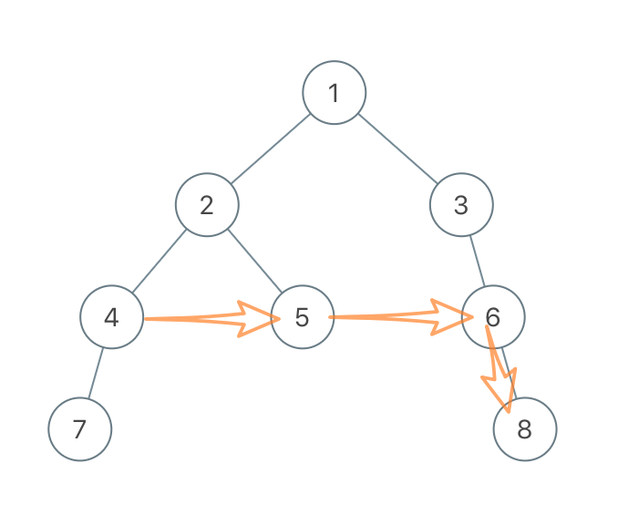
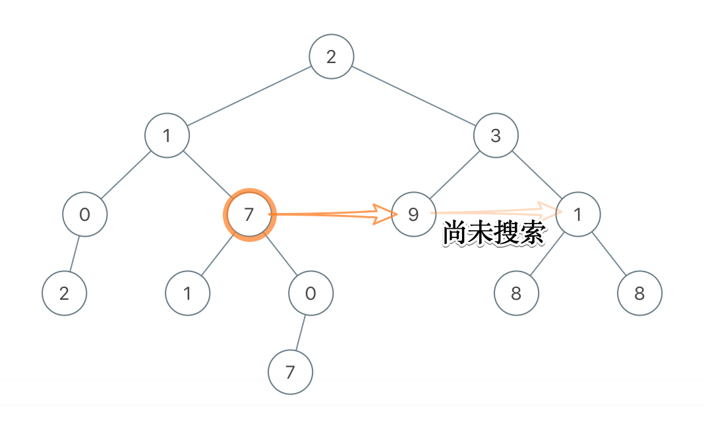
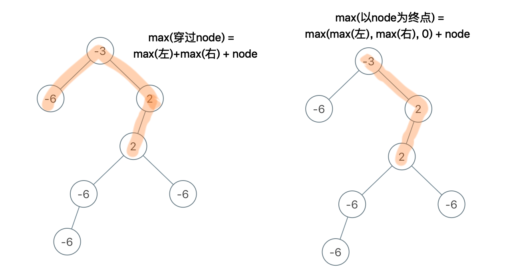
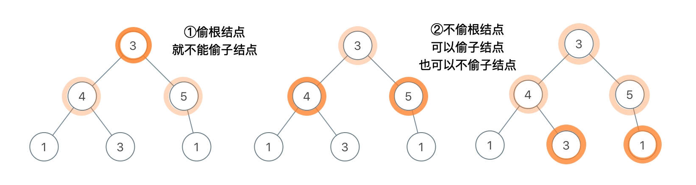

# 树🌲

## A94. 二叉树的中序遍历

难度`中等`

#### 题目描述

给定一个二叉树，返回它的*中序* 遍历。

> **示例:**

```
输入: [1,null,2,3]
   1
    \
     2
    /
   3

输出: [1,3,2]
```


#### 题目链接

<https://leetcode-cn.com/problems/binary-tree-inorder-traversal/>

#### **思路:**


　　中序遍历是`先左中根后右`的遍历方法，这里给出一个非递归的写法。  

#### **代码:**

```python
class Solution:
    def inorderTraversal(self, root: TreeNode) -> List[int]:
        # 左根右
        if not root:
            return []

        stack = []
        ans = []
        while stack or root:
            while root:
                stack.append(root)
                root = root.left
            
            root = stack.pop()
            ans.append(root.val)
            root = root.right

        return ans

```

## A98. 验证二叉搜索树

难度`中等`

#### 题目描述

给定一个二叉树，判断其是否是一个有效的二叉搜索树。

假设一个二叉搜索树具有如下特征：

- 节点的左子树只包含**小于**当前节点的数。
- 节点的右子树只包含**大于**当前节点的数。
- 所有左子树和右子树自身必须也是二叉搜索树。

> **示例 1:**

```
输入:
    2
   / \
  1   3
输出: true
```

> **示例 2:**

```
输入:
    5
   / \
  1   4
     / \
    3   6
输出: false
解释: 输入为: [5,1,4,null,null,3,6]。
     根节点的值为 5 ，但是其右子节点值为 4 。
```

#### 题目链接

<https://leetcode-cn.com/problems/validate-binary-search-tree/>

#### **思路:**

　　DFS，在递归过程中记录每棵子树的最小值和最大值，然后和根节点比较。  

#### **代码:**  

　　**写法一：**

```python
class Solution:
    def isValidBST(self, root: TreeNode) -> bool:
        
        def dfs(root):  # 返回最小值 最大值 以及是不是BST
            min_root = max_root = root.val
            bst_root = True
            if root.left:
                if root.left.val >= root.val: return 0, 0, False  # 快速判断 减少搜索次数

                min_left, max_left, bst_left = dfs(root.left)
                if not bst_left or max_left >= root.val:  # 左子树不是或者左子树最大值大于根结点
                    return 0, 0, False
                min_root = min(min_root, min_left)
                max_root = max(max_root, max_left)

            if root.right:
                if root.right.val <= root.val: return 0, 0, False
                
                min_right, max_right, bst_right = dfs(root.right)
                if not bst_right or min_right <= root.val:  # 左子树不是或者左子树最大值大于根结点
                    return 0, 0, False
                min_root = min(min_root, min_right)
                max_root = max(max_root, max_right)

            return min_root, max_root, bst_root

        if not root:
            return True

        _, _, ans = dfs(root)

        return ans

```

　　**写法二：**

```python
class Solution:
    def isValidBST(self, root: TreeNode) -> bool:
        
        def dfs(root, minimum, maximun):  # 当前节点的最小和最大范围
            if not root: return True

            if root.val <= minimum or root.val >= maximun:
                return False

            return dfs(root.left, minimum, root.val) and dfs(root.right, root.val, maximun)

        return dfs(root, float('-inf'), float('inf'))

```

## A99. 恢复二叉搜索树

难度`困难`

#### 题目描述

二叉搜索树中的两个节点被错误地交换。

请在不改变其结构的情况下，恢复这棵树。

> **示例 1:**

```
输入: [1,3,null,null,2]

   1
  /
 3
  \
   2

输出: [3,1,null,null,2]

   3
  /
 1
  \
   2
```

> **示例 2:**

```
输入: [3,1,4,null,null,2]

  3
 / \
1   4
   /
  2

输出: [2,1,4,null,null,3]

  2
 / \
1   4
   /
  3
```

**进阶:**

- 使用 O(*n*) 空间复杂度的解法很容易实现。
- 你能想出一个只使用常数空间的解决方案吗？

#### 题目链接

<https://leetcode-cn.com/problems/recover-binary-search-tree/>

#### **思路:**

　　二叉搜索树的中序遍历一定是有序的。  

　　先中序遍历，将遍历的结果排序，对比它们可以找到两个更改过的结点，交换它们即可。  　　　　

#### **代码:**  

```python
class Solution:
    def recoverTree(self, root: TreeNode) -> None:
        """
        Do not return anything, modify root in-place instead.
        """
        nodes = []
        def dfs(node):
            if not node:
                return
            dfs(node.left)
            nodes.append(node)  # 中根遍历
            dfs(node.right)

        dfs(root)

        s = sorted(nodes, key=lambda kv: kv.val)

        a = None
        for x, y in zip(nodes, s):
            if x.val != y.val:
                if a is None:
                    a = x
                else:
                    b = x

        a.val, b.val = b.val, a.val
         
```

## A100. 相同的树

难度`简单`

#### 题目描述

给定两个二叉树，编写一个函数来检验它们是否相同。

如果两个树在结构上相同，并且节点具有相同的值，则认为它们是相同的。

> **示例 1:**

```
输入:       1         1
          / \       / \
         2   3     2   3

        [1,2,3],   [1,2,3]

输出: true
```

> **示例 2:**

```
输入:      1          1
          /           \
         2             2

        [1,2],     [1,null,2]

输出: false
```

> **示例 3:**

```
输入:       1         1
          / \       / \
         2   1     1   2

        [1,2,1],   [1,1,2]

输出: false
```

#### 题目链接

<https://leetcode-cn.com/problems/same-tree/>

#### **思路:**

　　先判断根结点是否相同，然后递归判断左右子树。  　　

#### **代码:**

```python
class Solution:
    def isSameTree(self, p: TreeNode, q: TreeNode) -> bool:
        if not p and not q:  # 都为空
            return True

        if not p and q or not q and p:  # 有一个为空 另一个不为空
            return False

        if p.val != q.val:  # 都不为空 但是值不同
            return False
            
        return self.isSameTree(p.left, q.left) and self.isSameTree(p.right, q.right)  # 递归判断左右子树

```

## A101. 对称二叉树

难度`简单`

#### 题目描述

给定一个二叉树，检查它是否是镜像对称的。

例如，二叉树 `[1,2,2,3,4,4,3]` 是对称的。

```
    1
   / \
  2   2
 / \ / \
3  4 4  3
```

但是下面这个 `[1,2,2,null,3,null,3]` 则不是镜像对称的:

```
    1
   / \
  2   2
   \   \
   3    3
```

#### 题目链接

<https://leetcode-cn.com/problems/symmetric-tree/>

#### **思路:**

　　双指针，`left`从左子树开始，`right`从右子树开始。`left`向左遍历时`right`就向右遍历；`left`向右遍历时`right`就向左遍历；如果有不相等就返回`False`。  

#### **代码:**

```python
lass Solution:
    def isSymmetric(self, root: TreeNode) -> bool:
        def dfs(node_left, node_right):  # 双指针
            if not node_left and not node_right: 
                return True

            if not node_left and node_right or not node_right and node_left:
                return False

            if node_left.val != node_right.val:
                return False

            return dfs(node_left.left, node_right.right) and dfs(node_left.right, node_right.left) 

        if not root:
            return True

        return dfs(root.left, root.right)
```

## A104. 二叉树的最大深度

难度`简单`

#### 题目描述

给定一个二叉树，找出其最大深度。

二叉树的深度为根节点到最远叶子节点的最长路径上的节点数。

**说明:** 叶子节点是指没有子节点的节点。

> **示例：**  

给定二叉树 `[3,9,20,null,null,15,7]`，

```
    3
   / \
  9  20
    /  \
   15   7
```

返回它的最大深度 3 。

#### 题目链接

<https://leetcode-cn.com/problems/maximum-depth-of-binary-tree/>

#### **思路:**

　　方法一：dfs，用一个全局变量记录最大深度，如果当前结点的深度大于最大深度则更新最大深度。  

　　方法一：bfs，层序优先遍历，返回最后一层的是第几层。  　　　　

#### **代码:**

```python
class Solution:
    def maxDepth(self, root: TreeNode) -> int:
        ans = 0
        def dfs(node, depth):
            nonlocal ans
            if not node:
                return
            depth += 1
            ans = max(ans, depth)
            if node.left:
                dfs(node.left, depth)
            
            if node.right:
                dfs(node.right, depth)

        dfs(root, 0)
        return ans
      
```

## A105. 从前序与中序遍历序列构造二叉树

难度 `中等`  

#### 题目描述

根据一棵树的前序遍历与中序遍历构造二叉树。

**注意:**
你可以假设树中没有重复的元素。

例如，给出

```
前序遍历 preorder = [3,9,20,15,7]
中序遍历 inorder = [9,3,15,20,7]
```

返回如下的二叉树：

```
    3
   / \
  9  20
    /  \
   15   7
```

#### 题目链接

<https://leetcode-cn.com/problems/construct-binary-tree-from-preorder-and-inorder-traversal/>

#### 思路  

　　前序遍历中的第一个一定为根结点，在中序遍历中找到这个结点。它之前的所有元素表示左子树的中序遍历，在前序遍历中取相同长度则为左子树的前序遍历。  

　　根据左子树的前序和中序遍历构建左子树，右子树同理。  

　　递归处理，结点数为1时，直接返回该叶子结点。  

#### 代码  

```python
# Definition for a binary tree node.
# class TreeNode:
#     def __init__(self, x):
#         self.val = x
#         self.left = None
#         self.right = None

class Solution:
    def buildTree(self, preorder: List[int], inorder: List[int]) -> TreeNode:
        if len(preorder) == 0:  # 空树
            return None
            
        if len(inorder) == 1:  # 只有一个结点的树
            return TreeNode(inorder[0])

        root = preorder[0]  # 第一个元素为根结点
        i = inorder.index(root)  # 在中序遍历中找到根结点
        left = self.buildTree(preorder[1:i+1], inorder[:i])  # 递归构建左子树
        right = self.buildTree(preorder[i+1:], inorder[i+1:])  # 递归构建右子树

        ans = TreeNode(root)
        ans.left = left
        ans.right = right
        return ans
```

## A106. 从中序与后序遍历序列构造二叉树

难度`中等`

#### 题目描述

根据一棵树的中序遍历与后序遍历构造二叉树。

**注意:**
你可以假设树中没有重复的元素。

例如，给出

```
中序遍历 inorder = [9,3,15,20,7]
后序遍历 postorder = [9,15,7,20,3]
```

返回如下的二叉树：

```
    3
   / \
  9  20
    /  \
   15   7
```

#### 题目链接

<https://leetcode-cn.com/problems/construct-binary-tree-from-inorder-and-postorder-traversal/>

#### **思路:**

　　后序遍历中的**最后一个**结点一定为根结点，在中序遍历中找到这个结点。它之前的所有元素表示左子树的中序遍历，在前序遍历中取相同长度则为左子树的前序遍历。  

　　根据左子树的前序和中序遍历构建左子树，右子树同理。  　　

#### **代码:**

```python
# Definition for a binary tree node.
# class TreeNode:
#     def __init__(self, x):
#         self.val = x
#         self.left = None
#         self.right = None

class Solution:
    def buildTree(self, inorder: List[int], postorder: List[int]) -> TreeNode:
        if not inorder:
            return None

        root = postorder[-1]
        idx = inorder.index(root)
        ans = TreeNode(root)

        left = self.buildTree(inorder[:idx], postorder[:idx])
        right = self.buildTree(inorder[idx+1:], postorder[idx:-1])

        ans.left = left
        ans.right = right

        return ans

```

## A108. 将有序数组转换为二叉搜索树

难度`简单`

#### 题目描述

将一个按照升序排列的有序数组，转换为一棵高度平衡二叉搜索树。

本题中，一个高度平衡二叉树是指一个二叉树*每个节点* 的左右两个子树的高度差的绝对值不超过 1。

> **示例:**

```
给定有序数组: [-10,-3,0,5,9],

一个可能的答案是：[0,-3,9,-10,null,5]，它可以表示下面这个高度平衡二叉搜索树：

      0
     / \
   -3   9
   /   /
 -10  5
```

#### 题目链接

<https://leetcode-cn.com/problems/convert-sorted-array-to-binary-search-tree/>

#### **思路:**

　　模板题。见[有序数组构建平衡二叉树](/实用模板?id=有序数组构建平衡二叉树)。  

#### **代码:**

```python
class Solution:
    def sortedArrayToBST(self, nums: List[int]) -> TreeNode:
        def build(nums, i, j):
            mid = (i+j)//2
            root = TreeNode(nums[mid])
            if(i==j):
                return root
            if i <= mid-1:
                root.left = build(nums,i,mid-1)
            if mid+1 <= j:
                root.right = build(nums, mid+1, j)

            return root

        if not nums: return []
        return build(nums, 0, len(nums)-1)
```

## A110. 平衡二叉树

难度`简单`

#### 题目描述

给定一个二叉树，判断它是否是高度平衡的二叉树。

本题中，一棵高度平衡二叉树定义为：

> 一个二叉树*每个节点* 的左右两个子树的高度差的绝对值不超过1。

> **示例 1:**

给定二叉树 `[3,9,20,null,null,15,7]`

```
    3
   / \
  9  20
    /  \
   15   7
```

返回 `true` 。

> **示例 2:**

给定二叉树 `[1,2,2,3,3,null,null,4,4]`

```
       1
      / \
     2   2
    / \
   3   3
  / \
 4   4
```

返回 `false` 。

#### 题目链接

<https://leetcode-cn.com/problems/balanced-binary-tree/>

#### **思路:**

　　dfs，搜索时返回当前树的深度，以及是否平衡。  

　　左右子树的深度之差绝对值大于1，则该树不平衡。  

#### **代码:**

```python
class Solution:
    def isBalanced(self, root: TreeNode) -> bool:
        def dfs(node):  # depth, 是否平衡
            if not node:
                return 0, True

            depth = 0

            left, left_balance = dfs(node.left) 
            depth = max(depth, left)

            right, right_balance = dfs(node.right) 
            depth = max(depth, right)

            if not left_balance or not right_balance or abs(left - right) > 1:
                return 0, False


            return depth + 1, True

        _, balance = dfs(root)
        return balance
```

## A111. 二叉树的最小深度

难度`简单`

#### 题目描述

给定一个二叉树，找出其最小深度。

最小深度是从根节点到最近叶子节点的最短路径上的节点数量。

**说明:** 叶子节点是指没有子节点的节点。

> **示例:**

给定二叉树 `[3,9,20,null,null,15,7]`,

```
    3
   / \
  9  20
    /  \
   15   7
```

返回它的最小深度  2.

#### 题目链接

<https://leetcode-cn.com/problems/minimum-depth-of-binary-tree/>

#### **思路:**

　　dfs。用一个**全局变量**`ans`记录最小深度，如果遇到叶子结点的深度小于`ans`，就更新`ans`。  

#### **代码:**

```python
class Solution:
    def minDepth(self, root: TreeNode) -> int:
        ans = float('inf')
        def dfs(node, depth):
            nonlocal ans
            if not node:
                return 

            depth += 1
            if not node.left and not node.right:
                ans = min(ans, depth)
            else:
                dfs(node.left, depth)
                dfs(node.right, depth)
            
        if not root:
            return 0
            
        dfs(root, 0)
        return ans
```

## A112. 路径总和

难度`简单`

#### 题目描述

给定一个二叉树和一个目标和，判断该树中是否存在根节点到叶子节点的路径，这条路径上所有节点值相加等于目标和。

**说明:** 叶子节点是指没有子节点的节点。

> **示例:**   

给定如下二叉树，以及目标和 `sum = 22`，

```
              5
             / \
            4   8
           /   / \
          11  13  4
         /  \      \
        7    2      1
```

返回 `true`, 因为存在目标和为 22 的根节点到叶子节点的路径 `5->4->11->2`。

#### 题目链接

<https://leetcode-cn.com/problems/path-sum/>

#### **思路:**

　　dfs。搜索到每个结点都加上这个结点的`val`，注意函数返回时要将加上的`val`减去。  

　　当某个叶子结点的和等于`sum`时返回`True`。  

#### **代码:**

```python
class Solution:
    def hasPathSum(self, root: TreeNode, sum: int) -> bool:
        temp = 0
        def dfs(node):
            nonlocal temp
            if not node:
                return False

            temp += node.val

            if not node.left and not node.right and temp == sum:
                return True

            if dfs(node.left) or dfs(node.right):
                return True

            temp -= node.val
            return False

        return dfs(root)
```

## A113. 路径总和 II

难度`中等`

#### 题目描述

给定一个二叉树和一个目标和，找到所有从根节点到叶子节点路径总和等于给定目标和的路径。

**说明:** 叶子节点是指没有子节点的节点。

> **示例:**  

给定如下二叉树，以及目标和 `sum = 22`，

```
              5
             / \
            4   8
           /   / \
          11  13  4
         /  \    / \
        7    2  5   1
```

返回:

```
[
   [5,4,11,2],
   [5,8,4,5]
]
```

#### 题目链接

<https://leetcode-cn.com/problems/path-sum-ii/>

#### **思路:**

　　比上一题[A112. 路径综合](/dfs?id=a112-路径总和)多了一步记录`从根结点到当前结点的路径`。  

#### **代码:**

```python
class Solution:
    def pathSum(self, root: TreeNode, sum: int) -> List[List[int]]:
        temp = 0
        path = []  # 记录路径
        ans = []
        def dfs(node):
            if not node:
                return 
            nonlocal temp

            temp += node.val
            path.append(node.val)
            pop_idx = len(path) - 1  # 记录插入到path中的位置 在函数返回前删除掉

            if not node.left and not node.right and temp == sum:
                ans.append(path.copy())
            else:
                dfs(node.left)
                dfs(node.right)

            # 还原到调用之前的状态
            temp -= node.val  
            path.pop(pop_idx)

        dfs(root)
        return ans
      
```

## A114. 二叉树展开为链表

难度`中等`

#### 题目描述

给定一个二叉树，[原地](https://baike.baidu.com/item/原地算法/8010757)将它展开为链表。

例如，给定二叉树

```
    1
   / \
  2   5
 / \   \
3   4   6
```

将其展开为：

```
1
 \
  2
   \
    3
     \
      4
       \
        5
         \
          6
```

#### 题目链接

<https://leetcode-cn.com/problems/flatten-binary-tree-to-linked-list/>

#### **思路:**

　　dfs。  规则如下：  

```
  ① 只有右子树：不做任何操作 对右子树递归
  ② 叶子结点：把自己返回回去
  ③ 只有左子树：左子树放到右子树 然后把左子树置空 对右子树递归
  ④ 左右子树都有：dfs(左子树).right = 右子树 node.right=左子树 然后把左子树置空 对(之前的)右子树递归
```

#### **代码:**

```python
class Solution:
    def flatten(self, root: TreeNode) -> None:
        """
        Do not return anything, modify root in-place instead.
        """
        # 只有右子树： 不做任何操作
        # 叶子结点：把自己返回回去
        # 只有左子树：左子树放到右子树 然后把左子树置空
        # 左右子树都有： dfs(左子树).right = 右子树 node.right=左子树 然后把左子树置空
        def dfs(node):
            if not node:
                return 

            if not node.left and not node.right:  # 叶子结点
                return node

            if node.left and node.right:
                right = node.right
                dfs(node.left).right = node.right
                node.right = node.left
                node.left = None
                return dfs(right)

            if node.left:
                left = node.left
                node.right = node.left
                node.left = None
                return dfs(left)

            if node.right:
                return dfs(node.right)

        dfs(root)
```

## A116. 填充每个节点的下一个右侧节点指针

难度`中等`

#### 题目描述

给定一个**完美二叉树**，其所有叶子节点都在同一层，每个父节点都有两个子节点。二叉树定义如下：

```
struct Node {
  int val;
  Node *left;
  Node *right;
  Node *next;
}
```

填充它的每个 next 指针，让这个指针指向其下一个右侧节点。如果找不到下一个右侧节点，则将 next 指针设置为 `NULL`。

初始状态下，所有 next 指针都被设置为 `NULL`。

> **示例：**


```
输入：{"$id":"1","left":{"$id":"2","left":{"$id":"3","left":null,"next":null,"right":null,"val":4},"next":null,"right":{"$id":"4","left":null,"next":null,"right":null,"val":5},"val":2},"next":null,"right":{"$id":"5","left":{"$id":"6","left":null,"next":null,"right":null,"val":6},"next":null,"right":{"$id":"7","left":null,"next":null,"right":null,"val":7},"val":3},"val":1}

输出：{"$id":"1","left":{"$id":"2","left":{"$id":"3","left":null,"next":{"$id":"4","left":null,"next":{"$id":"5","left":null,"next":{"$id":"6","left":null,"next":null,"right":null,"val":7},"right":null,"val":6},"right":null,"val":5},"right":null,"val":4},"next":{"$id":"7","left":{"$ref":"5"},"next":null,"right":{"$ref":"6"},"val":3},"right":{"$ref":"4"},"val":2},"next":null,"right":{"$ref":"7"},"val":1}

解释：给定二叉树如图 A 所示，你的函数应该填充它的每个 next 指针，以指向其下一个右侧节点，如图 B 所示。 
```

**提示：**

- 你只能使用常量级额外空间。
- 使用递归解题也符合要求，本题中递归程序占用的栈空间不算做额外的空间复杂度。

#### 题目链接

<https://leetcode-cn.com/problems/populating-next-right-pointers-in-each-node/>

#### **思路:**

　　填充后的`next`指针也可以使用上。  　　

#### **代码:**

```python
class Solution:
    def connect(self, root: 'Node') -> 'Node':
        if not root:
            return None
            
        if not root.left:
            return root

        root.left.next = root.right
        if root.next:
            root.right.next = root.next.left

        self.connect(root.left)
        self.connect(root.right)

        return root

```

## A117. 填充每个节点的下一个右侧节点指针 II

难度`中等`

#### 题目描述

给定一个二叉树

```
struct Node {
  int val;
  Node *left;
  Node *right;
  Node *next;
}
```

填充它的每个 next 指针，让这个指针指向其下一个右侧节点。如果找不到下一个右侧节点，则将 next 指针设置为 `NULL`。

初始状态下，所有 next 指针都被设置为 `NULL`。 

**进阶：**

- 你只能使用常量级额外空间。
- 使用递归解题也符合要求，本题中递归程序占用的栈空间不算做额外的空间复杂度。

> **示例：**


```
输入：root = [1,2,3,4,5,null,7]
输出：[1,#,2,3,#,4,5,7,#]
解释：给定二叉树如图 A 所示，你的函数应该填充它的每个 next 指针，以指向其下一个右侧节点，如图 B 所示。
```

**提示：**

- 树中的节点数小于 `6000`
- `-100 <= node.val <= 100`

#### 题目链接

<https://leetcode-cn.com/problems/populating-next-right-pointers-in-each-node-ii/>

#### **思路:**

　　与上一题不同，不能直接用自身`next`的孩子作为孩子的`next`，因为自身的`next`可能没有孩子。如下图所示，当前结点为`4`，给左孩子`7`寻找`next`指针时，需要沿着`next`一直向右边扫描，一直到某个**有孩子的结点**时(`6`)才停下来。  

　　

　　此外，要**先搜索右子树，后搜索左子树。**否则遇到如下图所示的情况时，给`7`的右孩子`0`找`next`时，`7`的`next的next`尚未搜索，因此无法找到`0`的`next`。  

　　

#### **代码:**

```python
class Solution:
    def connect(self, root: 'Node') -> 'Node':
        if not root:
            return None
            
        if not root.left and not root.right:
            return root

        curr = root.right
        if root.left and root.right:
            root.left.next = root.right
        elif root.left:
            curr = root.left

        temp = root.next
        next = None
        while temp:
            if temp.left:
                next = temp.left
                break
            elif temp.right:
                next = temp.right
                break
            temp = temp.next

        curr.next = next

        self.connect(root.right)
        self.connect(root.left)

        return root
```

## A124. 二叉树中的最大路径和

难度`困难`

#### 题目描述

给定一个**非空**二叉树，返回其最大路径和。

本题中，路径被定义为一条从树中任意节点出发，达到任意节点的序列。该路径**至少包含一个**节点，且不一定经过根节点。

> **示例 1:**

```
输入: [1,2,3]

       1
      / \
     2   3

输出: 6
```

> **示例 2:**

```
输入: [-10,9,20,null,null,15,7]

   -10
   / \
  9  20
    /  \
   15   7

输出: 42
```

#### 题目链接

<https://leetcode-cn.com/problems/binary-tree-maximum-path-sum/>

#### **思路:**

　　dfs。搜索时要关注的有两种可能性：  

　　① 以根结点为**中间结点**(即穿过根结点)的最大路径，计算方法为`以左结点为终点的最大路径`+`以右结点为终点的最大路径`+`根结点值`。

　　② 以根结点为**终点**的最大路径，计算方法为 max(`以左结点为终点的最大路径`+`根结点值`，`以右结点为终点的最大路径`+`根结点值`，`单独根结点的值`)。简化后的表达式如下图所示：  

　　　　　　  
　　后序遍历，访问根结点时已经知道了两个孩子结点的①和②，按条件递归即可。  

#### **代码:**

```python
class Solution:
    def maxPathSum(self, root: TreeNode) -> int:
        ans = float('-inf')  

        def dfs(node): 
            if not node:
                return 0, 0

            nonlocal ans
            if not node.left and not node.right:  # 叶子结点
                ans = max(ans, node.val)
                return node.val, node.val

            cross_l, end_l = dfs(node.left)
            cross_r, end_r = dfs(node.right)

            cross_node = end_l + end_r + node.val
            end_node = max(end_l, end_r, 0) + node.val  # 可能用左子树或右子树，也可能都不用

            ans = max(ans, cross_node, end_node)  
            # cross_node表示以当前结点为中间结点的最大路径 
            # end_node表示以当前结点为终点的最大路径
            return cross_node, end_node

        dfs(root)
        return ans
      
```

## A129. 求根到叶子节点数字之和

难度`中等`

#### 题目描述

给定一个二叉树，它的每个结点都存放一个 `0-9` 的数字，每条从根到叶子节点的路径都代表一个数字。

例如，从根到叶子节点路径 `1->2->3` 代表数字 `123`。

计算从根到叶子节点生成的所有数字之和。

**说明:** 叶子节点是指没有子节点的节点。

> **示例 1:**

```
输入: [1,2,3]
    1
   / \
  2   3
输出: 25
解释:
从根到叶子节点路径 1->2 代表数字 12.
从根到叶子节点路径 1->3 代表数字 13.
因此，数字总和 = 12 + 13 = 25.
```

> **示例 2:**

```
输入: [4,9,0,5,1]
    4
   / \
  9   0
 / \
5   1
输出: 1026
解释:
从根到叶子节点路径 4->9->5 代表数字 495.
从根到叶子节点路径 4->9->1 代表数字 491.
从根到叶子节点路径 4->0 代表数字 40.
因此，数字总和 = 495 + 491 + 40 = 1026.
```

#### 题目链接

<https://leetcode-cn.com/problems/sum-root-to-leaf-numbers/>

#### **思路:**

　　dfs。用一个全局变量记录`从根结点到当前结点的路径`，当到达叶子结点时结果累加上这条路径的`数值`。  　　

#### **代码:**

```python
class Solution:
    def sumNumbers(self, root: TreeNode) -> int:
        curr = ''  # 路径字符串
        ans = 0  # 累加结果
        def dfs(node):
            if not node:
                return 

            nonlocal curr, ans
            curr += str(node.val)

            if not node.left and not node.right:
                ans += int(curr)
                curr = curr[:-1]
                return 

            dfs(node.left)
            dfs(node.right)

            curr = curr[:-1]  # 恢复到函数调用前的状态

        dfs(root)
        return ans
      
```

## A199. 二叉树的右视图

难度`中等`

#### 题目描述

给定一棵二叉树，想象自己站在它的右侧，按照从顶部到底部的顺序，返回从右侧所能看到的节点值。

> **示例:**

```
输入: [1,2,3,null,5,null,4]
输出: [1, 3, 4]
解释:

   1            <---
 /   \
2     3         <---
 \     \
  5     4       <---
```

#### 题目链接

<https://leetcode-cn.com/problems/binary-tree-right-side-view/>

#### **思路:**

　　使用层序遍历，并只保留每层最后一个节点的值。  

#### **代码:**

```python
# Definition for a binary tree node.
# class TreeNode:
#     def __init__(self, x):
#         self.val = x
#         self.left = None
#         self.right = None

class Solution:
    def rightSideView(self, root: TreeNode) -> List[int]:
        
        if not root:
            return []

        queue = [root]
        ans = []
        while queue:
            temp = []
            ans.append(queue[-1].val)
            for q in queue:
                if q.left:
                    temp.append(q.left)
                if q.right:
                    temp.append(q.right)
            
            queue = temp

        return ans

```

## A257. 二叉树的所有路径

难度`简单`

#### 题目描述

给定一个二叉树，返回所有从根节点到叶子节点的路径。

**说明:** 叶子节点是指没有子节点的节点。

> **示例:**

```
输入:

   1
 /   \
2     3
 \
  5

输出: ["1->2->5", "1->3"]

解释: 所有根节点到叶子节点的路径为: 1->2->5, 1->3
```

#### 题目链接

<https://leetcode-cn.com/problems/binary-tree-paths/>

#### **思路:**

　　dfs。用一个全局变量`curr`记录`从根结点到当前结点的路径`，当到达叶子结点时记录这条路径。  

#### **代码:**

```python
# Definition for a binary tree node.
# class TreeNode:
#     def __init__(self, x):
#         self.val = x
#         self.left = None
#         self.right = None

class Solution:
    def binaryTreePaths(self, root: TreeNode) -> List[str]:
        curr = []  # 路径列表
        ans = []  # 结果结果
        def dfs(node):
            if not node:
                return 

            curr.append(str(node.val))
            idx = len(curr) - 1  # 记录插入的位置，方便函数返回前弹出

            if not node.left and not node.right:  # 到达叶子结点
                ans.append('->'.join(curr))
                curr.pop(idx)
                return 

            dfs(node.left)
            dfs(node.right)

            curr.pop(idx)  # 恢复到函数调用前的状态

        dfs(root)
        return ans
```

## A337. 打家劫舍 III

难度`中等`

#### 题目描述

在上次打劫完一条街道之后和一圈房屋后，小偷又发现了一个新的可行窃的地区。这个地区只有一个入口，我们称之为“根”。 除了“根”之外，每栋房子有且只有一个“父“房子与之相连。一番侦察之后，聪明的小偷意识到“这个地方的所有房屋的排列类似于一棵二叉树”。 如果两个直接相连的房子在同一天晚上被打劫，房屋将自动报警。

计算在不触动警报的情况下，小偷一晚能够盗取的最高金额。

> **示例 1:**

```
输入: [3,2,3,null,3,null,1]

     3
    / \
   2   3
    \   \ 
     3   1

输出: 7 
解释: 小偷一晚能够盗取的最高金额 = 3 + 3 + 1 = 7.
```

> **示例 2:**

```
输入: [3,4,5,1,3,null,1]

     3
    / \
   4   5
  / \   \ 
 1   3   1

输出: 9
解释: 小偷一晚能够盗取的最高金额 = 4 + 5 = 9.
```

#### 题目链接

<https://leetcode-cn.com/problems/house-robber-iii/>

#### **思路:**

　　对于任意一个结点`node`，只有两种状态，要么偷，要么不偷，分别计算这这种情况的最大值即可。  



　　如果偷结点`node`，就不能偷`node`的子结点，最大值为`not_rob_left`+`not_rob_right`+`node.val`。  

　　如果不偷结点`node`，可以偷`node`的子结点(也可以不偷)，最大值为max(`rob_left`,`not_rob_left`) + max(`rob_right`,`not_rob_right`)。  

#### **代码:**

```python
class Solution:
    def rob(self, root: TreeNode) -> int:
        def dfs(node):  # 返回use not_use
            if not node:
                return 0, 0

            if not node.left and not node.right:  # 叶子结点
                return node.val, 0

            rob_left, no_rob_left = dfs(node.left)
            rob_right, no_rob_right = dfs(node.right)
            
            return no_rob_left + no_rob_right + node.val, max(rob_left, no_rob_left) + max(rob_right, no_rob_right)

        rob_root, no_rob_root = dfs(root)
        return max(rob_root, no_rob_root)
      
```

## A102. 二叉树的层序遍历

难度`中等`

#### 题目描述

给你一个二叉树，请你返回其按 **层序遍历** 得到的节点值。 （即逐层地，从左到右访问所有节点）。

**示例：**
二叉树：`[3,9,20,null,null,15,7]`,

```
    3
   / \
  9  20
    /  \
   15   7
```

返回其层次遍历结果：

```
[
  [3],
  [9,20],
  [15,7]
]
```

#### 题目链接

<https://leetcode-cn.com/problems/binary-tree-level-order-traversal/>

#### **思路:**

　　[层序遍历模板](/实用模板?id=广搜：bfs🌲层序遍历)。  

#### **代码:**

```python
class Solution:
    def levelOrder(self, root: TreeNode) -> List[List[int]]:
        if not root:
            return []

        queue = [root]
        ans = []
        while queue:
            ans.append([q.val for q in queue])
            temp = []
            # queue存放的是当前层的所有结点
            for q in queue:
                if q.left:
                    temp.append(q.left)
                if q.right:
                    temp.append(q.right)

            queue = temp
        return ans

```

## A103. 二叉树的锯齿形层次遍历

难度`中等`

#### 题目描述

给定一个二叉树，返回其节点值的锯齿形层次遍历。（即先从左往右，再从右往左进行下一层遍历，以此类推，层与层之间交替进行）。

例如：
给定二叉树 `[3,9,20,null,null,15,7]`,

```
    3
   / \
  9  20
    /  \
   15   7
```

返回锯齿形层次遍历如下：

```
[
  [3],
  [20,9],
  [15,7]
]
```

#### 题目链接

<https://leetcode-cn.com/problems/binary-tree-zigzag-level-order-traversal/>

#### **思路:**

　　和上一题一样。用一个`flag`标记是从左往右还是从右往左就行了。  

#### **代码:**

```python
class Solution:
    def zigzagLevelOrder(self, root: TreeNode) -> List[List[int]]:
        if not root:
            return []

        queue = [root]
        ans = []
        left_to_right = True
        while queue:
            if left_to_right:
                ans.append([q.val for q in queue])
            else:
                ans.append([q.val for q in queue[::-1]])
            left_to_right = not left_to_right
            temp = []
            # queue存放的是当前层的所有结点
            for q in queue:
                if q.left:
                    temp.append(q.left)
                if q.right:
                    temp.append(q.right)

            queue = temp
        return ans

```

## A144. 二叉树的前序遍历

难度`中等`

#### 题目描述

给定一个二叉树，返回它的 *前序* 遍历。

 **示例:**

```
输入: [1,null,2,3]  
   1
    \
     2
    /
   3 

输出: [1,2,3]
```

**进阶:** 递归算法很简单，你可以通过迭代算法完成吗？

#### 题目链接

<https://leetcode-cn.com/problems/binary-tree-preorder-traversal/>

#### **思路:**

　　用迭代的方法，用一个堆栈维护已访问过的结点，先不断向左遍历，然后再不断向右遍历。  

#### **代码:**

```python
class Solution:
    def preorderTraversal(self, root: TreeNode) -> List[int]:
        if not root:
            return []
        ans = []
        stack = [root]
        ans.append(root.val)

        while stack:
            node = stack[-1]
            if node.left:
                stack.append(node.left)
                ans.append(node.left.val)
                node.left = None
                continue
            if node.right:
                stack.append(node.right)
                ans.append(node.right.val)
                node.right = None
                continue

            stack.pop()

        return ans

```

## A145. 二叉树的后序遍历

难度`困难`

#### 题目描述

给定一个二叉树，返回它的 *后序* 遍历。

> **示例:**

```
输入: [1,null,2,3]  
   1
    \
     2
    /
   3 

输出: [3,2,1]
```

**进阶:** 递归算法很简单，你可以通过迭代算法完成吗？

#### 题目链接

<https://leetcode-cn.com/problems/binary-tree-postorder-traversal/>

#### **思路:**

　　跟上一题一样，只是遍历完左右结点再遍历根结点即可。  

#### **代码:**

```python
class Solution:
    def postorderTraversal(self, root: TreeNode) -> List[int]:
        if not root:
            return []
        ans = []
        stack = [root]

        while stack:
            node = stack[-1]
            if node.left:
                stack.append(node.left)
                node.left = None
                continue
            if node.right:
                stack.append(node.right)
                node.right = None
                continue

            ans.append(stack.pop().val)

        return ans

```

## A429. N叉树的层序遍历

难度`中等`

#### 题目描述

给定一个 N 叉树，返回其节点值的*层序遍历*。 (即从左到右，逐层遍历)。

例如，给定一个 `3叉树` :


 

返回其层序遍历:

```
[
     [1],
     [3,2,4],
     [5,6]
]
```

**说明:**

1. 树的深度不会超过 `1000`。
2. 树的节点总数不会超过 `5000`。

#### 题目链接

<https://leetcode-cn.com/problems/n-ary-tree-level-order-traversal/>

#### **思路:**

　　[层序遍历模板](/实用模板?id=广搜：bfs🌲层序遍历)。  

#### **代码:**

```python
"""
# Definition for a Node.
class Node:
    def __init__(self, val=None, children=None):
        self.val = val
        self.children = children
"""

class Solution:
    def levelOrder(self, root: 'Node') -> List[List[int]]:
        if not root:
            return 

        queue = [root]
        ans = []
        while queue:
            temp = []
            ans.append([q.val for q in queue])
            # queue存放的是当前层的所有结点
            for q in queue:
                for children in q.children:
                    temp.append(children)

            queue = temp
        return ans
      
```

## A508. 出现次数最多的子树元素和

难度`中等`

#### 题目描述

给你一个二叉树的根结点，请你找出出现次数最多的子树元素和。一个结点的「子树元素和」定义为以该结点为根的二叉树上所有结点的元素之和（包括结点本身）。

你需要返回出现次数最多的子树元素和。如果有多个元素出现的次数相同，返回所有出现次数最多的子树元素和（不限顺序）。
> **示例 1：**

```
输入:

  5
 /  \
2   -3
```

返回 [2, -3, 4]，所有的值均只出现一次，以任意顺序返回所有值。

> **示例 2：**

```
输入:

  5
 /  \
2   -5
```

返回 [2]，只有 2 出现两次，-5 只出现 1 次。

#### 题目链接

<https://leetcode-cn.com/problems/most-frequent-subtree-sum/>

#### **思路:**


　　记录所有子树元素和，统计它们的出现次数，将次数最多的打印出来。

#### **代码:**

```python
class Solution:
    def findFrequentTreeSum(self, root: TreeNode) -> List[int]:
        if not root:
            return []

        subtrees = []
        def dfs(node):
            if not node:
                return 0

            s = node.val
            if node.left:
                s += dfs(node.left)

            if node.right:
                s += dfs(node.right)
            
            subtrees.append(s)
            return s

        dfs(root)
        c = Counter(subtrees)
        maximum = max(c.values())

        ans = []
        for num, count in c.items():
            if count == maximum:
                ans.append(num)

        return ans

```

## A513. 找树左下角的值

难度`中等`

#### 题目描述

给定一个二叉树，在树的最后一行找到最左边的值。

> **示例 1:**

```
输入:

    2
   / \
  1   3

输出:
1 
```

> **示例 2:**

```
输入:

        1
       / \
      2   3
     /   / \
    4   5   6
       /
      7

输出:
7
```

#### 题目链接

<https://leetcode-cn.com/problems/find-bottom-left-tree-value/>

#### **思路:**

　　[层序遍历模板](/实用模板?id=广搜：bfs🌲层序遍历)。 

#### **代码:**

```python
class Solution:
    def findBottomLeftValue(self, root: TreeNode) -> int:
        if not root:
            return 

        queue = [root]
        ans = 0
        while queue:
            temp = []
            # queue存放的是当前层的所有结点
            for q in queue:
                if q.left:
                    temp.append(q.left)
                if q.right:
                    temp.append(q.right)
            if not temp:
                ans = queue[0].val

            queue = temp
        return ans
```

## A515. 在每个树行中找最大值

难度`中等`

#### 题目描述

您需要在二叉树的每一行中找到最大的值。

> **示例：**

```
输入: 

          1
         / \
        3   2
       / \   \  
      5   3   9 

输出: [1, 3, 9]
```

#### 题目链接

<https://leetcode-cn.com/problems/find-largest-value-in-each-tree-row/>

#### **思路:**

　　[层序遍历模板](/实用模板?id=广搜：bfs🌲层序遍历)。 

#### **代码:**

```python
class Solution:
    def largestValues(self, root: TreeNode) -> List[int]:
        if not root:
            return 

        queue = [root]
        ans = []
        while queue:
            temp = []
            ans.append(max([node.val for node in queue]))
            # queue存放的是当前层的所有结点
            for q in queue:
                if q.left:
                    temp.append(q.left)
                if q.right:
                    temp.append(q.right)

            queue = temp
        return ans
```

