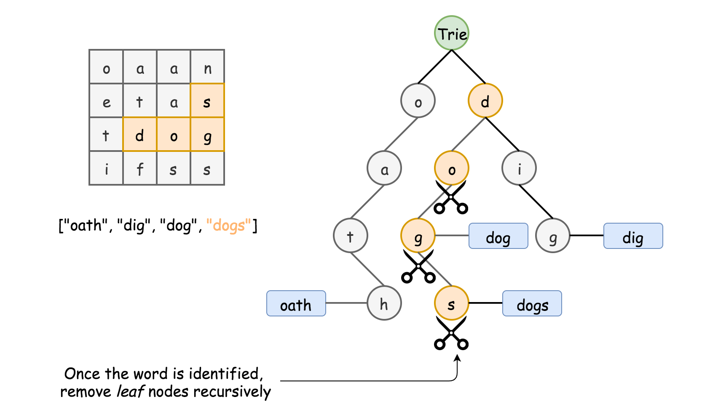

# Trie树(前缀树)

## A208. 实现 Trie 

难度`中等`

#### 题目描述

实现一个 Trie (前缀树)，包含 `insert`, `search`, 和 `startsWith` 这三个操作。

> **示例:**

```
Trie trie = new Trie();

trie.insert("apple");
trie.search("apple");   // 返回 true
trie.search("app");     // 返回 false
trie.startsWith("app"); // 返回 true
trie.insert("app");   
trie.search("app");     // 返回 true
```

**说明:**

- 你可以假设所有的输入都是由小写字母 `a-z` 构成的。
- 保证所有输入均为非空字符串。

#### 题目链接

<前缀树https://leetcode-cn.com/problems/implement-trie-prefix-tree/>

#### **思路:**

　　Trie树的模板。

#### **代码:**

```python
class Trie:

    def __init__(self):
        """
        Initialize your data structure here.
        """
        self.trie = {}


    def insert(self, word: str) -> None:
        """
        Inserts a word into the trie.
        """
        node = self.trie
        for char in word:
            node = node.setdefault(char, {})
        node['#'] = True

    def search(self, word: str) -> bool:
        """
        Returns if the word is in the trie.
        """
        tmp = self.trie
        for char in word:
            if char not in tmp:
                return False
            tmp = tmp[char]
        # print(tmp)
        return '#' in tmp


    def startsWith(self, prefix: str) -> bool:
        """
        Returns if there is any word in the trie that starts with the given prefix.
        """
        tmp = self.trie
        for char in prefix:
            if char not in tmp:
                return False
            tmp = tmp[char]
        return True

```

## A211. 添加与搜索单词 - 数据结构设计

难度`中等`

#### 题目描述

设计一个支持以下两种操作的数据结构：

```
void addWord(word)
bool search(word)
```

search(word) 可以搜索文字或正则表达式字符串，字符串只包含字母 `.` 或 `a-z` 。 `.` 可以表示任何一个字母。

> **示例:**

```
addWord("bad")
addWord("dad")
addWord("mad")
search("pad") -> false
search("bad") -> true
search(".ad") -> true
search("b..") -> true
```

**说明:**

你可以假设所有单词都是由小写字母 `a-z` 组成的。

#### 题目链接

<https://leetcode-cn.com/problems/add-and-search-word-data-structure-design/>

#### **思路:**

　　典型的`trie树`应用，`trie树`(又称字典树或前缀树)，将相同前缀的单词放在同一棵子树上，以实现快速的多对多匹配。如下如所示：  

　　　　　　

　　对于有单词的结点(图中橙色的结点)，我们用一个`"#"`来表示。  

　　上图的`trie树`在Python中的表示是这样的：  

```python
trie = 
{'c': 
    {'o': 
        {'d': {'e': {'#': True}}, 
         'o': {'k': {'#': True}}
         }
     }, 
 'f': 
    {'i': 
        {'v': {'e': {'#': True}}, 
         'l': {'e': {'#': True}}
        }, 
     'a': {'t': {'#': True}}
    }
}
```

　　增加单词时在`Trie树`中插入结点，查找单词时搜索`Trie`树。  

#### **代码:**

```python
class WordDictionary:

    def __init__(self):
        """
        Initialize your data structure here.
        """
        self.trie = {}  # 声明成员变量

    def addWord(self, word: str) -> None:
        """
        Adds a word into the data structure.
        """
        # 增加单词
        node = self.trie  
        for char in word:
            node = node.setdefault(char, {})
        node['#'] = True


    def search(self, word: str) -> bool:
        """
        Returns if the word is in the data structure. A word could contain the dot character '.' to represent any one letter.
        """
        # 搜索trie树
        trie = self.trie
        def recur(n, node):  # n表示模式的第几位 从0开始 
            if n >= len(word):
                return '#' in node  # 匹配串搜索结束，返回trie树对应的结点是否有单词

            char = word[n]
            if char == '.':  # 任意字符
                for nxt in node:  # 下一个
                    if nxt != '#' and recur(n+1, node[nxt]):  # 只能搜字母
                        return True

            else:
                if char in node:
                    return recur(n+1, node[char])

            return False

        return recur(0, trie)

```

## A212. 单词搜索 II

难度`困难`

#### 题目描述

给定一个二维网格 **board** 和一个字典中的单词列表 **words**，找出所有同时在二维网格和字典中出现的单词。

单词必须按照字母顺序，通过相邻的单元格内的字母构成，其中“相邻”单元格是那些水平相邻或垂直相邻的单元格。同一个单元格内的字母在一个单词中不允许被重复使用。

> **示例:**

```
输入: 
words = ["oath","pea","eat","rain"] and board =
[
  ['o','a','a','n'],
  ['e','t','a','e'],
  ['i','h','k','r'],
  ['i','f','l','v']
]

输出: ["eat","oath"]
```

**说明:**
你可以假设所有输入都由小写字母 `a-z` 组成。

**提示:**

- 你需要优化回溯算法以通过更大数据量的测试。你能否早点停止回溯？
- 如果当前单词不存在于所有单词的前缀中，则可以立即停止回溯。什么样的数据结构可以有效地执行这样的操作？散列表是否可行？为什么？ 前缀树如何？如果你想学习如何实现一个基本的前缀树，请先查看这个问题： [实现Trie（前缀树）](https://leetcode-cn.com/problems/implement-trie-prefix-tree/description/)。

#### 题目链接

<https://leetcode-cn.com/problems/word-search-ii/>

#### **思路:**

　　Trie树+dfs搜索。  

　　先用`words`中的单词构建Trie树，然后沿着`board`和trie树同时搜索。当搜索到结束符`"#"`时记录这个单词。  

　　**注意：**搜索到一个单词时要将它从前缀树中删除，否则`board`中再次出现可能会重复。  

　　**优化：**(*摘自官方题解* )

　　在回溯过程中逐渐剪除 Trie 中的节点（剪枝）。   
　　这个想法的动机是整个算法的时间复杂度取决于 Trie 的大小。对于 Trie 中的叶节点，一旦遍历它（即找到匹配的单词），就不需要再遍历它了。结果，我们可以把它从树上剪下来。  

　　逐渐地，这些非叶节点可以成为叶节点以后，因为我们修剪他们的孩子叶节点。在极端情况下，一旦我们找到字典中所有单词的匹配项，Trie 就会变成空的。这个剪枝措施可以减少在线测试用例 50% 的运行时间。  

　　　　

#### **代码:**

　　**未优化：**(340ms)

```python
class Solution:
    def findWords(self, board: List[List[str]], words: List[str]) -> List[str]:
        # words = ['abcd', 'acd', 'ace', 'bc']
        arounds = [(-1, 0), (1, 0), (0, -1), (0, 1)]
        ans = []
        trie = {}  # 构造字典树
        for i, word in enumerate(words):
            node = trie
            for char in word:
                node = node.setdefault(char, {})
            node['#'] = i

        m = len(board)
        if not m: return []
        n = len(board[0])

        visted = [[False for _ in range(n)] for _ in range(m)] 
        def dfs(i, j, node):
            if '#' in node:
                ans.append(words[node.pop('#')])  # 查过的单词就去掉

            visted[i][j] = True
            for di, dj in arounds:
                x, y = i + di, j + dj
                if x < 0 or y < 0 or x >= m or y >= n or visted[x][y] or board[x][y] not in node:
                    continue
                dfs(i + di, j + dj, node[board[x][y]])

            visted[i][j] = False  # 还原状态
            #  ①在此处添加剪枝代码
    
        for i in range(m):
            for j in range(n):
                if board[i][j] in trie:
                    dfs(i, j, trie[board[i][j]])


        # print(trie)
        return ans
      
```

　　**剪枝优化：**(280ms)  

```python
# 在①处添加以下剪枝代码，将为空的叶子结点删除
    emptys = []
    for child in node:
        if not node[child]:
            emptys.append(child)

    for em in emptys:
        node.pop(em)
```